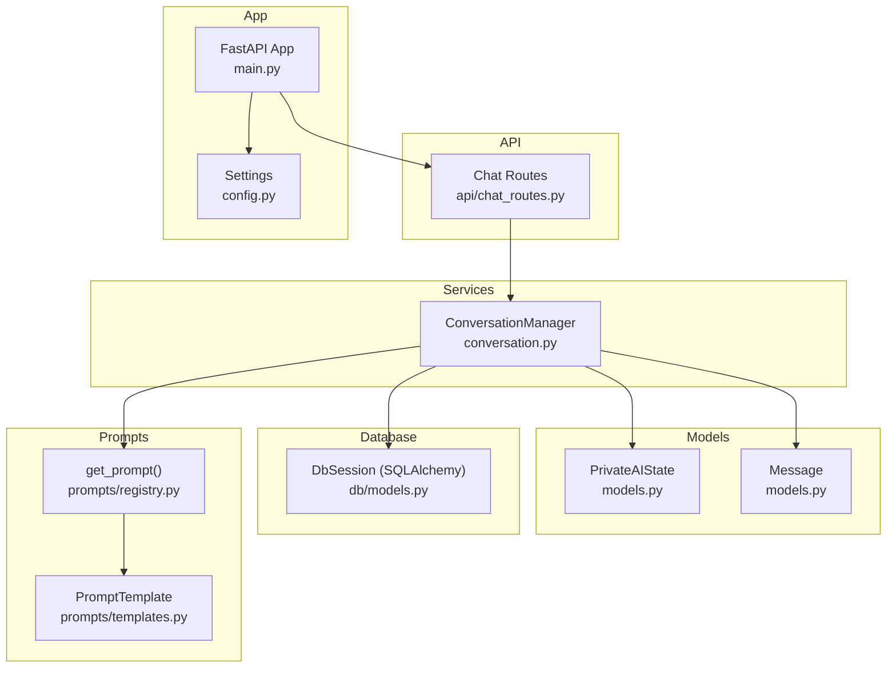
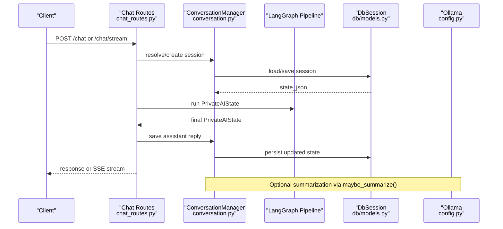
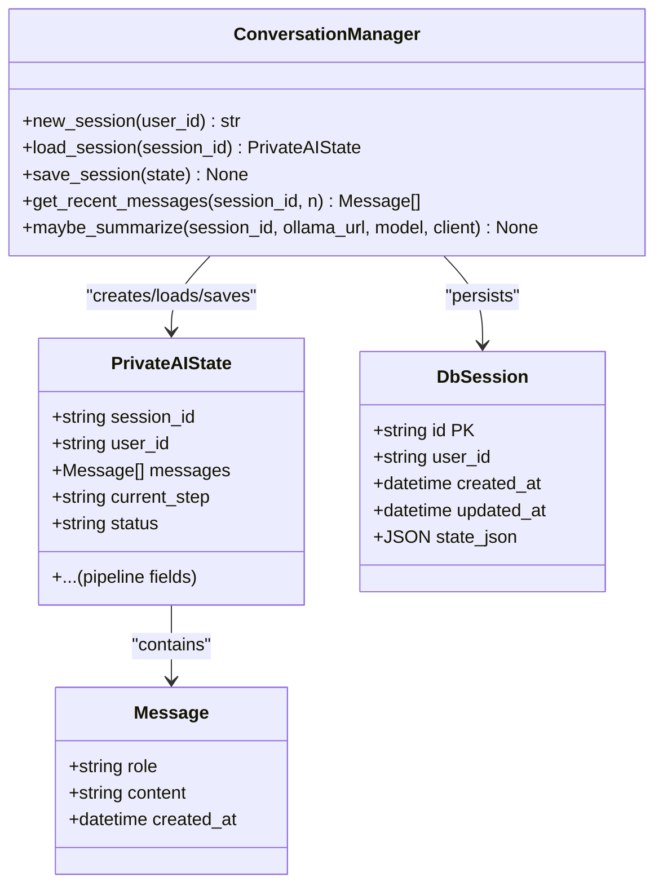
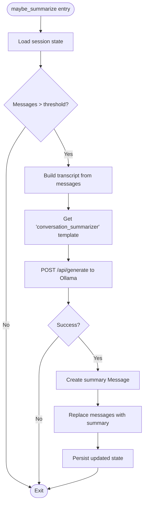
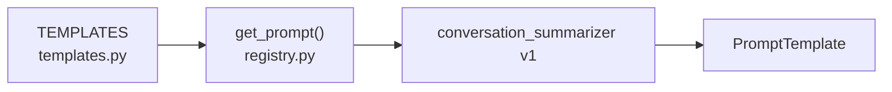
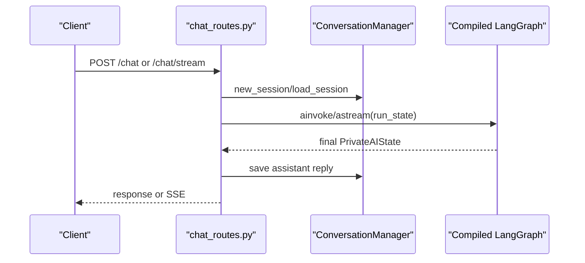
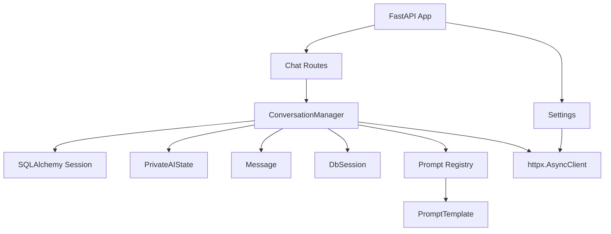

# Conversation Service

<cite>
**Referenced Files in This Document**
- [conversation.py](file://safe4ai-pilot/app/services/conversation.py)
- [models.py](file://safe4ai-pilot/app/models.py)
- [models.py](file://safe4ai-pilot/app/db/models.py)
- [templates.py](file://safe4ai-pilot/app/prompts/templates.py)
- [registry.py](file://safe4ai-pilot/app/prompts/registry.py)
- [chat_routes.py](file://safe4ai-pilot/app/api/chat_routes.py)
- [main.py](file://safe4ai-pilot/app/main.py)
- [config.py](file://safe4ai-pilot/app/config.py)
- [test_conversation.py](file://safe4ai-pilot/tests/test_conversation.py)
- [test_agents.py](file://safe4ai-pilot/tests/test_agents.py)
</cite>

## Table of Contents
1. [Introduction](#introduction)
2. [Project Structure](#project-structure)
3. [Core Components](#core-components)
4. [Architecture Overview](#architecture-overview)
5. [Detailed Component Analysis](#detailed-component-analysis)
6. [Dependency Analysis](#dependency-analysis)
7. [Performance Considerations](#performance-considerations)
8. [Troubleshooting Guide](#troubleshooting-guide)
9. [Conclusion](#conclusion)

## Introduction
This document describes the conversation service responsible for chat session lifecycle management, message handling, and state persistence. It focuses on the ConversationManager class, which creates, loads, and saves sessions backed by a relational database, enforces state validation and cleanup, and optionally summarizes long conversations using an external LLM via Ollama. It also explains the integration with the prompt template system and how the service participates in the broader chat pipeline.

## Project Structure
The conversation service spans several modules:
- Services: session management and summarization logic
- Models: Pydantic models for messages and state
- Database: ORM models for sessions and related entities
- Prompts: prompt templates and registry
- API: chat endpoints that orchestrate session creation/loading and persist assistant replies
- Application: configuration and runtime initialization

**Diagram sources**
- [conversation.py:26-117](file://safe4ai-pilot/app/services/conversation.py#L26-L117)
- [models.py:7-95](file://safe4ai-pilot/app/models.py#L7-L95)
- [models.py:65-73](file://safe4ai-pilot/app/db/models.py#L65-L73)
- [templates.py:4-81](file://safe4ai-pilot/app/prompts/templates.py#L4-L81)
- [registry.py:4-14](file://safe4ai-pilot/app/prompts/registry.py#L4-L14)
- [chat_routes.py:59-148](file://safe4ai-pilot/app/api/chat_routes.py#L59-L148)
- [config.py:7-47](file://safe4ai-pilot/app/config.py#L7-L47)
- [main.py:28-61](file://safe4ai-pilot/app/main.py#L28-L61)

**Section sources**
- [conversation.py:26-117](file://safe4ai-pilot/app/services/conversation.py#L26-L117)
- [models.py:7-95](file://safe4ai-pilot/app/models.py#L7-L95)
- [models.py:65-73](file://safe4ai-pilot/app/db/models.py#L65-L73)
- [templates.py:4-81](file://safe4ai-pilot/app/prompts/templates.py#L4-L81)
- [registry.py:4-14](file://safe4ai-pilot/app/prompts/registry.py#L4-L14)
- [chat_routes.py:59-148](file://safe4ai-pilot/app/api/chat_routes.py#L59-L148)
- [config.py:7-47](file://safe4ai-pilot/app/config.py#L7-L47)
- [main.py:28-61](file://safe4ai-pilot/app/main.py#L28-L61)

## Core Components
- ConversationManager: orchestrates session creation, loading, saving, recent message retrieval, and optional summarization.
- PrivateAIState: the canonical session state model, including messages and auxiliary fields for the RAG pipeline.
- Message: typed message model with role, content, and timestamps.
- DbSession: SQLAlchemy ORM model representing persisted sessions.
- Prompt registry and templates: provide templated prompts for summarization and other steps.

Key responsibilities:
- Session creation: generates a UUID, initializes state, persists to DB.
- Session loading: retrieves and validates state; raises explicit errors for missing or invalid states.
- Session saving: strips control characters, enforces size limits, persists updates.
- Summarization: when conversation length exceeds a threshold, builds a summarization prompt and posts to Ollama; replaces history with a single summary message.
- Recent messages: returns the most recent N messages for quick inspection.

**Section sources**
- [conversation.py:30-73](file://safe4ai-pilot/app/services/conversation.py#L30-L73)
- [conversation.py:75-117](file://safe4ai-pilot/app/services/conversation.py#L75-L117)
- [models.py:49-95](file://safe4ai-pilot/app/models.py#L49-L95)
- [models.py:7-11](file://safe4ai-pilot/app/models.py#L7-L11)
- [models.py:65-73](file://safe4ai-pilot/app/db/models.py#L65-L73)
- [templates.py:46-54](file://safe4ai-pilot/app/prompts/templates.py#L46-L54)
- [registry.py:4-14](file://safe4ai-pilot/app/prompts/registry.py#L4-L14)

## Architecture Overview
The conversation service integrates with the chat API and the compiled LangGraph pipeline. The chat endpoints resolve or create a session, prepare run state, invoke the graph, and persist the assistant reply. Summarization can be triggered externally or during maintenance.

**Diagram sources**
- [chat_routes.py:59-148](file://safe4ai-pilot/app/api/chat_routes.py#L59-L148)
- [conversation.py:30-73](file://safe4ai-pilot/app/services/conversation.py#L30-L73)
- [models.py:65-73](file://safe4ai-pilot/app/db/models.py#L65-L73)
- [config.py:10-11](file://safe4ai-pilot/app/config.py#L10-L11)

## Detailed Component Analysis

### ConversationManager
Responsibilities:
- new_session: creates a new session ID, initializes PrivateAIState, writes to DbSession.
- load_session: fetches DbSession, decodes state_json, constructs PrivateAIState with validation.
- save_session: cleans content, validates size, persists to DB.
- get_recent_messages: returns the last N messages from the loaded state.
- maybe_summarize: builds a summarization prompt from conversation history and posts to Ollama; replaces history with a summary message.

**Diagram sources**
- [conversation.py:26-117](file://safe4ai-pilot/app/services/conversation.py#L26-L117)
- [models.py:49-95](file://safe4ai-pilot/app/models.py#L49-L95)
- [models.py:7-11](file://safe4ai-pilot/app/models.py#L7-L11)
- [models.py:65-73](file://safe4ai-pilot/app/db/models.py#L65-L73)

**Section sources**
- [conversation.py:26-117](file://safe4ai-pilot/app/services/conversation.py#L26-L117)
- [models.py:49-95](file://safe4ai-pilot/app/models.py#L49-L95)
- [models.py:7-11](file://safe4ai-pilot/app/models.py#L7-L11)
- [models.py:65-73](file://safe4ai-pilot/app/db/models.py#L65-L73)

### Summarization Workflow
When the number of messages exceeds a threshold, the service:
- Loads the current state
- Builds a conversation transcript
- Retrieves the summarization prompt template
- Calls Ollama’s generate endpoint
- On success, replaces the message history with a single summary message and persists

**Diagram sources**
- [conversation.py:75-117](file://safe4ai-pilot/app/services/conversation.py#L75-L117)
- [templates.py:46-54](file://safe4ai-pilot/app/prompts/templates.py#L46-L54)
- [config.py:10-11](file://safe4ai-pilot/app/config.py#L10-L11)

**Section sources**
- [conversation.py:75-117](file://safe4ai-pilot/app/services/conversation.py#L75-L117)
- [templates.py:46-54](file://safe4ai-pilot/app/prompts/templates.py#L46-L54)
- [config.py:10-11](file://safe4ai-pilot/app/config.py#L10-L11)

### Prompt Template System
- Templates are defined centrally and registered by name and version.
- The summarization prompt template expects a variable named “conversation”.
- The registry resolves the appropriate template or raises a KeyError if not found.

**Diagram sources**
- [templates.py:12-54](file://safe4ai-pilot/app/prompts/templates.py#L12-L54)
- [registry.py:4-14](file://safe4ai-pilot/app/prompts/registry.py#L4-L14)

**Section sources**
- [templates.py:12-54](file://safe4ai-pilot/app/prompts/templates.py#L12-L54)
- [registry.py:4-14](file://safe4ai-pilot/app/prompts/registry.py#L4-L14)

### Chat API Integration
- The chat endpoints resolve or create a session, construct run state, invoke the graph, and persist the assistant reply.
- They handle rate limiting, validation, and streaming responses.

**Diagram sources**
- [chat_routes.py:59-148](file://safe4ai-pilot/app/api/chat_routes.py#L59-L148)
- [conversation.py:30-73](file://safe4ai-pilot/app/services/conversation.py#L30-L73)

**Section sources**
- [chat_routes.py:59-148](file://safe4ai-pilot/app/api/chat_routes.py#L59-L148)
- [conversation.py:30-73](file://safe4ai-pilot/app/services/conversation.py#L30-L73)

## Dependency Analysis
- ConversationManager depends on:
  - SQLAlchemy Session for DB operations
  - PrivateAIState and Message for state modeling
  - DbSession for persistence
  - Prompt registry for summarization templates
  - httpx for Ollama integration
- Chat routes depend on ConversationManager and the compiled LangGraph pipeline.
- Application configuration supplies Ollama base URL and model name.

**Diagram sources**
- [conversation.py:26-117](file://safe4ai-pilot/app/services/conversation.py#L26-L117)
- [models.py:49-95](file://safe4ai-pilot/app/models.py#L49-L95)
- [models.py:7-11](file://safe4ai-pilot/app/models.py#L7-L11)
- [models.py:65-73](file://safe4ai-pilot/app/db/models.py#L65-L73)
- [registry.py:4-14](file://safe4ai-pilot/app/prompts/registry.py#L4-L14)
- [templates.py:4-81](file://safe4ai-pilot/app/prompts/templates.py#L4-L81)
- [chat_routes.py:59-148](file://safe4ai-pilot/app/api/chat_routes.py#L59-L148)
- [main.py:28-61](file://safe4ai-pilot/app/main.py#L28-L61)
- [config.py:7-47](file://safe4ai-pilot/app/config.py#L7-L47)

**Section sources**
- [conversation.py:26-117](file://safe4ai-pilot/app/services/conversation.py#L26-L117)
- [models.py:49-95](file://safe4ai-pilot/app/models.py#L49-L95)
- [models.py:7-11](file://safe4ai-pilot/app/models.py#L7-L11)
- [models.py:65-73](file://safe4ai-pilot/app/db/models.py#L65-L73)
- [registry.py:4-14](file://safe4ai-pilot/app/prompts/registry.py#L4-L14)
- [templates.py:4-81](file://safe4ai-pilot/app/prompts/templates.py#L4-L81)
- [chat_routes.py:59-148](file://safe4ai-pilot/app/api/chat_routes.py#L59-L148)
- [main.py:28-61](file://safe4ai-pilot/app/main.py#L28-L61)
- [config.py:7-47](file://safe4ai-pilot/app/config.py#L7-L47)

## Performance Considerations
- Size limits: The service enforces a strict upper bound on serialized state size to prevent oversized JSON payloads. Saving fails early if the limit is exceeded.
- Control character stripping: Removes unsafe control characters from message content to reduce storage bloat and avoid encoding issues.
- Summarization threshold: Summarization is only attempted when the conversation exceeds a configured threshold, minimizing unnecessary LLM calls.
- Streaming and caching: The chat endpoints support streaming responses and rely on a compiled LangGraph pipeline to avoid repeated graph compilation overhead.
- Pre-warming: The application pre-warms Ollama to reduce cold-start latency for the first summarization requests.

Practical tips:
- Monitor session sizes and consider proactively truncating or summarizing long histories.
- Use the recent messages helper to avoid loading entire histories when only a subset is needed.
- Configure Ollama timeouts appropriately to balance responsiveness and reliability.

**Section sources**
- [conversation.py:17-19](file://safe4ai-pilot/app/services/conversation.py#L17-L19)
- [conversation.py:56-69](file://safe4ai-pilot/app/services/conversation.py#L56-L69)
- [conversation.py:84-86](file://safe4ai-pilot/app/services/conversation.py#L84-L86)
- [chat_routes.py:176-250](file://safe4ai-pilot/app/api/chat_routes.py#L176-L250)
- [main.py:104-116](file://safe4ai-pilot/app/main.py#L104-L116)

## Troubleshooting Guide
Common issues and resolutions:
- Session not found: Loading a session ID that does not exist raises a KeyError. Ensure the session ID is valid and created by the service.
- Invalid session state: If state_json cannot be parsed into PrivateAIState, a ValueError is raised. Validate that the stored state conforms to the model schema.
- Control characters in content: Content is sanitized on save; unexpected characters may indicate upstream injection. Verify input sanitization at the edges.
- Size limit exceeded: Saving fails if the serialized state exceeds the configured byte limit. Truncate messages or trigger summarization before saving.
- Summarization failures: If Ollama is unreachable or returns an error, summarization is skipped silently. Check connectivity and model availability.

Validation and tests:
- Unit tests cover session creation, loading, saving, control character stripping, and recent message retrieval.
- Integration tests exercise summarization via a mocked Ollama transport.

**Section sources**
- [conversation.py:42-50](file://safe4ai-pilot/app/services/conversation.py#L42-L50)
- [conversation.py:52-69](file://safe4ai-pilot/app/services/conversation.py#L52-L69)
- [test_conversation.py:50-83](file://safe4ai-pilot/tests/test_conversation.py#L50-L83)
- [test_conversation.py:85-117](file://safe4ai-pilot/tests/test_conversation.py#L85-L117)
- [test_agents.py:307-330](file://safe4ai-pilot/tests/test_agents.py#L307-L330)

## Conclusion
The conversation service provides robust session lifecycle management with strong validation and cleanup guarantees. It integrates cleanly with the chat API and the LangGraph pipeline, supports optional summarization via Ollama, and maintains a compact, validated state model. By enforcing size limits, sanitizing content, and offering targeted helpers like recent message retrieval, it balances correctness, performance, and maintainability for long-running chat sessions.