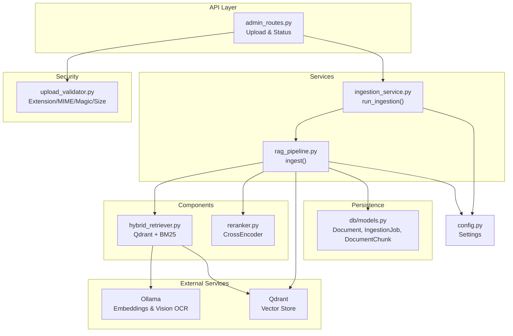
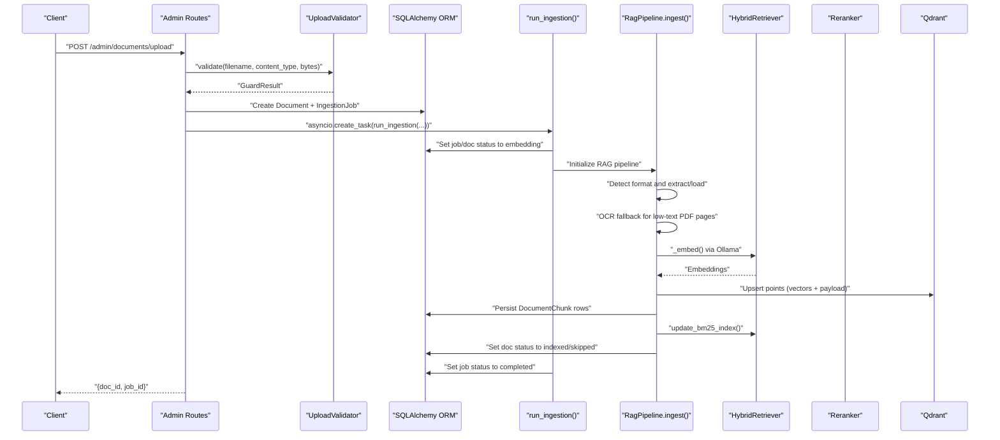
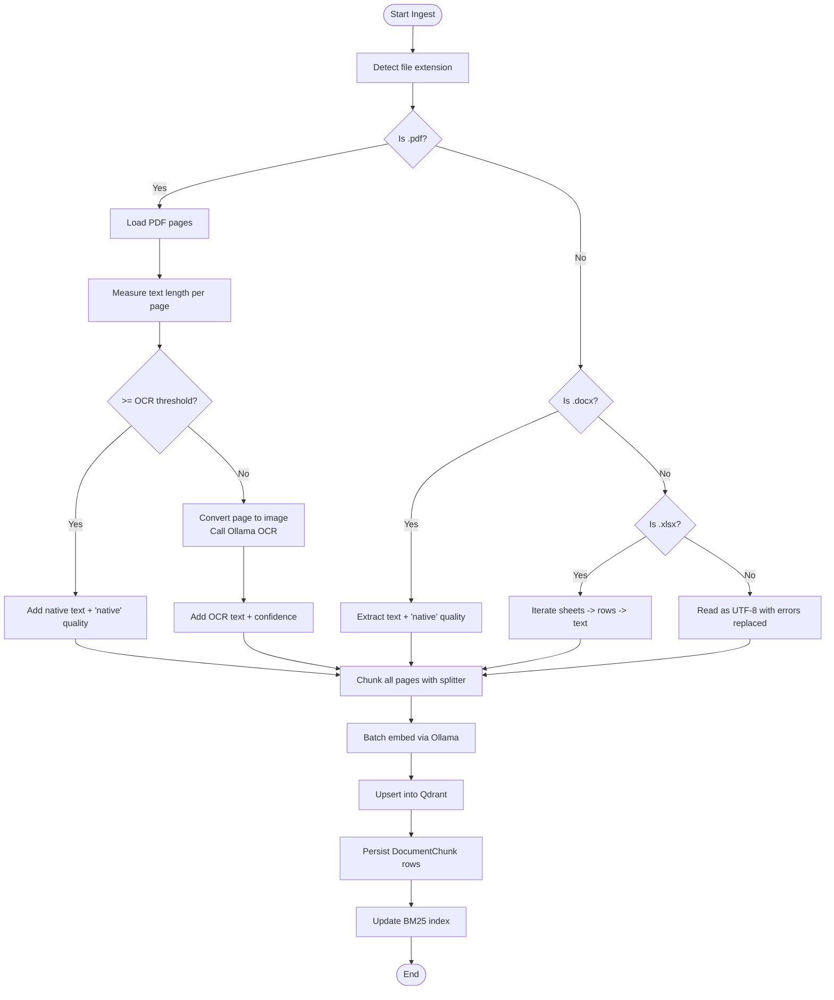
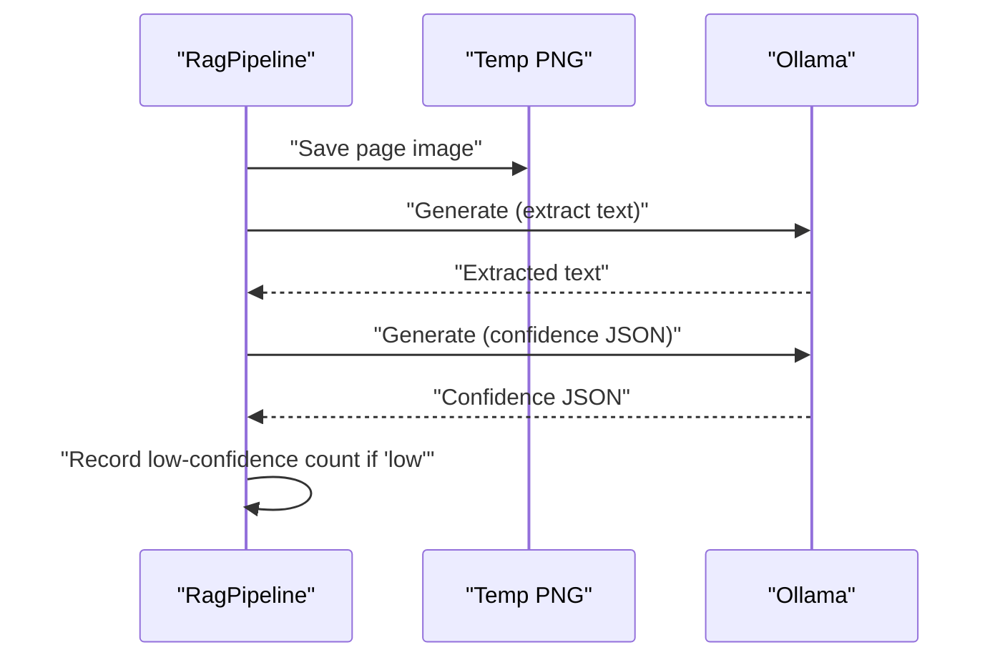
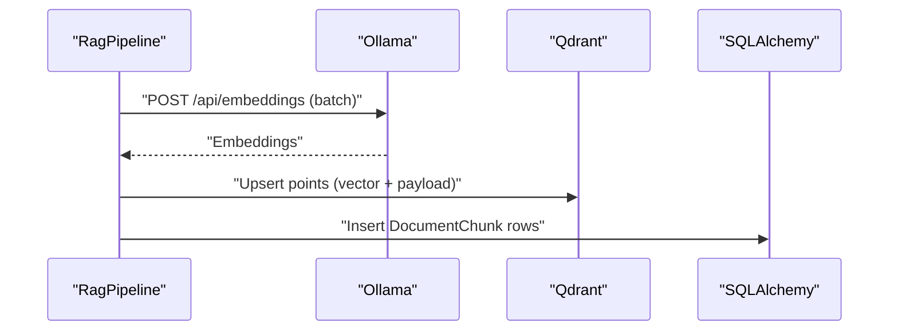
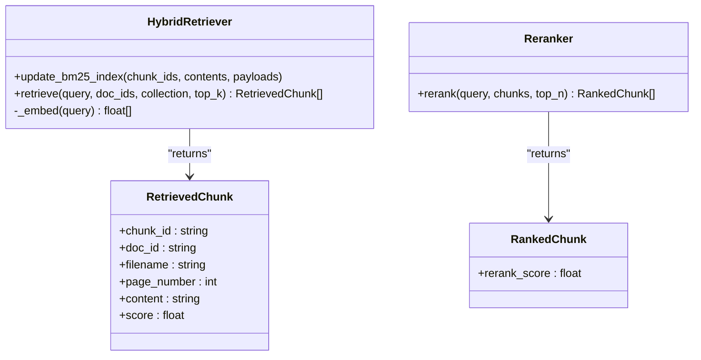
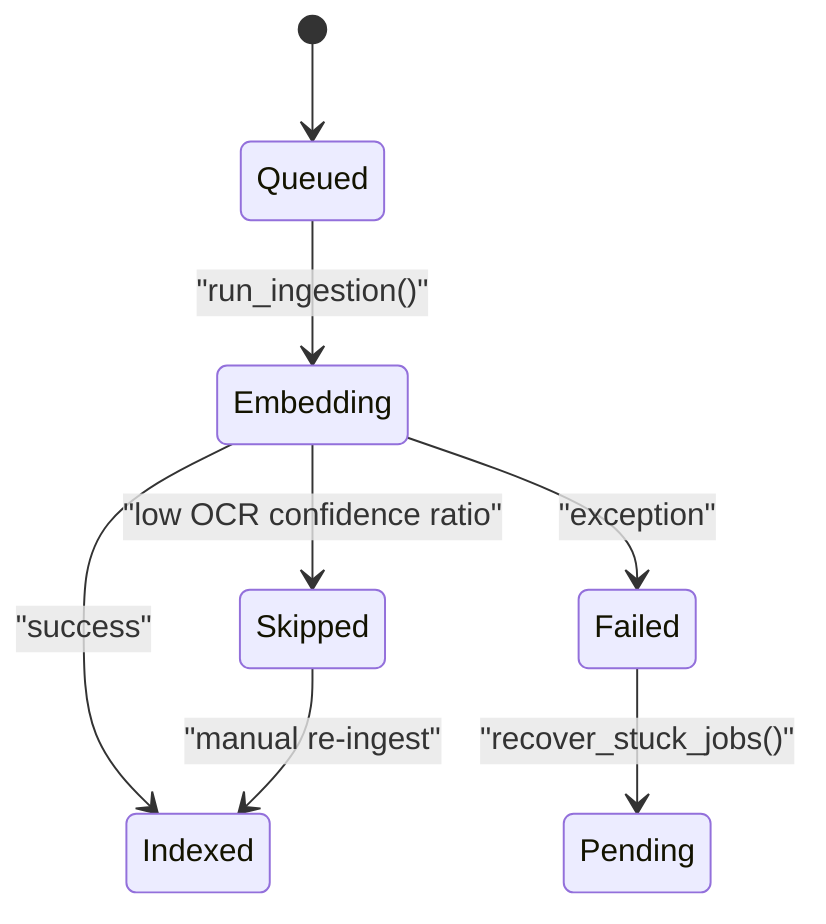
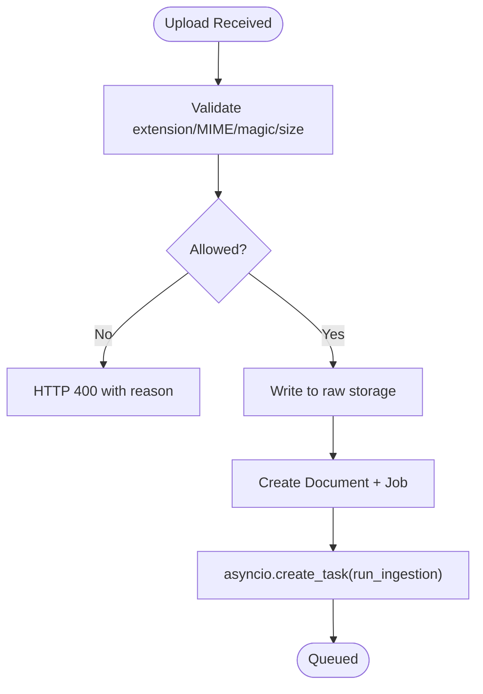
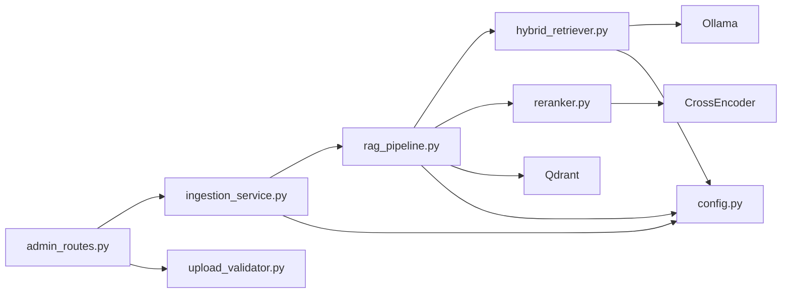

# Ingestion Service

<cite>
**Referenced Files in This Document**
- [ingestion_service.py](file://safe4ai-pilot/app/services/ingestion_service.py)
- [rag_pipeline.py](file://safe4ai-pilot/app/services/rag_pipeline.py)
- [hybrid_retriever.py](file://safe4ai-pilot/app/components/hybrid_retriever.py)
- [reranker.py](file://safe4ai-pilot/app/components/reranker.py)
- [upload_validator.py](file://safe4ai-pilot/app/security/upload_validator.py)
- [admin_routes.py](file://safe4ai-pilot/app/api/admin_routes.py)
- [models.py](file://safe4ai-pilot/app/models.py)
- [db/models.py](file://safe4ai-pilot/app/db/models.py)
- [config.py](file://safe4ai-pilot/app/config.py)
- [main.py](file://safe4ai-pilot/app/main.py)
</cite>

## Table of Contents
1. [Introduction](#introduction)
2. [Project Structure](#project-structure)
3. [Core Components](#core-components)
4. [Architecture Overview](#architecture-overview)
5. [Detailed Component Analysis](#detailed-component-analysis)
6. [Dependency Analysis](#dependency-analysis)
7. [Performance Considerations](#performance-considerations)
8. [Troubleshooting Guide](#troubleshooting-guide)
9. [Conclusion](#conclusion)
10. [Appendices](#appendices)

## Introduction
This document describes the document ingestion service responsible for multi-format document processing, OCR integration, embedding generation, and indexing into a vector database. It explains the end-to-end ingestion pipeline from file upload through processing to vector storage, supported formats, OCR capabilities, text extraction mechanisms, embedding generation, and integration with Qdrant. It also covers the document status tracking system, processing queues, error handling for corrupted or unsupported files, and practical examples of preprocessing, metadata extraction, and batch processing workflows. Finally, it documents the relationships with external services such as Ollama (for embeddings and OCR) and Qdrant.

## Project Structure
The ingestion service spans several modules:
- API layer: upload and status endpoints that orchestrate ingestion.
- Security: upload validation enforcing extensions, MIME types, magic bytes, and size limits.
- Services: ingestion orchestration and the RAG pipeline performing extraction, OCR, chunking, embedding, and vector upsert.
- Components: hybrid retriever (dense vectors via Qdrant + sparse BM25) and reranker (cross-encoder).
- Persistence: SQLAlchemy models for documents, ingestion jobs, and document chunks.
- Configuration: runtime settings for external services and limits.

**Diagram sources**
- [admin_routes.py:67-121](file://safe4ai-pilot/app/api/admin_routes.py#L67-L121)
- [upload_validator.py:24-73](file://safe4ai-pilot/app/security/upload_validator.py#L24-L73)
- [ingestion_service.py:21-88](file://safe4ai-pilot/app/services/ingestion_service.py#L21-L88)
- [rag_pipeline.py:62-150](file://safe4ai-pilot/app/services/rag_pipeline.py#L62-L150)
- [hybrid_retriever.py:14-145](file://safe4ai-pilot/app/components/hybrid_retriever.py#L14-L145)
- [reranker.py:11-36](file://safe4ai-pilot/app/components/reranker.py#L11-L36)
- [db/models.py:75-167](file://safe4ai-pilot/app/db/models.py#L75-L167)
- [config.py:7-48](file://safe4ai-pilot/app/config.py#L7-L48)

**Section sources**
- [admin_routes.py:67-121](file://safe4ai-pilot/app/api/admin_routes.py#L67-L121)
- [upload_validator.py:13-21](file://safe4ai-pilot/app/security/upload_validator.py#L13-L21)
- [ingestion_service.py:21-88](file://safe4ai-pilot/app/services/ingestion_service.py#L21-L88)
- [rag_pipeline.py:34-57](file://safe4ai-pilot/app/services/rag_pipeline.py#L34-L57)
- [hybrid_retriever.py:14-29](file://safe4ai-pilot/app/components/hybrid_retriever.py#L14-L29)
- [reranker.py:11-14](file://safe4ai-pilot/app/components/reranker.py#L11-L14)
- [db/models.py:26-167](file://safe4ai-pilot/app/db/models.py#L26-L167)
- [config.py:7-48](file://safe4ai-pilot/app/config.py#L7-L48)

## Core Components
- Ingestion orchestration: Background task that updates job/document statuses, initializes the RAG pipeline, and coordinates embedding and vector upsert.
- RAG pipeline: Handles format-specific extraction, OCR fallback, chunking, batch embedding, vector upsert, chunk persistence, and BM25 index updates.
- Hybrid retriever: Dense retrieval via Qdrant vectors and sparse retrieval via BM25, fused by Reciprocal Rank Fusion.
- Reranker: Cross-encoder reranking of retrieved chunks.
- Upload validator: Enforces allowed file types, MIME types, magic bytes, and size limits.
- Status tracking: Document and ingestion job states tracked in the database.

**Section sources**
- [ingestion_service.py:21-88](file://safe4ai-pilot/app/services/ingestion_service.py#L21-L88)
- [rag_pipeline.py:62-150](file://safe4ai-pilot/app/services/rag_pipeline.py#L62-L150)
- [hybrid_retriever.py:14-145](file://safe4ai-pilot/app/components/hybrid_retriever.py#L14-L145)
- [reranker.py:11-36](file://safe4ai-pilot/app/components/reranker.py#L11-L36)
- [upload_validator.py:24-73](file://safe4ai-pilot/app/security/upload_validator.py#L24-L73)
- [db/models.py:26-167](file://safe4ai-pilot/app/db/models.py#L26-L167)

## Architecture Overview
The ingestion pipeline is initiated by an upload endpoint, validated by the upload validator, persisted to the database, and executed asynchronously by the ingestion service. The RAG pipeline performs extraction and OCR, generates embeddings via Ollama, chunks the content, upserts vectors into Qdrant, persists chunk records, updates BM25 index, and transitions document status.

**Diagram sources**
- [admin_routes.py:67-121](file://safe4ai-pilot/app/api/admin_routes.py#L67-L121)
- [upload_validator.py:24-73](file://safe4ai-pilot/app/security/upload_validator.py#L24-L73)
- [ingestion_service.py:21-88](file://safe4ai-pilot/app/services/ingestion_service.py#L21-L88)
- [rag_pipeline.py:62-150](file://safe4ai-pilot/app/services/rag_pipeline.py#L62-L150)
- [hybrid_retriever.py:43-56](file://safe4ai-pilot/app/components/hybrid_retriever.py#L43-L56)

## Detailed Component Analysis

### Supported File Formats and Extraction Mechanisms
- PDF: Extract text per page; if text length is below a threshold, convert the single page to an image and apply vision OCR via Ollama. Pages are stored with page numbers and OCR quality indicators.
- DOCX: Native text extraction using a dedicated library.
- XLSX: Load worksheets, serialize rows to strings, and treat each sheet as a page.
- Other text-based formats: Read as UTF-8 with error replacement.

**Diagram sources**
- [rag_pipeline.py:62-150](file://safe4ai-pilot/app/services/rag_pipeline.py#L62-L150)
- [rag_pipeline.py:265-295](file://safe4ai-pilot/app/services/rag_pipeline.py#L265-L295)
- [rag_pipeline.py:297-307](file://safe4ai-pilot/app/services/rag_pipeline.py#L297-L307)
- [rag_pipeline.py:187-201](file://safe4ai-pilot/app/services/rag_pipeline.py#L187-L201)

**Section sources**
- [rag_pipeline.py:69-84](file://safe4ai-pilot/app/services/rag_pipeline.py#L69-L84)
- [rag_pipeline.py:265-295](file://safe4ai-pilot/app/services/rag_pipeline.py#L265-L295)
- [rag_pipeline.py:297-307](file://safe4ai-pilot/app/services/rag_pipeline.py#L297-L307)
- [upload_validator.py:13-19](file://safe4ai-pilot/app/security/upload_validator.py#L13-L19)

### OCR Integration and Quality Gates
- Vision OCR is triggered when native text extraction yields fewer than a configured character threshold.
- Two Ollama generate calls are made per page: one to extract text and another to assess confidence (high/medium/low) via structured JSON parsing.
- Low-confidence pages contribute to a ratio that determines whether the document is marked for human review.

**Diagram sources**
- [rag_pipeline.py:203-249](file://safe4ai-pilot/app/services/rag_pipeline.py#L203-L249)

**Section sources**
- [rag_pipeline.py:273-294](file://safe4ai-pilot/app/services/rag_pipeline.py#L273-L294)
- [rag_pipeline.py:203-249](file://safe4ai-pilot/app/services/rag_pipeline.py#L203-L249)

### Embedding Generation and Vector Storage
- Embeddings are generated in batches using Ollama’s embeddings API.
- Vectors are upserted into Qdrant with payloads containing document identifiers, filenames, page numbers, chunk indices, content previews, and OCR quality.
- DocumentChunk rows are persisted to the database with content previews and Qdrant point IDs.

**Diagram sources**
- [rag_pipeline.py:187-201](file://safe4ai-pilot/app/services/rag_pipeline.py#L187-L201)
- [rag_pipeline.py:109-137](file://safe4ai-pilot/app/services/rag_pipeline.py#L109-L137)
- [hybrid_retriever.py:43-56](file://safe4ai-pilot/app/components/hybrid_retriever.py#L43-L56)

**Section sources**
- [rag_pipeline.py:187-201](file://safe4ai-pilot/app/services/rag_pipeline.py#L187-L201)
- [rag_pipeline.py:109-137](file://safe4ai-pilot/app/services/rag_pipeline.py#L109-L137)

### Hybrid Retrieval and Reranking
- Dense retrieval: Queries are embedded via Ollama, matched against Qdrant vectors, returning chunk IDs and payloads.
- Sparse retrieval: BM25 ranking over indexed chunks; optionally filtered by document IDs.
- Fusion: Reciprocal Rank Fusion combines dense and sparse ranks to produce a final ordering.
- Reranking: Cross-encoder model reranks top candidates to refine relevance.

**Diagram sources**
- [hybrid_retriever.py:14-145](file://safe4ai-pilot/app/components/hybrid_retriever.py#L14-L145)
- [reranker.py:11-36](file://safe4ai-pilot/app/components/reranker.py#L11-L36)
- [models.py:13-36](file://safe4ai-pilot/app/models.py#L13-L36)

**Section sources**
- [hybrid_retriever.py:57-144](file://safe4ai-pilot/app/components/hybrid_retriever.py#L57-L144)
- [reranker.py:15-35](file://safe4ai-pilot/app/components/reranker.py#L15-L35)
- [models.py:13-36](file://safe4ai-pilot/app/models.py#L13-L36)

### Document Status Tracking and Queues
- Document and IngestionJob statuses are tracked in the database with enums for queued, embedding, indexed, failed, skipped, pending, completed.
- On startup, stuck jobs (waiting in embedding beyond a threshold) are recovered and reset to queued.
- The ingestion service updates statuses atomically within a dedicated DB session.

**Diagram sources**
- [db/models.py:26-39](file://safe4ai-pilot/app/db/models.py#L26-L39)
- [ingestion_service.py:90-112](file://safe4ai-pilot/app/services/ingestion_service.py#L90-L112)
- [ingestion_service.py:41-69](file://safe4ai-pilot/app/services/ingestion_service.py#L41-L69)

**Section sources**
- [db/models.py:26-39](file://safe4ai-pilot/app/db/models.py#L26-L39)
- [ingestion_service.py:90-112](file://safe4ai-pilot/app/services/ingestion_service.py#L90-L112)
- [ingestion_service.py:41-69](file://safe4ai-pilot/app/services/ingestion_service.py#L41-L69)

### Upload Validation and Error Handling
- Allowed extensions and MIME types are enforced; magic bytes are verified; size is checked against a configurable maximum.
- Upload endpoint rejects invalid files early and returns descriptive reasons.
- During ingestion, exceptions are caught, job and document states are updated, and partial cleanup is attempted.

**Diagram sources**
- [upload_validator.py:24-73](file://safe4ai-pilot/app/security/upload_validator.py#L24-L73)
- [admin_routes.py:67-121](file://safe4ai-pilot/app/api/admin_routes.py#L67-L121)
- [ingestion_service.py:72-87](file://safe4ai-pilot/app/services/ingestion_service.py#L72-L87)

**Section sources**
- [upload_validator.py:24-73](file://safe4ai-pilot/app/security/upload_validator.py#L24-L73)
- [admin_routes.py:67-121](file://safe4ai-pilot/app/api/admin_routes.py#L67-L121)
- [ingestion_service.py:72-87](file://safe4ai-pilot/app/services/ingestion_service.py#L72-L87)

### Practical Examples
- Preprocessing: PDFs with minimal text are automatically converted to images and passed through vision OCR; XLSX sheets are flattened to text with tab/newline separators.
- Metadata extraction: Payloads include doc_id, filename, page_number, chunk_index, content preview, and OCR quality; these support citations and provenance.
- Batch processing: Embeddings are computed in fixed-size batches to balance throughput and memory; Qdrant upserts are performed in bulk.

**Section sources**
- [rag_pipeline.py:265-295](file://safe4ai-pilot/app/services/rag_pipeline.py#L265-L295)
- [rag_pipeline.py:297-307](file://safe4ai-pilot/app/services/rag_pipeline.py#L297-L307)
- [rag_pipeline.py:187-201](file://safe4ai-pilot/app/services/rag_pipeline.py#L187-L201)
- [rag_pipeline.py:109-137](file://safe4ai-pilot/app/services/rag_pipeline.py#L109-L137)

## Dependency Analysis
Key dependencies and relationships:
- API depends on UploadValidator and the ingestion service.
- Ingestion service depends on the RAG pipeline and database models.
- RAG pipeline depends on HybridRetriever, Reranker, Qdrant, and Ollama.
- HybridRetriever depends on Qdrant and Ollama; it maintains a local BM25 index.
- Reranker depends on a cross-encoder model.
- Configuration supplies URLs and model names to all components.

**Diagram sources**
- [admin_routes.py:39-40](file://safe4ai-pilot/app/api/admin_routes.py#L39-L40)
- [ingestion_service.py:46-62](file://safe4ai-pilot/app/services/ingestion_service.py#L46-L62)
- [rag_pipeline.py:34-57](file://safe4ai-pilot/app/services/rag_pipeline.py#L34-L57)
- [hybrid_retriever.py:14-29](file://safe4ai-pilot/app/components/hybrid_retriever.py#L14-L29)
- [reranker.py:11-14](file://safe4ai-pilot/app/components/reranker.py#L11-L14)
- [config.py:7-48](file://safe4ai-pilot/app/config.py#L7-L48)

**Section sources**
- [admin_routes.py:39-40](file://safe4ai-pilot/app/api/admin_routes.py#L39-L40)
- [ingestion_service.py:46-62](file://safe4ai-pilot/app/services/ingestion_service.py#L46-L62)
- [rag_pipeline.py:34-57](file://safe4ai-pilot/app/services/rag_pipeline.py#L34-L57)
- [hybrid_retriever.py:14-29](file://safe4ai-pilot/app/components/hybrid_retriever.py#L14-L29)
- [reranker.py:11-14](file://safe4ai-pilot/app/components/reranker.py#L11-L14)
- [config.py:7-48](file://safe4ai-pilot/app/config.py#L7-L48)

## Performance Considerations
- Batch embedding: Embeddings are computed in fixed-size batches to reduce overhead and manage memory.
- Chunking strategy: RecursiveCharacterTextSplitter balances context retention with vector storage costs.
- OCR fallback: Only triggers on pages below a character threshold to minimize unnecessary OCR calls.
- Vector upsert: Bulk upsert minimizes network round-trips to Qdrant.
- Startup warm-up: Ollama is pre-warmed to avoid cold-start latency on first queries.

[No sources needed since this section provides general guidance]

## Troubleshooting Guide
Common issues and remedies:
- Stuck ingestion jobs: Recovered automatically on startup after a threshold; verify job timestamps and retry.
- OCR failures: Inspect low-confidence ratios; re-upload with higher DPI scans or clearer images.
- Vector upsert errors: Confirm Qdrant availability and collection existence; check payload sizes and keys.
- Embedding errors: Verify Ollama model availability and network connectivity; ensure embedding model name matches configuration.
- Upload rejections: Confirm file extension, declared MIME type, and magic bytes match allowed sets; check size limits.

**Section sources**
- [ingestion_service.py:90-112](file://safe4ai-pilot/app/services/ingestion_service.py#L90-L112)
- [admin_routes.py:274-290](file://safe4ai-pilot/app/api/admin_routes.py#L274-L290)
- [main.py:104-116](file://safe4ai-pilot/app/main.py#L104-L116)

## Conclusion
The ingestion service provides a robust, extensible pipeline for multi-format document processing, OCR integration, and vector indexing. It enforces strict upload validation, tracks document and job states, and integrates seamlessly with Ollama for embeddings and OCR and Qdrant for vector storage. The hybrid retriever and reranker further enhance retrieval quality, while batch processing and recovery mechanisms ensure reliability and scalability.

[No sources needed since this section summarizes without analyzing specific files]

## Appendices

### Configuration Reference
- External service URLs and model names are configured centrally and injected into components at runtime.

**Section sources**
- [config.py:7-48](file://safe4ai-pilot/app/config.py#L7-L48)

### Data Model Overview
- Documents, ingestion jobs, and document chunks define the persistence layer for ingestion lifecycle and provenance.

**Section sources**
- [db/models.py:75-167](file://safe4ai-pilot/app/db/models.py#L75-L167)