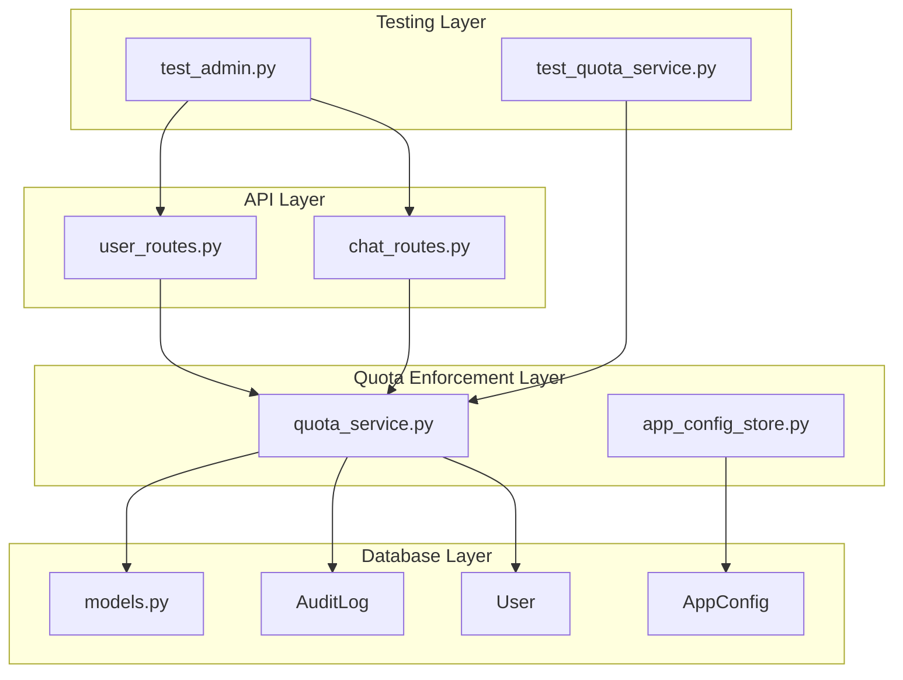
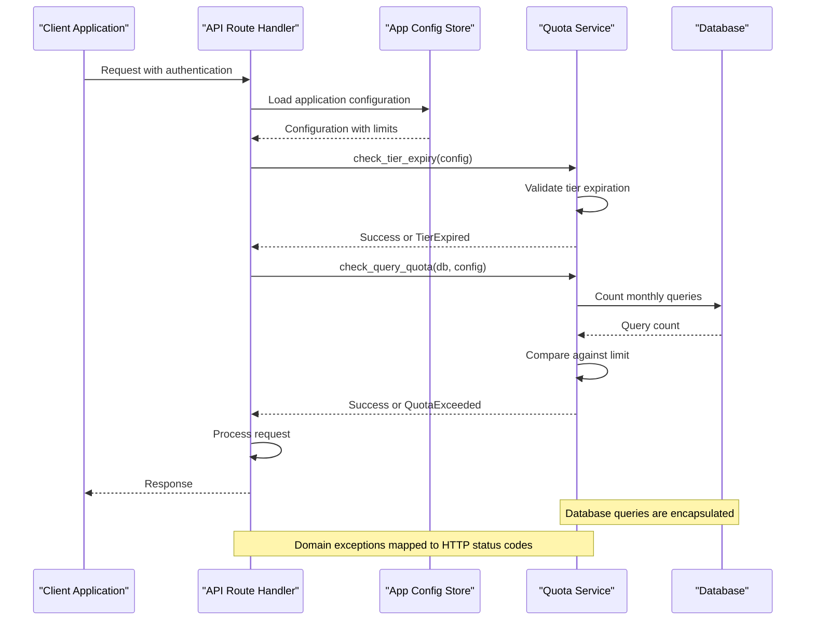
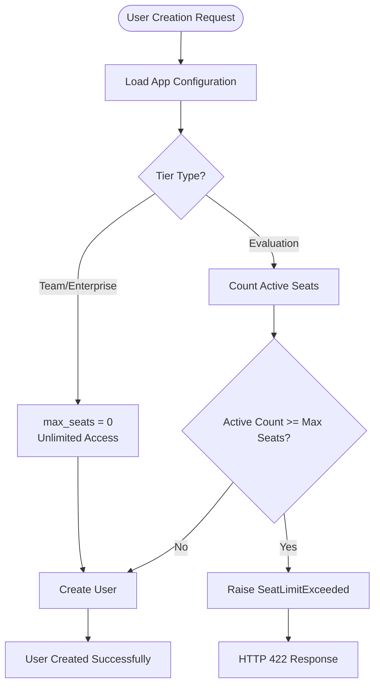
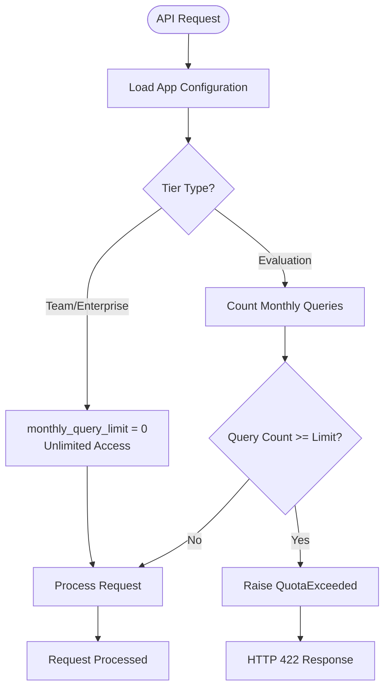
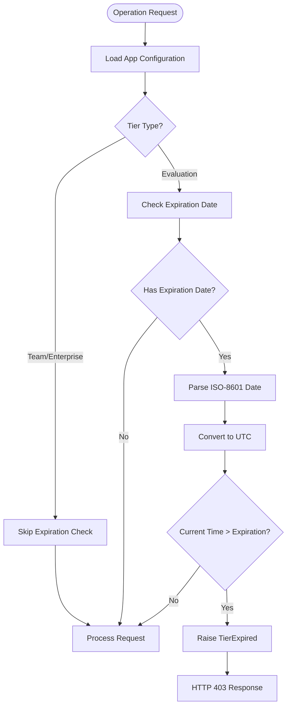
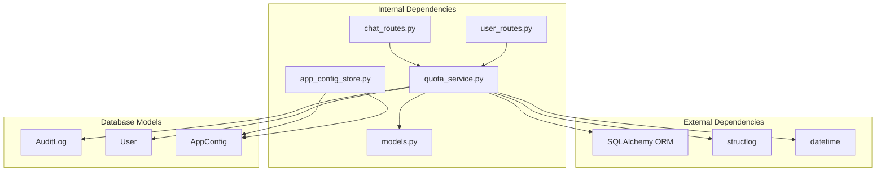

# Quota Enforcement Service

<cite>
**Referenced Files in This Document**
- [quota_service.py](file://safe4ai-pilot/app/services/quota_service.py)
- [models.py](file://safe4ai-pilot/app/db/models.py)
- [user_routes.py](file://safe4ai-pilot/app/api/user_routes.py)
- [chat_routes.py](file://safe4ai-pilot/app/api/chat_routes.py)
- [app_config_store.py](file://safe4ai-pilot/app/services/app_config_store.py)
- [test_quota_service.py](file://safe4ai-pilot/tests/test_quota_service.py)
- [test_admin.py](file://safe4ai-pilot/tests/test_admin.py)
</cite>

## Table of Contents
1. [Introduction](#introduction)
2. [Project Structure](#project-structure)
3. [Core Components](#core-components)
4. [Architecture Overview](#architecture-overview)
5. [Detailed Component Analysis](#detailed-component-analysis)
6. [Dependency Analysis](#dependency-analysis)
7. [Performance Considerations](#performance-considerations)
8. [Troubleshooting Guide](#troubleshooting-guide)
9. [Conclusion](#conclusion)

## Introduction

The Quota Enforcement Service is a critical component of the Private AI platform that manages usage limits and access controls for different user tiers. This service enforces three primary types of quotas: seat caps for user management, monthly query limits for API usage, and evaluation period expiration checks. The service operates independently of the web framework, using domain-specific exceptions that are later mapped to appropriate HTTP responses by the API layer.

The service is designed to support three distinct pricing tiers: evaluation, team, and enterprise, each with different enforcement behaviors and capabilities. It maintains separation of concerns by keeping database queries in dedicated counter functions while providing clean enforcement logic that can be tested independently.

## Project Structure

The quota enforcement system is organized across several key modules within the Private AI platform:

**Diagram sources**
- [quota_service.py:1-155](file://safe4ai-pilot/app/services/quota_service.py#L1-L155)
- [user_routes.py:1-119](file://safe4ai-pilot/app/api/user_routes.py#L1-L119)
- [chat_routes.py:1-200](file://safe4ai-pilot/app/api/chat_routes.py#L1-L200)
- [models.py:142-155](file://safe4ai-pilot/app/db/models.py#L142-L155)

**Section sources**
- [quota_service.py:1-155](file://safe4ai-pilot/app/services/quota_service.py#L1-L155)
- [models.py:1-214](file://safe4ai-pilot/app/db/models.py#L1-L214)

## Core Components

The Quota Enforcement Service consists of three primary enforcement mechanisms, each designed to handle specific usage scenarios:

### Domain Exceptions

The service defines three specialized exception types that represent different enforcement failures:

- **SeatLimitExceeded**: Raised when attempting to exceed the maximum number of active users
- **QuotaExceeded**: Raised when the monthly query limit has been reached
- **TierExpired**: Raised when an evaluation tier has passed its expiration date

### Counter Functions

The service provides two counter functions that encapsulate database query logic:

- **count_active_seats()**: Returns the number of currently active non-sentinel users
- **count_monthly_queries()**: Returns the count of chat queries in the current calendar month

### Enforcement Functions

Each enforcement function performs specific validation logic:

- **check_seat_limit()**: Validates user creation against seat capacity limits
- **check_query_quota()**: Validates API requests against monthly query limits
- **check_tier_expiry()**: Validates evaluation tier expiration dates

**Section sources**
- [quota_service.py:22-36](file://safe4ai-pilot/app/services/quota_service.py#L22-L36)
- [quota_service.py:43-80](file://safe4ai-pilot/app/services/quota_service.py#L43-L80)
- [quota_service.py:87-155](file://safe4ai-pilot/app/services/quota_service.py#L87-L155)

## Architecture Overview

The quota enforcement system follows a layered architecture pattern with clear separation between enforcement logic, data access, and presentation:

**Diagram sources**
- [user_routes.py:68-101](file://safe4ai-pilot/app/api/user_routes.py#L68-L101)
- [chat_routes.py:130-155](file://safe4ai-pilot/app/api/chat_routes.py#L130-L155)
- [app_config_store.py:82-102](file://safe4ai-pilot/app/services/app_config_store.py#L82-L102)

The architecture ensures that:

1. **Domain Logic Independence**: Enforcement functions operate without FastAPI dependencies
2. **Database Abstraction**: Query logic is encapsulated in dedicated counter functions
3. **Configuration Management**: Limits are centrally managed through the app configuration store
4. **Exception Handling**: Domain exceptions are mapped to appropriate HTTP responses

## Detailed Component Analysis

### Seat Limit Enforcement

The seat limit enforcement mechanism controls user creation based on active seat counts:

**Diagram sources**
- [user_routes.py:68-101](file://safe4ai-pilot/app/api/user_routes.py#L68-L101)
- [quota_service.py:87-101](file://safe4ai-pilot/app/services/quota_service.py#L87-L101)

The seat limit enforcement follows these rules:
- **Unlimited tiers**: Team and Enterprise tiers with `max_seats = 0` allow unlimited user creation
- **Evaluation tiers**: Active seat count is compared against configured limits
- **Zero limits**: Absent or zero `max_seats` values are treated as unlimited
- **Real-time counting**: Seat count is determined by querying active non-sentinel users

### Monthly Query Limit Enforcement

The monthly query limit enforcement controls API usage based on query volume:

**Diagram sources**
- [chat_routes.py:130-155](file://safe4ai-pilot/app/api/chat_routes.py#L130-L155)
- [quota_service.py:104-119](file://safe4ai-pilot/app/services/quota_service.py#L104-L119)

The monthly query enforcement includes:
- **Time-based filtering**: Only queries from the current calendar month are counted
- **Asynchronous processing**: Audit log entries are finalized asynchronously, potentially causing slight delays
- **Pre-flight validation**: Checks occur before LLM invocation to prevent unnecessary resource usage
- **Unlimited tiers**: Team and Enterprise tiers bypass query limits

### Tier Expiration Enforcement

The tier expiration enforcement validates evaluation period validity:

**Diagram sources**
- [quota_service.py:122-155](file://safe4ai-pilot/app/services/quota_service.py#L122-L155)

The expiration enforcement handles:
- **Tier-specific behavior**: Only evaluation tiers are subject to expiration
- **Timezone handling**: Supports naive and timezone-aware ISO-8601 dates
- **Upgrade protection**: Prevents locked-out access during tier upgrades
- **Logging**: Records expired tier events for observability

**Section sources**
- [quota_service.py:87-155](file://safe4ai-pilot/app/services/quota_service.py#L87-L155)
- [user_routes.py:68-101](file://safe4ai-pilot/app/api/user_routes.py#L68-L101)
- [chat_routes.py:130-155](file://safe4ai-pilot/app/api/chat_routes.py#L130-L155)

## Dependency Analysis

The quota enforcement service maintains minimal dependencies while providing comprehensive functionality:

**Diagram sources**
- [quota_service.py:8-14](file://safe4ai-pilot/app/services/quota_service.py#L8-L14)
- [models.py:142-155](file://safe4ai-pilot/app/db/models.py#L142-L155)

The dependency relationships demonstrate:
- **Minimal external dependencies**: Only essential libraries for logging and database operations
- **Internal cohesion**: Clear separation between enforcement logic and API integration
- **Database abstraction**: Models are encapsulated within the service layer
- **Configuration independence**: App configuration is accessed through a dedicated service

**Section sources**
- [quota_service.py:1-155](file://safe4ai-pilot/app/services/quota_service.py#L1-L155)
- [models.py:1-214](file://safe4ai-pilot/app/db/models.py#L1-L214)

## Performance Considerations

The quota enforcement service is designed with performance and scalability in mind:

### Database Query Optimization

- **Efficient counting**: Seat and query counts use optimized SQLAlchemy count() operations
- **Index utilization**: AuditLog timestamps and user activity fields are indexed for fast filtering
- **Minimal query overhead**: Counter functions encapsulate query logic to reduce duplication

### Asynchronous Processing Impact

The service acknowledges potential timing issues with audit log processing:

- **Query count lag**: Monthly query counts may lag by approximately one query due to asynchronous finalization
- **Recommendation**: For strict billing enforcement, consider implementing a dedicated transactional usage ledger
- **Monitoring**: Log warnings for any database-related errors to maintain system reliability

### Memory and Resource Management

- **Exception-driven flow**: Early termination on quota violations reduces unnecessary resource consumption
- **Lazy evaluation**: Configuration values are loaded only when needed
- **Minimal state**: Stateless functions ensure predictable memory usage

## Troubleshooting Guide

### Common Issues and Solutions

#### Seat Limit Exceeded Errors

**Symptoms**: User creation requests receive HTTP 422 responses with seat limit messages
**Causes**:
- Active user count equals or exceeds configured `max_seats`
- Evaluation tier with strict seat limits
- Database inconsistencies in user activation status

**Resolutions**:
- Increase `max_seats` configuration for the evaluation tier
- Deactivate unused users to free up seats
- Verify user activation status in the database

#### Monthly Query Limit Exceeded

**Symptoms**: API requests fail with quota exceeded messages
**Causes**:
- Current month's query count reaches configured limit
- Asynchronous audit log finalization delays
- Incorrect timezone handling in configuration

**Resolutions**:
- Upgrade to Team or Enterprise tier for unlimited queries
- Monitor query patterns and adjust limits accordingly
- Verify timezone settings for accurate monthly calculations

#### Tier Expiration Issues

**Symptoms**: Access blocked with expiration messages despite recent activity
**Causes**:
- Evaluation tier expiration date passed
- Incorrect timezone conversion in stored dates
- Stale expiration configuration after tier upgrades

**Resolutions**:
- Verify current tier configuration and expiration dates
- Ensure proper timezone handling for ISO-8601 dates
- Clear stale expiration dates when upgrading tiers

### Debugging and Monitoring

The service provides built-in logging for quota enforcement events:

- **Tier expiration blocking**: Logs when evaluation periods expire
- **Configuration loading**: Tracks app configuration retrieval
- **Error handling**: Captures and logs enforcement failures

**Section sources**
- [quota_service.py:14-155](file://safe4ai-pilot/app/services/quota_service.py#L14-L155)
- [test_quota_service.py:1-219](file://safe4ai-pilot/tests/test_quota_service.py#L1-L219)

## Conclusion

The Quota Enforcement Service provides a robust, scalable solution for managing usage limits and access controls in the Private AI platform. Its design emphasizes separation of concerns, testability, and maintainability while providing comprehensive enforcement across three critical areas: seat limits, query quotas, and tier expirations.

Key strengths of the implementation include:

- **Clean separation of concerns**: Domain logic independent of web framework dependencies
- **Comprehensive testing**: Extensive unit tests covering all enforcement scenarios
- **Flexible configuration**: Centralized management of quota limits through app configuration
- **Performance awareness**: Optimized database queries and graceful degradation
- **Clear error handling**: Well-defined exceptions mapped to appropriate HTTP responses

The service successfully supports the platform's tiered pricing model while maintaining operational flexibility for administrators to manage user access and usage patterns effectively.