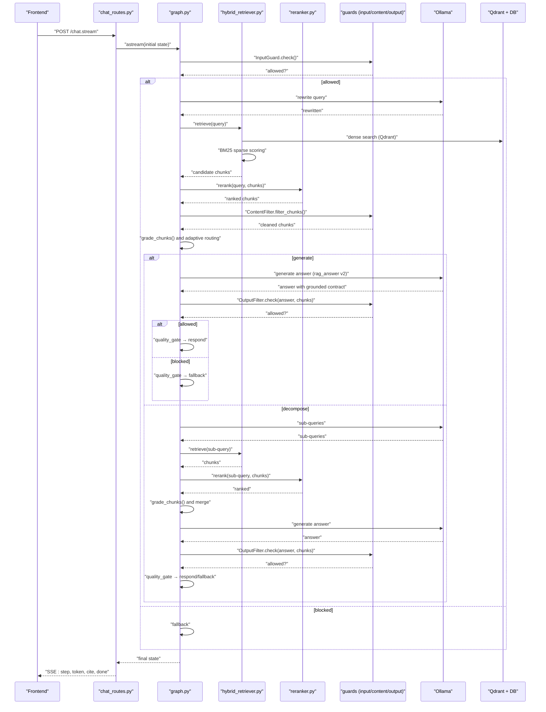
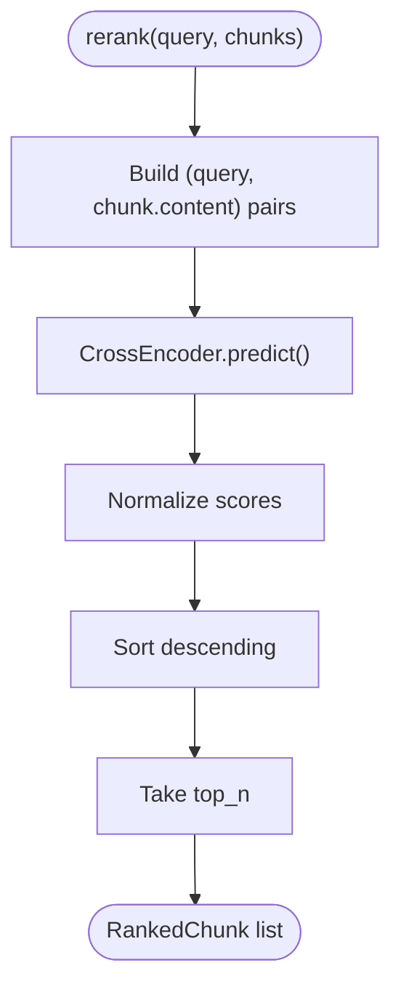
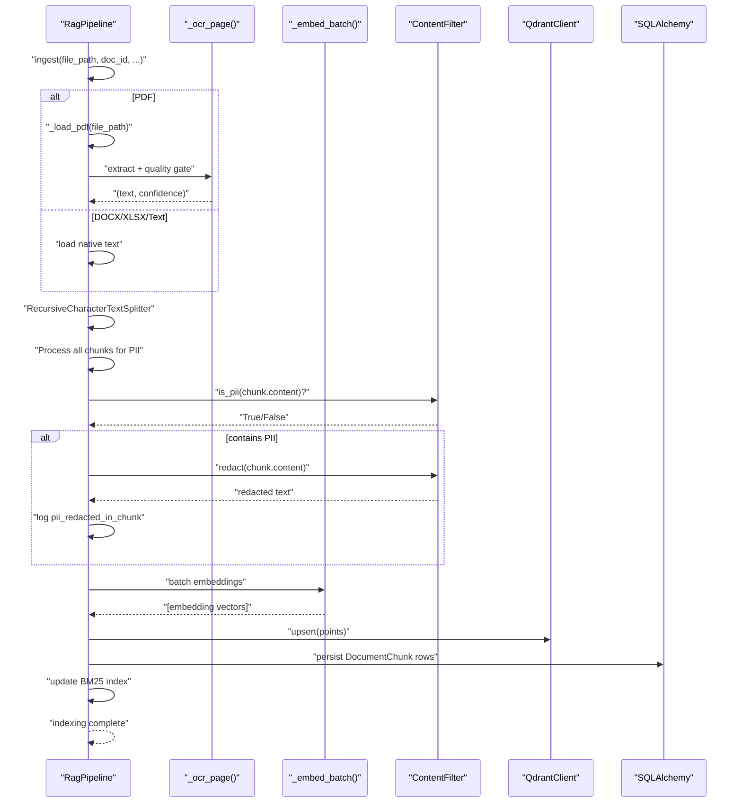
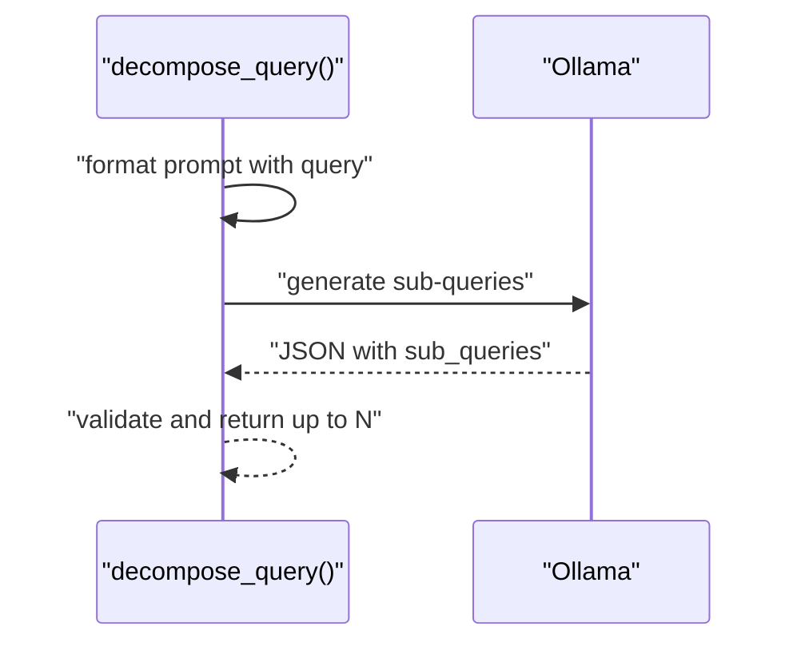
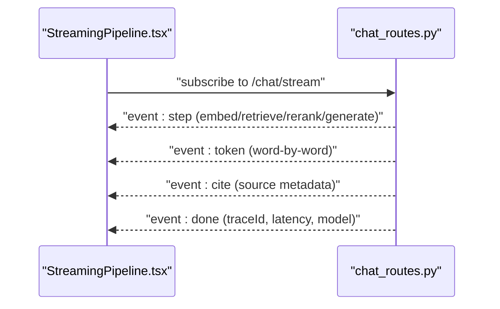
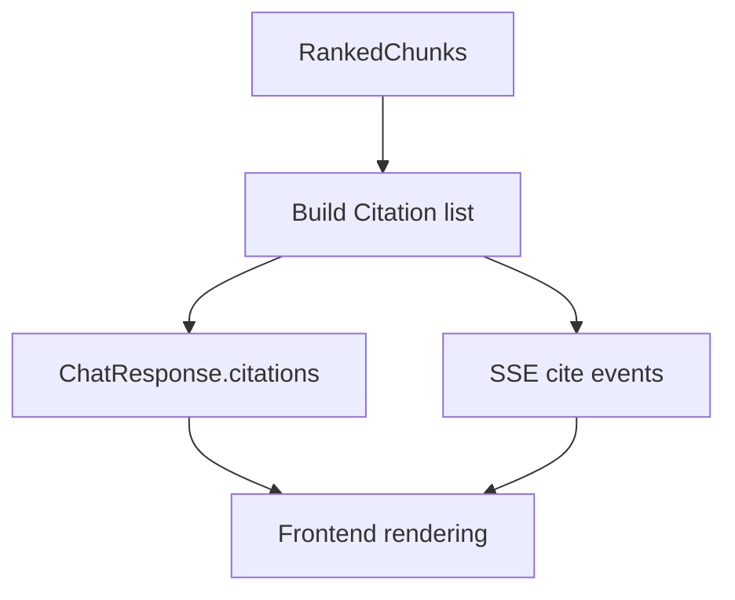
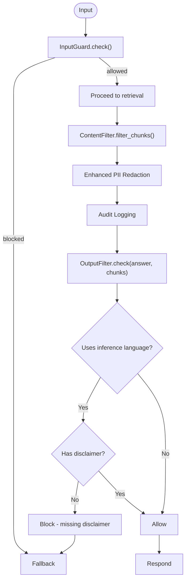
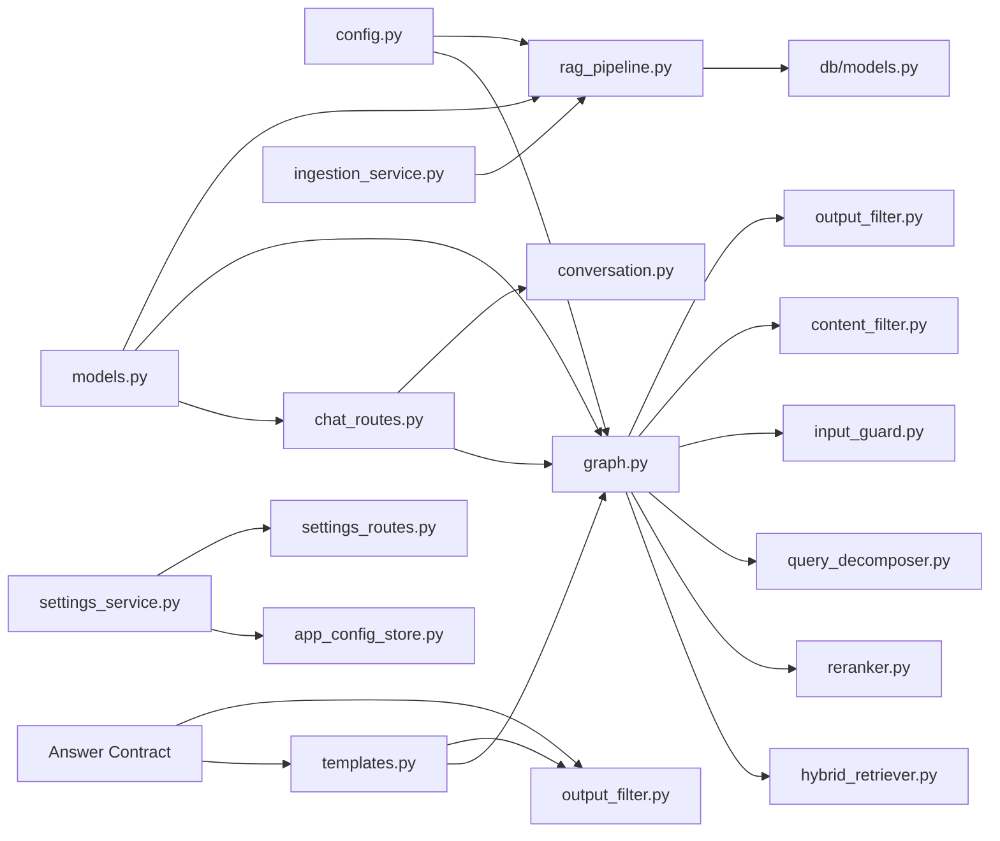
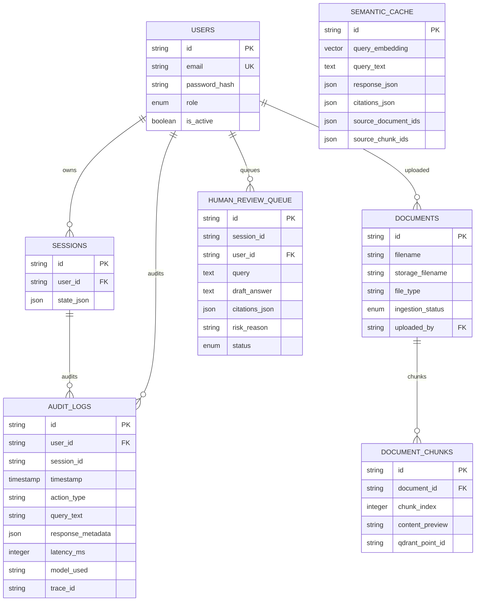
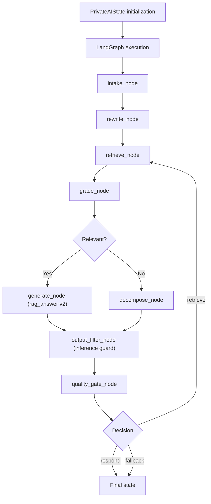

# RAG Pipeline Service

<cite>
**Referenced Files in This Document**
- [rag_pipeline.py](file://safe4ai-pilot/app/services/rag_pipeline.py)
- [hybrid_retriever.py](file://safe4ai-pilot/app/components/hybrid_retriever.py)
- [reranker.py](file://safe4ai-pilot/app/components/reranker.py)
- [query_decomposer.py](file://safe4ai-pilot/app/agents/query_decomposer.py)
- [content_filter.py](file://safe4ai-pilot/app/security/content_filter.py)
- [input_guard.py](file://safe4ai-pilot/app/security/input_guard.py)
- [output_filter.py](file://safe4ai-pilot/app/security/output_filter.py)
- [graph.py](file://safe4ai-pilot/app/agents/graph.py)
- [chat_routes.py](file://safe4ai-pilot/app/api/chat_routes.py)
- [conversation.py](file://safe4ai-pilot/app/services/conversation.py)
- [models.py](file://safe4ai-pilot/app/models.py)
- [config.py](file://safe4ai-pilot/app/config.py)
- [db/models.py](file://safe4ai-pilot/app/db/models.py)
- [templates.py](file://safe4ai-pilot/app/prompts/templates.py)
- [StreamingPipeline.tsx](file://safe4ai-pilot/frontend/src/components/chat/StreamingPipeline.tsx)
- [ingestion_service.py](file://safe4ai-pilot/app/services/ingestion_service.py)
- [settings_service.py](file://safe4ai-pilot/app/services/settings_service.py)
- [app_config_store.py](file://safe4ai-pilot/app/services/app_config_store.py)
- [settings_routes.py](file://safe4ai-pilot/app/api/settings_routes.py)
- [document_grader.py](file://safe4ai-pilot/app/agents/document_grader.py)
- [adaptive_router.py](file://safe4ai-pilot/app/agents/adaptive_router.py)
- [2026-06-03-rag-grounded-inference-design.md](file://safe4ai-pilot/docs/superpowers/specs/2026-06-03-rag-grounded-inference-design.md)
</cite>

## Update Summary
**Changes Made**
- Added comprehensive documentation for the RAG grounded inference design specification
- Updated answer contract system documentation covering document-grounded facts, general inference, and entity-specific fact restrictions
- Enhanced answer generation documentation with v2 rag_answer prompt implementation
- Added lightweight output guard specifications for inference labeling enforcement
- Updated context packing improvements for stable source labels
- Expanded testing plan and implementation requirements for local qwen3.5:9b model

## Table of Contents
1. [Introduction](#introduction)
2. [Project Structure](#project-structure)
3. [Core Components](#core-components)
4. [Architecture Overview](#architecture-overview)
5. [Detailed Component Analysis](#detailed-component-analysis)
6. [Grounded Inference Answer Contract](#grounded-inference-answer-contract)
7. [Dependency Analysis](#dependency-analysis)
8. [Performance Considerations](#performance-considerations)
9. [Troubleshooting Guide](#troubleshooting-guide)
10. [Conclusion](#conclusion)
11. [Appendices](#appendices)

## Introduction
This document describes the Retrieval-Augmented Generation (RAG) pipeline service responsible for orchestrating hybrid search, retrieval augmentation, reranking, and answer synthesis. The pipeline has evolved to use a LangGraph-based architecture where all queries flow through a stateful, streaming RAG orchestrated by a LangGraph StateGraph. Queries are decomposed, multi-modal retrieval integrates dense vector search with sparse BM25 ranking, and the system ensures safety and quality through content filtering, input/output guards, and adaptive routing. The document covers streaming response generation, citation management, and source attribution, along with practical configuration, optimization tips, and troubleshooting guidance.

**Updated** The pipeline now implements a comprehensive grounded inference design that establishes a strict answer contract for the local qwen3.5:9b model, ensuring confidential local documents remain the primary source of truth while enabling useful assistant-like behavior through clear distinction between document-grounded facts and model inference.

## Project Structure
The RAG pipeline spans backend services, components, agents, and frontend UI. The most relevant parts for this documentation are:
- Services: ingestion and query orchestration through LangGraph
- Components: hybrid retriever and reranker
- Agents: query decomposition, adaptive routing, and graph orchestration
- Security: input guard, content filter, and output filter
- API: chat endpoints with streaming support using graph-based processing
- Models and configuration: typed state, database models, and runtime settings
- Frontend: streaming UI indicators
- Prompts: answer contract templates and context formatting

```mermaid
graph TB
subgraph "Frontend"
UI["StreamingPipeline.tsx"]
end
subgraph "API Layer"
Routes["chat_routes.py"]
Settings["settings_routes.py"]
end
subgraph "Graph Orchestration"
Graph["graph.py"]
Conv["conversation.py"]
end
subgraph "Components"
Retriever["hybrid_retriever.py"]
Rerank["reranker.py"]
Decomposer["query_decomposer.py"]
End
subgraph "Security & Guards"
InGuard["input_guard.py"]
CFilter["content_filter.py"]
OutFilter["output_filter.py"]
End
subgraph "Services"
RAG["rag_pipeline.py"]
Ingest["ingestion_service.py"]
SettingsSvc["settings_service.py"]
AppCfg["app_config_store.py"]
end
subgraph "Models & Config"
Models["models.py"]
DB["db/models.py"]
CFG["config.py"]
TPL["templates.py"]
end
subgraph "Answer Contract System"
Contract["rag_answer v2"]
Router["adaptive_router.py"]
Grader["document_grader.py"]
End
UI --> Routes
Routes --> Graph
Settings --> SettingsSvc
SettingsSvc --> AppCfg
Graph --> Retriever
Graph --> Rerank
Graph --> Decomposer
Graph --> InGuard
Graph --> CFilter
Graph --> OutFilter
Graph --> Conv
Graph --> RAG
Graph --> Contract
Contract --> Router
Contract --> Grader
RAG --> CFG
RAG --> DB
Ingest --> RAG
Models -.-> Routes
TPL -.-> Graph
```

**Diagram sources**
- [chat_routes.py:1-361](file://safe4ai-pilot/app/api/chat_routes.py#L1-L361)
- [graph.py:1-355](file://safe4ai-pilot/app/agents/graph.py#L1-L355)
- [hybrid_retriever.py:1-145](file://safe4ai-pilot/app/components/hybrid_retriever.py#L1-L145)
- [reranker.py:1-36](file://safe4ai-pilot/app/components/reranker.py#L1-L36)
- [query_decomposer.py:1-41](file://safe4ai-pilot/app/agents/query_decomposer.py#L1-L41)
- [input_guard.py:1-49](file://safe4ai-pilot/app/security/input_guard.py#L1-L49)
- [content_filter.py:1-73](file://safe4ai-pilot/app/security/content_filter.py#L1-L73)
- [output_filter.py:1-110](file://safe4ai-pilot/app/security/output_filter.py#L1-L110)
- [rag_pipeline.py:1-221](file://safe4ai-pilot/app/services/rag_pipeline.py#L1-L221)
- [conversation.py:1-122](file://safe4ai-pilot/app/services/conversation.py#L1-L122)
- [models.py:1-113](file://safe4ai-pilot/app/models.py#L1-L113)
- [db/models.py:1-182](file://safe4ai-pilot/app/db/models.py#L1-L182)
- [config.py:1-48](file://safe4ai-pilot/app/config.py#L1-L48)
- [templates.py:1-121](file://safe4ai-pilot/app/prompts/templates.py#L1-L121)
- [StreamingPipeline.tsx:1-30](file://safe4ai-pilot/frontend/src/components/chat/StreamingPipeline.tsx#L1-L30)
- [ingestion_service.py:1-167](file://safe4ai-pilot/app/services/ingestion_service.py#L1-L167)
- [settings_service.py:1-415](file://safe4ai-pilot/app/services/settings_service.py#L1-L415)
- [app_config_store.py:1-119](file://safe4ai-pilot/app/services/app_config_store.py#L1-L119)
- [settings_routes.py:190-354](file://safe4ai-pilot/app/api/settings_routes.py#L190-L354)
- [document_grader.py:1-72](file://safe4ai-pilot/app/agents/document_grader.py#L1-L72)
- [adaptive_router.py:1-18](file://safe4ai-pilot/app/agents/adaptive_router.py#L1-L18)

**Section sources**
- [chat_routes.py:1-361](file://safe4ai-pilot/app/api/chat_routes.py#L1-L361)
- [graph.py:1-355](file://safe4ai-pilot/app/agents/graph.py#L1-L355)
- [rag_pipeline.py:1-221](file://safe4ai-pilot/app/services/rag_pipeline.py#L1-L221)

## Core Components
- HybridRetriever: performs dense vector search against Qdrant and sparse BM25 scoring, then fuses results via Reciprocal Rank Fusion (RRF).
- Reranker: cross-encodes query-chunk pairs to refine relevance scores.
- RagPipeline: handles document ingestion (PDF/docx/xlsx/text), OCR for low-confidence pages, chunking, embedding, upsert to Qdrant, and provides underlying components for the graph-based query processing system.
- QueryDecomposer: splits complex questions into simpler sub-queries for graph processing.
- Safety Guards: InputGuard (sanitization and injection checks), ContentFilter (PII redaction and removal), OutputFilter (PII hallucination and inference labeling checks).
- Graph Orchestration: LangGraph StateGraph implementing intake → rewrite → retrieve → grade → decompose/generate → output_filter → quality_gate → respond/fallback.
- API and Streaming: FastAPI endpoints supporting blocking and streaming responses with step events and token streaming through graph-based processing.
- Conversation Management: Session persistence and optional summarization for graph state management.
- Models and Configuration: Typed state, citations, database models, and runtime settings for graph orchestration.
- **Updated** Answer Contract System: Implements strict answer contract for grounded inference, enforcing document-grounded facts vs model inference distinction and entity-specific fact restrictions for the local qwen3.5:9b model.

**Updated** The RagPipeline class now serves as a supporting service providing ingestion capabilities and underlying components for the graph-based query processing system, with all query processing handled centrally through the LangGraph StateGraph. The answer contract system ensures confidential local documents remain the primary source of truth while enabling assistant-like behavior.

**Section sources**
- [hybrid_retriever.py:14-145](file://safe4ai-pilot/app/components/hybrid_retriever.py#L14-L145)
- [reranker.py:11-36](file://safe4ai-pilot/app/components/reranker.py#L11-L36)
- [rag_pipeline.py:29-221](file://safe4ai-pilot/app/services/rag_pipeline.py#L29-L221)
- [query_decomposer.py:10-41](file://safe4ai-pilot/app/agents/query_decomposer.py#L10-L41)
- [input_guard.py:24-49](file://safe4ai-pilot/app/security/input_guard.py#L24-L49)
- [content_filter.py:25-73](file://safe4ai-pilot/app/security/content_filter.py#L25-L73)
- [output_filter.py:31-110](file://safe4ai-pilot/app/security/output_filter.py#L31-L110)
- [graph.py:43-355](file://safe4ai-pilot/app/agents/graph.py#L43-L355)
- [chat_routes.py:150-361](file://safe4ai-pilot/app/api/chat_routes.py#L150-L361)
- [conversation.py:26-122](file://safe4ai-pilot/app/services/conversation.py#L26-L122)
- [models.py:13-113](file://safe4ai-pilot/app/models.py#L13-L113)
- [config.py:7-48](file://safe4ai-pilot/app/config.py#L7-L48)
- [templates.py:58-121](file://safe4ai-pilot/app/prompts/templates.py#L58-L121)

## Architecture Overview
The pipeline is a stateful, streaming RAG orchestrated by a LangGraph StateGraph. All queries flow through this centralized graph system, which begins with input validation, optionally rewrites the query, retrieves candidate chunks via hybrid search, reranks them, grades relevance, and either synthesizes an answer or decomposes the query into sub-queries. A quality gate decides whether to respond, self-correct by retrieving again, or fall back. Streaming endpoints emit step progress and answer tokens.



**Diagram sources**
- [chat_routes.py:224-361](file://safe4ai-pilot/app/api/chat_routes.py#L224-L361)
- [graph.py:56-355](file://safe4ai-pilot/app/agents/graph.py#L56-L355)
- [hybrid_retriever.py:57-145](file://safe4ai-pilot/app/components/hybrid_retriever.py#L57-L145)
- [reranker.py:15-36](file://safe4ai-pilot/app/components/reranker.py#L15-L36)
- [input_guard.py:27-49](file://safe4ai-pilot/app/security/input_guard.py#L27-L49)
- [content_filter.py:29-73](file://safe4ai-pilot/app/security/content_filter.py#L29-L73)
- [output_filter.py:32-110](file://safe4ai-pilot/app/security/output_filter.py#L32-L110)

## Detailed Component Analysis

### Hybrid Retriever
Implements dense-sparse hybrid search:
- Dense: embeds the query via Ollama embeddings endpoint and performs a nearest neighbor search on Qdrant.
- Sparse: maintains a BM25 index over chunk IDs and contents; filters by document IDs if provided.
- Fusion: computes Reciprocal Rank Fusion (RRF) scores across both rankings and returns top-ranked chunks.


**Diagram sources**
- [hybrid_retriever.py:57-145](file://safe4ai-pilot/app/components/hybrid_retriever.py#L57-L145)

**Section sources**
- [hybrid_retriever.py:14-145](file://safe4ai-pilot/app/components/hybrid_retriever.py#L14-L145)

### Reranker
Performs cross-encoding to refine relevance:
- Loads a cross-encoder model.
- Scores query-chunk pairs and returns top-N ranked chunks.



**Diagram sources**
- [reranker.py:15-36](file://safe4ai-pilot/app/components/reranker.py#L15-L36)

**Section sources**
- [reranker.py:11-36](file://safe4ai-pilot/app/components/reranker.py#L11-L36)

### RAG Pipeline Service
Handles document ingestion and provides underlying components for the graph-based query processing system:
- Ingestion supports PDF, DOCX, XLSX, and text. PDFs use OCR when text density is low; chunks are embedded in batches and upserted to Qdrant; BM25 index is updated.
- Provides the HybridRetriever and Reranker instances used by the LangGraph system.
- **Updated** The ingestion process now implements enhanced PII redaction: all chunks are processed and sensitive content is redacted with [REDACTED] markers rather than being filtered out entirely. The system logs each redaction event with detailed audit information including document ID and page number.



**Diagram sources**
- [rag_pipeline.py:81-175](file://safe4ai-pilot/app/services/rag_pipeline.py#L81-L175)
- [content_filter.py:24-73](file://safe4ai-pilot/app/security/content_filter.py#L24-L73)

**Section sources**
- [rag_pipeline.py:29-221](file://safe4ai-pilot/app/services/rag_pipeline.py#L29-L221)

### Query Decomposition
Splits a complex query into simpler sub-queries using a templated prompt and returns a list of strings for graph processing.



**Diagram sources**
- [query_decomposer.py:10-41](file://safe4ai-pilot/app/agents/query_decomposer.py#L10-L41)

**Section sources**
- [query_decomposer.py:10-41](file://safe4ai-pilot/app/agents/query_decomposer.py#L10-L41)

### Streaming Response Generation and UI
The API streams step transitions and answer tokens through the LangGraph system, while the frontend renders a step-by-step indicator.



**Diagram sources**
- [chat_routes.py:224-361](file://safe4ai-pilot/app/api/chat_routes.py#L224-L361)
- [StreamingPipeline.tsx:13-30](file://safe4ai-pilot/frontend/src/components/chat/StreamingPipeline.tsx#L13-L30)

**Section sources**
- [chat_routes.py:224-361](file://safe4ai-pilot/app/api/chat_routes.py#L224-L361)
- [StreamingPipeline.tsx:1-30](file://safe4ai-pilot/frontend/src/components/chat/StreamingPipeline.tsx#L1-L30)

### Citation Management and Source Attribution
Citations are constructed from ranked chunks and included in both the API response and the streaming stream. They include filename, page number, excerpt, and score.



**Diagram sources**
- [rag_pipeline.py:163-171](file://safe4ai-pilot/app/services/rag_pipeline.py#L163-L171)
- [chat_routes.py:222-239](file://safe4ai-pilot/app/api/chat_routes.py#L222-L239)
- [models.py:31-36](file://safe4ai-pilot/app/models.py#L31-L36)

**Section sources**
- [rag_pipeline.py:151-181](file://safe4ai-pilot/app/services/rag_pipeline.py#L151-L181)
- [chat_routes.py:222-239](file://safe4ai-pilot/app/api/chat_routes.py#L222-L239)
- [models.py:31-36](file://safe4ai-pilot/app/models.py#L31-L36)

### Security Guards and Content Filtering
- InputGuard: strips HTML/control characters, enforces length limits, and detects prompt-injection patterns.
- ContentFilter: **Enhanced** with new PII redaction approach that processes all chunks and applies redaction to sensitive content rather than filtering them out, with comprehensive logging for audit purposes.
- OutputFilter: **Enhanced** with inference labeling guard that enforces clear disclaimer requirements when general inference/model knowledge is used, preventing entity-specific fact filling from pretraining.

**Updated** The ContentFilter now implements an enhanced PII redaction system that:
- Processes all chunks regardless of PII presence
- Applies redaction to sensitive content using [REDACTED] markers
- Logs each redaction event with detailed audit information
- Maintains backward compatibility with existing filtering functionality

**Updated** The OutputFilter now includes a critical inference labeling guard that:
- Detects general inference/model knowledge language usage
- Requires clear "not stated directly in the documents" disclaimers
- Blocks answers that use inference without proper labeling
- Preserves grounded answers without unnecessary restrictions



**Diagram sources**
- [input_guard.py:27-49](file://safe4ai-pilot/app/security/input_guard.py#L27-L49)
- [content_filter.py:29-73](file://safe4ai-pilot/app/security/content_filter.py#L29-L73)
- [output_filter.py:32-110](file://safe4ai-pilot/app/security/output_filter.py#L32-L110)

**Section sources**
- [input_guard.py:24-49](file://safe4ai-pilot/app/security/input_guard.py#L24-L49)
- [content_filter.py:25-73](file://safe4ai-pilot/app/security/content_filter.py#L25-L73)
- [output_filter.py:31-110](file://safe4ai-pilot/app/security/output_filter.py#L31-L110)

## Grounded Inference Answer Contract

### Answer Contract Framework
The RAG system implements a strict three-tier answer contract designed specifically for the local qwen3.5:9b model to ensure confidential local documents remain the primary source of truth while enabling useful assistant-like behavior.

**Tier 1: Document-Grounded Facts**
- Primary layer of all answers
- Must be directly supported by retrieved chunks and properly cited
- Formatted with stable source labels [1], [2], etc.
- Generated through the enhanced rag_answer v2 prompt

**Tier 2: General Inference / Model Knowledge**
- Allowed only for obvious general-world facts or simple inferences
- Examples: "the Houses of Parliament are in London"
- Must be clearly labeled: "This is not stated directly in the documents; it is general model knowledge or an inference."
- Cannot fill entity-specific facts from pretraining

**Tier 3: Not Confirmed in Documents**
- Entity-specific facts that documents do not state
- Prohibited from completion using model pretraining
- Examples include headquarters, founders, addresses, websites, dates, counts, prices, and policy commitments
- Answer should clearly state what documents do and do not confirm

### Enhanced rag_answer v2 Prompt Implementation
The answer contract is enforced through a comprehensive v2 rag_answer prompt template that instructs the model to:

- Answer the user's actual question directly and concisely first
- Maintain a hard distinction between document-grounded facts and general inference
- Clearly state when facts are not confirmed in documents
- Never use pretraining for entity-specific facts not present in documents
- Use the user's language when clear
- Avoid "the statement is false" unless the user is explicitly checking a claim
- Not force fixed headings - allow conversational responses when inference is not needed

### Context Packing Improvements
Generation context is formatted with stable source labels for cleaner model anchoring:
- Format: `[S1] Business-AI-Alliance-New-Joiner-Welcome-Pack-November-2025.pdf p.2`
- Preserves existing UI citation list functionality
- Enables precise source attribution for grounded responses

### Lightweight Output Guard
Additional enforcement through output filtering:
- Detects inference language usage (general knowledge, general inference, model knowledge)
- Requires clear "not stated in the documents" disclaimers
- Blocks inference answers without proper labeling
- Allows grounded answers without inference restrictions

### Implementation Anchors
- `app/prompts/templates.py` defines the rag_answer v2 template with answer contract
- `app/agents/graph.py` formats context with stable source labels for v2 rag_answer
- `app/security/output_filter.py` enforces inference labeling requirements
- `app/agents/adaptive_router.py` maintains deterministic routing for local model performance
- `app/agents/document_grader.py` preserves score-only grading when rerank_threshold is set

**Section sources**
- [2026-06-03-rag-grounded-inference-design.md:38-185](file://safe4ai-pilot/docs/superpowers/specs/2026-06-03-rag-grounded-inference-design.md#L38-L185)
- [templates.py:58-121](file://safe4ai-pilot/app/prompts/templates.py#L58-L121)
- [graph.py:192-253](file://safe4ai-pilot/app/agents/graph.py#L192-L253)
- [output_filter.py:17-110](file://safe4ai-pilot/app/security/output_filter.py#L17-L110)
- [adaptive_router.py:6-18](file://safe4ai-pilot/app/agents/adaptive_router.py#L6-L18)
- [document_grader.py:17-72](file://safe4ai-pilot/app/agents/document_grader.py#L17-L72)

## Dependency Analysis
Key dependencies and relationships:
- graph.py depends on HybridRetriever, Reranker, InputGuard, ContentFilter, OutputFilter, and query_decomposer.
- rag_pipeline.py depends on HybridRetriever, Reranker, and integrates with Qdrant and SQLAlchemy for ingestion.
- chat_routes.py depends on graph.py and ConversationManager for session handling and graph execution.
- models.py defines shared state and data structures used across components.
- config.py provides runtime settings for Ollama, Qdrant, and other services.
- db/models.py defines persistence models for documents, chunks, sessions, and audit logs.
- **Updated** templates.py provides the answer contract framework through rag_answer v2 template.
- **Updated** output_filter.py enforces inference labeling requirements for grounded responses.

**Updated** The ingestion_service now coordinates with the enhanced ContentFilter during document processing, and settings_service manages the new redact_pii configuration option. The chat_routes.py now directly uses the graph for all query processing instead of calling RagPipeline methods. The answer contract system integrates with all major pipeline components.



**Diagram sources**
- [graph.py:43-50](file://safe4ai-pilot/app/agents/graph.py#L43-L50)
- [rag_pipeline.py:20-23](file://safe4ai-pilot/app/services/rag_pipeline.py#L20-L23)
- [chat_routes.py:126-133](file://safe4ai-pilot/app/api/chat_routes.py#L126-L133)
- [config.py:7-48](file://safe4ai-pilot/app/config.py#L7-L48)
- [db/models.py:1-182](file://safe4ai-pilot/app/db/models.py#L1-L182)
- [models.py:13-113](file://safe4ai-pilot/app/models.py#L13-L113)
- [ingestion_service.py:1-167](file://safe4ai-pilot/app/services/ingestion_service.py#L1-L167)
- [settings_service.py:1-415](file://safe4ai-pilot/app/services/settings_service.py#L1-L415)
- [app_config_store.py:1-119](file://safe4ai-pilot/app/services/app_config_store.py#L1-L119)
- [settings_routes.py:190-354](file://safe4ai-pilot/app/api/settings_routes.py#L190-L354)
- [templates.py:58-121](file://safe4ai-pilot/app/prompts/templates.py#L58-L121)
- [output_filter.py:17-110](file://safe4ai-pilot/app/security/output_filter.py#L17-L110)

**Section sources**
- [graph.py:43-355](file://safe4ai-pilot/app/agents/graph.py#L43-L355)
- [rag_pipeline.py:20-23](file://safe4ai-pilot/app/services/rag_pipeline.py#L20-L23)
- [chat_routes.py:126-133](file://safe4ai-pilot/app/api/chat_routes.py#L126-L133)
- [config.py:7-48](file://safe4ai-pilot/app/config.py#L7-L48)
- [db/models.py:1-182](file://safe4ai-pilot/app/db/models.py#L1-L182)
- [models.py:13-113](file://safe4ai-pilot/app/models.py#L13-L113)

## Performance Considerations
- Batch embeddings: RagPipeline batches embedding requests to reduce overhead for ingestion.
- Chunking strategy: Tune chunk size and overlap to balance recall and context length.
- Hybrid search fusion: Adjust RRF k parameter to balance dense and sparse signals.
- Reranking top-n: Limit rerank top-n to reduce generation cost.
- OCR thresholds: Increase OCR trigger threshold to minimize OCR calls for high-text pages.
- Streaming: Use streaming endpoints to improve perceived latency and UX through graph-based processing.
- Caching: Consider semantic caching for repeated queries (see semantic cache model).
- Rate limiting: API endpoints apply rate limits to protect resources.
- **Enhanced** PII redaction performance: The new redaction approach processes all chunks efficiently with minimal performance impact compared to filtering out sensitive content.
- **Updated** Graph execution: The LangGraph system provides efficient state management and node execution, reducing overhead compared to direct method calls.
- **Updated** Answer contract performance: The rag_answer v2 prompt is designed to be explicit but compact, avoiding additional LLM calls that could slow the local qwen3.5:9b model.
- **Updated** Output guard efficiency: Lightweight inference labeling checks only trigger when inference language is detected, minimizing processing overhead.

## Troubleshooting Guide
Common issues and resolutions:
- No answer returned: Verify rerank score threshold and ensure sufficient relevant chunks are produced through the graph system.
- Poor retrieval quality: Increase rerank top-n, adjust HybridRetriever top_k, or review BM25 index updates.
- OCR failures on PDFs: Confirm OCR model availability and increase OCR threshold for low-text pages.
- **Updated** PII redaction issues: Check ContentFilter logs for "pii_redacted_in_chunk" entries to verify redaction is working correctly.
- **Updated** Audit logging problems: Verify that redaction events are being logged with proper document IDs and page numbers.
- Long answers: Investigate OutputFilter warnings and consider reducing context length or rerank top-n.
- Session size exceeded: Truncate or summarize conversation history to keep state under the byte limit.
- Streaming stalls: Check Ollama availability and timeouts; verify SSE headers and network connectivity.
- **Updated** Graph execution failures: Check LangGraph node execution logs and verify that all graph nodes are properly initialized and accessible.
- **Updated** Answer contract violations: Monitor OutputFilter "inference answer missing required disclaimer" errors and verify rag_answer v2 prompt is being used.
- **Updated** Entity-specific fact issues: Ensure answers don't fill headquarters, founders, addresses, websites, dates, counts, prices, or policy commitments without direct document support.
- **Updated** Performance degradation: Verify answer contract implementation isn't causing excessive prompt length; monitor local model response times.

**Section sources**
- [rag_pipeline.py:160-161](file://safe4ai-pilot/app/services/rag_pipeline.py#L160-L161)
- [hybrid_retriever.py:116-128](file://safe4ai-pilot/app/components/hybrid_retriever.py#L116-L128)
- [conversation.py:63-69](file://safe4ai-pilot/app/services/conversation.py#L63-L69)
- [output_filter.py:52-59](file://safe4ai-pilot/app/security/output_filter.py#L52-L59)

## Conclusion
The RAG pipeline integrates hybrid retrieval, reranking, adaptive routing, and safety guards to deliver reliable, auditable, and secure answers through a centralized LangGraph system. The graph-based architecture enables transparent, user-friendly interactions with streaming interfaces and structured state management. The enhanced PII redaction approach ensures comprehensive content protection while maintaining system performance and audit capabilities. The new grounded inference answer contract system establishes a strict framework for the local qwen3.5:9b model, ensuring confidential local documents remain the primary source of truth while enabling useful assistant-like behavior through clear distinction between document-grounded facts and model inference. Proper tuning of chunking, rerank thresholds, and hybrid fusion yields robust performance, while guards ensure content safety and compliance. The elimination of direct query() methods in favor of graph-centric processing provides better maintainability and scalability.

## Appendices

### Practical Configuration Examples
- Runtime settings: Configure Ollama URL/model, Qdrant URL, embedding model, and semantic cache threshold via environment variables.
- **Updated** PII redaction configuration: Enable the redact_pii setting to activate the enhanced redaction approach during document ingestion.
- **Updated** Answer contract configuration: The rag_answer v2 template is automatically used by the graph system for grounded responses.
- Upload handling: Set maximum upload size and retention policies for audit logs and semantic cache.
- Frontend integration: Use streaming endpoints to render step progress and answer tokens through the graph system.

**Section sources**
- [config.py:7-48](file://safe4ai-pilot/app/config.py#L7-L48)
- [chat_routes.py:224-361](file://safe4ai-pilot/app/api/chat_routes.py#L224-L361)
- [settings_routes.py:190-202](file://safe4ai-pilot/app/api/settings_routes.py#L190-L202)
- [settings_service.py:349-351](file://safe4ai-pilot/app/services/settings_service.py#L349-L351)

### Data Model Overview


**Diagram sources**
- [db/models.py:52-182](file://safe4ai-pilot/app/db/models.py#L52-L182)

### Enhanced PII Redaction Implementation Details
**Updated** The new PII redaction system provides comprehensive content protection with the following features:

- **Processing Approach**: All chunks are processed regardless of PII presence, ensuring no sensitive content is inadvertently filtered out
- **Redaction Method**: Sensitive patterns are replaced with [REDACTED] markers while preserving surrounding content structure
- **Audit Logging**: Each redaction event is logged with detailed information including document ID, page number, and timestamp
- **Pattern Detection**: Supports detection of Social Security Numbers, credit card numbers, and passport numbers
- **Backward Compatibility**: Maintains existing filtering functionality alongside the new redaction approach

**Section sources**
- [content_filter.py:13-73](file://safe4ai-pilot/app/security/content_filter.py#L13-L73)
- [rag_pipeline.py:140-144](file://safe4ai-pilot/app/services/rag_pipeline.py#L140-L144)

### Grounded Inference Implementation Details
**Updated** The answer contract system provides strict enforcement of document-grounded responses:

- **Contract Enforcement**: rag_answer v2 template enforces three-tier answer structure
- **Source Labeling**: Stable [1], [2], etc. labels for precise citation tracking
- **Inference Guard**: OutputFilter detects and blocks inference without proper disclaimers
- **Entity Restrictions**: Prevents filling of entity-specific facts from pretraining
- **Performance Optimization**: Compact contract design avoids additional LLM calls

**Section sources**
- [2026-06-03-rag-grounded-inference-design.md:38-185](file://safe4ai-pilot/docs/superpowers/specs/2026-06-03-rag-grounded-inference-design.md#L38-L185)
- [templates.py:58-121](file://safe4ai-pilot/app/prompts/templates.py#L58-L121)
- [output_filter.py:17-110](file://safe4ai-pilot/app/security/output_filter.py#L17-L110)

### Graph-Based Query Processing Flow
**Updated** The query processing flow now operates entirely through the LangGraph system with answer contract enforcement:

- **Initialization**: Chat routes create PrivateAIState with initial messages and session context
- **Graph Execution**: The StateGraph processes queries through specialized nodes (intake, rewrite, retrieve, grade, decompose, generate, output_filter, quality_gate)
- **State Management**: Each node updates the state with intermediate results and context
- **Answer Contract**: The generate node uses rag_answer v2 template with answer contract enforcement
- **Streaming**: Nodes emit step events and final results through SSE streaming
- **Finalization**: Conversation manager persists state and final results



**Diagram sources**
- [chat_routes.py:123-160](file://safe4ai-pilot/app/api/chat_routes.py#L123-L160)
- [graph.py:43-355](file://safe4ai-pilot/app/agents/graph.py#L43-L355)
- [models.py:59-113](file://safe4ai-pilot/app/models.py#L59-L113)
- [templates.py:58-121](file://safe4ai-pilot/app/prompts/templates.py#L58-L121)
- [output_filter.py:17-110](file://safe4ai-pilot/app/security/output_filter.py#L17-L110)