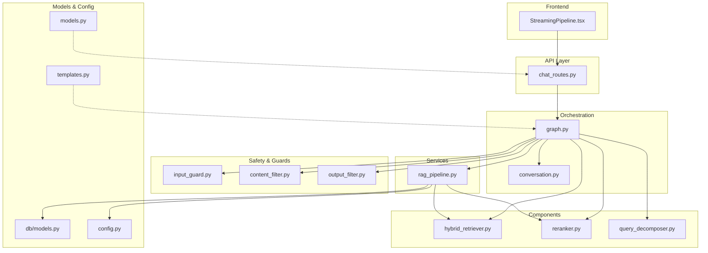
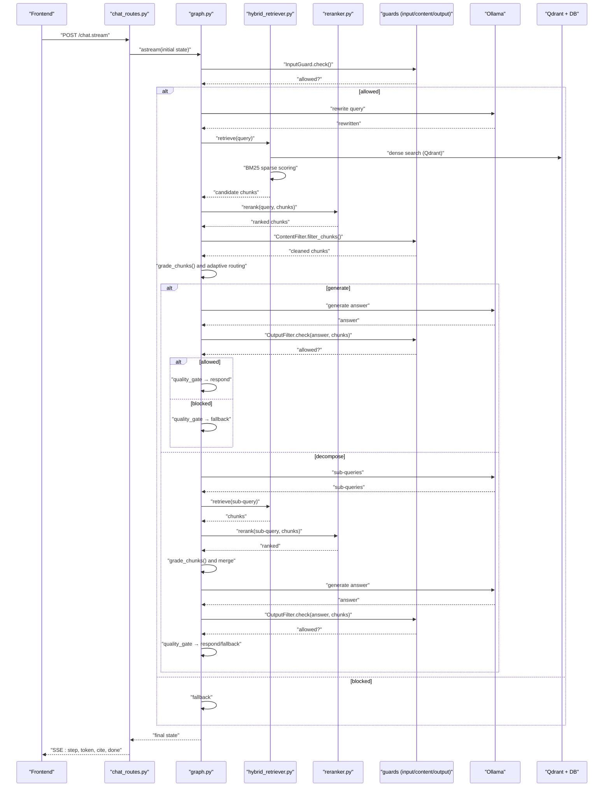
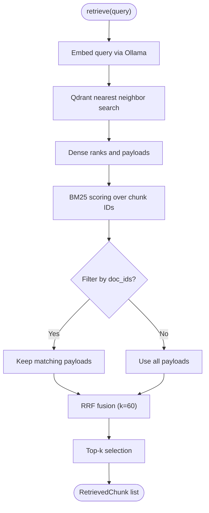
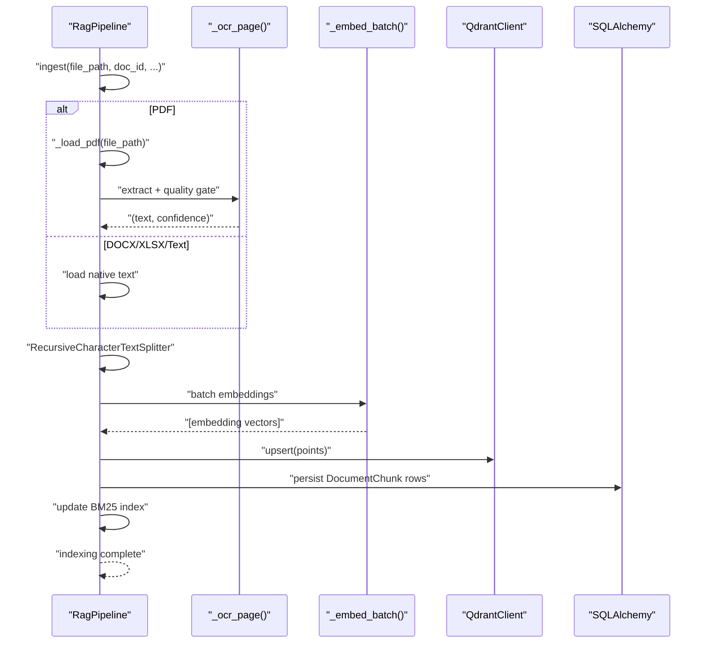
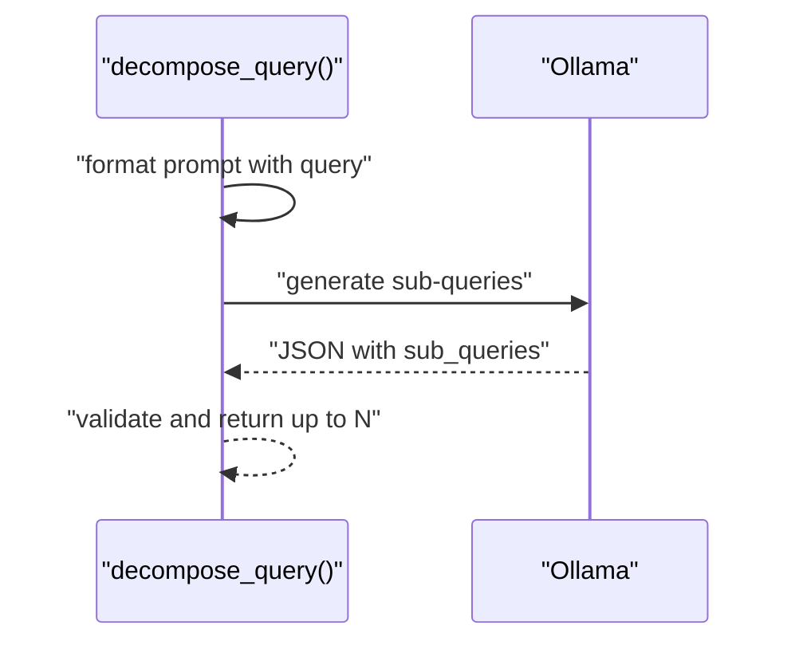
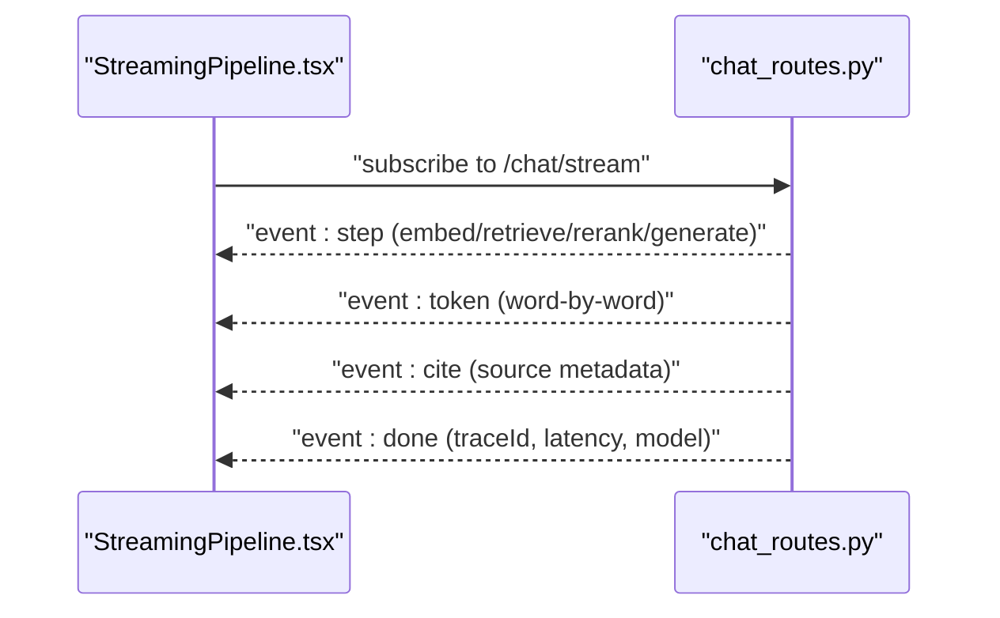
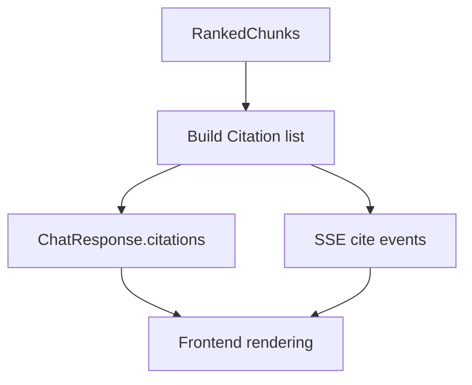
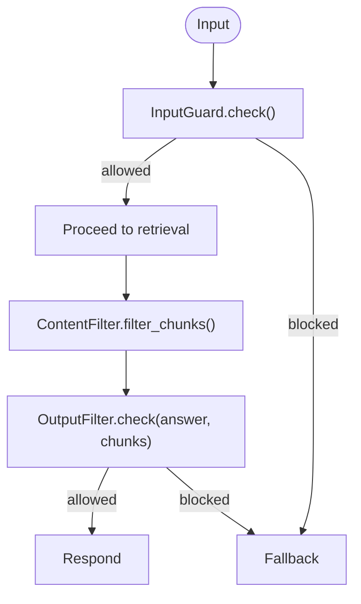
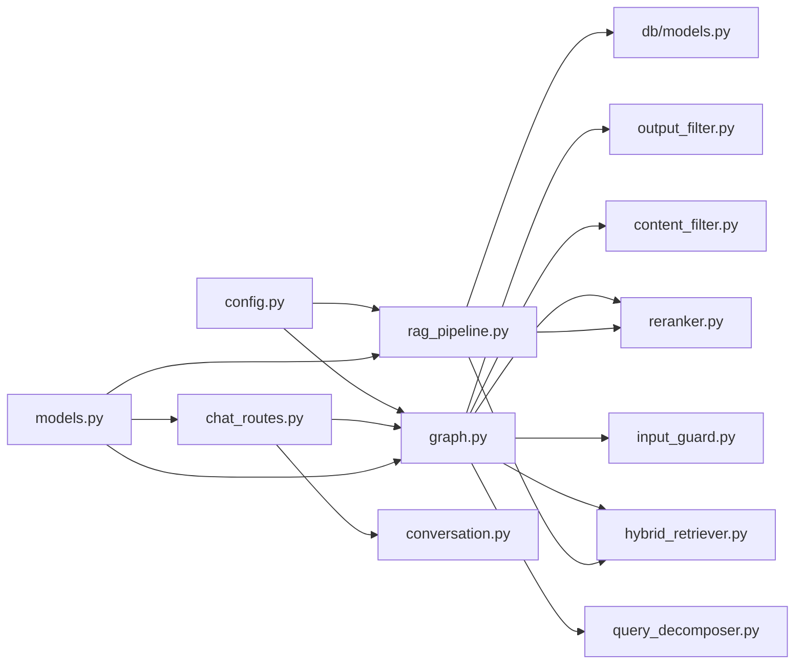
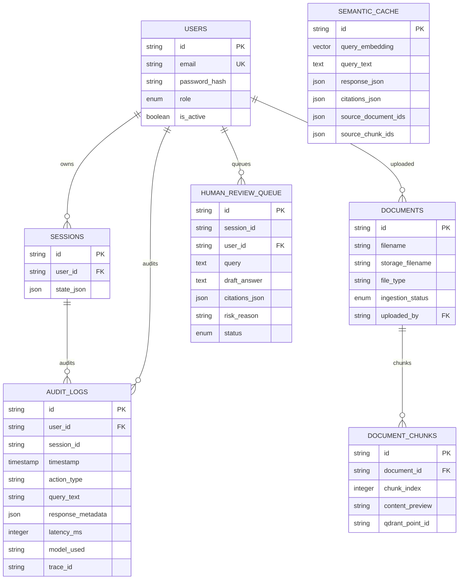

# RAG Pipeline Service

<cite>
**Referenced Files in This Document**
- [rag_pipeline.py](file://safe4ai-pilot/app/services/rag_pipeline.py)
- [hybrid_retriever.py](file://safe4ai-pilot/app/components/hybrid_retriever.py)
- [reranker.py](file://safe4ai-pilot/app/components/reranker.py)
- [query_decomposer.py](file://safe4ai-pilot/app/agents/query_decomposer.py)
- [content_filter.py](file://safe4ai-pilot/app/security/content_filter.py)
- [input_guard.py](file://safe4ai-pilot/app/security/input_guard.py)
- [output_filter.py](file://safe4ai-pilot/app/security/output_filter.py)
- [graph.py](file://safe4ai-pilot/app/agents/graph.py)
- [chat_routes.py](file://safe4ai-pilot/app/api/chat_routes.py)
- [conversation.py](file://safe4ai-pilot/app/services/conversation.py)
- [models.py](file://safe4ai-pilot/app/models.py)
- [config.py](file://safe4ai-pilot/app/config.py)
- [db/models.py](file://safe4ai-pilot/app/db/models.py)
- [templates.py](file://safe4ai-pilot/app/prompts/templates.py)
- [StreamingPipeline.tsx](file://safe4ai-pilot/frontend/src/components/chat/StreamingPipeline.tsx)
</cite>

## Table of Contents
1. [Introduction](#introduction)
2. [Project Structure](#project-structure)
3. [Core Components](#core-components)
4. [Architecture Overview](#architecture-overview)
5. [Detailed Component Analysis](#detailed-component-analysis)
6. [Dependency Analysis](#dependency-analysis)
7. [Performance Considerations](#performance-considerations)
8. [Troubleshooting Guide](#troubleshooting-guide)
9. [Conclusion](#conclusion)
10. [Appendices](#appendices)

## Introduction
This document describes the Retrieval-Augmented Generation (RAG) pipeline service responsible for orchestrating hybrid search, retrieval augmentation, reranking, and answer synthesis. It explains how queries are decomposed, how multi-modal retrieval integrates dense vector search with sparse BM25 ranking, and how the system ensures safety and quality through content filtering, input/output guards, and adaptive routing. The document also covers streaming response generation, citation management, and source attribution, along with practical configuration, optimization tips, and troubleshooting guidance.

## Project Structure
The RAG pipeline spans backend services, components, agents, and frontend UI. The most relevant parts for this documentation are:
- Services: ingestion and query orchestration
- Components: hybrid retriever and reranker
- Agents: query decomposition, adaptive routing, and graph orchestration
- Security: input guard, content filter, and output filter
- API: chat endpoints with streaming support
- Models and configuration: typed state, database models, and runtime settings
- Frontend: streaming UI indicators

**Diagram sources**
- [chat_routes.py:1-251](file://safe4ai-pilot/app/api/chat_routes.py#L1-L251)
- [graph.py:1-352](file://safe4ai-pilot/app/agents/graph.py#L1-L352)
- [hybrid_retriever.py:1-145](file://safe4ai-pilot/app/components/hybrid_retriever.py#L1-L145)
- [reranker.py:1-36](file://safe4ai-pilot/app/components/reranker.py#L1-L36)
- [query_decomposer.py:1-41](file://safe4ai-pilot/app/agents/query_decomposer.py#L1-L41)
- [input_guard.py:1-49](file://safe4ai-pilot/app/security/input_guard.py#L1-L49)
- [content_filter.py:1-64](file://safe4ai-pilot/app/security/content_filter.py#L1-L64)
- [output_filter.py:1-61](file://safe4ai-pilot/app/security/output_filter.py#L1-L61)
- [rag_pipeline.py:1-313](file://safe4ai-pilot/app/services/rag_pipeline.py#L1-L313)
- [conversation.py:1-117](file://safe4ai-pilot/app/services/conversation.py#L1-L117)
- [models.py:1-95](file://safe4ai-pilot/app/models.py#L1-L95)
- [db/models.py:1-182](file://safe4ai-pilot/app/db/models.py#L1-L182)
- [config.py:1-48](file://safe4ai-pilot/app/config.py#L1-L48)
- [templates.py:1-81](file://safe4ai-pilot/app/prompts/templates.py#L1-L81)
- [StreamingPipeline.tsx:1-30](file://safe4ai-pilot/frontend/src/components/chat/StreamingPipeline.tsx#L1-L30)

**Section sources**
- [chat_routes.py:1-251](file://safe4ai-pilot/app/api/chat_routes.py#L1-L251)
- [graph.py:1-352](file://safe4ai-pilot/app/agents/graph.py#L1-L352)
- [rag_pipeline.py:1-313](file://safe4ai-pilot/app/services/rag_pipeline.py#L1-L313)

## Core Components
- HybridRetriever: performs dense vector search against Qdrant and sparse BM25 scoring, then fuses results via Reciprocal Rank Fusion (RRF).
- Reranker: cross-encodes query-chunk pairs to refine relevance scores.
- RagPipeline: orchestrates ingestion (PDF/docx/xlsx/text), OCR for low-confidence pages, chunking, embedding, upsert to Qdrant, and query-time retrieval and generation.
- QueryDecomposer: splits complex questions into simpler sub-queries.
- Safety Guards: InputGuard (sanitization and injection checks), ContentFilter (PII removal), OutputFilter (PII hallucination and length checks).
- Graph Orchestration: LangGraph StateGraph implementing intake → rewrite → retrieve → grade → decompose/generate → output_filter → quality_gate → respond/fallback.
- API and Streaming: FastAPI endpoints supporting blocking and streaming responses with step events and token streaming.
- Conversation Management: Session persistence and optional summarization.
- Models and Configuration: Typed state, citations, database models, and runtime settings.

**Section sources**
- [hybrid_retriever.py:14-145](file://safe4ai-pilot/app/components/hybrid_retriever.py#L14-L145)
- [reranker.py:11-36](file://safe4ai-pilot/app/components/reranker.py#L11-L36)
- [rag_pipeline.py:34-313](file://safe4ai-pilot/app/services/rag_pipeline.py#L34-L313)
- [query_decomposer.py:10-41](file://safe4ai-pilot/app/agents/query_decomposer.py#L10-L41)
- [input_guard.py:24-49](file://safe4ai-pilot/app/security/input_guard.py#L24-L49)
- [content_filter.py:25-64](file://safe4ai-pilot/app/security/content_filter.py#L25-L64)
- [output_filter.py:31-61](file://safe4ai-pilot/app/security/output_filter.py#L31-L61)
- [graph.py:43-352](file://safe4ai-pilot/app/agents/graph.py#L43-L352)
- [chat_routes.py:156-251](file://safe4ai-pilot/app/api/chat_routes.py#L156-L251)
- [conversation.py:26-117](file://safe4ai-pilot/app/services/conversation.py#L26-L117)
- [models.py:13-95](file://safe4ai-pilot/app/models.py#L13-L95)
- [config.py:7-48](file://safe4ai-pilot/app/config.py#L7-L48)

## Architecture Overview
The pipeline is a stateful, streaming RAG orchestrated by a LangGraph. It begins with input validation, optionally rewrites the query, retrieves candidate chunks via hybrid search, reranks them, grades relevance, and either synthesizes an answer or decomposes the query into sub-queries. A quality gate decides whether to respond, self-correct by retrieving again, or fall back. Streaming endpoints emit step progress and answer tokens.

**Diagram sources**
- [chat_routes.py:156-251](file://safe4ai-pilot/app/api/chat_routes.py#L156-L251)
- [graph.py:56-352](file://safe4ai-pilot/app/agents/graph.py#L56-L352)
- [hybrid_retriever.py:57-145](file://safe4ai-pilot/app/components/hybrid_retriever.py#L57-L145)
- [reranker.py:15-36](file://safe4ai-pilot/app/components/reranker.py#L15-L36)
- [input_guard.py:27-49](file://safe4ai-pilot/app/security/input_guard.py#L27-L49)
- [content_filter.py:29-64](file://safe4ai-pilot/app/security/content_filter.py#L29-L64)
- [output_filter.py:32-61](file://safe4ai-pilot/app/security/output_filter.py#L32-L61)

## Detailed Component Analysis

### Hybrid Retriever
Implements dense-sparse hybrid search:
- Dense: embeds the query via Ollama embeddings endpoint and performs a nearest neighbor search on Qdrant.
- Sparse: maintains a BM25 index over chunk IDs and contents; filters by document IDs if provided.
- Fusion: computes Reciprocal Rank Fusion (RRF) scores across both rankings and returns top-ranked chunks.

**Diagram sources**
- [hybrid_retriever.py:57-145](file://safe4ai-pilot/app/components/hybrid_retriever.py#L57-L145)

**Section sources**
- [hybrid_retriever.py:14-145](file://safe4ai-pilot/app/components/hybrid_retriever.py#L14-L145)

### Reranker
Performs cross-encoding to refine relevance:
- Loads a cross-encoder model.
- Scores query-chunk pairs and returns top-N ranked chunks.

**Diagram sources**
- [reranker.py:15-36](file://safe4ai-pilot/app/components/reranker.py#L15-L36)

**Section sources**
- [reranker.py:11-36](file://safe4ai-pilot/app/components/reranker.py#L11-L36)

### RAG Pipeline Service
Handles ingestion and query-time orchestration:
- Ingestion supports PDF, DOCX, XLSX, and text. PDFs use OCR when text density is low; chunks are embedded in batches and upserted to Qdrant; BM25 index is updated.
- Query-time retrieval uses HybridRetriever, followed by Reranker, then answer synthesis via a prompt with context and citations.

**Diagram sources**
- [rag_pipeline.py:62-150](file://safe4ai-pilot/app/services/rag_pipeline.py#L62-L150)
- [rag_pipeline.py:187-201](file://safe4ai-pilot/app/services/rag_pipeline.py#L187-L201)
- [rag_pipeline.py:203-249](file://safe4ai-pilot/app/services/rag_pipeline.py#L203-L249)
- [rag_pipeline.py:265-295](file://safe4ai-pilot/app/services/rag_pipeline.py#L265-L295)

**Section sources**
- [rag_pipeline.py:34-313](file://safe4ai-pilot/app/services/rag_pipeline.py#L34-L313)

### Query Decomposition
Splits a complex query into simpler sub-queries using a templated prompt and returns a list of strings.

**Diagram sources**
- [query_decomposer.py:10-41](file://safe4ai-pilot/app/agents/query_decomposer.py#L10-L41)

**Section sources**
- [query_decomposer.py:10-41](file://safe4ai-pilot/app/agents/query_decomposer.py#L10-L41)

### Streaming Response Generation and UI
The API streams step transitions and answer tokens, while the frontend renders a step-by-step indicator.

**Diagram sources**
- [chat_routes.py:176-251](file://safe4ai-pilot/app/api/chat_routes.py#L176-L251)
- [StreamingPipeline.tsx:13-30](file://safe4ai-pilot/frontend/src/components/chat/StreamingPipeline.tsx#L13-L30)

**Section sources**
- [chat_routes.py:156-251](file://safe4ai-pilot/app/api/chat_routes.py#L156-L251)
- [StreamingPipeline.tsx:1-30](file://safe4ai-pilot/frontend/src/components/chat/StreamingPipeline.tsx#L1-L30)

### Citation Management and Source Attribution
Citations are constructed from ranked chunks and included in both the API response and the streaming stream. They include filename, page number, excerpt, and score.

**Diagram sources**
- [rag_pipeline.py:163-171](file://safe4ai-pilot/app/services/rag_pipeline.py#L163-L171)
- [chat_routes.py:222-239](file://safe4ai-pilot/app/api/chat_routes.py#L222-L239)
- [models.py:31-36](file://safe4ai-pilot/app/models.py#L31-L36)

**Section sources**
- [rag_pipeline.py:151-181](file://safe4ai-pilot/app/services/rag_pipeline.py#L151-L181)
- [chat_routes.py:222-239](file://safe4ai-pilot/app/api/chat_routes.py#L222-L239)
- [models.py:31-36](file://safe4ai-pilot/app/models.py#L31-L36)

### Security Guards and Content Filtering
- InputGuard: strips HTML/control characters, enforces length limits, and detects prompt-injection patterns.
- ContentFilter: removes chunks containing PII and blocks sections matching configured terms.
- OutputFilter: rejects answers containing PII not present in source chunks and logs suspiciously long outputs.

**Diagram sources**
- [input_guard.py:27-49](file://safe4ai-pilot/app/security/input_guard.py#L27-L49)
- [content_filter.py:29-64](file://safe4ai-pilot/app/security/content_filter.py#L29-L64)
- [output_filter.py:32-61](file://safe4ai-pilot/app/security/output_filter.py#L32-L61)

**Section sources**
- [input_guard.py:24-49](file://safe4ai-pilot/app/security/input_guard.py#L24-L49)
- [content_filter.py:25-64](file://safe4ai-pilot/app/security/content_filter.py#L25-L64)
- [output_filter.py:31-61](file://safe4ai-pilot/app/security/output_filter.py#L31-L61)

## Dependency Analysis
Key dependencies and relationships:
- graph.py depends on HybridRetriever, Reranker, InputGuard, ContentFilter, OutputFilter, and query_decomposer.
- rag_pipeline.py depends on HybridRetriever, Reranker, and integrates with Qdrant and SQLAlchemy.
- chat_routes.py depends on graph.py and ConversationManager for session handling.
- models.py defines shared state and data structures used across components.
- config.py provides runtime settings for Ollama, Qdrant, and other services.
- db/models.py defines persistence models for documents, chunks, sessions, and audit logs.

**Diagram sources**
- [graph.py:43-50](file://safe4ai-pilot/app/agents/graph.py#L43-L50)
- [rag_pipeline.py:20-23](file://safe4ai-pilot/app/services/rag_pipeline.py#L20-L23)
- [chat_routes.py:126-133](file://safe4ai-pilot/app/api/chat_routes.py#L126-L133)
- [config.py:7-48](file://safe4ai-pilot/app/config.py#L7-L48)
- [db/models.py:1-182](file://safe4ai-pilot/app/db/models.py#L1-L182)
- [models.py:13-95](file://safe4ai-pilot/app/models.py#L13-L95)

**Section sources**
- [graph.py:43-352](file://safe4ai-pilot/app/agents/graph.py#L43-L352)
- [rag_pipeline.py:20-23](file://safe4ai-pilot/app/services/rag_pipeline.py#L20-L23)
- [chat_routes.py:126-133](file://safe4ai-pilot/app/api/chat_routes.py#L126-L133)
- [config.py:7-48](file://safe4ai-pilot/app/config.py#L7-L48)
- [db/models.py:1-182](file://safe4ai-pilot/app/db/models.py#L1-L182)
- [models.py:13-95](file://safe4ai-pilot/app/models.py#L13-L95)

## Performance Considerations
- Batch embeddings: RagPipeline batches embedding requests to reduce overhead.
- Chunking strategy: Tune chunk size and overlap to balance recall and context length.
- Hybrid search fusion: Adjust RRF k parameter to balance dense and sparse signals.
- Reranking top-n: Limit rerank top-n to reduce generation cost.
- OCR thresholds: Increase OCR trigger threshold to minimize OCR calls for high-text pages.
- Streaming: Use streaming endpoints to improve perceived latency and UX.
- Caching: Consider semantic caching for repeated queries (see semantic cache model).
- Rate limiting: API endpoints apply rate limits to protect resources.

[No sources needed since this section provides general guidance]

## Troubleshooting Guide
Common issues and resolutions:
- No answer returned: Verify rerank score threshold and ensure sufficient relevant chunks are produced.
- Poor retrieval quality: Increase rerank top-n, adjust HybridRetriever top_k, or review BM25 index updates.
- OCR failures on PDFs: Confirm OCR model availability and increase OCR threshold for low-text pages.
- PII leakage or hallucinations: Ensure ContentFilter and OutputFilter are active and properly configured.
- Long answers: Investigate OutputFilter warnings and consider reducing context length or rerank top-n.
- Session size exceeded: Truncate or summarize conversation history to keep state under the byte limit.
- Streaming stalls: Check Ollama availability and timeouts; verify SSE headers and network connectivity.

**Section sources**
- [rag_pipeline.py:160-161](file://safe4ai-pilot/app/services/rag_pipeline.py#L160-L161)
- [hybrid_retriever.py:116-128](file://safe4ai-pilot/app/components/hybrid_retriever.py#L116-L128)
- [conversation.py:63-69](file://safe4ai-pilot/app/services/conversation.py#L63-L69)
- [output_filter.py:52-59](file://safe4ai-pilot/app/security/output_filter.py#L52-L59)

## Conclusion
The RAG pipeline integrates hybrid retrieval, reranking, adaptive routing, and safety guards to deliver reliable, auditable, and secure answers. Its streaming interface and structured state enable transparent, user-friendly interactions. Proper tuning of chunking, rerank thresholds, and hybrid fusion yields robust performance, while guards ensure content safety and compliance.

[No sources needed since this section summarizes without analyzing specific files]

## Appendices

### Practical Configuration Examples
- Runtime settings: Configure Ollama URL/model, Qdrant URL, embedding model, and semantic cache threshold via environment variables.
- Upload handling: Set maximum upload size and retention policies for audit logs and semantic cache.
- Frontend integration: Use streaming endpoints to render step progress and answer tokens.

**Section sources**
- [config.py:7-48](file://safe4ai-pilot/app/config.py#L7-L48)
- [chat_routes.py:156-251](file://safe4ai-pilot/app/api/chat_routes.py#L156-L251)

### Data Model Overview

**Diagram sources**
- [db/models.py:52-182](file://safe4ai-pilot/app/db/models.py#L52-L182)