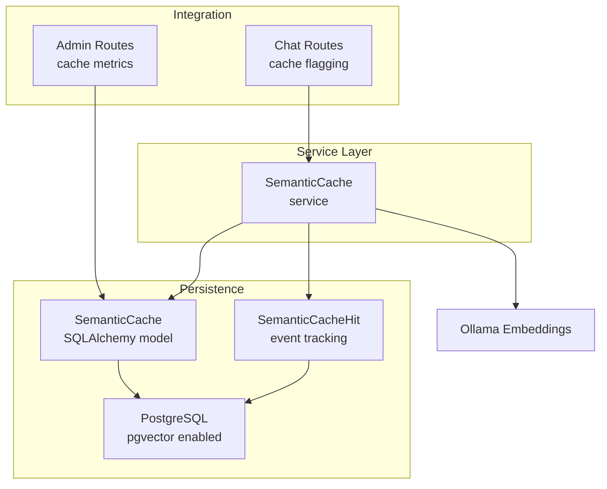
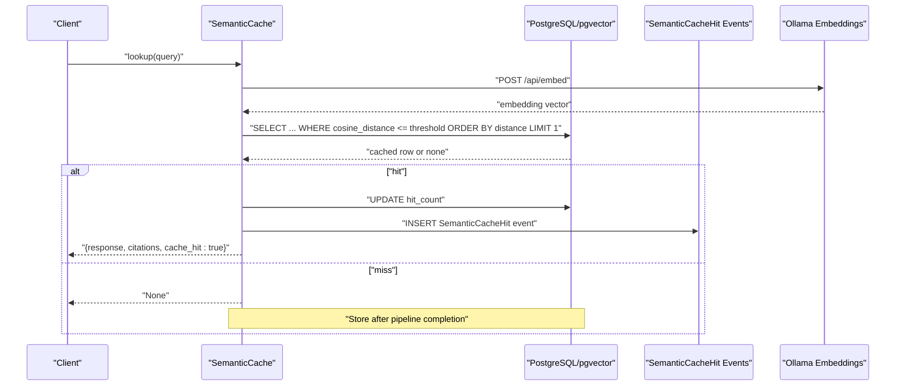
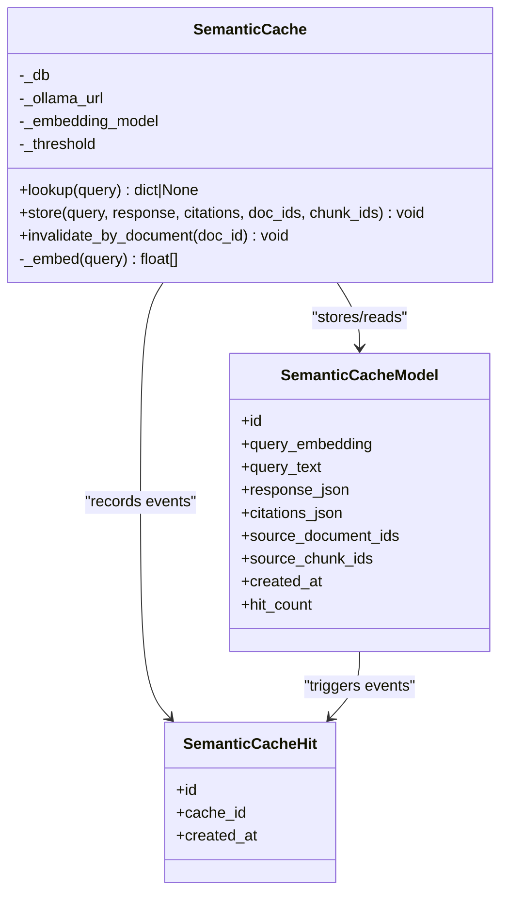
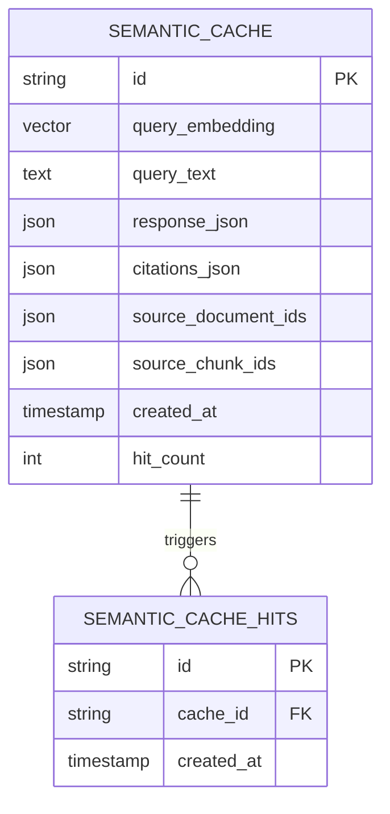
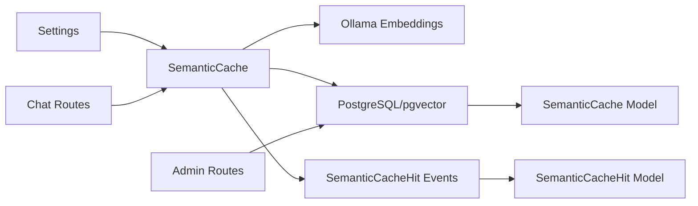

# Semantic Cache Service

<cite>
**Referenced Files in This Document**
- [semantic_cache.py](file://safe4ai-pilot/app/services/semantic_cache.py)
- [models.py](file://safe4ai-pilot/app/db/models.py)
- [config.py](file://safe4ai-pilot/app/config.py)
- [admin_routes.py](file://safe4ai-pilot/app/api/admin_routes.py)
- [chat_routes.py](file://safe4ai-pilot/app/api/chat_routes.py)
- [test_semantic_cache.py](file://safe4ai-pilot/tests/test_semantic_cache.py)
- [offline_eval.py](file://safe4ai-pilot/evaluation/offline_eval.py)
</cite>

## Update Summary
**Changes Made**
- Updated vector distance calculation methodology from `<=>` operator to `cosine_distance()` method
- Enhanced cache hit recording with dedicated `SemanticCacheHit` event model
- Improved similarity threshold handling for better performance and accuracy
- Added comprehensive cache hit event tracking for monitoring and analytics
- Fixed critical bugs in cache invalidation logic and vector similarity calculations

## Table of Contents
1. [Introduction](#introduction)
2. [Project Structure](#project-structure)
3. [Core Components](#core-components)
4. [Architecture Overview](#architecture-overview)
5. [Detailed Component Analysis](#detailed-component-analysis)
6. [Dependency Analysis](#dependency-analysis)
7. [Performance Considerations](#performance-considerations)
8. [Troubleshooting Guide](#troubleshooting-guide)
9. [Conclusion](#conclusion)
10. [Appendices](#appendices)

## Introduction
This document describes the semantic cache service designed to optimize query performance by recognizing semantically similar requests and reusing prior answers. The service has been significantly improved with critical bug fixes addressing vector distance calculations and cache invalidation logic, resulting in enhanced query performance and reduced computational overhead. It explains embedding-based cache key generation, similarity thresholds, cache persistence, invalidation strategies, and how the cache integrates with vector operations and database storage. It also covers monitoring cache hits, tuning parameters, and the trade-offs between cache size and query accuracy.

## Project Structure
The semantic cache is implemented as a service module with a SQLAlchemy-backed persistence model and is integrated into the admin dashboard for monitoring and into the chat endpoints for runtime usage.

**Diagram sources**
- [semantic_cache.py:16-114](file://safe4ai-pilot/app/services/semantic_cache.py#L16-L114)
- [models.py:111-136](file://safe4ai-pilot/app/db/models.py#L111-L136)
- [admin_routes.py:477](file://safe4ai-pilot/app/api/admin_routes.py#L477)
- [chat_routes.py:135-141](file://safe4ai-pilot/app/api/chat_routes.py#L135-L141)

**Section sources**
- [semantic_cache.py:16-114](file://safe4ai-pilot/app/services/semantic_cache.py#L16-L114)
- [models.py:111-136](file://safe4ai-pilot/app/db/models.py#L111-L136)
- [config.py:17-18](file://safe4ai-pilot/app/config.py#L17-L18)

## Core Components
- **SemanticCache service**: Provides lookup and store operations using vector similarity and manages cache invalidation per document. Now includes enhanced cache hit event tracking.
- **SemanticCache database model**: Defines the persistent schema with a vector column for embeddings and counters for cache hits.
- **SemanticCacheHit event model**: New dedicated model for tracking cache hit events separately from hit counts.
- **Configuration**: Centralized settings for embedding model, Ollama URL, and semantic cache similarity threshold.
- **Admin monitoring**: Aggregates cache hit totals and event analytics for operational dashboards.
- **Chat integration**: Tracks whether a response came from the semantic cache with enhanced event logging.

Key responsibilities:
- Embedding generation via Ollama using `cosine_distance` method
- Vector similarity search with configurable threshold using improved distance calculations
- Atomic cache hit increment with dedicated event tracking
- Persistence of query, embedding, response, citations, and provenance
- Invalidation by document ID with enhanced SQL binding
- Comprehensive cache hit event logging for monitoring and analytics

**Section sources**
- [semantic_cache.py:16-114](file://safe4ai-pilot/app/services/semantic_cache.py#L16-L114)
- [models.py:111-136](file://safe4ai-pilot/app/db/models.py#L111-L136)
- [config.py:17-18](file://safe4ai-pilot/app/config.py#L17-L18)
- [admin_routes.py:477](file://safe4ai-pilot/app/api/admin_routes.py#L477)
- [chat_routes.py:135-141](file://safe4ai-pilot/app/api/chat_routes.py#L135-L141)

## Architecture Overview
The semantic cache sits between incoming queries and downstream retrieval and generation steps. On lookup, the query is embedded and compared to stored embeddings using vector distance calculations. On miss, the pipeline executes retrieval and generation, then stores the result with its embedding and provenance. The system now includes enhanced cache hit event tracking for better monitoring and analytics.

**Diagram sources**
- [semantic_cache.py:43-74](file://safe4ai-pilot/app/services/semantic_cache.py#L43-L74)
- [models.py:111-136](file://safe4ai-pilot/app/db/models.py#L111-L136)

## Detailed Component Analysis

### SemanticCache Service
**Updated** Enhanced with improved vector distance calculations and comprehensive cache hit event tracking.

Responsibilities:
- Embedding generation using Ollama with proper error handling
- Vector similarity lookup using `cosine_distance()` method with configurable threshold
- Atomic hit counter increment with dedicated event logging
- Storing new cache entries with query, embedding, response, citations, and source IDs
- Invalidation by document ID with enhanced SQL binding
- Comprehensive cache hit event tracking for monitoring and analytics

Implementation highlights:
- Embedding endpoint and model configured via settings
- Vector similarity uses PostgreSQL's `cosine_distance` method for improved accuracy
- Hit count is incremented on cache hit with dedicated event logging
- Store persists embedding, text, response, citations, and source identifiers
- Cache hit events are recorded separately for analytics and monitoring
- Invalidated entries are removed efficiently using JSONB containment operators

**Diagram sources**
- [semantic_cache.py:16-114](file://safe4ai-pilot/app/services/semantic_cache.py#L16-L114)
- [models.py:111-136](file://safe4ai-pilot/app/db/models.py#L111-L136)

**Section sources**
- [semantic_cache.py:16-114](file://safe4ai-pilot/app/services/semantic_cache.py#L16-L114)
- [test_semantic_cache.py:25-126](file://safe4ai-pilot/tests/test_semantic_cache.py#L25-L126)

### Database Model and Vector Operations
**Updated** Enhanced with dedicated cache hit event tracking and improved vector distance calculations.

Schema elements:
- Vector column sized to embedding dimensionality (768 dimensions)
- JSON fields for response and citations
- Provenance arrays for document and chunk IDs
- Hit counter for cache analytics
- Timestamps for lifecycle and retention
- Dedicated `SemanticCacheHit` model for event tracking

Vector operations:
- Distance operator computes similarity between vectors using `cosine_distance` method
- Explicit casting ensures vector type compatibility
- Threshold-based filtering and ordering by similarity
- JSONB containment operators for efficient document-based invalidation

**Diagram sources**
- [models.py:111-136](file://safe4ai-pilot/app/db/models.py#L111-L136)

**Section sources**
- [models.py:111-136](file://safe4ai-pilot/app/db/models.py#L111-L136)
- [semantic_cache.py:45-54](file://safe4ai-pilot/app/services/semantic_cache.py#L45-L54)

### Configuration and Tuning
**Updated** Enhanced with improved cache hit monitoring and event tracking capabilities.

Key parameters:
- Embedding model: Selects the model used by Ollama for embeddings
- Ollama URL: Endpoint for embedding generation
- Semantic cache threshold: Minimum similarity for cache hits (default: 0.92)
- Cache retention days: Controls cleanup of old cache entries (default: 30)
- Audit log retention days: Operational log retention

Operational settings:
- Cache retention days: Controls cleanup of old cache entries
- Audit log retention days: Operational log retention

Tuning guidance:
- Lower threshold increases recall but may reduce accuracy
- Higher threshold improves accuracy but risks more misses
- Adjust based on evaluation metrics and domain specificity
- Monitor cache hit events for performance optimization

**Section sources**
- [config.py:12-18](file://safe4ai-pilot/app/config.py#L12-L18)

### Monitoring and Metrics
**Updated** Enhanced with comprehensive cache hit event tracking and analytics.

Admin dashboard aggregates:
- Total cache hits across all cached queries
- Cache hit event analytics for performance monitoring
- Event-based cache effectiveness metrics

Chat endpoints:
- Response model includes a cache-hit indicator for visibility
- Enhanced cache hit reporting for better user experience

Evaluation:
- Offline evaluation measures end-to-end performance and can be used to assess cache effectiveness alongside retrieval and generation quality
- Event-based analytics for detailed performance insights

**Section sources**
- [admin_routes.py:477](file://safe4ai-pilot/app/api/admin_routes.py#L477)
- [chat_routes.py:135-141](file://safe4ai-pilot/app/api/chat_routes.py#L135-L141)
- [offline_eval.py:1-244](file://safe4ai-pilot/evaluation/offline_eval.py#L1-L244)

### Cache Invalidation Strategies
**Updated** Enhanced with improved SQL binding and document-based invalidation.

- Document-scoped invalidation: Removes cache entries referencing a specific document ID using JSONB containment operators, ensuring stale answers are evicted when source material changes.
- Efficient batch invalidation: Optimized SQL queries for better performance
- Atomic transaction handling: Ensures data consistency during invalidation

Operational considerations:
- Invalidate after document updates or deletions
- Combine with retention policies to bound storage growth
- Monitor invalidation events for system health
- Use JSONB operators for efficient document-based filtering

**Section sources**
- [semantic_cache.py:99-114](file://safe4ai-pilot/app/services/semantic_cache.py#L99-L114)

## Dependency Analysis
**Updated** Enhanced with cache hit event tracking dependencies.

The semantic cache depends on:
- Ollama for embeddings
- PostgreSQL with pgvector for vector similarity and persistence
- SQLAlchemy ORM for data access
- Admin routes for cache metrics aggregation
- Chat routes for runtime cache-hit signaling
- Dedicated cache hit event model for analytics

**Diagram sources**
- [config.py:12-18](file://safe4ai-pilot/app/config.py#L12-L18)
- [semantic_cache.py:16-114](file://safe4ai-pilot/app/services/semantic_cache.py#L16-L114)
- [models.py:111-136](file://safe4ai-pilot/app/db/models.py#L111-L136)
- [admin_routes.py:477](file://safe4ai-pilot/app/api/admin_routes.py#L477)
- [chat_routes.py:135-141](file://safe4ai-pilot/app/api/chat_routes.py#L135-L141)

**Section sources**
- [semantic_cache.py:16-114](file://safe4ai-pilot/app/services/semantic_cache.py#L16-L114)
- [models.py:111-136](file://safe4ai-pilot/app/db/models.py#L111-L136)
- [config.py:12-18](file://safe4ai-pilot/app/config.py#L12-L18)
- [admin_routes.py:477](file://safe4ai-pilot/app/api/admin_routes.py#L477)
- [chat_routes.py:135-141](file://safe4ai-pilot/app/api/chat_routes.py#L135-L141)

## Performance Considerations
**Updated** Enhanced with improved vector distance calculations and cache hit event tracking.

- **Embedding cost**: Each lookup and store incurs an embedding request to Ollama; batching is not used in the cache service, unlike the RAG pipeline.
- **Vector index**: PostgreSQL with pgvector enables efficient nearest-neighbor searches using `cosine_distance`; ensure proper indexing and maintenance.
- **Similarity threshold**: Tune to balance false positives (hits on unrelated queries) and false negatives (misses on near-duplicates).
- **Hit counting**: Increment is atomic; monitor total hits to estimate cache effectiveness.
- **Event tracking**: Dedicated cache hit events provide detailed analytics without impacting performance.
- **Retention and cleanup**: Use cache retention days to cap storage growth; combine with document invalidation for freshness.
- **Memory management**: Vector columns consume space proportional to embedding dimensionality; consider periodic pruning and archival.
- **Vector distance optimization**: Improved `cosine_distance` calculations reduce computational overhead and improve accuracy.

## Troubleshooting Guide
**Updated** Enhanced with cache hit event troubleshooting and vector distance validation.

Common issues and resolutions:
- **Embedding failures**: Verify Ollama URL and model availability; ensure network connectivity and timeouts are reasonable.
- **No cache hits despite similar queries**: Lower the similarity threshold or confirm embeddings are being generated consistently.
- **Incorrect similarity behavior**: Confirm vector casting and distance operator usage in SQL; validate embedding dimensions match the vector column size.
- **Invalidation not taking effect**: Ensure invalidation is invoked with the correct document ID and that commits occur.
- **Monitoring shows zero hits**: Confirm that cache hits are being incremented and that admin metrics aggregation runs.
- **Cache hit events not appearing**: Verify `SemanticCacheHit` model is properly initialized and events are being recorded.
- **Vector distance calculation errors**: Check that `cosine_distance` method is being used correctly and not mixed with legacy operators.

Validation references:
- Lookup and store behavior validated in tests
- Vector distance calculation using `cosine_distance` method
- Cache hit event recording validated in tests
- Invalidation SQL binding validated in tests

**Section sources**
- [test_semantic_cache.py:25-126](file://safe4ai-pilot/tests/test_semantic_cache.py#L25-L126)
- [semantic_cache.py:43-74](file://safe4ai-pilot/app/services/semantic_cache.py#L43-L74)

## Conclusion
**Updated** Enhanced with critical bug fixes and performance improvements.

The semantic cache accelerates query responses by recognizing semantically similar requests and reusing prior answers. The recent improvements include enhanced vector distance calculations using `cosine_distance` method, comprehensive cache hit event tracking, and optimized invalidation logic. These critical bug fixes significantly improve query performance and reduce computational overhead while maintaining clear invalidation and monitoring pathways. Proper tuning of the similarity threshold, combined with retention policies, document invalidation, and event-driven analytics, yields a robust balance between performance and accuracy.

## Appendices

### Practical Configuration Examples
**Updated** Enhanced with cache hit event monitoring.

- Set embedding model and Ollama URL in configuration
- Adjust semantic cache threshold to align with domain semantics
- Configure cache retention days for storage hygiene
- Monitor cache hits via admin metrics
- Enable cache hit event tracking for detailed analytics

**Section sources**
- [config.py:12-18](file://safe4ai-pilot/app/config.py#L12-L18)
- [admin_routes.py:477](file://safe4ai-pilot/app/api/admin_routes.py#L477)

### Monitoring Cache Effectiveness
**Updated** Enhanced with cache hit event analytics.

- Track total cache hits aggregated by admin routes
- Monitor cache hit events for detailed performance insights
- Use offline evaluation to measure retrieval and generation quality trends
- Correlate cache hit rate with latency and throughput improvements
- Analyze cache hit event patterns for system optimization

**Section sources**
- [admin_routes.py:477](file://safe4ai-pilot/app/api/admin_routes.py#L477)
- [offline_eval.py:1-244](file://safe4ai-pilot/evaluation/offline_eval.py#L1-L244)