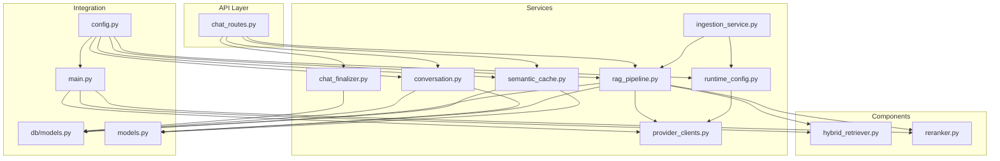
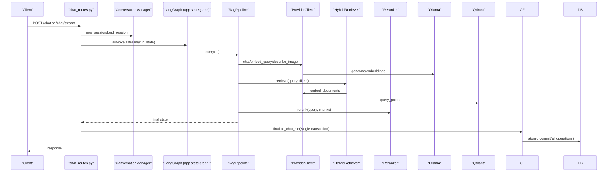
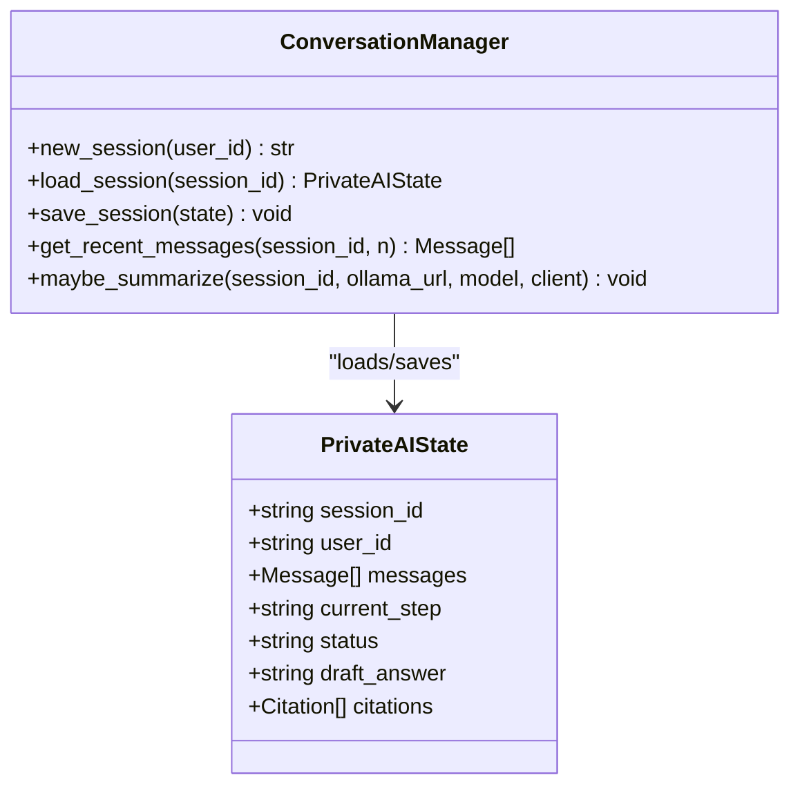
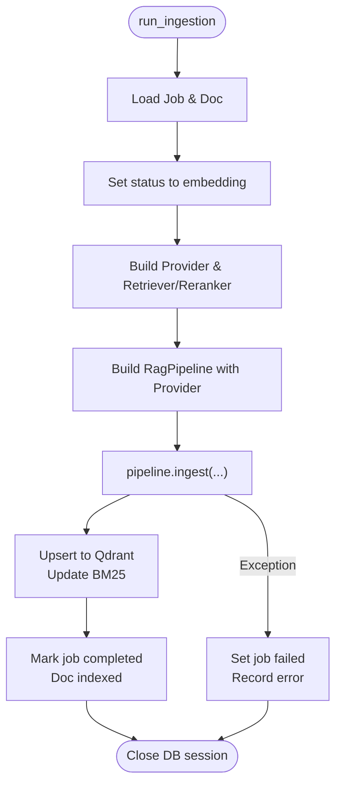
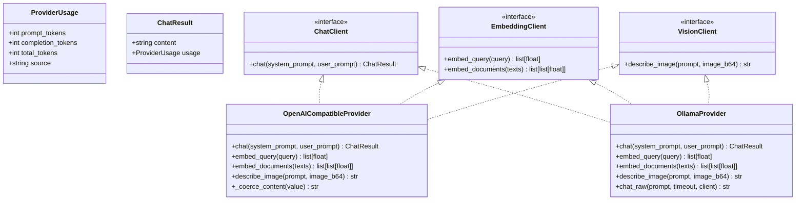
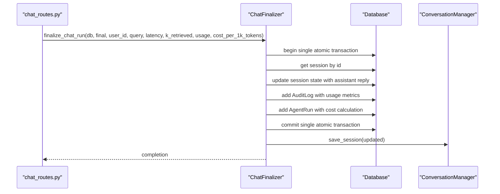
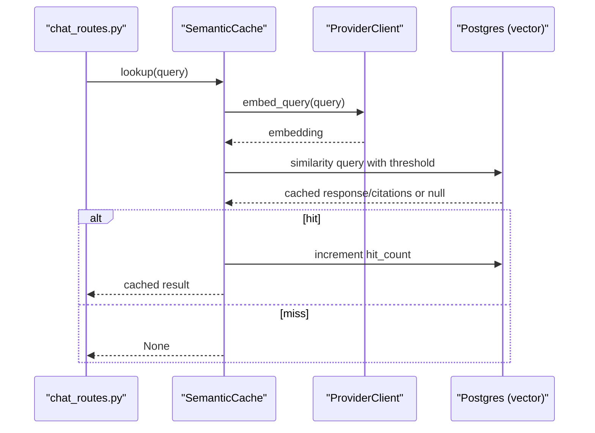
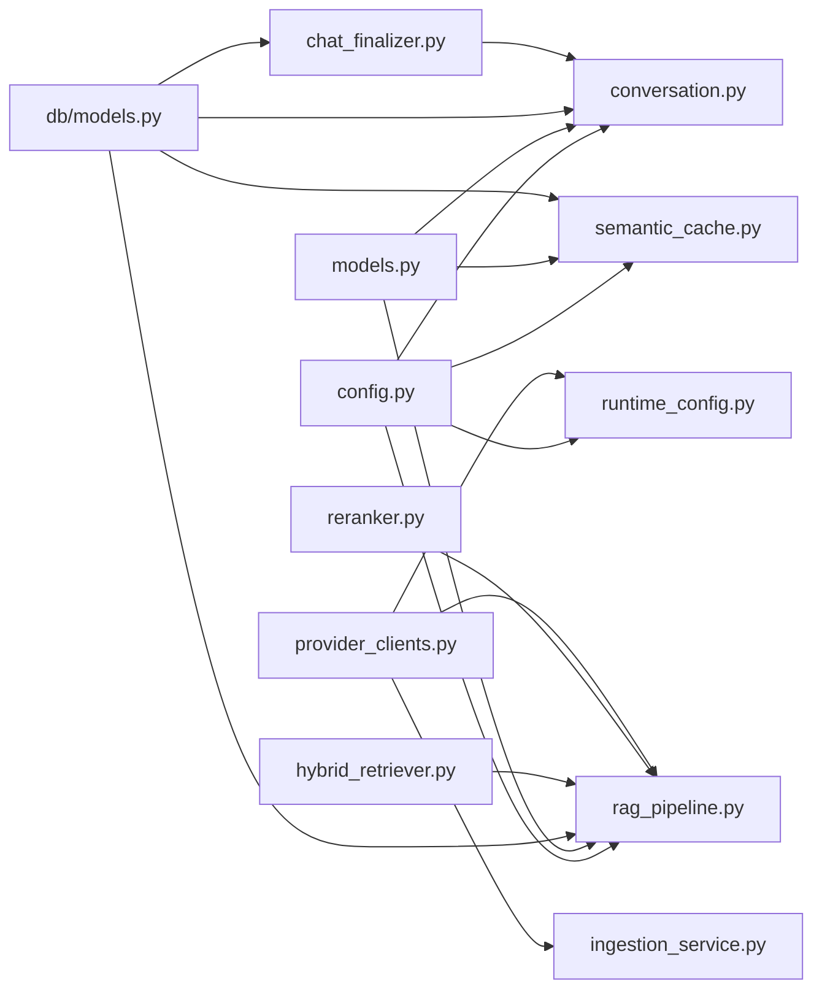

# Service Layer

<cite>
**Referenced Files in This Document**
- [conversation.py](file://safe4ai-pilot/app/services/conversation.py)
- [ingestion_service.py](file://safe4ai-pilot/app/services/ingestion_service.py)
- [rag_pipeline.py](file://safe4ai-pilot/app/services/rag_pipeline.py)
- [semantic_cache.py](file://safe4ai-pilot/app/services/semantic_cache.py)
- [provider_clients.py](file://safe4ai-pilot/app/services/provider_clients.py)
- [chat_finalizer.py](file://safe4ai-pilot/app/services/chat_finalizer.py)
- [runtime_config.py](file://safe4ai-pilot/app/services/runtime_config.py)
- [hybrid_retriever.py](file://safe4ai-pilot/app/components/hybrid_retriever.py)
- [reranker.py](file://safe4ai-pilot/app/components/reranker.py)
- [config.py](file://safe4ai-pilot/app/config.py)
- [models.py](file://safe4ai-pilot/app/models.py)
- [db/models.py](file://safe4ai-pilot/app/db/models.py)
- [main.py](file://safe4ai-pilot/app/main.py)
- [chat_routes.py](file://safe4ai-pilot/app/api/chat_routes.py)
- [test_conversation.py](file://safe4ai-pilot/tests/test_conversation.py)
- [test_rag_pipeline.py](file://safe4ai-pilot/tests/test_rag_pipeline.py)
- [test_semantic_cache.py](file://safe4ai-pilot/tests/test_semantic_cache.py)
- [test_provider_clients.py](file://safe4ai-pilot/tests/test_provider_clients.py)
</cite>

## Update Summary
**Changes Made**
- Enhanced Provider Clients module with standardized message format handling and content coercion for structured payloads
- Added multimodal image description capabilities with base64-encoded image processing
- Updated OllamaProvider to use /api/chat endpoint with proper system prompt handling
- Implemented OpenAICompatibleProvider content coercion for robust response handling
- Improved provider client architecture with standardized message format handling
- **Updated Chat Finalizer service with architectural improvements**: Removed nested database transactions that could cause deadlocks and inconsistent state management. The new implementation performs all database operations sequentially with single atomic transaction commit, eliminating potential race conditions and ensuring data consistency throughout the chat completion process.

## Table of Contents
1. [Introduction](#introduction)
2. [Project Structure](#project-structure)
3. [Core Components](#core-components)
4. [Architecture Overview](#architecture-overview)
5. [Detailed Component Analysis](#detailed-component-analysis)
6. [Dependency Analysis](#dependency-analysis)
7. [Performance Considerations](#performance-considerations)
8. [Troubleshooting Guide](#troubleshooting-guide)
9. [Conclusion](#conclusion)
10. [Appendices](#appendices)

## Introduction
This document describes the service layer responsible for business logic orchestration, chat session management, document ingestion, retrieval-augmented generation (RAG), and semantic caching. It explains how services integrate with external systems (Ollama, Qdrant) and internal components (HybridRetriever, Reranker), and it provides practical examples of service composition, dependency injection, lifecycle management, and error handling.

**Updated** The service layer now features an enhanced pluggable provider architecture with standardized message format handling, content coercion for structured payloads, and comprehensive multimodal capabilities including base64-encoded image processing. The OllamaProvider has been updated to use the modern /api/chat endpoint with proper system prompt handling, while maintaining backward compatibility. **The chat finalization process has been architecturally improved to eliminate nested database transactions and ensure atomic data consistency throughout chat completion operations.**

## Project Structure
The service layer is organized around five primary services:
- Conversation service: manages chat sessions, message history, and summarization.
- Ingestion service: orchestrates document processing, OCR, embedding generation, and indexing.
- RAG pipeline service: coordinates retrieval, reranking, and response generation with pluggable provider support.
- Semantic cache service: optimizes queries by storing and reusing similar answers.
- Provider clients: pluggable interface for different inference providers (OpenAI-compatible, Ollama) with enhanced message format handling.
- Chat finalizer: **architecturally improved** transactional persistence service for chat completions with usage tracking and atomic commit operations.

These services integrate with:
- Components: HybridRetriever and Reranker.
- Configuration: centralized settings for external URLs and thresholds.
- Models: shared Pydantic models for state and data transfer.
- Database: SQLAlchemy models and sessions for persistence.
- API: FastAPI routers that compose services into user-facing endpoints.

**Diagram sources**
- [chat_routes.py:1-492](file://safe4ai-pilot/app/api/chat_routes.py#L1-L492)
- [conversation.py:1-117](file://safe4ai-pilot/app/services/conversation.py#L1-L117)
- [ingestion_service.py:1-163](file://safe4ai-pilot/app/services/ingestion_service.py#L1-L163)
- [rag_pipeline.py:1-403](file://safe4ai-pilot/app/services/rag_pipeline.py#L1-L403)
- [semantic_cache.py:1-104](file://safe4ai-pilot/app/services/semantic_cache.py#L1-L104)
- [provider_clients.py:1-239](file://safe4ai-pilot/app/services/provider_clients.py#L1-L239)
- [chat_finalizer.py:1-71](file://safe4ai-pilot/app/services/chat_finalizer.py#L1-L71)
- [runtime_config.py:1-172](file://safe4ai-pilot/app/services/runtime_config.py#L1-L172)
- [hybrid_retriever.py:1-145](file://safe4ai-pilot/app/components/hybrid_retriever.py#L1-L145)
- [reranker.py:1-36](file://safe4ai-pilot/app/components/reranker.py#L1-L36)
- [config.py:1-48](file://safe4ai-pilot/app/config.py#L1-L48)
- [db/models.py:1-182](file://safe4ai-pilot/app/db/models.py#L1-L182)
- [models.py:1-95](file://safe4ai-pilot/app/models.py#L1-L95)
- [main.py:1-342](file://safe4ai-pilot/app/main.py#L1-L342)

**Section sources**
- [main.py:28-61](file://safe4ai-pilot/app/main.py#L28-L61)
- [chat_routes.py:115-251](file://safe4ai-pilot/app/api/chat_routes.py#L115-L251)

## Core Components
- ConversationManager: Creates, loads, saves sessions; enforces size limits; optionally summarizes long histories via an LLM call.
- Ingestion orchestration: Runs document ingestion as a background task, updates statuses, and recovers stuck jobs using pluggable providers.
- RagPipeline: Handles file parsing, chunking, embedding, upsert to Qdrant, BM25 index updates, retrieval, reranking, and generation with provider pluggability.
- SemanticCache: Embeds queries, performs similarity lookup, stores responses and citations, invalidates entries by document.
- ProviderClients: Enhanced pluggable interface supporting OpenAI-compatible APIs and Ollama with standardized usage tracking, content coercion, and multimodal capabilities.
- ChatFinalizer: **Architecturally improved** transactional service that persists chat completions, audit logs, and cost records in a single atomic operation, eliminating nested transactions and ensuring data consistency.

**Section sources**
- [conversation.py:26-117](file://safe4ai-pilot/app/services/conversation.py#L26-L117)
- [ingestion_service.py:21-163](file://safe4ai-pilot/app/services/ingestion_service.py#L21-L163)
- [rag_pipeline.py:34-403](file://safe4ai-pilot/app/services/rag_pipeline.py#L34-L403)
- [semantic_cache.py:14-104](file://safe4ai-pilot/app/services/semantic_cache.py#L14-L104)
- [provider_clients.py:24-239](file://safe4ai-pilot/app/services/provider_clients.py#L24-L239)
- [chat_finalizer.py:14-71](file://safe4ai-pilot/app/services/chat_finalizer.py#L14-L71)

## Architecture Overview
The system initializes shared components at startup, wires them into the FastAPI application state, and exposes chat endpoints that drive a state machine (LangGraph) composed of nodes for intake, rewrite, retrieve, grade, decompose, generate, and output filtering. Services are injected via constructor parameters and configured centrally with support for multiple inference providers.

**Updated** The architecture now supports enhanced pluggable providers through a standardized interface with improved message format handling, content coercion for structured payloads, and comprehensive multimodal capabilities including base64-encoded image processing. **The chat finalization process has been redesigned with architectural improvements that eliminate nested database transactions and ensure atomic commit operations for enhanced data consistency.**

**Diagram sources**
- [chat_routes.py:115-251](file://safe4ai-pilot/app/api/chat_routes.py#L115-L251)
- [conversation.py:26-117](file://safe4ai-pilot/app/services/conversation.py#L26-L117)
- [rag_pipeline.py:151-182](file://safe4ai-pilot/app/services/rag_pipeline.py#L151-L182)
- [provider_clients.py:52-239](file://safe4ai-pilot/app/services/provider_clients.py#L52-L239)
- [chat_finalizer.py:14-71](file://safe4ai-pilot/app/services/chat_finalizer.py#L14-L71)
- [hybrid_retriever.py:57-145](file://safe4ai-pilot/app/components/hybrid_retriever.py#L57-L145)
- [reranker.py:15-36](file://safe4ai-pilot/app/components/reranker.py#L15-L36)
- [main.py:28-61](file://safe4ai-pilot/app/main.py#L28-L61)

## Detailed Component Analysis

### Conversation Service
Responsibilities:
- Create and persist sessions with JSON-encoded state.
- Load and validate session state using Pydantic models.
- Save updated state after stripping unsafe control characters.
- Summarize long conversations using an LLM call to Ollama.

Key behaviors:
- Enforces a hard limit on serialized state size.
- Uses a prompt registry to construct summarization prompts.
- Integrates with FastAPI via dependency-injected SQLAlchemy sessions.

**Diagram sources**
- [conversation.py:26-117](file://safe4ai-pilot/app/services/conversation.py#L26-L117)
- [models.py:49-95](file://safe4ai-pilot/app/models.py#L49-L95)

Practical examples:
- Dependency injection: ConversationManager(db) receives a SQLAlchemy session.
- Error handling: Raises KeyError for missing sessions; raises ValueError for invalid state; truncates oversized state.
- Lifecycle: Created per request; persists to database; summarized asynchronously when threshold exceeded.

**Section sources**
- [conversation.py:26-117](file://safe4ai-pilot/app/services/conversation.py#L26-L117)
- [test_conversation.py:19-132](file://safe4ai-pilot/tests/test_conversation.py#L19-L132)

### Ingestion Service
Responsibilities:
- Run ingestion as a background task with its own database session.
- Orchestrate the RagPipeline to parse, embed, upsert, and index documents.
- Recover stuck ingestion jobs on startup.
- Build runtime components using pluggable providers.

Key behaviors:
- Updates job and document statuses to reflect progress.
- Builds HybridRetriever and Reranker with provider clients when not provided.
- Wraps failures to mark jobs as failed and records error messages.
- Supports both OpenAI-compatible and Ollama providers through runtime configuration.

**Diagram sources**
- [ingestion_service.py:23-112](file://safe4ai-pilot/app/services/ingestion_service.py#L23-L112)
- [rag_pipeline.py:62-150](file://safe4ai-pilot/app/services/rag_pipeline.py#L62-L150)
- [runtime_config.py:132-172](file://safe4ai-pilot/app/services/runtime_config.py#L132-L172)

Practical examples:
- Dependency injection: Receives optional retriever; otherwise constructs with settings and provider.
- Resource cleanup: Ensures DB session is closed in finally block.
- Startup recovery: recover_stuck_jobs resets stale jobs back to pending.
- Provider integration: Uses build_provider() to instantiate the configured inference provider.

**Section sources**
- [ingestion_service.py:21-163](file://safe4ai-pilot/app/services/ingestion_service.py#L21-L163)
- [config.py:7-48](file://safe4ai-pilot/app/config.py#L7-L48)
- [runtime_config.py:132-172](file://safe4ai-pilot/app/services/runtime_config.py#L132-L172)

### RAG Pipeline Service
Responsibilities:
- Parse supported file formats (PDF, DOCX, XLSX, TXT).
- Apply OCR to low-quality PDF pages.
- Split content into overlapping chunks.
- Generate embeddings via pluggable providers and upsert into Qdrant.
- Update BM25 index for sparse retrieval.
- Retrieve, rerank, and generate answers with configurable thresholds.

Key behaviors:
- Batch embedding requests to providers for efficiency.
- Fallback to OCR when text extraction is below threshold.
- Store DocumentChunk rows and update document status (indexed/skipped/failed).
- Enforce minimum rerank score to avoid low-confidence answers.
- Supports both OpenAI-compatible and Ollama providers through ChatClient interface.

**Updated** The RAG pipeline now accepts a provider_client parameter that implements the ChatClient, EmbeddingClient, or VisionClient protocols, enabling seamless switching between different inference providers while maintaining consistent behavior. Enhanced provider clients support standardized message format handling and content coercion for robust response processing.

**Diagram sources**
- [rag_pipeline.py:34-403](file://safe4ai-pilot/app/services/rag_pipeline.py#L34-L403)
- [hybrid_retriever.py:14-145](file://safe4ai-pilot/app/components/hybrid_retriever.py#L14-L145)
- [reranker.py:11-36](file://safe4ai-pilot/app/components/reranker.py#L11-L36)
- [provider_clients.py:24-35](file://safe4ai-pilot/app/services/provider_clients.py#L24-L35)
- [provider_clients.py:52-239](file://safe4ai-pilot/app/services/provider_clients.py#L52-L239)

Practical examples:
- Dependency injection: Constructed with retriever, reranker, provider_client, and settings.
- External integrations: Calls provider clients for embeddings and generation; Qdrant for vector storage.
- Error handling: Sets document status to failed for empty content; guards against low OCR confidence.
- Provider pluggability: Supports OpenAI-compatible and Ollama providers through unified interface.

**Section sources**
- [rag_pipeline.py:62-403](file://safe4ai-pilot/app/services/rag_pipeline.py#L62-L403)
- [test_rag_pipeline.py:48-264](file://safe4ai-pilot/tests/test_rag_pipeline.py#L48-L264)
- [provider_clients.py:52-239](file://safe4ai-pilot/app/services/provider_clients.py#L52-L239)

### Provider Clients
Responsibilities:
- Provide pluggable interface for different inference providers.
- Standardize usage tracking across providers.
- Support chat completions, embeddings, and vision capabilities.
- Handle provider-specific differences in API responses.
- Implement content coercion for structured payloads.
- Support multimodal image description with base64-encoded images.

Key behaviors:
- Define Protocol interfaces for ChatClient, EmbeddingClient, and VisionClient.
- Extract usage information from provider responses for cost tracking.
- Support both OpenAI-compatible APIs and local Ollama deployments.
- Provide fallback mechanisms for different provider capabilities.
- Implement standardized message format handling with content coercion.
- Enable multimodal capabilities with base64-encoded image processing.

**Updated** The provider clients module introduces a comprehensive pluggable architecture with enhanced message format handling, content coercion for structured payloads, and advanced multimodal capabilities. The OpenAICompatibleProvider now includes sophisticated content coercion that extracts text from structured responses, while the OllamaProvider has been updated to use the modern /api/chat endpoint with proper system prompt handling.

**Diagram sources**
- [provider_clients.py:10-35](file://safe4ai-pilot/app/services/provider_clients.py#L10-L35)
- [provider_clients.py:24-35](file://safe4ai-pilot/app/services/provider_clients.py#L24-L35)
- [provider_clients.py:52-239](file://safe4ai-pilot/app/services/provider_clients.py#L52-L239)

Practical examples:
- Interface usage: Both OpenAICompatibleProvider and OllamaProvider implement the same protocols.
- Usage extraction: _usage_from_openai() handles different provider usage field names.
- Content coercion: _coerce_content() extracts text from structured responses for robust processing.
- Multimodal capabilities: describe_image() supports base64-encoded image processing with standardized payload formats.
- Fallback implementations: OllamaProvider includes legacy API support for embeddings.
- Configuration: RuntimeConfig.build_provider() selects the appropriate provider based on settings.

**Section sources**
- [provider_clients.py:1-239](file://safe4ai-pilot/app/services/provider_clients.py#L1-L239)
- [runtime_config.py:132-172](file://safe4ai-pilot/app/services/runtime_config.py#L132-L172)
- [test_provider_clients.py:10-50](file://safe4ai-pilot/tests/test_provider_clients.py#L10-L50)

### Chat Finalizer
Responsibilities:
- Persist assistant replies, audit logs, and cost records in a single atomic transaction.
- Handle usage tracking and cost calculation for chat completions.
- Manage session state updates after successful chat completions.

Key behaviors:
- Uses SQLAlchemy transactions to ensure atomic persistence of all chat completion data.
- Calculates costs based on provider usage or token estimates.
- Creates AuditLog and AgentRun records with comprehensive metadata.
- Updates session state with the assistant's response.

**Updated** The chat finalizer service provides transactional persistence for chat completions with **architectural improvements** that eliminate nested database transactions and ensure data consistency throughout the chat completion process. The new implementation performs all database operations sequentially within a single atomic transaction commit, eliminating potential race conditions and preventing inconsistent state management that could occur with nested transactions.

**Diagram sources**
- [chat_finalizer.py:14-71](file://safe4ai-pilot/app/services/chat_finalizer.py#L14-L71)
- [chat_routes.py:410-473](file://safe4ai-pilot/app/api/chat_routes.py#L410-L473)

Practical examples:
- **Architectural improvement**: All chat completion data is saved in a single database transaction, eliminating nested transactions that could cause deadlocks.
- Usage tracking: Supports both actual provider usage and token estimates.
- Cost calculation: Automatically calculates costs based on usage and configured rates.
- Session management: Updates conversation state with the assistant's response.
- **Data consistency**: Single atomic commit ensures all operations succeed or fail together, preventing partial state updates.

**Section sources**
- [chat_finalizer.py:1-71](file://safe4ai-pilot/app/services/chat_finalizer.py#L1-L71)
- [chat_routes.py:404-473](file://safe4ai-pilot/app/api/chat_routes.py#L404-L473)

### Semantic Cache Service
Responsibilities:
- Embed incoming queries and compare against stored embeddings using a vector operator.
- Return cached responses and citations on similarity threshold hit.
- Store new query-response pairs with associated document/chunk IDs.
- Invalidate cache entries by document ID.

Key behaviors:
- Uses Postgres vector extension with cosine distance.
- Maintains hit counters and supports invalidation by document.

**Diagram sources**
- [semantic_cache.py:41-70](file://safe4ai-pilot/app/services/semantic_cache.py#L41-L70)
- [semantic_cache.py:71-104](file://safe4ai-pilot/app/services/semantic_cache.py#L71-L104)
- [config.py:18](file://safe4ai-pilot/app/config.py#L18)

Practical examples:
- Dependency injection: Receives DB session, provider client, and embedding model.
- Threshold tuning: Configured via settings; affects recall vs. precision.
- Cleanup: Supports invalidating cache entries when source documents change.

**Section sources**
- [semantic_cache.py:14-104](file://safe4ai-pilot/app/services/semantic_cache.py#L14-L104)
- [test_semantic_cache.py:25-107](file://safe4ai-pilot/tests/test_semantic_cache.py#L25-L107)

## Dependency Analysis
- Centralized configuration: Settings define external service URLs, model names, and thresholds.
- Shared models: PrivateAIState and related models unify state across services.
- Database models: Sessions, Documents, DocumentChunks, SemanticCache, Jobs define persistence contracts.
- Component coupling: RagPipeline depends on HybridRetriever and Reranker; ConversationManager depends on DB models and prompts; SemanticCache depends on Postgres vector extension.
- Provider architecture: Enhanced pluggable provider system allows switching between OpenAI-compatible APIs and Ollama deployments with standardized message format handling.
- **Architectural improvement**: ChatFinalizer provides atomic persistence for chat completions through single transaction commit, eliminating nested transaction risks.

**Updated** The dependency structure now includes enhanced provider clients as a central abstraction layer with standardized message format handling, enabling flexible provider selection and consistent behavior across all services. **The chat finalization dependency has been improved with architectural enhancements that ensure atomic transaction operations for enhanced data consistency.**

**Diagram sources**
- [config.py:7-48](file://safe4ai-pilot/app/config.py#L7-L48)
- [models.py:1-95](file://safe4ai-pilot/app/models.py#L1-L95)
- [db/models.py:1-182](file://safe4ai-pilot/app/db/models.py#L1-L182)
- [conversation.py:13-18](file://safe4ai-pilot/app/services/conversation.py#L13-L18)
- [rag_pipeline.py:20-53](file://safe4ai-pilot/app/services/rag_pipeline.py#L20-L53)
- [semantic_cache.py:15-25](file://safe4ai-pilot/app/services/semantic_cache.py#L15-L25)
- [provider_clients.py:1-239](file://safe4ai-pilot/app/services/provider_clients.py#L1-L239)
- [chat_finalizer.py:1-71](file://safe4ai-pilot/app/services/chat_finalizer.py#L1-L71)
- [runtime_config.py:1-172](file://safe4ai-pilot/app/services/runtime_config.py#L1-L172)

**Section sources**
- [config.py:7-48](file://safe4ai-pilot/app/config.py#L7-L48)
- [db/models.py:104-116](file://safe4ai-pilot/app/db/models.py#L104-L116)

## Performance Considerations
- Batch embeddings: RagPipeline batches embedding requests to reduce overhead.
- OCR fallback: Only triggers OCR for low-text pages to minimize compute.
- Hybrid retrieval: Combines dense vectors and BM25 to balance recall and speed.
- Semantic cache: Reduces repeated work for similar queries; tune threshold to balance latency and accuracy.
- Session size limits: ConversationManager prevents oversized state serialization.
- Provider efficiency: Enhanced pluggable providers allow selecting optimal inference backends.
- **Architectural improvement**: ChatFinalizer reduces database round-trips through atomic operations and eliminates nested transaction overhead.
- Content coercion: Efficiently processes structured responses from providers for consistent output handling.

**Updated** Performance improvements include enhanced provider pluggability with standardized message format handling, efficient content coercion for structured payloads, and optimized multimodal image processing capabilities. **The chat finalization process now benefits from architectural improvements that eliminate nested transaction overhead and ensure consistent performance through single atomic commit operations.**

## Troubleshooting Guide
Common issues and resolutions:
- Conversation session not found: Ensure session_id exists; handle KeyError gracefully in API.
- Invalid session state: Validate Pydantic models; catch ValueError and log details.
- Oversized session state: Truncate or summarize history before saving.
- Ingestion stuck jobs: Startup recovery resets jobs older than threshold back to pending.
- Low OCR confidence: Expect skipped status; trigger manual review or retry with higher DPI.
- Rerank score too low: Answer falls back to safe default; adjust rerank threshold or improve retrieval.
- Semantic cache misses: Increase threshold or populate cache with representative queries.
- Provider configuration errors: Check runtime configuration for correct provider settings.
- Usage tracking issues: Verify provider supports usage reporting for accurate cost tracking.
- **Architectural improvement**: Transaction failures: ChatFinalizer ensures atomic persistence through single commit; check database connectivity and ensure no nested transaction conflicts.
- Content coercion failures: Enhanced content coercion handles various response formats; check provider response structure.
- Multimodal image processing: Base64-encoded images must be properly formatted; verify image encoding and URL structure.

**Updated** Additional troubleshooting guidance for enhanced provider-related issues, content coercion problems, and multimodal image processing failures. **The chat finalization process now includes improved error handling for transaction consistency and atomic commit operations.**

**Section sources**
- [conversation.py:44-70](file://safe4ai-pilot/app/services/conversation.py#L44-L70)
- [ingestion_service.py:90-163](file://safe4ai-pilot/app/services/ingestion_service.py#L90-L163)
- [rag_pipeline.py:160-161](file://safe4ai-pilot/app/services/rag_pipeline.py#L160-L161)
- [semantic_cache.py:41-70](file://safe4ai-pilot/app/services/semantic_cache.py#L41-L70)
- [provider_clients.py:132-149](file://safe4ai-pilot/app/services/provider_clients.py#L132-L149)
- [chat_finalizer.py:31-71](file://safe4ai-pilot/app/services/chat_finalizer.py#L31-L71)

## Conclusion
The service layer cleanly separates concerns across conversation management, ingestion, RAG orchestration, semantic caching, and provider management. It integrates external systems via well-defined interfaces, centralizes configuration, and ensures robust error handling and lifecycle management. The modular design enables easy testing, extension, and deployment alongside FastAPI and LangGraph. The enhanced pluggable provider architecture with standardized message format handling, content coercion, and multimodal capabilities significantly improves flexibility, reliability, and performance across all chat operations.

**Updated** The enhanced service layer now provides a robust foundation for multiple inference providers with comprehensive message format handling, content coercion for structured payloads, and advanced multimodal capabilities while maintaining consistent performance and reliability. **The chat finalization process has been architecturally improved to eliminate nested database transactions, ensuring atomic commit operations that prevent deadlocks and maintain data consistency throughout chat completion workflows.**

## Appendices

### Service Composition Examples
- Chat endpoint composes ConversationManager, LangGraph, and RagPipeline to produce streaming or blocking responses with **improved transactional persistence**.
- Ingestion service composes RagPipeline with HybridRetriever and Reranker to process documents asynchronously using enhanced pluggable providers.
- SemanticCache wraps provider clients and embedding operations to accelerate query resolution.
- Enhanced provider clients enable seamless switching between OpenAI-compatible APIs and local Ollama deployments with standardized message format handling.

**Updated** Service composition now includes enhanced provider clients with content coercion and multimodal capabilities for improved reliability and cost tracking. **The chat finalization service composition now ensures atomic transaction operations for enhanced data consistency.**

**Section sources**
- [chat_routes.py:115-251](file://safe4ai-pilot/app/api/chat_routes.py#L115-L251)
- [ingestion_service.py:21-112](file://safe4ai-pilot/app/services/ingestion_service.py#L21-L112)
- [semantic_cache.py:14-104](file://safe4ai-pilot/app/services/semantic_cache.py#L14-L104)
- [provider_clients.py:132-172](file://safe4ai-pilot/app/services/provider_clients.py#L132-L172)
- [chat_finalizer.py:14-71](file://safe4ai-pilot/app/services/chat_finalizer.py#L14-L71)

### Dependency Injection Patterns
- Constructor injection: RagPipeline, SemanticCache, HybridRetriever accept required dependencies (URLs, models, sessions, enhanced provider clients).
- Application state: FastAPI lifespan builds and stores shared instances (HybridRetriever, Reranker, LangGraph, Enhanced ProviderClient) for reuse.
- Provider configuration: RuntimeConfig.build_provider() creates appropriate provider instances based on configuration with enhanced capabilities.
- **Architectural improvement**: Transactional services: ChatFinalizer uses SQLAlchemy sessions for atomic persistence operations through single commit transactions.

**Updated** Dependency injection patterns now include enhanced provider clients with standardized message format handling and multimodal capabilities for enhanced modularity. **The chat finalization service now follows improved dependency injection patterns with atomic transaction management.**

**Section sources**
- [rag_pipeline.py:34-75](file://safe4ai-pilot/app/services/rag_pipeline.py#L34-L75)
- [semantic_cache.py:15-25](file://safe4ai-pilot/app/services/semantic_cache.py#L15-L25)
- [main.py:43-56](file://safe4ai-pilot/app/main.py#L43-L56)
- [runtime_config.py:132-172](file://safe4ai-pilot/app/services/runtime_config.py#L132-L172)
- [chat_finalizer.py:14-71](file://safe4ai-pilot/app/services/chat_finalizer.py#L14-L71)

### Service Lifecycle and Resource Cleanup
- ConversationManager: Per-request session creation and persistence; asynchronous summarization does not block.
- Ingestion service: Owns DB session; commits or rolls back on completion; closes session in finally; uses enhanced provider clients for embeddings.
- RAG pipeline: Manages temporary files for OCR; relies on enhanced provider clients for embeddings and generation with standardized message format handling; updates BM25 index after ingestion.
- Semantic cache: Performs embedding and SQL operations within controlled scopes; increments hit counters atomically.
- Enhanced provider clients: Manage HTTP connections and handle provider-specific API differences with content coercion and multimodal capabilities.
- **Architectural improvement**: Chat finalizer: Performs transactional persistence for chat completions using single atomic commit; ensures all related records are updated consistently without nested transaction risks.

**Updated** Service lifecycle management now includes enhanced provider client management with standardized message format handling and transactional persistence for improved reliability. **The chat finalization service lifecycle now includes improved transaction management with atomic commit operations for enhanced data consistency.**

**Section sources**
- [conversation.py:75-117](file://safe4ai-pilot/app/services/conversation.py#L75-L117)
- [ingestion_service.py:33-112](file://safe4ai-pilot/app/services/ingestion_service.py#L33-L112)
- [rag_pipeline.py:187-201](file://safe4ai-pilot/app/services/rag_pipeline.py#L187-L201)
- [semantic_cache.py:41-92](file://safe4ai-pilot/app/services/semantic_cache.py#L41-L92)
- [provider_clients.py:52-239](file://safe4ai-pilot/app/services/provider_clients.py#L52-L239)
- [chat_finalizer.py:31-71](file://safe4ai-pilot/app/services/chat_finalizer.py#L31-L71)