# Service Layer

<cite>
**Referenced Files in This Document**
- [conversation.py](file://safe4ai-pilot/app/services/conversation.py)
- [ingestion_service.py](file://safe4ai-pilot/app/services/ingestion_service.py)
- [rag_pipeline.py](file://safe4ai-pilot/app/services/rag_pipeline.py)
- [semantic_cache.py](file://safe4ai-pilot/app/services/semantic_cache.py)
- [provider_clients.py](file://safe4ai-pilot/app/services/provider_clients.py)
- [chat_finalizer.py](file://safe4ai-pilot/app/services/chat_finalizer.py)
- [runtime_config.py](file://safe4ai-pilot/app/services/runtime_config.py)
- [cost_service.py](file://safe4ai-pilot/app/services/cost_service.py)
- [document_service.py](file://safe4ai-pilot/app/services/document_service.py)
- [user_service.py](file://safe4ai-pilot/app/services/user_service.py)
- [stats_service.py](file://safe4ai-pilot/app/services/stats_service.py)
- [settings_service.py](file://safe4ai-pilot/app/services/settings_service.py)
- [hybrid_retriever.py](file://safe4ai-pilot/app/components/hybrid_retriever.py)
- [reranker.py](file://safe4ai-pilot/app/components/reranker.py)
- [config.py](file://safe4ai-pilot/app/config.py)
- [models.py](file://safe4ai-pilot/app/models.py)
- [db/models.py](file://safe4ai-pilot/app/db/models.py)
- [main.py](file://safe4ai-pilot/app/main.py)
- [chat_routes.py](file://safe4ai-pilot/app/api/chat_routes.py)
- [test_conversation.py](file://safe4ai-pilot/tests/test_conversation.py)
- [test_rag_pipeline.py](file://safe4ai-pilot/tests/test_rag_pipeline.py)
- [test_semantic_cache.py](file://safe4ai-pilot/tests/test_semantic_cache.py)
- [test_provider_clients.py](file://safe4ai-pilot/tests/test_provider_clients.py)
</cite>

## Update Summary
**Changes Made**
- Added five new dedicated service modules for improved separation of concerns: cost_service.py, document_service.py, user_service.py, stats_service.py, and settings_service.py
- Enhanced cost management with dedicated cost tracking and ceiling enforcement functionality
- Expanded document lifecycle management with Qdrant cleanup and BM25 pruning capabilities
- Introduced user lifecycle services for ghost user creation and deactivation cascading
- Added shared statistics aggregation for corpus metrics
- Implemented comprehensive settings patch business logic with three-stage validation pipeline
- Improved testability and modularity through dedicated service boundaries

## Table of Contents
1. [Introduction](#introduction)
2. [Project Structure](#project-structure)
3. [Core Components](#core-components)
4. [Architecture Overview](#architecture-overview)
5. [Detailed Component Analysis](#detailed-component-analysis)
6. [Dependency Analysis](#dependency-analysis)
7. [Performance Considerations](#performance-considerations)
8. [Troubleshooting Guide](#troubleshooting-guide)
9. [Conclusion](#conclusion)
10. [Appendices](#appendices)

## Introduction
This document describes the service layer responsible for business logic orchestration, chat session management, document ingestion, retrieval-augmented generation (RAG), and semantic caching. The service layer has been expanded with dedicated services for cost management, document lifecycle, user management, statistics, and settings, improving separation of concerns and testability. It explains how services integrate with external systems (Ollama, Qdrant) and internal components (HybridRetriever, Reranker), and it provides practical examples of service composition, dependency injection, lifecycle management, and error handling.

**Updated** The service layer now includes five new dedicated service modules that enhance separation of concerns and improve testability: cost_service for cost tracking and ceiling enforcement, document_service for document lifecycle management, user_service for user lifecycle operations, stats_service for shared statistics aggregation, and settings_service for comprehensive settings management with three-stage validation pipeline.

## Project Structure
The service layer is organized around seven primary services:
- Conversation service: manages chat sessions, message history, and summarization.
- Ingestion service: orchestrates document processing, OCR, embedding generation, and indexing.
- RAG pipeline service: coordinates retrieval, reranking, and response generation with pluggable provider support.
- Semantic cache service: optimizes queries by storing and reusing similar answers.
- Provider clients: pluggable interface for different inference providers (OpenAI-compatible, Ollama) with enhanced message format handling.
- Chat finalizer: transactional persistence service for chat completions with usage tracking and atomic commit operations.
- **New** Cost service: dedicated cost tracking and ceiling enforcement for chat requests with usage estimation and provider integration.
- **New** Document service: document lifecycle helpers for Qdrant cleanup and BM25 index pruning.
- **New** User service: user lifecycle management including ghost user creation and deactivation cascading.
- **New** Stats service: shared statistics aggregation for corpus metrics and document analytics.
- **New** Settings service: comprehensive settings patch business logic with three-stage validation pipeline.

These services integrate with:
- Components: HybridRetriever and Reranker.
- Configuration: centralized settings for external URLs and thresholds.
- Models: shared Pydantic models for state and data transfer.
- Database: SQLAlchemy models and sessions for persistence.
- API: FastAPI routers that compose services into user-facing endpoints.

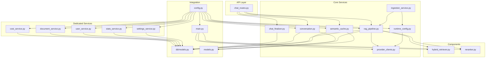

**Diagram sources**
- [chat_routes.py:1-492](file://safe4ai-pilot/app/api/chat_routes.py#L1-L492)
- [conversation.py:1-122](file://safe4ai-pilot/app/services/conversation.py#L1-L122)
- [ingestion_service.py:1-167](file://safe4ai-pilot/app/services/ingestion_service.py#L1-L167)
- [rag_pipeline.py:1-345](file://safe4ai-pilot/app/services/rag_pipeline.py#L1-L345)
- [semantic_cache.py:1-104](file://safe4ai-pilot/app/services/semantic_cache.py#L1-L104)
- [provider_clients.py:1-239](file://safe4ai-pilot/app/services/provider_clients.py#L1-L239)
- [chat_finalizer.py:1-71](file://safe4ai-pilot/app/services/chat_finalizer.py#L1-L71)
- [runtime_config.py:1-172](file://safe4ai-pilot/app/services/runtime_config.py#L1-L172)
- [cost_service.py:1-104](file://safe4ai-pilot/app/services/cost_service.py#L1-L104)
- [document_service.py:1-40](file://safe4ai-pilot/app/services/document_service.py#L1-L40)
- [user_service.py:1-91](file://safe4ai-pilot/app/services/user_service.py#L1-L91)
- [stats_service.py:1-38](file://safe4ai-pilot/app/services/stats_service.py#L1-L38)
- [settings_service.py:1-611](file://safe4ai-pilot/app/services/settings_service.py#L1-L611)
- [hybrid_retriever.py:1-145](file://safe4ai-pilot/app/components/hybrid_retriever.py#L1-L145)
- [reranker.py:1-36](file://safe4ai-pilot/app/components/reranker.py#L1-L36)
- [config.py:1-48](file://safe4ai-pilot/app/config.py#L1-L48)
- [db/models.py:1-182](file://safe4ai-pilot/app/db/models.py#L1-L182)
- [models.py:1-95](file://safe4ai-pilot/app/models.py#L1-L95)
- [main.py:1-342](file://safe4ai-pilot/app/main.py#L1-L342)

**Section sources**
- [main.py:28-61](file://safe4ai-pilot/app/main.py#L28-L61)
- [chat_routes.py:115-251](file://safe4ai-pilot/app/api/chat_routes.py#L115-L251)

## Core Components
- ConversationManager: Creates, loads, saves sessions; enforces size limits; optionally summarizes long histories via an LLM call.
- Ingestion orchestration: Runs document ingestion as a background task, updates statuses, and recovers stuck jobs using pluggable providers.
- RagPipeline: Handles file parsing, chunking, embedding, upsert to Qdrant, BM25 index updates, retrieval, reranking, and generation with provider pluggability.
- SemanticCache: Embeds queries, performs similarity lookup, stores responses and citations, invalidates entries by document.
- ProviderClients: Enhanced pluggable interface supporting OpenAI-compatible APIs and Ollama with standardized usage tracking, content coercion, and multimodal capabilities.
- ChatFinalizer: Transactional service that persists chat completions, audit logs, and cost records in a single atomic operation, eliminating nested transactions and ensuring data consistency.
- **New** CostService: Dedicated cost tracking and ceiling enforcement with usage estimation, provider integration, and exception handling for cost management.
- **New** DocumentService: Document lifecycle helpers for Qdrant cleanup and BM25 index pruning with best-effort operations and logging.
- **New** UserService: User lifecycle management including ghost user creation, deactivation cascading, and PII handling.
- **New** StatsService: Shared statistics aggregation for corpus metrics including document and chunk counts with status filtering.
- **New** SettingsService: Comprehensive settings patch business logic with three-stage validation pipeline (normalize, probe, collect) and live metadata caching.

**Section sources**
- [conversation.py:26-122](file://safe4ai-pilot/app/services/conversation.py#L26-L122)
- [ingestion_service.py:23-167](file://safe4ai-pilot/app/services/ingestion_service.py#L23-L167)
- [rag_pipeline.py:34-345](file://safe4ai-pilot/app/services/rag_pipeline.py#L34-L345)
- [semantic_cache.py:14-104](file://safe4ai-pilot/app/services/semantic_cache.py#L14-L104)
- [provider_clients.py:24-239](file://safe4ai-pilot/app/services/provider_clients.py#L24-L239)
- [chat_finalizer.py:14-71](file://safe4ai-pilot/app/services/chat_finalizer.py#L14-L71)
- [cost_service.py:20-104](file://safe4ai-pilot/app/services/cost_service.py#L20-L104)
- [document_service.py:17-40](file://safe4ai-pilot/app/services/document_service.py#L17-L40)
- [user_service.py:29-91](file://safe4ai-pilot/app/services/user_service.py#L29-L91)
- [stats_service.py:14-38](file://safe4ai-pilot/app/services/stats_service.py#L14-L38)
- [settings_service.py:46-611](file://safe4ai-pilot/app/services/settings_service.py#L46-L611)

## Architecture Overview
The system initializes shared components at startup, wires them into the FastAPI application state, and exposes chat endpoints that drive a state machine (LangGraph) composed of nodes for intake, rewrite, retrieve, grade, decompose, generate, and output filtering. Services are injected via constructor parameters and configured centrally with support for multiple inference providers. The new dedicated services provide focused business logic with clear separation of concerns.

**Updated** The architecture now includes five new dedicated service modules that enhance separation of concerns and improve testability. The cost service provides centralized cost management, document service handles lifecycle operations, user service manages user lifecycle, stats service offers shared aggregations, and settings service implements comprehensive configuration management with three-stage validation.

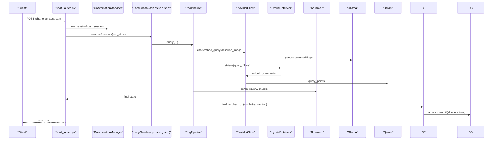

**Diagram sources**
- [chat_routes.py:115-251](file://safe4ai-pilot/app/api/chat_routes.py#L115-L251)
- [conversation.py:26-122](file://safe4ai-pilot/app/services/conversation.py#L26-L122)
- [rag_pipeline.py:172-202](file://safe4ai-pilot/app/services/rag_pipeline.py#L172-L202)
- [provider_clients.py:52-239](file://safe4ai-pilot/app/services/provider_clients.py#L52-L239)
- [chat_finalizer.py:14-71](file://safe4ai-pilot/app/services/chat_finalizer.py#L14-L71)
- [hybrid_retriever.py:57-145](file://safe4ai-pilot/app/components/hybrid_retriever.py#L57-L145)
- [reranker.py:15-36](file://safe4ai-pilot/app/components/reranker.py#L15-L36)
- [main.py:28-61](file://safe4ai-pilot/app/main.py#L28-L61)

## Detailed Component Analysis

### Conversation Service
Responsibilities:
- Create and persist sessions with JSON-encoded state.
- Load and validate session state using Pydantic models.
- Save updated state after stripping unsafe control characters.
- Summarize long conversations using an LLM call to Ollama.

Key behaviors:
- Enforces a hard limit on serialized state size.
- Uses a prompt registry to construct summarization prompts.
- Integrates with FastAPI via dependency-injected SQLAlchemy sessions.

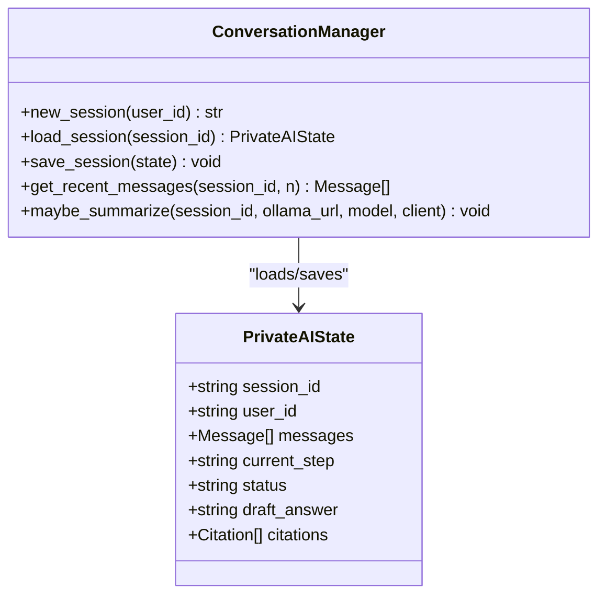

**Diagram sources**
- [conversation.py:26-122](file://safe4ai-pilot/app/services/conversation.py#L26-L122)
- [models.py:49-95](file://safe4ai-pilot/app/models.py#L49-L95)

Practical examples:
- Dependency injection: ConversationManager(db) receives a SQLAlchemy session.
- Error handling: Raises KeyError for missing sessions; raises ValueError for invalid state; truncates oversized state.
- Lifecycle: Created per request; persists to database; summarized asynchronously when threshold exceeded.

**Section sources**
- [conversation.py:26-122](file://safe4ai-pilot/app/services/conversation.py#L26-L122)
- [test_conversation.py:19-132](file://safe4ai-pilot/tests/test_conversation.py#L19-L132)

### Ingestion Service
Responsibilities:
- Run ingestion as a background task with its own database session.
- Orchestrate the RagPipeline to parse, embed, upsert, and index documents.
- Recover stuck ingestion jobs on startup.
- Build runtime components using pluggable providers.

Key behaviors:
- Updates job and document statuses to reflect progress.
- Builds HybridRetriever and Reranker with provider clients when not provided.
- Wraps failures to mark jobs as failed and records error messages.
- Supports both OpenAI-compatible and Ollama providers through runtime configuration.

**Diagram sources**
- [ingestion_service.py:23-112](file://safe4ai-pilot/app/services/ingestion_service.py#L23-L112)
- [rag_pipeline.py:77-166](file://safe4ai-pilot/app/services/rag_pipeline.py#L77-L166)
- [runtime_config.py:132-172](file://safe4ai-pilot/app/services/runtime_config.py#L132-L172)

Practical examples:
- Dependency injection: Receives optional retriever; otherwise constructs with settings and provider.
- Resource cleanup: Ensures DB session is closed in finally block.
- Startup recovery: recover_stuck_jobs resets stale jobs back to pending.
- Provider integration: Uses build_provider() to instantiate the configured inference provider.

**Section sources**
- [ingestion_service.py:23-167](file://safe4ai-pilot/app/services/ingestion_service.py#L23-L167)
- [config.py:7-48](file://safe4ai-pilot/app/config.py#L7-L48)
- [runtime_config.py:132-172](file://safe4ai-pilot/app/services/runtime_config.py#L132-L172)

### RAG Pipeline Service
Responsibilities:
- Parse supported file formats (PDF, DOCX, XLSX, TXT).
- Apply OCR to low-quality PDF pages.
- Split content into overlapping chunks.
- Generate embeddings via pluggable providers and upsert into Qdrant.
- Update BM25 index for sparse retrieval.
- Retrieve, rerank, and generate answers with configurable thresholds.

Key behaviors:
- Batch embedding requests to providers for efficiency.
- Fallback to OCR when text extraction is below threshold.
- Store DocumentChunk rows and update document status (indexed/skipped/failed).
- Enforce minimum rerank score to avoid low-confidence answers.
- Supports both OpenAI-compatible and Ollama providers through ChatClient interface.

**Updated** The RAG pipeline now accepts a provider_client parameter that implements the ChatClient, EmbeddingClient, or VisionClient protocols, enabling seamless switching between different inference providers while maintaining consistent behavior. Enhanced provider clients support standardized message format handling and content coercion for robust response processing.

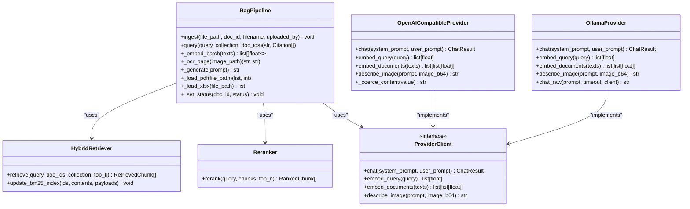

**Diagram sources**
- [rag_pipeline.py:34-345](file://safe4ai-pilot/app/services/rag_pipeline.py#L34-L345)
- [hybrid_retriever.py:14-145](file://safe4ai-pilot/app/components/hybrid_retriever.py#L14-L145)
- [reranker.py:11-36](file://safe4ai-pilot/app/components/reranker.py#L11-L36)
- [provider_clients.py:24-35](file://safe4ai-pilot/app/services/provider_clients.py#L24-L35)
- [provider_clients.py:52-239](file://safe4ai-pilot/app/services/provider_clients.py#L52-L239)

Practical examples:
- Dependency injection: Constructed with retriever, reranker, provider_client, and settings.
- External integrations: Calls provider clients for embeddings and generation; Qdrant for vector storage.
- Error handling: Sets document status to failed for empty content; guards against low OCR confidence.
- Provider pluggability: Supports OpenAI-compatible and Ollama providers through unified interface.

**Section sources**
- [rag_pipeline.py:77-345](file://safe4ai-pilot/app/services/rag_pipeline.py#L77-L345)
- [test_rag_pipeline.py:48-264](file://safe4ai-pilot/tests/test_rag_pipeline.py#L48-L264)
- [provider_clients.py:52-239](file://safe4ai-pilot/app/services/provider_clients.py#L52-L239)

### Provider Clients
Responsibilities:
- Provide pluggable interface for different inference providers.
- Standardize usage tracking across providers.
- Support chat completions, embeddings, and vision capabilities.
- Handle provider-specific differences in API responses.
- Implement content coercion for structured payloads.
- Support multimodal image description with base64-encoded images.

Key behaviors:
- Define Protocol interfaces for ChatClient, EmbeddingClient, and VisionClient.
- Extract usage information from provider responses for cost tracking.
- Support both OpenAI-compatible APIs and local Ollama deployments.
- Provide fallback mechanisms for different provider capabilities.
- Implement standardized message format handling with content coercion.
- Enable multimodal capabilities with base64-encoded image processing.

**Updated** The provider clients module introduces a comprehensive pluggable architecture with enhanced message format handling, content coercion for structured payloads, and advanced multimodal capabilities. The OpenAICompatibleProvider now includes sophisticated content coercion that extracts text from structured responses, while the OllamaProvider has been updated to use the modern /api/chat endpoint with proper system prompt handling.

**Diagram sources**
- [provider_clients.py:10-35](file://safe4ai-pilot/app/services/provider_clients.py#L10-L35)
- [provider_clients.py:24-35](file://safe4ai-pilot/app/services/provider_clients.py#L24-L35)
- [provider_clients.py:52-239](file://safe4ai-pilot/app/services/provider_clients.py#L52-L239)

Practical examples:
- Interface usage: Both OpenAICompatibleProvider and OllamaProvider implement the same protocols.
- Usage extraction: _usage_from_openai() handles different provider usage field names.
- Content coercion: _coerce_content() extracts text from structured responses for robust processing.
- Multimodal capabilities: describe_image() supports base64-encoded image processing with standardized payload formats.
- Fallback implementations: OllamaProvider includes legacy API support for embeddings.
- Configuration: RuntimeConfig.build_provider() selects the appropriate provider based on settings.

**Section sources**
- [provider_clients.py:1-239](file://safe4ai-pilot/app/services/provider_clients.py#L1-L239)
- [runtime_config.py:132-172](file://safe4ai-pilot/app/services/runtime_config.py#L132-L172)
- [test_provider_clients.py:10-50](file://safe4ai-pilot/tests/test_provider_clients.py#L10-L50)

### Chat Finalizer
Responsibilities:
- Persist assistant replies, audit logs, and cost records in a single atomic transaction.
- Handle usage tracking and cost calculation for chat completions.
- Manage session state updates after successful chat completions.

Key behaviors:
- Uses SQLAlchemy transactions to ensure atomic persistence of all chat completion data.
- Calculates costs based on provider usage or token estimates.
- Creates AuditLog and AgentRun records with comprehensive metadata.
- Updates session state with the assistant's response.

**Updated** The chat finalizer service provides transactional persistence for chat completions with architectural improvements that eliminate nested database transactions and ensure data consistency throughout the chat completion process. The new implementation performs all database operations sequentially within a single atomic transaction commit, eliminating potential race conditions and preventing inconsistent state management that could occur with nested transactions.

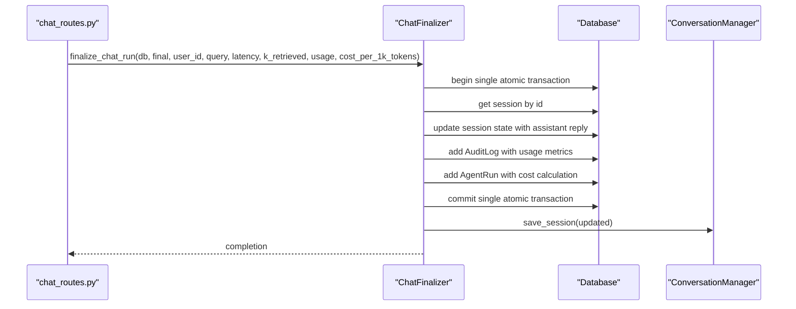

**Diagram sources**
- [chat_finalizer.py:14-71](file://safe4ai-pilot/app/services/chat_finalizer.py#L14-L71)
- [chat_routes.py:410-473](file://safe4ai-pilot/app/api/chat_routes.py#L410-L473)

Practical examples:
- Architectural improvement: All chat completion data is saved in a single database transaction, eliminating nested transactions that could cause deadlocks.
- Usage tracking: Supports both actual provider usage and token estimates.
- Cost calculation: Automatically calculates costs based on usage and configured rates.
- Session management: Updates conversation state with the assistant's response.
- Data consistency: Single atomic commit ensures all operations succeed or fail together, preventing partial state updates.

**Section sources**
- [chat_finalizer.py:1-71](file://safe4ai-pilot/app/services/chat_finalizer.py#L1-L71)
- [chat_routes.py:404-473](file://safe4ai-pilot/app/api/chat_routes.py#L404-L473)

### Semantic Cache Service
Responsibilities:
- Embed incoming queries and compare against stored embeddings using a vector operator.
- Return cached responses and citations on similarity threshold hit.
- Store new query-response pairs with associated document/chunk IDs.
- Invalidate cache entries by document ID.

Key behaviors:
- Uses Postgres vector extension with cosine distance.
- Maintains hit counters and supports invalidation by document.

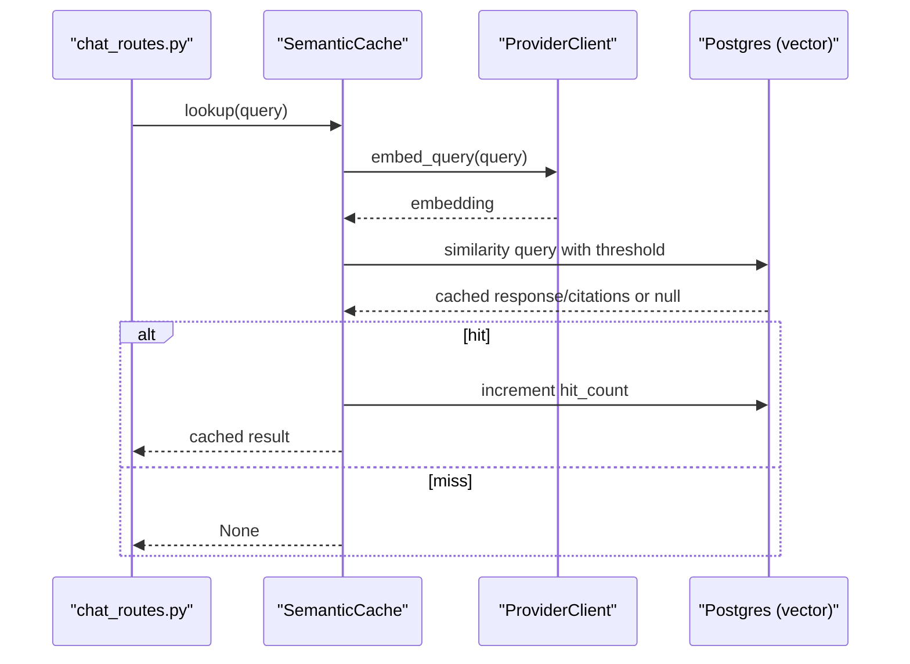

**Diagram sources**
- [semantic_cache.py:41-70](file://safe4ai-pilot/app/services/semantic_cache.py#L41-L70)
- [semantic_cache.py:71-104](file://safe4ai-pilot/app/services/semantic_cache.py#L71-L104)
- [config.py:18](file://safe4ai-pilot/app/config.py#L18)

Practical examples:
- Dependency injection: Receives DB session, provider client, and embedding model.
- Threshold tuning: Configured via settings; affects recall vs. precision.
- Cleanup: Supports invalidating cache entries when source documents change.

**Section sources**
- [semantic_cache.py:14-104](file://safe4ai-pilot/app/services/semantic_cache.py#L14-L104)
- [test_semantic_cache.py:25-107](file://safe4ai-pilot/tests/test_semantic_cache.py#L25-L107)

### Cost Service
Responsibilities:
- Track and enforce cost ceilings for daily and monthly usage limits.
- Estimate token usage when provider usage is not available.
- Integrate with CostTracker for cost calculations and statistics.
- Provide cost ceiling enforcement with detailed error messages.

Key behaviors:
- Estimates tokens using character-to-token ratio heuristics.
- Uses ProviderUsage when available, falls back to text-based estimation.
- Loads application configuration for ceiling values and cost tracking.
- Implements CostCeilingExceeded exception with user-facing messages.
- Swallows unexpected exceptions with warnings to prevent cost tracking failures from blocking requests.

**Updated** The cost service provides dedicated cost management functionality with comprehensive ceiling enforcement, usage estimation, and provider integration. It extracts cost business logic from HTTP handlers to enable testing without FastAPI dependencies and provides detailed error handling for cost tracking failures.

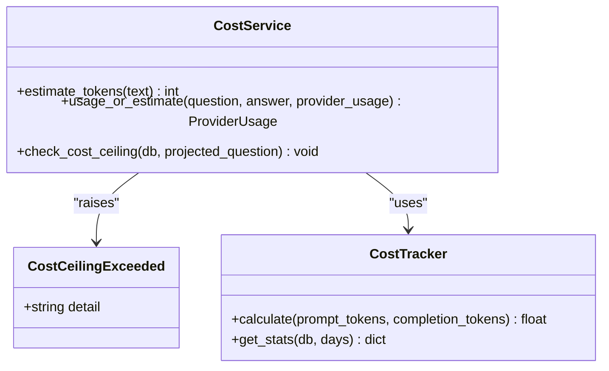

**Diagram sources**
- [cost_service.py:20-104](file://safe4ai-pilot/app/services/cost_service.py#L20-L104)

Practical examples:
- Token estimation: Uses 4 characters per token heuristic for text-based estimation.
- Usage fallback: Automatically switches to estimated usage when provider usage is unavailable.
- Ceiling enforcement: Validates both daily and monthly cost limits with detailed error messages.
- Exception handling: CostCeilingExceeded preserves user-facing messages for HTTP responses.
- Integration: Works with CostTracker for cost calculations and statistics retrieval.

**Section sources**
- [cost_service.py:20-104](file://safe4ai-pilot/app/services/cost_service.py#L20-L104)

### Document Service
Responsibilities:
- Delete Qdrant vectors by document ID with proper error handling.
- Remove document chunks from BM25 index with best-effort operations.
- Provide cleanup utilities for document lifecycle management.

Key behaviors:
- Uses QdrantClient for vector deletion with field condition filtering.
- Implements best-effort BM25 pruning with exception logging.
- Operates on fixed collection name "documents".
- Provides defensive programming with existence checks.

**Updated** The document service provides focused document lifecycle management with Qdrant cleanup and BM25 index pruning capabilities. It operates independently of the main ingestion pipeline and provides essential cleanup functions for document management operations.

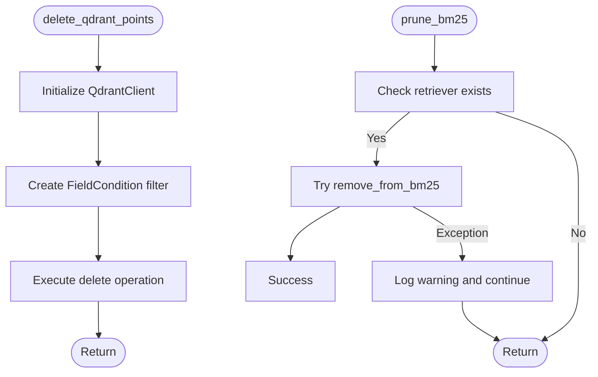

**Diagram sources**
- [document_service.py:17-40](file://safe4ai-pilot/app/services/document_service.py#L17-L40)

Practical examples:
- Qdrant cleanup: Deletes all vectors matching a specific document ID.
- BM25 pruning: Removes document chunks from in-memory index with graceful error handling.
- Defensive operations: Checks for retriever existence before attempting pruning.
- Logging: Uses structlog for warning messages on pruning failures.

**Section sources**
- [document_service.py:17-40](file://safe4ai-pilot/app/services/document_service.py#L17-L40)

### User Service
Responsibilities:
- Create and manage ghost user for deleted accounts.
- Deactivate user accounts with cascade operations.
- Reassign ownership of user content to ghost user.
- Strip PII and revoke user sessions during deactivation.

Key behaviors:
- Creates sentinel ghost user with predefined ID and email.
- Handles concurrent creation attempts with integrity error handling.
- Performs comprehensive cascade operations for content reassignment.
- Updates user attributes to anonymize deactivated accounts.
- Logs user deactivation events with user ID.

**Updated** The user service provides comprehensive user lifecycle management with ghost user creation and deactivation cascading. It ensures data privacy by anonymizing deactivated users and maintains referential integrity through content reassignment.

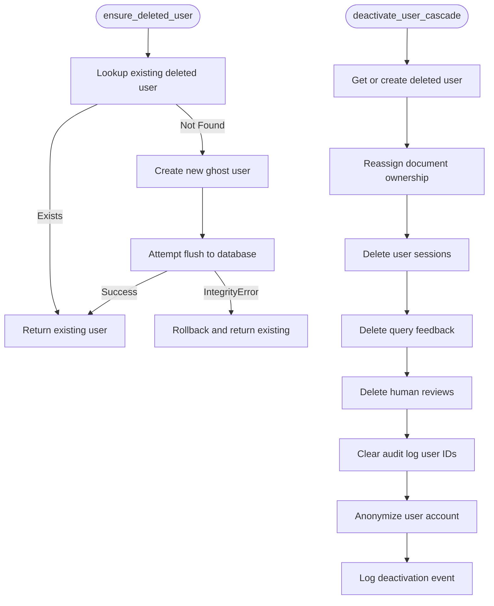

**Diagram sources**
- [user_service.py:29-91](file://safe4ai-pilot/app/services/user_service.py#L29-L91)

Practical examples:
- Ghost user management: Creates sentinel user for deleted accounts with unique ID and email.
- Cascade operations: Handles AgentRun, Session, QueryFeedback, HumanReviewQueue, and AuditLog cleanup.
- Integrity handling: Manages concurrent ghost user creation with database integrity constraints.
- Privacy protection: Anonymizes deactivated user data and resets authentication state.
- Atomic operations: Requires caller to commit database transactions after function completion.

**Section sources**
- [user_service.py:29-91](file://safe4ai-pilot/app/services/user_service.py#L29-L91)

### Stats Service
Responsibilities:
- Aggregate corpus statistics for document and chunk counts.
- Filter statistics by ingestion status for failed and in-progress documents.
- Provide shared statistics for admin and user interfaces.

Key behaviors:
- Counts total documents and chunks in the knowledge base.
- Filters failed documents by ingestion status.
- Aggregates in-progress documents by queued and embedding statuses.
- Returns dictionary with standardized keys for UI consumption.

**Updated** The stats service provides shared statistics aggregation for corpus metrics with standardized output format. It enables both admin document routes and user account routes to avoid duplicating SQL expressions and provides consistent metrics for system monitoring.

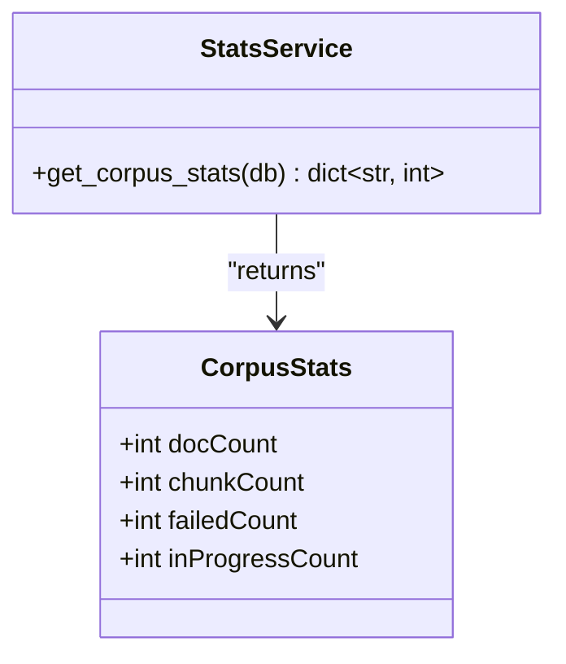

**Diagram sources**
- [stats_service.py:14-38](file://safe4ai-pilot/app/services/stats_service.py#L14-L38)

Practical examples:
- SQL aggregation: Uses SQLAlchemy func.count() for efficient counting operations.
- Status filtering: Applies IngestionStatus filters for failed and in-progress documents.
- Type safety: Converts counts to int for consistent JSON serialization.
- Shared usage: Eliminates code duplication between admin and user routes.

**Section sources**
- [stats_service.py:14-38](file://safe4ai-pilot/app/services/stats_service.py#L14-L38)

### Settings Service
Responsibilities:
- Implement three-stage settings patch pipeline: normalize, probe, collect.
- Validate and transform settings with comprehensive field validation.
- Probe external services for provider availability and model validation.
- Serialize settings with live metadata caching and provider model discovery.

Key behaviors:
- Normalization stage: Expands provider mode shorthands and derives effective values.
- Probe stage: Verifies Ollama/cloud provider reachability and sanitizes stale model slots.
- Collection stage: Validates individual fields and builds database update dictionaries.
- Live caching: Caches provider model lists and cost statistics with TTL expiration.
- URL validation: Sanitizes provider base URLs and resolves IP addresses for security.

**Updated** The settings service implements a comprehensive three-stage validation pipeline with extensive provider integration and live metadata caching. It provides robust settings management with external service probing, model validation, and secure URL handling.

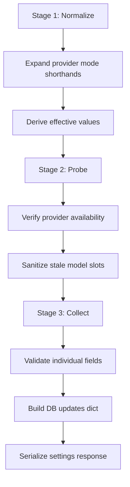

**Diagram sources**
- [settings_service.py:146-423](file://safe4ai-pilot/app/services/settings_service.py#L146-L423)

Practical examples:
- Three-stage pipeline: Implements normalize, probe, collect stages with proper error handling.
- Model validation: Validates Ollama model availability and embedding model dimensions.
- Provider probing: Tests cloud provider connectivity and validates embedding models.
- Live caching: Caches provider models and cost statistics with 60-second TTL.
- Security: Validates provider URLs and resolves IP addresses to prevent DNS rebinding attacks.

**Section sources**
- [settings_service.py:46-611](file://safe4ai-pilot/app/services/settings_service.py#L46-L611)

## Dependency Analysis
- Centralized configuration: Settings define external service URLs, model names, and thresholds.
- Shared models: PrivateAIState and related models unify state across services.
- Database models: Sessions, Documents, DocumentChunks, SemanticCache, Jobs define persistence contracts.
- Component coupling: RagPipeline depends on HybridRetriever and Reranker; ConversationManager depends on DB models and prompts; SemanticCache depends on Postgres vector extension.
- Provider architecture: Enhanced pluggable provider system allows switching between OpenAI-compatible APIs and Ollama deployments with standardized message format handling.
- **New** Dedicated service dependencies: CostService depends on ProviderUsage and CostTracker; DocumentService depends on QdrantClient; UserService depends on SQLAlchemy ORM models; StatsService depends on Document and DocumentChunk models; SettingsService depends on provider settings and runtime configuration.
- **New** Cross-service integration: SettingsService integrates with CostTracker for live cost statistics; UserService integrates with AuditLog and AgentRun models; DocumentService integrates with HybridRetriever for BM25 pruning.

**Updated** The dependency structure now includes five new dedicated service modules with focused responsibilities and clear integration points. The cost service integrates with provider clients and cost tracking, document service integrates with Qdrant and HybridRetriever, user service integrates with audit and session models, stats service provides shared aggregations, and settings service integrates with provider settings and runtime configuration.

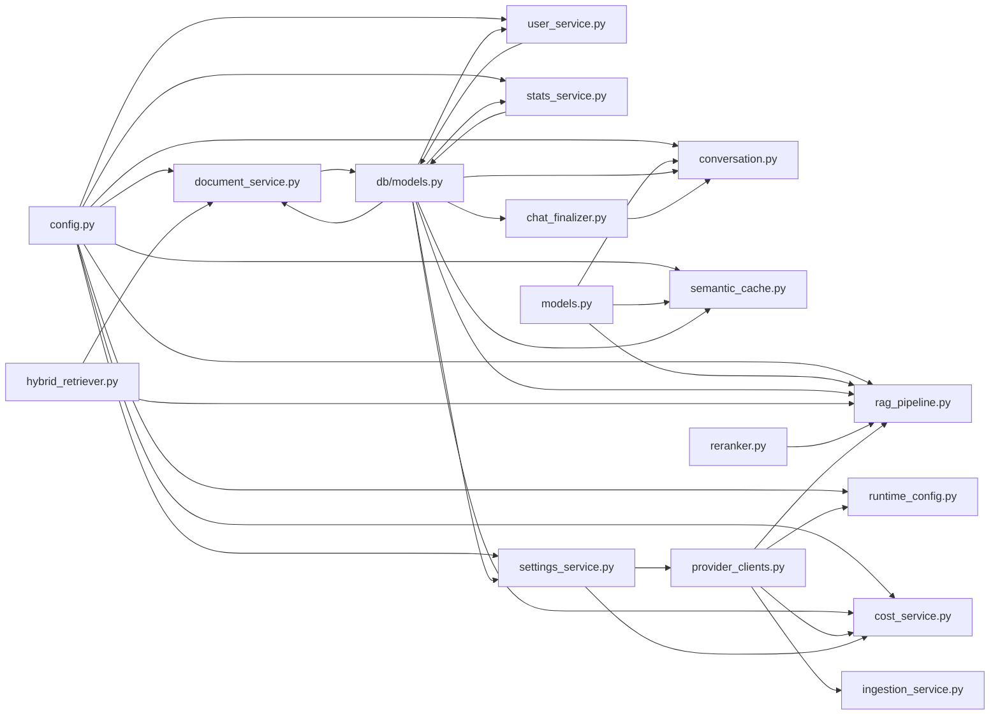

**Diagram sources**
- [config.py:7-48](file://safe4ai-pilot/app/config.py#L7-L48)
- [models.py:1-95](file://safe4ai-pilot/app/models.py#L1-L95)
- [db/models.py:1-182](file://safe4ai-pilot/app/db/models.py#L1-L182)
- [conversation.py:13-18](file://safe4ai-pilot/app/services/conversation.py#L13-L18)
- [rag_pipeline.py:20-53](file://safe4ai-pilot/app/services/rag_pipeline.py#L20-L53)
- [semantic_cache.py:15-25](file://safe4ai-pilot/app/services/semantic_cache.py#L15-L25)
- [provider_clients.py:1-239](file://safe4ai-pilot/app/services/provider_clients.py#L1-L239)
- [chat_finalizer.py:1-71](file://safe4ai-pilot/app/services/chat_finalizer.py#L1-L71)
- [runtime_config.py:1-172](file://safe4ai-pilot/app/services/runtime_config.py#L1-L172)
- [cost_service.py:13-15](file://safe4ai-pilot/app/services/cost_service.py#L13-L15)
- [document_service.py:10-11](file://safe4ai-pilot/app/services/document_service.py#L10-L11)
- [user_service.py:12-21](file://safe4ai-pilot/app/services/user_service.py#L12-L21)
- [stats_service.py:11](file://safe4ai-pilot/app/services/stats_service.py#L11)
- [settings_service.py:23-35](file://safe4ai-pilot/app/services/settings_service.py#L23-L35)

**Section sources**
- [config.py:7-48](file://safe4ai-pilot/app/config.py#L7-L48)
- [db/models.py:104-116](file://safe4ai-pilot/app/db/models.py#L104-L116)

## Performance Considerations
- Batch embeddings: RagPipeline batches embedding requests to reduce overhead.
- OCR fallback: Only triggers OCR for low-text pages to minimize compute.
- Hybrid retrieval: Combines dense vectors and BM25 to balance recall and speed.
- Semantic cache: Reduces repeated work for similar queries; tune threshold to balance latency and accuracy.
- Session size limits: ConversationManager prevents oversized state serialization.
- Provider efficiency: Enhanced pluggable providers allow selecting optimal inference backends.
- **New** Cost estimation: CostService uses efficient token estimation algorithms to avoid expensive provider calls.
- **New** Live caching: SettingsService caches provider models and statistics to reduce external API calls.
- **New** Best-effort operations: DocumentService and StatsService use defensive programming to prevent failures from blocking operations.
- **New** Atomic operations: ChatFinalizer ensures all related records are updated consistently through single commit transactions.

**Updated** Performance improvements include dedicated cost estimation algorithms, live metadata caching for provider models and statistics, defensive programming in document and stats services, and atomic transaction operations for enhanced data consistency. The new services leverage efficient algorithms and caching strategies to minimize external dependencies and database operations.

## Troubleshooting Guide
Common issues and resolutions:
- Conversation session not found: Ensure session_id exists; handle KeyError gracefully in API.
- Invalid session state: Validate Pydantic models; catch ValueError and log details.
- Oversized session state: Truncate or summarize history before saving.
- Ingestion stuck jobs: Startup recovery resets jobs older than threshold back to pending.
- Low OCR confidence: Expect skipped status; trigger manual review or retry with higher DPI.
- Rerank score too low: Answer falls back to safe default; adjust rerank threshold or improve retrieval.
- Semantic cache misses: Increase threshold or populate cache with representative queries.
- Provider configuration errors: Check runtime configuration for correct provider settings.
- Usage tracking issues: Verify provider supports usage reporting for accurate cost tracking.
- **New** Cost ceiling exceeded: CostCeilingExceeded raised when daily/monthly limits reached; check configuration and usage patterns.
- **New** Document cleanup failures: Qdrant deletion and BM25 pruning use best-effort operations; check external service connectivity.
- **New** User deactivation issues: Cascade operations require manual database commit; ensure proper transaction handling.
- **New** Settings validation errors: Three-stage pipeline provides detailed field validation errors; check provider availability and model configurations.
- **New** Settings probe failures: Provider probing handles external service unavailability; verify network connectivity and credentials.

**Updated** Additional troubleshooting guidance for the five new dedicated services, including cost ceiling management, document lifecycle operations, user deactivation procedures, settings validation, and provider probing. Each service includes specific error handling patterns and recovery strategies.

**Section sources**
- [conversation.py:44-70](file://safe4ai-pilot/app/services/conversation.py#L44-L70)
- [ingestion_service.py:90-167](file://safe4ai-pilot/app/services/ingestion_service.py#L90-L167)
- [rag_pipeline.py:181](file://safe4ai-pilot/app/services/rag_pipeline.py#L181)
- [semantic_cache.py:41-70](file://safe4ai-pilot/app/services/semantic_cache.py#L41-L70)
- [provider_clients.py:132-149](file://safe4ai-pilot/app/services/provider_clients.py#L132-L149)
- [chat_finalizer.py:31-71](file://safe4ai-pilot/app/services/chat_finalizer.py#L31-L71)
- [cost_service.py:66-104](file://safe4ai-pilot/app/services/cost_service.py#L66-L104)
- [document_service.py:17-40](file://safe4ai-pilot/app/services/document_service.py#L17-L40)
- [user_service.py:57-91](file://safe4ai-pilot/app/services/user_service.py#L57-L91)
- [settings_service.py:179-259](file://safe4ai-pilot/app/services/settings_service.py#L179-L259)

## Conclusion
The service layer cleanly separates concerns across conversation management, ingestion, RAG orchestration, semantic caching, provider management, and dedicated business services. It integrates external systems via well-defined interfaces, centralizes configuration, and ensures robust error handling and lifecycle management. The modular design enables easy testing, extension, and deployment alongside FastAPI and LangGraph. The enhanced pluggable provider architecture with standardized message format handling, content coercion, and multimodal capabilities significantly improves flexibility, reliability, and performance across all chat operations.

**Updated** The enhanced service layer now provides a robust foundation for multiple inference providers with comprehensive message format handling, content coercion for structured payloads, and advanced multimodal capabilities while maintaining consistent performance and reliability. The addition of five new dedicated services (cost management, document lifecycle, user management, statistics, and settings) significantly improves separation of concerns, testability, and maintainability. The enhanced pluggable provider architecture with standardized message format handling, content coercion, and multimodal capabilities significantly improves flexibility, reliability, and performance across all chat operations.

## Appendices

### Service Composition Examples
- Chat endpoint composes ConversationManager, LangGraph, and RagPipeline to produce streaming or blocking responses with improved transactional persistence.
- Ingestion service composes RagPipeline with HybridRetriever and Reranker to process documents asynchronously using enhanced pluggable providers.
- SemanticCache wraps provider clients and embedding operations to accelerate query resolution.
- Enhanced provider clients enable seamless switching between OpenAI-compatible APIs and local Ollama deployments with standardized message format handling.
- **New** Cost service integrates with chat finalization to enforce usage limits and track expenses.
- **New** Document service provides cleanup operations for document lifecycle management.
- **New** User service enables user deactivation with comprehensive cascade operations.
- **New** Stats service offers shared aggregations for system monitoring and reporting.
- **New** Settings service implements comprehensive configuration management with three-stage validation.

**Updated** Service composition now includes five new dedicated services with focused responsibilities and clear integration points. The cost service enhances chat operations with usage tracking, document service supports document lifecycle operations, user service enables user management workflows, stats service provides shared analytics, and settings service implements comprehensive configuration management.

**Section sources**
- [chat_routes.py:115-251](file://safe4ai-pilot/app/api/chat_routes.py#L115-L251)
- [ingestion_service.py:23-112](file://safe4ai-pilot/app/services/ingestion_service.py#L23-L112)
- [semantic_cache.py:14-104](file://safe4ai-pilot/app/services/semantic_cache.py#L14-L104)
- [provider_clients.py:132-172](file://safe4ai-pilot/app/services/provider_clients.py#L132-L172)
- [chat_finalizer.py:14-71](file://safe4ai-pilot/app/services/chat_finalizer.py#L14-L71)
- [cost_service.py:20-104](file://safe4ai-pilot/app/services/cost_service.py#L20-L104)
- [document_service.py:17-40](file://safe4ai-pilot/app/services/document_service.py#L17-L40)
- [user_service.py:29-91](file://safe4ai-pilot/app/services/user_service.py#L29-L91)
- [stats_service.py:14-38](file://safe4ai-pilot/app/services/stats_service.py#L14-L38)
- [settings_service.py:46-611](file://safe4ai-pilot/app/services/settings_service.py#L46-L611)

### Dependency Injection Patterns
- Constructor injection: RagPipeline, SemanticCache, HybridRetriever accept required dependencies (URLs, models, sessions, enhanced provider clients).
- Application state: FastAPI lifespan builds and stores shared instances (HybridRetriever, Reranker, LangGraph, Enhanced ProviderClient) for reuse.
- Provider configuration: RuntimeConfig.build_provider() creates appropriate provider instances based on configuration with enhanced capabilities.
- **New** Service composition: Dedicated services are instantiated with specific dependencies and integrated through constructor injection.
- **New** Cross-service dependencies: SettingsService depends on CostTracker for live statistics; UserService depends on audit models; DocumentService depends on HybridRetriever.
- **New** Configuration injection: Services receive configuration through constructor parameters or centralized configuration loading.

**Updated** Dependency injection patterns now include five new dedicated services with focused constructor parameters and clear dependency relationships. The new services follow consistent patterns with centralized configuration loading and cross-service integration through constructor injection.

**Section sources**
- [rag_pipeline.py:34-75](file://safe4ai-pilot/app/services/rag_pipeline.py#L34-L75)
- [semantic_cache.py:15-25](file://safe4ai-pilot/app/services/semantic_cache.py#L15-L25)
- [main.py:43-56](file://safe4ai-pilot/app/main.py#L43-L56)
- [runtime_config.py:132-172](file://safe4ai-pilot/app/services/runtime_config.py#L132-L172)
- [chat_finalizer.py:14-71](file://safe4ai-pilot/app/services/chat_finalizer.py#L14-L71)
- [cost_service.py:13-15](file://safe4ai-pilot/app/services/cost_service.py#L13-L15)
- [document_service.py:10-11](file://safe4ai-pilot/app/services/document_service.py#L10-L11)
- [user_service.py:12-21](file://safe4ai-pilot/app/services/user_service.py#L12-L21)
- [stats_service.py:11](file://safe4ai-pilot/app/services/stats_service.py#L11)
- [settings_service.py:23-35](file://safe4ai-pilot/app/services/settings_service.py#L23-L35)

### Service Lifecycle and Resource Cleanup
- ConversationManager: Per-request session creation and persistence; asynchronous summarization does not block.
- Ingestion service: Owns DB session; commits or rolls back on completion; closes session in finally; uses enhanced provider clients for embeddings.
- RAG pipeline: Manages temporary files for OCR; relies on enhanced provider clients for embeddings and generation with standardized message format handling; updates BM25 index after ingestion.
- Semantic cache: Performs embedding and SQL operations within controlled scopes; increments hit counters atomically.
- Enhanced provider clients: Manage HTTP connections and handle provider-specific API differences with content coercion and multimodal capabilities.
- **New** Cost service: Stateless service with database session injection; uses CostTracker for cost calculations and statistics.
- **New** Document service: Stateless service with QdrantClient instantiation; provides cleanup operations with proper error handling.
- **New** User service: Database session dependent service with comprehensive cascade operations; requires manual transaction commit.
- **New** Stats service: Stateless service with SQLAlchemy aggregation queries; returns dictionary results for UI consumption.
- **New** Settings service: Stateless service with live metadata caching; manages thread-safe cache access with locks.
- **New** Transaction management: ChatFinalizer ensures atomic persistence through single commit transactions; UserService requires manual commit after cascade operations.

**Updated** Service lifecycle management now includes five new dedicated services with clear resource management patterns. The new services follow consistent patterns with database session injection, external service instantiation, and proper error handling. The settings service includes thread-safe caching mechanisms, while user service requires explicit transaction management for cascade operations.

**Section sources**
- [conversation.py:75-122](file://safe4ai-pilot/app/services/conversation.py#L75-L122)
- [ingestion_service.py:33-167](file://safe4ai-pilot/app/services/ingestion_service.py#L33-L167)
- [rag_pipeline.py:187-345](file://safe4ai-pilot/app/services/rag_pipeline.py#L187-L345)
- [semantic_cache.py:41-104](file://safe4ai-pilot/app/services/semantic_cache.py#L41-L104)
- [provider_clients.py:52-239](file://safe4ai-pilot/app/services/provider_clients.py#L52-L239)
- [chat_finalizer.py:31-71](file://safe4ai-pilot/app/services/chat_finalizer.py#L31-L71)
- [cost_service.py:13-15](file://safe4ai-pilot/app/services/cost_service.py#L13-L15)
- [document_service.py:10-11](file://safe4ai-pilot/app/services/document_service.py#L10-L11)
- [user_service.py:12-21](file://safe4ai-pilot/app/services/user_service.py#L12-L21)
- [stats_service.py:11](file://safe4ai-pilot/app/services/stats_service.py#L11)
- [settings_service.py:430-498](file://safe4ai-pilot/app/services/settings_service.py#L430-L498)