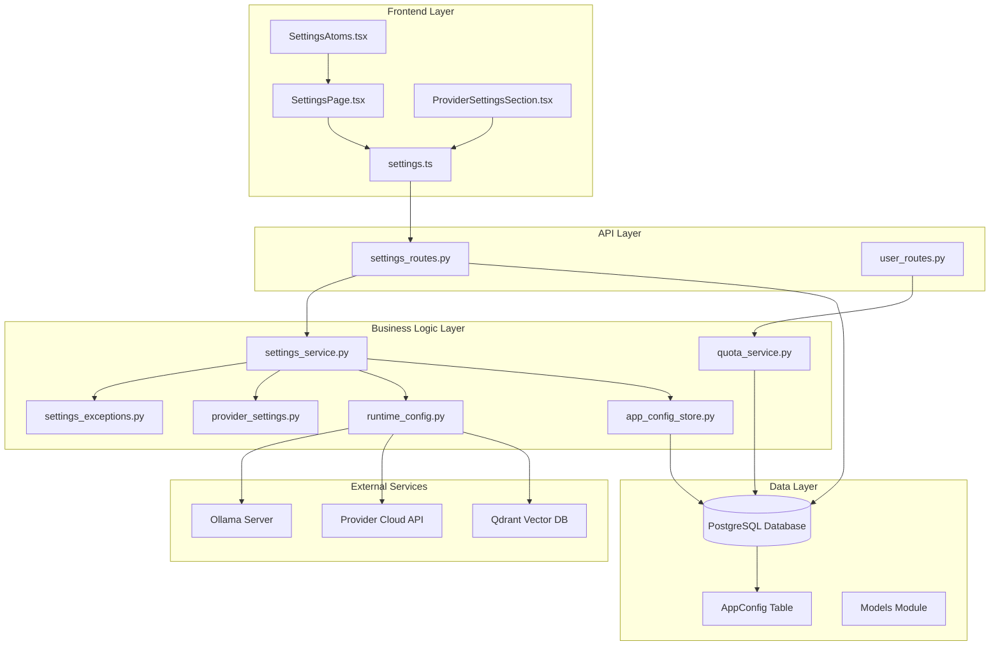
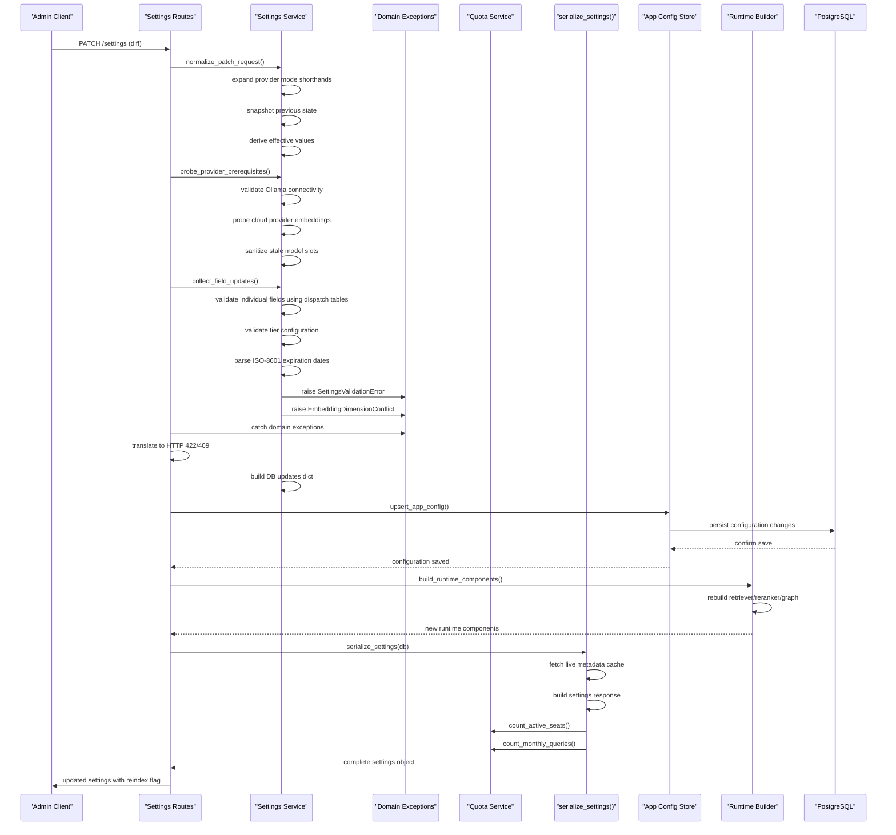
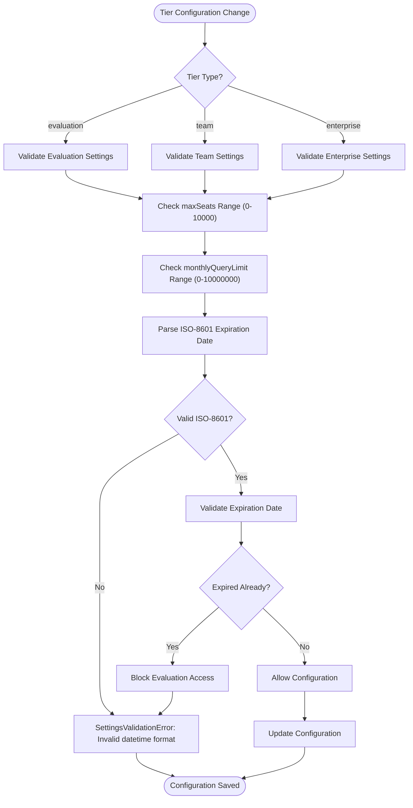
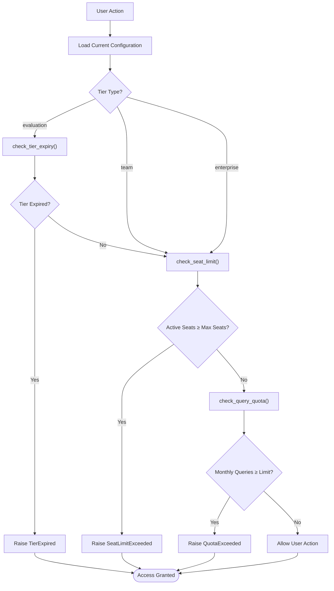
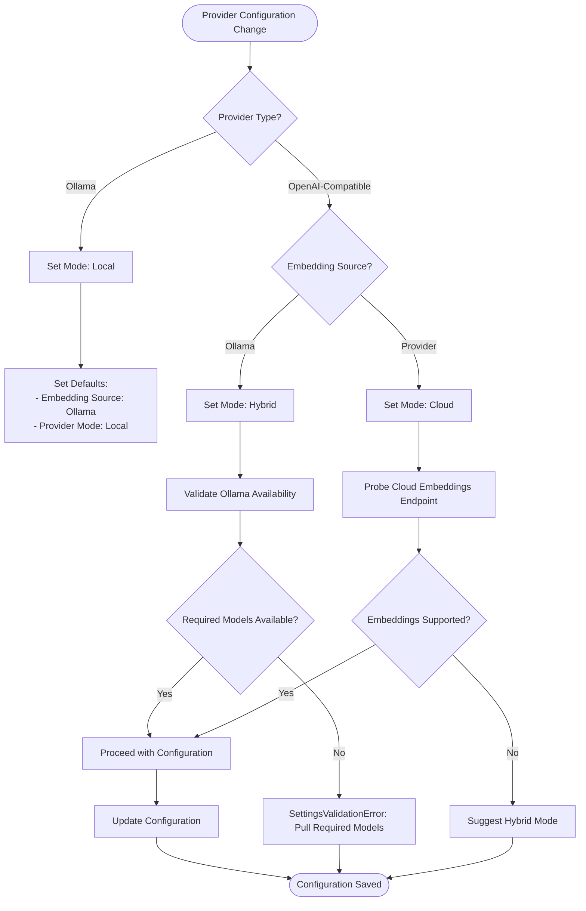
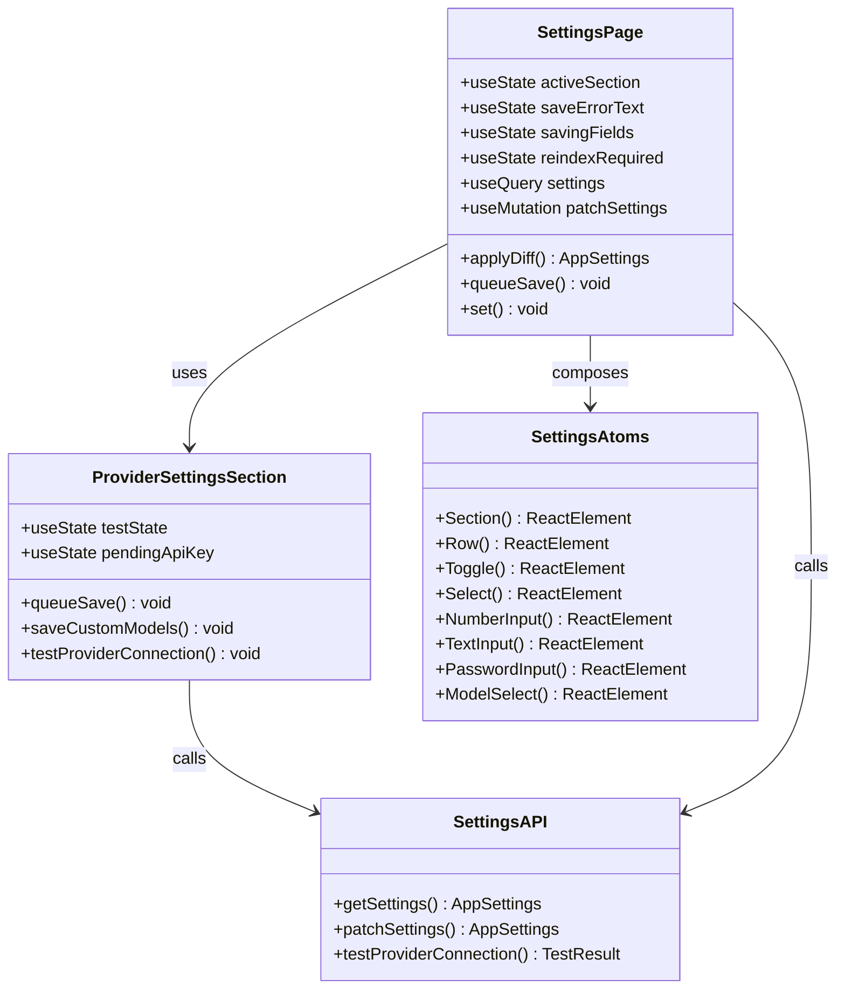
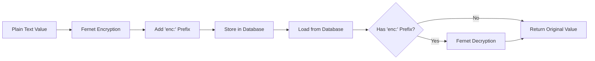
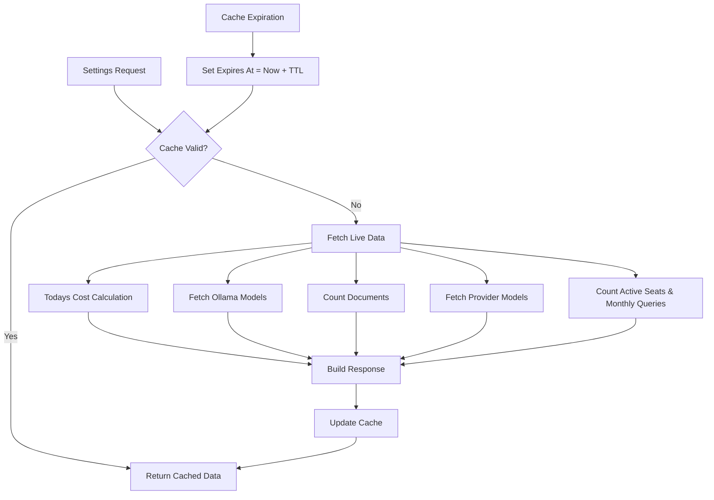
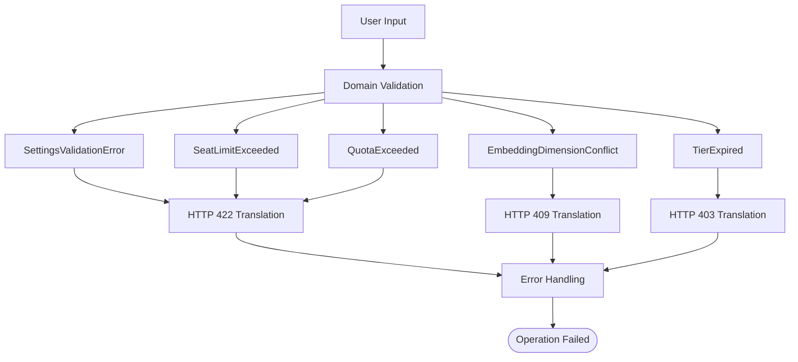
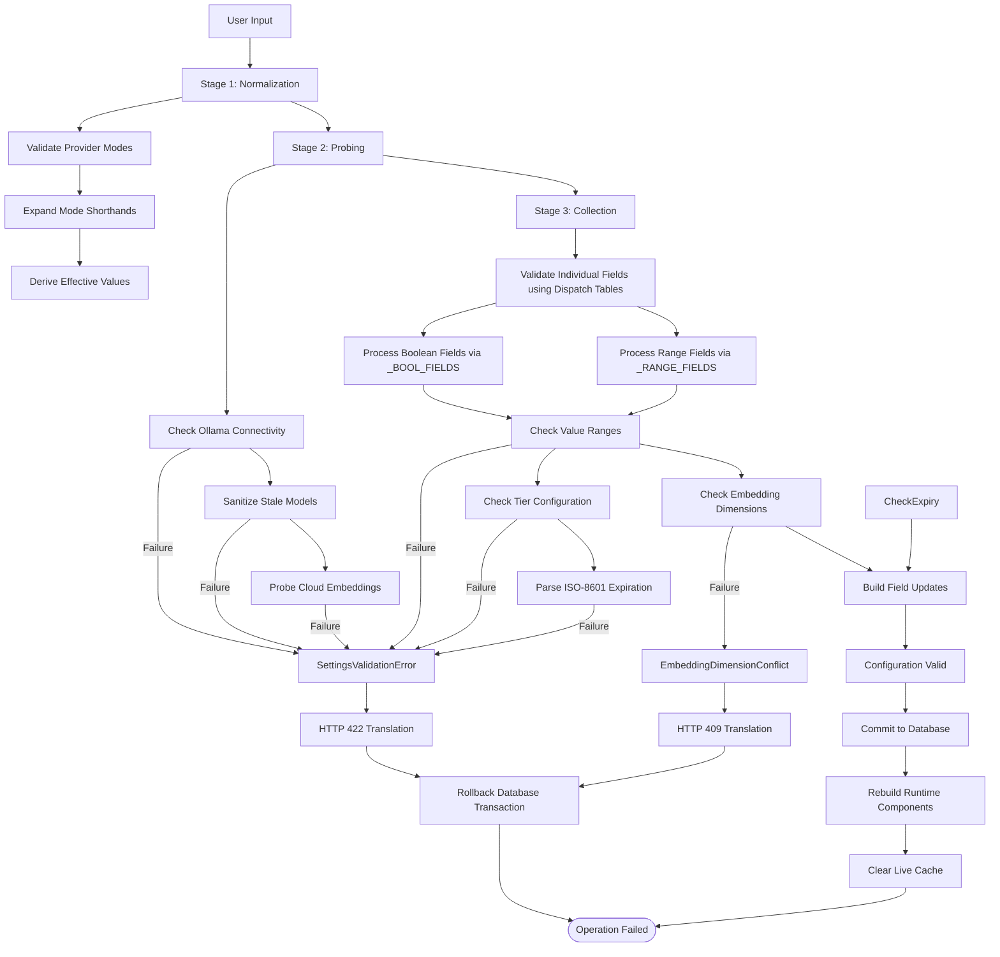

# Settings Management System

<cite>
**Referenced Files in This Document**
- [settings_routes.py](file://safe4ai-pilot/app/api/settings_routes.py)
- [settings_service.py](file://safe4ai-pilot/app/services/settings_service.py)
- [settings_exceptions.py](file://safe4ai-pilot/app/services/settings_exceptions.py)
- [quota_service.py](file://safe4ai-pilot/app/services/quota_service.py)
- [user_routes.py](file://safe4ai-pilot/app/api/user_routes.py)
- [app_config_store.py](file://safe4ai-pilot/app/services/app_config_store.py)
- [provider_settings.py](file://safe4ai-pilot/app/services/provider_settings.py)
- [runtime_config.py](file://safe4ai-pilot/app/services/runtime_config.py)
- [SettingsPage.tsx](file://safe4ai-pilot/frontend/src/pages/admin/SettingsPage.tsx)
- [ProviderSettingsSection.tsx](file://safe4ai-pilot/frontend/src/components/admin/ProviderSettingsSection.tsx)
- [SettingsAtoms.tsx](file://safe4ai-pilot/frontend/src/components/admin/SettingsAtoms.tsx)
- [settings.ts](file://safe4ai-pilot/frontend/src/api/settings.ts)
- [models.py](file://safe4ai-pilot/app/db/models.py)
- [config.py](file://safe4ai-pilot/app/config.py)
</cite>

## Update Summary
**Changes Made**
- Refactored settings validation logic to use dispatch tables (_BOOL_FIELDS, _RANGE_FIELDS) instead of duplicated inline if-blocks
- Reduced validation code complexity from 100+ lines to ~40 lines while maintaining same functionality
- Enhanced maintainability and readability of the validation pipeline
- Improved consistency in field validation across boolean and range-checked parameters

## Table of Contents
1. [Introduction](#introduction)
2. [System Architecture](#system-architecture)
3. [Core Components](#core-components)
4. [Settings Data Flow](#settings-data-flow)
5. [Tier Configuration Management](#tier-configuration-management)
6. [Provider Configuration Management](#provider-configuration-management)
7. [Frontend Settings Interface](#frontend-settings-interface)
8. [Security and Encryption](#security-and-encryption)
9. [Live Metadata System](#live-metadata-system)
10. [Error Handling and Validation](#error-handling-and-validation)
11. [Performance Considerations](#performance-considerations)
12. [Troubleshooting Guide](#troubleshooting-guide)
13. [Conclusion](#conclusion)

## Introduction

The Settings Management System is a comprehensive configuration framework for the private-ai application that enables administrators to dynamically configure and manage all system settings without requiring application restarts. This system provides real-time configuration updates, provider mode switching, model management, tier configuration with seat caps and query limits, and extensive security controls while maintaining data integrity and operational safety.

The system operates on a three-stage validation pipeline that ensures configuration safety, supports multiple inference providers (Ollama and OpenAI-compatible), and maintains live metadata for optimal user experience. It features automatic encryption of sensitive data, comprehensive validation rules, tier-based quota enforcement, and seamless integration between frontend and backend components.

**Updated** The system now includes comprehensive tier configuration management with seat caps, monthly query limits, and ISO-8601 datetime parsing for expiration dates. The quota enforcement service provides seat limit checking, monthly query quota monitoring, and tier expiry validation to ensure proper licensing compliance. The validation logic has been significantly refactored using dispatch tables for improved maintainability and reduced code complexity.

## System Architecture

The Settings Management System follows a layered architecture with clear separation of concerns between presentation, business logic, data persistence, and external service integration.

**Diagram sources**
- [settings_routes.py:1-222](file://safe4ai-pilot/app/api/settings_routes.py#L1-L222)
- [settings_service.py:1-635](file://safe4ai-pilot/app/services/settings_service.py#L1-L635)
- [quota_service.py:1-155](file://safe4ai-pilot/app/services/quota_service.py#L1-L155)
- [settings_exceptions.py:1-31](file://safe4ai-pilot/app/services/settings_exceptions.py#L1-L31)
- [app_config_store.py:1-119](file://safe4ai-pilot/app/services/app_config_store.py#L1-L119)

## Core Components

### Backend API Routes

The system exposes three primary endpoints for settings management:

- **GET /settings**: Retrieves current application settings with live metadata through serialize_settings()
- **PATCH /settings**: Updates mutable application settings with validation through three-stage pipeline
- **POST /settings/provider/test**: Tests provider connectivity and configuration

**Updated** Route handlers are now significantly simplified, delegating all business logic to the dedicated settings service while maintaining the same API contract. The routing layer now catches domain exceptions and translates them to appropriate HTTP responses.

### Domain Exception Handling System

**New** The system now includes a dedicated domain exception handling system that separates business logic from HTTP-specific behavior:

- **SettingsValidationError**: Raised for field validation failures and configuration invariants
- **EmbeddingDimensionConflict**: Raised when embedding model dimensions conflict with existing Qdrant collections
- **SeatLimitExceeded**: Raised when attempting to add users beyond the seat cap
- **QuotaExceeded**: Raised when monthly query quota is exceeded
- **TierExpired**: Raised when evaluation tier has passed its expiration date

These exceptions are caught in the routing layer and translated to HTTP 422 (validation errors), HTTP 409 (conflict errors), and HTTP 403 (forbidden) respectively, enabling services to be called from CLI scripts, background jobs, and tests without triggering FastAPI-specific behavior.

### Settings Service Pipeline

The settings service implements a sophisticated three-stage validation pipeline:

1. **Normalization Stage**: Expands shorthand provider modes and resolves effective values
2. **Probing Stage**: Validates external service connectivity and sanitizes stale configurations  
3. **Collection Stage**: Validates individual fields and builds database update dictionaries

**Updated** The service now raises domain exceptions instead of HTTP exceptions, enabling better separation of concerns and improved testability. The pipeline now includes tier configuration validation with ISO-8601 datetime parsing for expiration dates. The validation logic has been refactored using dispatch tables for improved maintainability.

### Configuration Storage

Settings are persisted in the PostgreSQL database using the AppConfig table with automatic encryption for sensitive values and type coercion for consistent data handling.

**Section sources**
- [settings_routes.py:36-222](file://safe4ai-pilot/app/api/settings_routes.py#L36-L222)
- [settings_service.py:146-468](file://safe4ai-pilot/app/services/settings_service.py#L146-L468)
- [settings_exceptions.py:11-31](file://safe4ai-pilot/app/services/settings_exceptions.py#L11-L31)
- [app_config_store.py:77-119](file://safe4ai-pilot/app/services/app_config_store.py#L77-L119)

## Settings Data Flow

The settings management system follows a structured data flow that ensures safety, validation, and consistency across all configuration changes.

**Diagram sources**
- [settings_routes.py:47-154](file://safe4ai-pilot/app/api/settings_routes.py#L47-L154)
- [settings_service.py:146-468](file://safe4ai-pilot/app/services/settings_service.py#L146-L468)
- [settings_exceptions.py:11-31](file://safe4ai-pilot/app/services/settings_exceptions.py#L11-L31)
- [quota_service.py:43-155](file://safe4ai-pilot/app/services/quota_service.py#L43-L155)
- [runtime_config.py:205-226](file://safe4ai-pilot/app/services/runtime_config.py#L205-L226)

## Tier Configuration Management

**New** The system now provides comprehensive tier configuration management with seat caps, monthly query limits, and expiration handling for different deployment tiers.

### Tier Configuration Fields

| Field | Type | Range/Valid Values | Purpose |
|-------|------|-------------------|---------|
| `tier` | string | "evaluation", "team", "enterprise" | Deployment tier classification |
| `maxSeats` | integer | 0-10000 | Maximum number of active users (0 = unlimited) |
| `monthlyQueryLimit` | integer | 0-10000000 | Monthly query quota (0 = unlimited) |
| `tierExpiresAt` | string | ISO-8601 datetime or "" | Evaluation tier expiration date |

### Tier Configuration Validation

**Diagram sources**
- [settings_service.py:442-467](file://safe4ai-pilot/app/services/settings_service.py#L442-L467)
- [quota_service.py:122-155](file://safe4ai-pilot/app/services/quota_service.py#L122-L155)

### Quota Enforcement Service

**New** The quota service provides comprehensive enforcement for tier-based limitations:

- **Seat Limit Checking**: Prevents adding users beyond the configured seat cap
- **Monthly Query Quota**: Tracks and enforces query volume limits per month
- **Tier Expiry Validation**: Ensures evaluation tiers cannot be used after expiration

**Diagram sources**
- [quota_service.py:87-120](file://safe4ai-pilot/app/services/quota_service.py#L87-L120)
- [user_routes.py:74-83](file://safe4ai-pilot/app/api/user_routes.py#L74-L83)

**Section sources**
- [settings_service.py:442-467](file://safe4ai-pilot/app/services/settings_service.py#L442-L467)
- [quota_service.py:1-155](file://safe4ai-pilot/app/services/quota_service.py#L1-L155)
- [user_routes.py:68-83](file://safe4ai-pilot/app/api/user_routes.py#L68-L83)

## Provider Configuration Management

The system supports three distinct provider modes with automatic validation and safety checks:

### Provider Modes

| Mode | Description | Embedding Source | Vision Source | Use Case |
|------|-------------|------------------|---------------|----------|
| **Local** | Full Ollama stack | Ollama | Ollama | Complete privacy, local-only operation |
| **Hybrid** | Cloud LLM + Local embeddings | Ollama | Ollama | Best quality with privacy preservation |
| **Cloud** | Fully cloud provider | Provider | Provider | Maximum compatibility, potential data transfer |

### Provider Resolution Logic

**Diagram sources**
- [provider_settings.py:35-96](file://safe4ai-pilot/app/services/provider_settings.py#L35-L96)
- [settings_service.py:171-251](file://safe4ai-pilot/app/services/settings_service.py#L171-L251)

**Section sources**
- [provider_settings.py:1-216](file://safe4ai-pilot/app/services/provider_settings.py#L1-L216)
- [settings_service.py:167-251](file://safe4ai-pilot/app/services/settings_service.py#L167-L251)

## Frontend Settings Interface

The frontend provides an intuitive administrative interface with real-time validation and immediate feedback:

### Settings Page Architecture

**Diagram sources**
- [SettingsPage.tsx:92-546](file://safe4ai-pilot/frontend/src/pages/admin/SettingsPage.tsx#L92-L546)
- [ProviderSettingsSection.tsx:35-269](file://safe4ai-pilot/frontend/src/components/admin/ProviderSettingsSection.tsx#L35-L269)
- [SettingsAtoms.tsx:1-285](file://safe4ai-pilot/frontend/src/components/admin/SettingsAtoms.tsx#L1-L285)

### Real-time Configuration Validation

The frontend implements sophisticated validation and error handling:

- **Immediate Field Validation**: Real-time validation as users modify settings
- **Batch Save Operations**: Queued save mechanism prevents conflicts
- **Error Recovery**: Automatic rollback and retry capabilities
- **Visual Feedback**: Loading states, success indicators, and error messages

**Section sources**
- [SettingsPage.tsx:92-210](file://safe4ai-pilot/frontend/src/pages/admin/SettingsPage.tsx#L92-L210)
- [ProviderSettingsSection.tsx:35-119](file://safe4ai-pilot/frontend/src/components/admin/ProviderSettingsSection.tsx#L35-L119)

## Security and Encryption

The system implements comprehensive security measures for sensitive configuration data:

### Data Encryption

Sensitive configuration values are automatically encrypted at rest using Fernet symmetric encryption:

**Diagram sources**
- [app_config_store.py:42-57](file://safe4ai-pilot/app/services/app_config_store.py#L42-L57)

### Sensitive Key Protection

The system automatically encrypts the following configuration keys:
- `openai_api_key`
- `anthropic_api_key` 
- `api_key`
- `provider_api_key`

### Access Control

All settings endpoints require administrator privileges through the `require_role("admin")` decorator, ensuring only authorized users can modify system configuration.

**Section sources**
- [app_config_store.py:29-58](file://safe4ai-pilot/app/services/app_config_store.py#L29-L58)
- [settings_routes.py:14-23](file://safe4ai-pilot/app/api/settings_routes.py#L14-L23)

## Live Metadata System

The system maintains a sophisticated caching mechanism for frequently accessed metadata to improve performance and reduce external service calls.

### Cache Architecture

**Updated** The caching system has been enhanced with a new thread-safe implementation that provides better performance and reliability.

**Diagram sources**
- [settings_routes.py:61-103](file://safe4ai-pilot/app/api/settings_routes.py#L61-L103)

### Cache Configuration

- **TTL**: 60 seconds for live metadata (increased from 15 seconds for better performance)
- **Cached Data**: Today's cost, available Ollama models, document count, available provider models, quota counts
- **Thread Safety**: Uses locks for concurrent access protection
- **Cache Invalidation**: Manual invalidation through invalidate_live_cache() function

**Updated** The cache TTL has been increased to 60 seconds to reduce external service calls while maintaining reasonable freshness. The cache now includes manual invalidation capability for forced refresh scenarios and quota counting for tier configuration display.

**Section sources**
- [settings_routes.py:35-103](file://safe4ai-pilot/app/api/settings_routes.py#L35-L103)
- [settings_service.py:430-498](file://safe4ai-pilot/app/services/settings_service.py#L430-L498)

## Error Handling and Validation

The system implements comprehensive error handling and validation at multiple levels:

### Domain Exception Handling System

**New** The system now includes a dedicated domain exception handling system that separates business logic from HTTP-specific behavior:

**Diagram sources**
- [settings_exceptions.py:11-31](file://safe4ai-pilot/app/services/settings_exceptions.py#L11-L31)
- [settings_routes.py:73-76](file://safe4ai-pilot/app/api/settings_routes.py#L73-L76)

### Validation Pipeline

**Updated** The validation pipeline has been moved to the dedicated settings service with domain exceptions replacing HTTP exceptions. The validation logic has been significantly refactored using dispatch tables for improved maintainability:

**Diagram sources**
- [settings_service.py:146-468](file://safe4ai-pilot/app/services/settings_service.py#L146-L468)
- [settings_exceptions.py:11-31](file://safe4ai-pilot/app/services/settings_exceptions.py#L11-L31)

### Dispatch Table Validation System

**New** The validation system now uses two dispatch tables for efficient field processing:

#### Boolean Fields Dispatch Table (_BOOL_FIELDS)
- **Purpose**: Process boolean fields with no validation beyond type checking
- **Fields**: `rerankerEnabled`, `ssoOnly`, `redactPII`
- **Processing**: Iterates through table entries and applies type validation

#### Range-checked Fields Dispatch Table (_RANGE_FIELDS)
- **Purpose**: Process numeric fields with min/max bounds validation
- **Fields**: `retrievalK`, `scoreFloor`, `sessionHours`, `auditRetentionDays`, `dailyCeilingUsd`, `monthlyCeilingUsd`, `maxSeats`, `monthlyQueryLimit`
- **Processing**: Validates value ranges and applies bounds checking

**Updated** The dispatch table approach has reduced validation code complexity from 100+ lines to approximately 40 lines while maintaining identical functionality. This refactoring improves code maintainability, reduces duplication, and makes it easier to add new fields to the validation system.

### Validation Rules

The system enforces strict validation rules for all configuration parameters:

| Parameter | Range/Valid Values | Validation |
|-----------|-------------------|------------|
| `retrievalK` | 1-32 | Integer bounds check via dispatch table |
| `scoreFloor` | 0.0-1.0 | Float bounds check via dispatch table |
| `chunkSize` | 128-2048 | Integer bounds check |
| `chunkOverlap` | 0-512 | Integer bounds check |
| `sessionHours` | 1-720 | Integer bounds check via dispatch table |
| `auditRetentionDays` | 30-3650 | Integer bounds check via dispatch table |
| `dailyCeilingUsd` | 1-10000 | Float bounds check via dispatch table |
| `monthlyCeilingUsd` | 30-300000 | Float bounds check via dispatch table |
| `maxSeats` | 0-10000 | Integer bounds check via dispatch table (tier seat cap) |
| `monthlyQueryLimit` | 0-10000000 | Integer bounds check via dispatch table (tier query limit) |
| `tierExpiresAt` | ISO-8601 datetime or "" | ISO-8601 format validation |
| `sseDoneMode` | "strict", "async" | Enum validation |

**Section sources**
- [settings_service.py:311-398](file://safe4ai-pilot/app/services/settings_service.py#L311-L398)
- [settings_service.py:47-64](file://safe4ai-pilot/app/services/settings_service.py#L47-L64)

## Performance Considerations

The system is designed with several performance optimizations:

### Caching Strategy
**Updated** Enhanced caching strategy with improved TTL and thread safety:
- **Live Metadata Cache**: 60-second TTL for frequently accessed data (improved from 15 seconds)
- **Thread-Safe Access**: Lock-based synchronization for concurrent requests
- **Selective Updates**: Cache invalidation only when settings change
- **Reduced External Calls**: Lower frequency of external service calls through intelligent caching
- **Quota Counting**: Cached seat and query counts for tier configuration display

### Network Optimization
- **Bulk Operations**: Batch configuration updates to minimize database round trips
- **Lazy Loading**: Only fetch required metadata when needed
- **Connection Pooling**: Efficient database connection management

### Memory Management
- **Type Coercion**: Automatic type conversion reduces validation overhead
- **String Interning**: Efficient string handling for model names and identifiers
- **Resource Cleanup**: Proper cleanup of external service connections

### Code Complexity Reduction
**New** The refactoring using dispatch tables has significantly improved performance characteristics:
- **Reduced Code Complexity**: ~60% reduction in validation logic (100+ lines to ~40 lines)
- **Improved Maintainability**: Easier to add new fields and validation rules
- **Consistent Processing**: Uniform handling of boolean and range-checked fields
- **Better Testability**: Simplified unit testing of validation logic

## Troubleshooting Guide

### Common Issues and Solutions

#### Provider Connectivity Problems
**Symptoms**: "Provider connection failed" or "Ollama not reachable"
**Solutions**:
1. Verify Ollama service is running on the specified URL
2. Check firewall settings and network connectivity
3. Validate API key permissions for cloud providers
4. Test connection using the built-in provider test functionality

#### Model Availability Issues
**Symptoms**: "Model is not available in Ollama" errors
**Solutions**:
1. Pull required models using `ollama pull <model-name>`
2. Verify model installation in Ollama
3. Check model compatibility with current configuration
4. Use the model validation features to verify availability

#### Configuration Validation Errors
**Symptoms**: HTTP 422 errors during settings save
**Solutions**:
1. Review validation messages for specific field issues
2. Check value ranges and supported options
3. Verify required fields are properly configured
4. Consult the settings interface for suggested corrections

#### Embedding Dimension Conflicts
**Symptoms**: HTTP 409 errors when changing embedding models
**Solutions**:
1. Check current Qdrant collection vector size
2. Drop and recreate the collection before switching models
3. Ensure new embedding model matches existing collection dimensions
4. Use the model validation features to verify compatibility

#### Seat Limit Exceeded
**Symptoms**: "Seat limit reached" errors when creating new users
**Solutions**:
1. Increase the `maxSeats` configuration in tier settings
2. Remove inactive users to free up seats
3. Upgrade to a higher tier with unlimited seats
4. Check current seat usage in the tier configuration display

#### Monthly Query Quota Exceeded
**Symptoms**: "Monthly query limit reached" errors during LLM usage
**Solutions**:
1. Increase the `monthlyQueryLimit` configuration
2. Wait for the next calendar month for quota reset
3. Upgrade to a higher tier with higher limits
4. Monitor query usage in the tier configuration display

#### Tier Expiration Issues
**Symptoms**: "Evaluation period has expired" errors
**Solutions**:
1. Set a new expiration date using ISO-8601 format
2. Upgrade to team or enterprise tier to remove expiration
3. Clear the expiration date to remove the restriction
4. Contact support for assistance with tier upgrades

#### Runtime Component Failures
**Symptoms**: Application crashes after settings changes
**Solutions**:
1. Check logs for detailed error messages
2. Verify embedding model dimensions match existing collections
3. Restart the application if necessary
4. Revert to previous working configuration

#### Cache-related Issues
**Symptoms**: Outdated settings display or stale metadata
**Solutions**:
1. Force cache invalidation using the invalidate_live_cache() function
2. Wait for cache TTL to expire naturally (60 seconds)
3. Clear browser cache if frontend is displaying cached data
4. Restart the application to clear all caches

#### Dispatch Table Validation Issues
**Symptoms**: Unexpected validation failures for boolean or range fields
**Solutions**:
1. Verify field names match entries in _BOOL_FIELDS or _RANGE_FIELDS tables
2. Check that boolean fields are properly typed (True/False)
3. Verify range values fall within specified bounds
4. Review the dispatch table definitions for correct field mappings

**Section sources**
- [settings_routes.py:289-343](file://safe4ai-pilot/app/api/settings_routes.py#L289-L343)
- [settings_service.py:106-132](file://safe4ai-pilot/app/services/settings_service.py#L106-L132)

## Conclusion

The Settings Management System provides a robust, secure, and user-friendly configuration framework for the private-ai application. Its three-stage validation pipeline ensures safety and consistency, while the real-time interface provides immediate feedback and validation. The system's comprehensive security measures, including automatic encryption and access control, protect sensitive configuration data. The live metadata caching system optimizes performance while maintaining data freshness.

**Updated** The recent expansion has significantly enhanced the system's capabilities by introducing comprehensive tier configuration management with seat caps, monthly query limits, and ISO-8601 datetime parsing for expiration dates. The integration of the quota enforcement service provides robust seat limit checking, monthly query quota monitoring, and tier expiry validation to ensure proper licensing compliance. The new domain exception classes (SettingsValidationError, EmbeddingDimensionConflict, SeatLimitExceeded, QuotaExceeded, TierExpired) enable services to be called from CLI scripts, background jobs, and tests without triggering FastAPI-specific behavior. The routing layer now catches these domain exceptions and translates them to appropriate HTTP responses (422 for validation errors, 409 for conflicts, 403 for tier expiry).

**New** The most significant improvement is the refactoring of the validation logic using dispatch tables (_BOOL_FIELDS, _RANGE_FIELDS). This change has reduced code complexity from 100+ lines to approximately 40 lines while maintaining identical functionality. The dispatch table approach provides several key benefits:

- **Improved Maintainability**: Easier to add new boolean and range-checked fields
- **Reduced Code Duplication**: Eliminated repetitive if-blocks throughout the validation logic
- **Consistent Processing**: Uniform handling of similar field types
- **Better Test Coverage**: Simplified unit testing of validation rules
- **Enhanced Reliability**: Fewer lines of code mean fewer potential bugs

Key strengths of the system include:
- **Safety First**: Comprehensive validation and error handling prevent invalid configurations
- **Real-time Feedback**: Immediate validation and visual indicators enhance user experience
- **Security by Design**: Automatic encryption and access control protect sensitive data
- **Performance Optimized**: Intelligent caching and efficient resource management
- **Flexible Provider Support**: Multiple provider modes with automatic validation and migration
- **Testable Architecture**: Clear separation of concerns improves maintainability and testing
- **Thread-Safe Operations**: Enhanced concurrency support for high-load scenarios
- **Domain Exception Isolation**: Business logic separated from HTTP-specific behavior
- **Multi-environment Compatibility**: Services callable from CLI, background jobs, and tests
- **Tier-Based Licensing**: Comprehensive seat caps, query limits, and expiration handling
- **Quota Enforcement**: Automated monitoring and enforcement of usage limits
- **ISO-8601 Compliance**: Standardized datetime parsing for global compatibility
- **Dispatch Table Efficiency**: Streamlined validation logic with improved maintainability

The system successfully balances ease of use with operational safety, making it suitable for both development and production environments while maintaining the highest standards of security and reliability.