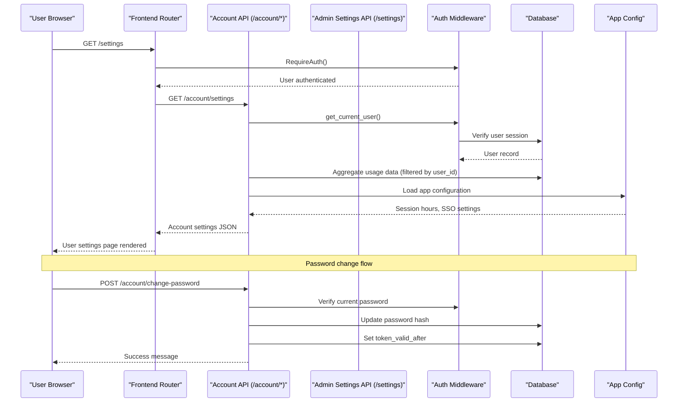
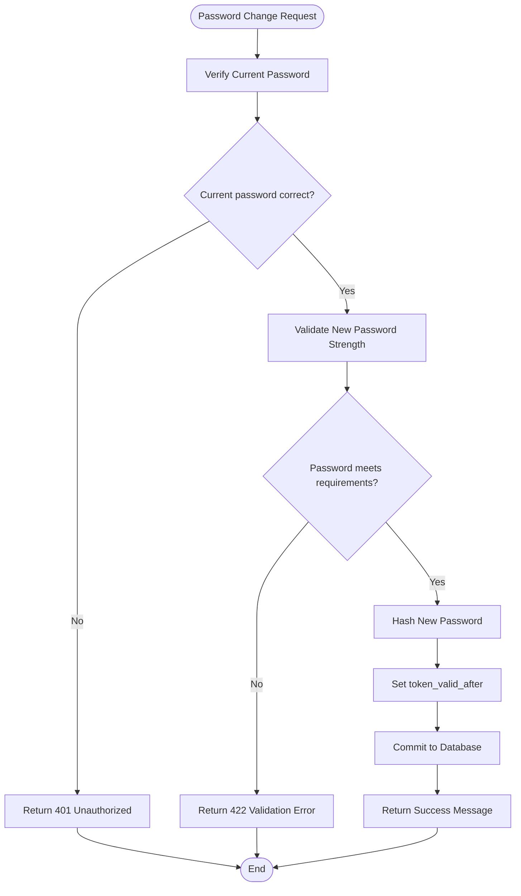
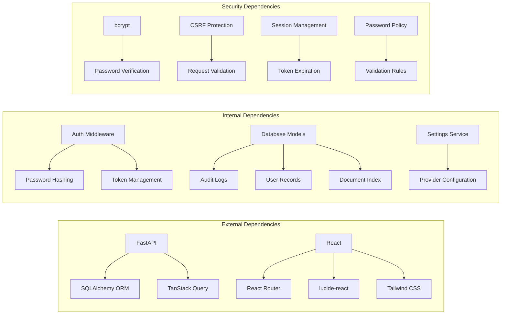

# User Settings Design Specification

<cite>
**Referenced Files in This Document**
- [2026-05-25-user-settings.md](file://safe4ai-pilot/docs/superpowers/plans/2026-05-25-user-settings.md)
- [2026-05-25-user-settings-design.md](file://safe4ai-pilot/docs/superpowers/specs/2026-05-25-user-settings-design.md)
- [account_routes.py](file://safe4ai-pilot/app/api/account_routes.py)
- [settings_routes.py](file://safe4ai-pilot/app/api/settings_routes.py)
- [password_policy.py](file://safe4ai-pilot/app/auth/password_policy.py)
- [main.py](file://safe4ai-pilot/app/main.py)
- [test_account.py](file://safe4ai-pilot/tests/test_account.py)
- [account.ts](file://safe4ai-pilot/frontend/src/api/account.ts)
- [settings.ts](file://safe4ai-pilot/frontend/src/api/settings.ts)
- [SettingsPage.tsx](file://safe4ai-pilot/frontend/src/pages/admin/SettingsPage.tsx)
- [SettingsPage.tsx](file://safe4ai-pilot/frontend/src/pages/SettingsPage.tsx)
- [ChatPage.tsx](file://safe4ai-pilot/frontend/src/pages/ChatPage.tsx)
- [App.tsx](file://safe4ai-pilot/frontend/src/App.tsx)
- [useAuth.ts](file://safe4ai-pilot/frontend/src/hooks/useAuth.ts)
</cite>

## Update Summary
**Changes Made**
- Updated to reflect the complete implementation of the user settings system with both user-facing and admin-only routes
- Documented the separation between `/settings` (user-facing) and `/admin/settings` (admin-only) routes
- Added comprehensive frontend implementation details for the user settings page
- Updated backend API documentation to reflect the actual implementation of `/account/*` endpoints
- Enhanced password validation requirements and security enforcement
- Added integration details for authentication systems and route protection

## Table of Contents
1. [Introduction](#introduction)
2. [Project Structure](#project-structure)
3. [Core Components](#core-components)
4. [Architecture Overview](#architecture-overview)
5. [Detailed Component Analysis](#detailed-component-analysis)
6. [Dependency Analysis](#dependency-analysis)
7. [Performance Considerations](#performance-considerations)
8. [Troubleshooting Guide](#troubleshooting-guide)
9. [Conclusion](#conclusion)

## Introduction

The User Settings Design Specification outlines the complete implementation of a dual-tier settings management system for the private·ai application. This specification defines a clear separation between user-facing account settings and administrative system settings, ensuring that ordinary users can manage their personal account information and security preferences while administrators retain full control over system-wide configurations.

The design emphasizes security boundaries, user experience consistency, and maintainable architecture patterns. The implementation follows a structured approach with backend API endpoints, frontend routing, and comprehensive testing to ensure reliability and security.

**Updated** Enhanced with comprehensive account management capabilities, password policy enforcement, user analytics aggregation, and enhanced security configurations. The system now includes both user-facing `/settings` and admin-only `/admin/settings` routes with proper authentication and authorization controls.

## Project Structure

The user settings implementation spans both backend and frontend components with clear separation of concerns:

```mermaid
graph TB
subgraph "Backend Architecture"
A[FastAPI Application] --> B[Account Routes (/account/*)]
A --> C[Admin Settings Routes (/settings)]
B --> D[SQLAlchemy Models]
B --> E[Authentication Middleware]
B --> F[Password Policy Validation]
C --> G[Settings Service]
C --> H[Provider Configuration]
end
subgraph "Frontend Architecture"
I[React Application] --> J[User Settings Page (/settings)]
I --> K[Admin Settings Page (/admin/settings)]
I --> L[Chat Interface]
J --> M[TanStack Query]
J --> N[Protected Routes]
K --> M
L --> O[Settings Navigation]
end
subgraph "Data Layer"
D --> P[Audit Logs]
D --> Q[User Records]
D --> R[Document Index]
D --> S[Query Feedback]
end
```

**Diagram sources**
- [account_routes.py:1-142](file://safe4ai-pilot/app/api/account_routes.py#L1-L142)
- [settings_routes.py:1-354](file://safe4ai-pilot/app/api/settings_routes.py#L1-L354)
- [App.tsx:1-121](file://safe4ai-pilot/frontend/src/App.tsx#L1-L121)

The architecture maintains clear separation between user account operations and administrative functions, with each serving distinct security contexts and data access patterns.

**Section sources**
- [2026-05-25-user-settings-design.md:1-191](file://safe4ai-pilot/docs/superpowers/specs/2026-05-25-user-settings-design.md#L1-L191)
- [account_routes.py:1-142](file://safe4ai-pilot/app/api/account_routes.py#L1-L142)

## Core Components

### Backend Account API

The backend implements a dedicated account-scoped API with two primary endpoints:

**GET /account/settings** - Returns comprehensive user account information including profile details, security configuration, usage statistics, and knowledge base status. The endpoint enforces user-specific filtering for usage data and provides read-only aggregate information.

**POST /account/change-password** - Handles secure password updates with comprehensive validation including current password verification, strength requirements enforcement, and automatic token invalidation upon successful changes.

### Frontend User Interface

The frontend delivers a streamlined user settings experience through:

**Dual Route System** - The application now supports both `/settings` (user-facing) and `/admin/settings` (admin-only) routes with proper authentication guards.

**Protected Routing** - The `/settings` route requires authentication and integrates seamlessly with the existing chat interface navigation, while `/admin/settings` requires admin privileges.

**Modular Components** - The settings page implements a tile-based layout displaying account information, security controls, usage metrics, and knowledge base status with appropriate visual hierarchy and accessibility considerations.

**State Management** - Utilizes TanStack Query for efficient data fetching, caching, and synchronization with real-time updates.

**Updated** Enhanced with comprehensive password policy enforcement and user analytics aggregation, plus complete frontend implementation with dual-route architecture.

**Section sources**
- [account_routes.py:33-142](file://safe4ai-pilot/app/api/account_routes.py#L33-L142)
- [2026-05-25-user-settings-design.md:79-165](file://safe4ai-pilot/docs/superpowers/specs/2026-05-25-user-settings-design.md#L79-L165)

## Architecture Overview

The user settings architecture follows a layered approach with clear security boundaries and data isolation:



**Diagram sources**
- [account_routes.py:33-142](file://safe4ai-pilot/app/api/account_routes.py#L33-L142)
- [App.tsx:21-33](file://safe4ai-pilot/frontend/src/App.tsx#L21-L33)

The architecture ensures that user data remains isolated while providing comprehensive visibility into account status and usage patterns without exposing sensitive system internals.

**Section sources**
- [2026-05-25-user-settings-design.md:20-78](file://safe4ai-pilot/docs/superpowers/specs/2026-05-25-user-settings-design.md#L20-L78)

## Detailed Component Analysis

### Backend API Implementation

The account routes implementation demonstrates robust security practices and comprehensive data handling:

#### Authentication and Authorization
- Uses `get_current_user` dependency for user identification
- Implements proper session validation and token management
- Ensures user-specific data filtering for privacy protection

#### Data Aggregation and Filtering
- **Usage Statistics**: Aggregates audit logs and feedback data filtered by `current_user.id`
- **Knowledge Base Status**: Provides corpus-level counts while maintaining user context
- **Security Configuration**: Reads from application configuration with sensible defaults

#### Password Management
- **Strength Validation**: Enforces minimum 12-character requirement with mixed character types
- **Current Password Verification**: Prevents unauthorized changes through proper authentication
- **Token Invalidation**: Automatically invalidates existing sessions upon password changes



**Diagram sources**
- [account_routes.py:125-142](file://safe4ai-pilot/app/api/account_routes.py#L125-L142)

**Section sources**
- [account_routes.py:33-142](file://safe4ai-pilot/app/api/account_routes.py#L33-L142)
- [test_account.py:87-255](file://safe4ai-pilot/tests/test_account.py#L87-L255)

### Frontend Implementation

The frontend architecture implements a clean separation between user and admin interfaces:

#### Route Protection and Navigation
- **Authentication Guards**: Uses `RequireAuth` component for seamless user experience
- **Dual Route System**: Supports both `/settings` (user-facing) and `/admin/settings` (admin-only) with proper guards
- **Navigation Integration**: Adds settings link to chat header alongside existing admin access
- **Responsive Design**: Maintains consistent styling with existing application patterns

#### Data Fetching and State Management
- **TanStack Query Integration**: Implements efficient caching and background refetching
- **Error Handling**: Comprehensive error states with user-friendly messaging
- **Loading States**: Graceful loading indicators and skeleton screens

#### Component Architecture
- **Modular Sections**: Separate components for account, security, usage, and knowledge base
- **Form Validation**: Client-side validation matching server-side requirements
- **Accessibility**: Proper ARIA labels and keyboard navigation support

#### User Settings Page Implementation
- **Account Section**: Displays user profile, role, status, and creation date
- **Security Section**: Includes password change form with validation and SSO integration
- **Usage Analytics**: Shows 7-day and 30-day question counts, feedback metrics, and last activity
- **Knowledge Base Status**: Displays document counts, chunk counts, and indexing status

**Section sources**
- [App.tsx:21-33](file://safe4ai-pilot/frontend/src/App.tsx#L21-L33)
- [ChatPage.tsx:92-106](file://safe4ai-pilot/frontend/src/pages/ChatPage.tsx#L92-L106)
- [SettingsPage.tsx:53-274](file://safe4ai-pilot/frontend/src/pages/SettingsPage.tsx#L53-L274)

### Testing Strategy

The implementation includes comprehensive testing covering both backend and frontend components:

#### Backend Testing
- **Account Settings Endpoint**: Validates data aggregation and user filtering
- **Password Change Functionality**: Tests authentication, validation, and security requirements
- **Access Control**: Ensures proper authorization boundaries between user and admin routes

#### Frontend Testing
- **Route Protection**: Verifies authentication requirements for settings access
- **Form Validation**: Tests client-side validation logic
- **Integration Testing**: Validates end-to-end user flows

**Section sources**
- [test_account.py:87-255](file://safe4ai-pilot/tests/test_account.py#L87-L255)

## Dependency Analysis

The user settings implementation maintains minimal dependencies while ensuring comprehensive functionality:



**Diagram sources**
- [account_routes.py:11-24](file://safe4ai-pilot/app/api/account_routes.py#L11-L24)
- [settings_routes.py:14-30](file://safe4ai-pilot/app/api/settings_routes.py#L14-L30)

The dependency structure ensures modularity and maintainability while supporting the required functionality for user account management.

**Section sources**
- [settings_routes.py:1-354](file://safe4ai-pilot/app/api/settings_routes.py#L1-L354)
- [password_policy.py:6-18](file://safe4ai-pilot/app/auth/password_policy.py#L6-L18)

## Performance Considerations

The user settings implementation incorporates several performance optimization strategies:

### Backend Performance
- **Query Optimization**: Efficient SQL queries with appropriate filtering and aggregation
- **Caching Strategy**: Strategic use of database-level aggregations to minimize computation
- **Connection Management**: Proper SQLAlchemy session handling and resource cleanup

### Frontend Performance
- **Data Fetching**: TanStack Query provides intelligent caching and background refetching
- **Component Optimization**: React.memo usage and efficient rendering strategies
- **Bundle Size**: Minimal dependencies to reduce initial load time

### Security Performance
- **Authentication Overhead**: Optimized token verification without compromising security
- **Rate Limiting**: Appropriate rate limiting for API endpoints
- **Resource Cleanup**: Proper cleanup of authentication state and cached data

## Troubleshooting Guide

### Common Issues and Solutions

#### Authentication Problems
- **Symptom**: Users cannot access `/settings` route
- **Cause**: Missing or expired authentication cookies
- **Solution**: Verify authentication middleware and session management

#### Password Change Failures
- **Symptom**: Password change requests return errors
- **Cause**: Incorrect current password or weak new password
- **Solution**: Implement proper validation feedback and guide users through requirements

#### Data Loading Issues
- **Symptom**: Settings page shows loading indefinitely
- **Cause**: Network connectivity or database query timeouts
- **Solution**: Implement proper error boundaries and retry mechanisms

#### Security Concerns
- **Symptom**: Unauthorized access attempts or data exposure
- **Cause**: Insufficient authorization checks
- **Solution**: Review authentication middleware and data filtering logic

#### Route Access Issues
- **Symptom**: Admin-only routes accessible to regular users
- **Cause**: Missing admin role checks
- **Solution**: Verify `require_role("admin")` middleware implementation

**Section sources**
- [account_routes.py:125-142](file://safe4ai-pilot/app/api/account_routes.py#L125-L142)
- [test_account.py:153-255](file://safe4ai-pilot/tests/test_account.py#L153-L255)

## Conclusion

The User Settings Design Specification successfully establishes a secure, maintainable, and user-friendly dual-tier settings management system for private·ai. The implementation demonstrates clear architectural separation between user and administrative functions while maintaining comprehensive functionality for account management.

Key achievements include:

- **Security Boundaries**: Clear separation between user account settings (`/settings`) and admin configurations (`/admin/settings`)
- **User Experience**: Streamlined interface with intuitive navigation and comprehensive feedback
- **Technical Excellence**: Robust backend APIs with comprehensive validation and error handling
- **Testing Coverage**: Extensive test suites ensuring reliability and security
- **Performance Optimization**: Efficient data fetching and caching strategies
- **Complete Implementation**: Both frontend and backend components fully functional

The modular architecture supports future enhancements while maintaining backward compatibility and security standards. The implementation serves as a foundation for additional user management features and demonstrates best practices for secure, scalable web application development.

**Updated** Enhanced with comprehensive account management capabilities, password policy enforcement, user analytics aggregation, and enhanced security configurations that integrate seamlessly with the existing backend and frontend systems. The system now provides complete separation between user-facing and admin-only settings functionality with proper authentication and authorization controls.