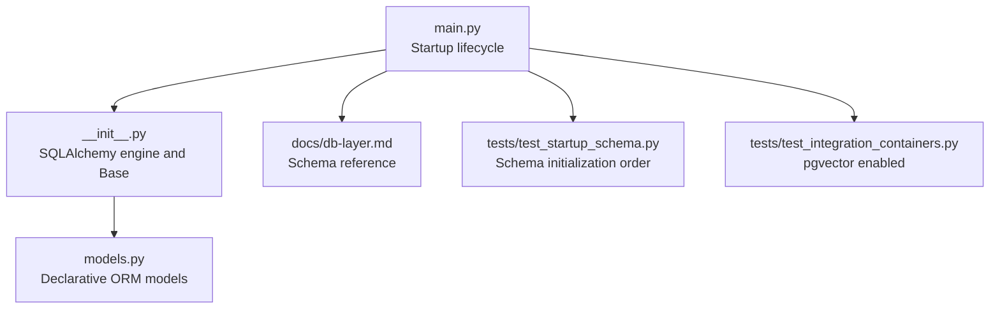
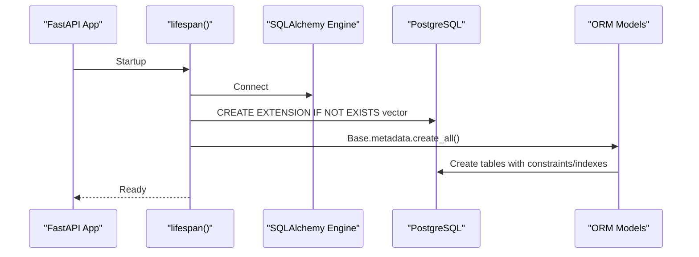
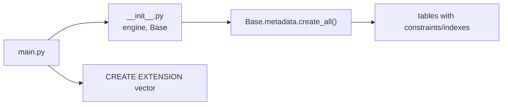

# Data Validation and Constraints

<cite>
**Referenced Files in This Document**
- [models.py](file://safe4ai-pilot/app/db/models.py)
- [__init__.py](file://safe4ai-pilot/app/db/__init__.py)
- [main.py](file://safe4ai-pilot/app/main.py)
- [db-layer.md](file://safe4ai-pilot/docs/db-layer.md)
- [upload_validator.py](file://safe4ai-pilot/app/security/upload_validator.py)
- [input_guard.py](file://safe4ai-pilot/app/security/input_guard.py)
- [output_filter.py](file://safe4ai-pilot/app/security/output_filter.py)
- [models.py](file://safe4ai-pilot/app/models.py)
- [test_startup_schema.py](file://safe4ai-pilot/tests/test_startup_schema.py)
- [test_integration_containers.py](file://safe4ai-pilot/tests/test_integration_containers.py)
</cite>

## Table of Contents
1. [Introduction](#introduction)
2. [Project Structure](#project-structure)
3. [Core Components](#core-components)
4. [Architecture Overview](#architecture-overview)
5. [Detailed Component Analysis](#detailed-component-analysis)
6. [Dependency Analysis](#dependency-analysis)
7. [Performance Considerations](#performance-considerations)
8. [Troubleshooting Guide](#troubleshooting-guide)
9. [Conclusion](#conclusion)
10. [Appendices](#appendices)

## Introduction
This document provides a comprehensive guide to data validation and constraints in the PostgreSQL-backed database layer. It focuses on:
- Business rule enforcement via enum-based validations
- Primary key and foreign key constraints ensuring referential integrity
- Unique constraints for critical fields such as user emails and document identifiers
- Check constraints and application-level guards for data consistency
- Index strategies for performance, including composite and partial indexing
- Cascading delete behaviors and update rules
- Examples of constraint violations and resolution strategies
- Audit trail mechanisms for tracking violations and modifications
- Guidelines for extending validation rules and adding new business constraints

## Project Structure
The database layer is defined using SQLAlchemy declarative models and initialized at application startup. The schema is created automatically during service bootstrapping, and the pgvector extension is enabled prior to table creation.

**Diagram sources**
- [main.py:28-41](file://safe4ai-pilot/app/main.py#L28-L41)
- [__init__.py:1-22](file://safe4ai-pilot/app/db/__init__.py#L1-L22)
- [models.py:1-182](file://safe4ai-pilot/app/db/models.py#L1-L182)
- [db-layer.md:1-369](file://safe4ai-pilot/docs/db-layer.md#L1-L369)
- [test_startup_schema.py:1-22](file://safe4ai-pilot/tests/test_startup_schema.py#L1-L22)
- [test_integration_containers.py:1-27](file://safe4ai-pilot/tests/test_integration_containers.py#L1-L27)

**Section sources**
- [main.py:28-41](file://safe4ai-pilot/app/main.py#L28-L41)
- [__init__.py:1-22](file://safe4ai-pilot/app/db/__init__.py#L1-L22)
- [db-layer.md:1-369](file://safe4ai-pilot/docs/db-layer.md#L1-L369)

## Core Components
This section outlines the validated entities and their constraints as defined in the SQLAlchemy models and documented schema.

- Enum-based validations
  - UserRole: admin, pilot_user
  - IngestionStatus: queued, embedding, indexed, failed, skipped
  - IngestionJobStatus: pending, embedding, completed, failed
  - FeedbackRating: positive, negative
  - ReviewStatus: pending, approved, rejected

- Primary keys
  - All entities define a primary key column of type String.

- Foreign keys and cascades
  - sessions.user_id → users.id (on delete CASCADE)
  - document_chunks.document_id → documents.id (on delete CASCADE)
  - ingestion_jobs.document_id → documents.id (on delete CASCADE)
  - query_feedback.user_id → users.id (on delete CASCADE)
  - human_review_queue.user_id → users.id (on delete CASCADE)
  - audit_logs.user_id → users.id (nullable)

- Unique constraints
  - users.email is unique and indexed

- Check constraints and application-level guards
  - Password hash presence enforced by NOT NULL on users.password_hash
  - Login attempt limits and lockout enforcement handled by application logic (fields: failed_login_count, locked_until)
  - Upload size limits and MIME/type checks enforced by UploadValidator
  - Input query sanitization and injection detection by InputGuard
  - Output filtering for PII hallucinations by OutputFilter

- Indexes
  - Explicit indexes declared for frequently filtered or joined columns (e.g., users.email, sessions.user_id, document_chunks.document_id, audit_logs.user_id, audit_logs.timestamp, query_feedback.trace_id)

**Section sources**
- [models.py:21-49](file://safe4ai-pilot/app/db/models.py#L21-L49)
- [models.py:52-182](file://safe4ai-pilot/app/db/models.py#L52-L182)
- [db-layer.md:20-112](file://safe4ai-pilot/docs/db-layer.md#L20-L112)

## Architecture Overview
The system initializes the database schema and enables the pgvector extension at startup. The ORM models define constraints and relationships that translate into PostgreSQL constraints and indexes.

**Diagram sources**
- [main.py:28-41](file://safe4ai-pilot/app/main.py#L28-L41)
- [__init__.py:1-22](file://safe4ai-pilot/app/db/__init__.py#L1-L22)
- [models.py:52-182](file://safe4ai-pilot/app/db/models.py#L52-L182)

## Detailed Component Analysis

### Enum-Based Validation Entities
- UserRole: enforced via Enum(UserRole) with default pilot_user
- IngestionStatus: default queued for documents
- IngestionJobStatus: default pending for jobs
- FeedbackRating: required for query feedback
- ReviewStatus: default pending for human review queue

These enums constrain allowable values at the database level through the Enum type and at the application level through Python enums.

**Section sources**
- [models.py:21-49](file://safe4ai-pilot/app/db/models.py#L21-L49)

### Primary Keys and Foreign Keys
- Primary keys
  - users.id
  - sessions.id
  - documents.id
  - document_chunks.id
  - semantic_cache.id
  - audit_logs.id
  - agent_runs.id
  - query_feedback.id
  - ingestion_jobs.id
  - human_review_queue.id

- Foreign keys and cascades
  - sessions.user_id → users.id (on delete CASCADE)
  - document_chunks.document_id → documents.id (on delete CASCADE)
  - ingestion_jobs.document_id → documents.id (on delete CASCADE)
  - query_feedback.user_id → users.id (on delete CASCADE)
  - human_review_queue.user_id → users.id (on delete CASCADE)
  - audit_logs.user_id → users.id (nullable)

These relationships ensure referential integrity and automatic cleanup of child records when parent records are deleted.

**Section sources**
- [models.py:52-182](file://safe4ai-pilot/app/db/models.py#L52-L182)

### Unique Constraints
- users.email is unique and indexed, preventing duplicate user registrations.

This uniqueness is declared in the model and reflected in the schema.

**Section sources**
- [models.py:56](file://safe4ai-pilot/app/db/models.py#L56)
- [db-layer.md:27](file://safe4ai-pilot/docs/db-layer.md#L27)

### Check Constraints and Application-Level Guards
- Password hash presence
  - NOT NULL enforced on users.password_hash
- Login attempt limits and lockout
  - failed_login_count and locked_until fields support application-level enforcement of login policies
- Upload validation
  - UploadValidator enforces allowed extensions, MIME types, magic bytes, and maximum size
- Input guard
  - InputGuard sanitizes queries and detects injection patterns
- Output filter
  - OutputFilter checks for PII hallucinations and logs warnings for long outputs

These controls complement database constraints with application-level safety.

**Section sources**
- [models.py:57](file://safe4ai-pilot/app/db/models.py#L57)
- [upload_validator.py:24-73](file://safe4ai-pilot/app/security/upload_validator.py#L24-L73)
- [input_guard.py:24-49](file://safe4ai-pilot/app/security/input_guard.py#L24-L49)
- [output_filter.py:31-61](file://safe4ai-pilot/app/security/output_filter.py#L31-L61)

### Index Creation Strategies
- Explicit indexes
  - users.email (unique and indexed)
  - sessions.user_id (indexed)
  - document_chunks.document_id (indexed)
  - audit_logs.user_id (indexed)
  - audit_logs.timestamp (indexed)
  - query_feedback.trace_id (indexed)
- Composite and partial indexes
  - Consider adding composite indexes for frequent join/filter combinations (e.g., documents(uploaded_by, uploaded_at), ingestion_jobs(document_id, status))
  - Partial indexes can optimize queries filtering by status or time windows (e.g., active users only, recent audit logs)

Note: The current model definitions declare explicit indexes for the listed columns. Additional composite and partial indexes should be introduced via Alembic migrations as the schema evolves.

**Section sources**
- [models.py:56](file://safe4ai-pilot/app/db/models.py#L56)
- [models.py:69](file://safe4ai-pilot/app/db/models.py#L69)
- [models.py:97](file://safe4ai-pilot/app/db/models.py#L97)
- [models.py:122](file://safe4ai-pilot/app/db/models.py#L122)
- [models.py:150](file://safe4ai-pilot/app/db/models.py#L150)

### Cascading Delete Behaviors and Update Rules
- Cascading deletes
  - Deleting a user cascades to sessions, query_feedback, and human_review_queue via on delete CASCADE
  - Deleting a document cascades to document_chunks and ingestion_jobs via on delete CASCADE
- Update rules
  - sessions.updated_at uses onupdate=func.now() to track last modification time

These rules maintain referential integrity and simplify cleanup of related records.

**Section sources**
- [models.py:69](file://safe4ai-pilot/app/db/models.py#L69)
- [models.py:97](file://safe4ai-pilot/app/db/models.py#L97)
- [models.py:162](file://safe4ai-pilot/app/db/models.py#L162)
- [models.py:71](file://safe4ai-pilot/app/db/models.py#L71)

### Constraint Violations and Resolution Strategies
- Unique violation (users.email)
  - Symptom: IntegrityError on insert/update
  - Resolution: Use a unique email per account; deduplicate or merge accounts
- Foreign key violation
  - Symptom: IntegrityError when inserting child records with invalid parent ID
  - Resolution: Ensure parent record exists before creating children; verify cascading rules
- Not-null violation
  - Symptom: IntegrityError for password_hash or other NOT NULL columns
  - Resolution: Provide required values before persisting
- Enum mismatch
  - Symptom: IntegrityError for invalid enum values
  - Resolution: Constrain values to defined enums at the application boundary
- Index-related performance degradation
  - Symptom: Slow queries on unindexed joins or filters
  - Resolution: Add composite/partial indexes via migrations

**Section sources**
- [models.py:56](file://safe4ai-pilot/app/db/models.py#L56)
- [models.py:69](file://safe4ai-pilot/app/db/models.py#L69)
- [models.py:97](file://safe4ai-pilot/app/db/models.py#L97)
- [models.py:162](file://safe4ai-pilot/app/db/models.py#L162)
- [models.py:122](file://safe4ai-pilot/app/db/models.py#L122)
- [models.py:150](file://safe4ai-pilot/app/db/models.py#L150)

### Application-Level and Database-Level Integration
- Database-level
  - Constraints defined in models (NOT NULL, UNIQUE, ENUM, FK, CASCADE)
  - Indexes declared for performance
- Application-level
  - UploadValidator: enforces file extension, MIME type, magic bytes, and size
  - InputGuard: sanitizes queries and detects injection attempts
  - OutputFilter: verifies answers for PII hallucinations and logs warnings for long outputs
  - GuardResult model carries allowed/reason for policy decisions

This dual-layer approach ensures robust validation across boundaries.

**Section sources**
- [models.py:52-182](file://safe4ai-pilot/app/db/models.py#L52-L182)
- [upload_validator.py:24-73](file://safe4ai-pilot/app/security/upload_validator.py#L24-L73)
- [input_guard.py:24-49](file://safe4ai-pilot/app/security/input_guard.py#L24-L49)
- [output_filter.py:31-61](file://safe4ai-pilot/app/security/output_filter.py#L31-L61)
- [models.py:38-41](file://safe4ai-pilot/app/models.py#L38-L41)

### Audit Trail Mechanisms
- AuditLog captures user actions with timestamps, optional user_id, and metadata
- Indexed timestamp and user_id enable efficient querying of audit events
- Retention configured via settings for compliance

This mechanism supports tracking of constraint violations and data modifications.

**Section sources**
- [models.py:118-131](file://safe4ai-pilot/app/db/models.py#L118-L131)
- [db-layer.md:86-100](file://safe4ai-pilot/docs/db-layer.md#L86-L100)

## Dependency Analysis
The database layer depends on SQLAlchemy ORM and PostgreSQL with pgvector. Startup order ensures the vector extension is enabled before schema creation.

**Diagram sources**
- [main.py:28-41](file://safe4ai-pilot/app/main.py#L28-L41)
- [__init__.py:1-22](file://safe4ai-pilot/app/db/__init__.py#L1-L22)
- [models.py:52-182](file://safe4ai-pilot/app/db/models.py#L52-L182)

**Section sources**
- [main.py:28-41](file://safe4ai-pilot/app/main.py#L28-L41)
- [test_startup_schema.py:7-22](file://safe4ai-pilot/tests/test_startup_schema.py#L7-L22)
- [test_integration_containers.py:9-18](file://safe4ai-pilot/tests/test_integration_containers.py#L9-L18)

## Performance Considerations
- Ensure indexes exist for:
  - Frequently filtered/joined columns (users.email, sessions.user_id, document_chunks.document_id, audit_logs.user_id, audit_logs.timestamp, query_feedback.trace_id)
- Consider composite indexes for multi-column predicates (e.g., documents(uploaded_by, uploaded_at), ingestion_jobs(document_id, status))
- Use partial indexes for constrained subsets (e.g., active users only, recent audit logs)
- Monitor query plans after adding indexes to confirm usage

[No sources needed since this section provides general guidance]

## Troubleshooting Guide
- Startup schema order
  - Verify pgvector extension is enabled before creating tables
- pgvector availability
  - Confirm the vector extension is present in the database
- Common integrity errors
  - Unique violations: resolve duplicate entries
  - Foreign key violations: ensure parent rows exist
  - Not-null violations: supply required values
  - Enum violations: restrict values to defined sets

**Section sources**
- [test_startup_schema.py:7-22](file://safe4ai-pilot/tests/test_startup_schema.py#L7-L22)
- [test_integration_containers.py:9-18](file://safe4ai-pilot/tests/test_integration_containers.py#L9-L18)

## Conclusion
The database layer enforces robust integrity through a combination of SQLAlchemy-defined constraints and application-level guards. Enums, unique constraints, foreign keys with cascades, and indexes collectively ensure data consistency and performance. The audit trail and startup initialization procedures further strengthen reliability. Extending validation rules should align with existing patterns: define enums for controlled values, add NOT NULL and CHECK constraints where appropriate, introduce indexes for hot queries, and augment application guards for domain-specific validations.

[No sources needed since this section summarizes without analyzing specific files]

## Appendices

### Appendix A: Constraint Reference
- Enum-based validations
  - UserRole, IngestionStatus, IngestionJobStatus, FeedbackRating, ReviewStatus
- Primary keys
  - All entities: String primary key
- Foreign keys and cascades
  - sessions.user_id → users.id (CASCADE)
  - document_chunks.document_id → documents.id (CASCADE)
  - ingestion_jobs.document_id → documents.id (CASCADE)
  - query_feedback.user_id → users.id (CASCADE)
  - human_review_queue.user_id → users.id (CASCADE)
  - audit_logs.user_id → users.id (nullable)
- Unique constraints
  - users.email: unique and indexed
- Indexes
  - users.email, sessions.user_id, document_chunks.document_id, audit_logs.user_id, audit_logs.timestamp, query_feedback.trace_id

**Section sources**
- [models.py:21-49](file://safe4ai-pilot/app/db/models.py#L21-L49)
- [models.py:52-182](file://safe4ai-pilot/app/db/models.py#L52-L182)
- [db-layer.md:20-112](file://safe4ai-pilot/docs/db-layer.md#L20-L112)