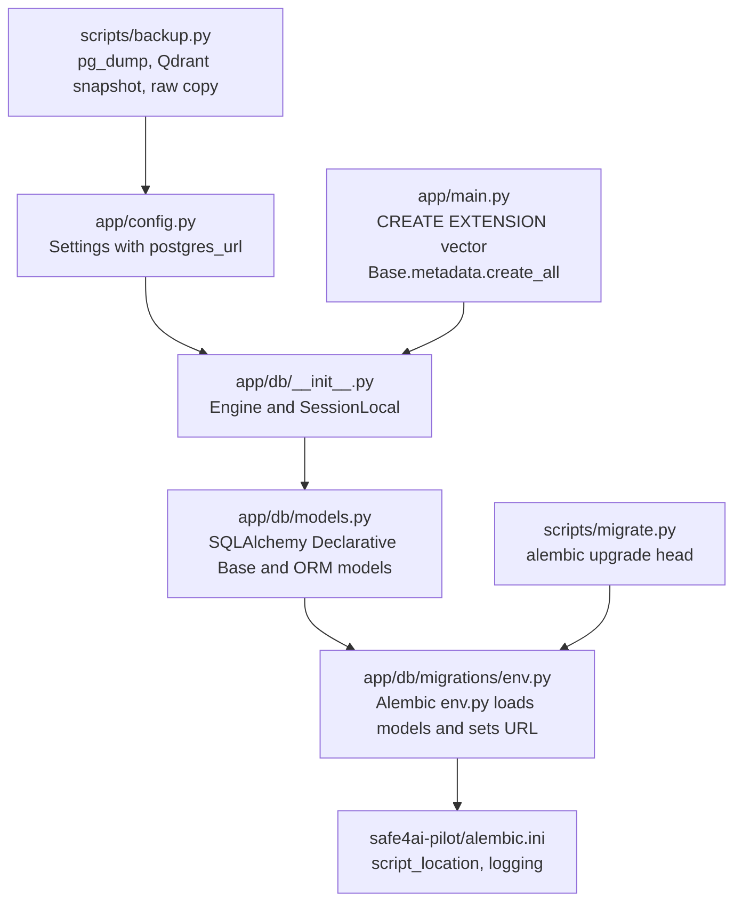
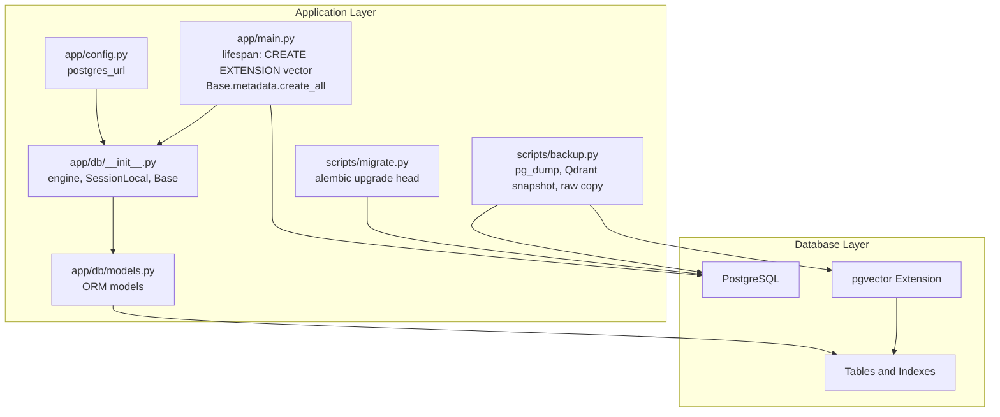
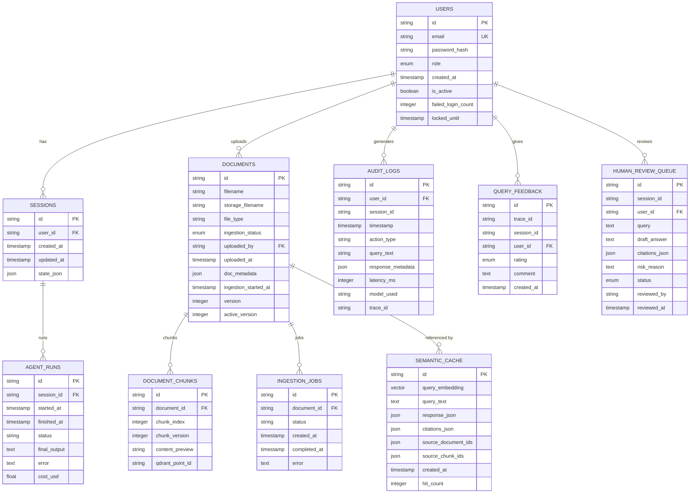
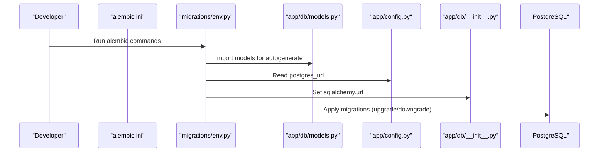
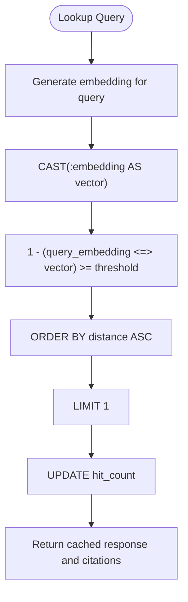
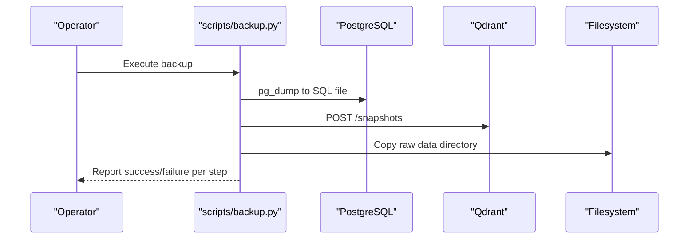
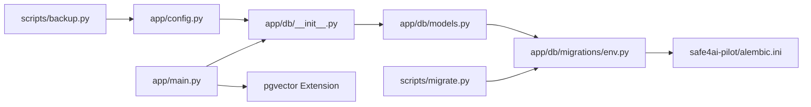

# Database Design

<cite>
**Referenced Files in This Document**
- [app/db/models.py](file://safe4ai-pilot/app/db/models.py)
- [app/db/__init__.py](file://safe4ai-pilot/app/db/__init__.py)
- [app/db/migrations/env.py](file://safe4ai-pilot/app/db/migrations/env.py)
- [safe4ai-pilot/alembic.ini](file://safe4ai-pilot/alembic.ini)
- [app/config.py](file://safe4ai-pilot/app/config.py)
- [app/main.py](file://safe4ai-pilot/app/main.py)
- [scripts/migrate.py](file://safe4ai-pilot/scripts/migrate.py)
- [scripts/backup.py](file://safe4ai-pilot/scripts/backup.py)
- [app/services/semantic_cache.py](file://safe4ai-pilot/app/services/semantic_cache.py)
- [tests/test_startup_schema.py](file://safe4ai-pilot/tests/test_startup_schema.py)
- [tests/test_integration_containers.py](file://safe4ai-pilot/tests/test_integration_containers.py)
</cite>

## Table of Contents
1. [Introduction](#introduction)
2. [Project Structure](#project-structure)
3. [Core Components](#core-components)
4. [Architecture Overview](#architecture-overview)
5. [Detailed Component Analysis](#detailed-component-analysis)
6. [Dependency Analysis](#dependency-analysis)
7. [Performance Considerations](#performance-considerations)
8. [Troubleshooting Guide](#troubleshooting-guide)
9. [Conclusion](#conclusion)
10. [Appendices](#appendices)

## Introduction
This document describes the PostgreSQL database design for the project with pgvector integration. It covers the entity relationship model, schema design, data management strategies, and operational practices. The focus is on the User, Document, Session, AuditLog, and Feedback-related entities, along with supporting entities for ingestion, caching, and human review. It also documents the Alembic-based migration system, vector embedding storage, query patterns, constraints, and operational procedures for lifecycle management, backups, and disaster recovery.

## Project Structure
The database layer is implemented with SQLAlchemy declarative models and Alembic migrations. The application initializes the database at startup, ensuring the pgvector extension is available before creating tables. Migrations are configured via Alembic and executed programmatically by a dedicated script.

**Diagram sources**
- [app/config.py:5-28](file://safe4ai-pilot/app/config.py#L5-L28)
- [app/db/__init__.py:3-22](file://safe4ai-pilot/app/db/__init__.py#L3-L22)
- [app/db/models.py:18-175](file://safe4ai-pilot/app/db/models.py#L18-L175)
- [app/db/migrations/env.py:1-51](file://safe4ai-pilot/app/db/migrations/env.py#L1-L51)
- [safe4ai-pilot/alembic.ini:1-150](file://safe4ai-pilot/alembic.ini#L1-L150)
- [app/main.py:35-40](file://safe4ai-pilot/app/main.py#L35-L40)
- [scripts/migrate.py:7-12](file://safe4ai-pilot/scripts/migrate.py#L7-L12)
- [scripts/backup.py:29-87](file://safe4ai-pilot/scripts/backup.py#L29-L87)

**Section sources**
- [app/db/models.py:18-175](file://safe4ai-pilot/app/db/models.py#L18-L175)
- [app/db/__init__.py:3-22](file://safe4ai-pilot/app/db/__init__.py#L3-L22)
- [app/db/migrations/env.py:1-51](file://safe4ai-pilot/app/db/migrations/env.py#L1-L51)
- [safe4ai-pilot/alembic.ini:1-150](file://safe4ai-pilot/alembic.ini#L1-L150)
- [app/main.py:35-40](file://safe4ai-pilot/app/main.py#L35-L40)
- [scripts/migrate.py:7-12](file://safe4ai-pilot/scripts/migrate.py#L7-L12)
- [scripts/backup.py:29-87](file://safe4ai-pilot/scripts/backup.py#L29-L87)

## Core Components
This section outlines the core entities and their relationships, highlighting constraints and indexes that underpin data integrity and query performance.

- User
  - Primary key: id (string)
  - Unique: email
  - Index: email
  - Attributes: role (enum), created_at, is_active, failed_login_count, locked_until
  - Constraints: role default, is_active default, failed_login_count default, timestamps with server_default

- Session
  - Primary key: id (string)
  - Foreign key: user_id → users.id (index)
  - Attributes: created_at, updated_at, state_json (JSON)
  - Constraints: timestamps with server_default/onupdate

- Document
  - Primary key: id (string)
  - Attributes: filename, storage_filename, file_type, ingestion_status (enum), uploaded_by → users.id, uploaded_at, doc_metadata (JSON), ingestion_started_at, version, active_version
  - Constraints: ingestion_status default, timestamps, version defaults

- DocumentChunk
  - Primary key: id (string)
  - Foreign key: document_id → documents.id (index)
  - Attributes: chunk_index, chunk_version, content_preview (limited length), qdrant_point_id
  - Constraints: chunk_version default

- SemanticCache
  - Primary key: id (string)
  - Vector column: query_embedding (Vector(768))
  - Attributes: query_text (Text), response_json (JSON), citations_json (JSON), source_document_ids (JSON), source_chunk_ids (JSON), created_at, hit_count
  - Constraints: hit_count default, timestamps

- AuditLog
  - Primary key: id (string)
  - Foreign key: user_id → users.id (optional, index)
  - Attributes: session_id, timestamp (indexed), action_type, query_text (limited length), response_metadata (JSON), latency_ms, model_used, trace_id
  - Constraints: timestamps with server_default

- AgentRun
  - Primary key: id (string)
  - Foreign key: session_id → sessions.id (index)
  - Attributes: started_at, finished_at, status, final_output (Text), error (Text), cost_usd (Float)
  - Constraints: timestamps, cost_usd default

- QueryFeedback
  - Primary key: id (string)
  - Foreign key: user_id → users.id
  - Attributes: trace_id (indexed), session_id, rating (enum), comment (Text), created_at
  - Constraints: rating required, timestamps

- IngestionJob
  - Primary key: id (string)
  - Foreign key: document_id → documents.id (index)
  - Attributes: status, created_at, completed_at, error
  - Constraints: status default, timestamps

- HumanReviewQueue
  - Primary key: id (string)
  - Foreign key: user_id → users.id
  - Attributes: session_id, query (Text), draft_answer (Text), citations_json (JSON), risk_reason (Text), status (enum), reviewed_by, reviewed_at
  - Constraints: status default

Entity relationships and referential integrity:
- users → sessions (one-to-many)
- users → documents (one-to-many)
- users → audit_logs (one-to-many)
- users → query_feedback (one-to-many)
- users → human_review_queue (one-to-many)
- documents → document_chunks (one-to-many)
- documents → ingestion_jobs (one-to-many)
- sessions → agent_runs (one-to-many)
- documents ↔ semantic_cache (via source_document_ids JSON array)

Indexes and constraints:
- Unique constraints: users.email
- Indexes: users.email, sessions.user_id, document_chunks.document_id, audit_logs.user_id, audit_logs.timestamp, query_feedback.trace_id
- Enums: UserRole, IngestionStatus, FeedbackRating, ReviewStatus
- JSON fields for flexible metadata and citations
- Vector dimension 768 for SemanticCache.query_embedding

**Section sources**
- [app/db/models.py:45-175](file://safe4ai-pilot/app/db/models.py#L45-L175)

## Architecture Overview
The database architecture integrates SQLAlchemy ORM models with Alembic migrations and pgvector. At startup, the application ensures the vector extension exists and creates all tables. Migrations are managed centrally and can be applied via a script. Backups capture PostgreSQL, Qdrant snapshots, and raw data.

**Diagram sources**
- [app/main.py:35-40](file://safe4ai-pilot/app/main.py#L35-L40)
- [app/config.py:5-28](file://safe4ai-pilot/app/config.py#L5-L28)
- [app/db/__init__.py:3-22](file://safe4ai-pilot/app/db/__init__.py#L3-L22)
- [app/db/models.py:18-175](file://safe4ai-pilot/app/db/models.py#L18-L175)
- [scripts/migrate.py:7-12](file://safe4ai-pilot/scripts/migrate.py#L7-L12)
- [scripts/backup.py:29-87](file://safe4ai-pilot/scripts/backup.py#L29-L87)

## Detailed Component Analysis

### Entity Relationship Model
The ER model centers around Users, Documents, Sessions, and AuditLogs, with auxiliary entities for ingestion, caching, and feedback/review.

**Diagram sources**
- [app/db/models.py:45-175](file://safe4ai-pilot/app/db/models.py#L45-L175)

**Section sources**
- [app/db/models.py:45-175](file://safe4ai-pilot/app/db/models.py#L45-L175)

### Migration System with Alembic
The migration system is configured via Alembic and driven by the application’s configuration. The environment script imports the models to enable autogenerate detection and sets the database URL from settings. A dedicated script runs migrations to the latest version.

Key configuration and behavior:
- Alembic configuration file sets script_location and logging.
- env.py imports models and sets sqlalchemy.url from settings.postgres_url.
- The migration script executes alembic upgrade head.

Operational flow:

**Diagram sources**
- [safe4ai-pilot/alembic.ini:8-14, 115-150:8-14](file://safe4ai-pilot/alembic.ini#L8-L14)
- [app/db/migrations/env.py:6-21](file://safe4ai-pilot/app/db/migrations/env.py#L6-L21)
- [app/db/models.py:18-175](file://safe4ai-pilot/app/db/models.py#L18-L175)
- [app/config.py:5-28](file://safe4ai-pilot/app/config.py#L5-L28)
- [app/db/__init__.py:3-22](file://safe4ai-pilot/app/db/__init__.py#L3-L22)

**Section sources**
- [safe4ai-pilot/alembic.ini:1-150](file://safe4ai-pilot/alembic.ini#L1-L150)
- [app/db/migrations/env.py:1-51](file://safe4ai-pilot/app/db/migrations/env.py#L1-L51)
- [scripts/migrate.py:7-12](file://safe4ai-pilot/scripts/migrate.py#L7-L12)

### Vector Embedding Storage with pgvector
Vector embeddings are stored in the SemanticCache entity using the Vector type with dimension 768. The application ensures the vector extension is enabled at startup and uses explicit casting in queries to compare vectors.

Implementation highlights:
- Vector column definition and dimension.
- Explicit casting in similarity queries.
- Hit counting and threshold-based retrieval.

Query pattern for similarity search:

**Diagram sources**
- [app/services/semantic_cache.py:45-69](file://safe4ai-pilot/app/services/semantic_cache.py#L45-L69)

**Section sources**
- [app/db/models.py:97-109](file://safe4ai-pilot/app/db/models.py#L97-L109)
- [app/main.py:35-37](file://safe4ai-pilot/app/main.py#L35-L37)
- [app/services/semantic_cache.py:45-69](file://safe4ai-pilot/app/services/semantic_cache.py#L45-L69)
- [tests/test_integration_containers.py:9-18](file://safe4ai-pilot/tests/test_integration_containers.py#L9-L18)

### Data Validation Rules and Business Constraints
- Enumerations enforce discrete values for roles, ingestion states, feedback ratings, and review statuses.
- Unique constraints prevent duplicate emails.
- Indexes optimize frequent lookups (user email, foreign keys, audit timestamps).
- JSON fields store flexible metadata and citations; ensure application-side validation for shape and content.
- Timestamps use timezone-aware types with server defaults and updates.
- Numeric fields (latency_ms, cost_usd) constrain numeric ranges.
- Content preview fields limit string lengths.

**Section sources**
- [app/db/models.py:21-43](file://safe4ai-pilot/app/db/models.py#L21-L43)
- [app/db/models.py:45-175](file://safe4ai-pilot/app/db/models.py#L45-L175)

### Practical Querying Examples
- Vector similarity lookup with threshold and ordering.
- Retrieval of related chunks by document ID with indexing.
- Aggregation of audit logs by time window and user.
- Upsert-like behavior for semantic cache entries using hit count increments.

Note: Example SQL is not included. Refer to the service layer for exact query patterns and parameters.

**Section sources**
- [app/services/semantic_cache.py:45-69](file://safe4ai-pilot/app/services/semantic_cache.py#L45-L69)
- [app/db/models.py:86-95](file://safe4ai-pilot/app/db/models.py#L86-L95)
- [app/db/models.py:111-124](file://safe4ai-pilot/app/db/models.py#L111-L124)

### Data Lifecycle Management and Disaster Recovery
- Backups include:
  - PostgreSQL dump using pg_dump.
  - Qdrant snapshot via REST API.
  - Raw data directory copy.
- Retention policies are configurable via settings (e.g., audit log retention).
- Migration automation supports controlled schema evolution.

Operational flow:

**Diagram sources**
- [scripts/backup.py:29-87](file://safe4ai-pilot/scripts/backup.py#L29-L87)

**Section sources**
- [scripts/backup.py:29-87](file://safe4ai-pilot/scripts/backup.py#L29-L87)
- [app/config.py:14-18](file://safe4ai-pilot/app/config.py#L14-L18)

## Dependency Analysis
The database layer depends on configuration for the connection URL, Alembic for schema evolution, and pgvector for vector operations. Startup order guarantees extension availability before table creation.

**Diagram sources**
- [app/config.py:5-28](file://safe4ai-pilot/app/config.py#L5-L28)
- [app/db/__init__.py:3-22](file://safe4ai-pilot/app/db/__init__.py#L3-L22)
- [app/db/models.py:18-175](file://safe4ai-pilot/app/db/models.py#L18-L175)
- [app/db/migrations/env.py:1-51](file://safe4ai-pilot/app/db/migrations/env.py#L1-L51)
- [safe4ai-pilot/alembic.ini:1-150](file://safe4ai-pilot/alembic.ini#L1-L150)
- [app/main.py:35-37](file://safe4ai-pilot/app/main.py#L35-L37)
- [scripts/migrate.py:7-12](file://safe4ai-pilot/scripts/migrate.py#L7-L12)
- [scripts/backup.py:29-87](file://safe4ai-pilot/scripts/backup.py#L29-L87)

**Section sources**
- [app/config.py:5-28](file://safe4ai-pilot/app/config.py#L5-L28)
- [app/db/__init__.py:3-22](file://safe4ai-pilot/app/db/__init__.py#L3-L22)
- [app/db/migrations/env.py:1-51](file://safe4ai-pilot/app/db/migrations/env.py#L1-L51)
- [safe4ai-pilot/alembic.ini:1-150](file://safe4ai-pilot/alembic.ini#L1-L150)
- [app/main.py:35-37](file://safe4ai-pilot/app/main.py#L35-L37)
- [scripts/migrate.py:7-12](file://safe4ai-pilot/scripts/migrate.py#L7-L12)
- [scripts/backup.py:29-87](file://safe4ai-pilot/scripts/backup.py#L29-L87)

## Performance Considerations
- Vector similarity queries rely on GIN/HNSW indexes implicitly supported by pgvector; ensure appropriate indexing and consider partitioning for large datasets.
- Use indexes on frequently filtered/joined columns (e.g., user_id, document_id, audit timestamps).
- Prefer batch operations for ingestion jobs and chunk inserts.
- Monitor query plans for vector comparisons and adjust thresholds to balance recall and performance.
- Pool configuration and pre-ping settings help maintain connection reliability.

[No sources needed since this section provides general guidance]

## Troubleshooting Guide
Common issues and remedies:
- pgvector extension missing: The application creates the extension at startup; verify the CREATE EXTENSION statement runs before schema creation.
- Migration failures: Confirm the database URL in settings and that env.py imports models for autogenerate.
- Backup failures: Validate pg_dump availability, Qdrant endpoint reachability, and filesystem permissions.

Verification references:
- Startup order ensures extension precedes table creation.
- Container tests confirm pgvector presence.
- Health checks validate PostgreSQL connectivity.

**Section sources**
- [tests/test_startup_schema.py:7-13](file://safe4ai-pilot/tests/test_startup_schema.py#L7-L13)
- [tests/test_integration_containers.py:9-18](file://safe4ai-pilot/tests/test_integration_containers.py#L9-L18)
- [app/main.py:35-40](file://safe4ai-pilot/app/main.py#L35-L40)

## Conclusion
The database design leverages SQLAlchemy ORM and Alembic for robust schema evolution, with pgvector enabling efficient vector similarity search. Entities and constraints ensure referential integrity and operational correctness. The migration and backup scripts provide reliable lifecycle management, while startup-time extension provisioning guarantees runtime compatibility.

[No sources needed since this section summarizes without analyzing specific files]

## Appendices

### Appendix A: Startup and Schema Initialization
- The application creates the vector extension and then creates all tables.
- Jobs recovery occurs after schema initialization.

**Section sources**
- [app/main.py:35-40](file://safe4ai-pilot/app/main.py#L35-L40)
- [tests/test_startup_schema.py:16-22](file://safe4ai-pilot/tests/test_startup_schema.py#L16-L22)

### Appendix B: Migration Execution Script
- A simple script invokes Alembic to upgrade to the latest revision.

**Section sources**
- [scripts/migrate.py:7-12](file://safe4ai-pilot/scripts/migrate.py#L7-L12)

### Appendix C: Backup Procedures
- PostgreSQL dump, Qdrant snapshot, and raw data copy are orchestrated by a single script.

**Section sources**
- [scripts/backup.py:29-87](file://safe4ai-pilot/scripts/backup.py#L29-L87)