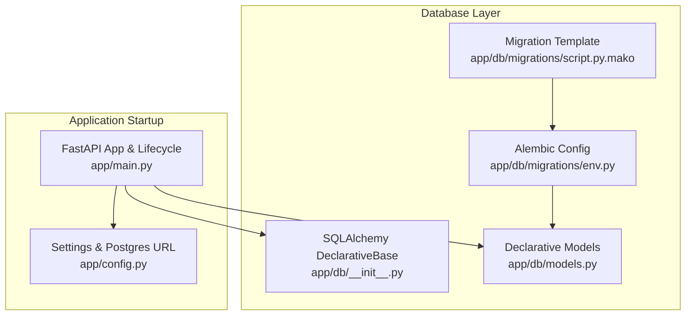
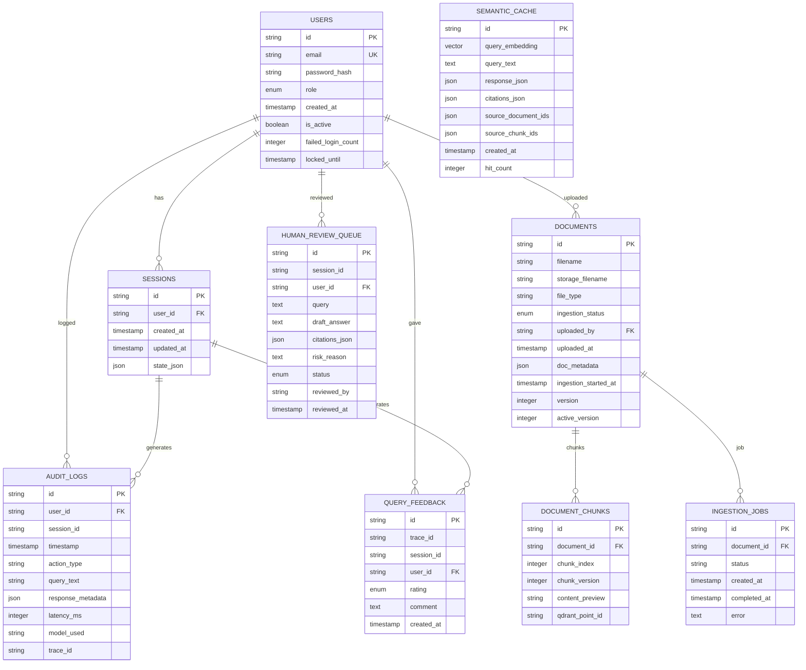
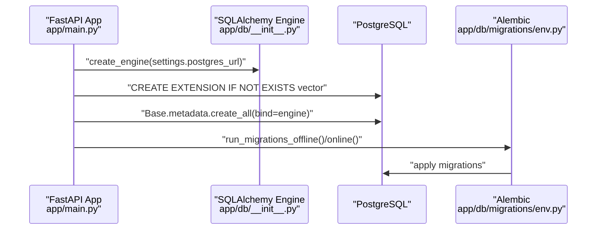

# Entity Relationship Model

<cite>
**Referenced Files in This Document**
- [models.py](file://safe4ai-pilot/app/db/models.py)
- [__init__.py](file://safe4ai-pilot/app/db/__init__.py)
- [main.py](file://safe4ai-pilot/app/main.py)
- [config.py](file://safe4ai-pilot/app/config.py)
- [semantic_cache.py](file://safe4ai-pilot/app/services/semantic_cache.py)
- [ingestion_service.py](file://safe4ai-pilot/app/services/ingestion_service.py)
- [env.py](file://safe4ai-pilot/app/db/migrations/env.py)
- [script.py.mako](file://safe4ai-pilot/app/db/migrations/script.py.mako)
- [test_startup_schema.py](file://safe4ai-pilot/tests/test_startup_schema.py)
</cite>

## Table of Contents
1. [Introduction](#introduction)
2. [Project Structure](#project-structure)
3. [Core Components](#core-components)
4. [Architecture Overview](#architecture-overview)
5. [Detailed Component Analysis](#detailed-component-analysis)
6. [Dependency Analysis](#dependency-analysis)
7. [Performance Considerations](#performance-considerations)
8. [Troubleshooting Guide](#troubleshooting-guide)
9. [Conclusion](#conclusion)
10. [Appendices](#appendices)

## Introduction
This document provides a comprehensive entity relationship model for the PostgreSQL database schema used by the Private AI project. It focuses on the core entities: User, Document, DocumentChunk, Session, AuditLog, QueryFeedback, SemanticCache, IngestionJob, and HumanReviewQueue. For each entity, we describe table structure, primary keys, foreign key relationships, constraints, and roles within the system. We also explain how these entities integrate with vector embeddings and document ingestion workflows, and present practical examples of complex queries and join patterns.

## Project Structure
The database layer is implemented using SQLAlchemy declarative models and Alembic migrations. The schema is initialized at application startup, ensuring the vector extension is enabled before creating tables. Configuration defines database connectivity and operational parameters.



**Diagram sources**
- [__init__.py:12-13](file://safe4ai-pilot/app/db/__init__.py#L12-L13)
- [models.py:45-175](file://safe4ai-pilot/app/db/models.py#L45-L175)
- [env.py:16-18](file://safe4ai-pilot/app/db/migrations/env.py#L16-L18)
- [script.py.mako:14-18](file://safe4ai-pilot/app/db/migrations/script.py.mako#L14-L18)
- [main.py:35-37](file://safe4ai-pilot/app/main.py#L35-L37)
- [config.py:5-24](file://safe4ai-pilot/app/config.py#L5-L24)

**Section sources**
- [__init__.py:12-13](file://safe4ai-pilot/app/db/__init__.py#L12-L13)
- [models.py:45-175](file://safe4ai-pilot/app/db/models.py#L45-L175)
- [env.py:16-18](file://safe4ai-pilot/app/db/migrations/env.py#L16-L18)
- [script.py.mako:14-18](file://safe4ai-pilot/app/db/migrations/script.py.mako#L14-L18)
- [main.py:35-37](file://safe4ai-pilot/app/main.py#L35-L37)
- [config.py:5-24](file://safe4ai-pilot/app/config.py#L5-L24)

## Core Components
This section documents each entity’s table structure, primary keys, foreign keys, constraints, and purpose.

- User
  - Purpose: Authentication and role-based access control.
  - Primary key: id (string).
  - Fields: email (unique, not null), password_hash (not null), role (enum: admin, pilot_user), created_at, is_active, failed_login_count, locked_until.
  - Constraints: Unique email; default role is pilot_user; default is_active is true.

- Session
  - Purpose: Conversation state persistence per user.
  - Primary key: id (string).
  - Foreign key: user_id references users.id (index-enabled).
  - Fields: created_at, updated_at, state_json.

- Document
  - Purpose: Document metadata and lifecycle tracking.
  - Primary key: id (string).
  - Foreign key: uploaded_by references users.id.
  - Enum: ingestion_status (queued, embedding, indexed, failed, skipped).
  - Fields: filename, storage_filename, file_type, uploaded_at, doc_metadata, ingestion_started_at, version, active_version.

- DocumentChunk
  - Purpose: Chunk-level indexing and retrieval metadata.
  - Primary key: id (string).
  - Foreign key: document_id references documents.id (index-enabled).
  - Fields: chunk_index, chunk_version, content_preview, qdrant_point_id.

- SemanticCache
  - Purpose: Vector-backed query caching with similarity search.
  - Primary key: id (string).
  - Vector column: query_embedding (Vector dimension 768).
  - Fields: query_text (not null), response_json (not null), citations_json, source_document_ids, source_chunk_ids, created_at, hit_count (default 0).
  - Indexing: Uses vector similarity operator and order by distance.

- AuditLog
  - Purpose: Comprehensive query tracking and compliance.
  - Primary key: id (string).
  - Optional foreign key: user_id references users.id (index-enabled).
  - Fields: session_id, timestamp (index-enabled), action_type (not null), query_text, response_metadata, latency_ms, model_used, trace_id.

- QueryFeedback
  - Purpose: User satisfaction tracking linked to traces and sessions.
  - Primary key: id (string).
  - Foreign key: user_id references users.id.
  - Fields: trace_id (index-enabled), session_id, rating (enum: positive, negative), comment, created_at.

- IngestionJob
  - Purpose: Background ingestion workflow tracking.
  - Primary key: id (string).
  - Foreign key: document_id references documents.id (index-enabled).
  - Fields: status (default pending), created_at, completed_at, error.

- HumanReviewQueue
  - Purpose: Content safety review workflow.
  - Primary key: id (string).
  - Foreign key: user_id references users.id.
  - Enum: status (pending, approved, rejected).
  - Fields: session_id, query (not null), draft_answer, citations_json, risk_reason, reviewed_by, reviewed_at.

**Section sources**
- [models.py:45-175](file://safe4ai-pilot/app/db/models.py#L45-L175)

## Architecture Overview
The database schema integrates tightly with vector embeddings and document ingestion. At startup, the vector extension is ensured, then all tables are created. SemanticCache leverages vector similarity for fast retrieval, while ingestion jobs coordinate document processing and status updates.

```mermaid
graph TB
Users["User"]
Sessions["Session"]
Documents["Document"]
DocumentChunks["DocumentChunk"]
SemanticCache["SemanticCache"]
AuditLogs["AuditLog"]
QueryFeedback["QueryFeedback"]
IngestionJobs["IngestionJob"]
HumanReviewQueue["HumanReviewQueue"]
Users <- --> Sessions
Users <- --> Documents
Users <- --> QueryFeedback
Users <- --> HumanReviewQueue
Documents --> DocumentChunks
Documents <- --> IngestionJobs
Sessions --> AuditLogs
Users --> AuditLogs
QueryFeedback --> AuditLogs
SemanticCache -. "vector similarity" .- SemanticCache
```

**Diagram sources**
- [models.py:45-175](file://safe4ai-pilot/app/db/models.py#L45-L175)
- [main.py:35-37](file://safe4ai-pilot/app/main.py#L35-L37)

## Detailed Component Analysis

### Entity Relationship Diagram
This diagram shows primary keys, foreign keys, and referential integrity constraints among entities.



**Diagram sources**
- [models.py:45-175](file://safe4ai-pilot/app/db/models.py#L45-L175)

### User Entity: Authentication and Role-Based Access Control
- Authentication fields: email (unique), password_hash.
- Role-based access control: role enum supports admin and pilot_user.
- Security-related fields: failed_login_count and locked_until support lockout policies.
- Indexes: email is indexed for fast lookups.

Practical implications:
- Use email+password_hash for login flows.
- Enforce role checks for administrative actions.
- Track failed attempts and temporary locks.

**Section sources**
- [models.py:45-56](file://safe4ai-pilot/app/db/models.py#L45-L56)

### Document and DocumentChunk Entities: Versioning and Retrieval
- Document tracks lifecycle via ingestion_status and timestamps.
- Versioning: version and active_version enable controlled rollouts.
- DocumentChunk links chunks to documents and supports preview and external IDs for retrieval systems.

Operational notes:
- Chunking occurs during ingestion; chunk_index orders content.
- qdrant_point_id bridges to external vector storage.

**Section sources**
- [models.py:68-95](file://safe4ai-pilot/app/db/models.py#L68-L95)

### Session Entity: Conversation State Persistence
- Associates conversation state with a user.
- state_json stores serialized session data.
- Timestamps track creation and updates.

Usage:
- Persist multi-turn conversations and restore state across requests.

**Section sources**
- [models.py:58-66](file://safe4ai-pilot/app/db/models.py#L58-L66)

### AuditLog Entity: Query Tracking and Compliance
- Captures user actions, queries, responses, latency, and tracing.
- Optional user_id enables auditing without requiring authentication.
- Indexed timestamp and user_id support efficient filtering.

Retention:
- Retention days configured in settings govern cleanup policies.

**Section sources**
- [models.py:111-124](file://safe4ai-pilot/app/db/models.py#L111-L124)
- [config.py:14](file://safe4ai-pilot/app/config.py#L14)

### SemanticCache Entity: Vector Embedding Storage and Query Optimization
- Stores query embeddings (Vector) and associated responses and citations.
- Supports similarity search using vector operators.
- Tracks hit_count for cache effectiveness.

Integration:
- Embeddings generated via Ollama; similarity threshold configurable.
- Invalidate cache entries by document ID to maintain freshness.

**Section sources**
- [models.py:97-109](file://safe4ai-pilot/app/db/models.py#L97-L109)
- [semantic_cache.py:14-104](file://safe4ai-pilot/app/services/semantic_cache.py#L14-L104)
- [config.py:16](file://safe4ai-pilot/app/config.py#L16)

### QueryFeedback Entity: User Satisfaction Tracking
- Links feedback to a trace and session.
- Rating enum captures sentiment.
- Enables dashboards and downstream analytics.

**Section sources**
- [models.py:139-149](file://safe4ai-pilot/app/db/models.py#L139-L149)

### IngestionJob and HumanReviewQueue Entities: Document Processing Workflows
- IngestionJob coordinates background processing and status transitions.
- HumanReviewQueue manages content safety reviews with status tracking.

Operational highlights:
- Startup recovery resets stuck ingestion jobs after a threshold.
- Review status transitions support governance workflows.

**Section sources**
- [models.py:151-175](file://safe4ai-pilot/app/db/models.py#L151-L175)
- [ingestion_service.py:90-113](file://safe4ai-pilot/app/services/ingestion_service.py#L90-L113)

## Dependency Analysis
The application enforces schema initialization order and extension availability before table creation. This ensures vector operations are supported.



**Diagram sources**
- [main.py:35-37](file://safe4ai-pilot/app/main.py#L35-L37)
- [__init__.py:8](file://safe4ai-pilot/app/db/__init__.py#L8)
- [env.py:23-50](file://safe4ai-pilot/app/db/migrations/env.py#L23-L50)

**Section sources**
- [main.py:35-37](file://safe4ai-pilot/app/main.py#L35-L37)
- [__init__.py:8](file://safe4ai-pilot/app/db/__init__.py#L8)
- [env.py:23-50](file://safe4ai-pilot/app/db/migrations/env.py#L23-L50)
- [test_startup_schema.py:7-22](file://safe4ai-pilot/tests/test_startup_schema.py#L7-L22)

## Performance Considerations
- Vector similarity queries: Ensure vector extension is available and leverage vector index operators for efficient nearest-neighbor searches.
- Indexing: Foreign keys and frequently filtered columns (user_id, document_id, timestamp) are indexed to speed up joins and filters.
- Concurrency: Use separate sessions for background tasks (e.g., ingestion) to avoid blocking request threads.
- Caching: SemanticCache hit_count helps measure cache effectiveness; tune threshold and retention policies accordingly.

[No sources needed since this section provides general guidance]

## Troubleshooting Guide
Common issues and resolutions:
- Missing vector extension: Verify the vector extension is enabled before creating tables. Tests confirm the correct startup order.
- Schema creation timing: Ensure tables are created before background job recovery to avoid constraint violations.
- Migration failures: Confirm Alembic configuration targets the correct metadata and database URL.

**Section sources**
- [test_startup_schema.py:7-22](file://safe4ai-pilot/tests/test_startup_schema.py#L7-L22)
- [main.py:35-40](file://safe4ai-pilot/app/main.py#L35-L40)
- [env.py:16-18](file://safe4ai-pilot/app/db/migrations/env.py#L16-L18)

## Conclusion
The entity model cleanly separates concerns across authentication, document lifecycle, conversation state, auditability, feedback, ingestion, and review workflows. Vector embeddings are integrated for semantic caching, enabling scalable query optimization. Proper indexing and startup sequencing ensure robust operation under production loads.

[No sources needed since this section summarizes without analyzing specific files]

## Appendices

### Practical Query Examples and Join Patterns
Below are example scenarios with join patterns and rationale. Replace placeholders with actual values when executing.

- Retrieve all documents uploaded by a specific user with latest version and ingestion status:
  - Join: users JOIN documents ON users.id = documents.uploaded_by
  - Filters: users.email = ?
  - Sort: documents.uploaded_at DESC
  - Purpose: Admin dashboard or user document listing.

- Fetch chunks for a given document ordered by chunk_index:
  - Join: documents JOIN document_chunks ON documents.id = document_chunks.document_id
  - Filters: documents.id = ?
  - Sort: document_chunks.chunk_index ASC
  - Purpose: Display or re-ingest specific document parts.

- Find recent audit events for a user with optional session correlation:
  - Join: users LEFT JOIN audit_logs ON users.id = audit_logs.user_id
  - Filters: users.id = ?, audit_logs.timestamp >= now() - interval N days
  - Sort: audit_logs.timestamp DESC
  - Purpose: Compliance reporting and activity monitoring.

- Lookup cached responses similar to a query using vector similarity:
  - Operation: SELECT ... WHERE 1 - (query_embedding <-> query_vector) >= threshold ORDER BY distance LIMIT 1
  - Purpose: Optimize repeated queries with semantic caching.

- Get ingestion job status for a document with timestamps and errors:
  - Join: documents JOIN ingestion_jobs ON documents.id = ingestion_jobs.document_id
  - Filters: documents.id = ?
  - Purpose: Monitor ingestion progress and troubleshoot failures.

- Retrieve feedback entries with user details and trace correlation:
  - Join: users JOIN query_feedback ON users.id = query_feedback.user_id
  - Filters: query_feedback.trace_id = ?
  - Purpose: Analyze user satisfaction and traceability.

- List pending human reviews with user context:
  - Join: users JOIN human_review_queue ON users.id = human_review_queue.user_id
  - Filters: human_review_queue.status = 'pending'
  - Sort: human_review_queue.created_at ASC
  - Purpose: Review queue management.

[No sources needed since this section provides conceptual examples]