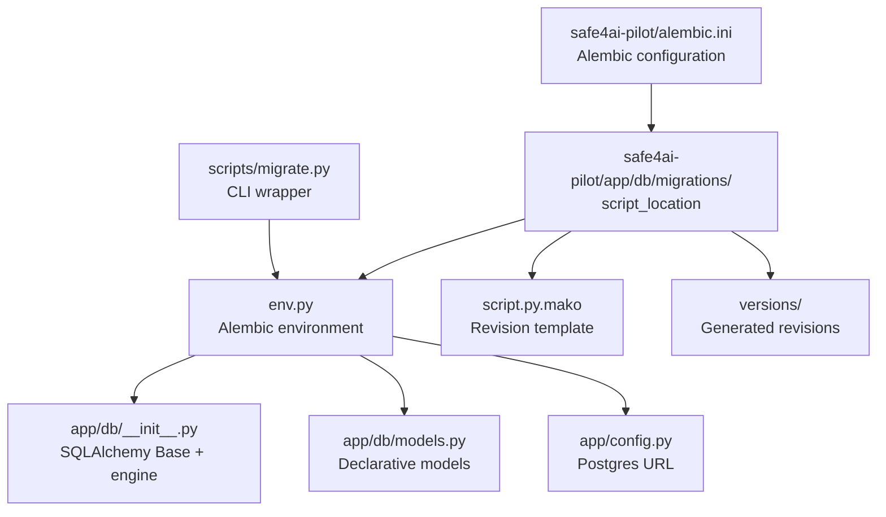
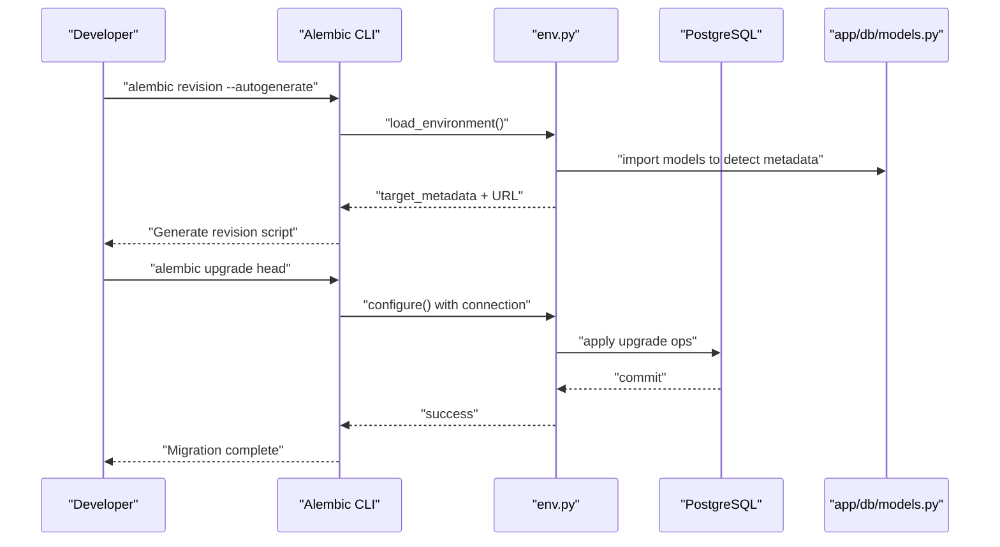
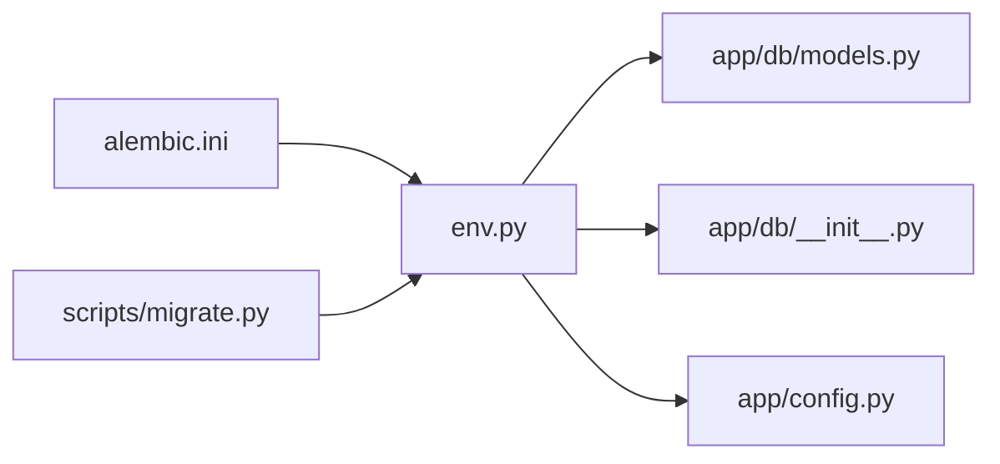
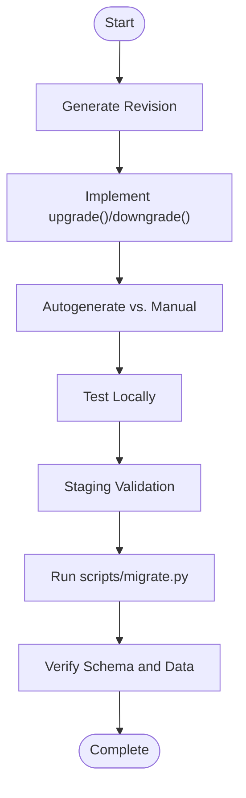

# Migration System

<cite>
**Referenced Files in This Document**
- [alembic.ini](file://safe4ai-pilot/alembic.ini)
- [env.py](file://safe4ai-pilot/app/db/migrations/env.py)
- [script.py.mako](file://safe4ai-pilot/app/db/migrations/script.py.mako)
- [README](file://safe4ai-pilot/app/db/migrations/README)
- [migrate.py](file://safe4ai-pilot/scripts/migrate.py)
- [app/db/__init__.py](file://safe4ai-pilot/app/db/__init__.py)
- [app/db/models.py](file://safe4ai-pilot/app/db/models.py)
- [app/config.py](file://safe4ai-pilot/app/config.py)
</cite>

## Table of Contents
1. [Introduction](#introduction)
2. [Project Structure](#project-structure)
3. [Core Components](#core-components)
4. [Architecture Overview](#architecture-overview)
5. [Detailed Component Analysis](#detailed-component-analysis)
6. [Dependency Analysis](#dependency-analysis)
7. [Performance Considerations](#performance-considerations)
8. [Troubleshooting Guide](#troubleshooting-guide)
9. [Conclusion](#conclusion)
10. [Appendices](#appendices)

## Introduction
This document explains the Alembic-based migration system used for database schema evolution in the project. It covers configuration, environment setup, migration file structure and naming, creation of new migrations, execution of upgrade/downgrade operations, best practices for breaking changes and backward compatibility, testing and deployment strategies, and how migrations relate to application startup and database initialization.

## Project Structure
The migration system is organized under the application’s database package with a dedicated migrations directory. Alembic configuration points to this directory and uses a Mako template to generate revision scripts. The environment script wires Alembic to the application’s SQLAlchemy metadata and database URL.

**Diagram sources**
- [alembic.ini:8-8](file://safe4ai-pilot/alembic.ini#L8-L8)
- [env.py:1-51](file://safe4ai-pilot/app/db/migrations/env.py#L1-L51)
- [script.py.mako:1-29](file://safe4ai-pilot/app/db/migrations/script.py.mako#L1-L29)
- [app/db/__init__.py:1-22](file://safe4ai-pilot/app/db/__init__.py#L1-L22)
- [app/db/models.py:1-175](file://safe4ai-pilot/app/db/models.py#L1-L175)
- [app/config.py:1-28](file://safe4ai-pilot/app/config.py#L1-L28)
- [migrate.py:1-17](file://safe4ai-pilot/scripts/migrate.py#L1-L17)

**Section sources**
- [alembic.ini:1-150](file://safe4ai-pilot/alembic.ini#L1-L150)
- [env.py:1-51](file://safe4ai-pilot/app/db/migrations/env.py#L1-L51)
- [script.py.mako:1-29](file://safe4ai-pilot/app/db/migrations/script.py.mako#L1-L29)
- [README:1-1](file://safe4ai-pilot/app/db/migrations/README#L1-L1)
- [migrate.py:1-17](file://safe4ai-pilot/scripts/migrate.py#L1-L17)
- [app/db/__init__.py:1-22](file://safe4ai-pilot/app/db/__init__.py#L1-L22)
- [app/db/models.py:1-175](file://safe4ai-pilot/app/db/models.py#L1-L175)
- [app/config.py:1-28](file://safe4ai-pilot/app/config.py#L1-L28)

## Core Components
- Alembic configuration: Defines script location, path separator, logging, and optional hooks.
- Environment script: Loads SQLAlchemy models, sets target metadata, and configures database URL from application settings.
- Revision template: Provides the skeleton for generated migration scripts with upgrade and downgrade functions.
- Application models: Declared in a Declarative Base imported by the environment script to enable autogenerate detection.
- CLI wrapper: Runs Alembic upgrade to head for automated deployments.

Key responsibilities:
- alembic.ini: Centralized Alembic settings and logging.
- env.py: Connects Alembic to the app’s SQLAlchemy engine and metadata.
- script.py.mako: Generates revision files with typed upgrade/downgrade blocks.
- app/db/models.py: Declares all tables and relationships for autogenerate.
- scripts/migrate.py: Standardized way to run migrations in CI/CD and production.

**Section sources**
- [alembic.ini:1-150](file://safe4ai-pilot/alembic.ini#L1-L150)
- [env.py:1-51](file://safe4ai-pilot/app/db/migrations/env.py#L1-L51)
- [script.py.mako:1-29](file://safe4ai-pilot/app/db/migrations/script.py.mako#L1-L29)
- [app/db/models.py:1-175](file://safe4ai-pilot/app/db/models.py#L1-L175)
- [migrate.py:1-17](file://safe4ai-pilot/scripts/migrate.py#L1-L17)

## Architecture Overview
The migration pipeline connects configuration, environment, and application models to produce and apply schema changes.

**Diagram sources**
- [env.py:1-51](file://safe4ai-pilot/app/db/migrations/env.py#L1-L51)
- [script.py.mako:1-29](file://safe4ai-pilot/app/db/migrations/script.py.mako#L1-L29)
- [app/db/models.py:1-175](file://safe4ai-pilot/app/db/models.py#L1-L175)

## Detailed Component Analysis

### Alembic Configuration (alembic.ini)
- script_location: Points Alembic to the migrations directory under the app’s database package.
- prepend_sys_path: Ensures local imports resolve correctly when running Alembic commands.
- path_separator: Uses OS-specific path separator for robustness across environments.
- logging: Configures handlers and loggers for SQLAlchemy and Alembic.
- post_write_hooks: Optional formatters/linters can be attached to generated scripts.

Operational notes:
- Do not hardcode the database URL in the INI; it is set programmatically in env.py from application settings.
- Keep logging at INFO level for Alembic to track migration progress.

**Section sources**
- [alembic.ini:1-150](file://safe4ai-pilot/alembic.ini#L1-L150)

### Environment Setup (env.py)
- Imports application models and SQLAlchemy Base to expose target metadata to Alembic.
- Sets the database URL from application settings.
- Supports offline and online modes:
  - Offline mode writes SQL with literal binds.
  - Online mode connects to the live database and applies changes transactionally.

Execution flow:
- Determines mode via context.is_offline_mode().
- Calls run_migrations_offline() or run_migrations_online() accordingly.

Best practices:
- Ensure all models are imported before setting target_metadata.
- Keep the URL consistent with runtime database connections.

**Section sources**
- [env.py:1-51](file://safe4ai-pilot/app/db/migrations/env.py#L1-L51)

### Migration Script Template (script.py.mako)
- Provides typed revision identifiers and empty upgrade/downgrade functions.
- Enables developers to implement schema changes and reversions cleanly.
- Supports branching and dependency declarations via branch_labels and depends_on.

Usage pattern:
- Generate a new revision, then implement upgrade() and downgrade() blocks.
- Use Alembic ops (op.create_table, op.add_column, etc.) to define reversible changes.

**Section sources**
- [script.py.mako:1-29](file://safe4ai-pilot/app/db/migrations/script.py.mako#L1-L29)

### Application Models and Metadata (app/db/models.py and app/db/__init__.py)
- app/db/__init__.py defines a Declarative Base and a shared engine used elsewhere in the app.
- app/db/models.py declares all tables and relationships used by Alembic’s autogenerate.
- env.py imports app.db.models and sets target_metadata to Base.metadata, enabling detection of schema changes.

Relationship:
- env.py imports app.db.models to populate target_metadata.
- Alembic uses target_metadata to compare against the database and generate diffs.

**Section sources**
- [app/db/__init__.py:1-22](file://safe4ai-pilot/app/db/__init__.py#L1-L22)
- [app/db/models.py:1-175](file://safe4ai-pilot/app/db/models.py#L1-L175)
- [env.py:6-18](file://safe4ai-pilot/app/db/migrations/env.py#L6-L18)

### CLI Wrapper (scripts/migrate.py)
- Runs alembic upgrade head via subprocess.
- Exits with the same return code as the Alembic process, enabling CI/CD integration.

Deployment note:
- Use this script in container startup or CI steps to ensure migrations are applied before serving traffic.

**Section sources**
- [migrate.py:1-17](file://safe4ai-pilot/scripts/migrate.py#L1-L17)

### Migration Execution and Rollback Strategies
- Upgrade: Apply pending revisions to reach the target (commonly “head”).
- Downgrade: Revert to a specific revision or “base”.
- Rollback: Use downgrade to a previous revision, then re-run upgrade after fixing issues.

Operational guidance:
- Always test upgrades and downgrades in a staging environment mirroring production.
- Prefer reversible operations (add column with default, alter type with explicit cast, etc.).
- Use transactions in online mode to minimize downtime.

**Section sources**
- [env.py:23-50](file://safe4ai-pilot/app/db/migrations/env.py#L23-L50)
- [script.py.mako:21-28](file://safe4ai-pilot/app/db/migrations/script.py.mako#L21-L28)

### Best Practices for Breaking Changes, Data Preservation, and Backward Compatibility
- Preserve data:
  - Use explicit casts and defaults when altering columns.
  - Split large changes into multiple revisions with careful ordering.
- Maintain backward compatibility:
  - Add new columns as nullable initially; populate later in a separate revision.
  - Avoid dropping columns or tables until a deprecation period has passed.
- Version control patterns:
  - Keep related changes in a single revision; avoid mixing unrelated changes.
  - Use descriptive slug-like messages to improve readability.
- Autogenerate safety:
  - Review autogenerate diffs carefully; sometimes manual adjustments are needed.

[No sources needed since this section provides general guidance]

### Practical Examples of Common Migration Scenarios
Note: The following describe implementation approaches. Use Alembic ops in upgrade() and corresponding reverse ops in downgrade().

- Add a new table:
  - Implement op.create_table(...) in upgrade().
  - Implement op.drop_table(...) in downgrade().
- Modify a column type:
  - Use op.alter_column(..., type_=..., existing_type_=...) with explicit cast in upgrade().
  - Reverse with the original type in downgrade().
- Add a nullable column and backfill:
  - Add column as nullable in upgrade().
  - Populate data in a subsequent step.
  - Make column non-nullable in a follow-up revision.
- Add an enum value:
  - Extend the enum in models.py.
  - Use op.execute(...) to update existing rows if needed.
- Drop a deprecated table:
  - Ensure downstream dependencies are removed first.
  - Implement op.drop_table(...) in downgrade() to restore data safety.

[No sources needed since this section provides general guidance]

### Migration Testing Strategies
- Local development:
  - Run alembic upgrade and downgrade locally against a test database.
- CI/CD:
  - Use scripts/migrate.py to apply migrations in pre-deploy steps.
  - Verify schema and data integrity with targeted tests.
- Staging:
  - Mirror production data and run full upgrade/downgrade cycles.
- Snapshot and rollback:
  - Take database snapshots before applying major migrations.
  - Automate rollback to the snapshot if migrations fail.

[No sources needed since this section provides general guidance]

### Production Deployment Procedures
- Pre-deployment:
  - Confirm environment variables and database connectivity.
  - Run scripts/migrate.py in the deployment pipeline.
- Zero-downtime considerations:
  - Prefer additive-only changes where possible.
  - Use online mode with transactions; keep sessions short.
- Post-deployment:
  - Validate application startup and basic queries.
  - Monitor logs for Alembic and SQLAlchemy warnings.

**Section sources**
- [migrate.py:1-17](file://safe4ai-pilot/scripts/migrate.py#L1-L17)
- [env.py:35-50](file://safe4ai-pilot/app/db/migrations/env.py#L35-L50)

### Relationship Between Migrations and Application Startup
- Database initialization:
  - The app creates an engine and session factory in app/db/__init__.py for runtime ORM usage.
- Migration execution:
  - Use scripts/migrate.py to apply migrations prior to starting the app.
- Consistency:
  - env.py reads the same database URL from app/config.py to ensure migrations and runtime use the same target.

**Section sources**
- [app/db/__init__.py:1-22](file://safe4ai-pilot/app/db/__init__.py#L1-L22)
- [app/config.py:1-28](file://safe4ai-pilot/app/config.py#L1-L28)
- [migrate.py:1-17](file://safe4ai-pilot/scripts/migrate.py#L1-L17)
- [env.py:20-20](file://safe4ai-pilot/app/db/migrations/env.py#L20-L20)

## Dependency Analysis
The migration system exhibits low coupling and clear separation of concerns:
- alembic.ini configures Alembic globally.
- env.py bridges configuration, models, and Alembic.
- app/db/models.py provides declarative schema for autogenerate.
- scripts/migrate.py encapsulates migration invocation for deployment.

**Diagram sources**
- [alembic.ini:1-150](file://safe4ai-pilot/alembic.ini#L1-L150)
- [env.py:1-51](file://safe4ai-pilot/app/db/migrations/env.py#L1-L51)
- [app/db/models.py:1-175](file://safe4ai-pilot/app/db/models.py#L1-L175)
- [app/db/__init__.py:1-22](file://safe4ai-pilot/app/db/__init__.py#L1-L22)
- [app/config.py:1-28](file://safe4ai-pilot/app/config.py#L1-L28)
- [migrate.py:1-17](file://safe4ai-pilot/scripts/migrate.py#L1-L17)

**Section sources**
- [alembic.ini:1-150](file://safe4ai-pilot/alembic.ini#L1-L150)
- [env.py:1-51](file://safe4ai-pilot/app/db/migrations/env.py#L1-L51)
- [app/db/models.py:1-175](file://safe4ai-pilot/app/db/models.py#L1-L175)
- [app/db/__init__.py:1-22](file://safe4ai-pilot/app/db/__init__.py#L1-L22)
- [app/config.py:1-28](file://safe4ai-pilot/app/config.py#L1-L28)
- [migrate.py:1-17](file://safe4ai-pilot/scripts/migrate.py#L1-L17)

## Performance Considerations
- Keep migrations small and incremental to reduce lock times.
- Avoid long-running operations inside migrations; break into multiple revisions.
- Use online mode with minimal transaction durations.
- Index creation and large data backfills should be batched and monitored.

[No sources needed since this section provides general guidance]

## Troubleshooting Guide
Common issues and resolutions:
- Incorrect database URL:
  - Ensure env.py sets the URL from app/config.py and that environment variables are loaded.
- Missing models in autogenerate:
  - Import all models before setting target_metadata in env.py.
- Conflicts with existing data:
  - Use explicit defaults and nullable columns; backfill in staged revisions.
- Permission errors:
  - Verify database credentials and privileges for schema changes.
- CI failures:
  - Use scripts/migrate.py to surface Alembic exit codes and logs.

**Section sources**
- [env.py:1-51](file://safe4ai-pilot/app/db/migrations/env.py#L1-L51)
- [app/config.py:1-28](file://safe4ai-pilot/app/config.py#L1-L28)
- [migrate.py:1-17](file://safe4ai-pilot/scripts/migrate.py#L1-L17)

## Conclusion
The migration system leverages Alembic with a clean separation between configuration, environment setup, and application models. By following the outlined practices—careful change design, staged rollouts, and robust testing—you can evolve the schema safely while preserving data and maintaining backward compatibility.

[No sources needed since this section summarizes without analyzing specific files]

## Appendices

### Appendix A: Migration Lifecycle Flow

[No sources needed since this diagram shows conceptual workflow, not actual code structure]