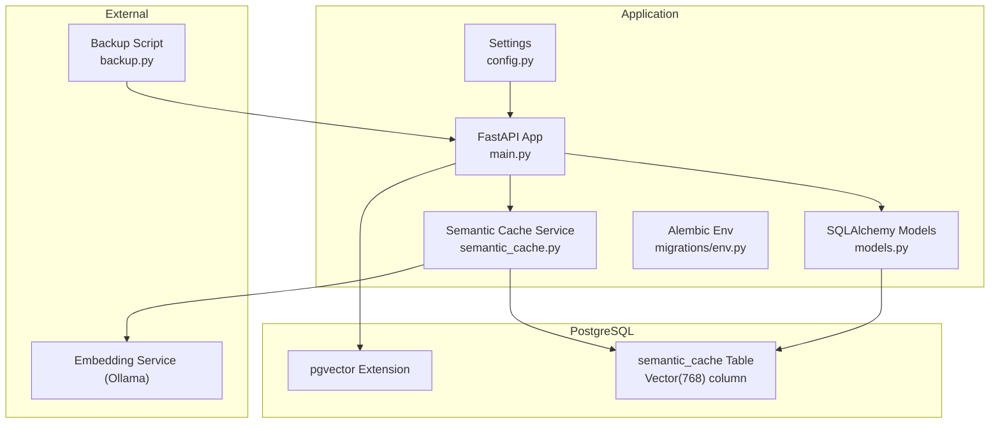
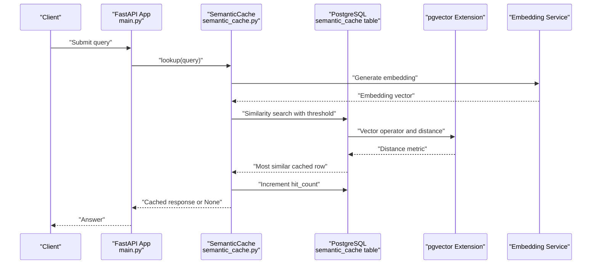
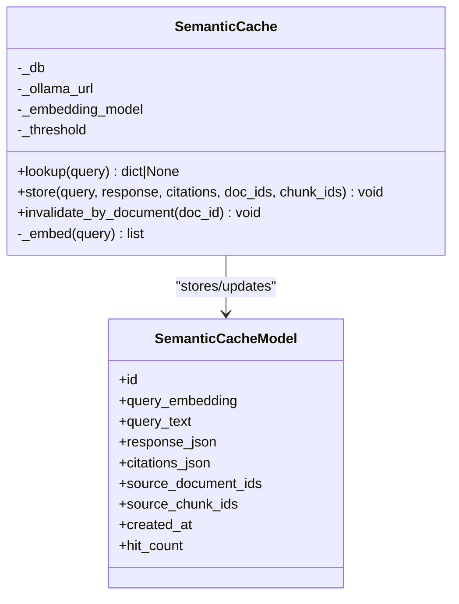
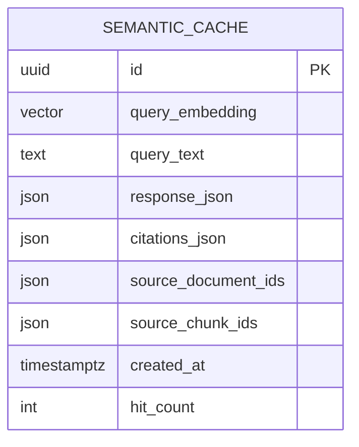
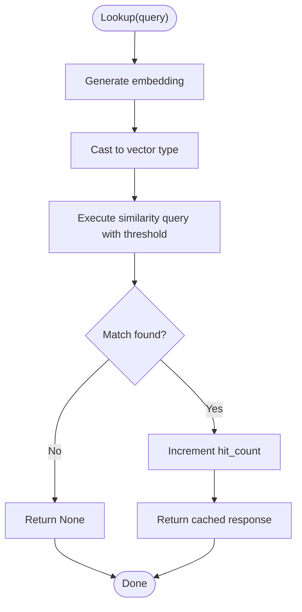
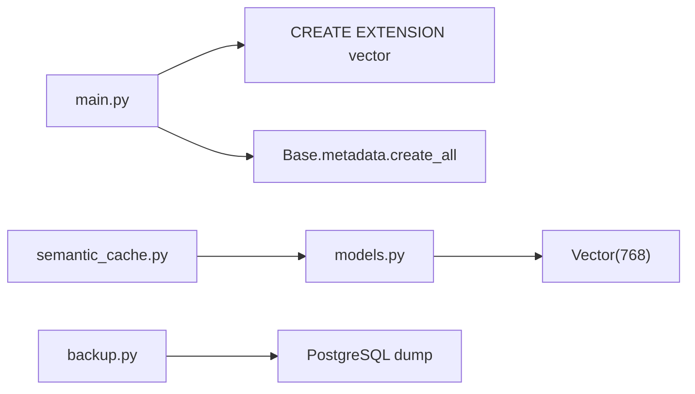

# Vector Data Storage

<cite>
**Referenced Files in This Document**
- [models.py](file://app/db/models.py)
- [semantic_cache.py](file://app/services/semantic_cache.py)
- [main.py](file://app/main.py)
- [config.py](file://app/config.py)
- [backup.py](file://scripts/backup.py)
- [pyproject.toml](file://pyproject.toml)
- [env.py](file://app/db/migrations/env.py)
- [test_integration_containers.py](file://tests/test_integration_containers.py)
- [test_startup_schema.py](file://tests/test_startup_schema.py)
- [test_semantic_cache.py](file://tests/test_semantic_cache.py)
</cite>

## Table of Contents
1. [Introduction](#introduction)
2. [Project Structure](#project-structure)
3. [Core Components](#core-components)
4. [Architecture Overview](#architecture-overview)
5. [Detailed Component Analysis](#detailed-component-analysis)
6. [Dependency Analysis](#dependency-analysis)
7. [Performance Considerations](#performance-considerations)
8. [Troubleshooting Guide](#troubleshooting-guide)
9. [Conclusion](#conclusion)
10. [Appendices](#appendices)

## Introduction
This document explains vector data storage and similarity search using pgvector within the application. It focuses on embedding management, the SemanticCache table design for storing query embeddings, similarity search operations, indexing strategies, and operational aspects such as performance tuning and backup/recovery. It also clarifies the embedding dimension configuration and how it affects similarity calculations.

## Project Structure
The vector-related functionality spans Python SQLAlchemy models, a semantic caching service, database initialization, configuration, and backup scripts. The pgvector extension is initialized during application startup and used by SQLAlchemy’s Vector type.

**Diagram sources**
- [main.py:35-37](file://app/main.py#L35-L37)
- [models.py:104-116](file://app/db/models.py#L104-L116)
- [semantic_cache.py:14-104](file://app/services/semantic_cache.py#L14-L104)
- [config.py:7-21](file://app/config.py#L7-L21)
- [backup.py:29-44](file://scripts/backup.py#L29-L44)

**Section sources**
- [main.py:35-37](file://app/main.py#L35-L37)
- [models.py:104-116](file://app/db/models.py#L104-L116)
- [semantic_cache.py:14-104](file://app/services/semantic_cache.py#L14-L104)
- [config.py:7-21](file://app/config.py#L7-L21)
- [backup.py:29-44](file://scripts/backup.py#L29-L44)

## Core Components
- Vector data type and table schema
  - The SemanticCache table stores query embeddings as a Vector(768) column, enabling vector similarity operations in PostgreSQL.
  - Additional columns track query text, response JSON, citations, source document and chunk identifiers, creation time, and hit count.

- Embedding generation
  - Embeddings are generated via an external embedding service and stored as Python lists, then persisted into the Vector column.

- Similarity search
  - The SemanticCache service computes cosine distance using the vector operator and applies a configurable similarity threshold to retrieve the most similar cached query.

- Initialization and extension loading
  - The pgvector extension is created during application startup before schema creation.

- Backup and recovery
  - A backup script performs a PostgreSQL dump and coordinates with external systems for snapshots.

**Section sources**
- [models.py:104-116](file://app/db/models.py#L104-L116)
- [semantic_cache.py:27-39](file://app/services/semantic_cache.py#L27-L39)
- [semantic_cache.py:41-69](file://app/services/semantic_cache.py#L41-L69)
- [main.py:35-37](file://app/main.py#L35-L37)
- [backup.py:29-44](file://scripts/backup.py#L29-L44)

## Architecture Overview
The system integrates an embedding service, a PostgreSQL database with pgvector, and a semantic cache service to accelerate repeated queries by reusing prior answers when semantically similar.

**Diagram sources**
- [semantic_cache.py:41-69](file://app/services/semantic_cache.py#L41-L69)
- [semantic_cache.py:27-39](file://app/services/semantic_cache.py#L27-L39)
- [main.py:35-37](file://app/main.py#L35-L37)
- [models.py:104-116](file://app/db/models.py#L104-L116)

## Detailed Component Analysis

### SemanticCache Service
The SemanticCache service encapsulates embedding generation, similarity search, and cache invalidation. It uses explicit vector casting and the vector operator to compute distances.

Key behaviors:
- Embedding generation: Calls the embedding endpoint and validates the returned embedding list.
- Lookup: Computes the distance between the incoming query embedding and stored embeddings, filters by a similarity threshold, orders by distance, and increments hit counts.
- Store: Persists a new cache entry with query text, response JSON, citations, and source identifiers.
- Invalidate by document: Removes cache entries associated with a given document identifier.

**Diagram sources**
- [semantic_cache.py:14-104](file://app/services/semantic_cache.py#L14-L104)
- [models.py:104-116](file://app/db/models.py#L104-L116)

**Section sources**
- [semantic_cache.py:14-104](file://app/services/semantic_cache.py#L14-L104)
- [models.py:104-116](file://app/db/models.py#L104-L116)

### Vector Data Type and Dimension
- The Vector column is declared with dimension 768 in the SemanticCache table.
- This dimensionality defines the length of embedding vectors stored in the database and influences similarity calculations.
- Distance metrics and indexing strategies should align with this dimension.

**Diagram sources**
- [models.py:104-116](file://app/db/models.py#L104-L116)

**Section sources**
- [models.py:108](file://app/db/models.py#L108)

### Similarity Search Operations
- The service constructs a vector from the incoming embedding and compares it against stored embeddings using the vector operator.
- The query filters results by a similarity threshold derived from the distance metric and orders by distance ascending to select the closest match.
- The service increments the hit count upon a successful cache hit.

**Diagram sources**
- [semantic_cache.py:41-69](file://app/services/semantic_cache.py#L41-L69)

**Section sources**
- [semantic_cache.py:41-69](file://app/services/semantic_cache.py#L41-L69)

### Indexing Strategies for Vector Columns
- The current implementation relies on default PostgreSQL behavior for vector columns. No explicit GIN or IVFFLAT indexes are shown in the repository.
- For production workloads with large-scale vector operations, consider adding appropriate indexes to improve similarity search performance. This is a recommended operational enhancement.

[No sources needed since this section provides general guidance]

### Relationship Between Semantic Cache and Document Chunks
- The SemanticCache table includes JSON arrays for source_document_ids and source_chunk_ids, linking cached responses to the originating documents and chunks.
- This enables targeted invalidation when documents change or are removed.

**Section sources**
- [models.py:112-113](file://app/db/models.py#L112-L113)
- [semantic_cache.py:94-103](file://app/services/semantic_cache.py#L94-L103)

### Practical Examples
- Inserting embeddings and storing cache entries:
  - Use the store method to persist a new cache row with query text, response JSON, citations, and source identifiers.
- Performing similarity searches:
  - Use the lookup method to embed the query, compare against stored embeddings, apply the threshold, and retrieve the best match.
- Managing vector data lifecycle:
  - Use invalidate_by_document to remove cache entries linked to a specific document ID.

**Section sources**
- [semantic_cache.py:71-92](file://app/services/semantic_cache.py#L71-L92)
- [semantic_cache.py:41-69](file://app/services/semantic_cache.py#L41-L69)
- [semantic_cache.py:94-103](file://app/services/semantic_cache.py#L94-L103)

## Dependency Analysis
- Application bootstrap ensures the pgvector extension exists before creating tables.
- The SemanticCache service depends on SQLAlchemy ORM and the Vector type for PostgreSQL.
- The backup script integrates with PostgreSQL for data preservation.

**Diagram sources**
- [main.py:35-37](file://app/main.py#L35-L37)
- [models.py:108](file://app/db/models.py#L108)
- [semantic_cache.py:14-104](file://app/services/semantic_cache.py#L14-L104)
- [backup.py:29-44](file://scripts/backup.py#L29-L44)

**Section sources**
- [main.py:35-37](file://app/main.py#L35-L37)
- [models.py:108](file://app/db/models.py#L108)
- [semantic_cache.py:14-104](file://app/services/semantic_cache.py#L14-L104)
- [backup.py:29-44](file://scripts/backup.py#L29-L44)

## Performance Considerations
- Embedding dimension 768 determines vector size and memory footprint; larger dimensions increase storage and computation costs.
- Distance metric and threshold selection impact recall and precision; tune the threshold to balance relevance and false positives.
- For large-scale vector operations, consider:
  - Adding vector-specific indexes (e.g., IVFFLAT) to reduce search time.
  - Batch embedding generation to minimize overhead.
  - Caching warm-up of embedding models to avoid cold-start latency.
- Monitor query performance and adjust thresholds or prefiltering logic as needed.

[No sources needed since this section provides general guidance]

## Troubleshooting Guide
- pgvector extension not present
  - Ensure the extension is created during startup before schema creation.
  - Tests verify the extension presence and ordering of initialization steps.

- Vector similarity queries failing
  - Confirm that embeddings are generated and cast to the vector type before comparison.
  - Validate that the threshold and ordering align with expected similarity behavior.

- Backup failures
  - The backup script attempts a PostgreSQL dump; errors are logged and the process continues with other steps.

**Section sources**
- [test_integration_containers.py:9-18](file://tests/test_integration_containers.py#L9-L18)
- [test_startup_schema.py:7-13](file://tests/test_startup_schema.py#L7-L13)
- [test_semantic_cache.py:97-106](file://tests/test_semantic_cache.py#L97-L106)
- [backup.py:34-43](file://scripts/backup.py#L34-L43)

## Conclusion
The application leverages pgvector to store and query embeddings efficiently, with a dedicated SemanticCache table and a service that manages embedding generation, similarity search, and cache invalidation. The embedding dimension is configured to 768, and the system uses explicit vector casting and distance-based filtering. For production deployments, consider adding vector indexes and monitoring query performance to scale effectively.

[No sources needed since this section summarizes without analyzing specific files]

## Appendices

### Appendix A: Configuration Reference
- Settings include embedding model name and semantic cache threshold used by the SemanticCache service.

**Section sources**
- [config.py:12](file://app/config.py#L12)
- [config.py:18](file://app/config.py#L18)

### Appendix B: Alembic Environment
- Alembic is configured to manage schema migrations against the configured PostgreSQL URL.

**Section sources**
- [env.py:20](file://app/db/migrations/env.py#L20)

### Appendix C: Dependencies
- The project declares pgvector and related packages in its dependency manifest.

**Section sources**
- [pyproject.toml:24](file://pyproject.toml#L24)