# CI/CD Pipeline

<cite>
**Referenced Files in This Document**
- [.github/workflows/ci.yml](file://.github/workflows/ci.yml)
- [safe4ai-pilot/.github/workflows/ci.yml](file://safe4ai-pilot/.github/workflows/ci.yml)
- [safe4ai-pilot/.pre-commit-config.yaml](file://safe4ai-pilot/.pre-commit-config.yaml)
- [safe4ai-pilot/pyproject.toml](file://safe4ai-pilot/pyproject.toml)
- [safe4ai-pilot/docs/deployment.md](file://safe4ai-pilot/docs/deployment.md)
- [safe4ai-pilot/docker-compose.yml](file://safe4ai-pilot/docker-compose.yml)
- [safe4ai-pilot/frontend/package.json](file://safe4ai-pilot/frontend/package.json)
- [safe4ai-pilot/.secrets.baseline](file://safe4ai-pilot/.secrets.baseline)
- [safe4ai-pilot/tests/conftest.py](file://safe4ai-pilot/tests/conftest.py)
- [safe4ai-pilot/tests/test_docker_packaging.py](file://safe4ai-pilot/tests/test_docker_packaging.py)
- [safe4ai-pilot/tests/test_tracer.py](file://safe4ai-pilot/tests/test_tracer.py)
</cite>

## Table of Contents
1. [Introduction](#introduction)
2. [Project Structure](#project-structure)
3. [Core Components](#core-components)
4. [Architecture Overview](#architecture-overview)
5. [Detailed Component Analysis](#detailed-component-analysis)
6. [Dependency Analysis](#dependency-analysis)
7. [Performance Considerations](#performance-considerations)
8. [Troubleshooting Guide](#troubleshooting-guide)
9. [Conclusion](#conclusion)
10. [Appendices](#appendices)

## Introduction
This document describes the CI/CD pipeline for the Private AI system, focusing on automated testing, building, and deployment processes. It explains GitHub Actions workflow configuration, build triggers, and testing automation. It also documents pre-commit hooks, code quality checks, and linting procedures. The automated testing pipeline covers unit tests, integration tests, and end-to-end testing. Deployment automation, environment promotion, and rollback procedures are included, along with practical examples of pipeline configuration, artifact management, and release workflows. Security scanning integration, dependency updates, and vulnerability assessment are addressed, alongside pipeline customization, parallel execution, and performance optimization strategies.

## Project Structure
The repository contains two primary CI/CD-related areas:
- Root CI workflow for the monorepo-level checks
- Pilot project CI workflow with comprehensive linting, type checking, security scanning, and tests
- Pre-commit hooks for local enforcement
- Pyproject configuration for linting, typing, testing, and coverage
- Deployment documentation and docker-compose for local and CI-friendly orchestration
- Frontend package configuration for build and preview scripts
- Secret scanning baseline for detect-secrets

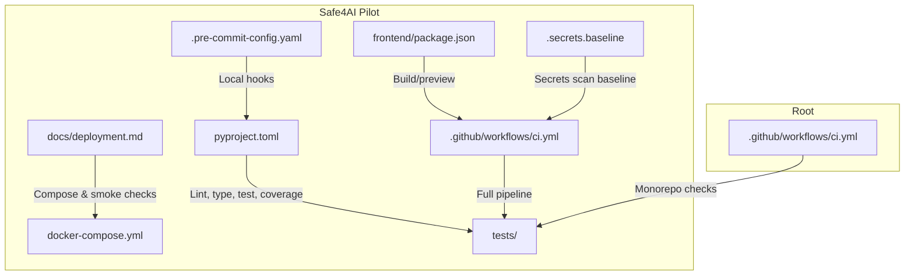

**Diagram sources**
- [.github/workflows/ci.yml:1-40](file://.github/workflows/ci.yml#L1-L40)
- [safe4ai-pilot/.github/workflows/ci.yml:1-51](file://safe4ai-pilot/.github/workflows/ci.yml#L1-L51)
- [safe4ai-pilot/.pre-commit-config.yaml:1-20](file://safe4ai-pilot/.pre-commit-config.yaml#L1-L20)
- [safe4ai-pilot/pyproject.toml:66-101](file://safe4ai-pilot/pyproject.toml#L66-L101)
- [safe4ai-pilot/docs/deployment.md:1-122](file://safe4ai-pilot/docs/deployment.md#L1-L122)
- [safe4ai-pilot/docker-compose.yml:1-119](file://safe4ai-pilot/docker-compose.yml#L1-L119)
- [safe4ai-pilot/frontend/package.json:1-32](file://safe4ai-pilot/frontend/package.json#L1-L32)
- [safe4ai-pilot/.secrets.baseline:1-82](file://safe4ai-pilot/.secrets.baseline#L1-L82)

**Section sources**
- [.github/workflows/ci.yml:1-40](file://.github/workflows/ci.yml#L1-L40)
- [safe4ai-pilot/.github/workflows/ci.yml:1-51](file://safe4ai-pilot/.github/workflows/ci.yml#L1-L51)
- [safe4ai-pilot/.pre-commit-config.yaml:1-20](file://safe4ai-pilot/.pre-commit-config.yaml#L1-L20)
- [safe4ai-pilot/pyproject.toml:66-101](file://safe4ai-pilot/pyproject.toml#L66-L101)
- [safe4ai-pilot/docs/deployment.md:1-122](file://safe4ai-pilot/docs/deployment.md#L1-L122)
- [safe4ai-pilot/docker-compose.yml:1-119](file://safe4ai-pilot/docker-compose.yml#L1-L119)
- [safe4ai-pilot/frontend/package.json:1-32](file://safe4ai-pilot/frontend/package.json#L1-L32)
- [safe4ai-pilot/.secrets.baseline:1-82](file://safe4ai-pilot/.secrets.baseline#L1-L82)

## Core Components
- GitHub Actions CI at root and pilot level
- Pre-commit hooks for formatting, linting, and secret scanning
- Pyproject configuration for linting, type checking, testing, and coverage
- Docker Compose for local orchestration and smoke checks
- Frontend build scripts for development and preview
- Secret scanning baseline for detect-secrets

**Section sources**
- [.github/workflows/ci.yml:1-40](file://.github/workflows/ci.yml#L1-L40)
- [safe4ai-pilot/.github/workflows/ci.yml:1-51](file://safe4ai-pilot/.github/workflows/ci.yml#L1-L51)
- [safe4ai-pilot/.pre-commit-config.yaml:1-20](file://safe4ai-pilot/.pre-commit-config.yaml#L1-L20)
- [safe4ai-pilot/pyproject.toml:66-101](file://safe4ai-pilot/pyproject.toml#L66-L101)
- [safe4ai-pilot/docker-compose.yml:1-119](file://safe4ai-pilot/docker-compose.yml#L1-L119)
- [safe4ai-pilot/frontend/package.json:1-32](file://safe4ai-pilot/frontend/package.json#L1-L32)
- [safe4ai-pilot/.secrets.baseline:1-82](file://safe4ai-pilot/.secrets.baseline#L1-L82)

## Architecture Overview
The CI pipeline is composed of two layers:
- Root CI: minimal checks on push and pull_request to main
- Pilot CI: comprehensive linting, formatting, type checking, tests with coverage, dependency CVE scan, and secret scanning

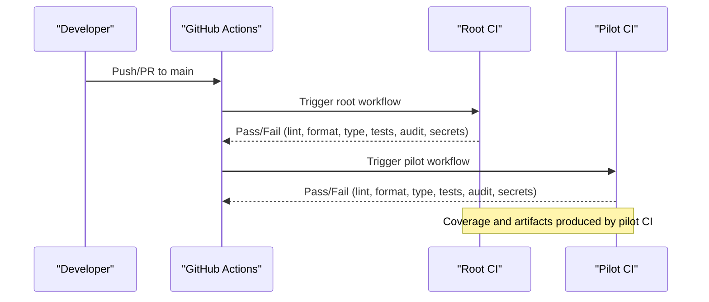

**Diagram sources**
- [.github/workflows/ci.yml:1-40](file://.github/workflows/ci.yml#L1-L40)
- [safe4ai-pilot/.github/workflows/ci.yml:1-51](file://safe4ai-pilot/.github/workflows/ci.yml#L1-L51)

## Detailed Component Analysis

### Root CI Workflow
- Triggers on push and pull_request to main
- Checks out code, sets up Python 3.11 with pip caching
- Installs editable dev dependencies
- Runs ruff lint and format checks
- Runs mypy type checks
- Executes pytest with coverage XML report and minimum threshold
- Performs pip-audit CVE scan
- Runs detect-secrets scan with baseline

**Diagram sources**
- [.github/workflows/ci.yml:1-40](file://.github/workflows/ci.yml#L1-L40)

**Section sources**
- [.github/workflows/ci.yml:1-40](file://.github/workflows/ci.yml#L1-L40)

### Pilot CI Workflow
- Triggers on push and pull_request to main
- Checks out repository, sets up Python 3.11 with pip caching
- Installs system dependencies (libmagic, poppler-utils)
- Installs Python dependencies in editable dev mode
- Runs ruff lint and format checks
- Runs mypy type checks
- Executes pytest with coverage XML report and minimum threshold
- Performs pip-audit CVE scan with flags
- Runs detect-secrets scan with baseline

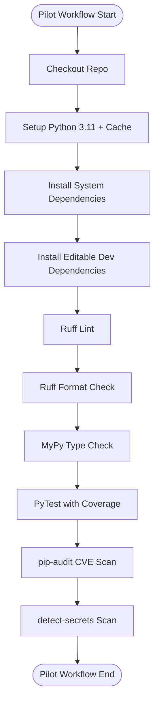

**Diagram sources**
- [safe4ai-pilot/.github/workflows/ci.yml:1-51](file://safe4ai-pilot/.github/workflows/ci.yml#L1-L51)

**Section sources**
- [safe4ai-pilot/.github/workflows/ci.yml:1-51](file://safe4ai-pilot/.github/workflows/ci.yml#L1-L51)

### Pre-commit Hooks
- Ruff: auto-fix and format checks
- detect-secrets: scans with baseline
- pre-commit-hooks: prevents adding large files

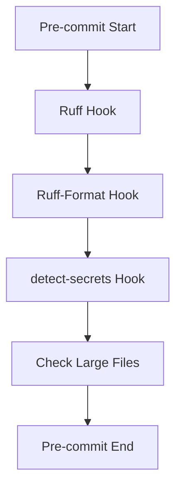

**Diagram sources**
- [safe4ai-pilot/.pre-commit-config.yaml:1-20](file://safe4ai-pilot/.pre-commit-config.yaml#L1-L20)

**Section sources**
- [safe4ai-pilot/.pre-commit-config.yaml:1-20](file://safe4ai-pilot/.pre-commit-config.yaml#L1-L20)

### Pyproject Configuration
- Linting: ruff configuration with line length, target version, selected rules, and per-file ignores
- Typing: mypy strict settings with missing imports ignored
- Testing: pytest configuration with asyncio mode, markers for integration and smoke tests, and coverage omission patterns
- Optional dev dependencies include pytest, ruff, mypy, pip-audit, detect-secrets, and testcontainers

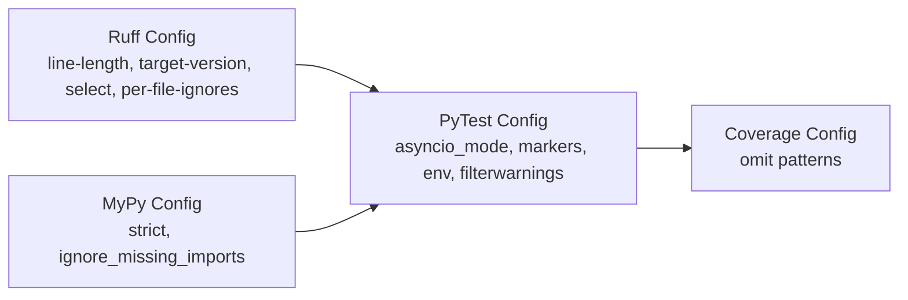

**Diagram sources**
- [safe4ai-pilot/pyproject.toml:66-101](file://safe4ai-pilot/pyproject.toml#L66-L101)

**Section sources**
- [safe4ai-pilot/pyproject.toml:66-101](file://safe4ai-pilot/pyproject.toml#L66-L101)

### Testing Automation
- Unit tests: FastAPI TestClient fixture and mock Ollama transport to avoid external services
- Integration tests: Testcontainers for PostgreSQL and Qdrant; skipped if Docker is unavailable
- Smoke tests: Real-service checks requiring docker compose stack; opt-in via environment variable
- Coverage: XML report and minimum threshold enforced in CI

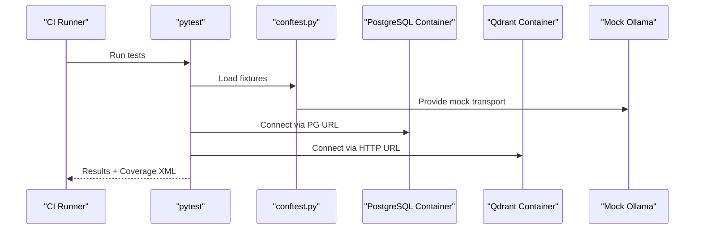

**Diagram sources**
- [safe4ai-pilot/tests/conftest.py:1-88](file://safe4ai-pilot/tests/conftest.py#L1-L88)
- [safe4ai-pilot/.github/workflows/ci.yml:43-44](file://safe4ai-pilot/.github/workflows/ci.yml#L43-L44)

**Section sources**
- [safe4ai-pilot/tests/conftest.py:1-88](file://safe4ai-pilot/tests/conftest.py#L1-L88)
- [safe4ai-pilot/docs/deployment.md:76-93](file://safe4ai-pilot/docs/deployment.md#L76-L93)
- [safe4ai-pilot/.github/workflows/ci.yml:43-44](file://safe4ai-pilot/.github/workflows/ci.yml#L43-L44)

### Deployment Automation and Environment Promotion
- Local orchestration via Docker Compose with healthchecks for all services
- Healthcheck script and curl checks for smoke testing
- Real-service smoke tests require docker compose stack and opt-in environment variable
- Full CI-style local suite includes lint, format, type, tests, and secrets scan

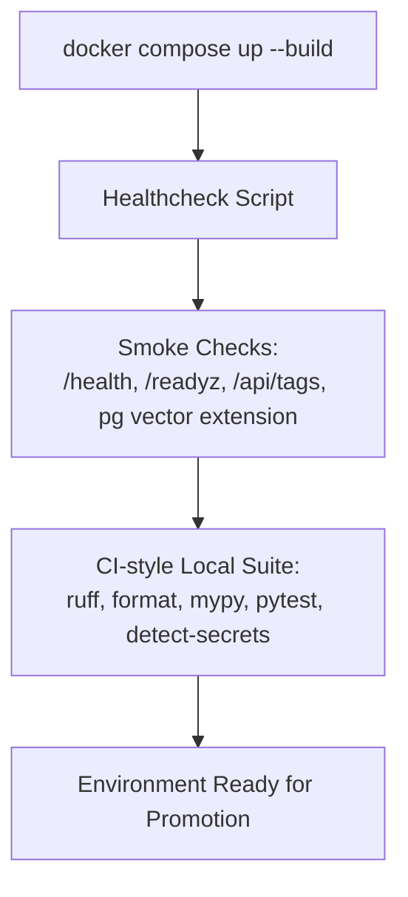

**Diagram sources**
- [safe4ai-pilot/docker-compose.yml:1-119](file://safe4ai-pilot/docker-compose.yml#L1-L119)
- [safe4ai-pilot/docs/deployment.md:29-103](file://safe4ai-pilot/docs/deployment.md#L29-L103)

**Section sources**
- [safe4ai-pilot/docker-compose.yml:1-119](file://safe4ai-pilot/docker-compose.yml#L1-L119)
- [safe4ai-pilot/docs/deployment.md:29-103](file://safe4ai-pilot/docs/deployment.md#L29-L103)

### Rollback Procedures
- Backups: PostgreSQL dump, Qdrant snapshot, filesystem copies of raw/processed data
- Deletion verification: confirm absence of document data across databases, vector store, and filesystem
- Retention aligned with audit log retention policy

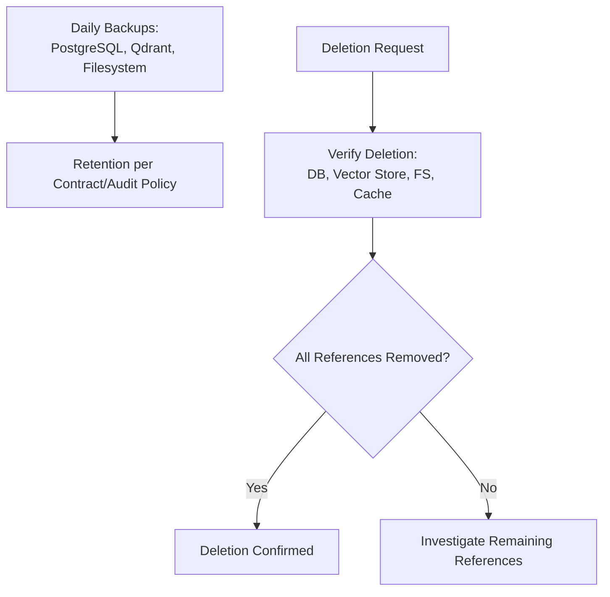

**Diagram sources**
- [safe4ai-pilot/docs/deployment.md:108-122](file://safe4ai-pilot/docs/deployment.md#L108-L122)

**Section sources**
- [safe4ai-pilot/docs/deployment.md:108-122](file://safe4ai-pilot/docs/deployment.md#L108-L122)

### Security Scanning Integration
- pip-audit: dependency vulnerability scanning
- detect-secrets: secret scanning with baseline to reduce false positives
- Baseline file enumerates detectors and thresholds

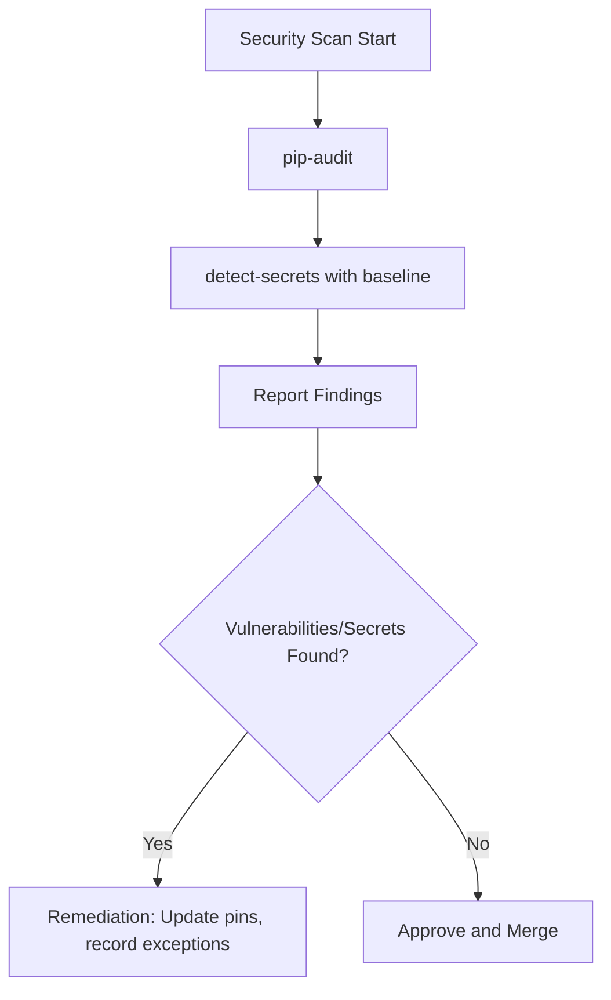

**Diagram sources**
- [safe4ai-pilot/.github/workflows/ci.yml:46-50](file://safe4ai-pilot/.github/workflows/ci.yml#L46-L50)
- [safe4ai-pilot/.secrets.baseline:1-82](file://safe4ai-pilot/.secrets.baseline#L1-L82)

**Section sources**
- [safe4ai-pilot/.github/workflows/ci.yml:46-50](file://safe4ai-pilot/.github/workflows/ci.yml#L46-L50)
- [safe4ai-pilot/.secrets.baseline:1-82](file://safe4ai-pilot/.secrets.baseline#L1-L82)

### Artifact Management and Release Workflows
- Coverage XML report generated during tests for downstream consumption
- Frontend build scripts for development and preview
- Packaging and runtime inclusion verified by dedicated tests

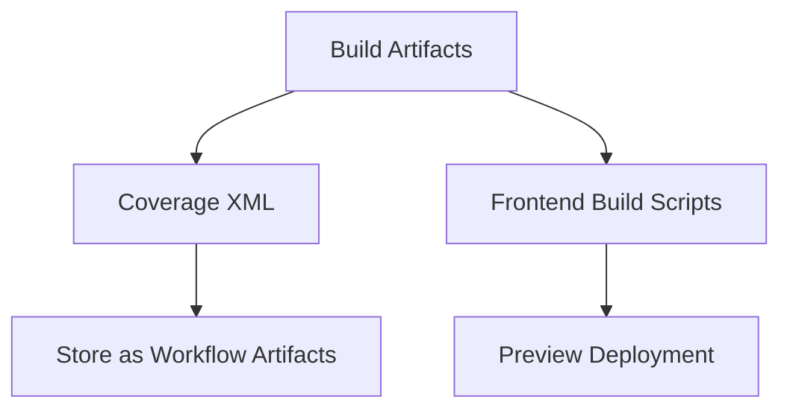

**Diagram sources**
- [safe4ai-pilot/.github/workflows/ci.yml:43-44](file://safe4ai-pilot/.github/workflows/ci.yml#L43-L44)
- [safe4ai-pilot/frontend/package.json:6-10](file://safe4ai-pilot/frontend/package.json#L6-L10)
- [safe4ai-pilot/tests/test_docker_packaging.py:1-20](file://safe4ai-pilot/tests/test_docker_packaging.py#L1-L20)

**Section sources**
- [safe4ai-pilot/.github/workflows/ci.yml:43-44](file://safe4ai-pilot/.github/workflows/ci.yml#L43-L44)
- [safe4ai-pilot/frontend/package.json:6-10](file://safe4ai-pilot/frontend/package.json#L6-L10)
- [safe4ai-pilot/tests/test_docker_packaging.py:1-20](file://safe4ai-pilot/tests/test_docker_packaging.py#L1-L20)

### Observability and Tracing Tests
- Tracer tests validate OpenTelemetry tracer creation and span behavior
- Ensures observability components are exercised under CI

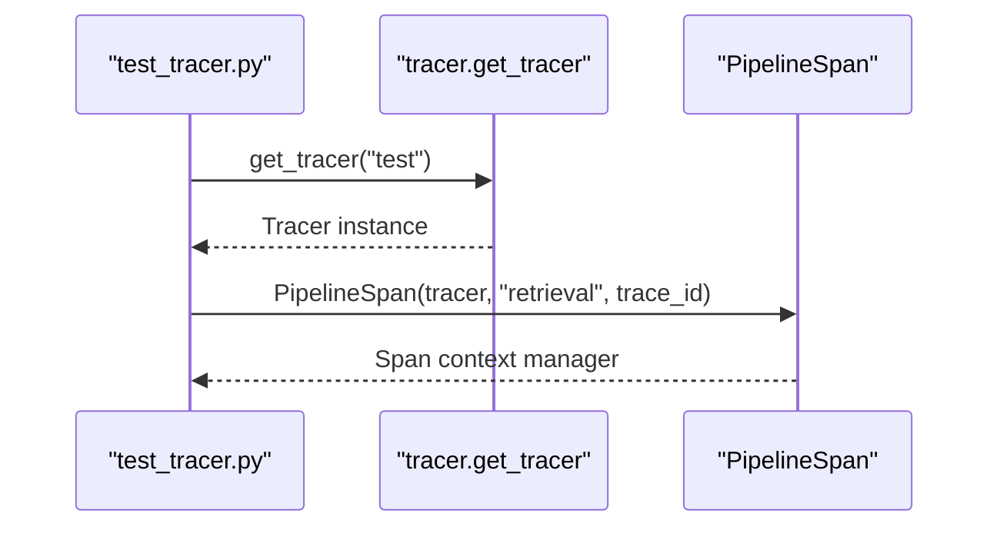

**Diagram sources**
- [safe4ai-pilot/tests/test_tracer.py:1-35](file://safe4ai-pilot/tests/test_tracer.py#L1-L35)

**Section sources**
- [safe4ai-pilot/tests/test_tracer.py:1-35](file://safe4ai-pilot/tests/test_tracer.py#L1-L35)

## Dependency Analysis
- Root CI depends on editable dev installation and standard Python tooling
- Pilot CI adds system dependencies and comprehensive dev tooling
- Pre-commit hooks depend on ruff, detect-secrets, and pre-commit-hooks repos
- Pyproject defines lint, type, test, and coverage policies consistently across environments

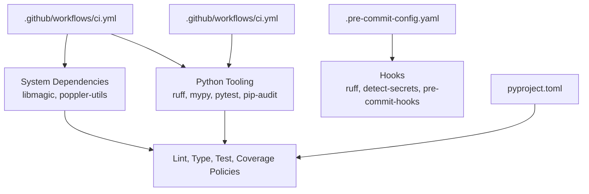

**Diagram sources**
- [.github/workflows/ci.yml:1-40](file://.github/workflows/ci.yml#L1-L40)
- [safe4ai-pilot/.github/workflows/ci.yml:1-51](file://safe4ai-pilot/.github/workflows/ci.yml#L1-L51)
- [safe4ai-pilot/.pre-commit-config.yaml:1-20](file://safe4ai-pilot/.pre-commit-config.yaml#L1-L20)
- [safe4ai-pilot/pyproject.toml:66-101](file://safe4ai-pilot/pyproject.toml#L66-L101)

**Section sources**
- [.github/workflows/ci.yml:1-40](file://.github/workflows/ci.yml#L1-L40)
- [safe4ai-pilot/.github/workflows/ci.yml:1-51](file://safe4ai-pilot/.github/workflows/ci.yml#L1-L51)
- [safe4ai-pilot/.pre-commit-config.yaml:1-20](file://safe4ai-pilot/.pre-commit-config.yaml#L1-L20)
- [safe4ai-pilot/pyproject.toml:66-101](file://safe4ai-pilot/pyproject.toml#L66-L101)

## Performance Considerations
- Python version pinning and pip caching in CI to speed up installs
- Coverage fail-under threshold to maintain quality while enabling faster runs
- System dependency installation in pilot CI to avoid repeated setup overhead
- Pre-commit hooks to catch issues early and reduce CI failures
- Docker Compose healthchecks to quickly surface environment issues

[No sources needed since this section provides general guidance]

## Troubleshooting Guide
- Coverage failures: adjust thresholds or fix tests to meet minimum coverage
- Secret detection: update baseline or remediate detected secrets
- Dependency vulnerabilities: update pins or record time-limited exceptions
- Integration tests failing: ensure Docker is available or mark tests accordingly
- Smoke tests timing out: verify docker compose stack is healthy and services are ready

**Section sources**
- [safe4ai-pilot/.github/workflows/ci.yml:34-50](file://safe4ai-pilot/.github/workflows/ci.yml#L34-L50)
- [safe4ai-pilot/docs/deployment.md:76-93](file://safe4ai-pilot/docs/deployment.md#L76-L93)
- [safe4ai-pilot/tests/conftest.py:64-87](file://safe4ai-pilot/tests/conftest.py#L64-L87)

## Conclusion
The CI/CD pipeline combines a minimal root workflow with a comprehensive pilot workflow to enforce code quality, security, and reliability. Pre-commit hooks ensure local consistency, while CI jobs provide robust linting, type checking, testing, and security scanning. Docker Compose supports local and CI-friendly orchestration, and documented smoke checks and backups enable safe environment promotion and rollback.

[No sources needed since this section summarizes without analyzing specific files]

## Appendices
- Practical examples:
  - Root CI trigger configuration for push and pull_request to main
  - Pilot CI steps for system dependencies, lint, format, type, tests, audit, and secrets
  - Pre-commit hook configuration for ruff and detect-secrets
  - Pyproject lint, type, test, and coverage settings
  - Docker Compose services and healthchecks
  - Frontend build scripts for development and preview
  - Secret scanning baseline file
  - Test fixtures for unit and integration tests
  - Packaging and runtime inclusion tests

**Section sources**
- [.github/workflows/ci.yml:1-40](file://.github/workflows/ci.yml#L1-L40)
- [safe4ai-pilot/.github/workflows/ci.yml:1-51](file://safe4ai-pilot/.github/workflows/ci.yml#L1-L51)
- [safe4ai-pilot/.pre-commit-config.yaml:1-20](file://safe4ai-pilot/.pre-commit-config.yaml#L1-L20)
- [safe4ai-pilot/pyproject.toml:66-101](file://safe4ai-pilot/pyproject.toml#L66-L101)
- [safe4ai-pilot/docker-compose.yml:1-119](file://safe4ai-pilot/docker-compose.yml#L1-L119)
- [safe4ai-pilot/frontend/package.json:6-10](file://safe4ai-pilot/frontend/package.json#L6-L10)
- [safe4ai-pilot/.secrets.baseline:1-82](file://safe4ai-pilot/.secrets.baseline#L1-L82)
- [safe4ai-pilot/tests/conftest.py:1-88](file://safe4ai-pilot/tests/conftest.py#L1-L88)
- [safe4ai-pilot/tests/test_docker_packaging.py:1-20](file://safe4ai-pilot/tests/test_docker_packaging.py#L1-L20)