# CI/CD Pipeline

<cite>
**Referenced Files in This Document**
- [.github/workflows/ci.yml](file://.github/workflows/ci.yml)
- [.github/workflows/release.yml](file://.github/workflows/release.yml)
- [safe4ai-pilot/.github/workflows/ci.yml](file://safe4ai-pilot/.github/workflows/ci.yml)
- [safe4ai-pilot/.pre-commit-config.yaml](file://safe4ai-pilot/.pre-commit-config.yaml)
- [safe4ai-pilot/pyproject.toml](file://safe4ai-pilot/pyproject.toml)
- [safe4ai-pilot/docs/deployment.md](file://safe4ai-pilot/docs/deployment.md)
- [safe4ai-pilot/docs/release-process.md](file://safe4ai-pilot/docs/release-process.md)
- [safe4ai-pilot/docs/air-gap-runbook.md](file://safe4ai-pilot/docs/air-gap-runbook.md)
- [safe4ai-pilot/docker-compose.yml](file://safe4ai-pilot/docker-compose.yml)
- [safe4ai-pilot/frontend/package.json](file://safe4ai-pilot/frontend/package.json)
- [safe4ai-pilot/frontend/Dockerfile](file://safe4ai-pilot/frontend/Dockerfile)
- [safe4ai-pilot/app/Dockerfile](file://safe4ai-pilot/app/Dockerfile)
- [safe4ai-pilot/.secrets.baseline](file://safe4ai-pilot/.secrets.baseline)
- [safe4ai-pilot/tests/conftest.py](file://safe4ai-pilot/tests/conftest.py)
- [safe4ai-pilot/tests/test_docker_packaging.py](file://safe4ai-pilot/tests/test_docker_packaging.py)
- [safe4ai-pilot/tests/test_tracer.py](file://safe4ai-pilot/tests/test_tracer.py)
</cite>

## Update Summary
**Changes Made**
- Added comprehensive documentation for the new Release pipeline workflow
- Documented backend and frontend image building with immutable tagging
- Added Trivy vulnerability scanning and SPDX SBOM generation
- Included dependency license reporting and GitHub release artifact management
- Updated architecture overview to reflect the new release workflow
- Enhanced security scanning integration with enterprise-grade evidence collection
- Expanded packaging decisions for Phase E including Docker Compose packages, air-gapped image bundles, and Kubernetes/Helm charts roadmap
- Added detailed closed-runtime boundary documentation separating Safe4AI-owned vs customer-owned components

## Table of Contents
1. [Introduction](#introduction)
2. [Project Structure](#project-structure)
3. [Core Components](#core-components)
4. [Architecture Overview](#architecture-overview)
5. [Detailed Component Analysis](#detailed-component-analysis)
6. [Release Pipeline](#release-pipeline)
7. [Dependency Analysis](#dependency-analysis)
8. [Performance Considerations](#performance-considerations)
9. [Troubleshooting Guide](#troubleshooting-guide)
10. [Conclusion](#conclusion)
11. [Appendices](#appendices)

## Introduction
This document describes the CI/CD pipeline for the Private AI system, focusing on automated testing, building, and deployment processes. It explains GitHub Actions workflow configuration, build triggers, and testing automation. It also documents pre-commit hooks, code quality checks, and linting procedures. The automated testing pipeline covers unit tests, integration tests, and end-to-end testing. Deployment automation, environment promotion, and rollback procedures are included, along with practical examples of pipeline configuration, artifact management, and release workflows. Security scanning integration, dependency updates, and vulnerability assessment are addressed, alongside pipeline customization, parallel execution, and performance optimization strategies.

**Updated** Added comprehensive documentation for the new Release pipeline that includes backend tests, frontend build, Trivy vulnerability scanning, SPDX SBOM generation, and immutable GHCR image publishing. Enhanced packaging decisions for Phase E including Docker Compose packages, air-gapped image bundles, and Kubernetes/Helm charts roadmap.

## Project Structure
The repository contains three primary CI/CD-related areas:
- Root CI workflow for the monorepo-level checks
- Pilot project CI workflow with comprehensive linting, type checking, security scanning, and tests
- Release workflow for enterprise-grade packaging with security evidence collection
- Pre-commit hooks for local enforcement
- Pyproject configuration for linting, typing, testing, and coverage
- Deployment documentation and docker-compose for local and CI-friendly orchestration
- Frontend package configuration for build and preview scripts
- Backend and frontend Dockerfiles for containerized deployment
- Secret scanning baseline for detect-secrets
- Air-gapped deployment runbook for disconnected environments

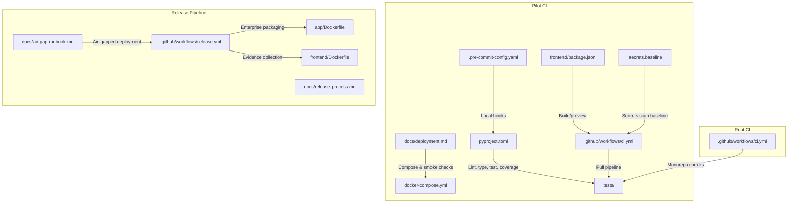

**Diagram sources**
- [.github/workflows/ci.yml:1-40](file://.github/workflows/ci.yml#L1-L40)
- [safe4ai-pilot/.github/workflows/ci.yml:1-51](file://safe4ai-pilot/.github/workflows/ci.yml#L1-L51)
- [safe4ai-pilot/.pre-commit-config.yaml:1-20](file://safe4ai-pilot/.pre-commit-config.yaml#L1-L20)
- [safe4ai-pilot/pyproject.toml:66-101](file://safe4ai-pilot/pyproject.toml#L66-L101)
- [safe4ai-pilot/docs/deployment.md:1-122](file://safe4ai-pilot/docs/deployment.md#L1-L122)
- [safe4ai-pilot/docker-compose.yml:1-87](file://safe4ai-pilot/docker-compose.yml#L1-L87)
- [safe4ai-pilot/frontend/package.json:1-32](file://safe4ai-pilot/frontend/package.json#L1-L32)
- [safe4ai-pilot/.secrets.baseline:1-82](file://safe4ai-pilot/.secrets.baseline#L1-L82)
- [.github/workflows/release.yml:1-178](file://.github/workflows/release.yml#L1-L178)
- [safe4ai-pilot/app/Dockerfile:1-23](file://safe4ai-pilot/app/Dockerfile#L1-L23)
- [safe4ai-pilot/frontend/Dockerfile:1-14](file://safe4ai-pilot/frontend/Dockerfile#L1-L14)
- [safe4ai-pilot/docs/release-process.md:1-135](file://safe4ai-pilot/docs/release-process.md#L1-L135)
- [safe4ai-pilot/docs/air-gap-runbook.md:1-130](file://safe4ai-pilot/docs/air-gap-runbook.md#L1-L130)

**Section sources**
- [.github/workflows/ci.yml:1-40](file://.github/workflows/ci.yml#L1-L40)
- [safe4ai-pilot/.github/workflows/ci.yml:1-51](file://safe4ai-pilot/.github/workflows/ci.yml#L1-L51)
- [safe4ai-pilot/.pre-commit-config.yaml:1-20](file://safe4ai-pilot/.pre-commit-config.yaml#L1-L20)
- [safe4ai-pilot/pyproject.toml:66-101](file://safe4ai-pilot/pyproject.toml#L66-L101)
- [safe4ai-pilot/docs/deployment.md:1-122](file://safe4ai-pilot/docs/deployment.md#L1-L122)
- [safe4ai-pilot/docker-compose.yml:1-87](file://safe4ai-pilot/docker-compose.yml#L1-L87)
- [safe4ai-pilot/frontend/package.json:1-32](file://safe4ai-pilot/frontend/package.json#L1-L32)
- [safe4ai-pilot/.secrets.baseline:1-82](file://safe4ai-pilot/.secrets.baseline#L1-L82)
- [.github/workflows/release.yml:1-178](file://.github/workflows/release.yml#L1-L178)
- [safe4ai-pilot/app/Dockerfile:1-23](file://safe4ai-pilot/app/Dockerfile#L1-L23)
- [safe4ai-pilot/frontend/Dockerfile:1-14](file://safe4ai-pilot/frontend/Dockerfile#L1-L14)
- [safe4ai-pilot/docs/release-process.md:1-135](file://safe4ai-pilot/docs/release-process.md#L1-L135)
- [safe4ai-pilot/docs/air-gap-runbook.md:1-130](file://safe4ai-pilot/docs/air-gap-runbook.md#L1-L130)

## Core Components
- GitHub Actions CI at root and pilot level
- GitHub Actions Release workflow for enterprise packaging
- Pre-commit hooks for formatting, linting, and secret scanning
- Pyproject configuration for linting, type checking, testing, and coverage
- Docker Compose for local orchestration and smoke checks
- Frontend build scripts for development and preview
- Backend and frontend Dockerfiles for containerized deployment
- Secret scanning baseline for detect-secrets
- Air-gapped deployment runbook for disconnected environments

**Section sources**
- [.github/workflows/ci.yml:1-40](file://.github/workflows/ci.yml#L1-L40)
- [.github/workflows/release.yml:1-178](file://.github/workflows/release.yml#L1-L178)
- [safe4ai-pilot/.github/workflows/ci.yml:1-51](file://safe4ai-pilot/.github/workflows/ci.yml#L1-L51)
- [safe4ai-pilot/.pre-commit-config.yaml:1-20](file://safe4ai-pilot/.pre-commit-config.yaml#L1-L20)
- [safe4ai-pilot/pyproject.toml:66-101](file://safe4ai-pilot/pyproject.toml#L66-L101)
- [safe4ai-pilot/docker-compose.yml:1-87](file://safe4ai-pilot/docker-compose.yml#L1-L87)
- [safe4ai-pilot/frontend/package.json:1-32](file://safe4ai-pilot/frontend/package.json#L1-L32)
- [safe4ai-pilot/.secrets.baseline:1-82](file://safe4ai-pilot/.secrets.baseline#L1-L82)
- [safe4ai-pilot/app/Dockerfile:1-23](file://safe4ai-pilot/app/Dockerfile#L1-L23)
- [safe4ai-pilot/frontend/Dockerfile:1-14](file://safe4ai-pilot/frontend/Dockerfile#L1-L14)
- [safe4ai-pilot/docs/air-gap-runbook.md:1-130](file://safe4ai-pilot/docs/air-gap-runbook.md#L1-L130)

## Architecture Overview
The CI pipeline is composed of three layers:
- Root CI: minimal checks on push and pull_request to main
- Pilot CI: comprehensive linting, formatting, type checking, tests with coverage, dependency CVE scan, and secret scanning
- Release Pipeline: enterprise-grade packaging with security evidence collection, immutable image publishing, and GitHub release creation

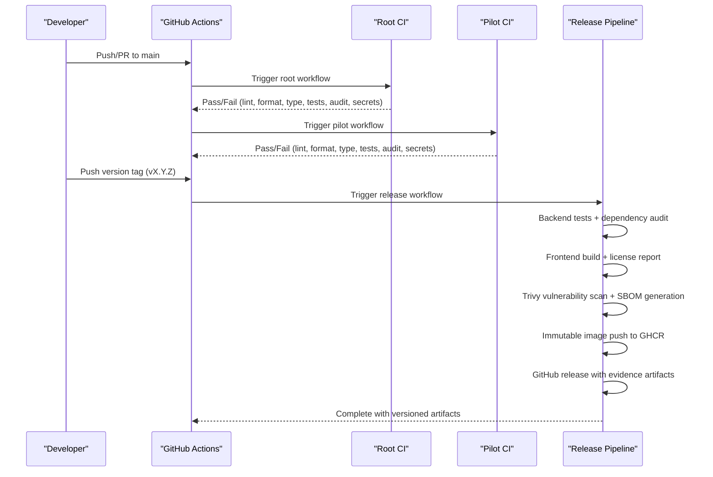

**Diagram sources**
- [.github/workflows/ci.yml:1-40](file://.github/workflows/ci.yml#L1-L40)
- [safe4ai-pilot/.github/workflows/ci.yml:1-51](file://safe4ai-pilot/.github/workflows/ci.yml#L1-L51)
- [.github/workflows/release.yml:1-178](file://.github/workflows/release.yml#L1-L178)

## Detailed Component Analysis

### Root CI Workflow
- Triggers on push and pull_request to main
- Checks out code, sets up Python 3.11 with pip caching
- Installs editable dev dependencies
- Runs ruff lint and format checks
- Runs mypy type checks
- Executes pytest with coverage XML report and minimum threshold
- Performs pip-audit CVE scan
- Runs detect-secrets scan with baseline

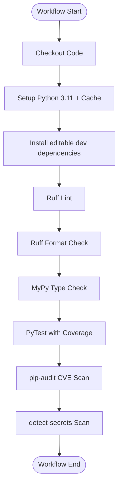

**Diagram sources**
- [.github/workflows/ci.yml:1-40](file://.github/workflows/ci.yml#L1-L40)

**Section sources**
- [.github/workflows/ci.yml:1-40](file://.github/workflows/ci.yml#L1-L40)

### Pilot CI Workflow
- Triggers on push and pull_request to main
- Checks out repository, sets up Python 3.11 with pip caching
- Installs system dependencies (libmagic, poppler-utils)
- Installs Python dependencies in editable dev mode
- Runs ruff lint and format checks
- Runs mypy type checks
- Executes pytest with coverage XML report and minimum threshold
- Performs pip-audit CVE scan with flags
- Runs detect-secrets scan with baseline

**Diagram sources**
- [safe4ai-pilot/.github/workflows/ci.yml:1-51](file://safe4ai-pilot/.github/workflows/ci.yml#L1-L51)

**Section sources**
- [safe4ai-pilot/.github/workflows/ci.yml:1-51](file://safe4ai-pilot/.github/workflows/ci.yml#L1-L51)

### Pre-commit Hooks
- Ruff: auto-fix and format checks
- detect-secrets: scans with baseline
- pre-commit-hooks: prevents adding large files

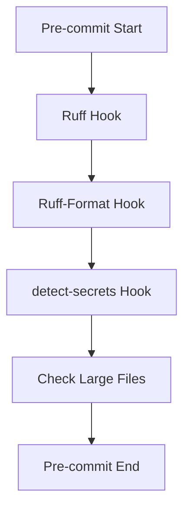

**Diagram sources**
- [safe4ai-pilot/.pre-commit-config.yaml:1-20](file://safe4ai-pilot/.pre-commit-config.yaml#L1-L20)

**Section sources**
- [safe4ai-pilot/.pre-commit-config.yaml:1-20](file://safe4ai-pilot/.pre-commit-config.yaml#L1-L20)

### Pyproject Configuration
- Linting: ruff configuration with line length, target version, selected rules, and per-file ignores
- Typing: mypy strict settings with missing imports ignored
- Testing: pytest configuration with asyncio mode, markers for integration and smoke tests, and coverage omission patterns
- Optional dev dependencies include pytest, ruff, mypy, pip-audit, detect-secrets, and testcontainers

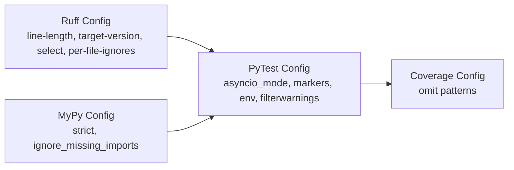

**Diagram sources**
- [safe4ai-pilot/pyproject.toml:66-101](file://safe4ai-pilot/pyproject.toml#L66-L101)

**Section sources**
- [safe4ai-pilot/pyproject.toml:66-101](file://safe4ai-pilot/pyproject.toml#L66-L101)

### Testing Automation
- Unit tests: FastAPI TestClient fixture and mock Ollama transport to avoid external services
- Integration tests: Testcontainers for PostgreSQL and Qdrant; skipped if Docker is unavailable
- Smoke tests: Real-service checks requiring docker compose stack; opt-in via environment variable
- Coverage: XML report and minimum threshold enforced in CI

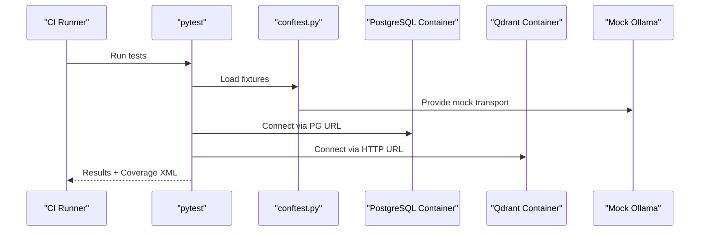

**Diagram sources**
- [safe4ai-pilot/tests/conftest.py:1-88](file://safe4ai-pilot/tests/conftest.py#L1-L88)
- [safe4ai-pilot/.github/workflows/ci.yml:43-44](file://safe4ai-pilot/.github/workflows/ci.yml#L43-L44)

**Section sources**
- [safe4ai-pilot/tests/conftest.py:1-88](file://safe4ai-pilot/tests/conftest.py#L1-L88)
- [safe4ai-pilot/docs/deployment.md:76-93](file://safe4ai-pilot/docs/deployment.md#L76-L93)
- [safe4ai-pilot/.github/workflows/ci.yml:43-44](file://safe4ai-pilot/.github/workflows/ci.yml#L43-L44)

### Deployment Automation and Environment Promotion
- Local orchestration via Docker Compose with healthchecks for all services
- Healthcheck script and curl checks for smoke testing
- Real-service smoke tests require docker compose stack and opt-in environment variable
- Full CI-style local suite includes lint, format, type, tests, and secrets scan

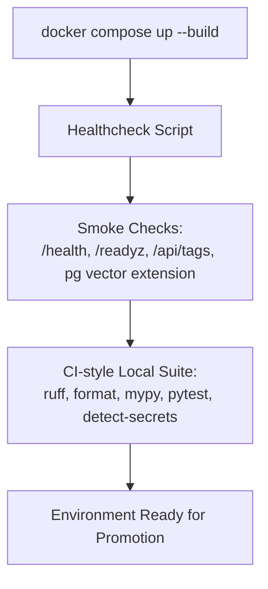

**Diagram sources**
- [safe4ai-pilot/docker-compose.yml:1-87](file://safe4ai-pilot/docker-compose.yml#L1-L87)
- [safe4ai-pilot/docs/deployment.md:29-103](file://safe4ai-pilot/docs/deployment.md#L29-L103)

**Section sources**
- [safe4ai-pilot/docker-compose.yml:1-87](file://safe4ai-pilot/docker-compose.yml#L1-L87)
- [safe4ai-pilot/docs/deployment.md:29-103](file://safe4ai-pilot/docs/deployment.md#L29-L103)

### Rollback Procedures
- Backups: PostgreSQL dump, Qdrant snapshot, filesystem copies of raw/processed data
- Deletion verification: confirm absence of document data across databases, vector store, and filesystem
- Retention aligned with audit log retention policy

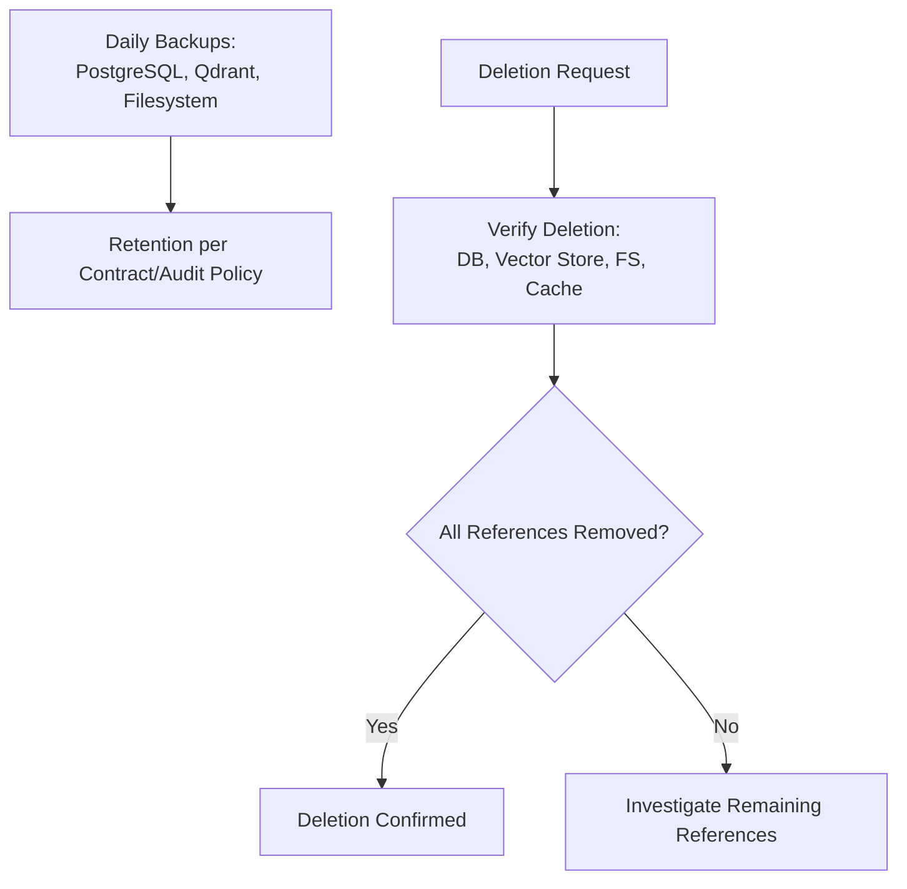

**Diagram sources**
- [safe4ai-pilot/docs/deployment.md:108-122](file://safe4ai-pilot/docs/deployment.md#L108-L122)

**Section sources**
- [safe4ai-pilot/docs/deployment.md:108-122](file://safe4ai-pilot/docs/deployment.md#L108-L122)

### Security Scanning Integration
- pip-audit: dependency vulnerability scanning
- detect-secrets: secret scanning with baseline to reduce false positives
- Baseline file enumerates detectors and thresholds

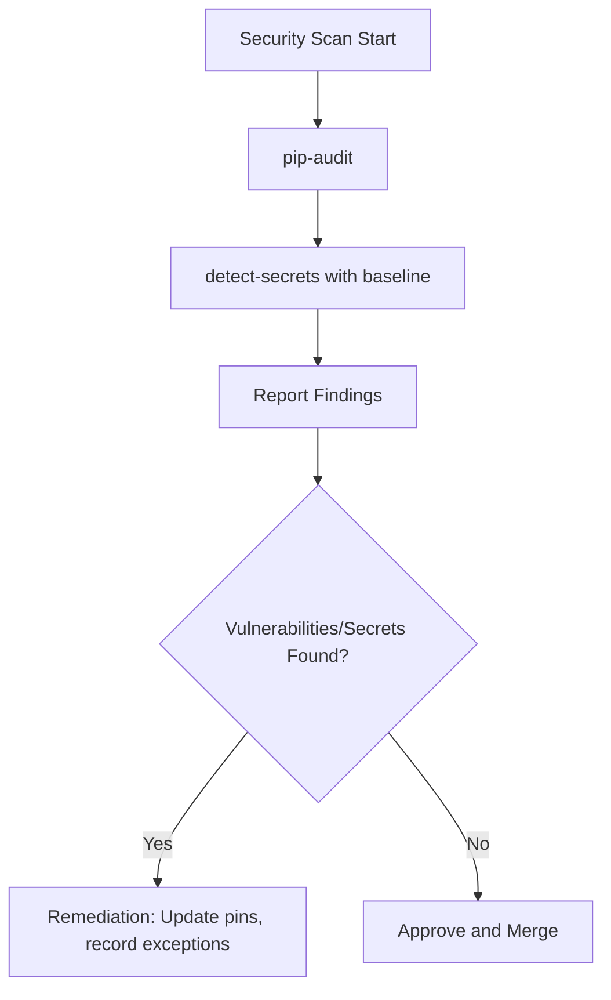

**Diagram sources**
- [safe4ai-pilot/.github/workflows/ci.yml:46-50](file://safe4ai-pilot/.github/workflows/ci.yml#L46-L50)
- [safe4ai-pilot/.secrets.baseline:1-82](file://safe4ai-pilot/.secrets.baseline#L1-L82)

**Section sources**
- [safe4ai-pilot/.github/workflows/ci.yml:46-50](file://safe4ai-pilot/.github/workflows/ci.yml#L46-L50)
- [safe4ai-pilot/.secrets.baseline:1-82](file://safe4ai-pilot/.secrets.baseline#L1-L82)

### Artifact Management and Release Workflows
- Coverage XML report generated during tests for downstream consumption
- Frontend build scripts for development and preview
- Packaging and runtime inclusion verified by dedicated tests

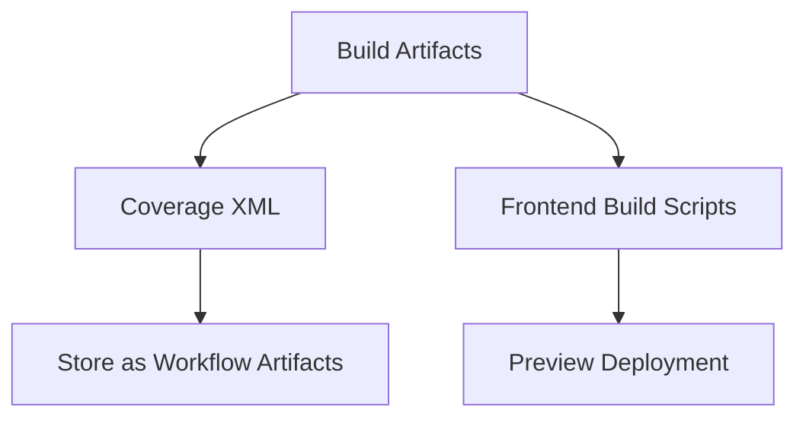

**Diagram sources**
- [safe4ai-pilot/.github/workflows/ci.yml:43-44](file://safe4ai-pilot/.github/workflows/ci.yml#L43-L44)
- [safe4ai-pilot/frontend/package.json:6-10](file://safe4ai-pilot/frontend/package.json#L6-L10)
- [safe4ai-pilot/tests/test_docker_packaging.py:1-20](file://safe4ai-pilot/tests/test_docker_packaging.py#L1-L20)

**Section sources**
- [safe4ai-pilot/.github/workflows/ci.yml:43-44](file://safe4ai-pilot/.github/workflows/ci.yml#L43-L44)
- [safe4ai-pilot/frontend/package.json:6-10](file://safe4ai-pilot/frontend/package.json#L6-L10)
- [safe4ai-pilot/tests/test_docker_packaging.py:1-20](file://safe4ai-pilot/tests/test_docker_packaging.py#L1-L20)

### Observability and Tracing Tests
- Tracer tests validate OpenTelemetry tracer creation and span behavior
- Ensures observability components are exercised under CI

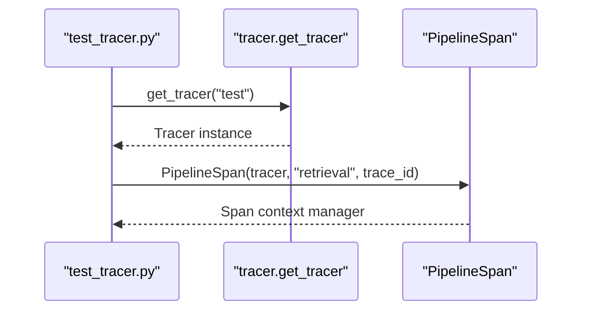

**Diagram sources**
- [safe4ai-pilot/tests/test_tracer.py:1-35](file://safe4ai-pilot/tests/test_tracer.py#L1-L35)

**Section sources**
- [safe4ai-pilot/tests/test_tracer.py:1-35](file://safe4ai-pilot/tests/test_tracer.py#L1-L35)

## Release Pipeline

### Overview
The Release pipeline is a comprehensive enterprise-grade workflow triggered by version tags (vX.Y.Z). It performs backend testing, frontend build, security scanning, SBOM generation, and publishes immutable images to GHCR with associated evidence artifacts for enterprise security review.

### Trigger Configuration
- **Trigger**: Version tags matching pattern `v*.*.*`
- **Permissions**: Write access to contents and packages
- **Environment Variables**: 
  - `BACKEND_IMAGE`: ghcr.io/${{ github.repository }}/safe4ai-backend
  - `FRONTEND_IMAGE`: ghcr.io/${{ github.repository }}/safe4ai-frontend

### Pipeline Architecture
The release pipeline consists of two main jobs orchestrated in sequence:

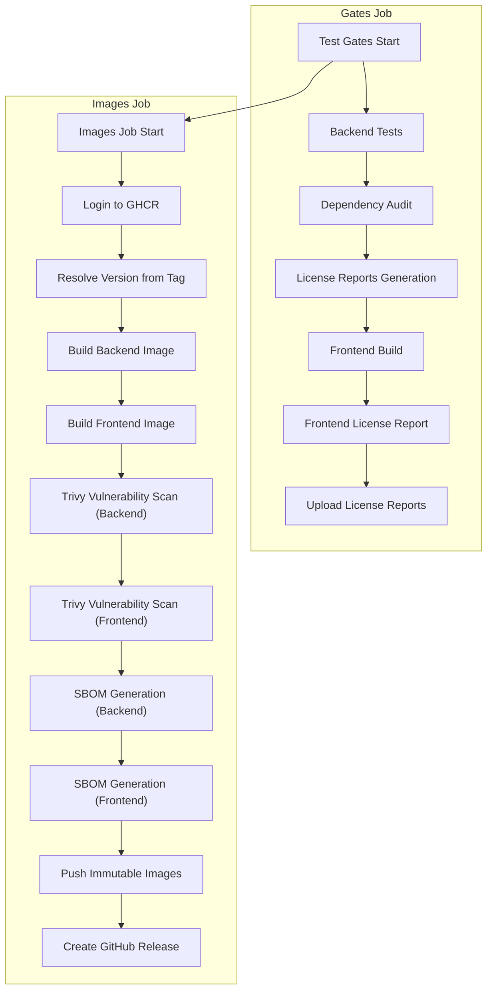

**Diagram sources**
- [.github/workflows/release.yml:22-178](file://.github/workflows/release.yml#L22-L178)

### Gates Job (Test Gates)
The gates job validates the release candidate through comprehensive testing and evidence collection:

#### Backend Tests
- Executes pytest suite from `safe4ai-pilot/tests/`
- Uses quiet output format for cleaner logs
- Requires all backend tests to pass before proceeding

#### Dependency Audit
- Runs `pip-audit --skip-editable --desc` to scan for vulnerabilities
- Skips editable installations to focus on installed packages
- Provides descriptive output for better visibility

#### License Reports Generation
**Backend License Report**:
- Installs `pip-licenses` package
- Generates Markdown report with URLs for all dependencies
- Output saved as `safe4ai-pilot/license-report-backend.md`

**Frontend License Report**:
- Uses `license-checker` npm package
- Generates production dependency report in Markdown format
- Output saved as `safe4ai-pilot/license-report-frontend.md`

#### Frontend Build
- Sets up Node.js 20 environment
- Installs dependencies using `npm ci` for deterministic builds
- Executes `npm run build` for production-ready frontend assets

#### Artifact Upload
- Uploads both license reports as workflow artifacts
- Named `license-reports` for easy retrieval
- Available for downstream jobs and manual inspection

**Section sources**
- [.github/workflows/release.yml:22-79](file://.github/workflows/release.yml#L22-L79)

### Images Job (Build, Scan, Publish)
The images job handles container image creation, security validation, and distribution:

#### Authentication and Version Resolution
- Logs into GHCR using GitHub Actions token
- Extracts version number from GITHUB_REF_NAME (removing 'v' prefix)
- Creates immutable version tags following semantic versioning

#### Backend Image Building
**Base Image**: `python:3.11-slim`
**System Dependencies**: `poppler-utils`, `libmagic1`, `curl`
**Application Layer**: Copies `pyproject.toml`, `app/`, `observability/`, `scripts/`
**Installation**: Installs PyTorch CPU version and editable package
**Pre-baking**: Downloads cross-encoder model for air-gapped deployments
**Command**: `uvicorn app.main:app --host 0.0.0.0 --port 8000`

#### Frontend Image Building
**Multi-stage Build**: Node.js Alpine base for build stage
**Production Build**: Optimized React application build
**Runtime Stage**: Nginx Alpine serving static assets
**Configuration**: Uses custom nginx.conf for security hardening
**Expose**: Port 80 for web traffic

#### Security Scanning
**Trivy Integration**: Aqua Security action for vulnerability scanning
**Severity Threshold**: CRITICAL, HIGH only (lower severities ignored)
**Output Format**: SARIF for standardized vulnerability reporting
**Backend Scan**: `trivy-backend.sarif` artifact
**Frontend Scan**: `trivy-frontend.sarif` artifact

#### SBOM Generation
**SPDX JSON Format**: Software Package Data Exchange for standardized SBOM
**Backend SBOM**: `sbom-backend.spdx.json` artifact
**Frontend SBOM**: `sbom-frontend.spdx.json` artifact
**Action**: Anchore SBOM action with automatic artifact upload disabled

#### Image Publishing
- Pushes both backend and frontend images with version tags only
- No `latest` tag published to maintain immutability
- Images stored in GHCR under repository namespace
- Version labels applied for OCI compatibility

#### Evidence Artifact Creation
- Creates GitHub release with generated artifacts
- Includes SBOM files, vulnerability scan reports, and license reports
- Automatic release notes generation
- Comprehensive evidence package for enterprise security review

**Section sources**
- [.github/workflows/release.yml:80-178](file://.github/workflows/release.yml#L80-L178)
- [safe4ai-pilot/app/Dockerfile:1-23](file://safe4ai-pilot/app/Dockerfile#L1-L23)
- [safe4ai-pilot/frontend/Dockerfile:1-14](file://safe4ai-pilot/frontend/Dockerfile#L1-L14)

### Enterprise Packaging Decisions
The release process follows documented packaging decisions:

#### Delivery Targets
- **Evaluation/Pilot**: Docker Compose package with versioned images
- **Locked-down environments**: Air-gapped image/model bundle (`docs/air-gap-runbook.md`)
- **Enterprise**: Kubernetes/Helm chart (future roadmap item)

#### Closed-runtime Boundary
**Safe4AI-owned (shipped as images)**:
- Agent orchestration, prompt registry, retrieval pipeline
- Guardrails/output filters, evaluation logic
- Deployment automation, admin/UI workflows

**Customer-owned (remains in customer environment)**:
- Uploaded documents and raw files
- PostgreSQL, Qdrant, user roles
- Audit logs, feedback, local model runtime

#### Security Evidence Inventory
Enterprise security review receives automated artifacts:
- SBOM (SPDX) for both images
- Vulnerability scan reports (Trivy SARIF)
- Dependency/license reports
- Architecture and security documentation

**Section sources**
- [safe4ai-pilot/docs/release-process.md:1-135](file://safe4ai-pilot/docs/release-process.md#L1-L135)

### Air-gapped Deployment Support
The release pipeline includes comprehensive support for air-gapped environments:

#### Image Bundle Creation
- Docker Compose stack with Ollama overlay for offline model provisioning
- Pre-baked cross-encoder model to avoid runtime downloads
- Static package verifier ensures all required components are included

#### Model Management
- Required Ollama models: `qwen3.5:9b`, `nomic-embed-text`, `qwen2.5vl:7b`
- Volume-based model persistence for offline environments
- Model warm-up during build process

#### Deployment Verification
- Healthcheck endpoints for all services
- No-outbound connectivity verification
- Audit archive mounting for compliance requirements

**Section sources**
- [safe4ai-pilot/docs/air-gap-runbook.md:1-130](file://safe4ai-pilot/docs/air-gap-runbook.md#L1-L130)
- [safe4ai-pilot/docker-compose.yml:1-87](file://safe4ai-pilot/docker-compose.yml#L1-L87)
- [safe4ai-pilot/app/Dockerfile:19-20](file://safe4ai-pilot/app/Dockerfile#L19-L20)

## Dependency Analysis
- Root CI depends on editable dev installation and standard Python tooling
- Pilot CI adds system dependencies and comprehensive dev tooling
- Release pipeline extends pilot with security scanning and containerization
- Pre-commit hooks depend on ruff, detect-secrets, and pre-commit-hooks repos
- Pyproject defines lint, type, test, and coverage policies consistently across environments

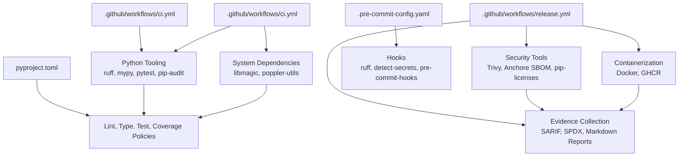

**Diagram sources**
- [.github/workflows/ci.yml:1-40](file://.github/workflows/ci.yml#L1-L40)
- [safe4ai-pilot/.github/workflows/ci.yml:1-51](file://safe4ai-pilot/.github/workflows/ci.yml#L1-L51)
- [.github/workflows/release.yml:1-178](file://.github/workflows/release.yml#L1-L178)
- [safe4ai-pilot/.pre-commit-config.yaml:1-20](file://safe4ai-pilot/.pre-commit-config.yaml#L1-L20)
- [safe4ai-pilot/pyproject.toml:66-101](file://safe4ai-pilot/pyproject.toml#L66-L101)

**Section sources**
- [.github/workflows/ci.yml:1-40](file://.github/workflows/ci.yml#L1-L40)
- [safe4ai-pilot/.github/workflows/ci.yml:1-51](file://safe4ai-pilot/.github/workflows/ci.yml#L1-L51)
- [.github/workflows/release.yml:1-178](file://.github/workflows/release.yml#L1-L178)
- [safe4ai-pilot/.pre-commit-config.yaml:1-20](file://safe4ai-pilot/.pre-commit-config.yaml#L1-L20)
- [safe4ai-pilot/pyproject.toml:66-101](file://safe4ai-pilot/pyproject.toml#L66-L101)

## Performance Considerations
- Python version pinning and pip caching in CI to speed up installs
- Coverage fail-under threshold to maintain quality while enabling faster runs
- System dependency installation in pilot CI to avoid repeated setup overhead
- Pre-commit hooks to catch issues early and reduce CI failures
- Docker layer caching in release pipeline for faster image builds
- Parallel execution of gates and images jobs for improved throughput
- Immutable tagging strategy to prevent unnecessary re-downloads
- Artifact caching for license reports and build outputs

## Troubleshooting Guide
- Coverage failures: adjust thresholds or fix tests to meet minimum coverage
- Secret detection: update baseline or remediate detected secrets
- Dependency vulnerabilities: update pins or record time-limited exceptions
- Integration tests failing: ensure Docker is available or mark tests accordingly
- Smoke tests timing out: verify docker compose stack is healthy and services are ready
- Release pipeline failures: check Trivy scan results, SBOM generation, and image push permissions
- Version tag issues: ensure proper semantic versioning format (vX.Y.Z)
- GHCR authentication: verify GITHUB_TOKEN permissions for package write access
- License report generation: ensure both backend and frontend license-checker commands succeed
- Air-gapped deployment failures: verify all required images are exported and models are warmed
- Model availability: confirm Ollama models are present in the air-gapped environment

**Section sources**
- [safe4ai-pilot/.github/workflows/ci.yml:34-50](file://safe4ai-pilot/.github/workflows/ci.yml#L34-L50)
- [safe4ai-pilot/docs/deployment.md:76-93](file://safe4ai-pilot/docs/deployment.md#L76-L93)
- [safe4ai-pilot/tests/conftest.py:64-87](file://safe4ai-pilot/tests/conftest.py#L64-L87)
- [.github/workflows/release.yml:1-178](file://.github/workflows/release.yml#L1-L178)
- [safe4ai-pilot/docs/air-gap-runbook.md:1-130](file://safe4ai-pilot/docs/air-gap-runbook.md#L1-L130)

## Conclusion
The CI/CD pipeline combines a minimal root workflow, comprehensive pilot workflow, and enterprise-grade release pipeline to enforce code quality, security, and reliability. The new Release pipeline provides closed-runtime packaging with comprehensive security evidence collection, immutable image publishing, and enterprise-ready artifact generation. Pre-commit hooks ensure local consistency, while CI jobs provide robust linting, type checking, testing, and security scanning. Docker Compose supports local and CI-friendly orchestration, and documented smoke checks and backups enable safe environment promotion and rollback. The air-gapped deployment support ensures secure delivery to disconnected environments, while the closed-runtime boundary clarifies ownership of components between Safe4AI and customers.

## Appendices
- Practical examples:
  - Root CI trigger configuration for push and pull_request to main
  - Pilot CI steps for system dependencies, lint, format, type, tests, audit, and secrets
  - Release pipeline trigger configuration for version tags
  - Gates job steps for backend tests, dependency audit, license reports, and frontend build
  - Images job steps for containerization, security scanning, SBOM generation, and image publishing
  - Pre-commit hook configuration for ruff and detect-secrets
  - Pyproject lint, type, test, and coverage settings
  - Docker Compose services and healthchecks
  - Frontend build scripts for development and preview
  - Backend and frontend Dockerfile configurations
  - Secret scanning baseline file
  - Test fixtures for unit and integration tests
  - Packaging and runtime inclusion tests
  - Release process documentation and enterprise packaging decisions
  - Air-gapped deployment runbook and model management procedures

**Section sources**
- [.github/workflows/ci.yml:1-40](file://.github/workflows/ci.yml#L1-L40)
- [safe4ai-pilot/.github/workflows/ci.yml:1-51](file://safe4ai-pilot/.github/workflows/ci.yml#L1-L51)
- [.github/workflows/release.yml:1-178](file://.github/workflows/release.yml#L1-L178)
- [safe4ai-pilot/.pre-commit-config.yaml:1-20](file://safe4ai-pilot/.pre-commit-config.yaml#L1-L20)
- [safe4ai-pilot/pyproject.toml:66-101](file://safe4ai-pilot/pyproject.toml#L66-L101)
- [safe4ai-pilot/docker-compose.yml:1-87](file://safe4ai-pilot/docker-compose.yml#L1-L87)
- [safe4ai-pilot/frontend/package.json:6-10](file://safe4ai-pilot/frontend/package.json#L6-L10)
- [safe4ai-pilot/.secrets.baseline:1-82](file://safe4ai-pilot/.secrets.baseline#L1-L82)
- [safe4ai-pilot/tests/conftest.py:1-88](file://safe4ai-pilot/tests/conftest.py#L1-L88)
- [safe4ai-pilot/tests/test_docker_packaging.py:1-20](file://safe4ai-pilot/tests/test_docker_packaging.py#L1-L20)
- [safe4ai-pilot/app/Dockerfile:1-23](file://safe4ai-pilot/app/Dockerfile#L1-L23)
- [safe4ai-pilot/frontend/Dockerfile:1-14](file://safe4ai-pilot/frontend/Dockerfile#L1-L14)
- [safe4ai-pilot/docs/release-process.md:1-135](file://safe4ai-pilot/docs/release-process.md#L1-L135)
- [safe4ai-pilot/docs/air-gap-runbook.md:1-130](file://safe4ai-pilot/docs/air-gap-runbook.md#L1-L130)