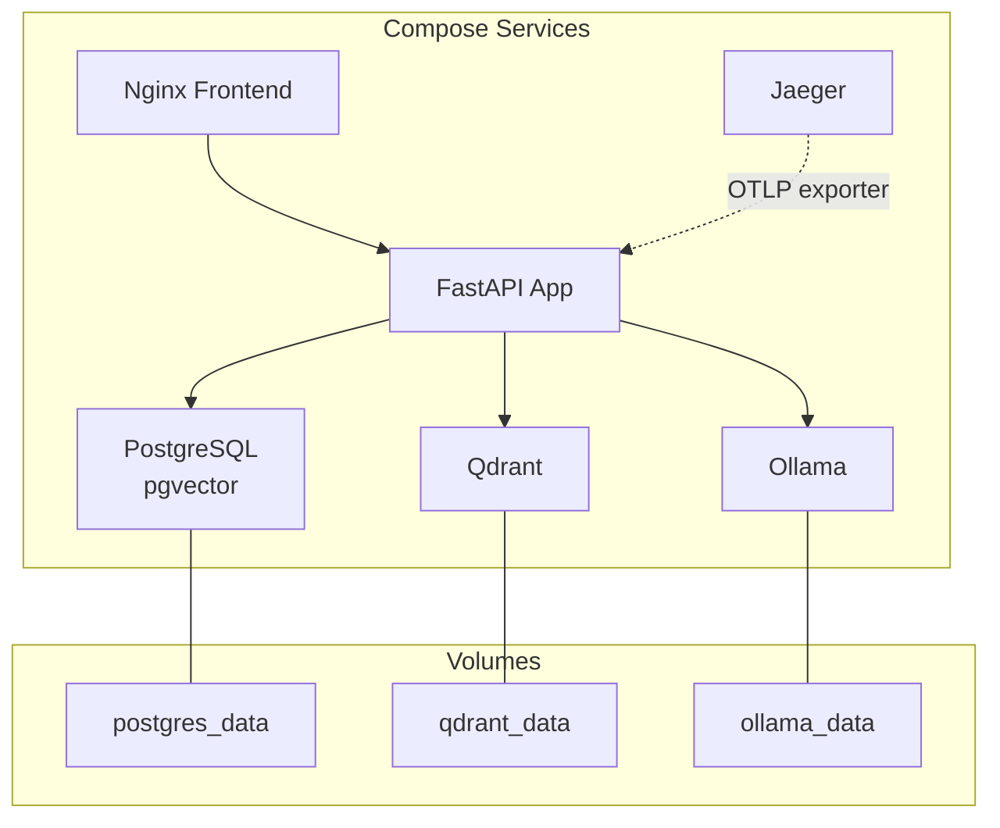
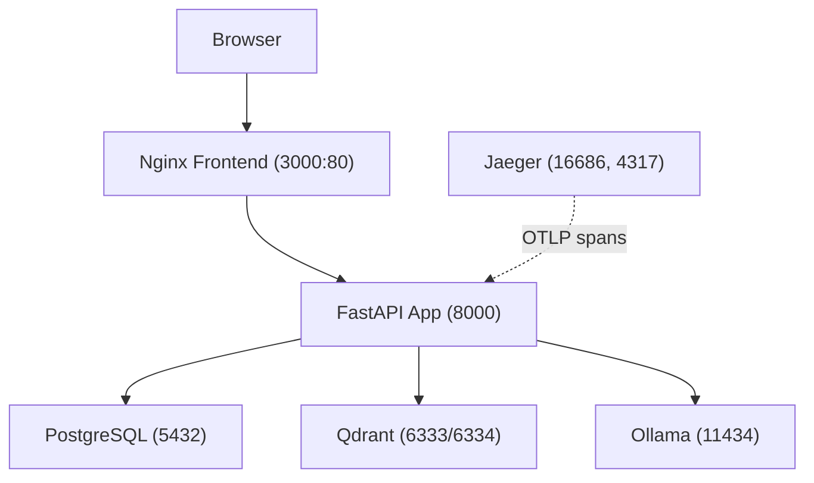
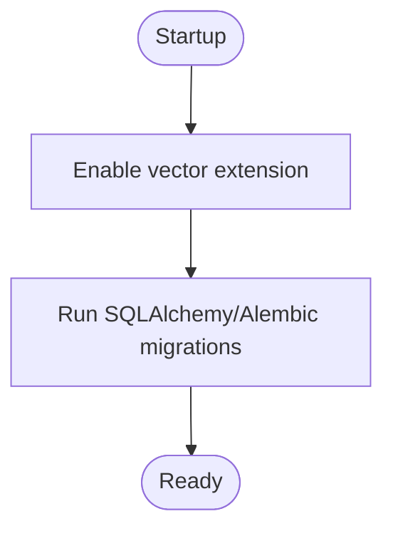
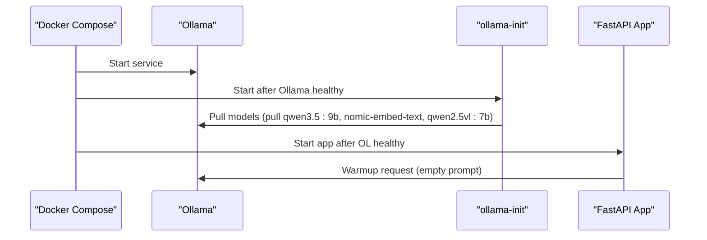
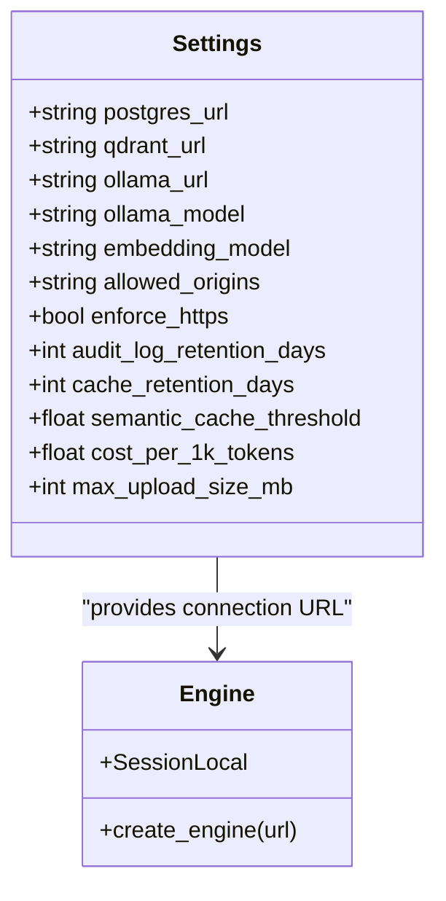
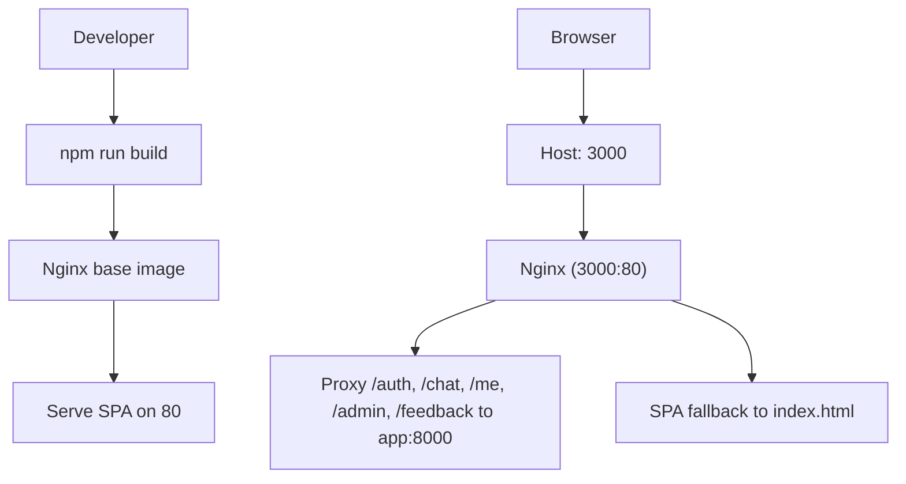
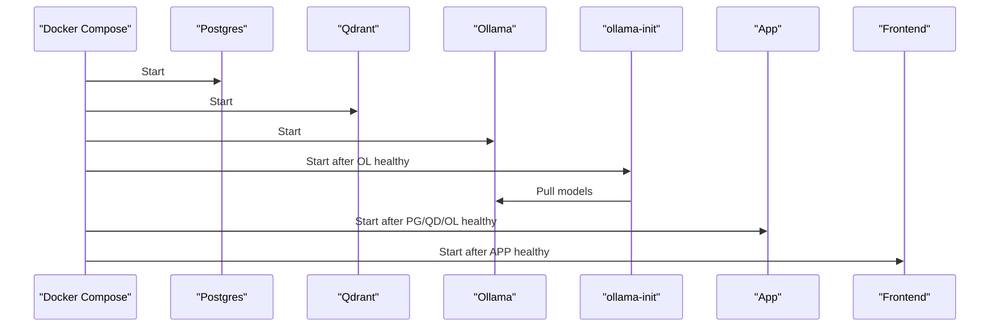

# Container Orchestration

<cite>
**Referenced Files in This Document**
- [docker-compose.yml](file://safe4ai-pilot/docker-compose.yml)
- [docker-compose.override.yml](file://safe4ai-pilot/docker-compose.override.yml)
- [Dockerfile (backend)](file://safe4ai-pilot/app/Dockerfile)
- [Dockerfile (frontend)](file://safe4ai-pilot/frontend/Dockerfile)
- [nginx.conf](file://safe4ai-pilot/frontend/nginx.conf)
- [main.py](file://safe4ai-pilot/app/main.py)
- [config.py](file://safe4ai-pilot/app/config.py)
- [db/__init__.py](file://safe4ai-pilot/app/db/__init__.py)
- [alembic.ini](file://safe4ai-pilot/alembic.ini)
- [tracer.py](file://safe4ai-pilot/observability/tracer.py)
- [healthcheck.py](file://safe4ai-pilot/scripts/healthcheck.py)
- [pyproject.toml](file://safe4ai-pilot/pyproject.toml)
</cite>

## Table of Contents
1. [Introduction](#introduction)
2. [Project Structure](#project-structure)
3. [Core Components](#core-components)
4. [Architecture Overview](#architecture-overview)
5. [Detailed Component Analysis](#detailed-component-analysis)
6. [Dependency Analysis](#dependency-analysis)
7. [Performance Considerations](#performance-considerations)
8. [Troubleshooting Guide](#troubleshooting-guide)
9. [Conclusion](#conclusion)
10. [Appendices](#appendices)

## Introduction
This document explains the container orchestration of the Private AI system using Docker Compose. It covers the deployment of PostgreSQL with pgvector, Qdrant vector database, Ollama LLM service, Jaeger observability, a FastAPI backend, and a React-based frontend served via Nginx. The guide details service dependencies, health checks, port mappings, volumes, networking, inter-service communication, data persistence, startup ordering, environment and secrets handling, build configurations, and operational guidance for scaling and performance.

## Project Structure
The orchestration is defined by two primary Compose files:
- Primary orchestration: [docker-compose.yml](file://safe4ai-pilot/docker-compose.yml)
- Development overrides: [docker-compose.override.yml](file://safe4ai-pilot/docker-compose.override.yml)

Build artifacts:
- Backend container: [Dockerfile (backend)](file://safe4ai-pilot/app/Dockerfile)
- Frontend container: [Dockerfile (frontend)](file://safe4ai-pilot/frontend/Dockerfile)
- Frontend reverse proxy: [nginx.conf](file://safe4ai-pilot/frontend/nginx.conf)

Runtime configuration:
- Application settings: [config.py](file://safe4ai-pilot/app/config.py)
- Database engine and session: [db/__init__.py](file://safe4ai-pilot/app/db/__init__.py)
- Health endpoint and pre-warming: [main.py](file://safe4ai-pilot/app/main.py)
- Observability tracing: [tracer.py](file://safe4ai-pilot/observability/tracer.py)
- CLI health checker: [healthcheck.py](file://safe4ai-pilot/scripts/healthcheck.py)
- Dependencies and dev tooling: [pyproject.toml](file://safe4ai-pilot/pyproject.toml)

**Diagram sources**
- [docker-compose.yml:1-119](file://safe4ai-pilot/docker-compose.yml#L1-L119)
- [frontend/nginx.conf:1-29](file://safe4ai-pilot/frontend/nginx.conf#L1-L29)

**Section sources**
- [docker-compose.yml:1-119](file://safe4ai-pilot/docker-compose.yml#L1-L119)
- [docker-compose.override.yml:1-11](file://safe4ai-pilot/docker-compose.override.yml#L1-L11)

## Core Components
- PostgreSQL with pgvector extension for vector similarity:
  - Image: pgvector/pgvector:0.8.0-pg16
  - Ports: 5432
  - Volume: postgres_data
  - Health check: pg_isready
- Qdrant vector database:
  - Image: qdrant/qdrant:v1.13.3
  - Ports: 6333, 6334
  - Volume: qdrant_data
  - Health check: TCP connectivity to 6333
- Ollama LLM service:
  - Image: ollama/ollama:latest
  - Ports: 11434
  - Volume: ollama_data
  - Environment: OLLAMA_KEEP_ALIVE
  - Health check: ollama list
  - Initialization job pulls models after Ollama is healthy
- Jaeger observability:
  - Image: jaegertracing/all-in-one:latest
  - Ports: 16686 (UI), 4317 (OTLP gRPC)
  - Environment: COLLECTOR_OTLP_ENABLED
  - Health check: HTTP GET to UI
- FastAPI backend:
  - Build: app/Dockerfile
  - Ports: 8000
  - Depends on: postgres, qdrant, ollama (healthy)
  - Volumes: data mounts for raw, processed, index_config
  - Health check: GET /health
  - Environment: POSTGRES_URL, QDRANT_URL, OLLAMA_URL
- React frontend:
  - Build: frontend/Dockerfile (multi-stage)
  - Ports: 3000:80 (Nginx)
  - Depends on: app (healthy)
  - Reverse proxy: nginx.conf routes API to backend

**Section sources**
- [docker-compose.yml:1-119](file://safe4ai-pilot/docker-compose.yml#L1-L119)
- [docker-compose.override.yml:1-11](file://safe4ai-pilot/docker-compose.override.yml#L1-L11)
- [frontend/nginx.conf:1-29](file://safe4ai-pilot/frontend/nginx.conf#L1-L29)

## Architecture Overview
The system uses Docker Compose to define a local development and deployment topology. Services communicate over the default bridge network using service names as hostnames. The frontend proxies API routes to the backend, while the backend integrates with PostgreSQL (pgvector), Qdrant, and Ollama.

**Diagram sources**
- [docker-compose.yml:1-119](file://safe4ai-pilot/docker-compose.yml#L1-L119)
- [frontend/nginx.conf:1-29](file://safe4ai-pilot/frontend/nginx.conf#L1-L29)

## Detailed Component Analysis

### PostgreSQL with pgvector
- Purpose: Relational storage with vector extension for embeddings metadata and auxiliary data.
- Health: Uses pg_isready to confirm service readiness.
- Persistence: Named volume postgres_data mapped to PostgreSQL’s data directory.
- Extension: The backend lifecycle ensures the vector extension is enabled before use.

**Diagram sources**
- [main.py:35-37](file://safe4ai-pilot/app/main.py#L35-L37)
- [alembic.ini:1-150](file://safe4ai-pilot/alembic.ini#L1-L150)

**Section sources**
- [docker-compose.yml:2-16](file://safe4ai-pilot/docker-compose.yml#L2-L16)
- [main.py:35-37](file://safe4ai-pilot/app/main.py#L35-L37)
- [db/__init__.py:1-22](file://safe4ai-pilot/app/db/__init__.py#L1-L22)
- [alembic.ini:1-150](file://safe4ai-pilot/alembic.ini#L1-L150)

### Qdrant Vector Database
- Purpose: Vector index for retrieval augmented generation (RAG).
- Health: TCP probe on 6333; backend also checks /readyz.
- Persistence: Named volume qdrant_data for storage.

**Section sources**
- [docker-compose.yml:18-29](file://safe4ai-pilot/docker-compose.yml#L18-L29)
- [main.py:130-136](file://safe4ai-pilot/app/main.py#L130-L136)

### Ollama LLM Service
- Purpose: Local LLM inference for embeddings and generation.
- Health: Verifies availability via ollama list.
- Initialization: A one-shot init job pulls required models after Ollama is healthy.
- Persistence: Named volume ollama_data stores models and cache.

**Diagram sources**
- [docker-compose.yml:31-60](file://safe4ai-pilot/docker-compose.yml#L31-L60)
- [main.py:104-116](file://safe4ai-pilot/app/main.py#L104-L116)

**Section sources**
- [docker-compose.yml:31-60](file://safe4ai-pilot/docker-compose.yml#L31-L60)
- [main.py:104-116](file://safe4ai-pilot/app/main.py#L104-L116)

### Jaeger Observability
- Purpose: Centralized tracing via OTLP.
- Ports: 16686 (UI), 4317 (OTLP gRPC).
- Exporter: Backend initializes OpenTelemetry exporter pointing to Jaeger.

**Section sources**
- [docker-compose.yml:62-74](file://safe4ai-pilot/docker-compose.yml#L62-L74)
- [tracer.py:1-75](file://safe4ai-pilot/observability/tracer.py#L1-L75)

### FastAPI Backend
- Build: Python 3.11 slim with system deps and pip installs; builds project in editable mode.
- Entrypoint: Uvicorn on 0.0.0.0:8000.
- Environment:
  - POSTGRES_URL, QDRANT_URL, OLLAMA_URL configured in Compose.
  - Settings class loads from .env via env_file and defaults.
- Lifecycle:
  - Ensures vector extension and runs migrations.
  - Builds shared components (HybridRetriever, Reranker, LangGraph) once.
  - Prewarms Ollama to reduce first-query latency.
- Health endpoint: Aggregates checks for Postgres, Qdrant, and Ollama.

**Diagram sources**
- [config.py:1-28](file://safe4ai-pilot/app/config.py#L1-L28)
- [db/__init__.py:1-22](file://safe4ai-pilot/app/db/__init__.py#L1-L22)

**Section sources**
- [docker-compose.yml:75-103](file://safe4ai-pilot/docker-compose.yml#L75-L103)
- [docker-compose.override.yml:1-11](file://safe4ai-pilot/docker-compose.override.yml#L1-L11)
- [app/Dockerfile:1-23](file://safe4ai-pilot/app/Dockerfile#L1-L23)
- [config.py:1-28](file://safe4ai-pilot/app/config.py#L1-L28)
- [db/__init__.py:1-22](file://safe4ai-pilot/app/db/__init__.py#L1-L22)
- [main.py:1-154](file://safe4ai-pilot/app/main.py#L1-L154)

### React Frontend (Nginx)
- Build: Multi-stage build with Node and Nginx.
- Runtime: Nginx serves built assets; proxies API routes to backend.
- Port mapping: 3000:80 exposed to host.

**Diagram sources**
- [frontend/Dockerfile:1-14](file://safe4ai-pilot/frontend/Dockerfile#L1-L14)
- [frontend/nginx.conf:1-29](file://safe4ai-pilot/frontend/nginx.conf#L1-L29)

**Section sources**
- [docker-compose.yml:105-114](file://safe4ai-pilot/docker-compose.yml#L105-L114)
- [frontend/Dockerfile:1-14](file://safe4ai-pilot/frontend/Dockerfile#L1-L14)
- [frontend/nginx.conf:1-29](file://safe4ai-pilot/frontend/nginx.conf#L1-L29)

## Dependency Analysis
- Startup order:
  - postgres, qdrant, ollama start concurrently.
  - ollama-init waits for ollama healthy, then pulls models.
  - app starts after postgres, qdrant, and ollama are healthy.
  - frontend starts after app is healthy.
- Inter-service communication:
  - Backend connects to postgres via POSTGRES_URL.
  - Backend queries Qdrant at QDRANT_URL.
  - Backend calls Ollama at OLLAMA_URL.
  - Frontend proxies API to app:8000.
- Health checks:
  - PostgreSQL: pg_isready.
  - Qdrant: TCP probe and /readyz.
  - Ollama: ollama list.
  - Jaeger: UI HTTP reachability.
  - App: GET /health.

**Diagram sources**
- [docker-compose.yml:1-119](file://safe4ai-pilot/docker-compose.yml#L1-L119)

**Section sources**
- [docker-compose.yml:1-119](file://safe4ai-pilot/docker-compose.yml#L1-L119)

## Performance Considerations
- Model warm-up:
  - The backend prewarms Ollama to avoid cold-start latency on first query.
- Resource allocation:
  - Assign CPU/memory limits per service in Compose for predictable performance.
  - Scale backend replicas behind a load balancer; ensure stateless sessions and shared DB.
- Storage:
  - Persist volumes for PostgreSQL, Qdrant, and Ollama to prevent data loss and speed rebuilds.
- Network:
  - Keep inter-service traffic internal; avoid exposing unnecessary ports to host.
- Observability:
  - Enable Jaeger OTLP exporter; monitor traces and metrics for bottlenecks.
- Caching:
  - Reuse initialized components (HybridRetriever, Reranker, LangGraph) in app lifespan to reduce overhead.

[No sources needed since this section provides general guidance]

## Troubleshooting Guide
- Health checks:
  - Use the backend’s /health endpoint to verify Postgres, Qdrant, and Ollama.
  - Run the CLI health checker for a quick triage.
- Connectivity:
  - Confirm service names resolve inside the Compose network.
  - Verify environment variables for POSTGRES_URL, QDRANT_URL, OLLAMA_URL.
- Logs:
  - Inspect container logs for startup errors and stack traces.
- Data:
  - If migrations fail, ensure the vector extension is enabled and migrations are applied.
- Frontend:
  - Check Nginx proxy rules and proxy headers for API routes.

**Section sources**
- [main.py:118-147](file://safe4ai-pilot/app/main.py#L118-L147)
- [healthcheck.py:1-58](file://safe4ai-pilot/scripts/healthcheck.py#L1-L58)
- [docker-compose.yml:1-119](file://safe4ai-pilot/docker-compose.yml#L1-L119)

## Conclusion
The Private AI system orchestrates a cohesive RAG pipeline across PostgreSQL with pgvector, Qdrant, Ollama, and a FastAPI backend, with a React frontend served via Nginx. Compose manages service dependencies, health checks, and persistence. The backend centralizes integrations and lifecycle initialization, while Jaeger enables observability. Following the guidance here supports reliable startup, scaling, and performance tuning.

[No sources needed since this section summarizes without analyzing specific files]

## Appendices

### Environment Variables and Secrets
- Backend settings are loaded from .env via Pydantic Settings and used to configure database connections, external service URLs, and runtime behavior.
- Secrets handling:
  - Store sensitive values in .env and mount it into the backend container.
  - Avoid committing secrets; keep .env out of version control.

**Section sources**
- [config.py:1-28](file://safe4ai-pilot/app/config.py#L1-L28)
- [docker-compose.yml:81-86](file://safe4ai-pilot/docker-compose.yml#L81-L86)

### Build Configurations
- Backend:
  - Installs system dependencies, installs project in editable mode, and pre-bakes a cross-encoder model for offline deployments.
- Frontend:
  - Multi-stage build: Node build followed by Nginx serving static assets.

**Section sources**
- [app/Dockerfile:1-23](file://safe4ai-pilot/app/Dockerfile#L1-L23)
- [frontend/Dockerfile:1-14](file://safe4ai-pilot/frontend/Dockerfile#L1-L14)

### Data Persistence Strategies
- Named volumes:
  - postgres_data, qdrant_data, ollama_data persist across container recreation.
- Application data:
  - Mount ./data/raw, ./data/processed, ./data/index_config into the backend for iterative development and data sharing.

**Section sources**
- [docker-compose.yml:10-11](file://safe4ai-pilot/docker-compose.yml#L10-L11)
- [docker-compose.yml:23-24](file://safe4ai-pilot/docker-compose.yml#L23-L24)
- [docker-compose.yml:35-36](file://safe4ai-pilot/docker-compose.yml#L35-L36)
- [docker-compose.yml:94-97](file://safe4ai-pilot/docker-compose.yml#L94-L97)

### Scaling and Resource Allocation
- Stateless backend:
  - Scale Uvicorn workers behind a reverse proxy; ensure shared database and vector storage.
- GPU acceleration:
  - If using GPU-enabled Ollama images, allocate GPU resources accordingly.
- Horizontal scaling:
  - Use a reverse proxy or ingress in front of multiple backend instances; maintain sticky sessions if required by auth.

[No sources needed since this section provides general guidance]