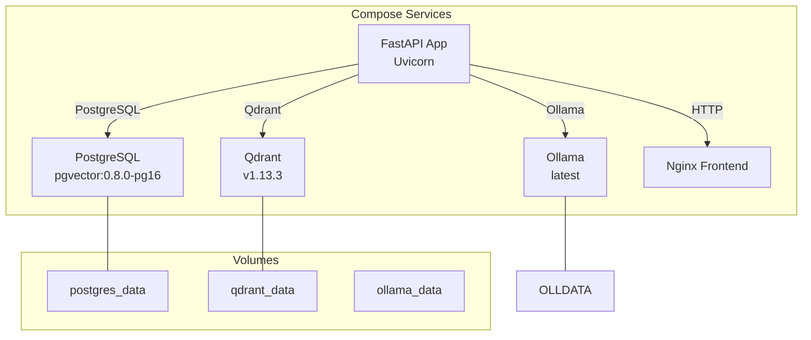
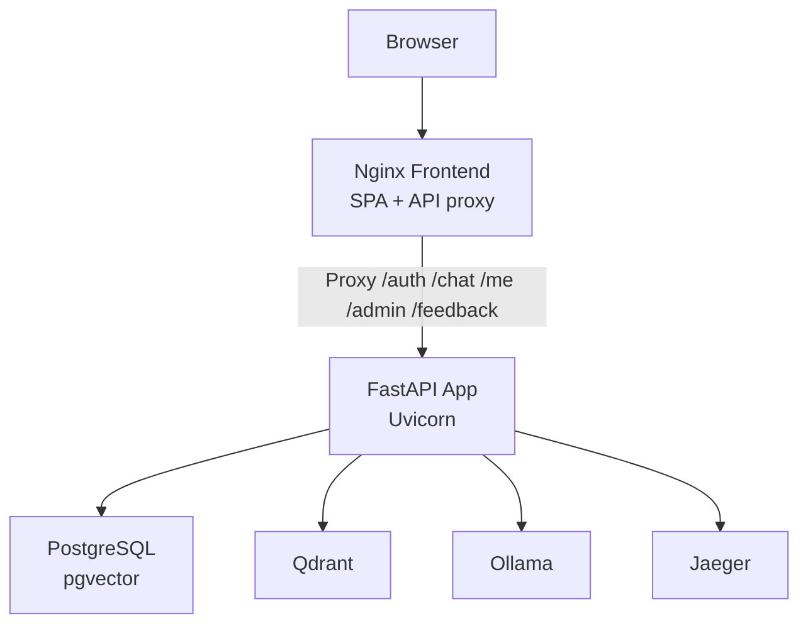
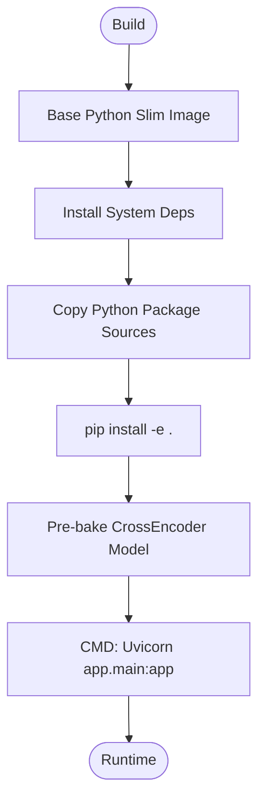
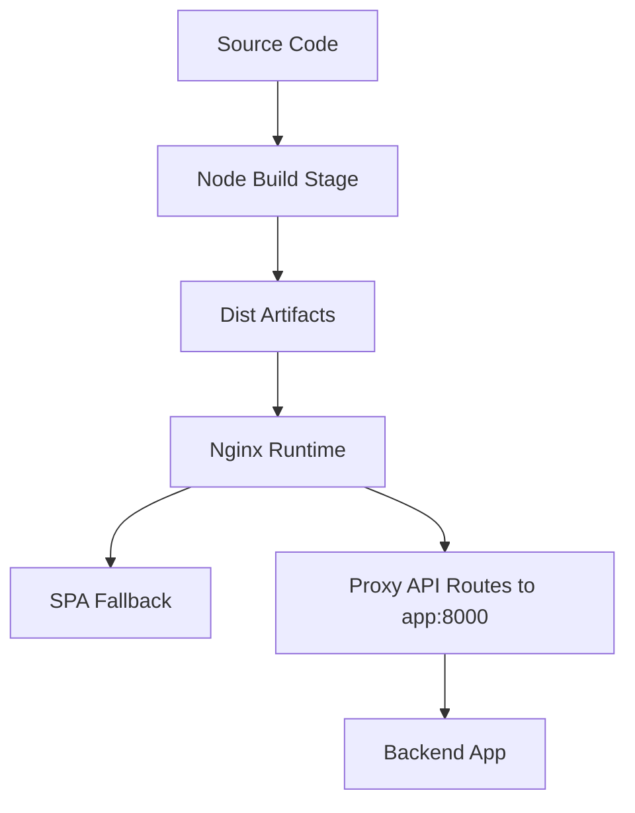
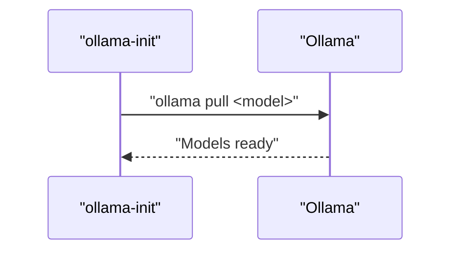
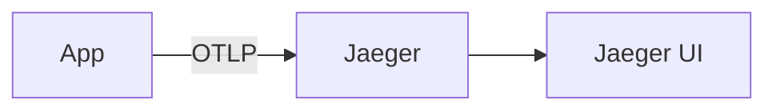
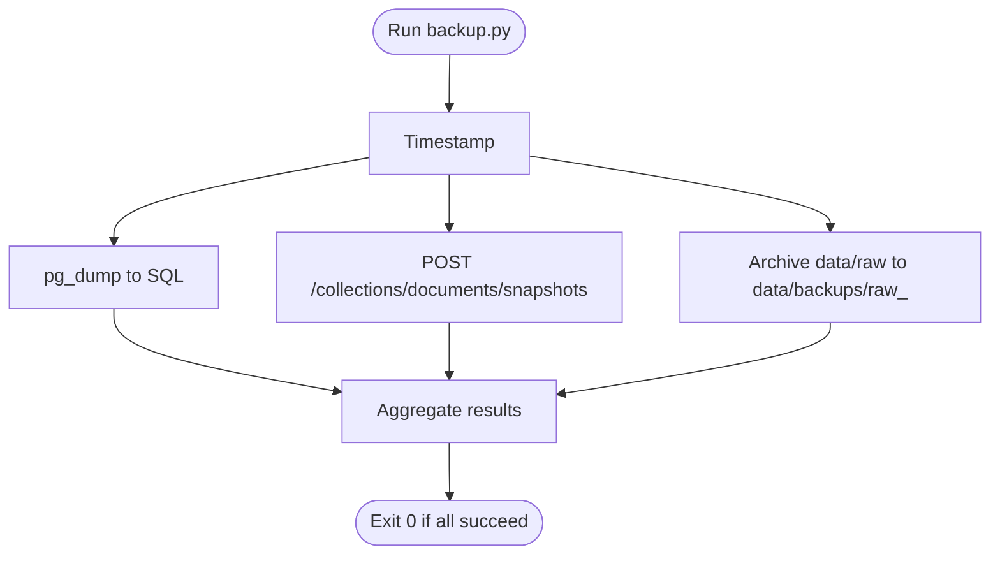
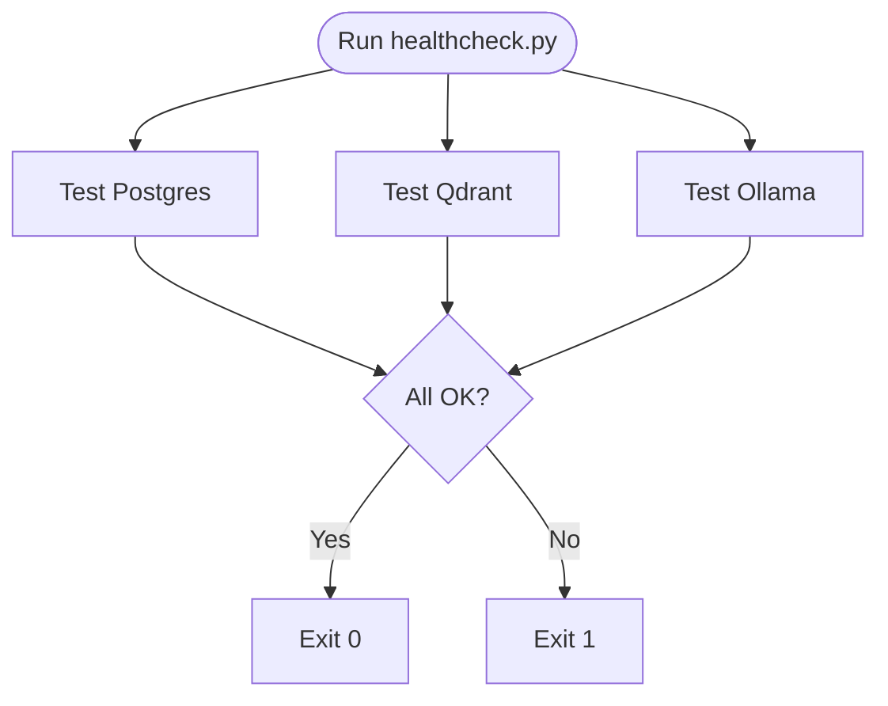
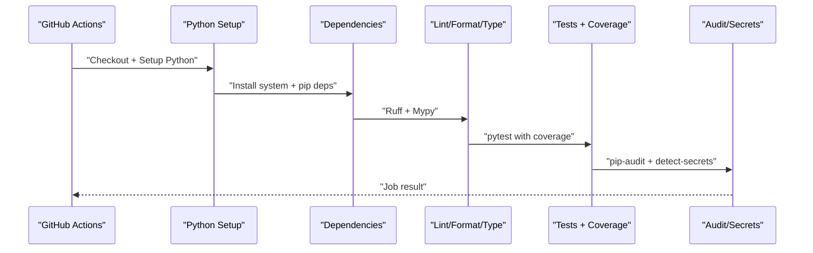
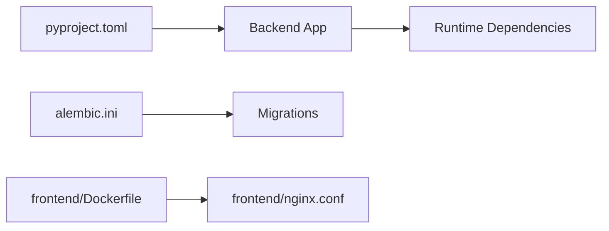

# Deployment and Operations

<cite>
**Referenced Files in This Document**
- [docker-compose.yml](file://safe4ai-pilot/docker-compose.yml)
- [docker-compose.override.yml](file://safe4ai-pilot/docker-compose.override.yml)
- [app/Dockerfile](file://safe4ai-pilot/app/Dockerfile)
- [frontend/Dockerfile](file://safe4ai-pilot/frontend/Dockerfile)
- [frontend/nginx.conf](file://safe4ai-pilot/frontend/nginx.conf)
- [pyproject.toml](file://safe4ai-pilot/pyproject.toml)
- [alembic.ini](file://safe4ai-pilot/alembic.ini)
- [scripts/backup.py](file://safe4ai-pilot/scripts/backup.py)
- [scripts/healthcheck.py](file://safe4ai-pilot/scripts/healthcheck.py)
- [scripts/migrate.py](file://safe4ai-pilot/scripts/migrate.py)
- [.github/workflows/ci.yml](file://safe4ai-pilot/.github/workflows/ci.yml)
- [app/config.py](file://safe4ai-pilot/app/config.py)
</cite>

## Table of Contents
1. [Introduction](#introduction)
2. [Project Structure](#project-structure)
3. [Core Components](#core-components)
4. [Architecture Overview](#architecture-overview)
5. [Detailed Component Analysis](#detailed-component-analysis)
6. [Dependency Analysis](#dependency-analysis)
7. [Performance Considerations](#performance-considerations)
8. [Troubleshooting Guide](#troubleshooting-guide)
9. [Conclusion](#conclusion)
10. [Appendices](#appendices)

## Introduction
This document provides comprehensive deployment and operations guidance for the Private AI system. It covers containerized deployment with Docker Compose, orchestration of backend, frontend, database, vector store, and observability tools, production configuration, scaling considerations, backup and restore procedures, CI/CD automation, monitoring and alerting, security hardening, and operational best practices. The content is grounded in the repository’s actual deployment artifacts and operational scripts.

## Project Structure
The deployment stack is orchestrated by Docker Compose with two primary service groups:
- Data and model services: PostgreSQL with pgvector, Qdrant vector database, and Ollama local LLM service.
- Application services: FastAPI backend application and Nginx-based frontend.

Development overrides enable hot reload and live volume mounts for rapid iteration.

**Diagram sources**
- [docker-compose.yml:1-119](file://safe4ai-pilot/docker-compose.yml#L1-L119)

**Section sources**
- [docker-compose.yml:1-119](file://safe4ai-pilot/docker-compose.yml#L1-L119)
- [docker-compose.override.yml:1-11](file://safe4ai-pilot/docker-compose.override.yml#L1-L11)

## Core Components
- Backend application
  - Built from the backend Dockerfile, installs Python dependencies, pre-bakes a cross-encoder model, and runs Uvicorn on port 8000.
  - Environment variables are loaded from .env and include database, vector store, and model gateway URLs.
  - Health checks probe the /health endpoint.
- Frontend
  - Multi-stage build: Node base for building assets, Nginx base for serving.
  - Nginx proxies API routes to the backend and serves a SPA fallback.
- Data and Vector Stores
  - PostgreSQL with pgvector extension for embeddings and metadata.
  - Qdrant for vector similarity search.
  - Ollama for local LLM inference.
- Observability
  - Jaeger for tracing (OTLP enabled).
- Operational Scripts
  - Backup: Postgres dump, Qdrant snapshot, and raw data archive.
  - Health check: Connectivity and readiness probes for Postgres, Qdrant, and Ollama.
  - Migration: Alembic upgrade to latest schema.

**Section sources**
- [app/Dockerfile:1-23](file://safe4ai-pilot/app/Dockerfile#L1-L23)
- [frontend/Dockerfile:1-14](file://safe4ai-pilot/frontend/Dockerfile#L1-L14)
- [frontend/nginx.conf:1-29](file://safe4ai-pilot/frontend/nginx.conf#L1-L29)
- [docker-compose.yml:75-114](file://safe4ai-pilot/docker-compose.yml#L75-L114)
- [scripts/backup.py:1-92](file://safe4ai-pilot/scripts/backup.py#L1-L92)
- [scripts/healthcheck.py:1-58](file://safe4ai-pilot/scripts/healthcheck.py#L1-L58)
- [scripts/migrate.py:1-17](file://safe4ai-pilot/scripts/migrate.py#L1-L17)

## Architecture Overview
The system is a microservice-style composition:
- Backend exposes REST endpoints and streaming responses for chat.
- Frontend serves a SPA and proxies authenticated routes to the backend.
- Data plane: PostgreSQL stores relational data and embeddings metadata; Qdrant stores vectors; Ollama provides embeddings and generation.
- Observability: Jaeger collects traces via OTLP.

**Diagram sources**
- [docker-compose.yml:1-119](file://safe4ai-pilot/docker-compose.yml#L1-L119)
- [frontend/nginx.conf:13-24](file://safe4ai-pilot/frontend/nginx.conf#L13-L24)

## Detailed Component Analysis

### Backend Application Containerization
- Build process: Python slim image, system deps, pip install editable package, pre-bake cross-encoder.
- Runtime: Uvicorn with host 0.0.0.0 and port 8000.
- Development override: Hot reload via Uvicorn with mounted source directories.

**Diagram sources**
- [app/Dockerfile:1-23](file://safe4ai-pilot/app/Dockerfile#L1-L23)

**Section sources**
- [app/Dockerfile:1-23](file://safe4ai-pilot/app/Dockerfile#L1-L23)
- [docker-compose.override.yml:2-11](file://safe4ai-pilot/docker-compose.override.yml#L2-L11)

### Frontend Containerization and Proxying
- Multi-stage build: Node build stage, Nginx runtime.
- Nginx configuration:
  - SPA fallback using try_files.
  - Proxies API routes to backend on port 8000.
  - Disables proxy buffering for SSE and sets long read timeout.
  - Enables gzip for common asset types.

**Diagram sources**
- [frontend/Dockerfile:1-14](file://safe4ai-pilot/frontend/Dockerfile#L1-L14)
- [frontend/nginx.conf:1-29](file://safe4ai-pilot/frontend/nginx.conf#L1-L29)

**Section sources**
- [frontend/Dockerfile:1-14](file://safe4ai-pilot/frontend/Dockerfile#L1-L14)
- [frontend/nginx.conf:13-28](file://safe4ai-pilot/frontend/nginx.conf#L13-L28)

### Data Plane: PostgreSQL, Qdrant, Ollama
- PostgreSQL (pgvector): Health-checked via pg_isready; persistent storage via named volume.
- Qdrant: Health-checked via TCP port; persistent storage via named volume.
- Ollama: Health-checked via CLI; pulls foundational models via a one-shot init service; persistent storage via named volume.

**Diagram sources**
- [docker-compose.yml:46-60](file://safe4ai-pilot/docker-compose.yml#L46-L60)

**Section sources**
- [docker-compose.yml:2-16](file://safe4ai-pilot/docker-compose.yml#L2-L16)
- [docker-compose.yml:18-29](file://safe4ai-pilot/docker-compose.yml#L18-L29)
- [docker-compose.yml:31-44](file://safe4ai-pilot/docker-compose.yml#L31-L44)
- [docker-compose.yml:46-60](file://safe4ai-pilot/docker-compose.yml#L46-L60)

### Observability: Tracing with Jaeger
- Jaeger all-in-one image with OTLP enabled.
- Health-checked via HTTP on the UI port.

**Diagram sources**
- [docker-compose.yml:62-74](file://safe4ai-pilot/docker-compose.yml#L62-L74)

**Section sources**
- [docker-compose.yml:62-74](file://safe4ai-pilot/docker-compose.yml#L62-L74)

### Operational Scripts

#### Backup Procedure
End-to-end backup covering Postgres, Qdrant, and raw data:
- Postgres: pg_dump to an SQL file.
- Qdrant: trigger collection snapshot via REST API.
- Raw data: archive the raw directory to a timestamped folder.

**Diagram sources**
- [scripts/backup.py:76-92](file://safe4ai-pilot/scripts/backup.py#L76-L92)

**Section sources**
- [scripts/backup.py:1-92](file://safe4ai-pilot/scripts/backup.py#L1-L92)

#### Health Checks
- Postgres: SQLAlchemy connection executes a simple query.
- Qdrant: GET /readyz endpoint.
- Ollama: GET /api/tags endpoint.

**Diagram sources**
- [scripts/healthcheck.py:49-58](file://safe4ai-pilot/scripts/healthcheck.py#L49-L58)

**Section sources**
- [scripts/healthcheck.py:1-58](file://safe4ai-pilot/scripts/healthcheck.py#L1-L58)

#### Database Migrations
- Alembic upgrade to head using a subprocess wrapper.

**Section sources**
- [scripts/migrate.py:1-17](file://safe4ai-pilot/scripts/migrate.py#L1-L17)
- [alembic.ini:1-150](file://safe4ai-pilot/alembic.ini#L1-L150)

### CI/CD Pipeline
- Job stages: checkout, setup Python, install system and Python dependencies, lint, format check, type check, tests with coverage, dependency audit, secrets scan.
- Coverage minimum enforced via pytest configuration.

**Diagram sources**
- [.github/workflows/ci.yml:1-51](file://safe4ai-pilot/.github/workflows/ci.yml#L1-L51)

**Section sources**
- [.github/workflows/ci.yml:1-51](file://safe4ai-pilot/.github/workflows/ci.yml#L1-L51)

## Dependency Analysis
- Backend runtime dependencies are declared in the Python project configuration.
- Alembic configuration controls migration scripts location and logging.
- Frontend Dockerfile and Nginx config define build-time and runtime behavior.

**Diagram sources**
- [pyproject.toml:1-101](file://safe4ai-pilot/pyproject.toml#L1-L101)
- [alembic.ini:1-150](file://safe4ai-pilot/alembic.ini#L1-L150)
- [frontend/Dockerfile:1-14](file://safe4ai-pilot/frontend/Dockerfile#L1-L14)
- [frontend/nginx.conf:1-29](file://safe4ai-pilot/frontend/nginx.conf#L1-L29)

**Section sources**
- [pyproject.toml:1-101](file://safe4ai-pilot/pyproject.toml#L1-L101)
- [alembic.ini:1-150](file://safe4ai-pilot/alembic.ini#L1-L150)
- [frontend/Dockerfile:1-14](file://safe4ai-pilot/frontend/Dockerfile#L1-L14)
- [frontend/nginx.conf:1-29](file://safe4ai-pilot/frontend/nginx.conf#L1-L29)

## Performance Considerations
- Resource sizing
  - PostgreSQL: Allocate CPU/RAM proportional to concurrent connections and workload; enable appropriate shared buffers and work_mem.
  - Qdrant: Size storage for vectors plus snapshots; monitor disk throughput.
  - Ollama: Reserve memory for selected model families; keep models cached via init job.
  - Backend: Scale horizontally behind a load balancer; tune Uvicorn workers and threads.
  - Frontend: Nginx handles static assets efficiently; ensure adequate CPU for proxy buffering and gzip.
- Caching and pre-warming
  - Backend pre-bakes a cross-encoder model to reduce cold-start latency.
  - Ollama init job pulls foundational models to warm caches.
- Network and I/O
  - Persist volumes for databases and model caches to avoid repeated downloads and rebuilds.
  - Use SSD-backed storage for Qdrant and Postgres for I/O-heavy operations.

[No sources needed since this section provides general guidance]

## Troubleshooting Guide
- Service readiness
  - Use the health check script to verify connectivity to Postgres, Qdrant, and Ollama.
  - Review Docker Compose health checks for timing and retry thresholds.
- Database schema
  - Run the migration script to upgrade to the latest schema.
- Backups
  - Confirm timestamped backups for Postgres, Qdrant, and raw data; investigate partial failures.
- Logs
  - Inspect container logs for backend and frontend; review Nginx access/error logs.
- Secrets and configuration
  - Ensure .env is present and contains required keys; verify settings mapping in the backend configuration.

**Section sources**
- [scripts/healthcheck.py:1-58](file://safe4ai-pilot/scripts/healthcheck.py#L1-L58)
- [scripts/migrate.py:1-17](file://safe4ai-pilot/scripts/migrate.py#L1-L17)
- [scripts/backup.py:1-92](file://safe4ai-pilot/scripts/backup.py#L1-L92)
- [docker-compose.yml:12-16](file://safe4ai-pilot/docker-compose.yml#L12-L16)
- [docker-compose.yml:25-29](file://safe4ai-pilot/docker-compose.yml#L25-L29)
- [docker-compose.yml:39-44](file://safe4ai-pilot/docker-compose.yml#L39-L44)
- [docker-compose.yml:98-103](file://safe4ai-pilot/docker-compose.yml#L98-L103)
- [app/config.py:1-28](file://safe4ai-pilot/app/config.py#L1-L28)

## Conclusion
The Private AI system is designed for containerized deployment with clear separation of concerns across backend, frontend, data, vector store, and observability. The provided Docker Compose setup, operational scripts, and CI/CD pipeline enable repeatable development and production workflows. By following the operational procedures and performance guidance herein, teams can deploy reliably, scale effectively, and maintain high availability.

[No sources needed since this section summarizes without analyzing specific files]

## Appendices

### Production Deployment Strategies
- Environment configuration
  - Define environment variables for database, vector store, and model gateway URLs.
  - Set allowed origins, secret key, HTTPS enforcement, and retention policies.
- Scaling
  - Backend: Horizontal pod scaling behind a reverse proxy; ensure stateless sessions and shared caches where applicable.
  - Frontend: Stateless; scale replicas behind Nginx or CDN.
  - Data plane: Tune PostgreSQL and Qdrant resources; consider read replicas for reporting.
- Resource requirements
  - Start with modest allocations and profile under realistic load; adjust CPU, memory, and disk IOPS accordingly.

**Section sources**
- [app/config.py:5-24](file://safe4ai-pilot/app/config.py#L5-L24)
- [docker-compose.yml:83-86](file://safe4ai-pilot/docker-compose.yml#L83-L86)

### Backup and Restore Procedures
- Backup
  - Use the backup script to generate Postgres SQL dumps, Qdrant snapshots, and raw data archives.
- Restore
  - Restore Postgres from SQL dump.
  - Restore Qdrant from snapshot.
  - Rehydrate raw data from archived directory.
- Automation
  - Schedule periodic backups and validate integrity regularly.

**Section sources**
- [scripts/backup.py:1-92](file://safe4ai-pilot/scripts/backup.py#L1-L92)

### Monitoring and Alerting
- Health checks
  - Use the health check script and Docker Compose health checks to monitor service readiness.
- Tracing
  - Jaeger UI provides end-to-end visibility; configure SDKs to export OTLP spans.
- Metrics
  - Instrument backend endpoints and integrate with Prometheus/Grafana for metrics collection.

**Section sources**
- [scripts/healthcheck.py:1-58](file://safe4ai-pilot/scripts/healthcheck.py#L1-L58)
- [docker-compose.yml:67-73](file://safe4ai-pilot/docker-compose.yml#L67-L73)

### Security Considerations
- Secrets management
  - Store secrets in .env and restrict access; rotate secret keys periodically.
  - Enforce HTTPS in production and configure allowed origins carefully.
- Network isolation
  - Limit exposure of internal ports; use reverse proxies and firewalls.
- Dependency hygiene
  - Regularly audit dependencies and scan for secrets in committed code.

**Section sources**
- [app/config.py:11-13](file://safe4ai-pilot/app/config.py#L11-L13)
- [.github/workflows/ci.yml:46-50](file://safe4ai-pilot/.github/workflows/ci.yml#L46-L50)

### CI/CD and Automated Testing
- CI pipeline stages cover linting, formatting, type checking, testing with coverage, dependency auditing, and secrets scanning.
- Tests include unit and integration suites; smoke tests rely on Docker Compose services.

**Section sources**
- [.github/workflows/ci.yml:1-51](file://safe4ai-pilot/.github/workflows/ci.yml#L1-L51)