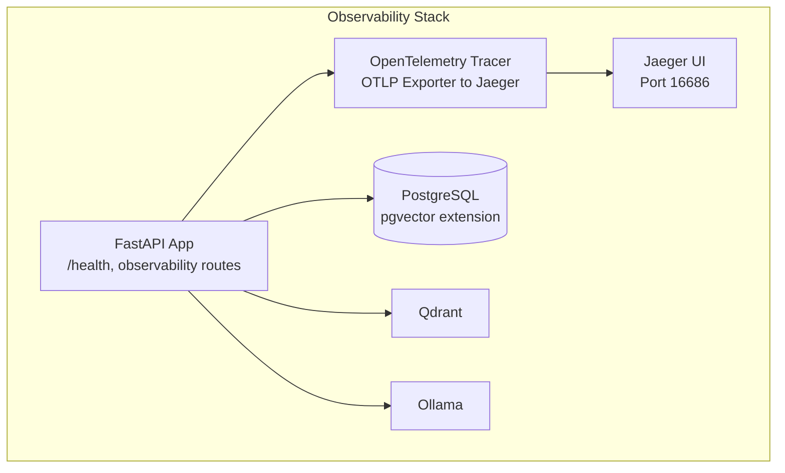
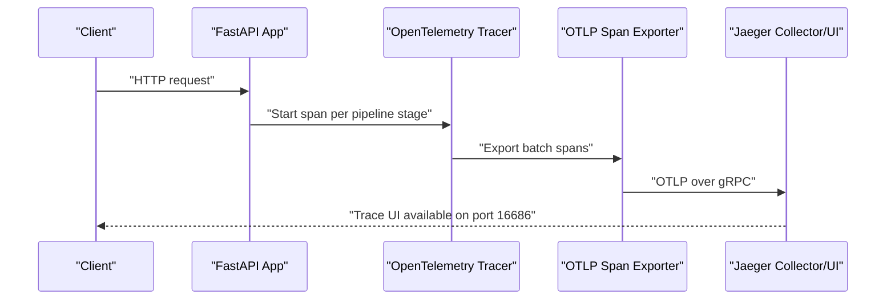
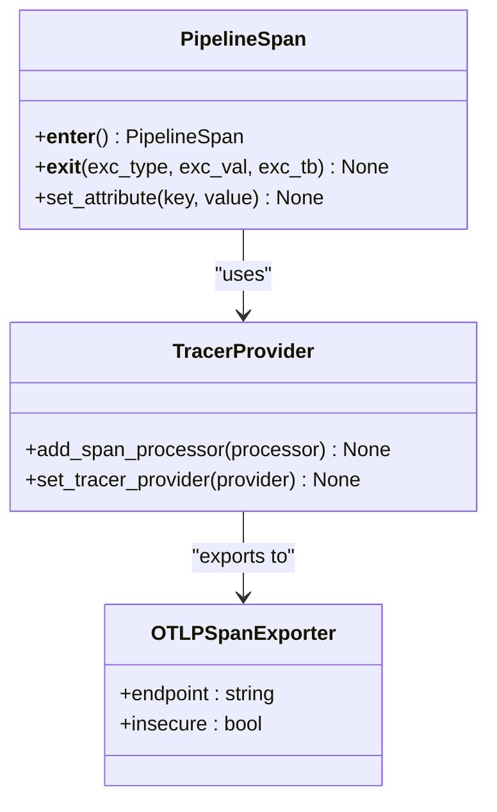
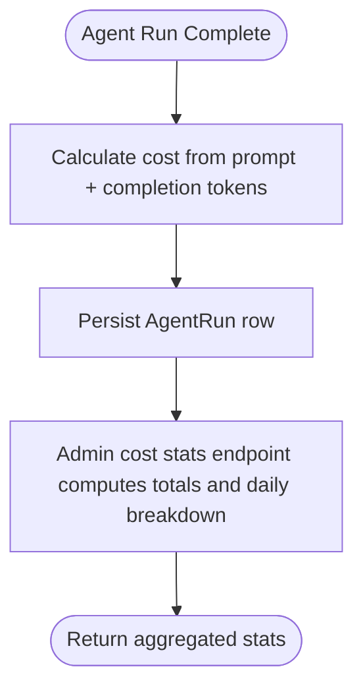
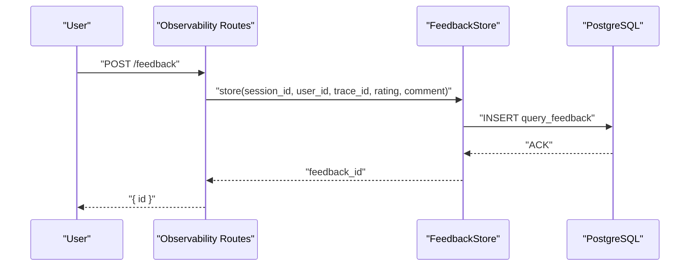
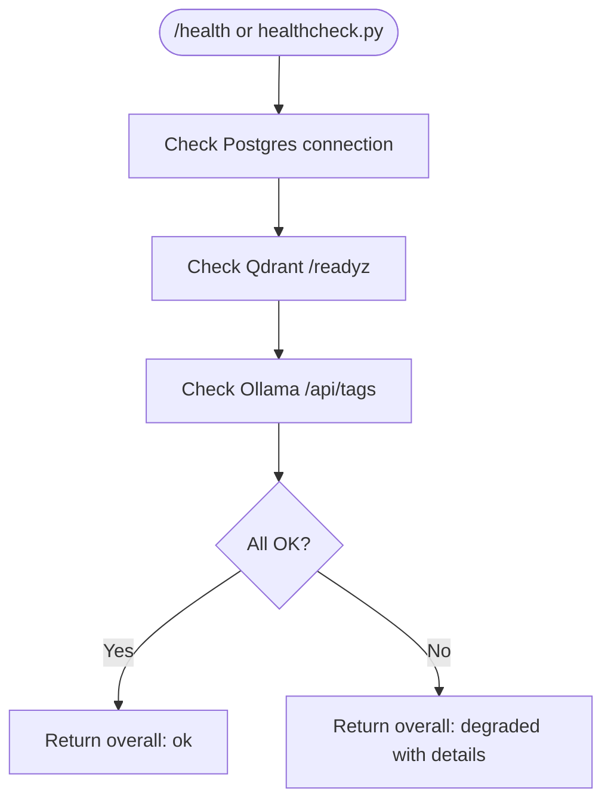
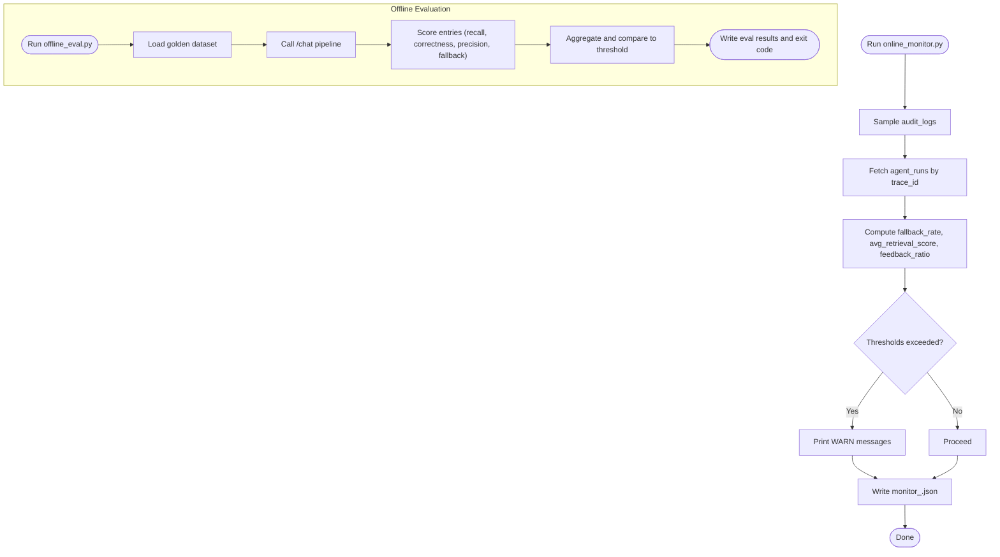
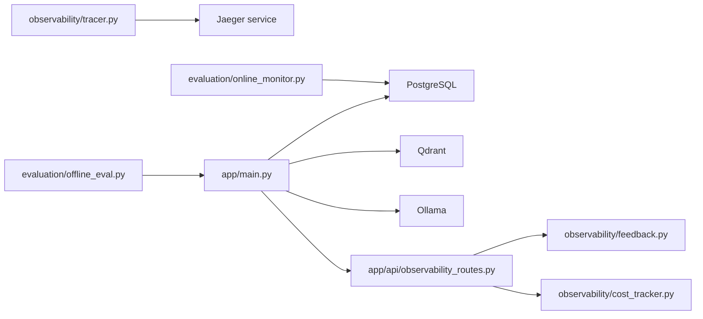

# Monitoring and Alerting

<cite>
**Referenced Files in This Document**
- [docker-compose.yml](file://safe4ai-pilot/docker-compose.yml)
- [docker-compose.override.yml](file://safe4ai-pilot/docker-compose.override.yml)
- [app/main.py](file://safe4ai-pilot/app/main.py)
- [scripts/healthcheck.py](file://safe4ai-pilot/scripts/healthcheck.py)
- [app/api/observability_routes.py](file://safe4ai-pilot/app/api/observability_routes.py)
- [observability/tracer.py](file://safe4ai-pilot/observability/tracer.py)
- [observability/cost_tracker.py](file://safe4ai-pilot/observability/cost_tracker.py)
- [observability/feedback.py](file://safe4ai-pilot/observability/feedback.py)
- [app/db/models.py](file://safe4ai-pilot/app/db/models.py)
- [app/config.py](file://safe4ai-pilot/app/config.py)
- [evaluation/online_monitor.py](file://safe4ai-pilot/evaluation/online_monitor.py)
- [evaluation/offline_eval.py](file://safe4ai-pilot/evaluation/offline_eval.py)
</cite>

## Table of Contents
1. [Introduction](#introduction)
2. [Project Structure](#project-structure)
3. [Core Components](#core-components)
4. [Architecture Overview](#architecture-overview)
5. [Detailed Component Analysis](#detailed-component-analysis)
6. [Dependency Analysis](#dependency-analysis)
7. [Performance Considerations](#performance-considerations)
8. [Troubleshooting Guide](#troubleshooting-guide)
9. [Conclusion](#conclusion)
10. [Appendices](#appendices)

## Introduction
This document provides comprehensive monitoring and alerting guidance for the Private AI system. It covers observability setup, metrics collection, distributed tracing with Jaeger, cost monitoring, health checks, alerting rules, and operational dashboards. It also documents the observability endpoints, logging configuration, and troubleshooting workflows grounded in the repository’s implementation.

## Project Structure
The observability stack spans the backend API, database, and supporting services orchestrated via Docker Compose. Key components include:
- Backend API with health endpoint and observability routes
- Distributed tracing via OpenTelemetry exporter to Jaeger
- Cost tracking persisted in the database
- Feedback collection for user sentiment
- Online and offline evaluation scripts for system quality monitoring
- Health checks for dependent services

**Diagram sources**
- [docker-compose.yml:1-119](file://safe4ai-pilot/docker-compose.yml#L1-L119)
- [app/main.py:118-147](file://safe4ai-pilot/app/main.py#L118-L147)
- [observability/tracer.py:27-32](file://safe4ai-pilot/observability/tracer.py#L27-L32)

**Section sources**
- [docker-compose.yml:1-119](file://safe4ai-pilot/docker-compose.yml#L1-L119)
- [app/main.py:118-147](file://safe4ai-pilot/app/main.py#L118-L147)

## Core Components
- Distributed tracing with OpenTelemetry and Jaeger export
- Cost tracking and cost statistics endpoint
- Feedback submission and admin access to feedback
- Application health endpoint and service dependency checks
- Audit-driven online monitoring and offline evaluation

**Section sources**
- [observability/tracer.py:14-32](file://safe4ai-pilot/observability/tracer.py#L14-L32)
- [app/api/observability_routes.py:19-56](file://safe4ai-pilot/app/api/observability_routes.py#L19-L56)
- [scripts/healthcheck.py:12-53](file://safe4ai-pilot/scripts/healthcheck.py#L12-L53)
- [evaluation/online_monitor.py:112-178](file://safe4ai-pilot/evaluation/online_monitor.py#L112-L178)

## Architecture Overview
The system exposes an observability pipeline integrating:
- Tracing: OpenTelemetry spans exported via OTLP to Jaeger
- Metrics: Cost tracking and feedback analytics exposed via admin endpoints
- Health: Application and dependency health checks
- Evaluation: Online and offline monitoring scripts for quality and regression detection

**Diagram sources**
- [observability/tracer.py:35-75](file://safe4ai-pilot/observability/tracer.py#L35-L75)
- [docker-compose.yml:62-73](file://safe4ai-pilot/docker-compose.yml#L62-L73)

## Detailed Component Analysis

### Distributed Tracing with Jaeger
- OpenTelemetry TracerProvider configured with a BatchSpanProcessor exporting to Jaeger via OTLP
- PipelineSpan context manager sets stage and trace attributes and records exceptions
- Environment variables control OTLP endpoint and TLS mode

**Diagram sources**
- [observability/tracer.py:35-75](file://safe4ai-pilot/observability/tracer.py#L35-L75)

**Section sources**
- [observability/tracer.py:14-32](file://safe4ai-pilot/observability/tracer.py#L14-L32)
- [observability/tracer.py:35-75](file://safe4ai-pilot/observability/tracer.py#L35-L75)
- [docker-compose.yml:62-73](file://safe4ai-pilot/docker-compose.yml#L62-L73)

### Cost Monitoring
- CostTracker calculates USD cost from token counts and persists AgentRun records
- Admin endpoint aggregates cost statistics over a configurable window
- Database models include AgentRun for cost and timing metrics

**Diagram sources**
- [observability/cost_tracker.py:22-60](file://safe4ai-pilot/observability/cost_tracker.py#L22-L60)
- [app/api/observability_routes.py:48-56](file://safe4ai-pilot/app/api/observability_routes.py#L48-L56)
- [app/db/models.py:133-144](file://safe4ai-pilot/app/db/models.py#L133-L144)

**Section sources**
- [observability/cost_tracker.py:16-110](file://safe4ai-pilot/observability/cost_tracker.py#L16-L110)
- [app/api/observability_routes.py:48-56](file://safe4ai-pilot/app/api/observability_routes.py#L48-L56)
- [app/db/models.py:133-144](file://safe4ai-pilot/app/db/models.py#L133-L144)

### Feedback Collection and Admin Insights
- FeedbackStore persists user ratings and comments linked to trace/session
- Observability routes expose feedback submission and admin listing
- Online monitor reads feedback to compute user feedback ratio

**Diagram sources**
- [app/api/observability_routes.py:26-35](file://safe4ai-pilot/app/api/observability_routes.py#L26-L35)
- [observability/feedback.py:22-49](file://safe4ai-pilot/observability/feedback.py#L22-L49)
- [evaluation/online_monitor.py:87-109](file://safe4ai-pilot/evaluation/online_monitor.py#L87-L109)

**Section sources**
- [app/api/observability_routes.py:19-56](file://safe4ai-pilot/app/api/observability_routes.py#L19-L56)
- [observability/feedback.py:16-71](file://safe4ai-pilot/observability/feedback.py#L16-L71)
- [evaluation/online_monitor.py:87-109](file://safe4ai-pilot/evaluation/online_monitor.py#L87-L109)

### Application Health Checks
- FastAPI /health endpoint validates connectivity to PostgreSQL, Qdrant, and Ollama
- Dedicated healthcheck script performs the same checks programmatically
- Docker Compose healthchecks ensure dependent services are ready before app startup

**Diagram sources**
- [app/main.py:118-147](file://safe4ai-pilot/app/main.py#L118-L147)
- [scripts/healthcheck.py:12-53](file://safe4ai-pilot/scripts/healthcheck.py#L12-L53)
- [docker-compose.yml:12-44](file://safe4ai-pilot/docker-compose.yml#L12-L44)

**Section sources**
- [app/main.py:118-147](file://safe4ai-pilot/app/main.py#L118-L147)
- [scripts/healthcheck.py:12-53](file://safe4ai-pilot/scripts/healthcheck.py#L12-L53)
- [docker-compose.yml:12-44](file://safe4ai-pilot/docker-compose.yml#L12-L44)

### Online and Offline Monitoring
- Online monitor samples audit logs, correlates with agent runs, and computes fallback rate, average retrieval score, and user feedback ratio; writes daily reports and emits warnings above thresholds
- Offline evaluator runs the pipeline against a golden dataset, scoring retrieval recall, answer correctness, citation precision, and fallback accuracy; compares against a threshold and previous runs

**Diagram sources**
- [evaluation/online_monitor.py:112-178](file://safe4ai-pilot/evaluation/online_monitor.py#L112-L178)
- [evaluation/offline_eval.py:149-243](file://safe4ai-pilot/evaluation/offline_eval.py#L149-L243)

**Section sources**
- [evaluation/online_monitor.py:1-179](file://safe4ai-pilot/evaluation/online_monitor.py#L1-L179)
- [evaluation/offline_eval.py:1-244](file://safe4ai-pilot/evaluation/offline_eval.py#L1-L244)

## Dependency Analysis
- The app depends on PostgreSQL (pgvector), Qdrant, and Ollama; health checks and runtime checks confirm readiness
- Jaeger is provisioned for tracing; OTLP exporter is configured in the tracer module
- Observability endpoints rely on database models for feedback and agent runs

**Diagram sources**
- [observability/tracer.py:27-32](file://safe4ai-pilot/observability/tracer.py#L27-L32)
- [docker-compose.yml:62-73](file://safe4ai-pilot/docker-compose.yml#L62-L73)
- [app/main.py:118-147](file://safe4ai-pilot/app/main.py#L118-L147)
- [app/api/observability_routes.py:13-14](file://safe4ai-pilot/app/api/observability_routes.py#L13-L14)
- [evaluation/online_monitor.py:42-84](file://safe4ai-pilot/evaluation/online_monitor.py#L42-L84)
- [evaluation/offline_eval.py:121-133](file://safe4ai-pilot/evaluation/offline_eval.py#L121-L133)

**Section sources**
- [docker-compose.yml:1-119](file://safe4ai-pilot/docker-compose.yml#L1-L119)
- [app/main.py:118-147](file://safe4ai-pilot/app/main.py#L118-L147)
- [app/api/observability_routes.py:1-56](file://safe4ai-pilot/app/api/observability_routes.py#L1-L56)

## Performance Considerations
- Tracing overhead: BatchSpanProcessor reduces network frequency; tune processor settings for production throughput
- Cost calculation: Lightweight arithmetic; ensure token counters are accurate upstream
- Health checks: Short timeouts and minimal payload reduce impact on latency
- Evaluation scripts: Sampling and thresholds prevent heavy computation during monitoring runs

[No sources needed since this section provides general guidance]

## Troubleshooting Guide
- Tracing not visible in Jaeger:
  - Verify OTLP endpoint and TLS settings; ensure Jaeger collector is running and exposing port 4317
  - Confirm the tracer provider is initialized and spans are exported
- Health endpoint shows degraded:
  - Check PostgreSQL connectivity, Qdrant readiness, and Ollama model availability
  - Use the dedicated healthcheck script to isolate failing dependencies
- Cost stats missing:
  - Ensure AgentRun records are being created after agent runs
  - Confirm the admin cost stats endpoint is called with appropriate days window
- Feedback not appearing:
  - Validate feedback submission route and permissions
  - Confirm feedback exists in the query_feedback table and admin listing works

**Section sources**
- [observability/tracer.py:27-32](file://safe4ai-pilot/observability/tracer.py#L27-L32)
- [docker-compose.yml:62-73](file://safe4ai-pilot/docker-compose.yml#L62-L73)
- [app/main.py:118-147](file://safe4ai-pilot/app/main.py#L118-L147)
- [scripts/healthcheck.py:12-53](file://safe4ai-pilot/scripts/healthcheck.py#L12-L53)
- [app/api/observability_routes.py:48-56](file://safe4ai-pilot/app/api/observability_routes.py#L48-L56)
- [observability/feedback.py:22-49](file://safe4ai-pilot/observability/feedback.py#L22-L49)

## Conclusion
The Private AI system integrates distributed tracing with Jaeger, cost tracking, feedback collection, and robust health checks. Online and offline monitoring scripts provide continuous quality insights. Together, these components form a practical observability foundation suitable for development and production environments.

[No sources needed since this section summarizes without analyzing specific files]

## Appendices

### Observability Endpoints
- POST /feedback: Submit user feedback for a session and trace
- GET /admin/feedback: Retrieve recent feedback (admin only)
- GET /admin/stats/cost: Return cost statistics over a window (admin only)

**Section sources**
- [app/api/observability_routes.py:26-56](file://safe4ai-pilot/app/api/observability_routes.py#L26-L56)

### Health and Dependencies
- GET /health: Application health including Postgres, Qdrant, and Ollama
- Docker Compose healthchecks for each service
- Dedicated healthcheck script for CI or cron jobs

**Section sources**
- [app/main.py:118-147](file://safe4ai-pilot/app/main.py#L118-L147)
- [scripts/healthcheck.py:12-53](file://safe4ai-pilot/scripts/healthcheck.py#L12-L53)
- [docker-compose.yml:12-44](file://safe4ai-pilot/docker-compose.yml#L12-L44)

### Logging Configuration
- Structlog is imported and used across observability modules for structured logging
- Use environment-based logging configuration and application logs for operational visibility

**Section sources**
- [observability/tracer.py](file://safe4ai-pilot/observability/tracer.py#L12)
- [observability/cost_tracker.py](file://safe4ai-pilot/observability/cost_tracker.py#L13)
- [observability/feedback.py](file://safe4ai-pilot/observability/feedback.py#L11)

### Dashboard Configuration Examples
- Traces: Use Jaeger UI to filter by service and operation; correlate by trace_id
- Costs: Aggregate daily costs via the admin cost stats endpoint; visualize trends over time
- Quality: Plot fallback_rate and avg_retrieval_score from online monitor outputs; track user_feedback_ratio
- Offline evaluation: Import summary metrics into visualization tools; compare overall_score over time

[No sources needed since this section provides general guidance]

### Alerting Rules and Notification Channels
- Threshold-based alerts:
  - fallback_rate > threshold (e.g., 20%) triggers a warning
  - avg_retrieval_score < threshold (e.g., 0.5) triggers a warning
  - cost spikes: compare daily totals to historical baselines
- Notification channels:
  - Slack, email, or PagerDuty webhooks triggered by scripts or monitoring systems
  - Integrate with CI/CD to gate deployments based on offline evaluation thresholds

[No sources needed since this section provides general guidance]

### Incident Response Procedures
- Immediate: Validate /health and service readiness; inspect Jaeger traces for error spans
- Investigate: Correlate trace_id across pipeline stages; review feedback submissions
- Mitigate: Scale services, adjust thresholds, or roll back changes based on offline evaluation regressions
- Communicate: Use standardized runbooks to update stakeholders and document remediation steps

[No sources needed since this section provides general guidance]