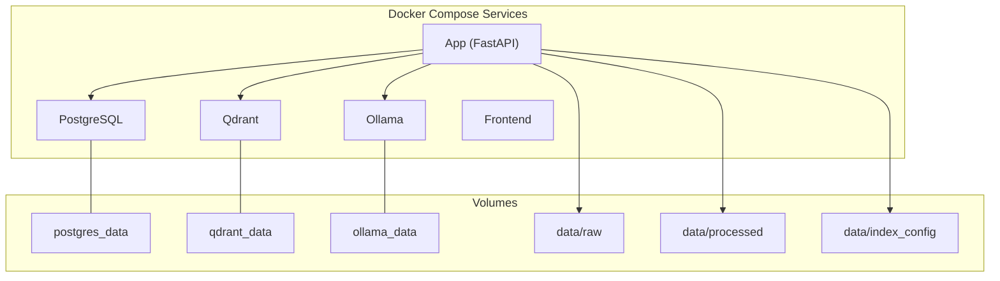
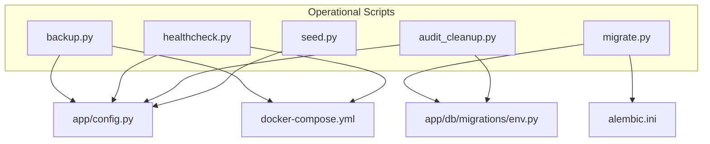
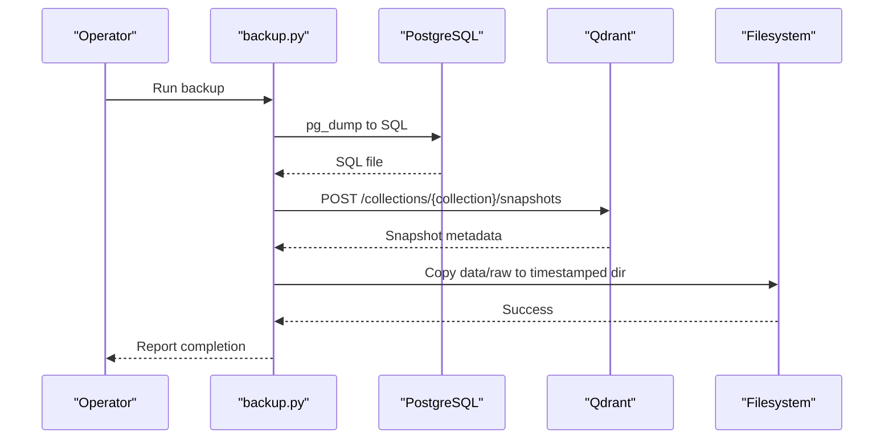
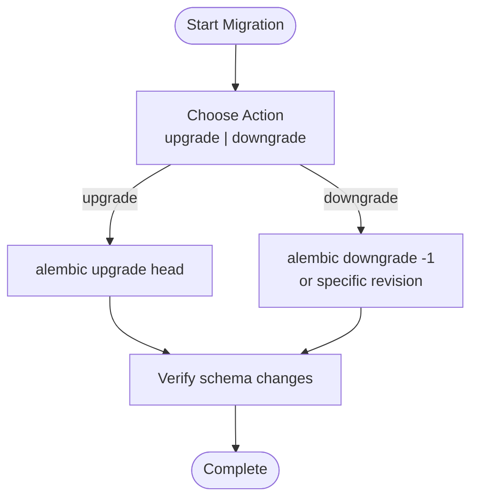
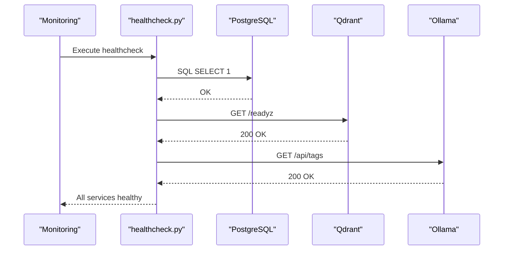
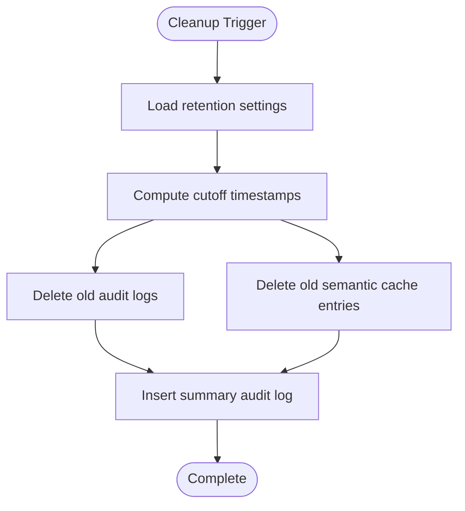
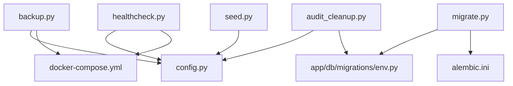

# Operational Maintenance

<cite>
**Referenced Files in This Document**
- [backup.py](file://safe4ai-pilot/scripts/backup.py)
- [migrate.py](file://safe4ai-pilot/scripts/migrate.py)
- [healthcheck.py](file://safe4ai-pilot/scripts/healthcheck.py)
- [audit_cleanup.py](file://safe4ai-pilot/scripts/audit_cleanup.py)
- [seed.py](file://safe4ai-pilot/scripts/seed.py)
- [config.py](file://safe4ai-pilot/app/config.py)
- [docker-compose.yml](file://safe4ai-pilot/docker-compose.yml)
- [docker-compose.override.yml](file://safe4ai-pilot/docker-compose.override.yml)
- [alembic.ini](file://safe4ai-pilot/alembic.ini)
- [env.py](file://safe4ai-pilot/app/db/migrations/env.py)
- [models.py](file://safe4ai-pilot/app/db/models.py)
</cite>

## Table of Contents
1. [Introduction](#introduction)
2. [Project Structure](#project-structure)
3. [Core Components](#core-components)
4. [Architecture Overview](#architecture-overview)
5. [Detailed Component Analysis](#detailed-component-analysis)
6. [Dependency Analysis](#dependency-analysis)
7. [Performance Considerations](#performance-considerations)
8. [Troubleshooting Guide](#troubleshooting-guide)
9. [Conclusion](#conclusion)
10. [Appendices](#appendices)

## Introduction
This document provides operational and maintenance runbooks for the Private AI system. It covers day-to-day tasks such as backups and restores for PostgreSQL, Qdrant vector storage, and application data; database migration management; health monitoring and alerting; audit log and cache cleanup; storage optimization; log rotation and disk space management; and incident runbooks with escalation and maintenance window guidance. Practical examples reference the provided scripts and configuration.

## Project Structure
The system is containerized and orchestrated with Docker Compose. The application exposes health endpoints and integrates with PostgreSQL, Qdrant, and Ollama. Operational scripts reside under safe4ai-pilot/scripts and manage backup, migration, health checks, cleanup, and seeding.

**Diagram sources**
- [docker-compose.yml:1-119](file://safe4ai-pilot/docker-compose.yml#L1-L119)

**Section sources**
- [docker-compose.yml:1-119](file://safe4ai-pilot/docker-compose.yml#L1-L119)

## Core Components
- Backup subsystem: PostgreSQL dump, Qdrant snapshot, and raw data archival.
- Migration subsystem: Alembic-based schema upgrades.
- Health monitoring: Connectivity checks for PostgreSQL, Qdrant, and Ollama.
- Cleanup subsystem: Audit log and semantic cache pruning with scheduled jobs.
- Seed subsystem: Initial admin user and test documents creation.

**Section sources**
- [backup.py:1-92](file://safe4ai-pilot/scripts/backup.py#L1-L92)
- [migrate.py:1-17](file://safe4ai-pilot/scripts/migrate.py#L1-L17)
- [healthcheck.py:1-58](file://safe4ai-pilot/scripts/healthcheck.py#L1-L58)
- [audit_cleanup.py:1-129](file://safe4ai-pilot/scripts/audit_cleanup.py#L1-L129)
- [seed.py:1-47](file://safe4ai-pilot/scripts/seed.py#L1-L47)

## Architecture Overview
Operational scripts integrate with application configuration and external systems. The backup script orchestrates three targets: PostgreSQL, Qdrant, and raw data. Migrations are executed via Alembic using the configured database URL. Health checks probe readiness endpoints and database connectivity. Cleanup runs periodically to maintain storage hygiene.

**Diagram sources**
- [backup.py:18](file://safe4ai-pilot/scripts/backup.py#L18)
- [migrate.py:8-12](file://safe4ai-pilot/scripts/migrate.py#L8-L12)
- [healthcheck.py:8-9](file://safe4ai-pilot/scripts/healthcheck.py#L8-L9)
- [audit_cleanup.py:25-27](file://safe4ai-pilot/scripts/audit_cleanup.py#L25-L27)
- [seed.py:9-10](file://safe4ai-pilot/scripts/seed.py#L9-L10)
- [docker-compose.yml:83-86](file://safe4ai-pilot/docker-compose.yml#L83-L86)
- [env.py:18-20](file://safe4ai-pilot/app/db/migrations/env.py#L18-L20)
- [alembic.ini:8](file://safe4ai-pilot/alembic.ini#L8)

## Detailed Component Analysis

### Backup and Restore Procedures
Backup script coordinates three operations:
- PostgreSQL dump to a timestamped SQL file.
- Qdrant snapshot via REST API.
- Copy of raw data directory to a timestamped folder.

Restore procedures by component:
- PostgreSQL
  - Stop the application service.
  - Drop/recreate the database if necessary.
  - Restore from the latest SQL dump using the appropriate PostgreSQL client.
  - Restart dependent services.
- Qdrant
  - Stop the Qdrant service.
  - Replace the storage volume with the backed-up snapshot directory.
  - Restart Qdrant.
  - Verify collection availability.
- Application data (raw, processed, index_config)
  - Stop the application service.
  - Replace the data directories with the backed-up copies.
  - Restart the application.

**Diagram sources**
- [backup.py:29-73](file://safe4ai-pilot/scripts/backup.py#L29-L73)

**Section sources**
- [backup.py:1-92](file://safe4ai-pilot/scripts/backup.py#L1-L92)
- [docker-compose.yml:116-119](file://safe4ai-pilot/docker-compose.yml#L116-L119)

### Database Migration Management
- Upgrade to latest schema: Execute the migration script to run Alembic upgrade to head.
- Downgrade/rollback: Use Alembic downgrade commands with a specific revision identifier. Configure the revision in the Alembic environment and run the downgrade process.
- Dry-run verification: Use Alembic’s online/offline migration runners to preview changes against the configured database URL.

**Diagram sources**
- [migrate.py:7-12](file://safe4ai-pilot/scripts/migrate.py#L7-L12)
- [env.py:23-50](file://safe4ai-pilot/app/db/migrations/env.py#L23-L50)
- [alembic.ini:8](file://safe4ai-pilot/alembic.ini#L8)

**Section sources**
- [migrate.py:1-17](file://safe4ai-pilot/scripts/migrate.py#L1-L17)
- [env.py:18-20](file://safe4ai-pilot/app/db/migrations/env.py#L18-L20)
- [alembic.ini:86-89](file://safe4ai-pilot/alembic.ini#L86-L89)

### System Health Monitoring and Alerting
Health checks validate connectivity to PostgreSQL, Qdrant, and Ollama. Integrate these checks into your monitoring stack (e.g., Prometheus, Grafana, or PagerDuty) and set up alerts for non-zero exits.

**Diagram sources**
- [healthcheck.py:12-46](file://safe4ai-pilot/scripts/healthcheck.py#L12-L46)

**Section sources**
- [healthcheck.py:1-58](file://safe4ai-pilot/scripts/healthcheck.py#L1-L58)
- [docker-compose.yml:12-16](file://safe4ai-pilot/docker-compose.yml#L12-L16)
- [docker-compose.yml:25-29](file://safe4ai-pilot/docker-compose.yml#L25-L29)
- [docker-compose.yml:39-44](file://safe4ai-pilot/docker-compose.yml#L39-L44)

### Audit Log Cleanup and Cache Management
- Retention policy: Audit logs older than a configured number of days and semantic cache entries older than another configured number of days are deleted.
- Daily cleanup job: A scheduled job runs at 02:00 UTC to perform cleanup and records a summary event in the audit log.
- Manual execution: The cleanup script can be run standalone with configured retention settings.

**Diagram sources**
- [audit_cleanup.py:35-83](file://safe4ai-pilot/scripts/audit_cleanup.py#L35-L83)

**Section sources**
- [audit_cleanup.py:1-129](file://safe4ai-pilot/scripts/audit_cleanup.py#L1-L129)
- [config.py:16-17](file://safe4ai-pilot/app/config.py#L16-L17)
- [models.py:104-116](file://safe4ai-pilot/app/db/models.py#L104-L116)
- [models.py:118-131](file://safe4ai-pilot/app/db/models.py#L118-L131)

### Storage Optimization
- PostgreSQL: Use pg_stat_statements and EXPLAIN ANALYZE to identify slow queries; consider indexing strategies and vacuum/analyze cycles.
- Qdrant: Monitor collection sizes and optimize vector index parameters; prune snapshots and unused data.
- Application data: Archive or compress historical raw files; remove obsolete processed artifacts.

[No sources needed since this section provides general guidance]

### Log Rotation and Disk Space Management
- Container logs: Use Docker log drivers with rotation policies (e.g., json-file with max-size and max-file).
- Application logs: Route structured logs to stdout/stderr and ingest via a log shipper; configure retention policies.
- Disk cleanup: Periodically remove old backups, unused Docker images, and orphaned volumes; monitor filesystem usage.

[No sources needed since this section provides general guidance]

### Operational Runbooks and Maintenance Windows
- Pre-maintenance checklist
  - Notify stakeholders and schedule maintenance windows.
  - Back up PostgreSQL, Qdrant, and application data.
  - Verify backups and test restore procedures.
- Post-maintenance checklist
  - Validate service health and run integration tests.
  - Confirm audit logs and cache retention policies are effective.
  - Reassess capacity and adjust resource allocations.

[No sources needed since this section provides general guidance]

## Dependency Analysis
Operational scripts depend on application configuration and external services. The backup script uses the configured database URL and Qdrant base URL. Migration scripts rely on Alembic configuration and the database URL set in the environment. Health checks depend on service endpoints and database connectivity.

**Diagram sources**
- [backup.py:18](file://safe4ai-pilot/scripts/backup.py#L18)
- [migrate.py:8-12](file://safe4ai-pilot/scripts/migrate.py#L8-L12)
- [healthcheck.py:8-9](file://safe4ai-pilot/scripts/healthcheck.py#L8-L9)
- [audit_cleanup.py:25-27](file://safe4ai-pilot/scripts/audit_cleanup.py#L25-L27)
- [seed.py:9-10](file://safe4ai-pilot/scripts/seed.py#L9-L10)
- [docker-compose.yml:83-86](file://safe4ai-pilot/docker-compose.yml#L83-L86)
- [env.py:18-20](file://safe4ai-pilot/app/db/migrations/env.py#L18-L20)
- [alembic.ini:8](file://safe4ai-pilot/alembic.ini#L8)

**Section sources**
- [config.py:7-21](file://safe4ai-pilot/app/config.py#L7-L21)
- [docker-compose.yml:83-86](file://safe4ai-pilot/docker-compose.yml#L83-L86)
- [env.py:18-20](file://safe4ai-pilot/app/db/migrations/env.py#L18-L20)
- [alembic.ini:8](file://safe4ai-pilot/alembic.ini#L8)

## Performance Considerations
- Backup windows: Schedule backups outside peak hours; consider incremental strategies for large datasets.
- Migration downtime: Plan zero-downtime migrations where possible; use read replicas and blue/green deployments.
- Health checks: Set appropriate timeouts and intervals; avoid over-monitoring.
- Cleanup cadence: Balance retention policies with storage costs; monitor growth trends.

[No sources needed since this section provides general guidance]

## Troubleshooting Guide
Common issues and resolutions:
- PostgreSQL connectivity failures
  - Verify the database URL and credentials in configuration.
  - Check container health and logs.
  - Confirm network routing between services.
- Qdrant snapshot failures
  - Ensure the collection exists and the API endpoint is reachable.
  - Validate disk space and permissions in the Qdrant storage volume.
- Ollama model pull failures
  - Confirm network access and proxy settings.
  - Retry model pulls after verifying service health.
- Migration errors
  - Inspect Alembic logs and environment configuration.
  - Validate database connectivity and schema permissions.
- Cleanup job not running
  - Confirm scheduler initialization and timezone settings.
  - Check application logs for exceptions during cleanup.

**Section sources**
- [healthcheck.py:12-46](file://safe4ai-pilot/scripts/healthcheck.py#L12-L46)
- [audit_cleanup.py:86-115](file://safe4ai-pilot/scripts/audit_cleanup.py#L86-L115)
- [docker-compose.yml:12-16](file://safe4ai-pilot/docker-compose.yml#L12-L16)
- [docker-compose.yml:25-29](file://safe4ai-pilot/docker-compose.yml#L25-L29)
- [docker-compose.yml:39-44](file://safe4ai-pilot/docker-compose.yml#L39-L44)

## Conclusion
This runbook consolidates operational procedures for the Private AI system. By leveraging the provided scripts and configuration, administrators can perform reliable backups, safely manage database migrations, monitor system health, and maintain storage hygiene. Align maintenance windows with organizational policies and continuously review performance and capacity needs.

## Appendices

### Appendix A: Backup Execution Examples
- Full backup: python -m scripts.backup
- Verify backup integrity: inspect timestamped files and directories created under the backups root.

**Section sources**
- [backup.py:76-87](file://safe4ai-pilot/scripts/backup.py#L76-L87)

### Appendix B: Migration Execution Examples
- Upgrade to latest: python -m scripts.migrate
- Downgrade by one revision: alembic downgrade -1
- Downgrade to a specific revision: alembic downgrade <revision-id>

**Section sources**
- [migrate.py:7-12](file://safe4ai-pilot/scripts/migrate.py#L7-L12)
- [env.py:23-50](file://safe4ai-pilot/app/db/migrations/env.py#L23-L50)

### Appendix C: Health Check Execution Example
- Run health verification: python -m scripts.healthcheck
- Integrate with monitoring: schedule periodic checks and alert on non-zero exit codes.

**Section sources**
- [healthcheck.py:49-53](file://safe4ai-pilot/scripts/healthcheck.py#L49-L53)

### Appendix D: Cleanup and Scheduling
- Manual cleanup: python scripts/audit_cleanup.py
- Scheduled cleanup: initialize the scheduler in the application lifecycle to run daily at 02:00 UTC.

**Section sources**
- [audit_cleanup.py:118-129](file://safe4ai-pilot/scripts/audit_cleanup.py#L118-L129)
- [audit_cleanup.py:86-115](file://safe4ai-pilot/scripts/audit_cleanup.py#L86-L115)

### Appendix E: Seed Data Creation
- Create admin user and test documents: python -m scripts.seed

**Section sources**
- [seed.py:13-42](file://safe4ai-pilot/scripts/seed.py#L13-L42)