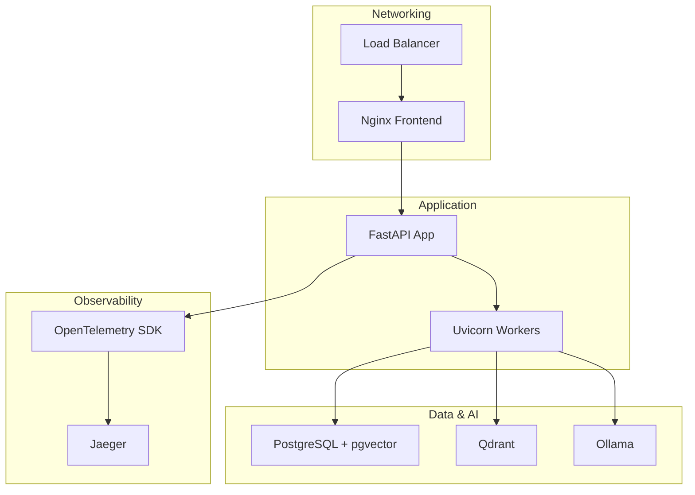
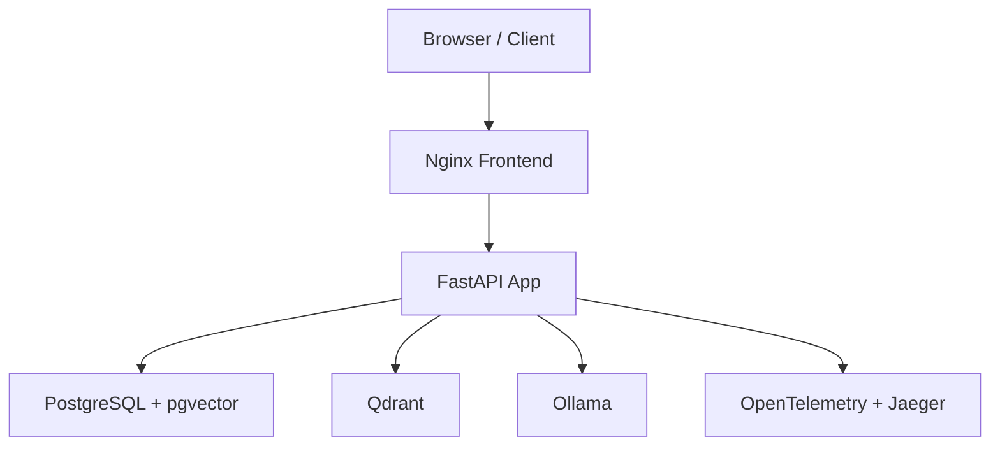
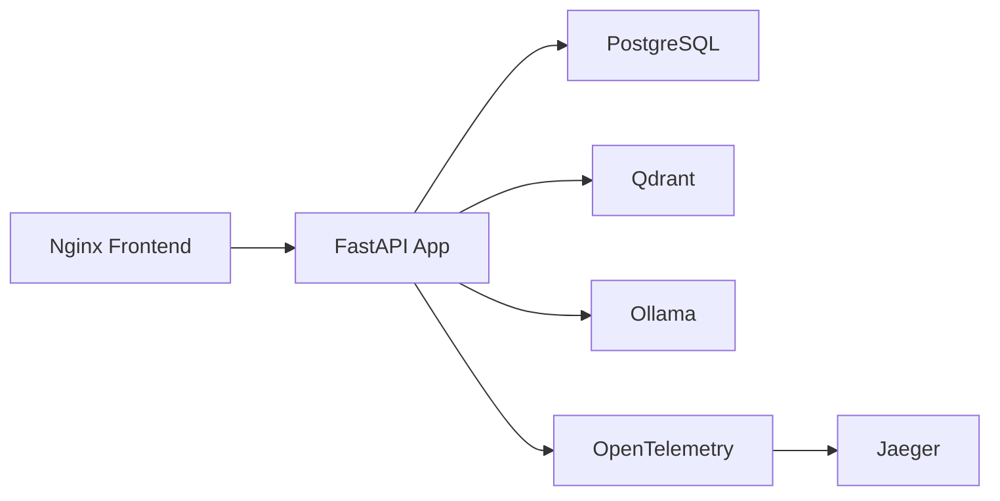
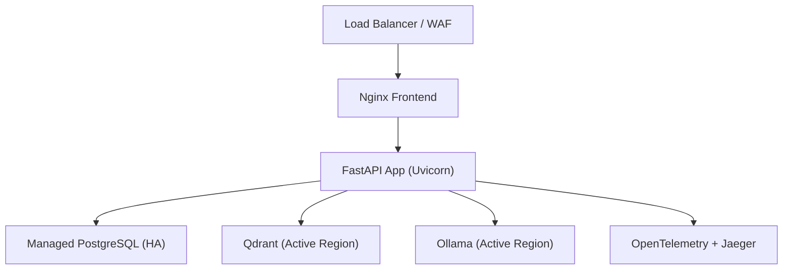

# Production Deployment

<cite>
**Referenced Files in This Document**
- [docker-compose.yml](file://safe4ai-pilot/docker-compose.yml)
- [docker-compose.override.yml](file://safe4ai-pilot/docker-compose.override.yml)
- [nginx.conf](file://safe4ai-pilot/frontend/nginx.conf)
- [Dockerfile.frontend](file://safe4ai-pilot/frontend/Dockerfile)
- [pyproject.toml](file://safe4ai-pilot/pyproject.toml)
- [main.py](file://safe4ai-pilot/app/main.py)
- [config.py](file://safe4ai-pilot/app/config.py)
- [models.py](file://safe4ai-pilot/app/db/models.py)
- [content_filter.py](file://safe4ai-pilot/app/security/content_filter.py)
- [input_guard.py](file://safe4ai-pilot/app/security/input_guard.py)
- [output_filter.py](file://safe4ai-pilot/app/security/output_filter.py)
- [backup.py](file://safe4ai-pilot/scripts/backup.py)
- [healthcheck.py](file://safe4ai-pilot/scripts/healthcheck.py)
- [deployment.md](file://safe4ai-pilot/docs/deployment.md)
- [architecture.md](file://safe4ai-pilot/docs/architecture.md)
- [alembic.ini](file://safe4ai-pilot/alembic.ini)
- [middleware.py](file://safe4ai-pilot/app/auth/middleware.py)
</cite>

## Table of Contents
1. [Introduction](#introduction)
2. [Project Structure](#project-structure)
3. [Core Components](#core-components)
4. [Architecture Overview](#architecture-overview)
5. [Detailed Component Analysis](#detailed-component-analysis)
6. [Dependency Analysis](#dependency-analysis)
7. [Performance Considerations](#performance-considerations)
8. [Troubleshooting Guide](#troubleshooting-guide)
9. [Conclusion](#conclusion)
10. [Appendices](#appendices)

## Introduction
This document provides enterprise-grade production deployment guidance for the Private AI system. It consolidates the existing development-time configuration and runtime behavior into a hardened, scalable, and observable production topology. It covers environment setup, secrets management, database and vector store configuration, backup and disaster recovery, frontend hosting, CDN and TLS integration, load balancing and high availability, performance tuning, monitoring, and security hardening aligned with regulatory requirements.

## Project Structure
The system is composed of:
- Backend API built with FastAPI and Uvicorn
- PostgreSQL with pgvector extension for relational and vector data
- Qdrant for retrieval augmented generation (RAG) vector storage
- Ollama for local LLM inference
- Frontend served via Nginx
- Observability with OpenTelemetry and Jaeger
- Alembic for database migrations
- Scripts for health checks and backups

**Diagram sources**
- [docker-compose.yml:1-119](file://safe4ai-pilot/docker-compose.yml#L1-L119)
- [main.py:63-101](file://safe4ai-pilot/app/main.py#L63-L101)
- [nginx.conf:1-29](file://safe4ai-pilot/frontend/nginx.conf#L1-L29)

**Section sources**
- [docker-compose.yml:1-119](file://safe4ai-pilot/docker-compose.yml#L1-L119)
- [deployment.md:1-122](file://safe4ai-pilot/docs/deployment.md#L1-L122)

## Core Components
- Application server: FastAPI with Uvicorn, CORS, secure headers, body size limiting, rate limiting, and health checks.
- Data plane: PostgreSQL with pgvector for audit logs, sessions, and metadata; Qdrant for document retrieval vectors.
- AI inference: Ollama for embeddings and LLMs.
- Frontend: Static SPA served by Nginx with reverse proxy to backend APIs.
- Observability: OpenTelemetry SDK and Jaeger for tracing.
- Security: Input guard, content filter, output filter, JWT auth with bcrypt, and CORS enforcement.

**Section sources**
- [main.py:1-154](file://safe4ai-pilot/app/main.py#L1-L154)
- [config.py:1-48](file://safe4ai-pilot/app/config.py#L1-L48)
- [models.py:1-182](file://safe4ai-pilot/app/db/models.py#L1-L182)
- [input_guard.py:1-49](file://safe4ai-pilot/app/security/input_guard.py#L1-L49)
- [content_filter.py:1-63](file://safe4ai-pilot/app/security/content_filter.py#L1-L63)
- [output_filter.py:1-60](file://safe4ai-pilot/app/security/output_filter.py#L1-L60)
- [middleware.py:1-83](file://safe4ai-pilot/app/auth/middleware.py#L1-L83)

## Architecture Overview
The system is a microservice-like composition packaged for local deployment but designed for containerized production. The frontend proxies API routes to the backend, while the backend orchestrates retrieval, reranking, and generation via Ollama, storing audit and session data in PostgreSQL and vectors in Qdrant.

**Diagram sources**
- [nginx.conf:14-24](file://safe4ai-pilot/frontend/nginx.conf#L14-L24)
- [main.py:63-101](file://safe4ai-pilot/app/main.py#L63-L101)
- [docker-compose.yml:75-103](file://safe4ai-pilot/docker-compose.yml#L75-L103)

## Detailed Component Analysis

### Environment and Secrets Management
- Environment variables are loaded from a .env file via Pydantic settings. Critical values include database URLs, AI service endpoints, model names, secret key, allowed origins, HTTPS enforcement, and upload limits.
- The secret key validator enforces minimum strength and rejects weak defaults.
- HTTPS enforcement flag is available for production ingress termination.

Recommended production practices:
- Store secrets in a secrets manager (e.g., HashiCorp Vault, AWS Secrets Manager, Azure Key Vault) and inject via platform-native secret mounts or KMS-encrypted env vars.
- Rotate SECRET_KEY regularly and invalidate active sessions.
- Disable development overrides in production; rely on CI/CD to populate environment variables.

**Section sources**
- [config.py:1-48](file://safe4ai-pilot/app/config.py#L1-L48)
- [deployment.md:31-35](file://safe4ai-pilot/docs/deployment.md#L31-L35)

### Database and Vector Store Configuration
- PostgreSQL is provisioned with pgvector extension and initialized at startup. Alembic manages schema migrations.
- Qdrant is used for high-volume vector retrieval; a snapshot API is available for backups.
- Ollama provides embeddings and LLMs; a warm-up routine preloads the model on startup.

Production hardening:
- Use managed PostgreSQL with automated backups, point-in-time recovery, and read replicas for HA.
- Enable logical replication and cross-region snapshots for DR.
- Configure Qdrant with persistence and snapshot scheduling; monitor disk usage and compaction.
- Set connection pooling and timeouts; enable SSL between app and databases.

**Section sources**
- [main.py:35-37](file://safe4ai-pilot/app/main.py#L35-L37)
- [alembic.ini:1-150](file://safe4ai-pilot/alembic.ini#L1-L150)
- [docker-compose.yml:2-16](file://safe4ai-pilot/docker-compose.yml#L2-L16)
- [docker-compose.yml:18-29](file://safe4ai-pilot/docker-compose.yml#L18-L29)
- [docker-compose.yml:31-44](file://safe4ai-pilot/docker-compose.yml#L31-L44)

### AI Inference and Model Warm-up
- Ollama is configured with a keep-alive duration to reduce cold-start latency.
- The app pre-warms the model on startup by invoking the generate endpoint with an empty prompt.

Production considerations:
- Provision adequate GPU/CPU resources per workload profile.
- Use model quantization and appropriate batch sizes.
- Implement circuit breakers and timeouts for inference calls.
- Monitor model latency and throughput; scale horizontally as needed.

**Section sources**
- [docker-compose.yml:37-44](file://safe4ai-pilot/docker-compose.yml#L37-L44)
- [main.py:104-116](file://safe4ai-pilot/app/main.py#L104-L116)

### Frontend Hosting and Reverse Proxy
- The frontend is built with Vite and served by Nginx. A reverse proxy forwards API routes to the backend and enables SPA fallback.
- Streaming endpoints (SSE) are proxied without buffering.

Production recommendations:
- Terminate TLS at the load balancer or ingress controller; configure HSTS and security headers.
- Enable compression and caching for static assets.
- Integrate a CDN for global distribution and DDoS mitigation.
- Add health probes for the frontend container.

**Section sources**
- [Dockerfile.frontend:1-14](file://safe4ai-pilot/frontend/Dockerfile#L1-L14)
- [nginx.conf:1-29](file://safe4ai-pilot/frontend/nginx.conf#L1-L29)

### Security Hardening
- Input guard validates and sanitizes queries, rejecting injection patterns and enforcing length limits.
- Content filter removes chunks containing PII before retrieval.
- Output filter detects hallucinated PII and suspiciously long outputs.
- JWT-based authentication with bcrypt-hashed passwords and role-based access control.
- Secure headers middleware sets recommended security headers.
- CORS is configurable and enforced.

Regulatory alignment:
- Embed PII detection and filtering into the retrieval pipeline.
- Log audit events with timestamps and trace IDs; retain according to policy.
- Implement access logging and monitor for anomalies.

**Section sources**
- [input_guard.py:1-49](file://safe4ai-pilot/app/security/input_guard.py#L1-L49)
- [content_filter.py:1-63](file://safe4ai-pilot/app/security/content_filter.py#L1-L63)
- [output_filter.py:1-60](file://safe4ai-pilot/app/security/output_filter.py#L1-L60)
- [middleware.py:1-83](file://safe4ai-pilot/app/auth/middleware.py#L1-L83)
- [main.py:78-95](file://safe4ai-pilot/app/main.py#L78-L95)

### Observability and Tracing
- OpenTelemetry SDK is included; Jaeger is available for distributed tracing.
- The app exposes a /health endpoint that checks PostgreSQL, Qdrant, and Ollama connectivity.

Production recommendations:
- Centralize logs and metrics; ingest OpenTelemetry traces and spans.
- Define SLOs for latency, error rates, and throughput.
- Instrument key business transactions and downstream service calls.

**Section sources**
- [pyproject.toml:30-32](file://safe4ai-pilot/pyproject.toml#L30-L32)
- [docker-compose.yml:62-74](file://safe4ai-pilot/docker-compose.yml#L62-L74)
- [main.py:118-147](file://safe4ai-pilot/app/main.py#L118-L147)

### Backup and Disaster Recovery
- The backup script performs:
  - PostgreSQL dump using pg_dump
  - Qdrant snapshot via REST API
  - Archive of raw data directory
- Healthcheck script verifies connectivity to all services.

Production DR:
- Schedule daily backups with retention aligned to audit policies.
- Test restore procedures regularly; maintain offsite copies.
- Automate snapshot creation and transfer to durable storage.

**Section sources**
- [backup.py:1-92](file://safe4ai-pilot/scripts/backup.py#L1-L92)
- [healthcheck.py:1-58](file://safe4ai-pilot/scripts/healthcheck.py#L1-L58)
- [deployment.md:108-122](file://safe4ai-pilot/docs/deployment.md#L108-L122)

## Dependency Analysis
The backend depends on three external services and integrates with observability tooling. The frontend depends on the backend API.

**Diagram sources**
- [nginx.conf:14-24](file://safe4ai-pilot/frontend/nginx.conf#L14-L24)
- [main.py:63-101](file://safe4ai-pilot/app/main.py#L63-L101)
- [docker-compose.yml:75-103](file://safe4ai-pilot/docker-compose.yml#L75-L103)

**Section sources**
- [docker-compose.yml:1-119](file://safe4ai-pilot/docker-compose.yml#L1-L119)
- [main.py:1-154](file://safe4ai-pilot/app/main.py#L1-L154)

## Performance Considerations
- Resource sizing:
  - GPU path: minimum 12 GB VRAM for chat models; 16 GB+ preferred.
  - CPU-only path: minimum 28 GB RAM; expect slower inference.
- Warm-up:
  - Ollama keep-alive and app pre-warm reduce cold-start latency.
- Throughput:
  - Scale Uvicorn workers behind a load balancer.
  - Tune model quantization and batch sizes.
- Storage:
  - Persist Qdrant and PostgreSQL volumes; monitor IOPS and throughput.
- Network:
  - Place services close to data to minimize latency.

**Section sources**
- [deployment.md:7-28](file://safe4ai-pilot/docs/deployment.md#L7-L28)

## Troubleshooting Guide
Common checks and remediation:
- Health endpoint: Verify /health returns “ok” and dependency statuses.
- Dependencies: Confirm Qdrant /readyz and Ollama /api/tags are reachable.
- Database: Ensure pgvector extension is enabled and migrations applied.
- Frontend: Validate reverse proxy routes and SPA fallback behavior.
- Logs: Inspect application logs for rate limit errors, PII filtering events, and inference failures.

Operational scripts:
- Use the healthcheck script to validate service readiness.
- Use the backup script to create snapshots and archives.

**Section sources**
- [main.py:118-147](file://safe4ai-pilot/app/main.py#L118-L147)
- [healthcheck.py:1-58](file://safe4ai-pilot/scripts/healthcheck.py#L1-L58)
- [deployment.md:55-75](file://safe4ai-pilot/docs/deployment.md#L55-L75)

## Conclusion
This guide transforms the development-time Docker Compose stack into a production-ready deployment. By applying robust environment management, hardened security controls, resilient data and AI infrastructure, and comprehensive observability, the system can operate reliably in enterprise environments. Align operational procedures with compliance requirements and continuously validate backup and recovery processes.

## Appendices

### A. Production Deployment Topology
- Single AZ: Backend, PostgreSQL, Qdrant, and Ollama co-located; CDN and TLS termination at the load balancer; Nginx serving the frontend.
- Multi-AZ: Use managed PostgreSQL with read replicas; deploy Qdrant and Ollama in active regions; mirror snapshots across zones.

[No sources needed since this diagram shows conceptual topology]

### B. Load Balancing and High Availability
- Horizontal scaling: Run multiple FastAPI/Uvicorn instances behind a load balancer.
- Health checks: Use /health for liveness and readiness probes.
- Sticky sessions: Not required for stateless API; sessions are stored server-side.
- CDN: Offload static assets; enable caching and compression.

[No sources needed since this section provides general guidance]

### C. SSL/TLS and Ingress
- Terminate TLS at the load balancer or ingress controller; configure strong ciphers and HSTS.
- Forward client certificates if mutual TLS is required.
- Use certificate automation (e.g., ACME) for renewals.

[No sources needed since this section provides general guidance]

### D. Monitoring and Alerting
- Metrics: CPU, memory, disk, network, database connections, vector store I/O, inference latency.
- Logs: Structured logs with trace IDs; centralize with a SIEM or log aggregation platform.
- Alerts: Thresholds for error rates, latency SLO breaches, disk full, and service downtime.

[No sources needed since this section provides general guidance]

### E. Compliance and Data Governance
- Data minimization: Limit audit log retention to required period.
- PII handling: Detect and redact PII in retrieval and generation; avoid logging sensitive content.
- Access control: Enforce RBAC and audit all administrative actions.
- Retention and deletion: Implement automated cleanup per policy; verify deletion across all stores.

[No sources needed since this section provides general guidance]