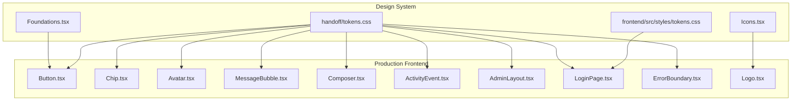
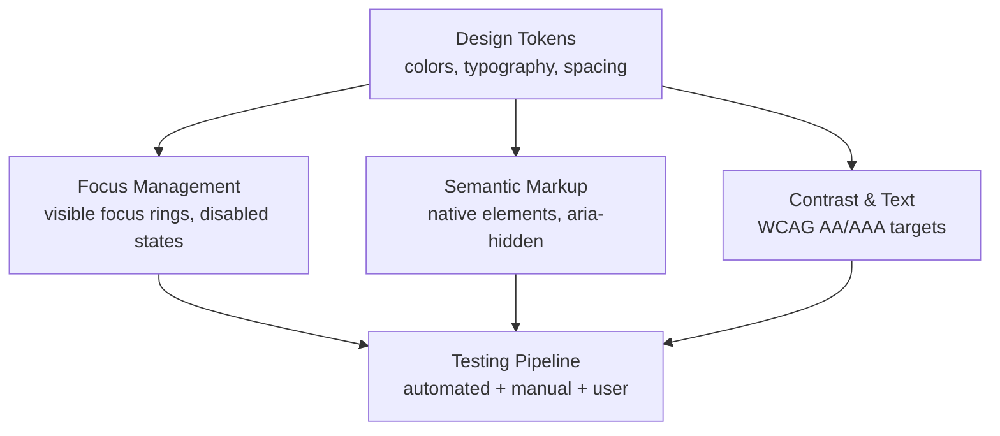
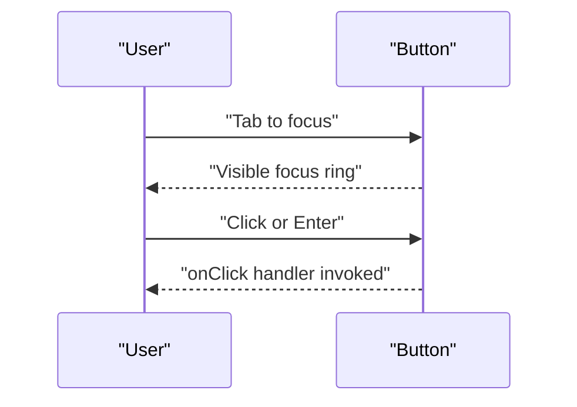
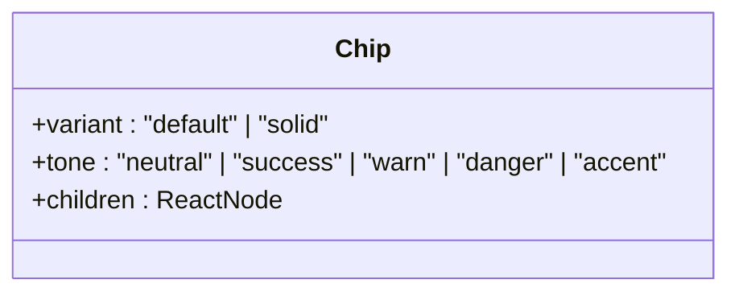
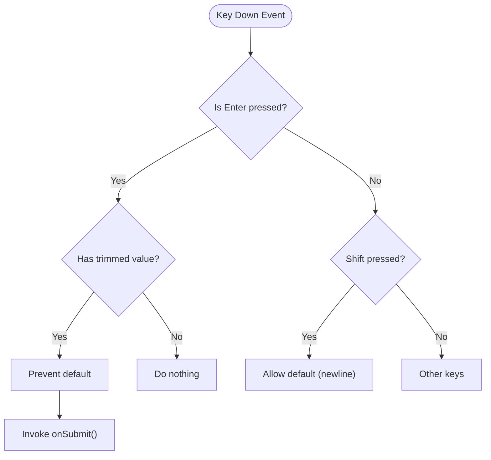
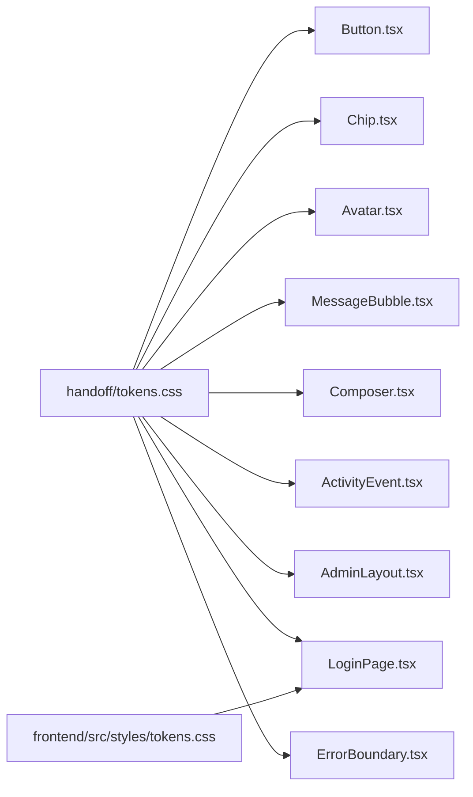

# Accessibility Guidelines

<cite>
**Referenced Files in This Document**
- [Foundations.tsx](file://design/components/Foundations.tsx)
- [Icons.tsx](file://design/components/Icons.tsx)
- [tokens.css](file://handoff/tokens.css)
- [tokens.css](file://safe4ai-pilot/frontend/src/styles/tokens.css)
- [Button.tsx](file://safe4ai-pilot/frontend/src/components/Button.tsx)
- [Chip.tsx](file://safe4ai-pilot/frontend/src/components/Chip.tsx)
- [Avatar.tsx](file://safe4ai-pilot/frontend/src/components/Avatar.tsx)
- [MessageBubble.tsx](file://safe4ai-pilot/frontend/src/components/chat/MessageBubble.tsx)
- [Composer.tsx](file://safe4ai-pilot/frontend/src/components/chat/Composer.tsx)
- [ActivityEvent.tsx](file://safe4ai-pilot/frontend/src/components/admin/ActivityEvent.tsx)
- [AdminLayout.tsx](file://safe4ai-pilot/frontend/src/pages/admin/AdminLayout.tsx)
- [LoginPage.tsx](file://safe4ai-pilot/frontend/src/pages/LoginPage.tsx)
- [ErrorBoundary.tsx](file://safe4ai-pilot/frontend/src/components/ErrorBoundary.tsx)
- [Logo.tsx](file://safe4ai-pilot/frontend/src/components/Logo.tsx)
</cite>

## Table of Contents
1. [Introduction](#introduction)
2. [Project Structure](#project-structure)
3. [Core Components](#core-components)
4. [Architecture Overview](#architecture-overview)
5. [Detailed Component Analysis](#detailed-component-analysis)
6. [Dependency Analysis](#dependency-analysis)
7. [Performance Considerations](#performance-considerations)
8. [Troubleshooting Guide](#troubleshooting-guide)
9. [Conclusion](#conclusion)
10. [Appendices](#appendices)

## Introduction
This document defines accessibility guidelines for the Private AI design system with a focus on WCAG conformance, semantic HTML usage, inclusive design patterns, and robust testing approaches. It consolidates requirements for keyboard navigation, screen reader support, focus management, color contrast, text alternatives, and ARIA usage. It also outlines testing methodologies (automated, manual, and user testing), inclusive design principles, remediation strategies, and ongoing maintenance procedures.

## Project Structure
The design system spans a design showcase and a production frontend. The design system’s foundations and primitives are demonstrated in the design folder, while the production components and pages live under the frontend directory. Design tokens define color, typography, spacing, and radii used consistently across components.

**Diagram sources**
- [Foundations.tsx:1-136](file://design/components/Foundations.tsx#L1-L136)
- [Icons.tsx:1-73](file://design/components/Icons.tsx#L1-L73)
- [tokens.css](file://handoff/tokens.css:1-90)
- [tokens.css](file://safe4ai-pilot/frontend/src/styles/tokens.css:1-69)
- [Button.tsx:1-56](file://safe4ai-pilot/frontend/src/components/Button.tsx#L1-L56)
- [Chip.tsx:1-32](file://safe4ai-pilot/frontend/src/components/Chip.tsx#L1-L32)
- [Avatar.tsx:1-15](file://safe4ai-pilot/frontend/src/components/Avatar.tsx#L1-L15)
- [MessageBubble.tsx:1-21](file://safe4ai-pilot/frontend/src/components/chat/MessageBubble.tsx#L1-L21)
- [Composer.tsx:1-69](file://safe4ai-pilot/frontend/src/components/chat/Composer.tsx#L1-L69)
- [ActivityEvent.tsx:1-83](file://safe4ai-pilot/frontend/src/components/admin/ActivityEvent.tsx#L1-L83)
- [AdminLayout.tsx:1-106](file://safe4ai-pilot/frontend/src/pages/admin/AdminLayout.tsx#L1-L106)
- [LoginPage.tsx:1-165](file://safe4ai-pilot/frontend/src/pages/LoginPage.tsx#L1-L165)
- [ErrorBoundary.tsx:1-43](file://safe4ai-pilot/frontend/src/components/ErrorBoundary.tsx#L1-L43)
- [Logo.tsx:1-10](file://safe4ai-pilot/frontend/src/components/Logo.tsx#L1-L10)

**Section sources**
- [Foundations.tsx:1-136](file://design/components/Foundations.tsx#L1-L136)
- [Icons.tsx:1-73](file://design/components/Icons.tsx#L1-L73)
- [tokens.css](file://handoff/tokens.css:1-90)
- [tokens.css](file://safe4ai-pilot/frontend/src/styles/tokens.css:1-69)

## Core Components
This section summarizes the accessibility baseline for core components and primitives used across the system.

- Focus management
  - Buttons and interactive controls use visible focus indicators via ring-based focus styles.
  - Disabled states are clearly indicated to prevent tab trapping and ensure keyboard users can skip disabled items.
- Keyboard navigation
  - Interactive elements are keyboard operable (e.g., buttons, links, form controls).
  - Composite widgets (e.g., textarea in Composer) implement Enter/Shift+Enter behavior for submission.
- Screen reader support
  - Decorative icons and nodes use aria-hidden to avoid redundant announcements.
  - Status chips and badges communicate meaning through text and color; ensure sufficient contrast and readable sizes.
- Color and contrast
  - Tokens define a consistent palette and text hierarchy. Ensure a minimum contrast ratio of 4.5:1 for normal text and 3:1 for large text against backgrounds.
- Text alternatives
  - Icons without text are decorative (aria-hidden). Functional icons paired with text should expose meaningful alt text or labels.
- ARIA usage
  - Prefer native semantics. Reserve ARIA roles and attributes for dynamic content or custom widgets.

**Section sources**
- [Button.tsx:34-55](file://safe4ai-pilot/frontend/src/components/Button.tsx#L34-L55)
- [Chip.tsx:24-31](file://safe4ai-pilot/frontend/src/components/Chip.tsx#L24-L31)
- [Avatar.tsx:3-14](file://safe4ai-pilot/frontend/src/components/Avatar.tsx#L3-L14)
- [Composer.tsx:18-23](file://safe4ai-pilot/frontend/src/components/chat/Composer.tsx#L18-L23)
- [ActivityEvent.tsx:38-39](file://safe4ai-pilot/frontend/src/components/admin/ActivityEvent.tsx#L38-L39)
- [tokens.css](file://handoff/tokens.css:7-89)
- [tokens.css](file://safe4ai-pilot/frontend/src/styles/tokens.css:1-68)

## Architecture Overview
The accessibility architecture centers on shared design tokens, consistent focus management, and semantic markup across components. The design system demonstrates primitives and patterns; the production frontend applies these patterns to real components.

[No sources needed since this diagram shows conceptual architecture]

## Detailed Component Analysis

### Button
- Keyboard navigation: Operable via Enter/Space; supports submit/reset types.
- Focus management: Visible ring-based focus indicator; disabled state prevents focus and interaction.
- Screen reader: Native button semantics; ensure meaningful text content.
- ARIA: Not required for native button; avoid overriding semantics.

**Diagram sources**
- [Button.tsx:34-55](file://safe4ai-pilot/frontend/src/components/Button.tsx#L34-L55)

**Section sources**
- [Button.tsx:34-55](file://safe4ai-pilot/frontend/src/components/Button.tsx#L34-L55)

### Chip
- Purpose: Lightweight status indicators with optional colored dot.
- Accessibility: Uses span; ensure sufficient color contrast and readable text size.
- Screen reader: Announces inner text; dot is presentational.

**Diagram sources**
- [Chip.tsx:22-31](file://safe4ai-pilot/frontend/src/components/Chip.tsx#L22-L31)

**Section sources**
- [Chip.tsx:24-31](file://safe4ai-pilot/frontend/src/components/Chip.tsx#L24-L31)

### Avatar
- Purpose: Initials-based user identity.
- Accessibility: Presentational; ensure contrast with background and readable font size.

**Section sources**
- [Avatar.tsx:3-14](file://safe4ai-pilot/frontend/src/components/Avatar.tsx#L3-L14)

### MessageBubble
- Purpose: Chat message container with directional styling.
- Accessibility: Uses semantic divs; ensure sufficient contrast and readable line height.

**Section sources**
- [MessageBubble.tsx:5-20](file://safe4ai-pilot/frontend/src/components/chat/MessageBubble.tsx#L5-L20)

### Composer
- Keyboard navigation: Enter submits; Shift+Enter allows newline; disabled state prevents submission.
- Focus management: Focus-visible ring on textarea; focus-within styles for container.
- Screen reader: Multiline text area with placeholder; ensure labels are associated externally when used in forms.

**Diagram sources**
- [Composer.tsx:18-23](file://safe4ai-pilot/frontend/src/components/chat/Composer.tsx#L18-L23)

**Section sources**
- [Composer.tsx:15-68](file://safe4ai-pilot/frontend/src/components/chat/Composer.tsx#L15-L68)

### ActivityEvent
- Decorative timeline node: aria-hidden to avoid screen reader verbosity.
- Status badges: Communicate meaning via color and text; ensure contrast and readable sizes.

**Section sources**
- [ActivityEvent.tsx:21-82](file://safe4ai-pilot/frontend/src/components/admin/ActivityEvent.tsx#L21-L82)

### AdminLayout
- Navigation: Semantic nav with links; active state indicated visually; keyboard operable.
- Focus management: Links receive focus; ensure visible focus styles persist across interactions.

**Section sources**
- [AdminLayout.tsx:25-105](file://safe4ai-pilot/frontend/src/pages/admin/AdminLayout.tsx#L25-L105)

### LoginPage
- Forms: Proper labels and input types; focus-visible ring on inputs; disabled states for SSO and “forgot password” placeholders.
- Error messaging: Accessible error container with sufficient contrast.

**Section sources**
- [LoginPage.tsx:17-164](file://safe4ai-pilot/frontend/src/pages/LoginPage.tsx#L17-L164)

### ErrorBoundary
- Purpose: Graceful degradation on UI errors.
- Accessibility: Clear headings and actionable button; ensure focus moves into the error view after rendering.

**Section sources**
- [ErrorBoundary.tsx:13-42](file://safe4ai-pilot/frontend/src/components/ErrorBoundary.tsx#L13-L42)

### Logo
- Purpose: Brand iconography.
- Accessibility: Presentational SVG; ensure appropriate size and contrast.

**Section sources**
- [Logo.tsx:1-10](file://safe4ai-pilot/frontend/src/components/Logo.tsx#L1-L10)

### Icons
- Implementation: Reusable SVG components with currentColor defaults.
- Accessibility: Use aria-hidden for purely decorative icons; pair functional icons with accessible labels.

**Section sources**
- [Icons.tsx:11-28](file://design/components/Icons.tsx#L11-L28)
- [Icons.tsx:30-72](file://design/components/Icons.tsx#L30-L72)

## Dependency Analysis
Design tokens underpin color, typography, and spacing used across components. Consistent token usage ensures predictable contrast and readability.

**Diagram sources**
- [tokens.css](file://handoff/tokens.css:7-89)
- [tokens.css](file://safe4ai-pilot/frontend/src/styles/tokens.css:1-68)
- [Button.tsx:1-56](file://safe4ai-pilot/frontend/src/components/Button.tsx#L1-L56)
- [Chip.tsx:1-32](file://safe4ai-pilot/frontend/src/components/Chip.tsx#L1-L32)
- [Avatar.tsx:1-15](file://safe4ai-pilot/frontend/src/components/Avatar.tsx#L1-L15)
- [MessageBubble.tsx:1-21](file://safe4ai-pilot/frontend/src/components/chat/MessageBubble.tsx#L1-L21)
- [Composer.tsx:1-69](file://safe4ai-pilot/frontend/src/components/chat/Composer.tsx#L1-L69)
- [ActivityEvent.tsx:1-83](file://safe4ai-pilot/frontend/src/components/admin/ActivityEvent.tsx#L1-L83)
- [AdminLayout.tsx:1-106](file://safe4ai-pilot/frontend/src/pages/admin/AdminLayout.tsx#L1-L106)
- [LoginPage.tsx:1-165](file://safe4ai-pilot/frontend/src/pages/LoginPage.tsx#L1-L165)
- [ErrorBoundary.tsx:1-43](file://safe4ai-pilot/frontend/src/components/ErrorBoundary.tsx#L1-L43)

**Section sources**
- [tokens.css](file://handoff/tokens.css:7-89)
- [tokens.css](file://safe4ai-pilot/frontend/src/styles/tokens.css:1-68)

## Performance Considerations
- Prefer native elements to reduce overhead and improve assistive technology compatibility.
- Minimize DOM depth for interactive regions to simplify keyboard navigation.
- Keep focus traps scoped to modals or dialogs; avoid global focus locking.
- Defer heavy computations during focus transitions to maintain responsiveness.

[No sources needed since this section provides general guidance]

## Troubleshooting Guide
Common issues and remediation strategies:
- Low contrast text
  - Verify contrast ratios using tokens and WCAG guidelines; adjust color or background.
- Disabled focus styles
  - Ensure disabled states still convey state and do not trap focus.
- Non-semantic markup
  - Replace divs with native buttons/links; use aria-hidden for purely decorative graphics.
- Poor keyboard navigation
  - Confirm Enter/Space handlers and Shift+Enter behavior; test Tab order.
- Inaccessible form controls
  - Associate labels; announce error messages; ensure focus moves into error containers.

**Section sources**
- [Button.tsx:34-55](file://safe4ai-pilot/frontend/src/components/Button.tsx#L34-L55)
- [Composer.tsx:18-23](file://safe4ai-pilot/frontend/src/components/chat/Composer.tsx#L18-L23)
- [ActivityEvent.tsx:38-39](file://safe4ai-pilot/frontend/src/components/admin/ActivityEvent.tsx#L38-L39)
- [LoginPage.tsx:109-158](file://safe4ai-pilot/frontend/src/pages/LoginPage.tsx#L109-L158)

## Conclusion
The Private AI design system establishes a strong foundation for accessibility through consistent design tokens, semantic markup, and disciplined focus management. By adhering to WCAG guidelines, prioritizing inclusive design, and maintaining rigorous testing practices, the system can deliver equitable experiences across diverse users.

[No sources needed since this section summarizes without analyzing specific files]

## Appendices

### WCAG Conformance Targets
- Level AA: Minimum 4.5:1 for normal text, 3:1 for large text; sufficient contrast across backgrounds.
- Level AAA: Preferred for critical content and controls.

**Section sources**
- [tokens.css](file://handoff/tokens.css:7-89)
- [tokens.css](file://safe4ai-pilot/frontend/src/styles/tokens.css:1-68)

### Accessibility Testing Checklist
- Automated
  - Run axe-core or similar in CI for regressions.
  - Snapshot testing for color contrast and focus visibility.
- Manual
  - Full keyboard-only navigation across all pages.
  - Screen reader testing (NVDA/JAWS/VoiceOver) for major flows.
- User
  - Recruit users with disabilities for usability studies.
  - Collect feedback on focus, navigation, and comprehension.

[No sources needed since this section provides general guidance]

### Inclusive Design Principles
- Cognitive accessibility
  - Predictable layouts, clear labels, minimal cognitive load.
- Motor accessibility
  - Adequate target sizes, generous spacing, tolerance for slow or imprecise input.
- Sensory accessibility
  - Complement visual cues with text and sound; avoid relying solely on color.

[No sources needed since this section provides general guidance]