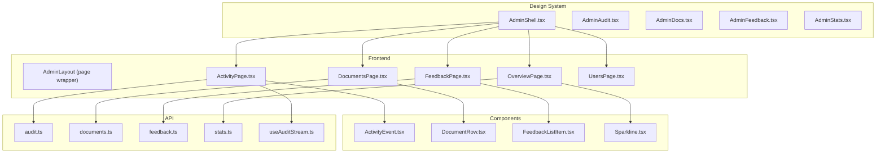
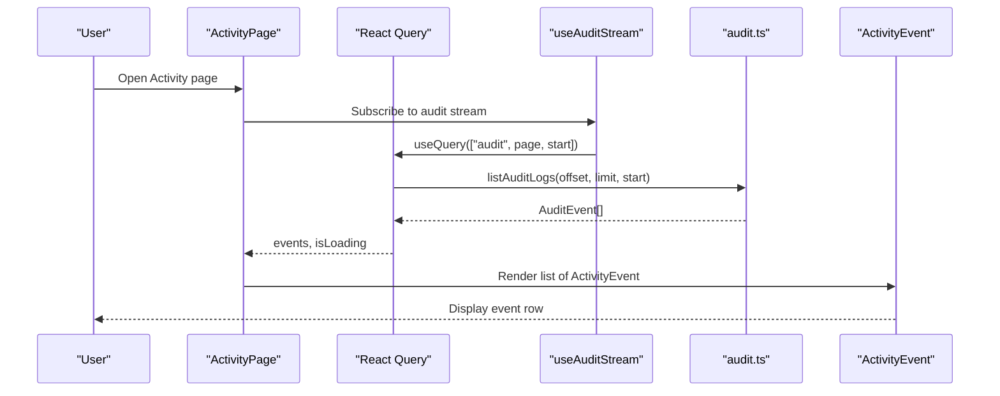
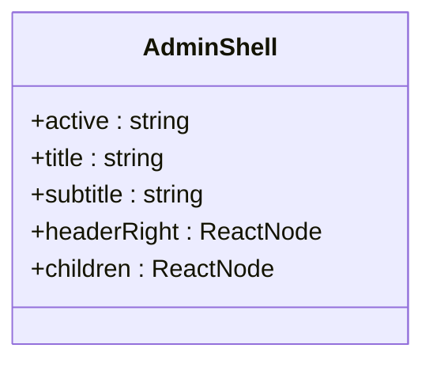
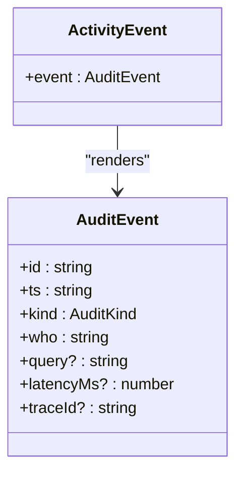
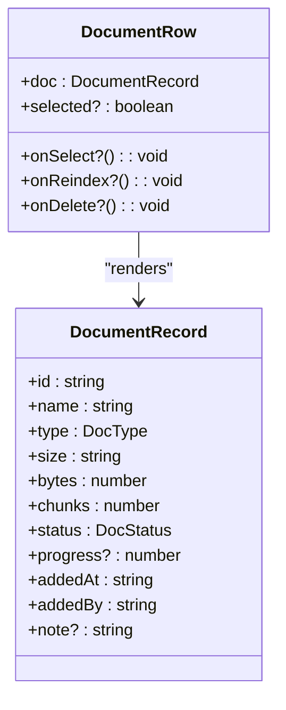
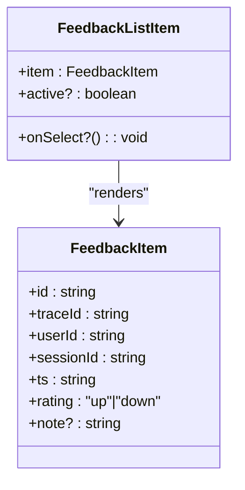
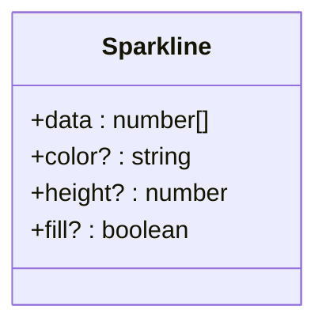
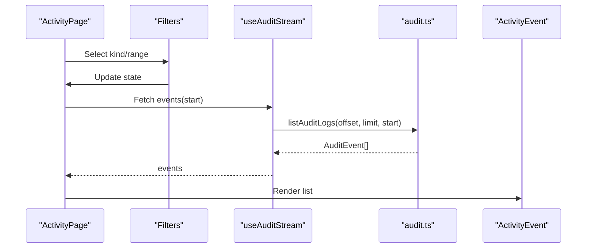
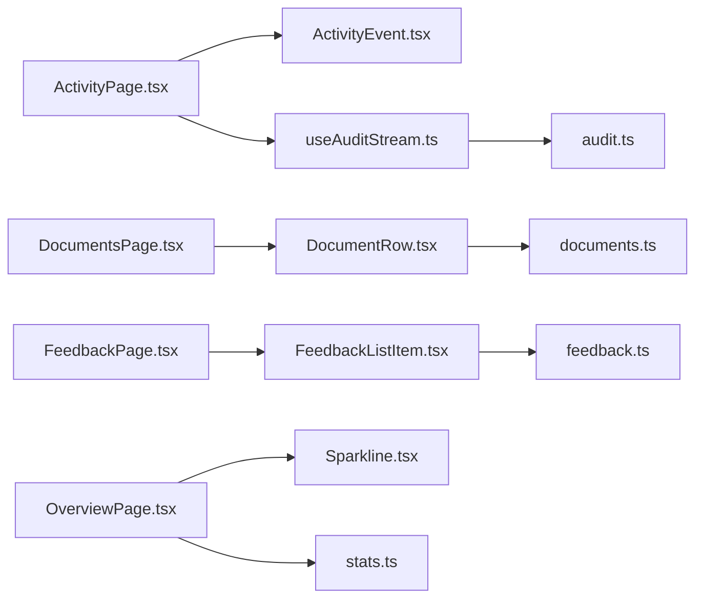

# Administrative Components

<cite>
**Referenced Files in This Document**
- [AdminShell.tsx](file://design/components/AdminShell.tsx)
- [AdminAudit.tsx](file://design/components/AdminAudit.tsx)
- [AdminDocs.tsx](file://design/components/AdminDocs.tsx)
- [AdminFeedback.tsx](file://design/components/AdminFeedback.tsx)
- [AdminStats.tsx](file://design/components/AdminStats.tsx)
- [ActivityEvent.tsx](file://safe4ai-pilot/frontend/src/components/admin/ActivityEvent.tsx)
- [DocumentRow.tsx](file://safe4ai-pilot/frontend/src/components/admin/DocumentRow.tsx)
- [FeedbackListItem.tsx](file://safe4ai-pilot/frontend/src/components/admin/FeedbackListItem.tsx)
- [Sparkline.tsx](file://safe4ai-pilot/frontend/src/components/admin/Sparkline.tsx)
- [ActivityPage.tsx](file://safe4ai-pilot/frontend/src/pages/admin/ActivityPage.tsx)
- [audit.ts](file://safe4ai-pilot/frontend/src/api/audit.ts)
- [documents.ts](file://safe4ai-pilot/frontend/src/api/documents.ts)
- [feedback.ts](file://safe4ai-pilot/frontend/src/api/feedback.ts)
- [stats.ts](file://safe4ai-pilot/frontend/src/api/stats.ts)
- [useAuditStream.ts](file://safe4ai-pilot/frontend/src/hooks/useAuditStream.ts)
</cite>

## Table of Contents
1. [Introduction](#introduction)
2. [Project Structure](#project-structure)
3. [Core Components](#core-components)
4. [Architecture Overview](#architecture-overview)
5. [Detailed Component Analysis](#detailed-component-analysis)
6. [Dependency Analysis](#dependency-analysis)
7. [Performance Considerations](#performance-considerations)
8. [Troubleshooting Guide](#troubleshooting-guide)
9. [Conclusion](#conclusion)
10. [Appendices](#appendices)

## Introduction
This document describes the administrative dashboard components in the Private AI system. It focuses on the admin shell layout, activity audit display, document management, feedback handling, and statistics visualization. It explains the admin interface architecture, navigation patterns, data presentation strategies, component props, data fetching patterns, state management, API integrations, permissions, role-based access, responsive design, and accessibility considerations.

## Project Structure
The admin UI is implemented in the frontend of the pilot service. The design system also includes a set of presentational components in the design directory. The admin pages integrate with typed APIs and shared components.

**Diagram sources**
- [AdminShell.tsx:1-119](file://design/components/AdminShell.tsx#L1-L119)
- [AdminAudit.tsx:1-278](file://design/components/AdminAudit.tsx#L1-L278)
- [AdminDocs.tsx:1-238](file://design/components/AdminDocs.tsx#L1-L238)
- [AdminFeedback.tsx:1-215](file://design/components/AdminFeedback.tsx#L1-L215)
- [AdminStats.tsx:1-258](file://design/components/AdminStats.tsx#L1-L258)
- [ActivityPage.tsx:1-147](file://safe4ai-pilot/frontend/src/pages/admin/ActivityPage.tsx#L1-L147)
- [ActivityEvent.tsx:1-83](file://safe4ai-pilot/frontend/src/components/admin/ActivityEvent.tsx#L1-L83)
- [DocumentRow.tsx:1-100](file://safe4ai-pilot/frontend/src/components/admin/DocumentRow.tsx#L1-L100)
- [FeedbackListItem.tsx:1-30](file://safe4ai-pilot/frontend/src/components/admin/FeedbackListItem.tsx#L1-L30)
- [Sparkline.tsx:1-26](file://safe4ai-pilot/frontend/src/components/admin/Sparkline.tsx#L1-L26)
- [audit.ts:1-54](file://safe4ai-pilot/frontend/src/api/audit.ts#L1-L54)
- [documents.ts:1-68](file://safe4ai-pilot/frontend/src/api/documents.ts#L1-L68)
- [feedback.ts:1-44](file://safe4ai-pilot/frontend/src/api/feedback.ts#L1-L44)
- [stats.ts:1-31](file://safe4ai-pilot/frontend/src/api/stats.ts#L1-L31)
- [useAuditStream.ts:1-17](file://safe4ai-pilot/frontend/src/hooks/useAuditStream.ts#L1-L17)

**Section sources**
- [AdminShell.tsx:1-119](file://design/components/AdminShell.tsx#L1-L119)
- [AdminAudit.tsx:1-278](file://design/components/AdminAudit.tsx#L1-L278)
- [AdminDocs.tsx:1-238](file://design/components/AdminDocs.tsx#L1-L238)
- [AdminFeedback.tsx:1-215](file://design/components/AdminFeedback.tsx#L1-L215)
- [AdminStats.tsx:1-258](file://design/components/AdminStats.tsx#L1-L258)
- [ActivityPage.tsx:1-147](file://safe4ai-pilot/frontend/src/pages/admin/ActivityPage.tsx#L1-L147)

## Core Components
- AdminShell: Provides the main admin layout with sidebar navigation, header, and content area. Accepts active route, title, subtitle, and headerRight slot.
- ActivityEvent: Renders a single audit event row with kind badges, metadata, content, and trace.
- DocumentRow: Renders a single document row with type badge, status chip, actions, and selection affordances.
- FeedbackListItem: Renders a single feedback entry with rating icon, user info, note preview, and timestamp.
- Sparkline: Lightweight SVG sparkline for trend visualization.

**Section sources**
- [AdminShell.tsx:4-119](file://design/components/AdminShell.tsx#L4-L119)
- [ActivityEvent.tsx:19-83](file://safe4ai-pilot/frontend/src/components/admin/ActivityEvent.tsx#L19-L83)
- [DocumentRow.tsx:22-100](file://safe4ai-pilot/frontend/src/components/admin/DocumentRow.tsx#L22-L100)
- [FeedbackListItem.tsx:4-30](file://safe4ai-pilot/frontend/src/components/admin/FeedbackListItem.tsx#L4-L30)
- [Sparkline.tsx:1-26](file://safe4ai-pilot/frontend/src/components/admin/Sparkline.tsx#L1-L26)

## Architecture Overview
The admin UI follows a page-per-section pattern with a shared shell. Pages render lists or dashboards and delegate individual item rendering to dedicated components. Data is fetched via typed API modules and cached/revalidated with React Query.

**Diagram sources**
- [ActivityPage.tsx:32-51](file://safe4ai-pilot/frontend/src/pages/admin/ActivityPage.tsx#L32-L51)
- [useAuditStream.ts:5-16](file://safe4ai-pilot/frontend/src/hooks/useAuditStream.ts#L5-L16)
- [audit.ts:34-50](file://safe4ai-pilot/frontend/src/api/audit.ts#L34-L50)
- [ActivityEvent.tsx:21-83](file://safe4ai-pilot/frontend/src/components/admin/ActivityEvent.tsx#L21-L83)

## Detailed Component Analysis

### AdminShell Layout
AdminShell composes the admin shell with a fixed-width sidebar, header, and scrollable content area. It exposes props for active navigation, title, subtitle, and headerRight content. The sidebar renders navigation items and a user footer.

**Diagram sources**
- [AdminShell.tsx:4-119](file://design/components/AdminShell.tsx#L4-L119)

**Section sources**
- [AdminShell.tsx:12-119](file://design/components/AdminShell.tsx#L12-L119)

### ActivityEvent (Audit Item)
ActivityEvent displays a single audit event with:
- Timestamp derived from ISO timestamp
- Kind badge mapped to label and colors
- User identity and optional role
- Query text with quotation marks
- Optional latency and freshness indicators
- Trace ID footer

**Diagram sources**
- [ActivityEvent.tsx:19-83](file://safe4ai-pilot/frontend/src/components/admin/ActivityEvent.tsx#L19-L83)
- [audit.ts:5-13](file://safe4ai-pilot/frontend/src/api/audit.ts#L5-L13)

**Section sources**
- [ActivityEvent.tsx:21-83](file://safe4ai-pilot/frontend/src/components/admin/ActivityEvent.tsx#L21-L83)
- [audit.ts:25-50](file://safe4ai-pilot/frontend/src/api/audit.ts#L25-L50)

### DocumentRow (Document Management)
DocumentRow renders a single document row with:
- Type badge with background/text
- Name with optional note
- Chunk count and size
- Status chip with spinner for in-progress
- Added date and user
- Action button (e.g., reindex) with hover visibility

**Diagram sources**
- [DocumentRow.tsx:22-100](file://safe4ai-pilot/frontend/src/components/admin/DocumentRow.tsx#L22-L100)
- [documents.ts:6-18](file://safe4ai-pilot/frontend/src/api/documents.ts#L6-L18)

**Section sources**
- [DocumentRow.tsx:30-99](file://safe4ai-pilot/frontend/src/components/admin/DocumentRow.tsx#L30-L99)
- [documents.ts:29-44](file://safe4ai-pilot/frontend/src/api/documents.ts#L29-L44)

### FeedbackListItem (Feedback Handling)
FeedbackListItem renders a single feedback item with:
- Rating icon (positive/negative)
- User identifier
- Note preview or default label
- Relative timestamp

**Diagram sources**
- [FeedbackListItem.tsx:4-30](file://safe4ai-pilot/frontend/src/components/admin/FeedbackListItem.tsx#L4-L30)
- [feedback.ts:3-11](file://safe4ai-pilot/frontend/src/api/feedback.ts#L3-L11)

**Section sources**
- [FeedbackListItem.tsx:6-29](file://safe4ai-pilot/frontend/src/components/admin/FeedbackListItem.tsx#L6-L29)
- [feedback.ts:30-43](file://safe4ai-pilot/frontend/src/api/feedback.ts#L30-L43)

### Sparkline (Analytics Visualization)
Sparkline renders a lightweight SVG sparkline for trends:
- Normalized path from min/max
- Optional filled area
- End dot marker

**Diagram sources**
- [Sparkline.tsx:1-26](file://safe4ai-pilot/frontend/src/components/admin/Sparkline.tsx#L1-L26)

**Section sources**
- [Sparkline.tsx:3-25](file://safe4ai-pilot/frontend/src/components/admin/Sparkline.tsx#L3-L25)

### Activity Page (Audit Stream)
ActivityPage integrates filters, live stream, and export:
- Kind filter mapping to AuditKind
- Range filter to start timestamps
- useAuditStream hook for paginated, refetched data
- Export CSV via admin endpoint

**Diagram sources**
- [ActivityPage.tsx:10-30](file://safe4ai-pilot/frontend/src/pages/admin/ActivityPage.tsx#L10-L30)
- [ActivityPage.tsx:32-51](file://safe4ai-pilot/frontend/src/pages/admin/ActivityPage.tsx#L32-L51)
- [useAuditStream.ts:5-16](file://safe4ai-pilot/frontend/src/hooks/useAuditStream.ts#L5-L16)
- [audit.ts:34-50](file://safe4ai-pilot/frontend/src/api/audit.ts#L34-L50)

**Section sources**
- [ActivityPage.tsx:32-147](file://safe4ai-pilot/frontend/src/pages/admin/ActivityPage.tsx#L32-L147)
- [useAuditStream.ts:5-16](file://safe4ai-pilot/frontend/src/hooks/useAuditStream.ts#L5-L16)

### Design System Admin Pages
The design directory includes AdminAudit, AdminDocs, AdminFeedback, and AdminStats pages. These demonstrate:
- Audit timeline with filters and export
- Documents table with inspector panel
- Feedback list with detail pane
- Overview dashboard with charts and metrics

These components wrap their respective shells and compose the same underlying components and APIs.

**Section sources**
- [AdminAudit.tsx:5-278](file://design/components/AdminAudit.tsx#L5-L278)
- [AdminDocs.tsx:5-238](file://design/components/AdminDocs.tsx#L5-L238)
- [AdminFeedback.tsx:5-215](file://design/components/AdminFeedback.tsx#L5-L215)
- [AdminStats.tsx:5-258](file://design/components/AdminStats.tsx#L5-L258)

## Dependency Analysis
- Pages depend on shared components for rendering items.
- Components depend on typed API modules for data.
- ActivityPage uses a React Query hook for streaming/paginated data.
- AdminShell is reused across pages to maintain consistent layout and navigation.

**Diagram sources**
- [ActivityPage.tsx:3-8](file://safe4ai-pilot/frontend/src/pages/admin/ActivityPage.tsx#L3-L8)
- [ActivityEvent.tsx:1-2](file://safe4ai-pilot/frontend/src/components/admin/ActivityEvent.tsx#L1-L2)
- [useAuditStream.ts:1-3](file://safe4ai-pilot/frontend/src/hooks/useAuditStream.ts#L1-L3)
- [audit.ts:1-1](file://safe4ai-pilot/frontend/src/api/audit.ts#L1-L1)
- [DocumentRow.tsx:1-3](file://safe4ai-pilot/frontend/src/components/admin/DocumentRow.tsx#L1-L3)
- [documents.ts:1-1](file://safe4ai-pilot/frontend/src/api/documents.ts#L1-L1)
- [FeedbackListItem.tsx:1-2](file://safe4ai-pilot/frontend/src/components/admin/FeedbackListItem.tsx#L1-L2)
- [feedback.ts:1-1](file://safe4ai-pilot/frontend/src/api/feedback.ts#L1-L1)
- [Sparkline.tsx:1-1](file://safe4ai-pilot/frontend/src/components/admin/Sparkline.tsx#L1-L1)
- [stats.ts:1-1](file://safe4ai-pilot/frontend/src/api/stats.ts#L1-L1)

**Section sources**
- [ActivityPage.tsx:1-147](file://safe4ai-pilot/frontend/src/pages/admin/ActivityPage.tsx#L1-L147)
- [audit.ts:1-54](file://safe4ai-pilot/frontend/src/api/audit.ts#L1-L54)
- [documents.ts:1-68](file://safe4ai-pilot/frontend/src/api/documents.ts#L1-L68)
- [feedback.ts:1-44](file://safe4ai-pilot/frontend/src/api/feedback.ts#L1-L44)
- [stats.ts:1-31](file://safe4ai-pilot/frontend/src/api/stats.ts#L1-L31)

## Performance Considerations
- Infinite scrolling/streaming: useAuditStream paginates and refetches periodically to keep the feed fresh without reloading.
- Minimal re-renders: ActivityEvent and other item components are pure and rely on stable keys.
- Efficient charts: Sparkline computes normalized points once per render.
- Lazy loading: Pages split content into sections to avoid rendering heavy charts until scrolled into view.

[No sources needed since this section provides general guidance]

## Troubleshooting Guide
- Activity stream not updating:
  - Verify refetch interval and query key in the hook.
  - Confirm network requests to the audit endpoint.
- Export CSV download fails:
  - Ensure credentials mode and endpoint availability.
- Document status stuck:
  - Check polling intervals and status endpoints.
- Feedback list empty:
  - Validate admin endpoint permissions and data presence.

**Section sources**
- [useAuditStream.ts:5-16](file://safe4ai-pilot/frontend/src/hooks/useAuditStream.ts#L5-L16)
- [audit.ts:52-54](file://safe4ai-pilot/frontend/src/api/audit.ts#L52-L54)
- [documents.ts:46-68](file://safe4ai-pilot/frontend/src/api/documents.ts#L46-L68)
- [feedback.ts:30-43](file://safe4ai-pilot/frontend/src/api/feedback.ts#L30-L43)

## Conclusion
The admin UI leverages a clean separation of concerns: a reusable shell, typed APIs, and small, focused components. The design supports efficient data flows, live updates, and rich visualizations while maintaining a consistent UX across pages.

[No sources needed since this section summarizes without analyzing specific files]

## Appendices

### API Definitions and Contracts
- Audit logs: list and export endpoints with kind and timestamp mapping.
- Documents: CRUD operations and status polling.
- Feedback: listing and submission endpoints.
- Stats: daily metrics aggregation.

**Section sources**
- [audit.ts:34-54](file://safe4ai-pilot/frontend/src/api/audit.ts#L34-L54)
- [documents.ts:43-68](file://safe4ai-pilot/frontend/src/api/documents.ts#L43-L68)
- [feedback.ts:30-43](file://safe4ai-pilot/frontend/src/api/feedback.ts#L30-L43)
- [stats.ts:20-31](file://safe4ai-pilot/frontend/src/api/stats.ts#L20-L31)

### Accessibility and Responsive Notes
- Use semantic headings and roles in list containers.
- Ensure focus order aligns with visual layout.
- Provide sufficient contrast for status chips and badges.
- Keep interactive targets accessible-sized.
- Test keyboard navigation for filter rails and action buttons.

[No sources needed since this section provides general guidance]