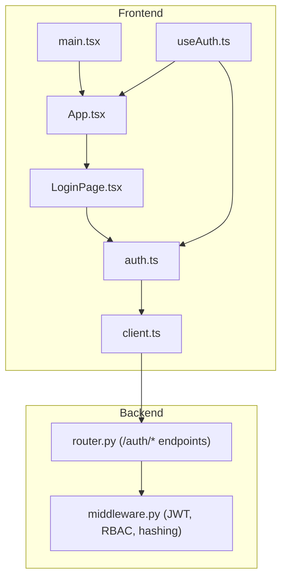
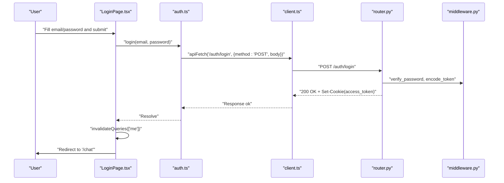
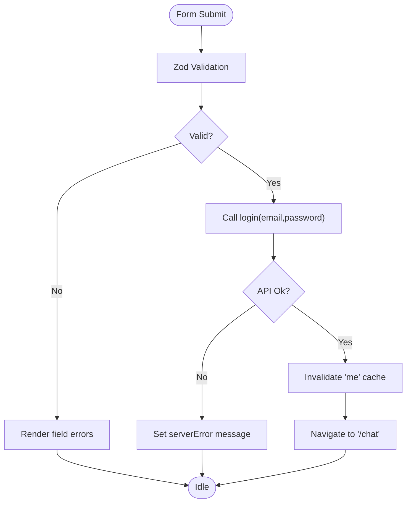
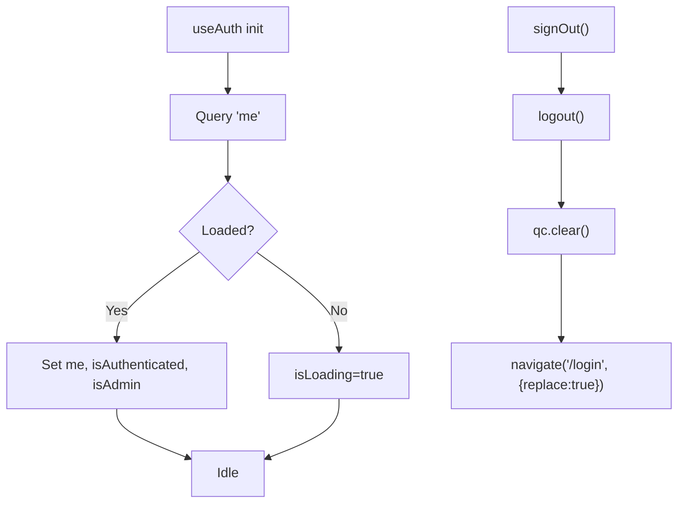
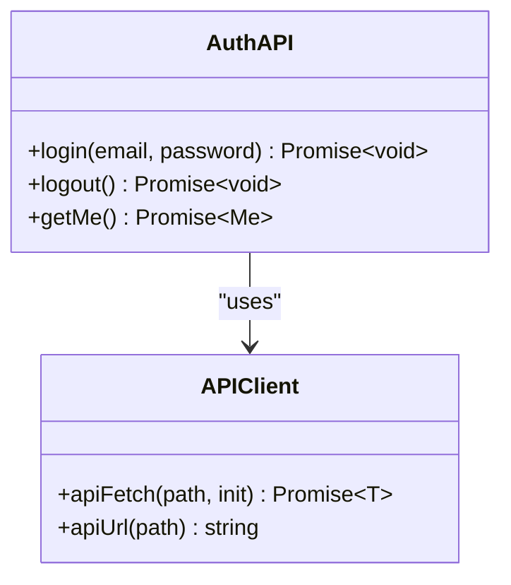
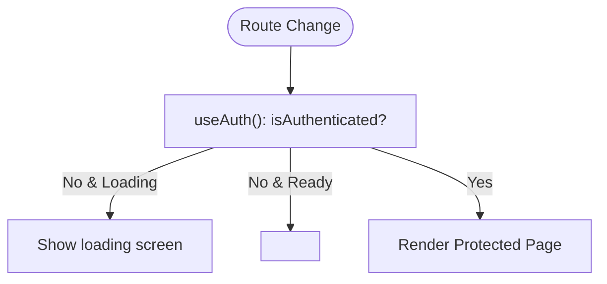
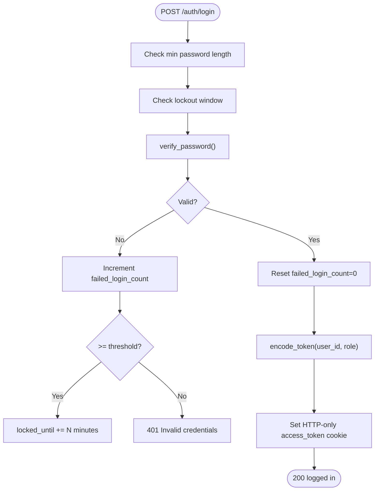
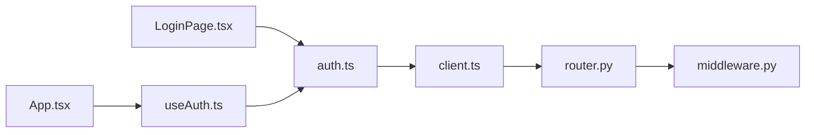

# Authentication Components

<cite>
**Referenced Files in This Document**
- [Login.tsx](file://design/components/Login.tsx)
- [LoginPage.tsx](file://safe4ai-pilot/frontend/src/pages/LoginPage.tsx)
- [useAuth.ts](file://safe4ai-pilot/frontend/src/hooks/useAuth.ts)
- [auth.ts](file://safe4ai-pilot/frontend/src/api/auth.ts)
- [client.ts](file://safe4ai-pilot/frontend/src/api/client.ts)
- [App.tsx](file://safe4ai-pilot/frontend/src/App.tsx)
- [main.tsx](file://safe4ai-pilot/frontend/src/main.tsx)
- [router.py](file://safe4ai-pilot/app/auth/router.py)
- [middleware.py](file://safe4ai-pilot/app/auth/middleware.py)
- [test_auth.py](file://safe4ai-pilot/tests/test_auth.py)
</cite>

## Table of Contents
1. [Introduction](#introduction)
2. [Project Structure](#project-structure)
3. [Core Components](#core-components)
4. [Architecture Overview](#architecture-overview)
5. [Detailed Component Analysis](#detailed-component-analysis)
6. [Dependency Analysis](#dependency-analysis)
7. [Performance Considerations](#performance-considerations)
8. [Troubleshooting Guide](#troubleshooting-guide)
9. [Conclusion](#conclusion)
10. [Appendices](#appendices)

## Introduction
This document provides comprehensive documentation for the authentication components in the Private AI system. It focuses on the Login component implementation, form handling, validation patterns, and the end-to-end user authentication flow. It explains integration with authentication APIs, error handling strategies, and security considerations. It also covers form field components, validation logic, user feedback mechanisms, login state management, redirect handling, session persistence, styling and responsive design patterns, accessibility features, and security best practices for password handling and backend integration.

## Project Structure
The authentication system spans two UI layers and a backend service:
- Frontend (React SPA)
  - Pages: LoginPage renders the login form and orchestrates submission.
  - Hooks: useAuth manages authentication state and provides sign-out.
  - API: auth.ts exposes login/logout/getMe; client.ts centralizes HTTP requests with credentials handling.
  - Routing: App.tsx guards routes and redirects unauthenticated users to the login page.
  - Bootstrapping: main.tsx initializes React Query and wraps the app.
- Backend (FastAPI)
  - Router: /auth/login and /auth/logout endpoints with rate limiting and brute-force protections.
  - Middleware: password hashing/verification, JWT encoding/decoding, and role-based access checks.

**Diagram sources**
- [main.tsx:1-24](file://safe4ai-pilot/frontend/src/main.tsx#L1-L24)
- [App.tsx:1-110](file://safe4ai-pilot/frontend/src/App.tsx#L1-L110)
- [LoginPage.tsx:1-165](file://safe4ai-pilot/frontend/src/pages/LoginPage.tsx#L1-L165)
- [useAuth.ts:1-28](file://safe4ai-pilot/frontend/src/hooks/useAuth.ts#L1-L28)
- [auth.ts:1-17](file://safe4ai-pilot/frontend/src/api/auth.ts#L1-L17)
- [client.ts:1-20](file://safe4ai-pilot/frontend/src/api/client.ts#L1-L20)
- [router.py:1-125](file://safe4ai-pilot/app/auth/router.py#L1-L125)
- [middleware.py:1-83](file://safe4ai-pilot/app/auth/middleware.py#L1-L83)

**Section sources**
- [main.tsx:1-24](file://safe4ai-pilot/frontend/src/main.tsx#L1-L24)
- [App.tsx:1-110](file://safe4ai-pilot/frontend/src/App.tsx#L1-L110)
- [LoginPage.tsx:1-165](file://safe4ai-pilot/frontend/src/pages/LoginPage.tsx#L1-L165)
- [useAuth.ts:1-28](file://safe4ai-pilot/frontend/src/hooks/useAuth.ts#L1-L28)
- [auth.ts:1-17](file://safe4ai-pilot/frontend/src/api/auth.ts#L1-L17)
- [client.ts:1-20](file://safe4ai-pilot/frontend/src/api/client.ts#L1-L20)
- [router.py:1-125](file://safe4ai-pilot/app/auth/router.py#L1-L125)
- [middleware.py:1-83](file://safe4ai-pilot/app/auth/middleware.py#L1-L83)

## Core Components
- LoginPage: Renders the login form, validates inputs, submits credentials, handles server errors, and redirects on success.
- useAuth: Provides authentication state, detects admin role, and signs out.
- auth API: Encapsulates login/logout/getMe calls via apiFetch.
- client: Centralizes HTTP requests with credentials and JSON parsing.
- App routing: Guards protected routes and redirects unauthenticated users to login.
- Backend router: Implements login/logout with rate limiting, brute-force protection, and cookie-based session persistence.
- Backend middleware: Handles password hashing/verification, JWT lifecycle, and role enforcement.

**Section sources**
- [LoginPage.tsx:17-35](file://safe4ai-pilot/frontend/src/pages/LoginPage.tsx#L17-L35)
- [useAuth.ts:5-27](file://safe4ai-pilot/frontend/src/hooks/useAuth.ts#L5-L27)
- [auth.ts:10-16](file://safe4ai-pilot/frontend/src/api/auth.ts#L10-L16)
- [client.ts:3-15](file://safe4ai-pilot/frontend/src/api/client.ts#L3-L15)
- [App.tsx:20-32](file://safe4ai-pilot/frontend/src/App.tsx#L20-L32)
- [router.py:39-105](file://safe4ai-pilot/app/auth/router.py#L39-L105)
- [middleware.py:25-82](file://safe4ai-pilot/app/auth/middleware.py#L25-L82)

## Architecture Overview
The authentication flow integrates frontend form submission with backend endpoints secured by rate limiting, brute-force protection, and JWT cookies.

**Diagram sources**
- [LoginPage.tsx:26-35](file://safe4ai-pilot/frontend/src/pages/LoginPage.tsx#L26-L35)
- [auth.ts:10-11](file://safe4ai-pilot/frontend/src/api/auth.ts#L10-L11)
- [client.ts:3-15](file://safe4ai-pilot/frontend/src/api/client.ts#L3-L15)
- [router.py:39-105](file://safe4ai-pilot/app/auth/router.py#L39-L105)
- [middleware.py:30-48](file://safe4ai-pilot/app/auth/middleware.py#L30-L48)

## Detailed Component Analysis

### LoginPage: Form Handling, Validation, and Submission
- Validation schema uses Zod to enforce email format and non-empty password.
- react-hook-form registers fields, tracks errors, and controls submission state.
- On submit:
  - Clears previous server errors.
  - Calls login API with email and password.
  - On success: invalidates the "me" cache, navigates to "/chat".
  - On failure: sets a user-visible server error message.
- Accessibility and UX:
  - Auto-fill hints via autoComplete attributes.
  - Dynamic input classes reflect validation state.
  - Disabled SSO and forgot password placeholders indicate future features.
- Styling and responsiveness:
  - Tailwind-based layout with grid split into brand and form panels.
  - Responsive breakpoints and spacing tokens for mobile and desktop.

**Diagram sources**
- [LoginPage.tsx:11-14](file://safe4ai-pilot/frontend/src/pages/LoginPage.tsx#L11-L14)
- [LoginPage.tsx:22-35](file://safe4ai-pilot/frontend/src/pages/LoginPage.tsx#L22-L35)
- [auth.ts:10-11](file://safe4ai-pilot/frontend/src/api/auth.ts#L10-L11)

**Section sources**
- [LoginPage.tsx:11-14](file://safe4ai-pilot/frontend/src/pages/LoginPage.tsx#L11-L14)
- [LoginPage.tsx:22-35](file://safe4ai-pilot/frontend/src/pages/LoginPage.tsx#L22-L35)
- [LoginPage.tsx:109-159](file://safe4ai-pilot/frontend/src/pages/LoginPage.tsx#L109-L159)

### useAuth: Authentication State and Sign-Out
- Fetches current user via getMe with React Query.
- Exposes isAuthenticated and isAdmin booleans derived from query state.
- Provides signOut that calls logout, clears the cache, and redirects to "/login".

**Diagram sources**
- [useAuth.ts:8-26](file://safe4ai-pilot/frontend/src/hooks/useAuth.ts#L8-L26)
- [auth.ts:13-16](file://safe4ai-pilot/frontend/src/api/auth.ts#L13-L16)

**Section sources**
- [useAuth.ts:5-27](file://safe4ai-pilot/frontend/src/hooks/useAuth.ts#L5-L27)

### API Layer: auth.ts and client.ts
- auth.ts exports login, logout, and getMe bound to apiFetch.
- client.ts:
  - Uses VITE_API_URL for base URL.
  - Sends credentials: "include" to persist cookies.
  - Throws on non-OK responses with parsed text or status.
  - Returns undefined for 204, otherwise parses JSON.

**Diagram sources**
- [auth.ts:10-16](file://safe4ai-pilot/frontend/src/api/auth.ts#L10-L16)
- [client.ts:3-19](file://safe4ai-pilot/frontend/src/api/client.ts#L3-L19)

**Section sources**
- [auth.ts:10-16](file://safe4ai-pilot/frontend/src/api/auth.ts#L10-L16)
- [client.ts:3-15](file://safe4ai-pilot/frontend/src/api/client.ts#L3-L15)

### Routing and Guarding: App.tsx
- RequireAuth blocks unauthenticated users and shows a loading state while checking auth.
- RequireAdmin enforces admin-only access for admin routes.
- Public route for "/login"; default fallback to "/chat".

**Diagram sources**
- [App.tsx:20-32](file://safe4ai-pilot/frontend/src/App.tsx#L20-L32)

**Section sources**
- [App.tsx:20-32](file://safe4ai-pilot/frontend/src/App.tsx#L20-L32)

### Backend Authentication: Router and Middleware
- Router:
  - POST /auth/login: Enforces minimum password length, checks account lockout, verifies password, increments failures, resets counters on success, and sets an HTTP-only access_token cookie.
  - POST /auth/logout: Clears the access_token cookie.
  - Rate limiting applied to login attempts.
- Middleware:
  - Password hashing and verification with bcrypt.
  - JWT encode/decode with HS256 and expiry.
  - Extracts user from cookie, validates token, and ensures active user.
  - Role-based access control helper.

**Diagram sources**
- [router.py:39-105](file://safe4ai-pilot/app/auth/router.py#L39-L105)
- [middleware.py:30-48](file://safe4ai-pilot/app/auth/middleware.py#L30-L48)

**Section sources**
- [router.py:39-105](file://safe4ai-pilot/app/auth/router.py#L39-L105)
- [middleware.py:25-82](file://safe4ai-pilot/app/auth/middleware.py#L25-L82)

### Design System Login Component (Legacy/Design)
- A presentational Login component with branding and form markup.
- Includes SSO placeholder and credential-based form fields.
- Intended for design review and not the active runtime implementation.

**Section sources**
- [Login.tsx:4-139](file://design/components/Login.tsx#L4-L139)

## Dependency Analysis
- Frontend dependencies:
  - LoginPage depends on react-hook-form, Zod, react-router-dom, and Button/Logo components.
  - useAuth depends on auth API and react-router-dom.
  - auth.ts depends on client.ts.
  - App.tsx depends on useAuth and routing guards.
- Backend dependencies:
  - router.py depends on middleware.py, database session, and rate limiter.
  - middleware.py depends on bcrypt, PyJWT, and database models.

**Diagram sources**
- [LoginPage.tsx:7](file://safe4ai-pilot/frontend/src/pages/LoginPage.tsx#L7)
- [auth.ts:1](file://safe4ai-pilot/frontend/src/api/auth.ts#L1)
- [client.ts:1](file://safe4ai-pilot/frontend/src/api/client.ts#L1)
- [router.py:14-17](file://safe4ai-pilot/app/auth/router.py#L14-L17)
- [middleware.py:9-17](file://safe4ai-pilot/app/auth/middleware.py#L9-L17)
- [useAuth.ts:3](file://safe4ai-pilot/frontend/src/hooks/useAuth.ts#L3)
- [App.tsx:1-10](file://safe4ai-pilot/frontend/src/App.tsx#L1-L10)

**Section sources**
- [LoginPage.tsx:7](file://safe4ai-pilot/frontend/src/pages/LoginPage.tsx#L7)
- [auth.ts:1](file://safe4ai-pilot/frontend/src/api/auth.ts#L1)
- [client.ts:1](file://safe4ai-pilot/frontend/src/api/client.ts#L1)
- [router.py:14-17](file://safe4ai-pilot/app/auth/router.py#L14-L17)
- [middleware.py:9-17](file://safe4ai-pilot/app/auth/middleware.py#L9-L17)
- [useAuth.ts:3](file://safe4ai-pilot/frontend/src/hooks/useAuth.ts#L3)
- [App.tsx:1-10](file://safe4ai-pilot/frontend/src/App.tsx#L1-L10)

## Performance Considerations
- Frontend
  - React Query caching reduces redundant network calls; invalidate "me" after login to refresh user data promptly.
  - Minimal re-renders via controlled inputs and form state management.
- Backend
  - Rate limiting prevents brute-force attacks and reduces load.
  - Early password length check avoids unnecessary DB work.
  - HTTP-only cookies reduce XSS risk and keep sessions scoped to origin.

[No sources needed since this section provides general guidance]

## Troubleshooting Guide
Common issues and remedies:
- Invalid credentials
  - Symptom: 401 Unauthorized on login.
  - Cause: Wrong email/password or insufficient password length.
  - Fix: Ensure password meets minimum length; verify email exists and is active.
- Account locked
  - Symptom: 429 Too Many Requests after repeated failures.
  - Cause: Exceeded lock threshold; locked_until still active.
  - Fix: Wait for lock window to expire or contact administrator.
- Session not persisted
  - Symptom: Redirected to login after refresh.
  - Cause: Missing or blocked cookies; credentials not sent.
  - Fix: Enable third-party cookies if applicable; verify SameSite/Secure settings; confirm HTTPS in production.
- Navigation loops
  - Symptom: Stuck on loading or redirect loop.
  - Cause: getMe failing or inconsistent authentication state.
  - Fix: Inspect network tab for "me" query; check cookie presence; verify backend token validity.

**Section sources**
- [router.py:48-50](file://safe4ai-pilot/app/auth/router.py#L48-L50)
- [router.py:54-65](file://safe4ai-pilot/app/auth/router.py#L54-L65)
- [router.py:84-105](file://safe4ai-pilot/app/auth/router.py#L84-L105)
- [client.ts:5](file://safe4ai-pilot/frontend/src/api/client.ts#L5)
- [useAuth.ts:8-12](file://safe4ai-pilot/frontend/src/hooks/useAuth.ts#L8-L12)

## Conclusion
The Private AI authentication system combines a robust frontend login flow with a secure backend. The frontend uses Zod and react-hook-form for validation, React Query for state, and guarded routing for access control. The backend enforces strong security practices: rate limiting, brute-force protection, minimum password length, bcrypt hashing, and JWT cookies with strict attributes. Together, these components deliver a reliable, accessible, and secure authentication experience.

[No sources needed since this section summarizes without analyzing specific files]

## Appendices

### Security Best Practices
- Password handling
  - Enforce minimum password length server-side.
  - Use bcrypt for hashing and constant-time comparison to mitigate timing attacks.
- Cookies
  - Use HTTP-only, SameSite=strict, and Secure (HTTPS) flags.
  - Set reasonable max-age aligned with session needs.
- Rate limiting
  - Limit login attempts per IP to deter brute-force.
- Token lifecycle
  - Short expiry windows; refresh via secure cookie-based sessions.
- Input validation
  - Validate and sanitize inputs on both frontend and backend.

**Section sources**
- [router.py:28-29](file://safe4ai-pilot/app/auth/router.py#L28-L29)
- [router.py:48-50](file://safe4ai-pilot/app/auth/router.py#L48-L50)
- [router.py:96-103](file://safe4ai-pilot/app/auth/router.py#L96-L103)
- [middleware.py:25-32](file://safe4ai-pilot/app/auth/middleware.py#L25-L32)

### Backend Tests Highlights
- Successful login sets access_token cookie and returns success message.
- Wrong password yields 401 without cookie.
- Locked accounts return 429 during lock window.
- Logout clears the access_token cookie.
- Role enforcement rejects lower-privileged tokens on admin-only endpoints.
- Short passwords are rejected server-side.

**Section sources**
- [test_auth.py:67-86](file://safe4ai-pilot/tests/test_auth.py#L67-L86)
- [test_auth.py:93-112](file://safe4ai-pilot/tests/test_auth.py#L93-L112)
- [test_auth.py:119-142](file://safe4ai-pilot/tests/test_auth.py#L119-L142)
- [test_auth.py:149-156](file://safe4ai-pilot/tests/test_auth.py#L149-L156)
- [test_auth.py:163-192](file://safe4ai-pilot/tests/test_auth.py#L163-L192)
- [test_auth.py:216-224](file://safe4ai-pilot/tests/test_auth.py#L216-L224)