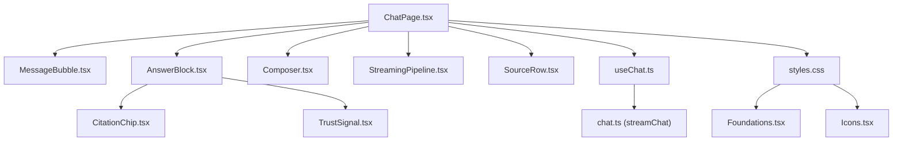
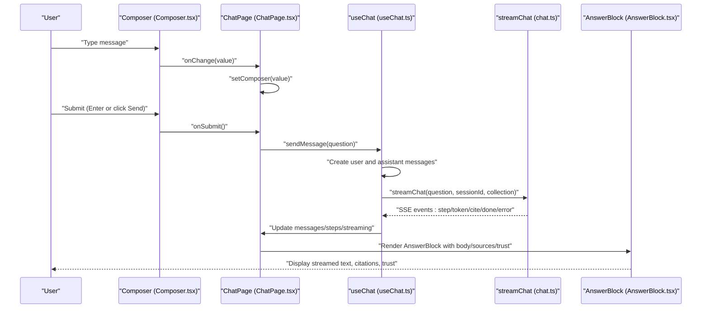
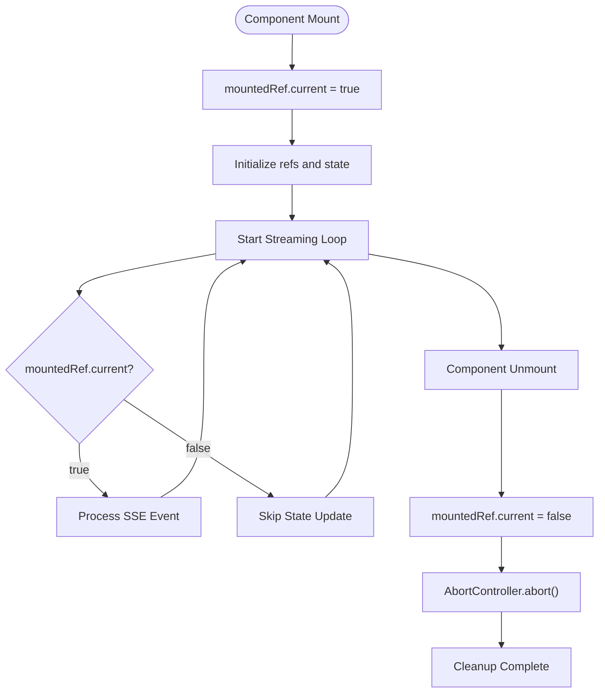
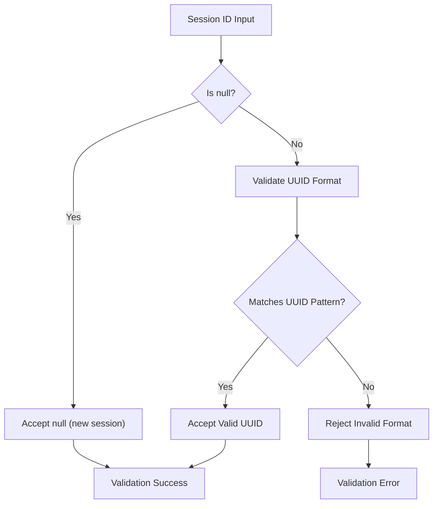
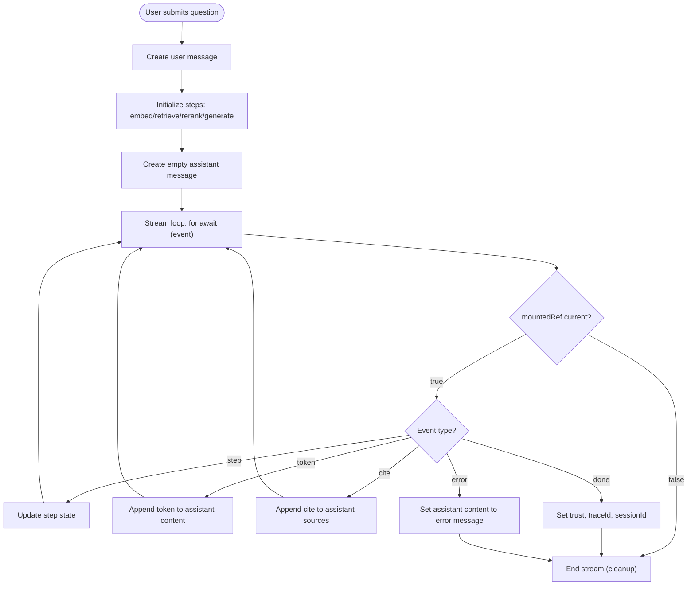
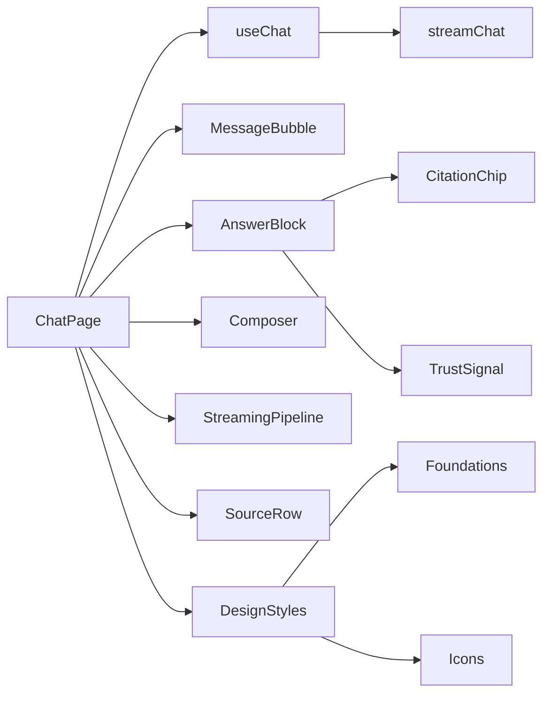

# Chat Interface Components

<cite>
**Referenced Files in This Document**
- [MessageBubble.tsx](file://safe4ai-pilot/frontend/src/components/chat/MessageBubble.tsx)
- [Composer.tsx](file://safe4ai-pilot/frontend/src/components/chat/Composer.tsx)
- [AnswerBlock.tsx](file://safe4ai-pilot/frontend/src/components/chat/AnswerBlock.tsx)
- [CitationChip.tsx](file://safe4ai-pilot/frontend/src/components/chat/CitationChip.tsx)
- [TrustSignal.tsx](file://safe4ai-pilot/frontend/src/components/chat/TrustSignal.tsx)
- [SourceRow.tsx](file://safe4ai-pilot/frontend/src/components/chat/SourceRow.tsx)
- [StreamingPipeline.tsx](file://safe4ai-pilot/frontend/src/components/chat/StreamingPipeline.tsx)
- [useChat.ts](file://safe4ai-pilot/frontend/src/hooks/useChat.ts)
- [chat.ts](file://safe4ai-pilot/frontend/src/api/chat.ts)
- [ChatPage.tsx](file://safe4ai-pilot/frontend/src/pages/ChatPage.tsx)
- [chat_routes.py](file://safe4ai-pilot/app/api/chat_routes.py)
- [styles.css](file://design/styles.css)
- [Foundations.tsx](file://design/components/Foundations.tsx)
- [Icons.tsx](file://design/components/Icons.tsx)
</cite>

## Update Summary
**Changes Made**
- Enhanced component lifecycle management with mounted state tracking in useChat hook to prevent memory leaks and race conditions during chat streaming
- Improved session ID validation with UUID field validators and comprehensive format checking in backend API
- Added mountedRef.current check in streaming loop to prevent state updates after component unmount
- Implemented proper cleanup of AbortController instances on component unmount

## Table of Contents
1. [Introduction](#introduction)
2. [Project Structure](#project-structure)
3. [Core Components](#core-components)
4. [Architecture Overview](#architecture-overview)
5. [Detailed Component Analysis](#detailed-component-analysis)
6. [Dependency Analysis](#dependency-analysis)
7. [Performance Considerations](#performance-considerations)
8. [Troubleshooting Guide](#troubleshooting-guide)
9. [Accessibility Considerations](#accessibility-considerations)
10. [Conclusion](#conclusion)

## Introduction
This document describes the chat interface components in the Private AI system. It focuses on the MessageBubble component for user and assistant messages, the Composer component for input handling, the AnswerBlock component for response display, the CitationChip component for source attribution, and the TrustSignal component for performance indicators. It explains chat state management, message flow patterns, and real-time interaction handling, including streaming responses, event handlers, data binding patterns, and integration with the backend API. Accessibility considerations for screen readers and keyboard navigation are also addressed.

## Project Structure
The chat UI is implemented in the frontend under the path safe4ai-pilot/frontend/src. The main chat page renders a responsive layout with a message list, a composer input, optional suggested prompts, and a right-side citation drawer. The chat state and SSE streaming logic are encapsulated in a React hook. The design system defines theme tokens and primitive styles used across components.

**Diagram sources**
- [ChatPage.tsx:1-246](file://safe4ai-pilot/frontend/src/pages/ChatPage.tsx#L1-L246)
- [MessageBubble.tsx:1-21](file://safe4ai-pilot/frontend/src/components/chat/MessageBubble.tsx#L1-L21)
- [AnswerBlock.tsx:1-114](file://safe4ai-pilot/frontend/src/components/chat/AnswerBlock.tsx#L1-L114)
- [CitationChip.tsx:1-23](file://safe4ai-pilot/frontend/src/components/chat/CitationChip.tsx#L1-L23)
- [TrustSignal.tsx:1-27](file://safe4ai-pilot/frontend/src/components/chat/TrustSignal.tsx#L1-L27)
- [Composer.tsx:1-69](file://safe4ai-pilot/frontend/src/components/chat/Composer.tsx#L1-L69)
- [StreamingPipeline.tsx:1-30](file://safe4ai-pilot/frontend/src/components/chat/StreamingPipeline.tsx#L1-L30)
- [SourceRow.tsx:1-27](file://safe4ai-pilot/frontend/src/components/chat/SourceRow.tsx#L1-L27)
- [useChat.ts:1-125](file://safe4ai-pilot/frontend/src/hooks/useChat.ts#L1-L125)
- [chat.ts:1-103](file://safe4ai-pilot/frontend/src/api/chat.ts#L1-L103)
- [styles.css:1-320](file://design/styles.css#L1-L320)
- [Foundations.tsx:1-136](file://design/components/Foundations.tsx#L1-L136)
- [Icons.tsx:1-73](file://design/components/Icons.tsx#L1-L73)

**Section sources**
- [ChatPage.tsx:1-246](file://safe4ai-pilot/frontend/src/pages/ChatPage.tsx#L1-L246)
- [styles.css:1-320](file://design/styles.css#L1-L320)

## Core Components
- MessageBubble: Renders user or assistant messages with distinct styling and alignment.
- Composer: Text input area with auto-grow textarea, keyboard shortcuts, and send button.
- AnswerBlock: Assistant message container with streamed text, citations, trust signals, and feedback controls.
- CitationChip: Inline clickable citation anchor linked to a source drawer.
- TrustSignal: Performance indicator showing latency, cache hit, retrievals, and model.
- SourceRow: Row item for a cited source in the right-side drawer.
- StreamingPipeline: Visual progress of retrieval and generation steps during streaming.

**Section sources**
- [MessageBubble.tsx:1-21](file://safe4ai-pilot/frontend/src/components/chat/MessageBubble.tsx#L1-L21)
- [Composer.tsx:1-69](file://safe4ai-pilot/frontend/src/components/chat/Composer.tsx#L1-L69)
- [AnswerBlock.tsx:1-114](file://safe4ai-pilot/frontend/src/components/chat/AnswerBlock.tsx#L1-L114)
- [CitationChip.tsx:1-23](file://safe4ai-pilot/frontend/src/components/chat/CitationChip.tsx#L1-L23)
- [TrustSignal.tsx:1-27](file://safe4ai-pilot/frontend/src/components/chat/TrustSignal.tsx#L1-L27)
- [SourceRow.tsx:1-27](file://safe4ai-pilot/frontend/src/components/chat/SourceRow.tsx#L1-L27)
- [StreamingPipeline.tsx:1-30](file://safe4ai-pilot/frontend/src/components/chat/StreamingPipeline.tsx#L1-L30)

## Architecture Overview
The chat UI is driven by a centralized hook that manages state, streams server-sent events, and updates the UI in real time. The ChatPage orchestrates rendering, binds user actions, and displays the citation drawer. The design system provides consistent theming and typography.

**Diagram sources**
- [Composer.tsx:15-69](file://safe4ai-pilot/frontend/src/components/chat/Composer.tsx#L15-L69)
- [ChatPage.tsx:59-66](file://safe4ai-pilot/frontend/src/pages/ChatPage.tsx#L59-L66)
- [useChat.ts:38-104](file://safe4ai-pilot/frontend/src/hooks/useChat.ts#L38-L104)
- [chat.ts:22-103](file://safe4ai-pilot/frontend/src/api/chat.ts#L22-L103)
- [AnswerBlock.tsx:36-114](file://safe4ai-pilot/frontend/src/components/chat/AnswerBlock.tsx#L36-L114)

## Detailed Component Analysis

### MessageBubble
- Purpose: Wraps user or assistant content with appropriate alignment and styling.
- Props:
  - role: "user" | "assistant"
  - children: ReactNode
- Behavior:
  - Right-aligned bubble for user messages.
  - Left-aligned container for assistant content.
- Styling: Uses design tokens for background, borders, and text colors.

**Section sources**
- [MessageBubble.tsx:1-21](file://safe4ai-pilot/frontend/src/components/chat/MessageBubble.tsx#L1-L21)
- [styles.css:1-320](file://design/styles.css#L1-L320)

### Composer
- Purpose: Captures user input, handles submission, and provides visual scope metadata.
- Props:
  - value: string
  - onChange: (v: string) => void
  - onSubmit: () => void
  - scope?: { name: string; chunkCount: number }
  - disabled?: boolean
  - placeholder?: string
- Keyboard handling:
  - Enter (without Shift) submits if content is trimmed.
- Auto-grow textarea:
  - Adjusts height based on scrollHeight, capped at a maximum.
- Send button:
  - Enabled when value is non-empty and not disabled.
- Focus and disabled states:
  - Visual focus ring and reduced opacity when disabled.

**Section sources**
- [Composer.tsx:1-69](file://safe4ai-pilot/frontend/src/components/chat/Composer.tsx#L1-L69)

### AnswerBlock
- Purpose: Renders assistant responses with citations, trust signals, and feedback controls.
- Props:
  - body: string
  - sources: SseCite[]
  - trust: { latencyMs: number; cacheHit: boolean; model: string; kRetrieved: number }
  - onCopy?: () => void
  - onRate?: (rating: "up" | "down") => void
  - onCitationOpen?: (id: string) => void
  - isStreaming?: boolean
  - rated?: "up" | "down"
- Rendering:
  - Splits body text and wraps citation markers with CitationChip.
  - Displays TrustSignal below the header when not streaming.
  - Shows citation chips below the text when not streaming.
  - Provides copy and thumbs-up/thumbs-down buttons when not streaming.
- Streaming indicator:
  - Animated pulse caret appended to the end of the body when streaming.

**Section sources**
- [AnswerBlock.tsx:1-114](file://safe4ai-pilot/frontend/src/components/chat/AnswerBlock.tsx#L1-L114)
- [CitationChip.tsx:1-23](file://safe4ai-pilot/frontend/src/components/chat/CitationChip.tsx#L1-L23)
- [TrustSignal.tsx:1-27](file://safe4ai-pilot/frontend/src/components/chat/TrustSignal.tsx#L1-L27)

### CitationChip
- Purpose: Inline citation anchor that toggles active state and triggers open action.
- Props:
  - id: string
  - active?: boolean
  - onOpen?: (id: string) => void
- Behavior:
  - Click handler invokes onOpen with the citation id.
  - Active state applies accent colors and background.

**Section sources**
- [CitationChip.tsx:1-23](file://safe4ai-pilot/frontend/src/components/chat/CitationChip.tsx#L1-L23)

### TrustSignal
- Purpose: Displays performance and provenance metadata for the current assistant message.
- Props:
  - latencyMs: number
  - cacheHit: boolean
  - model: string
  - kRetrieved: number
  - onOpenTrace?: () => void
- Behavior:
  - Clickable button that opens trace details via onOpenTrace.
  - Shows latency in milliseconds, cache hit/fresh, number of retrievals, and model.

**Section sources**
- [TrustSignal.tsx:1-27](file://safe4ai-pilot/frontend/src/components/chat/TrustSignal.tsx#L1-L27)

### SourceRow
- Purpose: Represents a single cited source in the right-side drawer.
- Props:
  - source: SseCite
  - compact?: boolean
  - active?: boolean
  - onOpen?: () => void
- Behavior:
  - Click handler invokes onOpen.
  - Highlights active item and shows file, page, and score percentage.

**Section sources**
- [SourceRow.tsx:1-27](file://safe4ai-pilot/frontend/src/components/chat/SourceRow.tsx#L1-L27)

### StreamingPipeline
- Purpose: Visualizes the stages of the retrieval and generation pipeline during streaming.
- Props:
  - steps: Array of { name: StepName; state: StepState; detail?: string }
- Behavior:
  - Renders step icons and labels based on state (pending, active, done).
  - Optional detail text per step.

**Section sources**
- [StreamingPipeline.tsx:1-30](file://safe4ai-pilot/frontend/src/components/chat/StreamingPipeline.tsx#L1-L30)

### Enhanced Component Lifecycle Management

**Updated** Enhanced component lifecycle management with mounted state tracking to prevent memory leaks and race conditions during chat streaming.

The useChat hook now implements robust lifecycle management through mounted state tracking:

- **Mounted State Tracking**: A `mountedRef` is initialized to `true` in the effect cleanup and set to `false` on component unmount
- **Race Condition Prevention**: The streaming loop checks `mountedRef.current` before processing any events to prevent state updates after component unmount
- **Proper Cleanup**: AbortController instances are properly aborted during cleanup to cancel ongoing requests
- **Memory Leak Prevention**: All refs and controllers are cleaned up when the component unmounts

**Diagram sources**
- [useChat.ts:25-32](file://safe4ai-pilot/frontend/src/hooks/useChat.ts#L25-L32)
- [useChat.ts:72-72](file://safe4ai-pilot/frontend/src/hooks/useChat.ts#L72-L72)
- [useChat.ts:99-103](file://safe4ai-pilot/frontend/src/hooks/useChat.ts#L99-L103)

**Section sources**
- [useChat.ts:17-32](file://safe4ai-pilot/frontend/src/hooks/useChat.ts#L17-L32)
- [useChat.ts:70-104](file://safe4ai-pilot/frontend/src/hooks/useChat.ts#L70-L104)

### Backend Session ID Validation

**Updated** Improved session ID validation with UUID field validators and comprehensive format checking.

The backend API now enforces strict session ID validation:

- **UUID Format Validation**: Session IDs must match the standard UUID4 format pattern
- **Comprehensive Validation**: Uses regex pattern matching to ensure valid UUID format
- **Error Handling**: Invalid session IDs trigger validation errors
- **Security Enhancement**: Prevents malformed or malicious session ID inputs

**Diagram sources**
- [chat_routes.py:175-188](file://safe4ai-pilot/app/api/chat_routes.py#L175-L188)

**Section sources**
- [chat_routes.py:175-188](file://safe4ai-pilot/app/api/chat_routes.py#L175-L188)

### Chat State Management and Message Flow
- Hook: useChat
  - Maintains messages, streaming steps, and streaming flag.
  - Manages session id and trace id across the stream.
  - Provides stop() to abort the stream.
  - sendMessage():
    - Creates user and assistant messages.
    - Initializes pending steps for embed/retrieve/rerank/generate.
    - Streams events and updates messages and steps accordingly.
    - On done, sets trust metrics and session id.
    - On error, appends an error message to the assistant content.
    - **Enhanced**: Now checks mounted state before processing events to prevent memory leaks.
  - rate(): Updates local rating and posts feedback to the backend.
- Page: ChatPage
  - Binds Composer value and handlers to useChat.
  - Renders MessageBubble wrappers around user and assistant content.
  - Displays StreamingPipeline when streaming.
  - Controls stop button visibility and behavior.
  - Opens the citation drawer with the latest assistant sources.

**Diagram sources**
- [useChat.ts:70-104](file://safe4ai-pilot/frontend/src/hooks/useChat.ts#L70-L104)

**Section sources**
- [useChat.ts:17-125](file://safe4ai-pilot/frontend/src/hooks/useChat.ts#L17-L125)
- [ChatPage.tsx:30-197](file://safe4ai-pilot/frontend/src/pages/ChatPage.tsx#L30-L246)

### Backend Integration and Streaming
- API: streamChat
  - Performs a POST to the SSE endpoint with question, optional session_id, and collection.
  - Parses server-sent events: step, token, cite, done, error.
  - Yields structured events to the caller.
- Event types:
  - SseStep: name, state, timestamp, optional metadata.
  - SseToken: delta string.
  - SseCite: id, file, page, score.
  - SseDone: traceId, latencyMs, cache, model, kRetrieved, sessionId, optional error.
- Error handling:
  - Non-OK responses yield an error event with the textual message.
  - **Enhanced**: Backend validates session_id format before processing requests.

**Section sources**
- [chat.ts:22-103](file://safe4ai-pilot/frontend/src/api/chat.ts#L22-L103)
- [chat_routes.py:330-491](file://safe4ai-pilot/app/api/chat_routes.py#L330-L491)

### Real-Time Interaction Patterns
- Keyboard shortcuts:
  - Composer submits on Enter (Shift+Enter for newline).
- Streaming:
  - Assistant content appears progressively as tokens arrive.
  - Steps update in real time to reflect pipeline progress.
- Citations:
  - Inline citation markers are clickable and open the corresponding source in the drawer.
- Feedback:
  - Users can mark responses as helpful/not helpful after streaming completes.
- **Enhanced Lifecycle Management**:
  - Proper cleanup prevents memory leaks when users navigate away during streaming.
  - Race conditions are prevented by checking mounted state before state updates.

**Section sources**
- [Composer.tsx:18-23](file://safe4ai-pilot/frontend/src/components/chat/Composer.tsx#L18-L23)
- [AnswerBlock.tsx:36-114](file://safe4ai-pilot/frontend/src/components/chat/AnswerBlock.tsx#L36-L114)
- [useChat.ts:34-36](file://safe4ai-pilot/frontend/src/hooks/useChat.ts#L34-L36)

### Examples

#### Chat Session Management
- Creating a new session:
  - Initial streamChat call passes null session_id.
  - On first done event, the backend returns a sessionId; subsequent requests reuse it.
- Maintaining context:
  - The hook stores the session id and trace ids for feedback submission.
- **Enhanced Session Validation**:
  - Backend validates session_id format using UUID regex pattern.
  - Invalid formats are rejected with validation errors.

**Section sources**
- [useChat.ts:87-87](file://safe4ai-pilot/frontend/src/hooks/useChat.ts#L87-L87)
- [chat.ts:22-34](file://safe4ai-pilot/frontend/src/api/chat.ts#L22-L34)
- [chat_routes.py:180-188](file://safe4ai-pilot/app/api/chat_routes.py#L180-L188)

#### Streaming Response Handling
- Token accumulation:
  - Each token event appends to the assistant message content.
- Citation accumulation:
  - Each cite event appends to the assistant message sources.
- Finalization:
  - Done event sets trust metrics, traceId, and session id.
- **Enhanced Lifecycle Safety**:
  - Mounted state check prevents state updates after component unmount.
  - AbortController cleanup ensures requests are cancelled properly.

**Section sources**
- [useChat.ts:77-96](file://safe4ai-pilot/frontend/src/hooks/useChat.ts#L77-L96)
- [useChat.ts:98-103](file://safe4ai-pilot/frontend/src/hooks/useChat.ts#L98-L103)

#### User Interaction Patterns
- Composing and sending:
  - Composer captures input and triggers sendMessage on submit.
- Stopping generation:
  - Stop button aborts the current stream.
- Copying and rating:
  - AnswerBlock exposes onCopy and onRate callbacks bound to the current message.
- **Enhanced Cleanup Behavior**:
  - Component unmount automatically cleans up streaming resources.
  - Memory leaks are prevented through proper lifecycle management.

**Section sources**
- [ChatPage.tsx:59-66](file://safe4ai-pilot/frontend/src/pages/ChatPage.tsx#L59-L66)
- [ChatPage.tsx:185-197](file://safe4ai-pilot/frontend/src/pages/ChatPage.tsx#L185-L197)
- [AnswerBlock.tsx:83-109](file://safe4ai-pilot/frontend/src/components/chat/AnswerBlock.tsx#L83-L109)

## Dependency Analysis
- Component dependencies:
  - ChatPage depends on useChat, MessageBubble, AnswerBlock, Composer, StreamingPipeline, SourceRow.
  - AnswerBlock composes CitationChip and TrustSignal.
  - Design system tokens are consumed by all components via CSS variables.
- Hook-to-API dependency:
  - useChat consumes streamChat and feeds parsed events into state updates.
  - **Enhanced**: Now includes mounted state checks to prevent memory leaks.
- Theming:
  - styles.css defines global tokens; Foundations.tsx demonstrates palette and typography; Icons.tsx provides reusable SVG icons.

**Diagram sources**
- [ChatPage.tsx:1-246](file://safe4ai-pilot/frontend/src/pages/ChatPage.tsx#L1-L246)
- [useChat.ts:1-125](file://safe4ai-pilot/frontend/src/hooks/useChat.ts#L1-L125)
- [chat.ts:1-103](file://safe4ai-pilot/frontend/src/api/chat.ts#L1-L103)
- [styles.css:1-320](file://design/styles.css#L1-L320)
- [Foundations.tsx:1-136](file://design/components/Foundations.tsx#L1-L136)
- [Icons.tsx:1-73](file://design/components/Icons.tsx#L1-L73)

**Section sources**
- [ChatPage.tsx:1-246](file://safe4ai-pilot/frontend/src/pages/ChatPage.tsx#L1-L246)
- [useChat.ts:1-125](file://safe4ai-pilot/frontend/src/hooks/useChat.ts#L1-L125)
- [chat.ts:1-103](file://safe4ai-pilot/frontend/src/api/chat.ts#L1-L103)
- [styles.css:1-320](file://design/styles.css#L1-L320)

## Performance Considerations
- Streaming rendering:
  - Incremental DOM updates via token events minimize layout thrash.
- Auto-grow textarea:
  - Height recalculated once per change, capped to prevent excessive reflows.
- Minimal state updates:
  - Only the assistant message content and sources are updated per token/cite.
- Step visualization:
  - Lightweight step rendering avoids heavy computations.
- **Enhanced Lifecycle Management**:
  - Mounted state tracking prevents unnecessary state updates after component unmount.
  - Proper cleanup reduces memory usage and prevents resource leaks.
  - AbortController instances are properly cleaned up to cancel ongoing requests.

## Troubleshooting Guide
- No response after submit:
  - Verify Composer is enabled and value is non-empty.
  - Check that the stop button is not preventing submission.
- Streaming does not appear:
  - Ensure the backend responds with OK and SSE events.
  - Confirm the streamChat reader processes events correctly.
- Citations not clickable:
  - Ensure CitationChip receives onOpen and that AnswerBlock passes onCitationOpen.
- Feedback not recorded:
  - Confirm the assistant message has a traceId and session id before rating.
- Error messages in chat:
  - The hook appends an error message to the assistant content on stream errors.
- **Memory leaks during navigation**:
  - Component unmount automatically cleans up streaming resources.
  - Check that mountedRef.current is properly managed in custom hooks.
- **Session ID validation errors**:
  - Ensure session_id follows UUID4 format: xxxxxxxx-xxxx-4xxx-yxxx-xxxxxxxxxxxx
  - Validate that session_id is properly formatted before sending requests.

**Section sources**
- [Composer.tsx:45-61](file://safe4ai-pilot/frontend/src/components/chat/Composer.tsx#L45-L61)
- [useChat.ts:92-96](file://safe4ai-pilot/frontend/src/hooks/useChat.ts#L92-L96)
- [AnswerBlock.tsx:39-42](file://safe4ai-pilot/frontend/src/components/chat/AnswerBlock.tsx#L39-L42)
- [useChat.ts:25-32](file://safe4ai-pilot/frontend/src/hooks/useChat.ts#L25-L32)
- [chat_routes.py:180-188](file://safe4ai-pilot/app/api/chat_routes.py#L180-L188)

## Accessibility Considerations
- Screen readers:
  - Use semantic buttons and spans for interactive elements.
  - Ensure labels are descriptive (e.g., Copy, Helpful, Not helpful).
- Keyboard navigation:
  - Composer supports Enter to submit; Tab navigates between focusable elements.
  - Buttons are focusable and actionable via keyboard.
- Visual contrast and readability:
  - Design tokens define sufficient contrast for text and backgrounds.
- Live regions:
  - Streaming caret is animated; consider adding aria-live regions for critical status updates if needed.
- **Enhanced Lifecycle Accessibility**:
  - Proper cleanup ensures consistent behavior across different browser contexts.
  - Memory leak prevention maintains stable performance for assistive technologies.

## Conclusion
The chat interface integrates tightly with a streaming backend to deliver a responsive, accessible, and informative conversational experience. Recent enhancements include robust component lifecycle management to prevent memory leaks and race conditions, along with improved session ID validation for enhanced security. Components are modular, with clear props and event handlers, enabling straightforward extension and maintenance. The design system ensures consistent theming and typography across the interface.