# Component Library

<cite>
**Referenced Files in This Document**
- [Foundations.tsx](file://design/components/Foundations.tsx)
- [AdminShell.tsx](file://design/components/AdminShell.tsx)
- [ChatShared.tsx](file://design/components/ChatShared.tsx)
- [ChatA.tsx](file://design/components/ChatA.tsx)
- [ChatB.tsx](file://design/components/ChatB.tsx)
- [ChatStates.tsx](file://design/components/ChatStates.tsx)
- [AdminAudit.tsx](file://design/components/AdminAudit.tsx)
- [AdminDocs.tsx](file://design/components/AdminDocs.tsx)
- [AdminFeedback.tsx](file://design/components/AdminFeedback.tsx)
- [AdminStats.tsx](file://design/components/AdminStats.tsx)
- [Login.tsx](file://design/components/Login.tsx)
- [SettingsPage.tsx](file://design/components/SettingsPage.tsx)
- [Button.tsx](file://safe4ai-pilot/frontend/src/components/Button.tsx)
- [Chip.tsx](file://safe4ai-pilot/frontend/src/components/Chip.tsx)
- [Avatar.tsx](file://safe4ai-pilot/frontend/src/components/Avatar.tsx)
- [MessageBubble.tsx](file://safe4ai-pilot/frontend/src/components/chat/MessageBubble.tsx)
- [Composer.tsx](file://safe4ai-pilot/frontend/src/components/chat/Composer.tsx)
- [AnswerBlock.tsx](file://safe4ai-pilot/frontend/src/components/chat/AnswerBlock.tsx)
- [CitationChip.tsx](file://safe4ai-pilot/frontend/src/components/chat/CitationChip.tsx)
- [SourceRow.tsx](file://safe4ai-pilot/frontend/src/components/chat/SourceRow.tsx)
- [TrustSignal.tsx](file://safe4ai-pilot/frontend/src/components/chat/TrustSignal.tsx)
- [ActivityEvent.tsx](file://safe4ai-pilot/frontend/src/components/admin/ActivityEvent.tsx)
- [DocumentRow.tsx](file://safe4ai-pilot/frontend/src/components/admin/DocumentRow.tsx)
- [Sparkline.tsx](file://safe4ai-pilot/frontend/src/components/admin/Sparkline.tsx)
</cite>

## Update Summary
**Changes Made**
- Added comprehensive chat interface components (ChatA, ChatB, ChatStates)
- Expanded administrative components (AdminAudit, AdminDocs, AdminFeedback, AdminStats)
- Introduced authentication component (Login)
- Added comprehensive settings management component (SettingsPage)
- Enhanced component architecture with new domain-specific interfaces
- Updated component composition patterns and state management approaches

## Table of Contents
1. [Introduction](#introduction)
2. [Project Structure](#project-structure)
3. [Core Components](#core-components)
4. [Architecture Overview](#architecture-overview)
5. [Detailed Component Analysis](#detailed-component-analysis)
6. [Dependency Analysis](#dependency-analysis)
7. [Performance Considerations](#performance-considerations)
8. [Accessibility and Responsive Behavior](#accessibility-and-responsive-behavior)
9. [Testing Approaches](#testing-approaches)
10. [Troubleshooting Guide](#troubleshooting-guide)
11. [Conclusion](#conclusion)
12. [Appendices](#appendices)

## Introduction
This document describes the Private AI design system's component library, focusing on reusable UI components and their implementation patterns. It covers Foundation components (Button, Chip, Avatar), Chat components (MessageBubble, Composer, AnswerBlock, CitationChip, SourceRow, TrustSignal), Administrative components (AdminShell, ActivityEvent, DocumentRow, Sparkline), and newly expanded components including comprehensive chat interfaces (ChatA, ChatB, ChatStates), administrative dashboards (AdminAudit, AdminDocs, AdminFeedback, AdminStats), authentication (Login), and settings management (SettingsPage). The guide explains component props, styling patterns, composition strategies, lifecycle and state management, inter-component communication, customization options, integration patterns, accessibility, responsiveness, testing, performance, and maintenance guidelines.

## Project Structure
The component library is organized into four major areas:
- Design system playground and foundations: a static showcase of primitives and tokens.
- Frontend components: production-ready React components grouped by domain (chat, admin, shared).
- Authentication components: dedicated login and authentication interfaces.
- Settings management: comprehensive configuration and administration interfaces.

```mermaid
graph TB
subgraph "Design System"
F["Foundations.tsx"]
AS["AdminShell.tsx"]
CS["ChatShared.tsx"]
end
subgraph "Frontend Components"
subgraph "Shared"
BTN["Button.tsx"]
CHIP["Chip.tsx"]
AV["Avatar.tsx"]
end
subgraph "Chat Interfaces"
CHA["ChatA.tsx"]
CHB["ChatB.tsx"]
CHS["ChatStates.tsx"]
MB["MessageBubble.tsx"]
CMP["Composer.tsx"]
AB["AnswerBlock.tsx"]
CC["CitationChip.tsx"]
SR["SourceRow.tsx"]
TS["TrustSignal.tsx"]
end
subgraph "Admin Dashboards"
AA["AdminAudit.tsx"]
AD["AdminDocs.tsx"]
AF["AdminFeedback.tsx"]
AST["AdminStats.tsx"]
AE["ActivityEvent.tsx"]
DR["DocumentRow.tsx"]
SPL["Sparkline.tsx"]
end
end
subgraph "Authentication & Settings"
LOGIN["Login.tsx"]
SP["SettingsPage.tsx"]
end
F --> BTN
F --> CHIP
F --> AV
CS --> MB
CS --> CMP
CS --> AB
CS --> CC
CS --> SR
CS --> TS
AS --> AE
AS --> DR
AS --> SPL
AA --> AE
AD --> DR
AF --> SP
AST --> SPL
```

**Diagram sources**
- [Foundations.tsx](file://design/components/Foundations.tsx)
- [AdminShell.tsx](file://design/components/AdminShell.tsx)
- [ChatShared.tsx](file://design/components/ChatShared.tsx)
- [ChatA.tsx](file://design/components/ChatA.tsx)
- [ChatB.tsx](file://design/components/ChatB.tsx)
- [ChatStates.tsx](file://design/components/ChatStates.tsx)
- [AdminAudit.tsx](file://design/components/AdminAudit.tsx)
- [AdminDocs.tsx](file://design/components/AdminDocs.tsx)
- [AdminFeedback.tsx](file://design/components/AdminFeedback.tsx)
- [AdminStats.tsx](file://design/components/AdminStats.tsx)
- [Login.tsx](file://design/components/Login.tsx)
- [SettingsPage.tsx](file://design/components/SettingsPage.tsx)
- [Button.tsx](file://safe4ai-pilot/frontend/src/components/Button.tsx)
- [Chip.tsx](file://safe4ai-pilot/frontend/src/components/Chip.tsx)
- [Avatar.tsx](file://safe4ai-pilot/frontend/src/components/Avatar.tsx)
- [MessageBubble.tsx](file://safe4ai-pilot/frontend/src/components/chat/MessageBubble.tsx)
- [Composer.tsx](file://safe4ai-pilot/frontend/src/components/chat/Composer.tsx)
- [AnswerBlock.tsx](file://safe4ai-pilot/frontend/src/components/chat/AnswerBlock.tsx)
- [CitationChip.tsx](file://safe4ai-pilot/frontend/src/components/chat/CitationChip.tsx)
- [SourceRow.tsx](file://safe4ai-pilot/frontend/src/components/chat/SourceRow.tsx)
- [TrustSignal.tsx](file://safe4ai-pilot/frontend/src/components/chat/TrustSignal.tsx)
- [ActivityEvent.tsx](file://safe4ai-pilot/frontend/src/components/admin/ActivityEvent.tsx)
- [DocumentRow.tsx](file://safe4ai-pilot/frontend/src/components/admin/DocumentRow.tsx)
- [Sparkline.tsx](file://safe4ai-pilot/frontend/src/components/admin/Sparkline.tsx)

**Section sources**
- [Foundations.tsx](file://design/components/Foundations.tsx)
- [AdminShell.tsx](file://design/components/AdminShell.tsx)
- [ChatShared.tsx](file://design/components/ChatShared.tsx)

## Core Components
This section introduces the foundational building blocks and their roles.

- Button
  - Purpose: Standard interactive controls with variants, sizes, icons, loading, and disabled states.
  - Key props: variant, size, iconLeft, iconRight, loading, disabled, onClick, type, className.
  - Styling pattern: CSS classes mapped per variant/size; focus-visible ring; disabled state handling.
  - Composition: Used across chat composer and admin actions.

- Chip
  - Purpose: Lightweight status or metadata indicators with tone and variant.
  - Key props: variant, tone, children.
  - Styling pattern: Dot indicator color mapping; default vs solid variants; rounded pill shape.
  - Composition: Used in admin document status and chat trust signals.

- Avatar
  - Purpose: Initial-based user avatars with configurable size and color.
  - Key props: name, size, color.
  - Styling pattern: Circular layout; initials derived from name; centered text.

**Section sources**
- [Button.tsx](file://safe4ai-pilot/frontend/src/components/Button.tsx)
- [Chip.tsx](file://safe4ai-pilot/frontend/src/components/Chip.tsx)
- [Avatar.tsx](file://safe4ai-pilot/frontend/src/components/Avatar.tsx)

## Architecture Overview
The component library follows a layered architecture with enhanced domain specialization:
- Foundations: Tokens, palette, typography, and primitive showcases.
- Shared: Cross-domain components (Button, Chip, Avatar).
- Chat Interfaces: Comprehensive conversation UI with multiple layouts and states.
- Admin Dashboards: Specialized administrative interfaces for monitoring and management.
- Authentication: Dedicated login and security interfaces.
- Settings Management: Centralized configuration and administration hub.

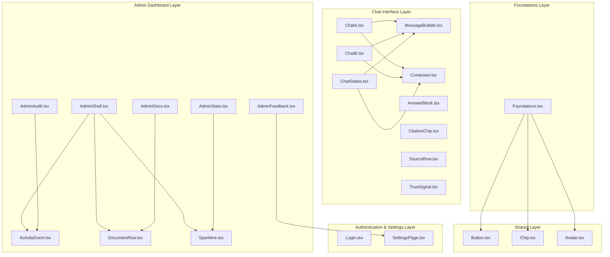

**Diagram sources**
- [Foundations.tsx](file://design/components/Foundations.tsx)
- [AdminShell.tsx](file://design/components/AdminShell.tsx)
- [ChatA.tsx](file://design/components/ChatA.tsx)
- [ChatB.tsx](file://design/components/ChatB.tsx)
- [ChatStates.tsx](file://design/components/ChatStates.tsx)
- [AdminAudit.tsx](file://design/components/AdminAudit.tsx)
- [AdminDocs.tsx](file://design/components/AdminDocs.tsx)
- [AdminFeedback.tsx](file://design/components/AdminFeedback.tsx)
- [AdminStats.tsx](file://design/components/AdminStats.tsx)
- [Login.tsx](file://design/components/Login.tsx)
- [SettingsPage.tsx](file://design/components/SettingsPage.tsx)
- [Button.tsx](file://safe4ai-pilot/frontend/src/components/Button.tsx)
- [Chip.tsx](file://safe4ai-pilot/frontend/src/components/Chip.tsx)
- [Avatar.tsx](file://safe4ai-pilot/frontend/src/components/Avatar.tsx)
- [MessageBubble.tsx](file://safe4ai-pilot/frontend/src/components/chat/MessageBubble.tsx)
- [Composer.tsx](file://safe4ai-pilot/frontend/src/components/chat/Composer.tsx)
- [AnswerBlock.tsx](file://safe4ai-pilot/frontend/src/components/chat/AnswerBlock.tsx)
- [CitationChip.tsx](file://safe4ai-pilot/frontend/src/components/chat/CitationChip.tsx)
- [SourceRow.tsx](file://safe4ai-pilot/frontend/src/components/chat/SourceRow.tsx)
- [TrustSignal.tsx](file://safe4ai-pilot/frontend/src/components/chat/TrustSignal.tsx)
- [ActivityEvent.tsx](file://safe4ai-pilot/frontend/src/components/admin/ActivityEvent.tsx)
- [DocumentRow.tsx](file://safe4ai-pilot/frontend/src/components/admin/DocumentRow.tsx)
- [Sparkline.tsx](file://safe4ai-pilot/frontend/src/components/admin/Sparkline.tsx)

## Detailed Component Analysis

### Foundations
- Role: Demonstrates design tokens and primitive usage.
- Highlights: Palette grid, typography samples, primitive preview (buttons, chips, citation chips, keyboard keys, trust signals).
- Usage: Reference for designers and developers to align on tokens and primitives.

**Section sources**
- [Foundations.tsx](file://design/components/Foundations.tsx)

### AdminShell
- Role: Application shell for admin pages with navigation rail and main content area.
- Props:
  - active: string; currently selected nav item.
  - title: string; page title.
  - subtitle: string; optional description.
  - headerRight: ReactNode; optional right-side header content.
  - children: ReactNode; main content.
- Layout: Two-column grid (rail + main). Rail includes logo, nav items, status, and user profile.
- Interactions: Nav items toggle active state; headerRight allows flexible header content injection.

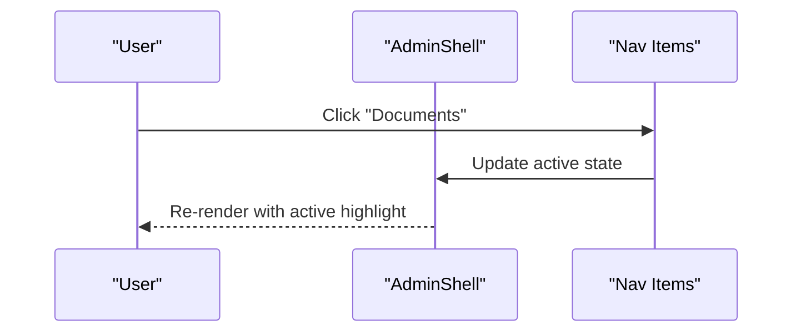

**Diagram sources**
- [AdminShell.tsx](file://design/components/AdminShell.tsx)

**Section sources**
- [AdminShell.tsx](file://design/components/AdminShell.tsx)

### ChatShared Utilities
- Purpose: Shared helpers and constants for chat UI.
- Exports:
  - SAMPLE_SOURCES: Example source entries.
  - SAMPLE_ANSWER_BODY: Example answer content with citation markers.
  - SAMPLE_QUESTION: Example user question.
  - SourceRow: Renders a single source with file, page, location, and excerpt.
  - TrustSignal: Renders latency, cache hit, retrievals, and model info.
  - UserBubble: Wraps user messages with appropriate styling.
- Composition: Used by chat components to render consistent source lists and trust signals.

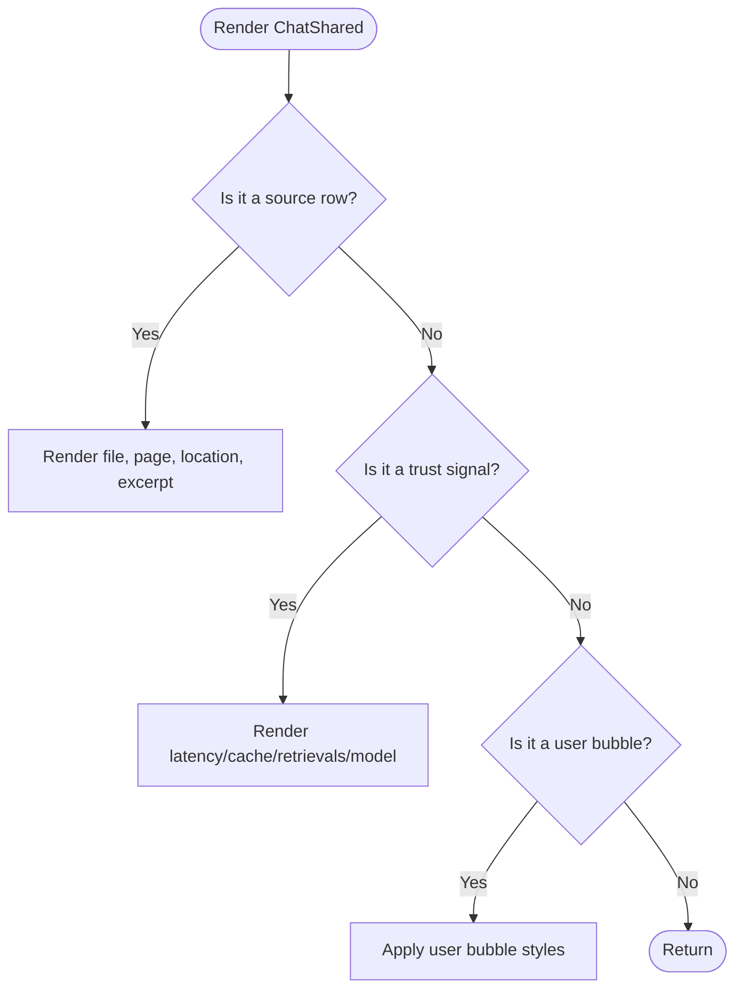

**Diagram sources**
- [ChatShared.tsx](file://design/components/ChatShared.tsx)

**Section sources**
- [ChatShared.tsx](file://design/components/ChatShared.tsx)

### ChatA Interface
- Role: Primary chat interface with dual-pane layout featuring conversation and citation drawer.
- Layout: Three-column grid (header + main conversation + citation drawer).
- Features:
  - Header with logo, keyboard shortcuts, and user avatar.
  - Conversation area with user messages and AI responses.
  - Citation drawer showing source documents with pagination controls.
  - Composer with attachment capabilities and scope indicators.
- State management: Static demonstration with sample data and interactive elements.

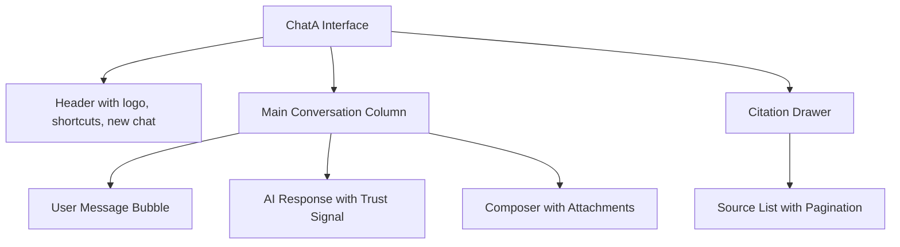

**Diagram sources**
- [ChatA.tsx](file://design/components/ChatA.tsx)

**Section sources**
- [ChatA.tsx](file://design/components/ChatA.tsx)

### ChatB Interface
- Role: Advanced chat interface with thread management and focused source preview.
- Layout: Three-column grid (sessions sidebar + main conversation + focused source preview).
- Features:
  - Sessions sidebar with search, new thread creation, and recent conversations.
  - Thread header with message count and scope information.
  - Follow-up suggestion buttons for quick responses.
  - Focused source preview with document navigation controls.
  - Enhanced composer with thread-scoped context.
- State management: Static demonstration with session data and interactive elements.

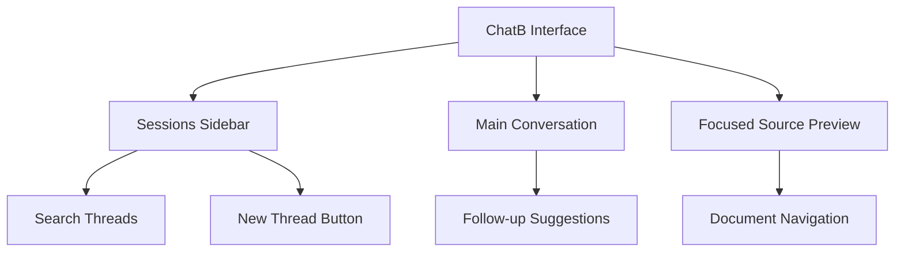

**Diagram sources**
- [ChatB.tsx](file://design/components/ChatB.tsx)

**Section sources**
- [ChatB.tsx](file://design/components/ChatB.tsx)

### ChatStates Interface Collection
- Role: Comprehensive state management demonstration for chat interfaces.
- Components:
  - ChatEmpty: Empty state with suggested prompts and scope information.
  - ChatStreaming: Live streaming response with retrieval pipeline visualization.
  - ChatCiteHover: Citation hover preview with source details.
- Features:
  - Empty state with personalized greeting and suggested prompts.
  - Streaming interface with animated pipeline steps and real-time updates.
  - Interactive citation hover with source preview and citation controls.
  - Loading states and user feedback mechanisms.

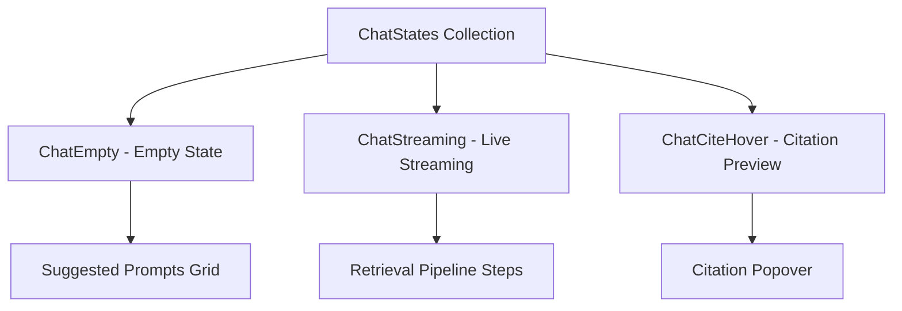

**Diagram sources**
- [ChatStates.tsx](file://design/components/ChatStates.tsx)

**Section sources**
- [ChatStates.tsx](file://design/components/ChatStates.tsx)

### AdminAudit Dashboard
- Role: Comprehensive activity audit trail with filtering and real-time updates.
- Features:
  - Filter rail with event types, user filtering, and time ranges.
  - Real-time event stream with timeline visualization.
  - Event categorization with colored badges and status indicators.
  - Detailed event information with trace IDs and metadata.
  - Export functionality and retention information.
- State management: Static demonstration with sample audit data.

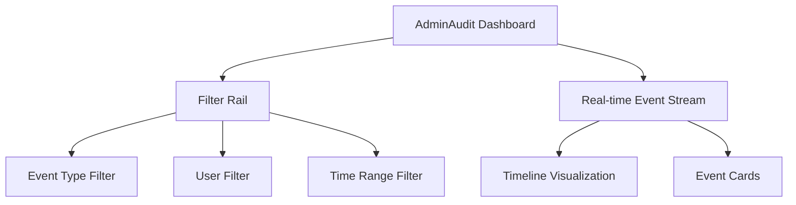

**Diagram sources**
- [AdminAudit.tsx](file://design/components/AdminAudit.tsx)

**Section sources**
- [AdminAudit.tsx](file://design/components/AdminAudit.tsx)

### AdminDocs Dashboard
- Role: Document management interface with indexing status and inspection capabilities.
- Features:
  - Document upload drop zone with supported formats.
  - Document table with type, size, chunks, and status columns.
  - Inspector panel with indexing statistics and retrieval analytics.
  - Status indicators with progress bars and color coding.
  - Action buttons for reindexing and deletion.
- State management: Static demonstration with sample document data.

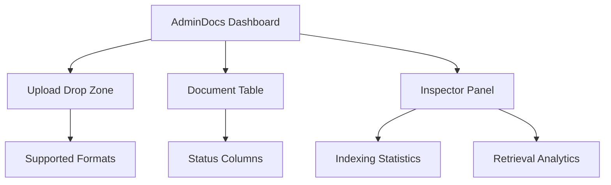

**Diagram sources**
- [AdminDocs.tsx](file://design/components/AdminDocs.tsx)

**Section sources**
- [AdminDocs.tsx](file://design/components/AdminDocs.tsx)

### AdminFeedback Dashboard
- Role: Feedback management interface with rating analysis and trace details.
- Features:
  - Feedback list with rating indicators and user information.
  - Detailed feedback view with question, answer, and reviewer notes.
  - Trace information with latency, cache, and model details.
  - Retrieved chunks analysis with scoring and relevance indicators.
  - Action recommendations for document reindexing.
- State management: Static demonstration with sample feedback data.

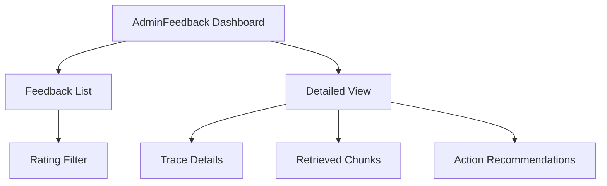

**Diagram sources**
- [AdminFeedback.tsx](file://design/components/AdminFeedback.tsx)

**Section sources**
- [AdminFeedback.tsx](file://design/components/AdminFeedback.tsx)

### AdminStats Dashboard
- Role: Comprehensive system statistics and performance monitoring dashboard.
- Features:
  - Summary headline with key metrics and trends.
  - Latency charts with p50/p95 visualization and time-based analysis.
  - Traffic analysis with hourly breakdown and departmental distribution.
  - Quality metrics with helpfulness ratios and fallback rates.
  - Cost monitoring with spending trends and budget tracking.
  - Notable events highlighting system issues and recommendations.
- State management: Static demonstration with synthetic data.

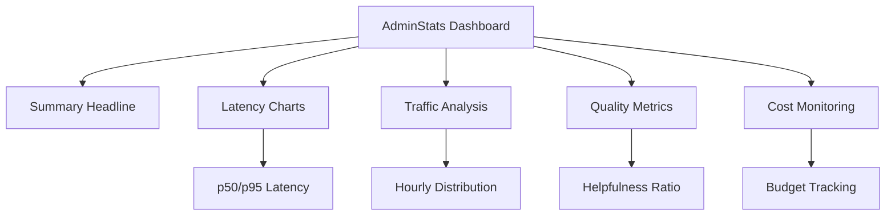

**Diagram sources**
- [AdminStats.tsx](file://design/components/AdminStats.tsx)

**Section sources**
- [AdminStats.tsx](file://design/components/AdminStats.tsx)

### Login Interface
- Role: Secure authentication interface with SSO and credential-based login options.
- Features:
  - Dark-themed security panel with privacy and compliance messaging.
  - SSO login option with identity provider integration.
  - Traditional credential login form with email and password fields.
  - System status indicators and operational information.
  - Password recovery and account management links.
- State management: Static demonstration with form validation and submission handling.

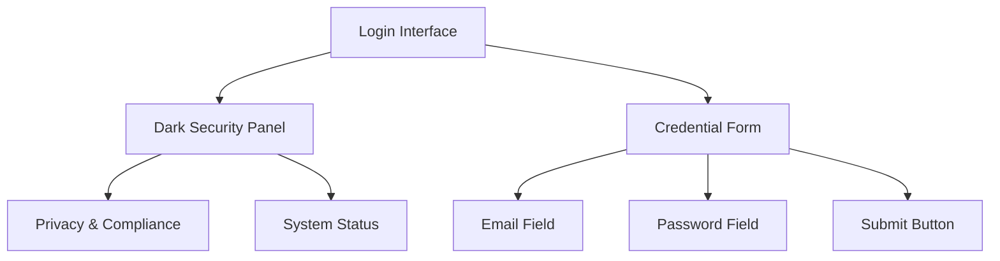

**Diagram sources**
- [Login.tsx](file://design/components/Login.tsx)

**Section sources**
- [Login.tsx](file://design/components/Login.tsx)

### SettingsPage Management
- Role: Comprehensive settings and configuration management interface.
- Features:
  - Multi-section navigation with models, retrieval, sources, security, and cost.
  - Real-time configuration editing with immediate feedback.
  - Model selection with generation, fallback, and embedding configurations.
  - Retrieval parameter tuning with chunk size and overlap controls.
  - Document source management with connection and synchronization.
  - Security settings including SSO enforcement and audit retention.
  - Cost control with daily and monthly budget limits.
- State management: Dynamic configuration with React Query integration and optimistic updates.

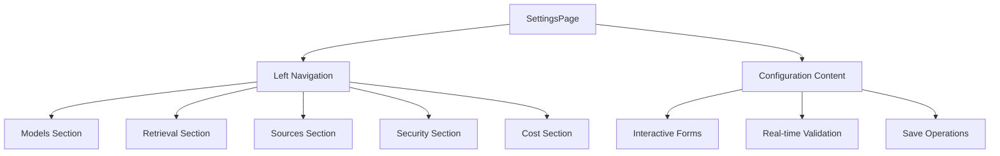

**Diagram sources**
- [SettingsPage.tsx](file://design/components/SettingsPage.tsx)

**Section sources**
- [SettingsPage.tsx](file://design/components/SettingsPage.tsx)

### Button
- Props:
  - variant: "default" | "primary" | "accent" | "ghost" | "danger".
  - size: "sm" | "md" | "lg".
  - iconLeft/iconRight: ReactNode.
  - loading/disabled: boolean.
  - onClick: callback.
  - type: "button" | "submit" | "reset".
  - className: string.
- State: None; controlled via props.
- Styling: Variant and size maps to CSS classes; loading toggles spinner; disabled applies opacity and pointer-events.
- Accessibility: Focus-visible ring; disabled state prevents interaction.

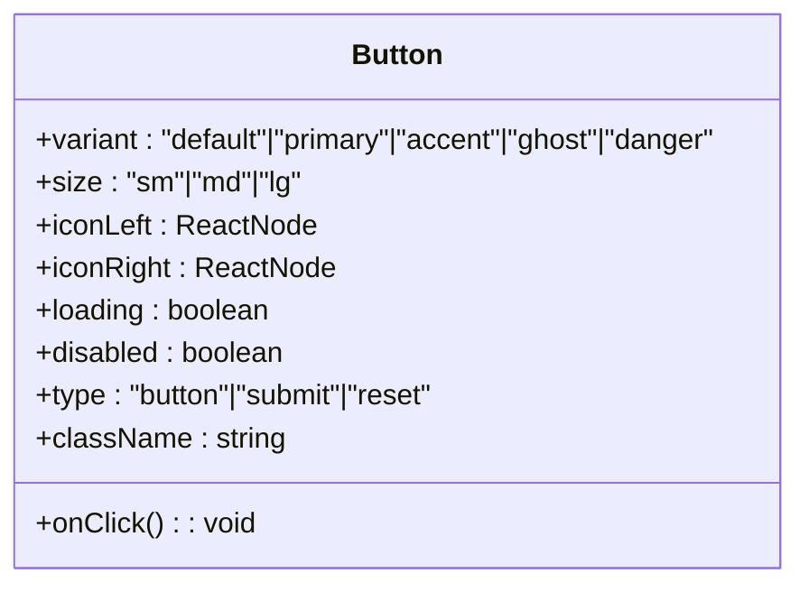

**Diagram sources**
- [Button.tsx](file://safe4ai-pilot/frontend/src/components/Button.tsx)

**Section sources**
- [Button.tsx](file://safe4ai-pilot/frontend/src/components/Button.tsx)

### Chip
- Props:
  - variant: "default" | "solid".
  - tone: "neutral" | "success" | "warn" | "danger" | "accent".
  - children: ReactNode.
- State: None; controlled via props.
- Styling: Dot color mapping per tone; rounded pill; variant-specific background/text.

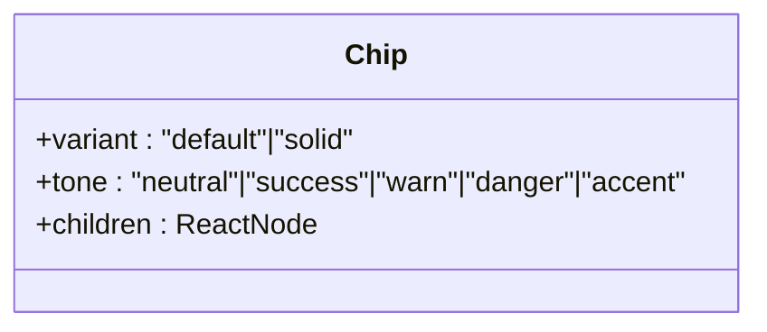

**Diagram sources**
- [Chip.tsx](file://safe4ai-pilot/frontend/src/components/Chip.tsx)

**Section sources**
- [Chip.tsx](file://safe4ai-pilot/frontend/src/components/Chip.tsx)

### Avatar
- Props:
  - name: string; used to compute initials.
  - size: number; avatar diameter.
  - color: string; background color override.
- State: None; controlled via props.
- Styling: Circular container with proportional font size; centered initials.

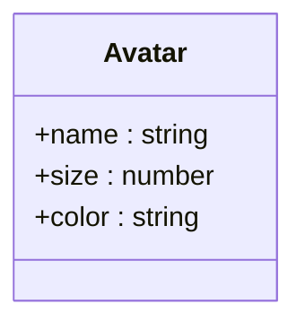

**Diagram sources**
- [Avatar.tsx](file://safe4ai-pilot/frontend/src/components/Avatar.tsx)

**Section sources**
- [Avatar.tsx](file://safe4ai-pilot/frontend/src/components/Avatar.tsx)

### MessageBubble
- Props:
  - role: "user" | "assistant".
  - children: ReactNode.
- State: None; controlled via props.
- Styling: Different alignment and border-radius per role; assistant bubble constrained width.

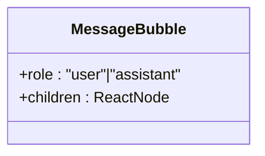

**Diagram sources**
- [MessageBubble.tsx](file://safe4ai-pilot/frontend/src/components/chat/MessageBubble.tsx)

**Section sources**
- [MessageBubble.tsx](file://safe4ai-pilot/frontend/src/components/chat/MessageBubble.tsx)

### Composer
- Props:
  - value: string; textarea content.
  - onChange: (v: string) => void; updates value and auto-resizes.
  - onSubmit: () => void; submits when Enter pressed or send button clicked.
  - scope: { name, chunkCount }.
  - disabled: boolean.
  - placeholder: string.
- State: None; controlled via props.
- Interactions:
  - Enter without Shift triggers submit if value is non-empty.
  - Auto-grow textarea up to a max height.
  - Send button enabled only when value is non-empty.
- Composition: Uses Button for send action; integrates with chat hooks for submission.

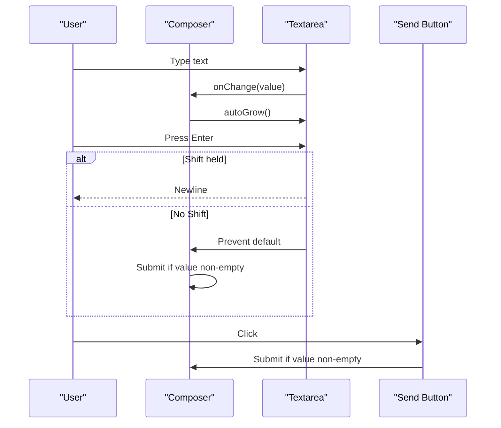

**Diagram sources**
- [Composer.tsx](file://safe4ai-pilot/frontend/src/components/chat/Composer.tsx)

**Section sources**
- [Composer.tsx](file://safe4ai-pilot/frontend/src/components/chat/Composer.tsx)

### AnswerBlock
- Props:
  - body: string; rendered answer text with citation markers.
  - sources: SseCite[]; citation list.
  - trust: { latencyMs, cacheHit, model, kRetrieved }.
  - onCopy/onRate/onCitationOpen: callbacks.
  - isStreaming: boolean; shows typing indicator.
  - rated: "up" | "down" | undefined; disables rating after selection.
- State:
  - activeId: string | null; tracks expanded citation.
- Rendering:
  - Parses body to replace citation markers with CitationChip links.
  - Renders TrustSignal; citation chips expand to show SourceRow.
  - Provides copy and thumbs-up/thumbs-down actions.
- Composition: Uses CitationChip, SourceRow, TrustSignal; integrates with chat hooks.

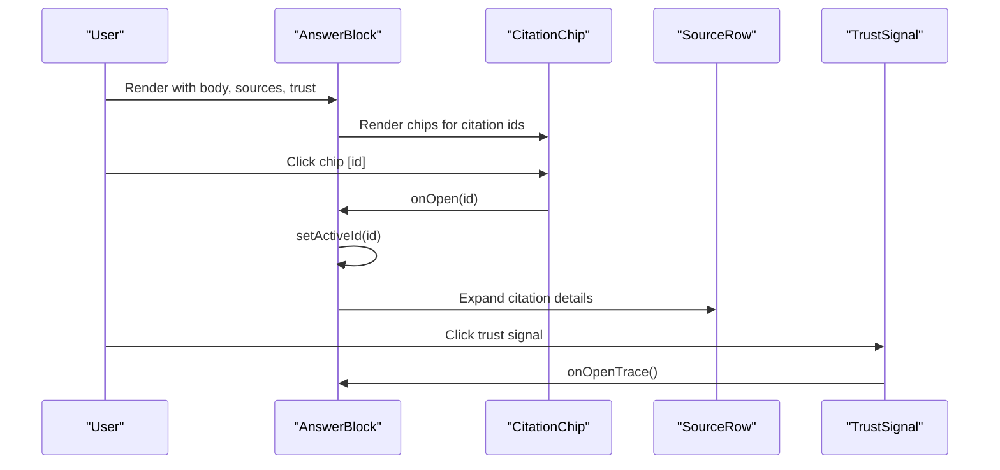

**Diagram sources**
- [AnswerBlock.tsx](file://safe4ai-pilot/frontend/src/components/chat/AnswerBlock.tsx)
- [CitationChip.tsx](file://safe4ai-pilot/frontend/src/components/chat/CitationChip.tsx)
- [SourceRow.tsx](file://safe4ai-pilot/frontend/src/components/chat/SourceRow.tsx)
- [TrustSignal.tsx](file://safe4ai-pilot/frontend/src/components/chat/TrustSignal.tsx)

**Section sources**
- [AnswerBlock.tsx](file://safe4ai-pilot/frontend/src/components/chat/AnswerBlock.tsx)
- [CitationChip.tsx](file://safe4ai-pilot/frontend/src/components/chat/CitationChip.tsx)
- [SourceRow.tsx](file://safe4ai-pilot/frontend/src/components/chat/SourceRow.tsx)
- [TrustSignal.tsx](file://safe4ai-pilot/frontend/src/components/chat/TrustSignal.tsx)

### ActivityEvent
- Props:
  - event: AuditEvent; includes kind, who, query, latencyMs, traceId, timestamp.
- Rendering:
  - Badge per event kind with color mapping.
  - Timeline dot with color mapping.
  - Time, kind badge, actor, latency (when applicable), query preview, trace id.
- Composition: Used within admin activity timelines.

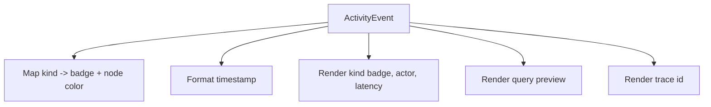

**Diagram sources**
- [ActivityEvent.tsx](file://safe4ai-pilot/frontend/src/components/admin/ActivityEvent.tsx)

**Section sources**
- [ActivityEvent.tsx](file://safe4ai-pilot/frontend/src/components/admin/ActivityEvent.tsx)

### DocumentRow
- Props:
  - doc: DocumentRecord; includes type, name, note, chunks, size, status, addedAt, addedBy.
  - selected: boolean; highlights selection.
  - onSelect/onReindex: callbacks.
- Rendering:
  - File type badge with color mapping.
  - Name and optional note.
  - Type, chunks, size.
  - Status with animated loader for embedding or Chip for other statuses.
  - Added date and author.
  - Action button appears on hover.
- Composition: Uses Chip for status; integrates with document management APIs.

```mermaid
classDiagram
class DocumentRow {
+doc : DocumentRecord
+selected : boolean
+onSelect() : void
+onReindex() : void
}
class Chip
DocumentRow --> Chip : "renders status"
```

**Diagram sources**
- [DocumentRow.tsx](file://safe4ai-pilot/frontend/src/components/admin/DocumentRow.tsx)
- [Chip.tsx](file://safe4ai-pilot/frontend/src/components/Chip.tsx)

**Section sources**
- [DocumentRow.tsx](file://safe4ai-pilot/frontend/src/components/admin/DocumentRow.tsx)

### Sparkline
- Props:
  - data: number[]; series for plotting.
  - color: string; stroke/fill color.
  - height: number; SVG height.
  - fill: boolean; whether to fill area under the line.
- Rendering:
  - Normalizes data to SVG coordinates.
  - Draws a path; optionally fills area; adds an endpoint circle.
- Composition: Used in admin dashboards for trend visualization.

```mermaid
flowchart TD
S["Sparkline"] --> CheckLen{"data length >= 2?"}
CheckLen --> |No| Null["Return null"]
CheckLen --> |Yes| Norm["Normalize min/max to SVG coords"]
Norm --> Path["Draw path"]
Path --> Fill{"fill enabled?"}
Fill --> |Yes| Area["Fill area under path"]
Fill --> |No| End["Render"]
Area --> End
```

**Diagram sources**
- [Sparkline.tsx](file://safe4ai-pilot/frontend/src/components/admin/Sparkline.tsx)

**Section sources**
- [Sparkline.tsx](file://safe4ai-pilot/frontend/src/components/admin/Sparkline.tsx)

## Dependency Analysis
- Internal dependencies:
  - Chat components depend on shared utilities (ChatShared) and shared primitives (Button, Chip).
  - Admin components depend on shared primitives (Chip, Button).
  - AdminShell composes admin-specific rows and events.
  - New chat interfaces extend ChatShared utilities with enhanced state management.
  - SettingsPage integrates with React Query for state management and API communication.
  - Authentication components utilize design system primitives and security patterns.
- External dependencies:
  - Icons imported from design/icons module.
  - Lucide icons used in several components (Composer, CitationChip, SourceRow, Sparkline).
  - React Query for state management in SettingsPage.
  - TanStack Query for reactive data fetching and caching.
- Coupling:
  - Low to moderate; components are cohesive around domain concerns.
  - Props-driven composition reduces tight coupling.
  - Enhanced separation of concerns with specialized component domains.

```mermaid
graph LR
CS["ChatShared.tsx"] --> MB["MessageBubble.tsx"]
CS --> CMP["Composer.tsx"]
CS --> AB["AnswerBlock.tsx"]
CS --> CC["CitationChip.tsx"]
CS --> SR["SourceRow.tsx"]
CS --> TS["TrustSignal.tsx"]
AS["AdminShell.tsx"] --> AE["ActivityEvent.tsx"]
AS --> DR["DocumentRow.tsx"]
AS --> SPL["Sparkline.tsx"]
AB --> CC
AB --> SR
AB --> TS
CMP --> BTN["Button.tsx"]
DR --> CHIP["Chip.tsx"]
SPA["SettingsPage.tsx"] --> RQ["React Query"]
LOGIN["Login.tsx"] --> CS
CHATCOLLECTION["ChatStates.tsx"] --> CS
CHATB["ChatB.tsx"] --> CS
CHATA["ChatA.tsx"] --> CS
ADMINCOLLECTION["AdminStats.tsx"] --> SPL
ADMINFEEDBACK["AdminFeedback.tsx"] --> CS
```

**Diagram sources**
- [ChatShared.tsx](file://design/components/ChatShared.tsx)
- [MessageBubble.tsx](file://safe4ai-pilot/frontend/src/components/chat/MessageBubble.tsx)
- [Composer.tsx](file://safe4ai-pilot/frontend/src/components/chat/Composer.tsx)
- [AnswerBlock.tsx](file://safe4ai-pilot/frontend/src/components/chat/AnswerBlock.tsx)
- [CitationChip.tsx](file://safe4ai-pilot/frontend/src/components/chat/CitationChip.tsx)
- [SourceRow.tsx](file://safe4ai-pilot/frontend/src/components/chat/SourceRow.tsx)
- [TrustSignal.tsx](file://safe4ai-pilot/frontend/src/components/chat/TrustSignal.tsx)
- [AdminShell.tsx](file://design/components/AdminShell.tsx)
- [ActivityEvent.tsx](file://safe4ai-pilot/frontend/src/components/admin/ActivityEvent.tsx)
- [DocumentRow.tsx](file://safe4ai-pilot/frontend/src/components/admin/DocumentRow.tsx)
- [Sparkline.tsx](file://safe4ai-pilot/frontend/src/components/admin/Sparkline.tsx)
- [Button.tsx](file://safe4ai-pilot/frontend/src/components/Button.tsx)
- [Chip.tsx](file://safe4ai-pilot/frontend/src/components/Chip.tsx)
- [SettingsPage.tsx](file://design/components/SettingsPage.tsx)
- [Login.tsx](file://design/components/Login.tsx)
- [ChatStates.tsx](file://design/components/ChatStates.tsx)
- [ChatB.tsx](file://design/components/ChatB.tsx)
- [ChatA.tsx](file://design/components/ChatA.tsx)
- [AdminStats.tsx](file://design/components/AdminStats.tsx)
- [AdminFeedback.tsx](file://design/components/AdminFeedback.tsx)

**Section sources**
- [ChatShared.tsx](file://design/components/ChatShared.tsx)
- [AdminShell.tsx](file://design/components/AdminShell.tsx)
- [SettingsPage.tsx](file://design/components/SettingsPage.tsx)

## Performance Considerations
- Rendering:
  - Prefer memoization for expensive computations (e.g., citation parsing) if reused frequently.
  - Avoid unnecessary re-renders by passing stable callbacks and objects.
  - New chat interfaces implement efficient state management with minimal re-renders.
  - SettingsPage uses React Query for optimized data fetching and caching.
- DOM:
  - Keep inline styles minimal; prefer CSS classes for layout and theming.
  - Limit dynamic class concatenation; precompute class strings when possible.
  - Enhanced component composition reduces DOM complexity in chat interfaces.
- Interaction:
  - Debounce auto-grow textarea to reduce layout thrash.
  - Disable buttons during async operations to prevent redundant submissions.
  - New interfaces implement debounced interactions for better performance.
- Data:
  - Paginate or virtualize long lists (activity timelines, document tables).
  - SettingsPage implements efficient data structures for configuration management.
- Assets:
  - Lazy-load icons and images; reuse icon components.
  - Authentication interfaces optimize asset loading for security screens.

## Accessibility and Responsive Behavior
- Accessibility:
  - Buttons and interactive elements support keyboard navigation and focus-visible rings.
  - Disabled states convey opacity and pointer-events changes.
  - Semantic HTML and proper labeling for actionable elements.
  - Enhanced focus management in complex interfaces like SettingsPage.
- Responsive:
  - Flexible grids and wrapping chips adapt to narrow widths.
  - Text truncation and clamp utilities maintain readability.
  - Relative units and clamp-based layouts improve scaling across devices.
  - New chat interfaces implement adaptive layouts for different screen sizes.
  - SettingsPage provides optimal viewing experience across device dimensions.

## Testing Approaches
- Unit tests:
  - Snapshot tests for static components (Button, Chip, Avatar, MessageBubble).
  - Prop-driven tests for ChatShared utilities (TrustSignal, SourceRow).
  - Component isolation tests for new chat interfaces and administrative components.
- Interaction tests:
  - Composer: simulate Enter key, Shift+Enter newline, send button click, disabled states.
  - AnswerBlock: citation chip clicks, copy, rating, streaming indicator.
  - Chat interfaces: state transitions, navigation, and user interactions.
  - SettingsPage: form validation, configuration updates, and error handling.
- Integration tests:
  - AdminShell navigation and headerRight injection.
  - ActivityEvent rendering and timeline nodes.
  - DocumentRow selection and hover actions.
  - Authentication flow and form validation.
- E2E tests:
  - Use screenshots and responsive checks for cross-device validation.
  - Test complex workflows like document upload, indexing, and retrieval.
  - Validate settings persistence and configuration application.

## Troubleshooting Guide
- Button not responding:
  - Verify disabled/loading props; ensure onClick is passed and not shadowed.
- Composer not submitting:
  - Confirm value is trimmed before submit; check Enter key handling and Shift modifier.
  - Ensure textarea ref is attached and auto-grow executes.
- AnswerBlock citations not clickable:
  - Ensure citation markers are properly formatted; verify onOpen handler wiring.
- TrustSignal not opening trace:
  - Confirm onOpenTrace prop is passed down from parent.
- AdminShell nav highlighting:
  - Ensure active prop matches expected id; verify Icon mapping.
- New chat interfaces not rendering:
  - Verify ChatShared utilities are properly imported and configured.
  - Check component composition and state management patterns.
- SettingsPage not updating:
  - Ensure React Query is properly configured and mutations are handled.
  - Verify API endpoints and data serialization.
- Authentication failures:
  - Check credential validation and SSO integration.
  - Verify token handling and session management.

**Section sources**
- [Button.tsx](file://safe4ai-pilot/frontend/src/components/Button.tsx)
- [Composer.tsx](file://safe4ai-pilot/frontend/src/components/chat/Composer.tsx)
- [AnswerBlock.tsx](file://safe4ai-pilot/frontend/src/components/chat/AnswerBlock.tsx)
- [TrustSignal.tsx](file://safe4ai-pilot/frontend/src/components/chat/TrustSignal.tsx)
- [AdminShell.tsx](file://design/components/AdminShell.tsx)
- [ChatA.tsx](file://design/components/ChatA.tsx)
- [ChatB.tsx](file://design/components/ChatB.tsx)
- [ChatStates.tsx](file://design/components/ChatStates.tsx)
- [SettingsPage.tsx](file://design/components/SettingsPage.tsx)
- [Login.tsx](file://design/components/Login.tsx)

## Conclusion
The Private AI component library has significantly expanded with comprehensive chat interfaces, administrative dashboards, authentication components, and settings management. The enhanced architecture emphasizes domain specialization while maintaining consistency and composability. Foundations define tokens and primitives; shared components provide reusable building blocks; specialized interfaces encapsulate complex UI patterns for different user roles and workflows. By adhering to prop-driven composition, accessible interaction patterns, and performance-conscious rendering, the library scales across diverse experiences while maintaining a coherent design language and robust state management.

## Appendices
- Customization options:
  - Variants and sizes for Button and Chip.
  - Tone and variant for Chip; color overrides for Avatar.
  - TrustSignal and CitationChip styling via props and CSS classes.
  - New chat interfaces offer extensive customization through state management.
  - SettingsPage provides granular control over system configuration.
- Integration patterns:
  - AdminShell wraps page content and injects headerRight.
  - Chat components compose with shared utilities for citations and trust signals.
  - DocumentRow integrates with document management APIs via callbacks.
  - SettingsPage integrates with React Query for reactive state management.
  - Authentication components follow security-first design patterns.
- Advanced features:
  - Real-time data updates through React Query integration.
  - Comprehensive state management for complex user interactions.
  - Enhanced accessibility compliance across all component interfaces.
  - Performance optimizations for large-scale administrative interfaces.