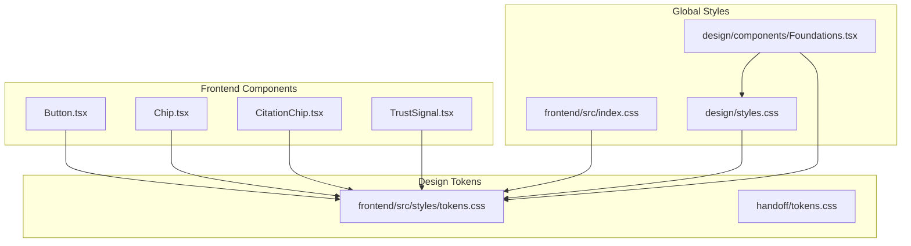
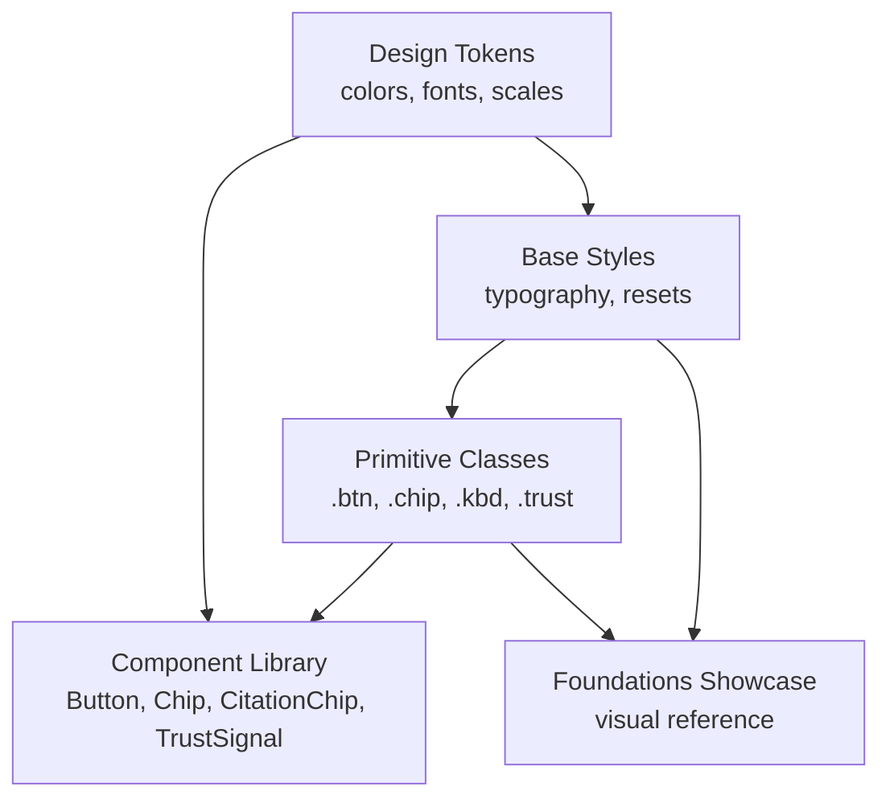
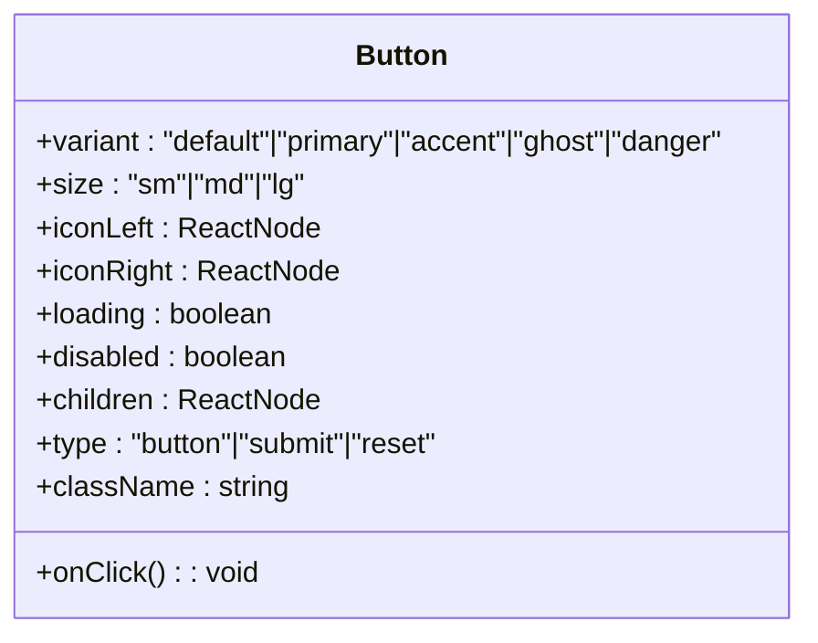
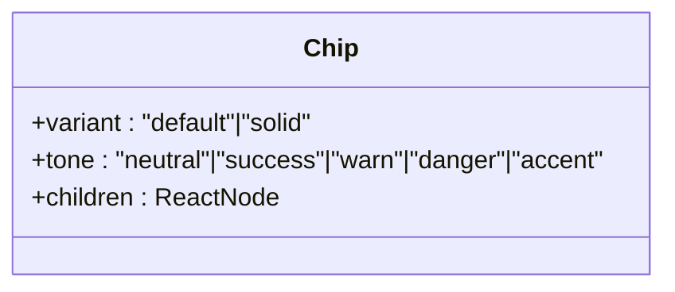
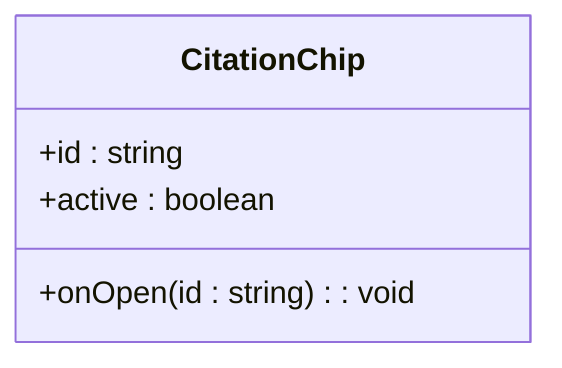
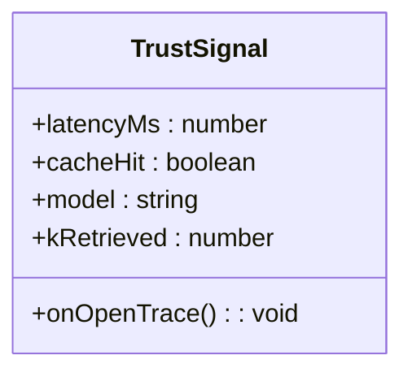
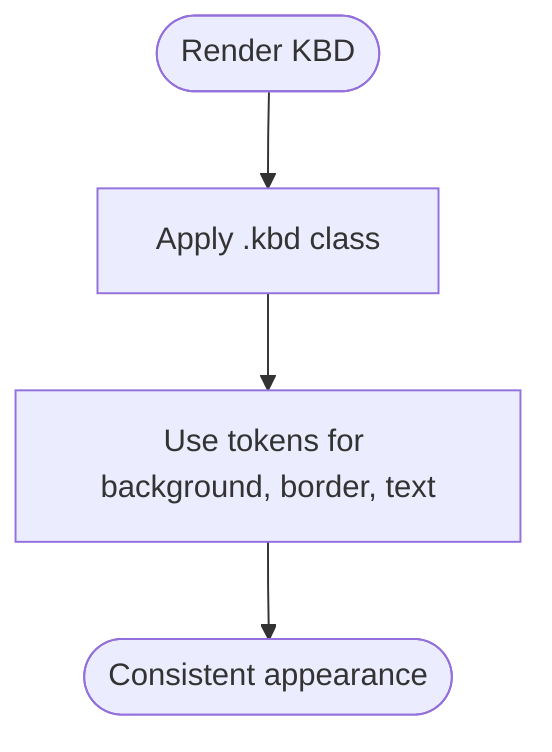
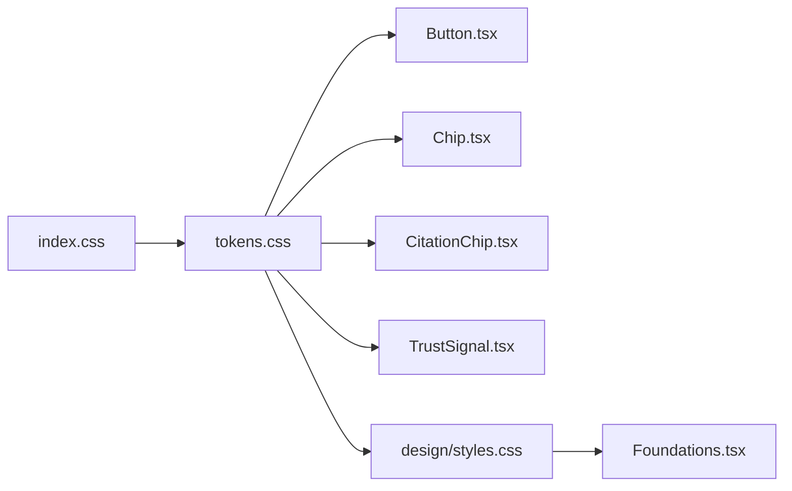

# Foundational Components

<cite>
**Referenced Files in This Document**
- [Button.tsx](file://safe4ai-pilot/frontend/src/components/Button.tsx)
- [Chip.tsx](file://safe4ai-pilot/frontend/src/components/Chip.tsx)
- [CitationChip.tsx](file://safe4ai-pilot/frontend/src/components/chat/CitationChip.tsx)
- [TrustSignal.tsx](file://safe4ai-pilot/frontend/src/components/chat/TrustSignal.tsx)
- [Foundations.tsx](file://design/components/Foundations.tsx)
- [tokens.css](file://safe4ai-pilot/frontend/src/styles/tokens.css)
- [tokens.css](file://handoff/tokens.css)
- [styles.css](file://design/styles.css)
- [index.css](file://safe4ai-pilot/frontend/src/index.css)
</cite>

## Table of Contents
1. [Introduction](#introduction)
2. [Project Structure](#project-structure)
3. [Core Components](#core-components)
4. [Architecture Overview](#architecture-overview)
5. [Detailed Component Analysis](#detailed-component-analysis)
6. [Dependency Analysis](#dependency-analysis)
7. [Performance Considerations](#performance-considerations)
8. [Troubleshooting Guide](#troubleshooting-guide)
9. [Conclusion](#conclusion)
10. [Appendices](#appendices)

## Introduction
This document describes the foundational UI components of the Private AI design system. It focuses on primitive components used across the product: Button, Chip, CitationChip, TrustSignal, and KBD elements. It explains the component architecture, styling patterns using CSS variables (--paper, --ink, --blue), and the typography system. It also documents prop interfaces, styling customization options, accessibility features, and practical usage patterns for composition, state management, and responsive behavior. Finally, it outlines the design token system, color palette, and type scale, and how these primitives integrate into the broader design system.

## Project Structure
The foundational components are implemented in the frontend application and complemented by design system assets and tokens. The most relevant locations are:
- Component implementations: safe4ai-pilot/frontend/src/components and safe4ai-pilot/frontend/src/components/chat
- Shared design tokens: safe4ai-pilot/frontend/src/styles/tokens.css and handoff/tokens.css
- Global styles and primitive CSS classes: design/styles.css and safe4ai-pilot/frontend/src/index.css
- Design foundations showcase: design/components/Foundations.tsx

**Diagram sources**
- [Button.tsx:1-56](file://safe4ai-pilot/frontend/src/components/Button.tsx#L1-L56)
- [Chip.tsx:1-32](file://safe4ai-pilot/frontend/src/components/Chip.tsx#L1-L32)
- [CitationChip.tsx:1-23](file://safe4ai-pilot/frontend/src/components/chat/CitationChip.tsx#L1-L23)
- [TrustSignal.tsx:1-27](file://safe4ai-pilot/frontend/src/components/chat/TrustSignal.tsx#L1-L27)
- [tokens.css:1-69](file://safe4ai-pilot/frontend/src/styles/tokens.css#L1-L69)
- [tokens.css:1-90](file://handoff/tokens.css#L1-L90)
- [styles.css:1-320](file://design/styles.css#L1-L320)
- [index.css:1-16](file://safe4ai-pilot/frontend/src/index.css#L1-L16)
- [Foundations.tsx:1-136](file://design/components/Foundations.tsx#L1-L136)

**Section sources**
- [Button.tsx:1-56](file://safe4ai-pilot/frontend/src/components/Button.tsx#L1-L56)
- [Chip.tsx:1-32](file://safe4ai-pilot/frontend/src/components/Chip.tsx#L1-L32)
- [CitationChip.tsx:1-23](file://safe4ai-pilot/frontend/src/components/chat/CitationChip.tsx#L1-L23)
- [TrustSignal.tsx:1-27](file://safe4ai-pilot/frontend/src/components/chat/TrustSignal.tsx#L1-L27)
- [Foundations.tsx:1-136](file://design/components/Foundations.tsx#L1-L136)
- [tokens.css:1-69](file://safe4ai-pilot/frontend/src/styles/tokens.css#L1-L69)
- [tokens.css:1-90](file://handoff/tokens.css#L1-L90)
- [styles.css:1-320](file://design/styles.css#L1-L320)
- [index.css:1-16](file://safe4ai-pilot/frontend/src/index.css#L1-L16)

## Core Components
This section summarizes the core primitive components and their roles in the design system.

- Button
  - Purpose: Interactive actions with multiple variants and sizes.
  - Variants: default, primary, accent, ghost, danger.
  - Sizes: sm, md, lg.
  - Features: loading state, disabled state, icons, focus ring, transition effects.
  - Accessibility: focus-visible ring, disabled state handling.

- Chip
  - Purpose: Lightweight status indicators with dots and optional solid fills.
  - Tones: neutral, success, warn, danger, accent.
  - Variants: default, solid.
  - Features: dot color per tone, consistent sizing and typography.

- CitationChip
  - Purpose: Inline citation references in chat answers.
  - State: active vs inactive with distinct styling.
  - Interaction: click handler to open citation context.

- TrustSignal
  - Purpose: Non-intrusive transparency signals (latency, cache hit, model, retrievals).
  - Interaction: click handler to open trace details.

- KBD
  - Purpose: Keyboard shortcut hints.
  - Implementation: Atomic CSS class for consistent appearance across components.

Practical usage examples (described conceptually):
- Compose Button with iconLeft/iconRight and handle onClick to trigger actions.
- Render Chip with appropriate tone to reflect status (e.g., success for indexed).
- Use CitationChip to link answer text to cited sources; manage active state to highlight the selected citation.
- Display TrustSignal to communicate runtime performance and retrieval behavior; open trace on click.
- Apply KBD class to indicate keyboard shortcuts in UI.

**Section sources**
- [Button.tsx:1-56](file://safe4ai-pilot/frontend/src/components/Button.tsx#L1-L56)
- [Chip.tsx:1-32](file://safe4ai-pilot/frontend/src/components/Chip.tsx#L1-L32)
- [CitationChip.tsx:1-23](file://safe4ai-pilot/frontend/src/components/chat/CitationChip.tsx#L1-L23)
- [TrustSignal.tsx:1-27](file://safe4ai-pilot/frontend/src/components/chat/TrustSignal.tsx#L1-L27)
- [styles.css:99-108](file://design/styles.css#L99-L108)

## Architecture Overview
The design system relies on a layered approach:
- Design tokens define color, typography, spacing, and shadows.
- Global CSS establishes base styles and primitive classes.
- Component libraries encapsulate behavior and styling for reuse.
- Foundational showcases demonstrate token usage and primitive combinations.

**Diagram sources**
- [tokens.css:1-69](file://safe4ai-pilot/frontend/src/styles/tokens.css#L1-L69)
- [styles.css:1-320](file://design/styles.css#L1-L320)
- [Foundations.tsx:1-136](file://design/components/Foundations.tsx#L1-L136)

## Detailed Component Analysis

### Button
- Props interface
  - variant?: "default" | "primary" | "accent" | "ghost" | "danger"
  - size?: "sm" | "md" | "lg"
  - iconLeft?: ReactNode
  - iconRight?: ReactNode
  - loading?: boolean
  - disabled?: boolean
  - children?: ReactNode
  - onClick?: () => void
  - type?: "button" | "submit" | "reset"
  - className?: string
- Styling pattern
  - Uses CSS variable tokens for colors and radii.
  - Variant-specific background/text/outline classes.
  - Size-specific height, padding, and font size.
  - Focus-visible ring with accent color.
  - Disabled state reduces opacity and disables interactions.
- Accessibility
  - Disabled state prevents pointer events.
  - Focus ring ensures keyboard operability.
- Composition and state
  - Combine with icons and handle onClick.
  - loading toggles spinner; disables button.

**Diagram sources**
- [Button.tsx:21-32](file://safe4ai-pilot/frontend/src/components/Button.tsx#L21-L32)

**Section sources**
- [Button.tsx:1-56](file://safe4ai-pilot/frontend/src/components/Button.tsx#L1-L56)

### Chip
- Props interface
  - variant?: "default" | "solid"
  - tone?: "neutral" | "success" | "warn" | "danger" | "accent"
  - children?: ReactNode
- Styling pattern
  - Dot color mapped per tone.
  - Background and border classes vary by tone and variant.
  - Consistent height, padding, and rounded pill shape.
- Composition and state
  - Use tone to reflect status; use solid variant for emphasis.

**Diagram sources**
- [Chip.tsx:22-22](file://safe4ai-pilot/frontend/src/components/Chip.tsx#L22-L22)

**Section sources**
- [Chip.tsx:1-32](file://safe4ai-pilot/frontend/src/components/Chip.tsx#L1-L32)

### CitationChip
- Props interface
  - id: string
  - active?: boolean
  - onOpen?: (id: string) => void
- Styling pattern
  - Monospace font and compact sizing.
  - Active state applies accent background and white text.
  - Hover effects include subtle shadow.
- Interaction
  - onClick triggers onOpen callback with id.

**Diagram sources**
- [CitationChip.tsx:1-7](file://safe4ai-pilot/frontend/src/components/chat/CitationChip.tsx#L1-L7)

**Section sources**
- [CitationChip.tsx:1-23](file://safe4ai-pilot/frontend/src/components/chat/CitationChip.tsx#L1-L23)

### TrustSignal
- Props interface
  - latencyMs: number
  - cacheHit: boolean
  - model: string
  - kRetrieved: number
  - onOpenTrace?: () => void
- Styling pattern
  - Monospace typography for readability.
  - Conditional color for cache-hit indicator.
  - Uses tokens for text and line colors.
- Interaction
  - onClick triggers onOpenTrace.

**Diagram sources**
- [TrustSignal.tsx:1-7](file://safe4ai-pilot/frontend/src/components/chat/TrustSignal.tsx#L1-L7)

**Section sources**
- [TrustSignal.tsx:1-27](file://safe4ai-pilot/frontend/src/components/chat/TrustSignal.tsx#L1-L27)

### KBD Elements
- Implementation
  - Atomic CSS class .kbd defines consistent keyboard shortcut styling.
  - Used across components for uniform presentation.
- Styling pattern
  - Monospace font, border, rounded corners, and subtle background.

**Diagram sources**
- [styles.css:99-108](file://design/styles.css#L99-L108)

**Section sources**
- [styles.css:99-108](file://design/styles.css#L99-L108)

## Dependency Analysis
The components depend on:
- Design tokens for colors, fonts, and scales.
- Global base styles for typography and resets.
- Primitive CSS classes for consistent visuals.

**Diagram sources**
- [tokens.css:1-69](file://safe4ai-pilot/frontend/src/styles/tokens.css#L1-L69)
- [styles.css:1-320](file://design/styles.css#L1-L320)
- [index.css:1-16](file://safe4ai-pilot/frontend/src/index.css#L1-L16)
- [Button.tsx:1-56](file://safe4ai-pilot/frontend/src/components/Button.tsx#L1-L56)
- [Chip.tsx:1-32](file://safe4ai-pilot/frontend/src/components/Chip.tsx#L1-L32)
- [CitationChip.tsx:1-23](file://safe4ai-pilot/frontend/src/components/chat/CitationChip.tsx#L1-L23)
- [TrustSignal.tsx:1-27](file://safe4ai-pilot/frontend/src/components/chat/TrustSignal.tsx#L1-L27)
- [Foundations.tsx:1-136](file://design/components/Foundations.tsx#L1-L136)

**Section sources**
- [tokens.css:1-69](file://safe4ai-pilot/frontend/src/styles/tokens.css#L1-L69)
- [styles.css:1-320](file://design/styles.css#L1-L320)
- [index.css:1-16](file://safe4ai-pilot/frontend/src/index.css#L1-L16)
- [Button.tsx:1-56](file://safe4ai-pilot/frontend/src/components/Button.tsx#L1-L56)
- [Chip.tsx:1-32](file://safe4ai-pilot/frontend/src/components/Chip.tsx#L1-L32)
- [CitationChip.tsx:1-23](file://safe4ai-pilot/frontend/src/components/chat/CitationChip.tsx#L1-L23)
- [TrustSignal.tsx:1-27](file://safe4ai-pilot/frontend/src/components/chat/TrustSignal.tsx#L1-L27)
- [Foundations.tsx:1-136](file://design/components/Foundations.tsx#L1-L136)

## Performance Considerations
- Prefer CSS variables for theming to minimize re-renders and enable efficient dark/light switching.
- Use primitive classes for low-level styling to avoid heavy component wrappers.
- Keep component props minimal to reduce unnecessary re-renders.
- Defer heavy computations in event handlers; leverage memoization where appropriate.

## Troubleshooting Guide
- Button disabled state not working
  - Ensure disabled or loading props are passed; disabled state sets opacity and pointer-events.
- Chip dot color incorrect
  - Verify tone prop matches supported values; dot color is derived from tone mapping.
- CitationChip hover or active state
  - Confirm active prop and CSS classes are applied; ensure onClick handler is wired.
- TrustSignal color inconsistency
  - Check cacheHit prop; color is conditionally applied based on this flag.
- KBD class not appearing
  - Confirm .kbd class is included in the render and global styles are loaded.

**Section sources**
- [Button.tsx:42-48](file://safe4ai-pilot/frontend/src/components/Button.tsx#L42-L48)
- [Chip.tsx:24-30](file://safe4ai-pilot/frontend/src/components/Chip.tsx#L24-L30)
- [CitationChip.tsx:14-16](file://safe4ai-pilot/frontend/src/components/chat/CitationChip.tsx#L14-L16)
- [TrustSignal.tsx:18-18](file://safe4ai-pilot/frontend/src/components/chat/TrustSignal.tsx#L18-L18)
- [styles.css:99-108](file://design/styles.css#L99-L108)

## Conclusion
The Private AI design system’s foundational components are built on a robust token-driven architecture. Buttons, Chips, CitationChips, TrustSignals, and KBD elements consistently leverage design tokens and primitive classes to ensure visual coherence and maintainability. By adhering to the documented prop interfaces, styling patterns, and accessibility guidelines, teams can compose reliable UIs that scale across the product.

## Appendices

### Design Token System and Typography
- Color palette
  - Dark surfaces and text: --ink, --ink-2, --ink-3, --ink-4
  - Surfaces: --paper, --paper-2, --paper-3, --surface, --surface-2
  - Borders and dividers: --line, --line-2, --line-3
  - Text: --text, --text-2, --text-3, --text-mute
  - Neutrals: --slate, --slate-2, --slate-3
  - Actions: --blue, --blue-2, --blue-soft, --blue-tint
  - Status: --green, --green-soft, --amber, --amber-soft, --red, --red-soft
- Typography
  - Families: --font-sans, --font-mono, --font-serif
  - Type scale: --t-xs, --t-sm, --t-base, --t-md, --t-body, --t-lg, --t-h2, --t-h1, --t-display
- Spacing and radii
  - Spacing scale: --sp-1 through --sp-12 (base 4px)
  - Radii: --r-sm, --r, --r-lg, --r-xl
- Shadows
  - --sh-1, --sh-2, --sh-3, --sh-pop

**Section sources**
- [tokens.css:1-69](file://safe4ai-pilot/frontend/src/styles/tokens.css#L1-L69)
- [tokens.css:1-90](file://handoff/tokens.css#L1-L90)
- [styles.css:50-65](file://design/styles.css#L50-L65)

### Component Composition Patterns
- Buttons
  - Use variant and size to match affordance and density.
  - Add icons for clarity; avoid redundant text.
- Chips
  - Choose tone to communicate status; use solid variant sparingly.
- CitationChips
  - Pair with citation drawers; manage active state for clarity.
- TrustSignals
  - Place near answer content; provide trace access on click.
- KBD
  - Use consistently for keyboard shortcuts; avoid clutter.

### Accessibility Checklist
- Focus management
  - Ensure focus-visible rings are visible and sufficient contrast.
- Disabled states
  - Disable interactive elements; avoid pointer events.
- Semantic labeling
  - Use aria attributes when integrating with complex widgets.
- Color contrast
  - Maintain WCAG contrast ratios across tones and backgrounds.