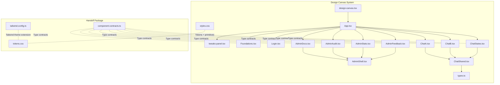
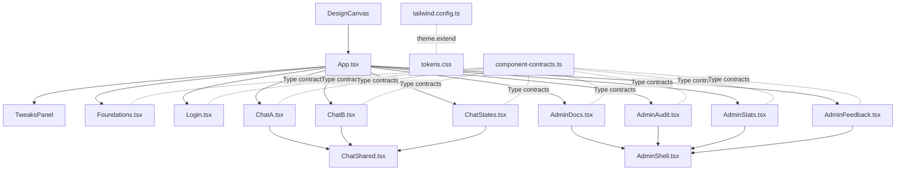
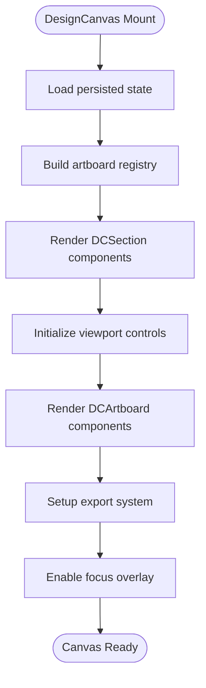
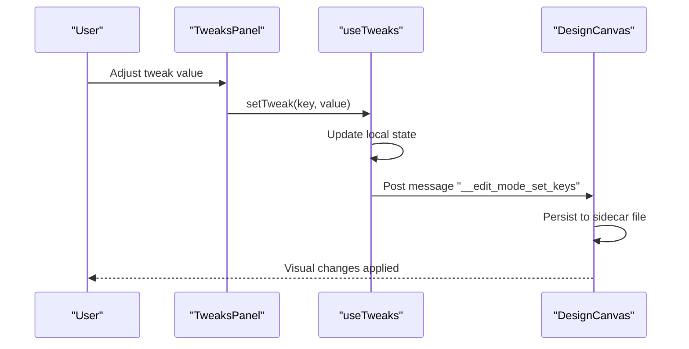
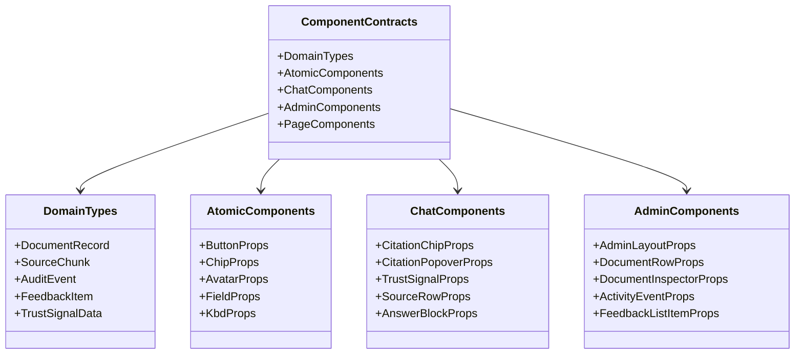
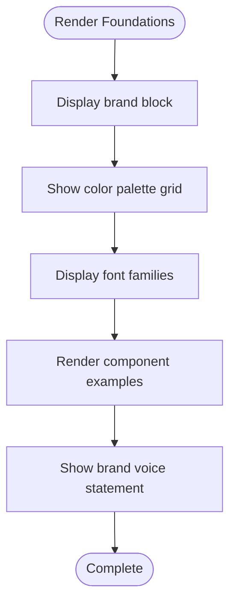
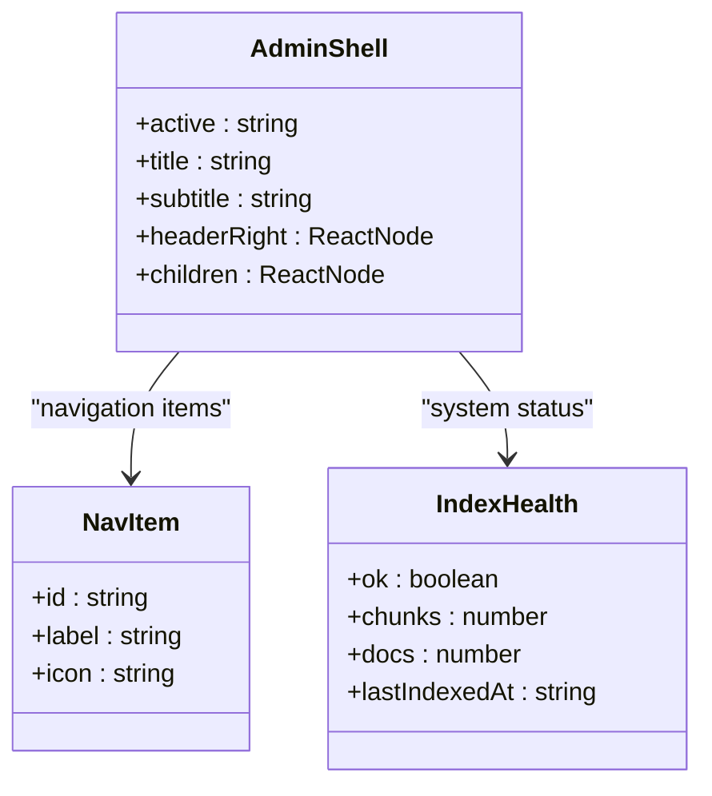
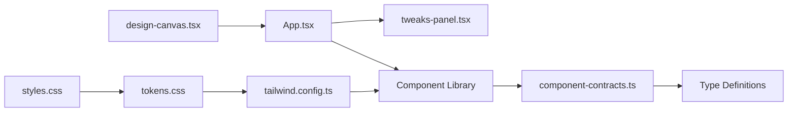

# Design System

<cite>
**Referenced Files in This Document**
- [App.tsx](file://design/App.tsx)
- [design-canvas.tsx](file://design/design-canvas.tsx)
- [styles.css](file://design/styles.css)
- [tokens.css](file://handoff/tokens.css)
- [tailwind.config.ts](file://handoff/tailwind.config.ts)
- [Foundations.tsx](file://design/components/Foundations.tsx)
- [Login.tsx](file://design/components/Login.tsx)
- [ChatA.tsx](file://design/components/ChatA.tsx)
- [ChatB.tsx](file://design/components/ChatB.tsx)
- [ChatStates.tsx](file://design/components/ChatStates.tsx)
- [ChatShared.tsx](file://design/components/ChatShared.tsx)
- [AdminDocs.tsx](file://design/components/AdminDocs.tsx)
- [AdminAudit.tsx](file://design/components/AdminAudit.tsx)
- [AdminStats.tsx](file://design/components/AdminStats.tsx)
- [AdminFeedback.tsx](file://design/components/AdminFeedback.tsx)
- [AdminShell.tsx](file://design/components/AdminShell.tsx)
- [tweaks-panel.tsx](file://design/tweaks-panel.tsx)
- [component-contracts.ts](file://handoff/component-contracts.ts)
- [types.ts](file://design/types.ts)
</cite>

## Update Summary
**Changes Made**
- Complete redesign with new design canvas architecture using DesignCanvas component
- Added comprehensive component contracts for type safety
- Enhanced styling architecture with centralized tokens and Tailwind integration
- Introduced interactive tweaks panel for runtime theme customization
- Expanded component library with AdminShell and improved ChatShared utilities
- Added detailed TypeScript prop contracts for all components

## Table of Contents
1. [Introduction](#introduction)
2. [Project Structure](#project-structure)
3. [Core Components](#core-components)
4. [Architecture Overview](#architecture-overview)
5. [Detailed Component Analysis](#detailed-component-analysis)
6. [Component Contracts](#component-contracts)
7. [Dependency Analysis](#dependency-analysis)
8. [Performance Considerations](#performance-considerations)
9. [Troubleshooting Guide](#troubleshooting-guide)
10. [Conclusion](#conclusion)
11. [Appendices](#appendices)

## Introduction
This document describes the Private AI design system with a focus on the component library, design tokens, and styling architecture. The system has undergone a complete redesign featuring a sophisticated design canvas, comprehensive component contracts, and integrated runtime customization capabilities. It explains the design philosophy behind reusable UI patterns, centralized token management, and how the component library is structured across Foundations, Chat, and Admin domains. The system leverages CSS custom properties, Tailwind CSS integration, and TypeScript contracts to ensure type-safe, maintainable, and accessible component development.

## Project Structure
The design system is built around a sophisticated design canvas that serves as both a showcase platform and an interactive prototyping environment. The architecture includes a comprehensive handoff package for seamless integration into production applications.

Key areas:
- design/: Advanced design canvas and component showcase
  - design-canvas.tsx: Sophisticated Figma-like design canvas with pan/zoom, drag-and-drop, and persistence
  - App.tsx: Canvas host with runtime theme customization and section organization
  - components/: Comprehensive component library with Foundations, Auth, Chat, and Admin
  - styles.css: Centralized design tokens and primitive CSS utilities
  - tweaks-panel.tsx: Interactive runtime customization panel
- handoff/: Production-ready integration package
  - tokens.css: Centralized design tokens for external consumption
  - tailwind.config.ts: Tailwind theme extension for utility-first styling
  - component-contracts.ts: TypeScript prop contracts for all components
- Frontend integration: React components aligned with design system principles

**Diagram sources**
- [design-canvas.tsx:1-1015](file://design/design-canvas.tsx#L1-L1015)
- [App.tsx:1-107](file://design/App.tsx#L1-L107)
- [tweaks-panel.tsx:1-619](file://design/tweaks-panel.tsx#L1-L619)
- [Foundations.tsx:1-136](file://design/components/Foundations.tsx#L1-L136)
- [Login.tsx:1-139](file://design/components/Login.tsx#L1-L139)
- [ChatA.tsx:1-165](file://design/components/ChatA.tsx#L1-L165)
- [ChatB.tsx:1-285](file://design/components/ChatB.tsx#L1-L285)
- [ChatStates.tsx:1-385](file://design/components/ChatStates.tsx#L1-L385)
- [ChatShared.tsx:1-110](file://design/components/ChatShared.tsx#L1-L110)
- [AdminDocs.tsx:1-238](file://design/components/AdminDocs.tsx#L1-L238)
- [AdminAudit.tsx:1-278](file://design/components/AdminAudit.tsx#L1-L278)
- [AdminStats.tsx:1-258](file://design/components/AdminStats.tsx#L1-L258)
- [AdminFeedback.tsx:1-215](file://design/components/AdminFeedback.tsx#L1-L215)
- [AdminShell.tsx:1-119](file://design/components/AdminShell.tsx#L1-L119)
- [styles.css:1-320](file://design/styles.css#L1-L320)
- [tokens.css:1-90](file://handoff/tokens.css#L1-L90)
- [tailwind.config.ts:1-50](file://handoff/tailwind.config.ts#L1-L50)
- [component-contracts.ts:1-264](file://handoff/component-contracts.ts#L1-L264)

**Section sources**
- [design-canvas.tsx:1-1015](file://design/design-canvas.tsx#L1-L1015)
- [App.tsx:1-107](file://design/App.tsx#L1-L107)
- [styles.css:1-320](file://design/styles.css#L1-L320)
- [tokens.css:1-90](file://handoff/tokens.css#L1-L90)
- [tailwind.config.ts:1-50](file://handoff/tailwind.config.ts#L1-L50)
- [component-contracts.ts:1-264](file://handoff/component-contracts.ts#L1-L264)

## Core Components
The redesigned Private AI design system centers on several key architectural innovations:

### Design Canvas Architecture
The system introduces a sophisticated design canvas that serves as both a showcase platform and an interactive prototyping environment:
- **DesignCanvas**: Figma-like canvas with pan/zoom, drag-and-drop reordering, persistent state management, and export capabilities
- **DCSection**: Editable section containers with persisted ordering and labeling
- **DCArtboard**: Individual artboard components with inline editing and focus modes
- **DCFocusOverlay**: Fullscreen overlay for focused artboard inspection

### Runtime Customization System
The tweaks panel enables real-time theme customization:
- **useTweaks**: Hook for managing tweak state with persistence
- **TweaksPanel**: Floating customization interface with draggable positioning
- **Interactive Controls**: Color pickers, density selectors, and typography controls
- **Live Theme Application**: Real-time CSS custom property updates

### Component Contracts
Comprehensive TypeScript interfaces define component APIs:
- **Domain Types**: Document records, audit events, feedback items, and trust signals
- **Atomic Components**: Button, chip, avatar, field, and keyboard components
- **Chat Components**: Citation chips, trust signals, source rows, and message bubbles
- **Admin Components**: Document management, audit streams, and statistics
- **Page Components**: Chat pages, documents, audit, overview, and feedback pages

### Enhanced Component Library
The component library now includes:
- **Foundations**: Brand identity and token system presentation
- **Authentication**: Login layout with dark security panel and light form panel
- **Chat**: Two chat views (A and B), empty state, streaming pipeline, and citation hover preview
- **Admin**: Enhanced admin shell with navigation, document management, audit stream, stats overview, and feedback review
- **Shared Utilities**: Common chat components and data structures

**Section sources**
- [design-canvas.tsx:1-1015](file://design/design-canvas.tsx#L1-L1015)
- [tweaks-panel.tsx:1-619](file://design/tweaks-panel.tsx#L1-L619)
- [component-contracts.ts:1-264](file://handoff/component-contracts.ts#L1-L264)
- [Foundations.tsx:1-136](file://design/components/Foundations.tsx#L1-L136)
- [AdminShell.tsx:1-119](file://design/components/AdminShell.tsx#L1-L119)
- [ChatShared.tsx:1-110](file://design/components/ChatShared.tsx#L1-L110)

## Architecture Overview
The redesigned architecture creates a sophisticated ecosystem for design exploration and production integration:

### Canvas-Based Development
The design canvas provides a unified environment for component development and testing:
- **State Persistence**: Automatic saving of layout, ordering, and customization state
- **Interactive Editing**: Inline editing for labels and titles with undo/redo capability
- **Export System**: PNG and HTML export capabilities for sharing designs
- **Cross-Platform Compatibility**: Works across different devices and screen sizes

### Token-Driven Design System
Centralized token management ensures consistency across all components:
- **CSS Custom Properties**: Root-level variables for colors, typography, spacing, and effects
- **Tailwind Integration**: Theme extension for utility-first styling
- **TypeScript Contracts**: Strong typing for component interfaces
- **Runtime Customization**: Live theme switching without rebuilds

### Component Contract System
The comprehensive contract system ensures type safety and API consistency:
- **Pure Type Specifications**: No React imports in contracts for universal compatibility
- **Domain-Specific Interfaces**: Typed data structures for documents, audits, and feedback
- **Component Prop Contracts**: Strict typing for all component interfaces
- **Integration Ready**: Contracts designed for React, Vue, and other frameworks

**Diagram sources**
- [design-canvas.tsx:1-1015](file://design/design-canvas.tsx#L1-L1015)
- [App.tsx:1-107](file://design/App.tsx#L1-L107)
- [tweaks-panel.tsx:1-619](file://design/tweaks-panel.tsx#L1-L619)
- [Foundations.tsx:1-136](file://design/components/Foundations.tsx#L1-L136)
- [Login.tsx:1-139](file://design/components/Login.tsx#L1-L139)
- [ChatA.tsx:1-165](file://design/components/ChatA.tsx#L1-L165)
- [ChatB.tsx:1-285](file://design/components/ChatB.tsx#L1-L285)
- [ChatStates.tsx:1-385](file://design/components/ChatStates.tsx#L1-L385)
- [AdminDocs.tsx:1-238](file://design/components/AdminDocs.tsx#L1-L238)
- [AdminAudit.tsx:1-278](file://design/components/AdminAudit.tsx#L1-L278)
- [AdminStats.tsx:1-258](file://design/components/AdminStats.tsx#L1-L258)
- [AdminFeedback.tsx:1-215](file://design/components/AdminFeedback.tsx#L1-L215)
- [AdminShell.tsx:1-119](file://design/components/AdminShell.tsx#L1-L119)
- [ChatShared.tsx:1-110](file://design/components/ChatShared.tsx#L1-L110)
- [tokens.css:1-90](file://handoff/tokens.css#L1-L90)
- [tailwind.config.ts:1-50](file://handoff/tailwind.config.ts#L1-L50)
- [component-contracts.ts:1-264](file://handoff/component-contracts.ts#L1-L264)

## Detailed Component Analysis

### Design Canvas System
The design canvas provides a sophisticated environment for component development and testing:

#### DesignCanvas Component
The main canvas wrapper manages state persistence and viewport controls:
- **State Management**: Persists section ordering, labels, and hidden artboards
- **Viewport Control**: Pan/zoom with mouse wheel, trackpad gestures, and keyboard shortcuts
- **Persistence**: Automatic saving to `.design-canvas.state.json` sidecar file
- **Focus Mode**: Fullscreen overlay for focused artboard inspection

#### DCSection Component
Organizes artboards into editable sections:
- **Editable Titles**: Inline editing with persistence
- **Drag-and-Drop**: Reorder artboards with visual feedback
- **Hidden Artboards**: Ability to temporarily hide artboards
- **Section Metadata**: Maintains order and labels per section

#### DCArtboard Component
Individual artboard containers with advanced features:
- **Inline Editing**: Editable labels with validation
- **Drag Handles**: Visual grip for reordering
- **Delete Functionality**: Safe deletion with confirmation
- **Focus Control**: Toggle focus mode for detailed inspection

#### Export System
Comprehensive export capabilities for sharing designs:
- **PNG Export**: High-resolution PNG with embedded assets
- **HTML Export**: Standalone HTML with inlined styles
- **Font Handling**: Automatic font embedding and conversion
- **Asset Optimization**: Data URI encoding for images and backgrounds

**Diagram sources**
- [design-canvas.tsx:198-302](file://design/design-canvas.tsx#L198-L302)
- [design-canvas.tsx:543-597](file://design/design-canvas.tsx#L543-L597)
- [design-canvas.tsx:721-845](file://design/design-canvas.tsx#L721-L845)

**Section sources**
- [design-canvas.tsx:1-1015](file://design/design-canvas.tsx#L1-L1015)

### Runtime Customization System
The tweaks panel enables real-time theme customization and experimentation:

#### useTweaks Hook
Manages tweak state with persistence:
- **State Persistence**: Automatically saves changes to host via window messaging
- **Type Safety**: Strict typing for tweak values
- **Event System**: Custom events for inter-component communication
- **Default Values**: Configurable defaults with fallback handling

#### TweaksPanel Component
Floating customization interface:
- **Draggable Positioning**: Moveable panel with viewport clamping
- **Section Organization**: Logical grouping of customization options
- **Control Variants**: Slider, radio, color, and toggle controls
- **Host Integration**: Bidirectional communication with design host

#### Control Components
Comprehensive set of customization controls:
- **TweakSlider**: Range sliders with step increments
- **TweakRadio**: Segment radio buttons with visual feedback
- **TweakColor**: Curated color pickers with palette support
- **TweakToggle**: Switch controls for boolean values
- **TweakNumber**: Numeric input with scrubbing support

**Diagram sources**
- [tweaks-panel.tsx:163-178](file://design/tweaks-panel.tsx#L163-L178)
- [tweaks-panel.tsx:256-270](file://design/tweaks-panel.tsx#L256-L270)

**Section sources**
- [tweaks-panel.tsx:1-619](file://design/tweaks-panel.tsx#L1-L619)

### Component Contracts System
The comprehensive contract system ensures type safety across the entire component library:

#### Domain Types
Typed data structures for core business entities:
- **DocumentRecord**: Complete document metadata with status tracking
- **SourceChunk**: Retrieved document fragments with scoring
- **AuditEvent**: Activity logs with detailed context
- **FeedbackItem**: User feedback with trace information
- **TrustSignalData**: Performance metrics for model responses

#### Atomic Component Contracts
Interface definitions for fundamental UI elements:
- **ButtonProps**: Button variants, sizes, and states
- **ChipProps**: Status indicators with tone variants
- **AvatarProps**: User identification with customizable colors
- **FieldProps**: Form inputs with validation states
- **KbdProps**: Keyboard shortcut display components

#### Chat Component Contracts
Specialized interfaces for conversational UI:
- **CitationChipProps**: Inline citation references
- **CitationPopoverProps**: Hover preview functionality
- **TrustSignalProps**: Performance and provenance indicators
- **SourceRowProps**: Document source listings
- **AnswerBlockProps**: Response content with citations

#### Admin Component Contracts
Interfaces for administrative functionality:
- **AdminLayoutProps**: Navigation and layout structure
- **DocumentRowProps**: Document listing with actions
- **DocumentInspectorProps**: Detailed document information
- **ActivityEventProps**: Audit trail entries
- **FeedbackListItemProps**: Feedback review interfaces

**Diagram sources**
- [component-contracts.ts:8-264](file://handoff/component-contracts.ts#L8-L264)

**Section sources**
- [component-contracts.ts:1-264](file://handoff/component-contracts.ts#L1-L264)

### Foundations Component
The Foundations component presents the brand identity and token system:

#### Brand Presentation
- **Logo Lockup**: Custom logo with gradient and accent elements
- **Brand Statement**: Clear articulation of design philosophy
- **Capabilities**: Three key product promises with supporting details
- **Responsive Layout**: Grid-based composition with flexible columns

#### Token Visualization
- **Color Palette**: Complete color system with contrast examples
- **Typography Scale**: Font family showcase with usage contexts
- **Primitive Components**: Live examples of buttons, chips, citations, and trust signals
- **Voice & Tone**: Brand personality statement with contextual examples

**Diagram sources**
- [Foundations.tsx:3-136](file://design/components/Foundations.tsx#L3-L136)

**Section sources**
- [Foundations.tsx:1-136](file://design/components/Foundations.tsx#L1-L136)

### Admin Shell Component
Enhanced admin layout with comprehensive navigation:

#### Navigation System
- **Sidebar Rail**: Fixed navigation with active state indication
- **Icon Integration**: Consistent iconography for all navigation items
- **Active State**: Visual feedback for current page
- **Health Indicator**: System status display with color coding

#### Header Structure
- **Breadcrumb Navigation**: Contextual page identification
- **Page Title**: Hierarchical page titles with subtitles
- **Header Actions**: Flexible action area for page-specific controls
- **User Profile**: Avatar-based user identification

#### Layout Flexibility
- **Grid System**: Two-column layout with fixed navigation
- **Scroll Regions**: Properly scoped scroll areas
- **Responsive Behavior**: Adapts to different screen sizes
- **Content Areas**: Main content region with overflow handling

**Diagram sources**
- [AdminShell.tsx:4-119](file://design/components/AdminShell.tsx#L4-L119)

**Section sources**
- [AdminShell.tsx:1-119](file://design/components/AdminShell.tsx#L1-L119)

## Component Contracts
The Private AI design system includes comprehensive TypeScript contracts that define component interfaces and data structures:

### Domain-Level Contracts
Core business entity definitions:
- **DocumentRecord**: Complete document metadata including status, progress, and timestamps
- **SourceChunk**: Retrieved document fragments with scoring and usage tracking
- **AuditEvent**: Activity logs with detailed context and performance metrics
- **FeedbackItem**: User feedback with trace information and model details
- **TrustSignalData**: Performance metrics for model responses

### Component-Level Contracts
Interface definitions for all components:
- **ButtonProps**: Button variants, sizes, states, and interaction handlers
- **ChipProps**: Status indicators with tone variants and interactive states
- **AvatarProps**: User identification with customizable colors and sizes
- **FieldProps**: Form inputs with validation states and auxiliary elements
- **KbdProps**: Keyboard shortcut display components

### Chat Component Contracts
Conversational UI component interfaces:
- **CitationChipProps**: Inline citation references with hover functionality
- **CitationPopoverProps**: Hover preview with document navigation
- **TrustSignalProps**: Performance and provenance indicators
- **SourceRowProps**: Document source listings with compact modes
- **AnswerBlockProps**: Response content with citation placeholders

### Admin Component Contracts
Administrative interface contracts:
- **AdminLayoutProps**: Navigation and layout structure with user context
- **DocumentRowProps**: Document listing with selection and action capabilities
- **DocumentInspectorProps**: Detailed document information with actions
- **ActivityEventProps**: Audit trail entries with trace navigation
- **FeedbackListItemProps**: Feedback review interfaces with selection states

### Page Component Contracts
Higher-level page interfaces:
- **ChatPageProps**: Chat interface with layout preferences
- **DocumentsPageProps**: Document management page with hooks
- **AuditPageProps**: Audit stream page with real-time updates
- **OverviewPageProps**: Dashboard page with statistics
- **FeedbackPageProps**: Feedback review page with navigation

**Section sources**
- [component-contracts.ts:1-264](file://handoff/component-contracts.ts#L1-L264)

## Dependency Analysis
The redesigned architecture maintains low coupling and high cohesion through several key mechanisms:

### Canvas-App Integration
- **DesignCanvas** orchestrates sections and artboards with state persistence
- **App.tsx** manages runtime theme customization and component orchestration
- **TweaksPanel** provides interactive customization with host communication
- **Component Dependencies** resolved through centralized imports

### Token-Driven Architecture
- **CSS Custom Properties** enable efficient theme switching without rebuilds
- **Tailwind Integration** derives theme tokens from centralized CSS
- **Component Contracts** ensure type safety across framework boundaries
- **Export System** maintains consistency between prototype and production

### State Management
- **useTweaks** hook manages customization state with persistence
- **DesignCanvas** state persists to sidecar files for continuity
- **Component Props** validated through TypeScript contracts
- **Runtime Updates** applied through CSS custom property manipulation

**Diagram sources**
- [design-canvas.tsx:1-1015](file://design/design-canvas.tsx#L1-L1015)
- [App.tsx:1-107](file://design/App.tsx#L1-L107)
- [tweaks-panel.tsx:1-619](file://design/tweaks-panel.tsx#L1-L619)
- [component-contracts.ts:1-264](file://handoff/component-contracts.ts#L1-L264)
- [styles.css:1-320](file://design/styles.css#L1-L320)
- [tokens.css:1-90](file://handoff/tokens.css#L1-L90)
- [tailwind.config.ts:1-50](file://handoff/tailwind.config.ts#L1-L50)

**Section sources**
- [design-canvas.tsx:1-1015](file://design/design-canvas.tsx#L1-L1015)
- [App.tsx:1-107](file://design/App.tsx#L1-L107)
- [tweaks-panel.tsx:1-619](file://design/tweaks-panel.tsx#L1-L619)
- [component-contracts.ts:1-264](file://handoff/component-contracts.ts#L1-L264)
- [styles.css:1-320](file://design/styles.css#L1-L320)
- [tokens.css:1-90](file://handoff/tokens.css#L1-L90)
- [tailwind.config.ts:1-50](file://handoff/tailwind.config.ts#L1-L50)

## Performance Considerations
The redesigned system incorporates several performance optimizations:

### Canvas Performance
- **Transform-Based Rendering**: CSS transforms for smooth pan/zoom operations
- **Will-Changer Optimization**: Hardware acceleration for complex animations
- **Container Queries**: Responsive layout adaptation without JavaScript
- **Memory Management**: Efficient state cleanup and event listener management

### Runtime Customization
- **CSS Custom Properties**: Efficient theme switching without DOM rebuilds
- **Debounced Persistence**: 250ms debounced file writing to prevent excessive I/O
- **Lazy Loading**: Fonts and assets loaded asynchronously
- **Export Optimization**: Background processing for PNG exports

### Component Architecture
- **Utility-First CSS**: Tailwind utilities reduce bundle size through reuse
- **SVG Icons**: Lightweight vector graphics with caching
- **Minimal Dependencies**: Core functionality implemented with vanilla JavaScript
- **TypeScript Contracts**: Compile-time type checking without runtime overhead

### State Management
- **Local Storage Caching**: Viewport state persisted for instant recovery
- **Event Delegation**: Efficient event handling with minimal overhead
- **Conditional Rendering**: Optimized component updates based on state changes
- **Memory Leak Prevention**: Proper cleanup of event listeners and timers

## Troubleshooting Guide
Common issues and resolutions for the redesigned system:

### Canvas Issues
- **Pan/Zoom Not Working**: Ensure DesignCanvas is mounted in a proper viewport with `height: 100vh` and `width: 100vw`
- **State Persistence Failure**: Verify sidecar file permissions and network access for `.design-canvas.state.json`
- **Export Errors**: Check font loading completion and asset accessibility for PNG exports
- **Drag-and-Drop Problems**: Ensure proper event handling and pointer capture management

### Customization Issues
- **Theme Not Updating**: Verify CSS custom property updates and ensure `--blue` and `--pa-density-scale` are properly set
- **Tweaks Panel Not Visible**: Check host communication and ensure `__edit_mode_available` message is received
- **State Persistence Lost**: Verify window messaging and host bridge functionality
- **Control Values Not Persisting**: Check `setTweak` function usage and message posting

### Integration Issues
- **Missing Tokens in Tailwind**: Verify `theme.extend` configuration matches `tokens.css` structure
- **Component Type Errors**: Ensure TypeScript compiler can access `component-contracts.ts` definitions
- **CSS Conflicts**: Check for conflicting class names and ensure proper CSS isolation
- **Build Failures**: Verify Tailwind content paths and ensure all source files are included

**Section sources**
- [design-canvas.tsx:209-231](file://design/design-canvas.tsx#L209-L231)
- [App.tsx:24-37](file://design/App.tsx#L24-L37)
- [tweaks-panel.tsx:256-270](file://design/tweaks-panel.tsx#L256-L270)
- [tailwind.config.ts:44-49](file://handoff/tailwind.config.ts#L44-L49)

## Conclusion
The Private AI design system represents a comprehensive redesign that successfully balances creative prototyping with production-ready architecture. The introduction of the sophisticated design canvas, runtime customization system, and comprehensive component contracts establishes a robust foundation for scalable UI development. By centralizing design tokens, leveraging TypeScript contracts, and structuring components around reusable patterns, teams can maintain consistency while accelerating development cycles. The handoff package ensures seamless integration with Tailwind and React frontend implementations, while the canvas system provides powerful tools for design exploration and iteration.

## Appendices

### Design Tokens Reference
Comprehensive token system for consistent design:
- **Colors**: Ink (dark surfaces), Paper (backgrounds), Surface (cards), Line (borders), Text (typography), Slate (neutrals), Accent (Action), Status (Success, Amber, Danger)
- **Typography**: Sans, Mono, Serif families with complete type scale
- **Spacing**: Base 4px scale with comprehensive spacing units
- **Radii**: Consistent border radius scale (sm: 4px, DEFAULT: 6px, lg: 10px, xl: 14px)
- **Shadows**: Depth scale with subtle and prominent elevation levels
- **Utilities**: Buttons, Chips, Inputs, Cards, Citations, Trust signals, Status dots, Avatars, Caret, and more

**Section sources**
- [tokens.css:7-89](file://handoff/tokens.css#L7-L89)
- [styles.css:5-65](file://design/styles.css#L5-L65)

### Styling Approach
Integrated styling architecture:
- **CSS Custom Properties**: Centralized theming for colors, typography, spacing, radii, and shadows
- **Tailwind Integration**: `theme.extend` derived from `tokens.css` for utility-first styling
- **Component-Specific Styling**: Compose primitives and tokens; avoid ad-hoc overrides
- **Runtime Customization**: Live theme switching through CSS custom property updates
- **Export System**: Self-contained exports with inlined assets and styles

**Section sources**
- [App.tsx:24-37](file://design/App.tsx#L24-L37)
- [tailwind.config.ts:7-42](file://handoff/tailwind.config.ts#L7-L42)
- [styles.css:67-320](file://design/styles.css#L67-L320)

### Practical Examples
Implementation guidelines for the redesigned system:

#### Using Design Tokens
- Apply color tokens via CSS custom properties for backgrounds, borders, and text
- Use typography tokens for consistent headings and body text across components
- Leverage spacing tokens for padding, margins, and gaps in layouts
- Utilize radius and shadow tokens for consistent visual hierarchy

#### Creating New Components
- Build on atomic primitives (buttons, chips, fields, cards) from the component library
- Use token contracts for type safety and consistent interfaces
- Implement proper accessibility attributes and keyboard navigation
- Follow the component contract patterns established in `component-contracts.ts`

#### Customizing Existing Components
- Override CSS custom properties for accent colors and density scaling
- Extend Tailwind utilities with `theme.extend` for new variants
- Use the tweaks panel for rapid experimentation and iteration
- Maintain backward compatibility through optional props and default values

#### Integrating with Production Systems
- Import `component-contracts.ts` for type safety in React applications
- Configure Tailwind with the provided `tailwind.config.ts` extension
- Use the design canvas for component development and testing
- Leverage the export system for sharing designs with stakeholders

**Section sources**
- [App.tsx:87-96](file://design/App.tsx#L87-L96)
- [component-contracts.ts:97-128](file://handoff/component-contracts.ts#L97-L128)
- [tailwind.config.ts:44-49](file://handoff/tailwind.config.ts#L44-L49)

### Responsive Design Principles
Adaptive design system principles:
- **Canvas-Based Testing**: Use design canvas artboards to validate responsive behavior
- **Container Queries**: Modern responsive techniques for component adaptation
- **Flexible Grids**: CSS Grid and Flexbox for adaptive layouts
- **Typography Scaling**: Responsive type scales that maintain readability
- **Touch Targets**: Minimum 44px touch targets for mobile accessibility

**Section sources**
- [design-canvas.tsx:133-137](file://design/design-canvas.tsx#L133-L137)
- [styles.css:67-320](file://design/styles.css#L67-L320)

### Dark/Light Theme Support
Dynamic theme system:
- **CSS Custom Properties**: Centralized theme variables for color schemes
- **Runtime Switching**: Real-time theme changes without page reloads
- **Contrast Management**: Automatic contrast adjustments for accessibility
- **System Preferences**: Respect user's OS-level theme preferences
- **Export Consistency**: Maintain theme integrity in exported designs

**Section sources**
- [App.tsx:24-37](file://design/App.tsx#L24-L37)
- [styles.css:83-86](file://design/styles.css#L83-L86)

### Cross-Browser Compatibility
Robust compatibility approach:
- **Modern CSS Features**: Use widely supported CSS features (custom properties, grid, flexbox)
- **Progressive Enhancement**: Graceful degradation for older browsers
- **SVG Graphics**: Vector graphics that scale perfectly across devices
- **Accessibility Standards**: WCAG 2.1 AA compliance across all components
- **Testing Strategy**: Canvas-based validation across different viewport sizes and orientations

**Section sources**
- [design-canvas.tsx:307-427](file://design/design-canvas.tsx#L307-L427)
- [styles.css:1-320](file://design/styles.css#L1-L320)