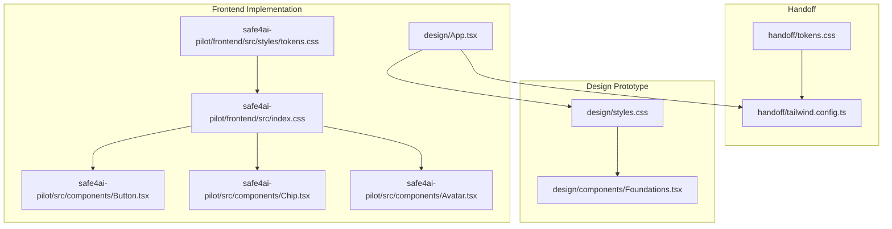
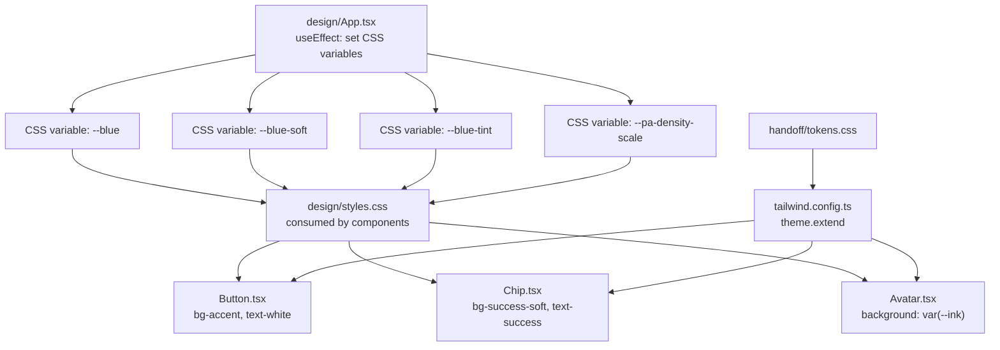
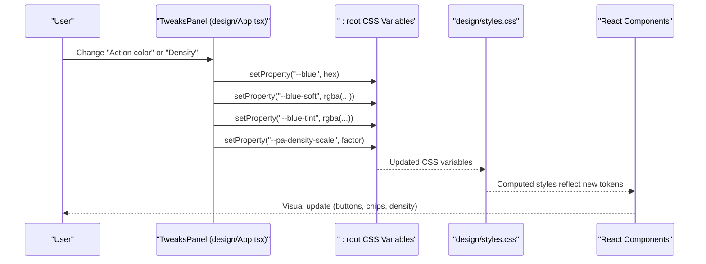
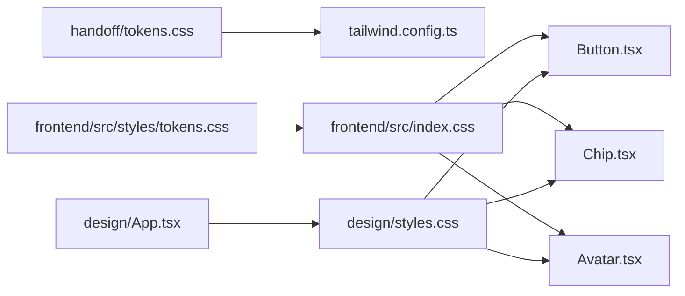

# Design Tokens

<cite>
**Referenced Files in This Document**
- [design/styles.css](file://design/styles.css)
- [handoff/tokens.css](file://handoff/tokens.css)
- [safe4ai-pilot/frontend/src/styles/tokens.css](file://safe4ai-pilot/frontend/src/styles/tokens.css)
- [handoff/tailwind.config.ts](file://handoff/tailwind.config.ts)
- [design/App.tsx](file://design/App.tsx)
- [design/components/Foundations.tsx](file://design/components/Foundations.tsx)
- [safe4ai-pilot/frontend/src/index.css](file://safe4ai-pilot/frontend/src/index.css)
- [safe4ai-pilot/frontend/src/components/Button.tsx](file://safe4ai-pilot/frontend/src/components/Button.tsx)
- [safe4ai-pilot/frontend/src/components/Chip.tsx](file://safe4ai-pilot/frontend/src/components/Chip.tsx)
- [safe4ai-pilot/frontend/src/components/Avatar.tsx](file://safe4ai-pilot/frontend/src/components/Avatar.tsx)
- [safe4ai-pilot/frontend/src/main.tsx](file://safe4ai-pilot/frontend/src/main.tsx)
</cite>

## Table of Contents
1. [Introduction](#introduction)
2. [Project Structure](#project-structure)
3. [Core Components](#core-components)
4. [Architecture Overview](#architecture-overview)
5. [Detailed Component Analysis](#detailed-component-analysis)
6. [Dependency Analysis](#dependency-analysis)
7. [Performance Considerations](#performance-considerations)
8. [Troubleshooting Guide](#troubleshooting-guide)
9. [Conclusion](#conclusion)
10. [Appendices](#appendices)

## Introduction
This document describes the design token system for the Private AI project. It covers color palettes, typography scales, spacing units, radii, shadows, and breakpoint-related density scaling. It explains the CSS custom property structure, naming conventions, and value hierarchies, and how tokens cascade through components. It also documents the color system with semantic tokens, accessibility considerations, and dark/light theme support, along with typography and spacing tokens. Practical usage examples, customization guidelines, and token evolution strategies are included, alongside documentation standards and maintenance procedures.

## Project Structure
The design token system is defined in multiple places across the repository:
- Shared tokens in the design prototype
- Tokens mirrored in the frontend implementation
- Tailwind configuration extending tokens for utility-first styling
- Runtime customization via a tweaks panel that updates CSS variables
- Component implementations consuming tokens via CSS variables and Tailwind utilities

**Diagram sources**
- [design/styles.css:1-320](file://design/styles.css#L1-L320)
- [design/components/Foundations.tsx:1-136](file://design/components/Foundations.tsx#L1-L136)
- [handoff/tokens.css:1-90](file://handoff/tokens.css#L1-L90)
- [handoff/tailwind.config.ts:1-50](file://handoff/tailwind.config.ts#L1-L50)
- [safe4ai-pilot/frontend/src/styles/tokens.css:1-69](file://safe4ai-pilot/frontend/src/styles/tokens.css#L1-L69)
- [safe4ai-pilot/frontend/src/index.css:1-16](file://safe4ai-pilot/frontend/src/index.css#L1-L16)
- [safe4ai-pilot/frontend/src/components/Button.tsx:1-56](file://safe4ai-pilot/frontend/src/components/Button.tsx#L1-L56)
- [safe4ai-pilot/frontend/src/components/Chip.tsx:1-32](file://safe4ai-pilot/frontend/src/components/Chip.tsx#L1-L32)
- [safe4ai-pilot/frontend/src/components/Avatar.tsx:1-15](file://safe4ai-pilot/frontend/src/components/Avatar.tsx#L1-L15)
- [design/App.tsx:15-37](file://design/App.tsx#L15-L37)

**Section sources**
- [design/styles.css:1-320](file://design/styles.css#L1-L320)
- [handoff/tokens.css:1-90](file://handoff/tokens.css#L1-L90)
- [safe4ai-pilot/frontend/src/styles/tokens.css:1-69](file://safe4ai-pilot/frontend/src/styles/tokens.css#L1-L69)
- [handoff/tailwind.config.ts:1-50](file://handoff/tailwind.config.ts#L1-L50)
- [design/App.tsx:15-37](file://design/App.tsx#L15-L37)
- [safe4ai-pilot/frontend/src/index.css:1-16](file://safe4ai-pilot/frontend/src/index.css#L1-L16)

## Core Components
This section defines the token categories and their structure.

- Color palette
  - Dark surfaces and text: --ink, --ink-2, --ink-3, --ink-4
  - Light backgrounds and surfaces: --paper, --paper-2, --paper-3, --surface, --surface-2
  - Borders/dividers: --line, --line-2, --line-3
  - Text: --text, --text-2, --text-3, --text-mute
  - Cool neutral: --slate, --slate-2, --slate-3
  - Action/accent: --blue, --blue-2, --blue-soft, --blue-tint
  - Status tokens: --green, --green-soft, --amber, --amber-soft, --red, --red-soft

- Typography
  - Font families: --font-sans, --font-mono, --font-serif
  - Type scale (px): --t-xs, --t-sm, --t-base, --t-md, --t-body, --t-lg, --t-h2, --t-h1, --t-display

- Spacing scale (base 4px): --sp-1..--sp-12
- Border radius scale: --r-sm, --r, --r-lg, --r-xl
- Shadow scale: --sh-1, --sh-2, --sh-3, --sh-pop

- Density scale (runtime): --pa-density-scale (set via tweaks panel)

These tokens are consumed by:
- CSS custom properties in design/styles.css and frontend tokens.css
- Tailwind theme extension in handoff/tailwind.config.ts
- Component classes and inline styles in React components

**Section sources**
- [design/styles.css:5-65](file://design/styles.css#L5-L65)
- [handoff/tokens.css:7-89](file://handoff/tokens.css#L7-L89)
- [safe4ai-pilot/frontend/src/styles/tokens.css:2-68](file://safe4ai-pilot/frontend/src/styles/tokens.css#L2-L68)
- [handoff/tailwind.config.ts:7-42](file://handoff/tailwind.config.ts#L7-L42)

## Architecture Overview
The token architecture centers on CSS custom properties as the single source of truth, with Tailwind utilities bridging tokens into component classes. Runtime customization updates CSS variables dynamically, enabling live theme and density adjustments.

**Diagram sources**
- [design/App.tsx:24-37](file://design/App.tsx#L24-L37)
- [design/styles.css:145-180](file://design/styles.css#L145-L180)
- [safe4ai-pilot/frontend/src/components/Button.tsx:7-19](file://safe4ai-pilot/frontend/src/components/Button.tsx#L7-L19)
- [safe4ai-pilot/frontend/src/components/Chip.tsx:6-12](file://safe4ai-pilot/frontend/src/components/Chip.tsx#L6-L12)
- [safe4ai-pilot/frontend/src/components/Avatar.tsx:5-6](file://safe4ai-pilot/frontend/src/components/Avatar.tsx#L5-L6)
- [handoff/tokens.css:7-89](file://handoff/tokens.css#L7-L89)
- [handoff/tailwind.config.ts:7-42](file://handoff/tailwind.config.ts#L7-L42)

## Detailed Component Analysis

### Color System and Semantic Tokens
- Semantic tokens
  - Surface/background: --paper, --paper-2, --paper-3, --surface, --surface-2
  - Text: --text, --text-2, --text-3, --text-mute
  - Borders: --line, --line-2, --line-3
  - Accent/action: --blue, --blue-2, --blue-soft, --blue-tint
  - Status: --green, --green-soft, --amber, --amber-soft, --red, --red-soft
- Accessibility and contrast
  - Prefer sufficient contrast between foreground and background tokens (e.g., dark text on light surfaces and vice versa)
  - Use muted tokens (--text-mute, --line-2) for less important UI elements
- Dark/light theme support
  - Base theme sets default light colors on :root
  - A dark variant class adjusts background and text colors for dark mode

Practical usage examples:
- Buttons use semantic tokens for states and borders
- Chips use status tokens for default and solid variants
- Avatars derive background from --ink

**Section sources**
- [design/styles.css:5-65](file://design/styles.css#L5-L65)
- [design/styles.css:145-180](file://design/styles.css#L145-L180)
- [safe4ai-pilot/frontend/src/components/Chip.tsx:6-12](file://safe4ai-pilot/frontend/src/components/Chip.tsx#L6-L12)
- [safe4ai-pilot/frontend/src/components/Avatar.tsx:5-6](file://safe4ai-pilot/frontend/src/components/Avatar.tsx#L5-L6)

### Typography Tokens
- Font families
  - Sans: --font-sans
  - Mono: --font-mono
  - Serif: --font-serif
- Type scale
  - Tokens include --t-xs, --t-sm, --t-base, --t-md, --t-body, --t-lg, --t-h2, --t-h1, --t-display
- Letter spacing and line heights
  - Letter spacing tokens and line-height defaults are defined in base styles
- Component usage
  - Components reference tokens for font families and sizes
  - Foundations showcase typography usage across families and scales

**Section sources**
- [handoff/tokens.css:51-66](file://handoff/tokens.css#L51-L66)
- [design/styles.css:49-52](file://design/styles.css#L49-L52)
- [design/components/Foundations.tsx:11-12](file://design/components/Foundations.tsx#L11-L12)
- [design/components/Foundations.tsx:80-98](file://design/components/Foundations.tsx#L80-L98)

### Spacing Units
- Base 4px scale: --sp-1..--sp-12
- Used for paddings, gaps, margins, and layout consistency across components
- Tailwind utilities consume these tokens via theme.extend

**Section sources**
- [handoff/tokens.css:79-89](file://handoff/tokens.css#L79-L89)
- [safe4ai-pilot/frontend/src/styles/tokens.css:64-68](file://safe4ai-pilot/frontend/src/styles/tokens.css#L64-L68)
- [handoff/tailwind.config.ts:25-30](file://handoff/tailwind.config.ts#L25-L30)

### Radius and Shadow Tokens
- Border radius: --r-sm, --r, --r-lg, --r-xl
- Shadows: --sh-1, --sh-2, --sh-3, --sh-pop
- Applied in components for cards, inputs, and floating elements

**Section sources**
- [handoff/tokens.css:67-78](file://handoff/tokens.css#L67-L78)
- [safe4ai-pilot/frontend/src/styles/tokens.css:43-51](file://safe4ai-pilot/frontend/src/styles/tokens.css#L43-L51)
- [design/styles.css:223-230](file://design/styles.css#L223-L230)

### Density Scaling
- Runtime density scale: --pa-density-scale
- Controlled by the tweaks panel; updates CSS variables to scale spacing and layout density
- Example effects: compact, regular, comfy density modes

**Section sources**
- [design/App.tsx:34-37](file://design/App.tsx#L34-L37)

### Token Consumption in Components
- CSS custom properties
  - Components reference tokens via var(--token-name) for colors, fonts, spacing, and radii
- Tailwind utilities
  - Tailwind theme.extend maps tokens to utility classes (e.g., bg-surface, text-text-2)
- Inline styles
  - Some components compute sizes and colors from tokens (e.g., Avatar derives initials size from token-derived font-size)

**Diagram sources**
- [design/App.tsx:24-37](file://design/App.tsx#L24-L37)
- [design/styles.css:145-180](file://design/styles.css#L145-L180)

**Section sources**
- [design/styles.css:145-180](file://design/styles.css#L145-L180)
- [safe4ai-pilot/frontend/src/components/Button.tsx:7-19](file://safe4ai-pilot/frontend/src/components/Button.tsx#L7-L19)
- [safe4ai-pilot/frontend/src/components/Chip.tsx:6-12](file://safe4ai-pilot/frontend/src/components/Chip.tsx#L6-L12)
- [safe4ai-pilot/frontend/src/components/Avatar.tsx:5-6](file://safe4ai-pilot/frontend/src/components/Avatar.tsx#L5-L6)

## Dependency Analysis
Token dependencies and integrations:
- Tokens are defined in handoff/tokens.css and mirrored in safe4ai-pilot/frontend/src/styles/tokens.css
- Tailwind consumes tokens via handoff/tailwind.config.ts theme.extend
- Components import tokens.css and use Tailwind utilities and CSS variables
- The design/App.tsx tweaks panel updates CSS variables at runtime

**Diagram sources**
- [handoff/tokens.css:7-89](file://handoff/tokens.css#L7-L89)
- [handoff/tailwind.config.ts:7-42](file://handoff/tailwind.config.ts#L7-L42)
- [safe4ai-pilot/frontend/src/styles/tokens.css:1-69](file://safe4ai-pilot/frontend/src/styles/tokens.css#L1-L69)
- [safe4ai-pilot/frontend/src/index.css:1-16](file://safe4ai-pilot/frontend/src/index.css#L1-L16)
- [safe4ai-pilot/frontend/src/components/Button.tsx:1-56](file://safe4ai-pilot/frontend/src/components/Button.tsx#L1-L56)
- [safe4ai-pilot/frontend/src/components/Chip.tsx:1-32](file://safe4ai-pilot/frontend/src/components/Chip.tsx#L1-L32)
- [safe4ai-pilot/frontend/src/components/Avatar.tsx:1-15](file://safe4ai-pilot/frontend/src/components/Avatar.tsx#L1-L15)
- [design/App.tsx:24-37](file://design/App.tsx#L24-L37)
- [design/styles.css:145-180](file://design/styles.css#L145-L180)

**Section sources**
- [handoff/tokens.css:7-89](file://handoff/tokens.css#L7-L89)
- [handoff/tailwind.config.ts:7-42](file://handoff/tailwind.config.ts#L7-L42)
- [safe4ai-pilot/frontend/src/styles/tokens.css:1-69](file://safe4ai-pilot/frontend/src/styles/tokens.css#L1-L69)
- [safe4ai-pilot/frontend/src/index.css:1-16](file://safe4ai-pilot/frontend/src/index.css#L1-L16)
- [design/App.tsx:24-37](file://design/App.tsx#L24-L37)

## Performance Considerations
- CSS custom properties enable efficient runtime updates without rebuilding stylesheets
- Tailwind utilities minimize CSS bloat by generating only used variants
- Density scaling via a single CSS variable reduces layout recalculation overhead
- Keep token updates coarse-grained (e.g., accent color and density) to avoid cascading repaints

## Troubleshooting Guide
- Tokens not applying
  - Verify tokens.css is imported in index.css
  - Confirm Tailwind theme.extend includes tokens
- Dynamic updates not reflected
  - Ensure design/App.tsx effects update CSS variables for the desired token keys
- Contrast issues
  - Use --text/--paper combinations or --text-2/--surface for improved readability
- Density scaling unexpected
  - Check --pa-density-scale is set and used consistently across components

**Section sources**
- [safe4ai-pilot/frontend/src/index.css:1-16](file://safe4ai-pilot/frontend/src/index.css#L1-L16)
- [handoff/tailwind.config.ts:7-42](file://handoff/tailwind.config.ts#L7-L42)
- [design/App.tsx:24-37](file://design/App.tsx#L24-L37)

## Conclusion
The Private AI design token system provides a cohesive, maintainable foundation for color, typography, spacing, and layout. By centralizing tokens in CSS custom properties and extending Tailwind utilities, components remain consistent and customizable. Runtime density and accent color adjustments further enhance flexibility without sacrificing performance or accessibility.

## Appendices

### Naming Conventions and Hierarchy
- Color tokens: --ink, --paper, --surface, --line, --text, --slate, --blue, --green, --amber, --red
- Semantic modifiers: -2, -soft, -tint for tonal variations
- Typography: --font-* and --t-* scale tokens
- Layout: --sp-* for spacing, --r-* for radii, --sh-* for shadows
- Density: --pa-density-scale for runtime scaling

**Section sources**
- [handoff/tokens.css:7-89](file://handoff/tokens.css#L7-L89)
- [safe4ai-pilot/frontend/src/styles/tokens.css:2-68](file://safe4ai-pilot/frontend/src/styles/tokens.css#L2-L68)

### Practical Usage Examples
- Buttons
  - Variant classes combine semantic tokens (e.g., bg-surface, text-text-2, border-line)
  - Accent variant uses --blue tokens
- Chips
  - Default variant uses surface and line tokens; solid variant uses inverse colors
  - Status tones map to --green, --amber, --red tokens
- Avatar
  - Background derived from --ink; initials computed from name

**Section sources**
- [safe4ai-pilot/frontend/src/components/Button.tsx:7-19](file://safe4ai-pilot/frontend/src/components/Button.tsx#L7-L19)
- [safe4ai-pilot/frontend/src/components/Chip.tsx:6-12](file://safe4ai-pilot/frontend/src/components/Chip.tsx#L6-L12)
- [safe4ai-pilot/frontend/src/components/Avatar.tsx:5-6](file://safe4ai-pilot/frontend/src/components/Avatar.tsx#L5-L6)

### Customization Guidelines
- Centralized token definition
  - Modify tokens.css in both design and frontend directories to keep parity
- Tailwind integration
  - Extend theme.extend in tailwind.config.ts to expose tokens as utilities
- Runtime customization
  - Use design/App.tsx effects to update CSS variables for dynamic themes and density
- Component-level overrides
  - Prefer token usage over hardcoded values; reserve overrides for exceptional cases

**Section sources**
- [handoff/tokens.css:7-89](file://handoff/tokens.css#L7-L89)
- [handoff/tailwind.config.ts:7-42](file://handoff/tailwind.config.ts#L7-L42)
- [design/App.tsx:24-37](file://design/App.tsx#L24-L37)

### Token Evolution Strategies
- Version control tokens.css and tailwind.config.ts together
- Document token intent and usage in comments
- Maintain backward compatibility by adding new tokens rather than renaming existing ones
- Use the tweaks panel to validate runtime changes before committing

**Section sources**
- [handoff/tokens.css:1-5](file://handoff/tokens.css#L1-L5)
- [design/App.tsx:87-96](file://design/App.tsx#L87-L96)