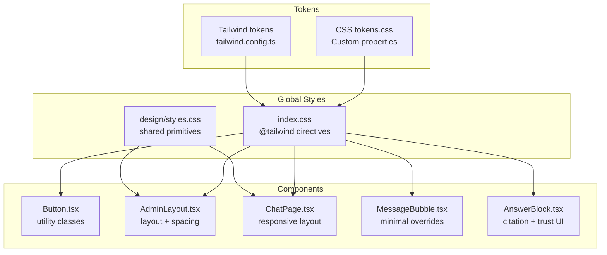
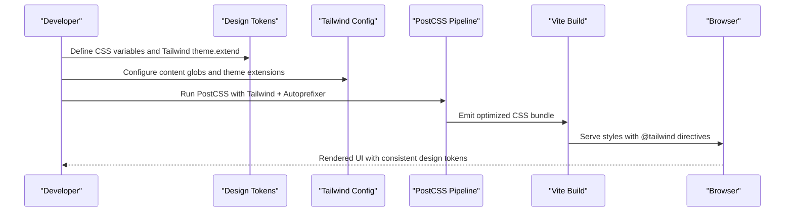
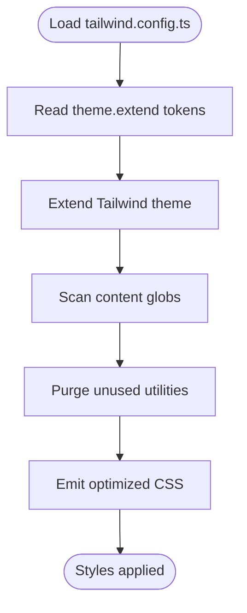
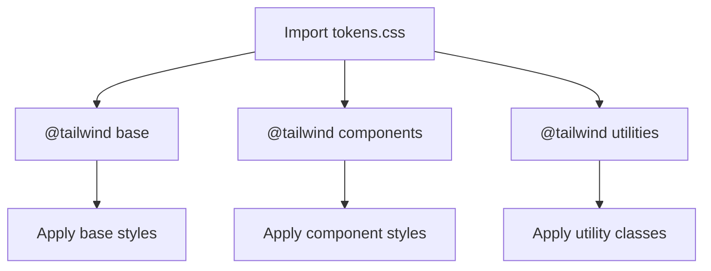
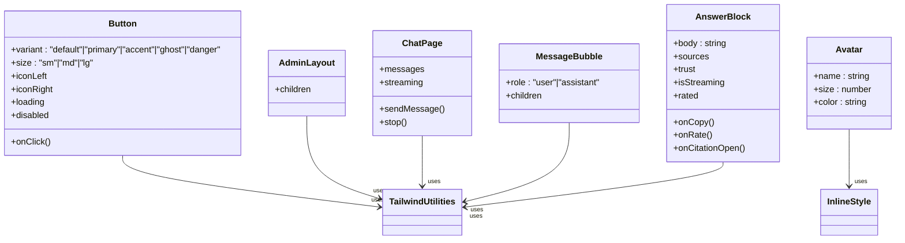
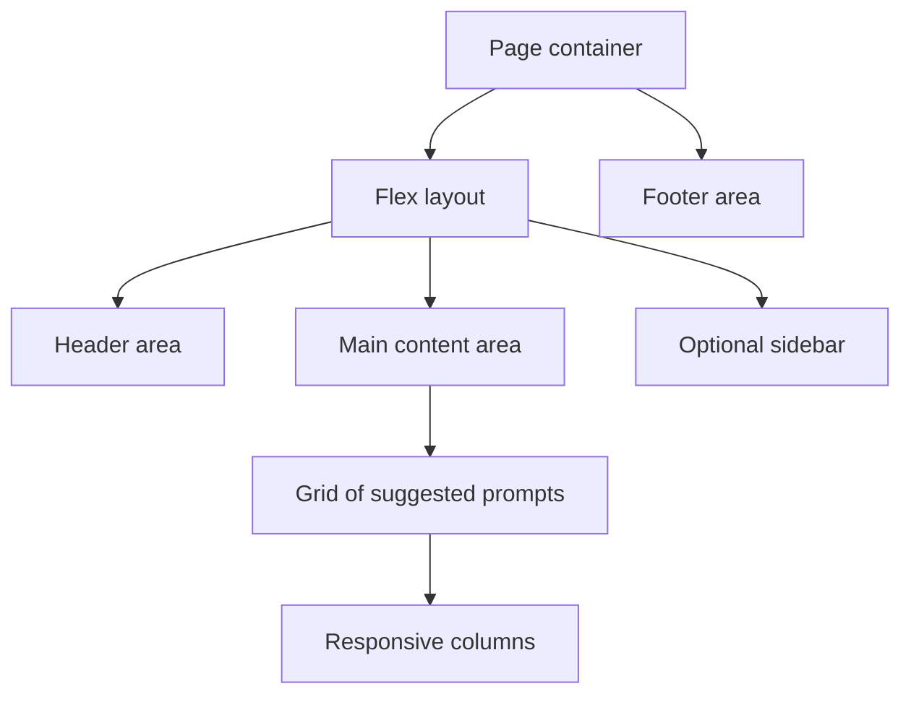
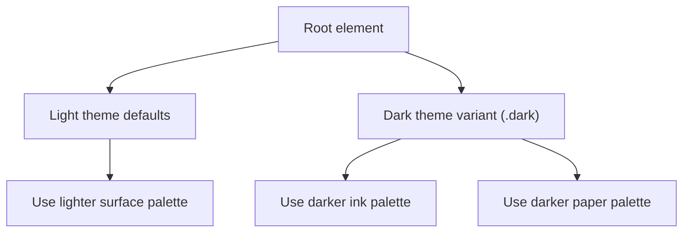
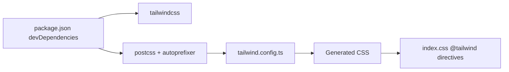

# Styling Architecture

<cite>
**Referenced Files in This Document**
- [tailwind.config.ts](file://safe4ai-pilot/frontend/tailwind.config.ts)
- [tokens.css](file://safe4ai-pilot/frontend/src/styles/tokens.css)
- [index.css](file://safe4ai-pilot/frontend/src/index.css)
- [styles.css](file://design/styles.css)
- [tokens.css](file://handoff/tokens.css)
- [tailwind.config.ts](file://handoff/tailwind.config.ts)
- [postcss.config.js](file://safe4ai-pilot/frontend/postcss.config.js)
- [package.json](file://safe4ai-pilot/frontend/package.json)
- [Button.tsx](file://safe4ai-pilot/frontend/src/components/Button.tsx)
- [Avatar.tsx](file://safe4ai-pilot/frontend/src/components/Avatar.tsx)
- [AdminLayout.tsx](file://safe4ai-pilot/frontend/src/pages/admin/AdminLayout.tsx)
- [ChatPage.tsx](file://safe4ai-pilot/frontend/src/pages/ChatPage.tsx)
- [MessageBubble.tsx](file://safe4ai-pilot/frontend/src/components/chat/MessageBubble.tsx)
- [AnswerBlock.tsx](file://safe4ai-pilot/frontend/src/components/chat/AnswerBlock.tsx)
</cite>

## Table of Contents
1. [Introduction](#introduction)
2. [Project Structure](#project-structure)
3. [Core Components](#core-components)
4. [Architecture Overview](#architecture-overview)
5. [Detailed Component Analysis](#detailed-component-analysis)
6. [Dependency Analysis](#dependency-analysis)
7. [Performance Considerations](#performance-considerations)
8. [Troubleshooting Guide](#troubleshooting-guide)
9. [Conclusion](#conclusion)
10. [Appendices](#appendices)

## Introduction
This document describes the styling architecture of the Private AI project’s frontend. It explains how the team organizes design tokens, integrates Tailwind CSS for a utility-first approach, and composes component-specific styles. It also covers global styles, responsive patterns, theme considerations, and performance strategies derived from the repository’s configuration and implementation.

## Project Structure
The styling system is organized around three pillars:
- Design tokens: centralized CSS custom properties and Tailwind token extensions
- Global styles: base, components, and utilities via Tailwind directives
- Component styles: Tailwind utilities plus minimal component-specific overrides

**Diagram sources**
- [index.css:1-16](file://safe4ai-pilot/frontend/src/index.css#L1-L16)
- [tailwind.config.ts:1-44](file://safe4ai-pilot/frontend/tailwind.config.ts#L1-L44)
- [tokens.css:1-69](file://safe4ai-pilot/frontend/src/styles/tokens.css#L1-L69)
- [styles.css:1-320](file://design/styles.css#L1-L320)
- [Button.tsx:1-56](file://safe4ai-pilot/frontend/src/components/Button.tsx#L1-L56)
- [AdminLayout.tsx:1-106](file://safe4ai-pilot/frontend/src/pages/admin/AdminLayout.tsx#L1-L106)
- [ChatPage.tsx:1-197](file://safe4ai-pilot/frontend/src/pages/ChatPage.tsx#L1-L197)
- [MessageBubble.tsx:1-21](file://safe4ai-pilot/frontend/src/components/chat/MessageBubble.tsx#L1-L21)
- [AnswerBlock.tsx:1-114](file://safe4ai-pilot/frontend/src/components/chat/AnswerBlock.tsx#L1-L114)

**Section sources**
- [index.css:1-16](file://safe4ai-pilot/frontend/src/index.css#L1-L16)
- [tailwind.config.ts:1-44](file://safe4ai-pilot/frontend/tailwind.config.ts#L1-L44)
- [tokens.css:1-69](file://safe4ai-pilot/frontend/src/styles/tokens.css#L1-L69)
- [styles.css:1-320](file://design/styles.css#L1-L320)

## Core Components
- Design tokens: CSS custom properties define color palettes, typography scales, spacing, radii, and shadows. Tailwind is extended with the same tokens to ensure consistency across utilities and component classes.
- Global styles: Tailwind directives inject base, components, and utilities. Global resets and helpers are defined in design/styles.css and imported into index.css.
- Component styles: Components use Tailwind utilities with small, intentional overrides (e.g., rounded corners, font sizes) to maintain consistency while enabling flexibility.

Key implementation patterns:
- Utility-first with Tailwind utilities for layout, spacing, colors, and typography.
- Design tokens exposed as both CSS variables and Tailwind theme keys.
- Minimal component-specific CSS for unique shapes or micro-interactions.

**Section sources**
- [tailwind.config.ts:3-38](file://safe4ai-pilot/frontend/tailwind.config.ts#L3-L38)
- [tokens.css:2-68](file://safe4ai-pilot/frontend/src/styles/tokens.css#L2-L68)
- [index.css:7-15](file://safe4ai-pilot/frontend/src/index.css#L7-L15)
- [styles.css:5-65](file://design/styles.css#L5-L65)

## Architecture Overview
The styling pipeline integrates design tokens, Tailwind configuration, and PostCSS processing to produce optimized CSS.

**Diagram sources**
- [tailwind.config.ts:40-43](file://safe4ai-pilot/frontend/tailwind.config.ts#L40-L43)
- [postcss.config.js:1-2](file://safe4ai-pilot/frontend/postcss.config.js#L1-L2)
- [index.css:3-5](file://safe4ai-pilot/frontend/src/index.css#L3-L5)

## Detailed Component Analysis

### Tailwind Configuration and Token Integration
Tailwind is configured to extend the theme with color palettes, fonts, border radii, shadows, and letter-spacing. The content field defines scanning paths to support purging unused styles.

**Diagram sources**
- [tailwind.config.ts:3-43](file://safe4ai-pilot/frontend/tailwind.config.ts#L3-L43)

**Section sources**
- [tailwind.config.ts:3-43](file://safe4ai-pilot/frontend/tailwind.config.ts#L3-L43)

### Global Styles and Base Layer
Global styles import design tokens and apply Tailwind directives. The base layer sets font families, background, text color, line heights, and letter-spacing. Additional helpers and resets are defined in design/styles.css.

**Diagram sources**
- [index.css:1-16](file://safe4ai-pilot/frontend/src/index.css#L1-L16)
- [styles.css:67-82](file://design/styles.css#L67-L82)

**Section sources**
- [index.css:1-16](file://safe4ai-pilot/frontend/src/index.css#L1-L16)
- [styles.css:67-82](file://design/styles.css#L67-L82)

### Component-Specific Styling Patterns
Components combine Tailwind utilities with minimal overrides to achieve consistent yet flexible UI.

**Diagram sources**
- [Button.tsx:7-19](file://safe4ai-pilot/frontend/src/components/Button.tsx#L7-L19)
- [Avatar.tsx:1-15](file://safe4ai-pilot/frontend/src/components/Avatar.tsx#L1-L15)
- [AdminLayout.tsx:38-97](file://safe4ai-pilot/frontend/src/pages/admin/AdminLayout.tsx#L38-L97)
- [ChatPage.tsx:56-194](file://safe4ai-pilot/frontend/src/pages/ChatPage.tsx#L56-L194)
- [MessageBubble.tsx:5-19](file://safe4ai-pilot/frontend/src/components/chat/MessageBubble.tsx#L5-L19)
- [AnswerBlock.tsx:36-112](file://safe4ai-pilot/frontend/src/components/chat/AnswerBlock.tsx#L36-L112)

**Section sources**
- [Button.tsx:7-19](file://safe4ai-pilot/frontend/src/components/Button.tsx#L7-L19)
- [Avatar.tsx:3-12](file://safe4ai-pilot/frontend/src/components/Avatar.tsx#L3-L12)
- [AdminLayout.tsx:38-97](file://safe4ai-pilot/frontend/src/pages/admin/AdminLayout.tsx#L38-L97)
- [ChatPage.tsx:56-194](file://safe4ai-pilot/frontend/src/pages/ChatPage.tsx#L56-L194)
- [MessageBubble.tsx:5-19](file://safe4ai-pilot/frontend/src/components/chat/MessageBubble.tsx#L5-L19)
- [AnswerBlock.tsx:36-112](file://safe4ai-pilot/frontend/src/components/chat/AnswerBlock.tsx#L36-L112)

### Responsive Design Patterns
Responsive patterns are implemented using Tailwind’s breakpoint utilities and container queries where appropriate. Examples include:
- Flexbox and grid layouts that adapt across screen sizes
- Max-width constraints and horizontal padding for readable content
- Conditional rendering and spacing adjustments based on content state

**Diagram sources**
- [ChatPage.tsx:88-178](file://safe4ai-pilot/frontend/src/pages/ChatPage.tsx#L88-L178)
- [AdminLayout.tsx:38-102](file://safe4ai-pilot/frontend/src/pages/admin/AdminLayout.tsx#L38-L102)

**Section sources**
- [ChatPage.tsx:88-178](file://safe4ai-pilot/frontend/src/pages/ChatPage.tsx#L88-L178)
- [AdminLayout.tsx:38-102](file://safe4ai-pilot/frontend/src/pages/admin/AdminLayout.tsx#L38-L102)

### Theme Switching Considerations
The design system defines a dark mode variant in design/styles.css using a class selector on a root element. While the Tailwind configuration does not explicitly define a dark mode strategy, the tokens remain consistent for both light and dark variants.

**Diagram sources**
- [styles.css:83-86](file://design/styles.css#L83-L86)

**Section sources**
- [styles.css:83-86](file://design/styles.css#L83-L86)

## Dependency Analysis
The styling stack depends on Tailwind and PostCSS. The build process runs TypeScript and Vite, which emit the final CSS after Tailwind processing.

**Diagram sources**
- [package.json:21-30](file://safe4ai-pilot/frontend/package.json#L21-L30)
- [postcss.config.js:1-2](file://safe4ai-pilot/frontend/postcss.config.js#L1-L2)
- [tailwind.config.ts:40-43](file://safe4ai-pilot/frontend/tailwind.config.ts#L40-L43)
- [index.css:3-5](file://safe4ai-pilot/frontend/src/index.css#L3-L5)

**Section sources**
- [package.json:21-30](file://safe4ai-pilot/frontend/package.json#L21-L30)
- [postcss.config.js:1-2](file://safe4ai-pilot/frontend/postcss.config.js#L1-L2)
- [tailwind.config.ts:40-43](file://safe4ai-pilot/frontend/tailwind.config.ts#L40-L43)
- [index.css:3-5](file://safe4ai-pilot/frontend/src/index.css#L3-L5)

## Performance Considerations
- Purge unused CSS: Tailwind’s content globs scan HTML and TSX files to remove unused utilities.
- Atomic utilities: Prefer composing classes over adding new CSS rules to reduce CSS bloat.
- Minimal overrides: Keep component-specific CSS small and scoped to avoid duplication.
- Font smoothing and features: Base styles include font smoothing and feature settings to improve readability with minimal overhead.

Practical tips:
- Keep content globs accurate to prevent over-purging.
- Use design tokens consistently to minimize custom CSS.
- Avoid deeply nested selectors; prefer flat utility composition.

**Section sources**
- [tailwind.config.ts:41-42](file://safe4ai-pilot/frontend/tailwind.config.ts#L41-L42)
- [index.css:7-15](file://safe4ai-pilot/frontend/src/index.css#L7-L15)

## Troubleshooting Guide
Common issues and resolutions:
- Utilities not applying: Verify Tailwind directives are present and tokens are imported.
- Missing tokens: Ensure theme.extend matches the tokens.css definitions.
- Purged styles: Confirm content globs include all relevant files and routes.
- Dark mode not working: Add a dark mode toggle and ensure the .dark class is applied to the root element.

**Section sources**
- [index.css:1-16](file://safe4ai-pilot/frontend/src/index.css#L1-L16)
- [tailwind.config.ts:40-43](file://safe4ai-pilot/frontend/tailwind.config.ts#L40-L43)
- [styles.css:83-86](file://design/styles.css#L83-L86)

## Conclusion
The Private AI styling architecture centers on a single source of truth for design tokens, unified via CSS custom properties and Tailwind theme extensions. Global styles leverage Tailwind’s base, components, and utilities, while component-level overrides remain minimal. The build pipeline integrates Tailwind and PostCSS to purge unused styles and optimize output. This approach ensures consistency, scalability, and maintainability across the UI.

## Appendices

### Naming Conventions and Organization
- Tokens: CSS variables named semantically (e.g., --ink, --paper, --text) with numeric suffixes for tints/shades.
- Tailwind tokens: Colors, fonts, border radii, shadows, and letter-spacing mirrored in theme.extend.
- Utilities: Prefer Tailwind utility classes; reserve component CSS for essential overrides.

**Section sources**
- [tokens.css:2-68](file://safe4ai-pilot/frontend/src/styles/tokens.css#L2-L68)
- [tailwind.config.ts:3-38](file://safe4ai-pilot/frontend/tailwind.config.ts#L3-L38)

### Practical Examples Index
- Responsive layout: Chat page uses flex/grid with max widths and responsive spacing.
- Theme switching: Root-level dark variant class toggled to switch palettes.
- Performance: Purge configuration scans TSX and HTML; minimal custom CSS reduces bundle size.

**Section sources**
- [ChatPage.tsx:56-194](file://safe4ai-pilot/frontend/src/pages/ChatPage.tsx#L56-L194)
- [styles.css:83-86](file://design/styles.css#L83-L86)
- [tailwind.config.ts:41-42](file://safe4ai-pilot/frontend/tailwind.config.ts#L41-L42)