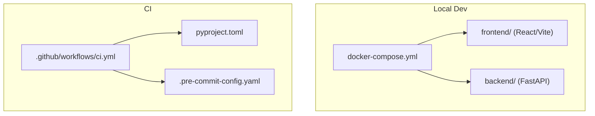
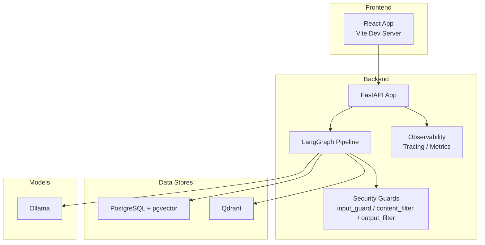
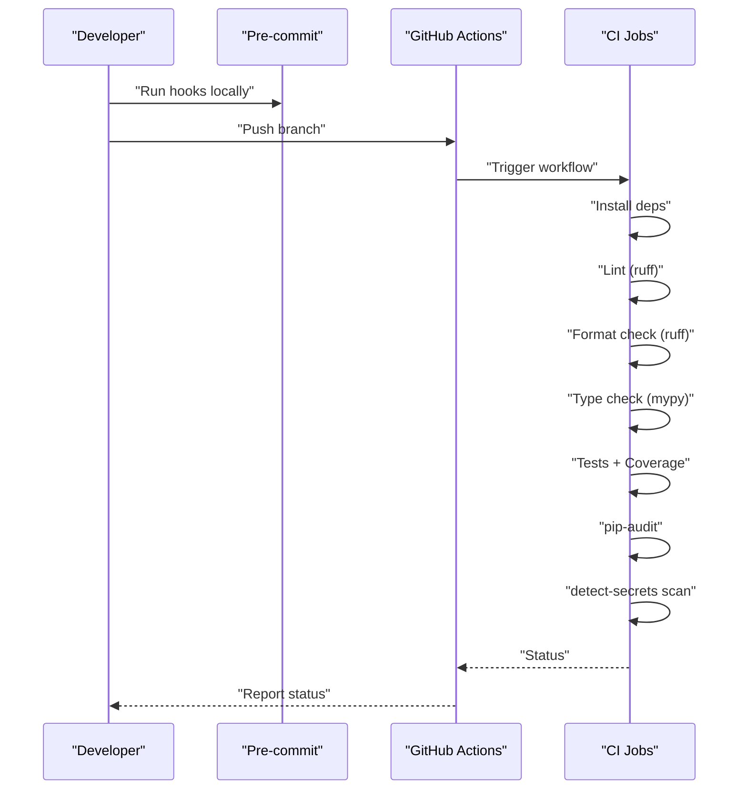
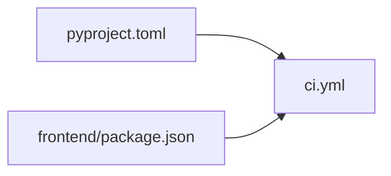

# Development Guidelines

<cite>
**Referenced Files in This Document**
- [.pre-commit-config.yaml](file://safe4ai-pilot/.pre-commit-config.yaml)
- [pyproject.toml](file://safe4ai-pilot/pyproject.toml)
- [package.json](file://safe4ai-pilot/frontend/package.json)
- [tsconfig.json](file://safe4ai-pilot/frontend/tsconfig.json)
- [Dockerfile (frontend)](file://safe4ai-pilot/frontend/Dockerfile)
- [README.md](file://safe4ai-pilot/README.md)
- [architecture.md](file://safe4ai-pilot/docs/architecture.md)
- [ci.yml](file://.github/workflows/ci.yml)
- [docker-compose.yml](file://safe4ai-pilot/docker-compose.yml)
- [conftest.py](file://safe4ai-pilot/tests/conftest.py)
- [AGENTS.md](file://safe4ai-pilot/AGENTS.md)
</cite>

## Table of Contents
1. [Introduction](#introduction)
2. [Project Structure](#project-structure)
3. [Core Components](#core-components)
4. [Architecture Overview](#architecture-overview)
5. [Detailed Component Analysis](#detailed-component-analysis)
6. [Dependency Analysis](#dependency-analysis)
7. [Performance Considerations](#performance-considerations)
8. [Troubleshooting Guide](#troubleshooting-guide)
9. [Conclusion](#conclusion)
10. [Appendices](#appendices)

## Introduction
This document defines development guidelines for the Private AI project, focusing on coding standards, development workflow, and contribution processes. It consolidates configuration and practices from the repository to help contributors set up a reliable environment, maintain consistent code quality, and collaborate effectively. Topics include pre-commit hooks, Python and TypeScript formatting and linting, development environment setup, IDE recommendations, debugging workflows, Git branching and PR practices, project structure conventions, architectural decisions, CI quality gates, and best practices for AI system development, security, and performance.

## Project Structure
The repository is organized around a Python FastAPI backend and a React/Vite frontend, orchestrated by Docker Compose for local development. Key conventions:
- Backend Python code resides under the app directory and related modules.
- Frontend React code resides under the frontend/src directory with Vite configuration.
- Tests live under tests/, with fixtures and containers managed via testcontainers.
- CI is configured via GitHub Actions to enforce linting, type checking, tests, dependency scanning, and secrets detection.

**Diagram sources**
- [docker-compose.yml:1-119](file://safe4ai-pilot/docker-compose.yml#L1-L119)
- [ci.yml:1-40](file://.github/workflows/ci.yml#L1-L40)
- [pyproject.toml:66-101](file://safe4ai-pilot/pyproject.toml#L66-L101)
- [.pre-commit-config.yaml:1-20](file://safe4ai-pilot/.pre-commit-config.yaml#L1-L20)

**Section sources**
- [README.md:1-133](file://safe4ai-pilot/README.md#L1-L133)
- [docker-compose.yml:1-119](file://safe4ai-pilot/docker-compose.yml#L1-L119)
- [pyproject.toml:66-101](file://safe4ai-pilot/pyproject.toml#L66-L101)
- [.pre-commit-config.yaml:1-20](file://safe4ai-pilot/.pre-commit-config.yaml#L1-L20)

## Core Components
- Pre-commit hooks: enforced via ruff (lint/format), detect-secrets, and pre-commit-hooks to prevent large files.
- Python toolchain: ruff for linting/formatting, mypy for type checking, pytest for unit/integration tests, and optional-dependencies for dev tasks.
- TypeScript toolchain: Vite, React, Tailwind, and TypeScript compiler settings.
- CI quality gates: lint, format, type check, coverage, dependency audit, and secrets scan.
- Testing framework: pytest fixtures for mocking Ollama and containerized databases.

**Section sources**
- [.pre-commit-config.yaml:1-20](file://safe4ai-pilot/.pre-commit-config.yaml#L1-L20)
- [pyproject.toml:66-101](file://safe4ai-pilot/pyproject.toml#L66-L101)
- [package.json:1-32](file://safe4ai-pilot/frontend/package.json#L1-L32)
- [tsconfig.json:1-22](file://safe4ai-pilot/frontend/tsconfig.json#L1-L22)
- [ci.yml:1-40](file://.github/workflows/ci.yml#L1-L40)
- [conftest.py:1-88](file://safe4ai-pilot/tests/conftest.py#L1-L88)

## Architecture Overview
The system integrates a FastAPI backend, React admin/chat UI, PostgreSQL with pgvector, Qdrant vector database, Ollama for local LLMs, and Jaeger for tracing. The backend orchestrates a LangGraph pipeline for retrieval and generation, with security guards and observability layers.

**Diagram sources**
- [architecture.md:1-45](file://safe4ai-pilot/docs/architecture.md#L1-L45)
- [docker-compose.yml:1-119](file://safe4ai-pilot/docker-compose.yml#L1-L119)

**Section sources**
- [architecture.md:1-45](file://safe4ai-pilot/docs/architecture.md#L1-L45)
- [docker-compose.yml:1-119](file://safe4ai-pilot/docker-compose.yml#L1-L119)

## Detailed Component Analysis

### Pre-commit Hooks and Code Formatting Standards
- Ruff is configured for linting and auto-fixing, with a target Python version and line length limit.
- Formatting is enforced via ruff-format.
- Secrets detection scans against a baseline to prevent committing sensitive data.
- Large file detection prevents accidental inclusion of oversized assets.

Recommended actions:
- Install pre-commit and run it before pushing changes.
- Keep ruff and mypy configurations aligned with project settings.

**Section sources**
- [.pre-commit-config.yaml:1-20](file://safe4ai-pilot/.pre-commit-config.yaml#L1-L20)
- [pyproject.toml:66-82](file://safe4ai-pilot/pyproject.toml#L66-L82)

### Python Coding Standards and Linting
- Lint selection includes error/warning categories, import sorting, and upgrade-safe rules.
- Per-file ignores are defined for scripts and evaluation modules to accommodate special cases.
- Type checking uses strict mypy with missing imports ignored and specific error codes disabled.

Best practices:
- Run ruff fix and ruff check locally.
- Run mypy on the app module before committing.
- Respect per-file ignores only when justified and documented.

**Section sources**
- [pyproject.toml:70-82](file://safe4ai-pilot/pyproject.toml#L70-L82)

### TypeScript Coding Standards and Build
- Strict TypeScript compilation with DOM and DOM.Iterable libraries.
- No emit for type checking; Vite handles bundling.
- React JSX runtime and Tailwind/TsConfig references are configured.

Best practices:
- Use Vite’s dev server for hot reload.
- Keep tsconfig strict and enable unused locals/parameters checks.
- Align frontend dependencies with backend API contracts.

**Section sources**
- [tsconfig.json:1-22](file://safe4ai-pilot/frontend/tsconfig.json#L1-L22)
- [package.json:1-32](file://safe4ai-pilot/frontend/package.json#L1-L32)

### Development Environment Setup
- Full-stack local setup with Docker Compose is recommended for quickest start.
- Local development mode allows hot reload for backend and frontend while keeping dependencies in Docker.
- Seed an admin user after bringing up the stack.

Practical steps:
- Copy environment template and bring up services.
- Start backend with Uvicorn reload and frontend with Vite.
- Verify health endpoints for backend, Qdrant, and Ollama.

**Section sources**
- [README.md:5-129](file://safe4ai-pilot/README.md#L5-L129)
- [docker-compose.yml:1-119](file://safe4ai-pilot/docker-compose.yml#L1-L119)

### IDE Configuration Recommendations
- Python: configure ruff and mypy integrations; enable format-on-save with ruff-format.
- TypeScript: enable strict TS checks and Vite dev server integration.
- Pre-commit: run hooks locally or integrate with editor to prevent committing violations.

[No sources needed since this section provides general guidance]

### Debugging Workflows
- Backend: use Uvicorn reload with verbose logging; attach debugger to FastAPI app.
- Frontend: use Vite dev server; inspect network requests and console logs.
- Containers: use docker compose logs to troubleshoot service readiness and errors.
- Tests: run pytest with markers; integration tests use testcontainers for Postgres and Qdrant.

**Section sources**
- [README.md:72-129](file://safe4ai-pilot/README.md#L72-L129)
- [conftest.py:1-88](file://safe4ai-pilot/tests/conftest.py#L1-L88)

### Git Branching Strategy and Pull Request Guidelines
- Branch from main for features and fixes.
- Keep commits focused and descriptive; avoid large unrelated changes.
- Open a pull request targeting main; ensure CI passes and coverage meets thresholds.
- Include screenshots or short videos for UI/admin changes; link to related issues.

[No sources needed since this section provides general guidance]

### Commit Message Conventions
- Use imperative mood: “Add feature”, “Fix bug”, “Refactor component”.
- Keep subject concise; add a blank line and detailed body if needed.
- Reference issue numbers and JIRA tickets when applicable.

[No sources needed since this section provides general guidance]

### Contribution Process
- Fork and branch; implement changes following coding standards.
- Run pre-commit hooks, linters, type checks, and tests locally.
- Submit PR with clear description, acceptance criteria, and verification steps.
- Respond to reviewer feedback promptly; re-run checks after updates.

[No sources needed since this section provides general guidance]

### Project Structure Conventions and Naming Patterns
- Python modules under app/; services under services/; agents under agents/; security guards under security/.
- Frontend components under frontend/src/components; pages under frontend/src/pages; hooks under frontend/src/hooks.
- Tests mirror module structure; integration tests use testcontainers.
- Scripts for operational tasks under scripts/.

**Section sources**
- [AGENTS.md:1-20](file://safe4ai-pilot/AGENTS.md#L1-L20)

### Architectural Decision Records
- Dual vector stores: Qdrant for retrieval, pgvector for semantic cache.
- Two routers: collection router and pipeline step router.
- LangGraph pipeline stages: intake → input_guard → rewrite → retrieve → grade → generate → output_filter → quality_gate.
- Security layers: input_guard, content_filter, output_filter.

**Section sources**
- [architecture.md:1-45](file://safe4ai-pilot/docs/architecture.md#L1-L45)

### Continuous Integration Requirements
- Python 3.11 environment.
- Lint with ruff; format check with ruff.
- Type check with mypy on app/.
- Tests with pytest; coverage report and fail-under threshold.
- Dependency vulnerability scan with pip-audit.
- Secrets scan with detect-secrets using baseline.

**Diagram sources**
- [.pre-commit-config.yaml:1-20](file://safe4ai-pilot/.pre-commit-config.yaml#L1-L20)
- [ci.yml:1-40](file://.github/workflows/ci.yml#L1-L40)
- [pyproject.toml:66-101](file://safe4ai-pilot/pyproject.toml#L66-L101)

**Section sources**
- [ci.yml:1-40](file://.github/workflows/ci.yml#L1-L40)
- [pyproject.toml:66-101](file://safe4ai-pilot/pyproject.toml#L66-L101)

### Code Review Process and Quality Gates
- Automated quality gates in CI must pass.
- Human reviewers verify correctness, security, performance, and adherence to standards.
- Coverage thresholds and dependency audits are mandatory.

**Section sources**
- [ci.yml:32-39](file://.github/workflows/ci.yml#L32-L39)

## Dependency Analysis
- Backend dependencies pinned in pyproject.toml; dev dependencies include testing and linting tools.
- Frontend dependencies include React, Vite, Tailwind, and TypeScript.
- CI depends on Python 3.11 and executes standardized checks.

**Diagram sources**
- [pyproject.toml:1-101](file://safe4ai-pilot/pyproject.toml#L1-L101)
- [package.json:1-32](file://safe4ai-pilot/frontend/package.json#L1-L32)
- [ci.yml:1-40](file://.github/workflows/ci.yml#L1-L40)

**Section sources**
- [pyproject.toml:1-101](file://safe4ai-pilot/pyproject.toml#L1-L101)
- [package.json:1-32](file://safe4ai-pilot/frontend/package.json#L1-L32)
- [ci.yml:1-40](file://.github/workflows/ci.yml#L1-L40)

## Performance Considerations
- Prefer pgvector for small-scale caching and Qdrant for high-volume retrieval.
- Use streaming and pagination for long-running operations.
- Optimize embeddings and model calls; leverage semantic cache hits.
- Monitor latency and throughput with observability tools.

[No sources needed since this section provides general guidance]

## Troubleshooting Guide
- Health checks: verify backend, Qdrant, and Ollama endpoints after startup.
- Logs: use docker compose logs for services; inspect frontend build artifacts.
- Mocking: tests use a mock Ollama transport to avoid external dependencies.
- Containerized DBs: integration tests spin up Postgres and Qdrant via testcontainers.

**Section sources**
- [README.md:104-129](file://safe4ai-pilot/README.md#L104-L129)
- [conftest.py:1-88](file://safe4ai-pilot/tests/conftest.py#L1-L88)

## Conclusion
By following these guidelines—pre-commit hooks, Python and TypeScript standards, local development workflows, CI quality gates, and security/performance best practices—you can contribute effectively to the Private AI project while maintaining high code quality and reliability.

[No sources needed since this section summarizes without analyzing specific files]

## Appendices

### Appendix A: Running Tests Locally
- Backend tests: run pytest in the backend directory.
- Frontend build: run the build script in the frontend directory.

**Section sources**
- [README.md:121-126](file://safe4ai-pilot/README.md#L121-L126)

### Appendix B: Frontend Build and Preview
- Use the provided scripts to build and preview the frontend.

**Section sources**
- [package.json:6-10](file://safe4ai-pilot/frontend/package.json#L6-L10)

### Appendix C: Frontend Docker Build
- The frontend Dockerfile builds assets with Nginx serving the distribution.

**Section sources**
- [Dockerfile (frontend):1-14](file://safe4ai-pilot/frontend/Dockerfile#L1-L14)