# Document Processing System

<cite>
**Referenced Files in This Document**
- [ingestion_service.py](file://safe4ai-pilot/app/services/ingestion_service.py)
- [rag_pipeline.py](file://safe4ai-pilot/app/services/rag_pipeline.py)
- [hybrid_retriever.py](file://safe4ai-pilot/app/components/hybrid_retriever.py)
- [reranker.py](file://safe4ai-pilot/app/components/reranker.py)
- [models.py](file://safe4ai-pilot/app/models.py)
- [models.py (DB)](file://safe4ai-pilot/app/db/models.py)
- [config.py](file://safe4ai-pilot/app/config.py)
- [upload_validator.py](file://safe4ai-pilot/app/security/upload_validator.py)
- [admin_routes.py](file://safe4ai-pilot/app/api/admin_routes.py)
- [semantic_cache.py](file://safe4ai-pilot/app/services/semantic_cache.py)
- [graph.py](file://safe4ai-pilot/app/agents/graph.py)
- [architecture.md](file://safe4ai-pilot/docs/architecture.md)
</cite>

## Update Summary
**Changes Made**
- Enhanced error handling and transaction management in ingestion service with improved status tracking
- Added queued and indexing states for better document lifecycle management
- Improved OCR quality detection with confidence scoring and low-confidence page tracking
- Enhanced job recovery mechanism for stuck ingestion processes

## Table of Contents
1. [Introduction](#introduction)
2. [Project Structure](#project-structure)
3. [Core Components](#core-components)
4. [Architecture Overview](#architecture-overview)
5. [Detailed Component Analysis](#detailed-component-analysis)
6. [Dependency Analysis](#dependency-analysis)
7. [Performance Considerations](#performance-considerations)
8. [Troubleshooting Guide](#troubleshooting-guide)
9. [Conclusion](#conclusion)
10. [Appendices](#appendices)

## Introduction
This document describes the end-to-end document processing system that transforms uploaded files into searchable, vector-represented knowledge. It covers:
- Upload validation and ingestion orchestration with enhanced error handling
- File format support and OCR for images/scanned documents with quality detection
- Metadata extraction and persistence with improved status tracking
- Hybrid retrieval combining dense vectors and sparse BM25
- Reranking with cross-encoders to improve result relevance
- Embedding generation using Nomic Embed Text and vector storage with Qdrant
- Practical configuration, customization, and optimization guidance
- Indexing strategy, batch processing, scalability, and monitoring

## Project Structure
The system is organized around a FastAPI backend with modular services:
- API layer: uploads, admin operations, and status polling
- Services: ingestion orchestration, RAG pipeline, semantic caching
- Components: hybrid retriever and reranker
- Models: shared Pydantic models and DB ORM models
- Security: upload validation and guards
- Agents: LangGraph pipeline orchestrating retrieval, grading, decomposition, generation, and quality gating

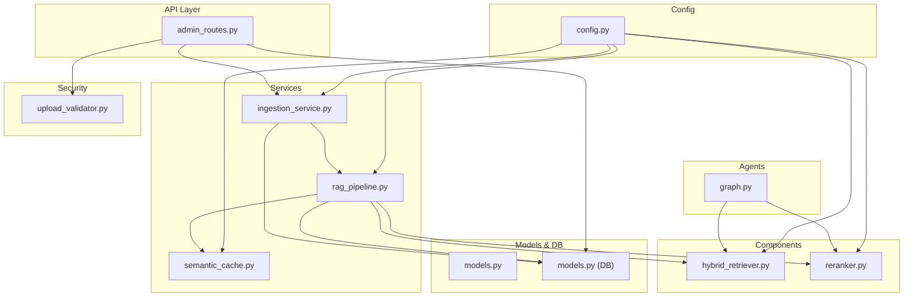

**Diagram sources**
- [admin_routes.py:63-114](file://safe4ai-pilot/app/api/admin_routes.py#L63-L114)
- [ingestion_service.py:21-87](file://safe4ai-pilot/app/services/ingestion_service.py#L21-L87)
- [rag_pipeline.py:34-182](file://safe4ai-pilot/app/services/rag_pipeline.py#L34-L182)
- [hybrid_retriever.py:13-143](file://safe4ai-pilot/app/components/hybrid_retriever.py#L13-L143)
- [reranker.py:11-36](file://safe4ai-pilot/app/components/reranker.py#L11-L36)
- [semantic_cache.py:14-104](file://safe4ai-pilot/app/services/semantic_cache.py#L14-L104)
- [models.py:13-95](file://safe4ai-pilot/app/models.py#L13-L95)
- [models.py (DB):68-175](file://safe4ai-pilot/app/db/models.py#L68-L175)
- [upload_validator.py:24-73](file://safe4ai-pilot/app/security/upload_validator.py#L24-L73)
- [graph.py:39-342](file://safe4ai-pilot/app/agents/graph.py#L39-L342)
- [config.py:5-28](file://safe4ai-pilot/app/config.py#L5-L28)

**Section sources**
- [admin_routes.py:63-114](file://safe4ai-pilot/app/api/admin_routes.py#L63-L114)
- [architecture.md:1-45](file://safe4ai-pilot/docs/architecture.md#L1-L45)

## Core Components
- Ingestion Service: Orchestrates background ingestion with enhanced error handling, transaction management, and improved status tracking through queued, embedding, and indexing states.
- RAG Pipeline: Loads supported formats, chunks text with OCR quality detection, generates embeddings, stores vectors and payloads, updates BM25 index, and supports OCR for low-text PDF pages with confidence scoring.
- Hybrid Retriever: Combines dense vector similarity (Qdrant) and sparse BM25 ranking, then merges results via Reciprocal Rank Fusion.
- Reranker: Uses a cross-encoder to re-rank candidate chunks for improved relevance.
- Semantic Cache: Stores query embeddings and cached answers for reuse.
- Upload Validator: Enforces allowed extensions, MIME types, magic bytes, and size limits.
- Config: Centralized settings for URLs, models, and thresholds.
- DB Models: Document lifecycle with enhanced status tracking, chunk metadata, audit logs, and semantic cache.

**Section sources**
- [ingestion_service.py:21-167](file://safe4ai-pilot/app/services/ingestion_service.py#L21-L167)
- [rag_pipeline.py:34-313](file://safe4ai-pilot/app/services/rag_pipeline.py#L34-L313)
- [hybrid_retriever.py:13-143](file://safe4ai-pilot/app/components/hybrid_retriever.py#L13-L143)
- [reranker.py:11-36](file://safe4ai-pilot/app/components/reranker.py#L11-L36)
- [semantic_cache.py:14-104](file://safe4ai-pilot/app/services/semantic_cache.py#L14-L104)
- [upload_validator.py:24-73](file://safe4ai-pilot/app/security/upload_validator.py#L24-L73)
- [config.py:5-28](file://safe4ai-pilot/app/config.py#L5-L28)
- [models.py (DB):68-175](file://safe4ai-pilot/app/db/models.py#L68-L175)

## Architecture Overview
High-level ingestion and retrieval flow with enhanced status tracking:
- Upload validated and stored; ingestion job created with pending status and scheduled.
- Background ingestion loads file content, performs OCR with quality detection, chunks, embeds, upserts vectors, persists chunk metadata, and updates BM25 index.
- Enhanced status tracking moves documents through queued → embedding → indexed → failed states with proper transaction management.
- Retrieval combines dense vectors and BM25, then reranks with a cross-encoder.
- Optional semantic cache accelerates repeated queries.

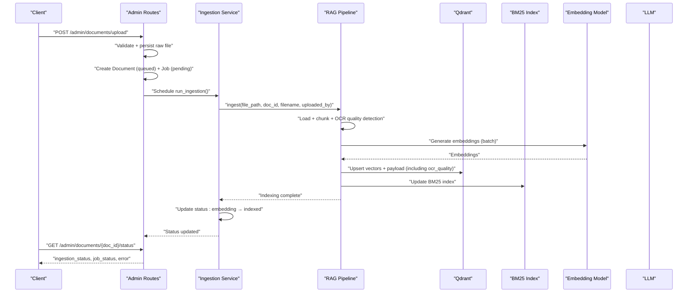

**Diagram sources**
- [admin_routes.py:63-114](file://safe4ai-pilot/app/api/admin_routes.py#L63-L114)
- [ingestion_service.py:21-87](file://safe4ai-pilot/app/services/ingestion_service.py#L21-L87)
- [rag_pipeline.py:62-150](file://safe4ai-pilot/app/services/rag_pipeline.py#L62-L150)
- [hybrid_retriever.py:29-41](file://safe4ai-pilot/app/components/hybrid_retriever.py#L29-L41)

**Section sources**
- [architecture.md:36-44](file://safe4ai-pilot/docs/architecture.md#L36-L44)

## Detailed Component Analysis

### Ingestion Service
Enhanced responsibilities:
- Create and manage ingestion jobs with improved status tracking (pending → embedding → completed).
- Orchestrate the RAG pipeline for a document with robust error handling and transaction management.
- Recover stuck jobs automatically with enhanced timeout handling.
- Manage database sessions independently to prevent request session conflicts.

Key behaviors:
- Updates job/document status to "embedding" before processing and sets ingestion_started_at timestamp.
- Initializes HybridRetriever and Reranker with configured endpoints and models.
- Commits success or failure states with timestamps and error details.
- Enhanced error handling with rollback protection and detailed logging.
- Job recovery mechanism resets stuck jobs (>10 minutes) back to queued or failed states.

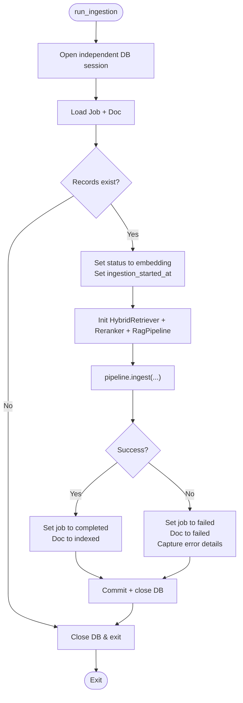

**Diagram sources**
- [ingestion_service.py:21-113](file://safe4ai-pilot/app/services/ingestion_service.py#L21-L113)

**Section sources**
- [ingestion_service.py:21-167](file://safe4ai-pilot/app/services/ingestion_service.py#L21-L167)

### Enhanced Status Tracking
The system now implements a comprehensive document lifecycle with four distinct states:
- queued: Initial state when documents are uploaded and waiting for processing
- embedding: Active processing state when ingestion is in progress
- indexed: Successful completion state when documents are fully processed
- failed: Error state with detailed error information
- skipped: State for documents that contain only filtered content

Job status tracking includes:
- pending: Initial job state awaiting execution
- embedding: Active job execution
- completed: Successful job completion
- failed: Failed job with error details

**Section sources**
- [models.py (DB):26-38](file://safe4ai-pilot/app/db/models.py#L26-L38)
- [ingestion_service.py:44-46](file://safe4ai-pilot/app/services/ingestion_service.py#L44-L46)
- [admin_routes.py:440](file://safe4ai-pilot/app/api/admin_routes.py#L440)

### RAG Pipeline with OCR Quality Detection
Enhanced responsibilities:
- File loading and preprocessing for PDF, DOCX, XLSX, TXT with quality detection.
- Advanced OCR for scanned PDFs with confidence scoring and low-confidence page tracking.
- Chunking with overlap, batch embedding generation, and vector upsert with quality metadata.
- Persisting chunk metadata including OCR quality indicators and updating BM25 index.
- Query-time retrieval, reranking, and answer synthesis.

Processing logic highlights:
- PDF: extract text per page; if below threshold or garbled, convert page to image and run OCR via Ollama vision model; compute confidence (high/medium/low) and track low-confidence pages.
- DOCX/XLSX/TXT: native parsing; XLSX rows converted to tabular text.
- Chunking: recursive character splitting with configurable size and overlap.
- Embeddings: batched requests to Ollama embeddings endpoint.
- Vector storage: Qdrant upsert with payload metadata including ocr_quality field.
- BM25: rebuild index from chunk IDs and payloads for sparse retrieval.
- Query: hybrid retrieval + reranking; minimum rerank score threshold determines fallback.

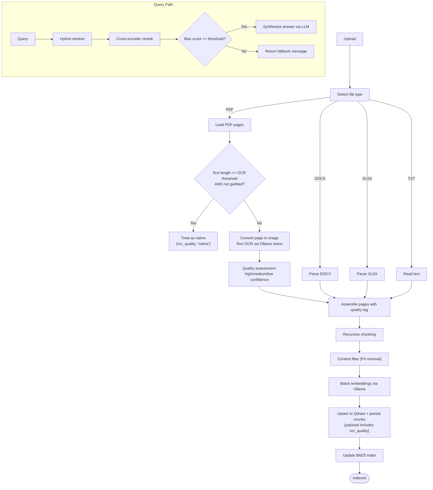

**Diagram sources**
- [rag_pipeline.py:62-313](file://safe4ai-pilot/app/services/rag_pipeline.py#L62-L313)
- [hybrid_retriever.py:56-142](file://safe4ai-pilot/app/components/hybrid_retriever.py#L56-L142)
- [reranker.py:15-35](file://safe4ai-pilot/app/components/reranker.py#L15-L35)

**Section sources**
- [rag_pipeline.py:34-313](file://safe4ai-pilot/app/services/rag_pipeline.py#L34-L313)

### Enhanced OCR Quality Detection
The system now implements sophisticated OCR quality assessment:
- Confidence scoring: high, medium, or low confidence levels based on AI evaluation
- Quality prompts: separate prompts for text extraction and confidence assessment
- JSON-based confidence evaluation: structured confidence scoring with reasoning
- Low-confidence tracking: counts and tracks pages with low OCR confidence
- Payload preservation: ocr_quality field stored in Qdrant for later analysis
- Graceful degradation: continues processing even with low-confidence OCR results

Quality assessment logic:
- Extract text using vision model with structured prompt
- Evaluate confidence separately with quality prompt
- Handle JSON parsing errors gracefully with default "low" confidence
- Track low-confidence pages for monitoring and analysis

**Section sources**
- [rag_pipeline.py:270-330](file://safe4ai-pilot/app/services/rag_pipeline.py#L270-L330)
- [rag_pipeline.py:351-393](file://safe4ai-pilot/app/services/rag_pipeline.py#L351-L393)

### Job Recovery Mechanism
Enhanced job recovery system:
- Stuck job detection: Jobs remaining in embedding state beyond 10-minute threshold
- Pending job timeout: Jobs stuck in pending state beyond threshold moved to failed
- Automatic recovery: Reset stuck embedding jobs back to queued state
- Timeout error handling: Clear error messages for pending job timeouts
- Transaction safety: Proper commit/rollback handling during recovery

Recovery thresholds:
- STUCK_THRESHOLD_MINUTES: 10-minute cutoff for job recovery
- PENDING_JOB_TIMEOUT_ERROR: Standardized error message for timed-out pending jobs

**Section sources**
- [ingestion_service.py:118-167](file://safe4ai-pilot/app/services/ingestion_service.py#L118-L167)

### Hybrid Retriever
Capabilities:
- Dense retrieval: queries Qdrant with vector similarity.
- Sparse retrieval: BM25 over chunk contents; supports filtering by document IDs.
- Fusion: reciprocal rank fusion (RRF) to combine dense and sparse ranks.
- Payload propagation: carries document metadata alongside results.

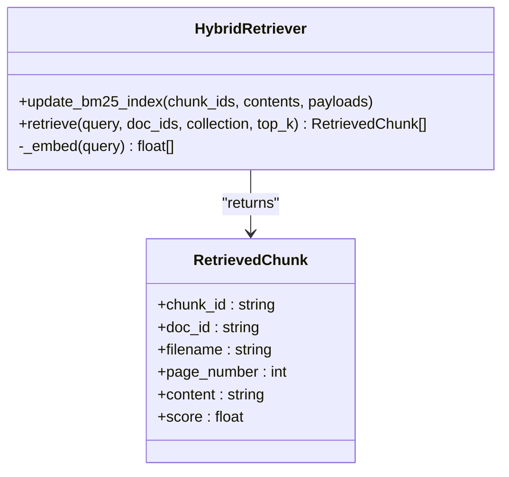

**Diagram sources**
- [hybrid_retriever.py:13-143](file://safe4ai-pilot/app/components/hybrid_retriever.py#L13-L143)
- [models.py:13-20](file://safe4ai-pilot/app/models.py#L13-L20)

**Section sources**
- [hybrid_retriever.py:13-143](file://safe4ai-pilot/app/components/hybrid_retriever.py#L13-L143)

### Reranker
Capabilities:
- Cross-encoder model to produce contextual relevance scores.
- Returns top-N ranked chunks with rerank scores.

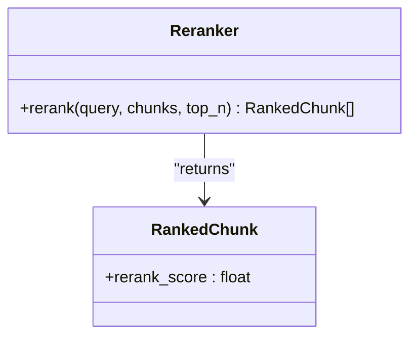

**Diagram sources**
- [reranker.py:11-36](file://safe4ai-pilot/app/components/reranker.py#L11-L36)
- [models.py:22-28](file://safe4ai-pilot/app/models.py#L22-L28)

**Section sources**
- [reranker.py:11-36](file://safe4ai-pilot/app/components/reranker.py#L11-L36)

### Semantic Cache
Capabilities:
- Embeds incoming queries and compares to stored embeddings using pgvector's `<=>` operator.
- Stores responses, citations, and source document/chunk IDs.
- Invalidates cache entries by document ID.

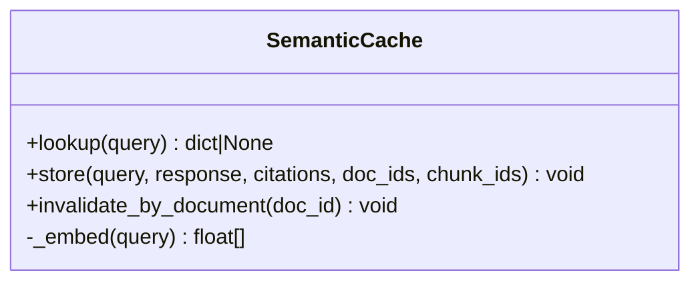

**Diagram sources**
- [semantic_cache.py:14-104](file://safe4ai-pilot/app/services/semantic_cache.py#L14-L104)

**Section sources**
- [semantic_cache.py:14-104](file://safe4ai-pilot/app/services/semantic_cache.py#L14-L104)

### Upload Validation
Capabilities:
- Validates file extension, declared Content-Type, magic bytes, and size.
- Generates a safe storage filename.

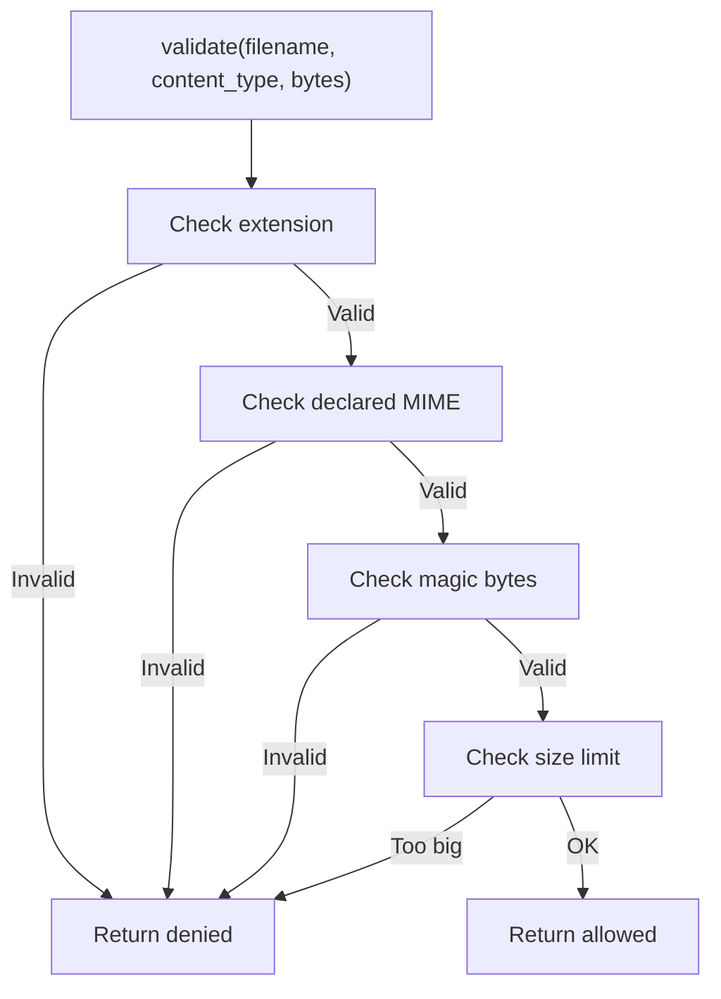

**Diagram sources**
- [upload_validator.py:24-73](file://safe4ai-pilot/app/security/upload_validator.py#L24-L73)

**Section sources**
- [upload_validator.py:24-73](file://safe4ai-pilot/app/security/upload_validator.py#L24-L73)

### API: Upload and Status
Endpoints:
- Upload document with validation and background ingestion scheduling with proper status initialization.
- List documents and poll ingestion status with enhanced state information.
- Re-index existing documents with proper state management.
- Delete documents (filesystem, Qdrant, DB, and semantic cache cleanup) with active job prevention.

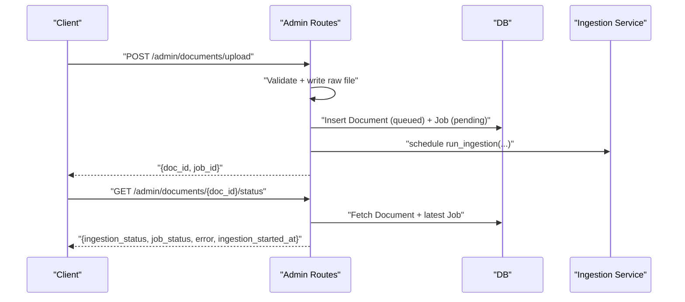

**Diagram sources**
- [admin_routes.py:63-175](file://safe4ai-pilot/app/api/admin_routes.py#L63-L175)

**Section sources**
- [admin_routes.py:63-243](file://safe4ai-pilot/app/api/admin_routes.py#L63-L243)

### LangGraph Pipeline (Agent Orchestrator)
The agent orchestrates retrieval, grading, decomposition, generation, and quality gating with safety checks and self-correction loops.

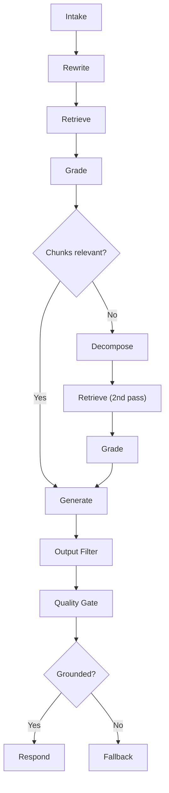

**Diagram sources**
- [graph.py:39-342](file://safe4ai-pilot/app/agents/graph.py#L39-L342)

**Section sources**
- [graph.py:39-342](file://safe4ai-pilot/app/agents/graph.py#L39-L342)

## Dependency Analysis
- Configuration-driven components: all major services depend on settings for model names, endpoints, and thresholds.
- Qdrant and Ollama are external dependencies for vector storage and embeddings/LLM.
- DB models define document lifecycle and chunk metadata used across ingestion and retrieval.
- Upload validator ensures only allowed files enter the pipeline.

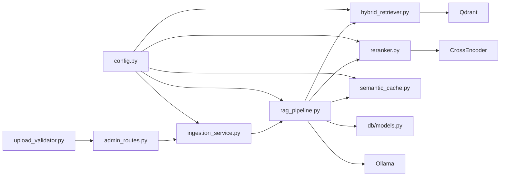

**Diagram sources**
- [config.py:5-28](file://safe4ai-pilot/app/config.py#L5-L28)
- [ingestion_service.py:46-62](file://safe4ai-pilot/app/services/ingestion_service.py#L46-L62)
- [rag_pipeline.py:35-56](file://safe4ai-pilot/app/services/rag_pipeline.py#L35-L56)
- [hybrid_retriever.py:14-24](file://safe4ai-pilot/app/components/hybrid_retriever.py#L14-L24)
- [reranker.py:12-13](file://safe4ai-pilot/app/components/reranker.py#L12-L13)
- [semantic_cache.py:15-25](file://safe4ai-pilot/app/services/semantic_cache.py#L15-L25)
- [upload_validator.py:24-73](file://safe4ai-pilot/app/security/upload_validator.py#L24-L73)
- [admin_routes.py:63-114](file://safe4ai-pilot/app/api/admin_routes.py#L63-L114)
- [models.py (DB):68-175](file://safe4ai-pilot/app/db/models.py#L68-L175)

**Section sources**
- [config.py:5-28](file://safe4ai-pilot/app/config.py#L5-L28)
- [models.py (DB):68-175](file://safe4ai-pilot/app/db/models.py#L68-L175)

## Performance Considerations
- Embedding batching: the pipeline batches embedding requests to reduce overhead.
- Chunk sizing and overlap: tuned to balance recall and context coherence.
- Enhanced OCR quality gating: reduces downstream noise by skipping low-confidence OCR pages and tracking quality metrics.
- Hybrid retrieval with RRF: balances lexical matching and semantic similarity.
- Semantic cache: leverages pgvector for efficient nearest-neighbor lookup on repeated queries.
- Concurrency: background ingestion tasks prevent blocking the API.
- Transaction isolation: independent database sessions prevent request conflicts.

## Troubleshooting Guide
Common issues and remedies:
- Ingestion stuck: the service recovers jobs older than 10 minutes and resets them to queued or failed states with proper error messages.
- OCR failures: PDF pages without sufficient text fall back to OCR with confidence scoring; failures are handled gracefully and low-confidence pages are tracked for monitoring.
- Embedding errors: exceptions during embedding or reranking lead to job failure with error details persisted and proper rollback handling.
- Qdrant deletion failures: deletion attempts log warnings and continue to avoid blocking.
- Upload validation failures: ensure file extension, MIME type, and size meet allowed criteria.
- Status tracking issues: monitor queued → embedding → indexed state transitions for proper processing flow.

Operational checks:
- Poll ingestion status via the status endpoint to monitor state transitions.
- Inspect audit logs for latency and model usage.
- Monitor semantic cache hit rate and total hits.
- Track OCR quality metrics and low-confidence page counts.
- Monitor job recovery statistics for system health.

**Section sources**
- [ingestion_service.py:90-113](file://safe4ai-pilot/app/services/ingestion_service.py#L90-L113)
- [rag_pipeline.py:291-294](file://safe4ai-pilot/app/services/rag_pipeline.py#L291-L294)
- [admin_routes.py:261-277](file://safe4ai-pilot/app/api/admin_routes.py#L261-L277)

## Conclusion
The system integrates robust ingestion, hybrid retrieval, and reranking to deliver accurate, contextual answers from uploaded documents. Enhanced error handling, transaction management, and status tracking provide reliable operation with clear visibility into document processing states. The addition of OCR quality detection improves processing reliability by identifying and tracking low-quality OCR results. With semantic caching, careful error handling, and comprehensive monitoring, it provides reliable performance and observability for production deployments.

## Appendices

### Configuration Reference
- Postgres URL, Qdrant URL, Ollama URL/model, embedding model, allowed origins, retention policies, cache threshold, and upload size limits are centralized in settings.

**Section sources**
- [config.py:5-28](file://safe4ai-pilot/app/config.py#L5-L28)

### Indexing and Batch Strategy
- Chunking: configurable size and overlap for balanced recall and context.
- Embedding: batched requests to Ollama to optimize throughput.
- Upsert: Qdrant upsert with payload metadata including OCR quality indicators for retrieval and citations.
- BM25: rebuilt from chunk IDs and payloads for sparse retrieval.
- OCR quality tracking: low-confidence pages are monitored and can be identified via ocr_quality payload field.

**Section sources**
- [rag_pipeline.py:25-27](file://safe4ai-pilot/app/services/rag_pipeline.py#L25-L27)
- [rag_pipeline.py:109-125](file://safe4ai-pilot/app/services/rag_pipeline.py#L109-L125)
- [rag_pipeline.py:146-149](file://safe4ai-pilot/app/services/rag_pipeline.py#L146-L149)
- [hybrid_retriever.py:29-41](file://safe4ai-pilot/app/components/hybrid_retriever.py#L29-L41)

### Practical Examples
- Configure document processing workflows:
  - Adjust chunk size and overlap in the pipeline constants.
  - Tune OCR threshold and confidence ratio for scanned documents.
- Customize OCR settings:
  - Modify OCR threshold and quality gate logic in the pipeline.
  - Monitor OCR quality metrics and adjust confidence thresholds.
  - Ensure Ollama vision model availability and timeouts are appropriate.
- Optimize retrieval performance:
  - Increase top_k for hybrid retrieval to capture more candidates.
  - Adjust reranker top_n and minimum rerank score threshold.
  - Use semantic cache threshold to balance freshness and reuse.
- Monitor system health:
  - Track job recovery statistics for stuck job detection.
  - Monitor OCR quality distribution and low-confidence page rates.
  - Observe status transition patterns for processing reliability.

**Section sources**
- [rag_pipeline.py:25-31](file://safe4ai-pilot/app/services/rag_pipeline.py#L25-L31)
- [rag_pipeline.py:151-181](file://safe4ai-pilot/app/services/rag_pipeline.py#L151-L181)
- [semantic_cache.py:20-25](file://safe4ai-pilot/app/services/semantic_cache.py#L20-L25)

### Monitoring and Observability
- Track ingestion job status and errors with enhanced state tracking.
- Export audit logs and analyze latency and model usage.
- Monitor semantic cache hit rate and total hits.
- Track OCR quality metrics and low-confidence page distributions.
- Monitor job recovery statistics and system health indicators.

**Section sources**
- [admin_routes.py:151-175](file://safe4ai-pilot/app/api/admin_routes.py#L151-L175)
- [admin_routes.py:382-418](file://safe4ai-pilot/app/api/admin_routes.py#L382-L418)
- [models.py (DB):111-124](file://safe4ai-pilot/app/db/models.py#L111-L124)