# Document Processing System

<cite>
**Referenced Files in This Document**
- [ingestion_service.py](file://safe4ai-pilot/app/services/ingestion_service.py)
- [rag_pipeline.py](file://safe4ai-pilot/app/services/rag_pipeline.py)
- [document_parser.py](file://safe4ai-pilot/app/services/document_parser.py)
- [hybrid_retriever.py](file://safe4ai-pilot/app/components/hybrid_retriever.py)
- [reranker.py](file://safe4ai-pilot/app/components/reranker.py)
- [models.py](file://safe4ai-pilot/app/models.py)
- [models.py (DB)](file://safe4ai-pilot/app/db/models.py)
- [config.py](file://safe4ai-pilot/app/config.py)
- [upload_validator.py](file://safe4ai-pilot/app/security/upload_validator.py)
- [admin_routes.py](file://safe4ai-pilot/app/api/admin_routes.py)
- [document_routes.py](file://safe4ai-pilot/app/api/document_routes.py)
- [semantic_cache.py](file://safe4ai-pilot/app/services/semantic_cache.py)
- [graph.py](file://safe4ai-pilot/app/agents/graph.py)
- [document_service.py](file://safe4ai-pilot/app/services/document_service.py)
- [startup_migrations.py](file://safe4ai-pilot/app/startup_migrations.py)
- [test_document_versioning.py](file://safe4ai-pilot/tests/test_document_versioning.py)
- [architecture.md](file://safe4ai-pilot/docs/architecture.md)
</cite>

## Update Summary
**Changes Made**
- Added comprehensive DocumentVersion integration for version-aware ingestion pipeline
- Implemented atomic document replacement with staged versions and rollback window
- Enhanced status tracking for versioned documents with DocumentVersionStatus enumeration
- Added improved error handling and transaction management for versioned ingestion
- Updated ingestion service to support document_version_id parameter for targeted processing
- Integrated version activation mechanism with Qdrant payload updates
- Added cleanup procedures for superseded document versions and vectors

## Table of Contents
1. [Introduction](#introduction)
2. [Project Structure](#project-structure)
3. [Core Components](#core-components)
4. [Architecture Overview](#architecture-overview)
5. [Detailed Component Analysis](#detailed-component-analysis)
6. [Version Management System](#version-management-system)
7. [Dependency Analysis](#dependency-analysis)
8. [Performance Considerations](#performance-considerations)
9. [Troubleshooting Guide](#troubleshooting-guide)
10. [Conclusion](#conclusion)
11. [Appendices](#appendices)

## Introduction
This document describes the end-to-end document processing system that transforms uploaded files into searchable, vector-represented knowledge with advanced version management capabilities. The system now supports atomic document replacement without retrieval gaps, comprehensive version tracking, and improved error handling. Key enhancements include:
- Version-aware ingestion pipeline with DocumentVersion integration
- Atomic document replacement with staged versions and rollback window
- Enhanced status tracking through DocumentVersionStatus enumeration
- Improved error handling and transaction management for versioned documents
- Seamless migration from legacy document processing to versioned architecture
- Comprehensive cleanup procedures for superseded content

## Project Structure
The system is organized around a FastAPI backend with modular services supporting version management:
- API layer: uploads, admin operations, status polling, and version management
- Services: ingestion orchestration, RAG pipeline, document parsing, semantic caching, document service
- Components: hybrid retriever and reranker
- Models: shared Pydantic models, DB ORM models with DocumentVersion support
- Security: upload validation and guards
- Agents: LangGraph pipeline orchestrating retrieval, grading, decomposition, generation, and quality gating

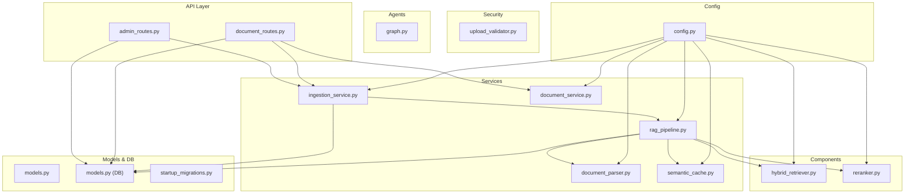

**Diagram sources**
- [admin_routes.py:63-114](file://safe4ai-pilot/app/api/admin_routes.py#L63-L114)
- [document_routes.py:640-774](file://safe4ai-pilot/app/api/document_routes.py#L640-L774)
- [ingestion_service.py:21-87](file://safe4ai-pilot/app/services/ingestion_service.py#L21-L87)
- [rag_pipeline.py:34-182](file://safe4ai-pilot/app/services/rag_pipeline.py#L34-L182)
- [document_parser.py:1-183](file://safe4ai-pilot/app/services/document_parser.py#L1-183)
- [hybrid_retriever.py:13-143](file://safe4ai-pilot/app/components/hybrid_retriever.py#L13-L143)
- [reranker.py:11-36](file://safe4ai-pilot/app/components/reranker.py#L11-L36)
- [semantic_cache.py:14-104](file://safe4ai-pilot/app/services/semantic_cache.py#L14-L104)
- [document_service.py:85-240](file://safe4ai-pilot/app/services/document_service.py#L85-L240)
- [models.py:13-95](file://safe4ai-pilot/app/models.py#L13-L95)
- [models.py (DB):68-175](file://safe4ai-pilot/app/db/models.py#L68-L175)
- [startup_migrations.py:64-95](file://safe4ai-pilot/app/startup_migrations.py#L64-L95)
- [upload_validator.py:24-73](file://safe4ai-pilot/app/security/upload_validator.py#L24-L73)
- [graph.py:39-342](file://safe4ai-pilot/app/agents/graph.py#L39-L342)
- [config.py:5-28](file://safe4ai-pilot/app/config.py#L5-L28)

**Section sources**
- [admin_routes.py:63-114](file://safe4ai-pilot/app/api/admin_routes.py#L63-L114)
- [document_routes.py:640-774](file://safe4ai-pilot/app/api/document_routes.py#L640-L774)
- [architecture.md:1-45](file://safe4ai-pilot/docs/architecture.md#L1-L45)

## Core Components
- **Enhanced Ingestion Service**: Orchestrates background ingestion with version-aware processing, transaction management, and comprehensive status tracking through queued, embedding, and indexing states with DocumentVersion support.
- **RAG Pipeline**: Loads supported formats via dedicated document parser, chunks text with OCR quality detection, generates embeddings, stores vectors and payloads with version metadata, updates BM25 index, and supports OCR for low-text PDF pages with confidence scoring.
- **Document Parser**: Dedicated service (182 lines) consolidating all document parsing functionality including OCR capabilities, PDF processing with automatic fallback, DOCX and XLSX handling.
- **Hybrid Retriever**: Combines dense vector similarity (Qdrant) and sparse BM25 ranking, then merges results via Reciprocal Rank Fusion.
- **Reranker**: Uses a cross-encoder to re-rank candidate chunks for improved relevance.
- **Semantic Cache**: Stores query embeddings and cached answers for reuse.
- **Document Service**: Manages DocumentVersion lifecycle, activation, cleanup, and deletion verification with atomic switching semantics.
- **Upload Validator**: Enforces allowed extensions, MIME types, magic bytes, and size limits.
- **Config**: Centralized settings for URLs, models, and thresholds.
- **DB Models**: Document lifecycle with enhanced status tracking, chunk metadata, audit logs, semantic cache, and comprehensive DocumentVersion support.

**Section sources**
- [ingestion_service.py:21-167](file://safe4ai-pilot/app/services/ingestion_service.py#L21-L167)
- [rag_pipeline.py:34-345](file://safe4ai-pilot/app/services/rag_pipeline.py#L34-L345)
- [document_parser.py:1-183](file://safe4ai-pilot/app/services/document_parser.py#L1-183)
- [hybrid_retriever.py:13-143](file://safe4ai-pilot/app/components/hybrid_retriever.py#L13-L143)
- [reranker.py:11-36](file://safe4ai-pilot/app/components/reranker.py#L11-L36)
- [semantic_cache.py:14-104](file://safe4ai-pilot/app/services/semantic_cache.py#L14-L104)
- [document_service.py:85-240](file://safe4ai-pilot/app/services/document_service.py#L85-L240)
- [upload_validator.py:24-73](file://safe4ai-pilot/app/security/upload_validator.py#L24-L73)
- [config.py:5-28](file://safe4ai-pilot/app/config.py#L5-L28)
- [models.py (DB):68-175](file://safe4ai-pilot/app/db/models.py#L68-L175)

## Architecture Overview
High-level ingestion and retrieval flow with enhanced status tracking and version management:
- Upload validated and stored; ingestion job created with pending status and scheduled for specific DocumentVersion.
- Background ingestion loads file content via dedicated document parser, performs OCR with quality detection, chunks, embeds, upserts vectors with version metadata, persists chunk metadata, and updates BM25 index.
- Enhanced status tracking moves documents through queued → embedding → indexed → failed states with proper transaction management and DocumentVersion lifecycle.
- Retrieval combines dense vectors and BM25, then reranks with a cross-encoder using active DocumentVersion.
- Optional semantic cache accelerates repeated queries with version-aware caching.
- Atomic document replacement allows seamless updates without retrieval gaps.

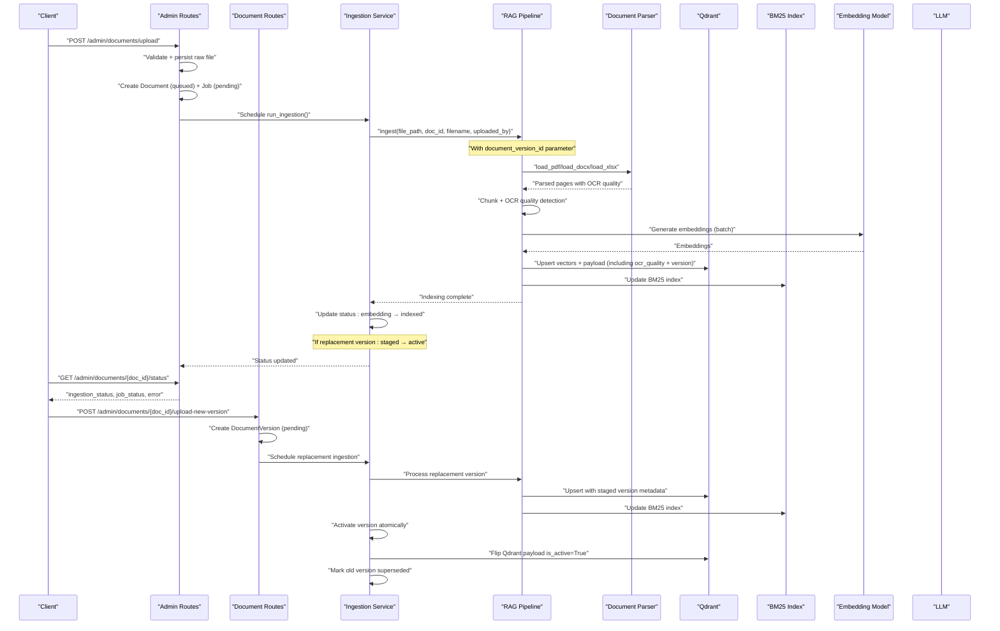

**Diagram sources**
- [admin_routes.py:63-114](file://safe4ai-pilot/app/api/admin_routes.py#L63-L114)
- [document_routes.py:640-774](file://safe4ai-pilot/app/api/document_routes.py#L640-L774)
- [ingestion_service.py:21-113](file://safe4ai-pilot/app/services/ingestion_service.py#L21-L113)
- [rag_pipeline.py:62-150](file://safe4ai-pilot/app/services/rag_pipeline.py#L62-L150)
- [document_parser.py:102-159](file://safe4ai-pilot/app/services/document_parser.py#L102-L159)
- [hybrid_retriever.py:29-41](file://safe4ai-pilot/app/components/hybrid_retriever.py#L29-L41)

**Section sources**
- [architecture.md:36-44](file://safe4ai-pilot/docs/architecture.md#L36-L44)

## Detailed Component Analysis

### Enhanced Ingestion Service with Version Support
**Updated** Enhanced to support DocumentVersion integration and atomic replacement semantics.

Key responsibilities with version awareness:
- Create and manage ingestion jobs with improved status tracking for DocumentVersion objects
- Process specific DocumentVersion targets using document_version_id parameter
- Support atomic document replacement with staged versions and rollback capability
- Coordinate between DocumentVersion lifecycle and Qdrant payload updates
- Manage cleanup of replaced version raw files only after successful activation
- Enhanced error handling with version-specific failure states

Version-aware processing logic:
- Detects target DocumentVersion from document_version_id or job association
- Sets DocumentVersion status to ingesting during processing
- Coordinates activation only for replacement versions (different from active_version_id)
- Handles cleanup of old raw files after successful version switch
- Preserves active version serving during failed replacement attempts

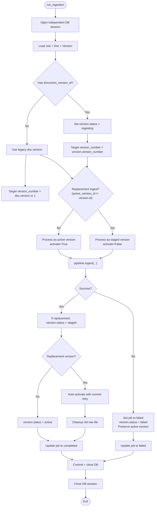

**Diagram sources**
- [ingestion_service.py:100-299](file://safe4ai-pilot/app/services/ingestion_service.py#L100-L299)

**Section sources**
- [ingestion_service.py:21-167](file://safe4ai-pilot/app/services/ingestion_service.py#L21-L167)
- [ingestion_service.py:100-299](file://safe4ai-pilot/app/services/ingestion_service.py#L100-L299)

### Enhanced Status Tracking with DocumentVersion Integration
**Updated** Expanded to support comprehensive DocumentVersion lifecycle management.

The system now implements a comprehensive document lifecycle with five distinct states for DocumentVersion objects:
- **pending**: Initial state when DocumentVersions are created for new versions
- **ingesting**: Active processing state when DocumentVersion ingestion is in progress
- **staged**: Intermediate state after successful processing but before activation
- **active**: Final state when DocumentVersion becomes the serving version
- **failed**: Error state with detailed error information for failed versions
- **superseded**: State for previously active versions after successful replacement

Document lifecycle coordination:
- Document maintains active_version_id, version, and pending_version fields
- DocumentVersion objects track individual version states and metadata
- Atomic switching ensures no retrieval gaps during document replacement
- Rollback window preserves superseded versions for configurable period

**Section sources**
- [models.py (DB):46-54](file://safe4ai-pilot/app/db/models.py#L46-L54)
- [models.py (DB):132-167](file://safe4ai-pilot/app/db/models.py#L132-L167)
- [ingestion_service.py:44-52](file://safe4ai-pilot/app/services/ingestion_service.py#L44-L52)

### Document Parser Service
**Updated** Extracted parsing logic into dedicated service for improved modularity and testability.

The Document Parser service consolidates all document parsing functionality in a single, cohesive module:
- PDF processing with automatic fallback to OCR for low-text pages
- DOCX and XLSX native parsing with specialized handling
- Comprehensive OCR capabilities with confidence scoring
- Garbage text detection to prevent processing of poor OCR output
- Structured page data with quality metadata

Key capabilities:
- PDF parsing with native text extraction and intelligent OCR fallback
- DOCX processing using docx2txt library
- XLSX processing with row-by-row conversion to tabular text
- OCR with structured prompts for both text extraction and quality assessment
- Confidence scoring (high/medium/low) with JSON-based evaluation
- Temporary file management for OCR processing
- Error handling and logging for failed OCR operations

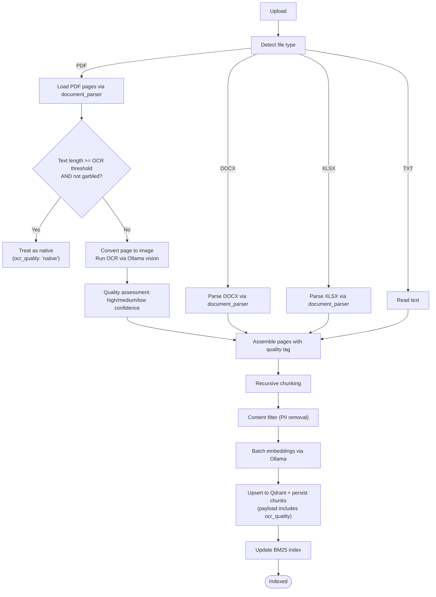

**Diagram sources**
- [document_parser.py:102-159](file://safe4ai-pilot/app/services/document_parser.py#L102-L159)
- [document_parser.py:162-182](file://safe4ai-pilot/app/services/document_parser.py#L162-L182)
- [document_parser.py:41-99](file://safe4ai-pilot/app/services/document_parser.py#L41-L99)

**Section sources**
- [document_parser.py:1-183](file://safe4ai-pilot/app/services/document_parser.py#L1-183)

### RAG Pipeline with Document Parser Integration
**Updated** Refactored to delegate all parsing logic to dedicated document_parser service.

Enhanced responsibilities:
- Delegates file loading and preprocessing to dedicated Document Parser service
- Maintains chunking with overlap, batch embedding generation, and vector upsert with quality metadata
- Persists chunk metadata including OCR quality indicators and updates BM25 index
- Supports query-time retrieval, reranking, and answer synthesis

Processing logic highlights:
- File loading: Delegates to document_parser.load_pdf, load_docx, load_xlsx functions
- Chunking: recursive character splitting with configurable size and overlap
- Embeddings: batched requests to Ollama embeddings endpoint
- Vector storage: Qdrant upsert with payload metadata including ocr_quality field
- BM25: rebuild index from chunk IDs and payloads for sparse retrieval
- Query: hybrid retrieval + reranking; minimum rerank score threshold determines fallback

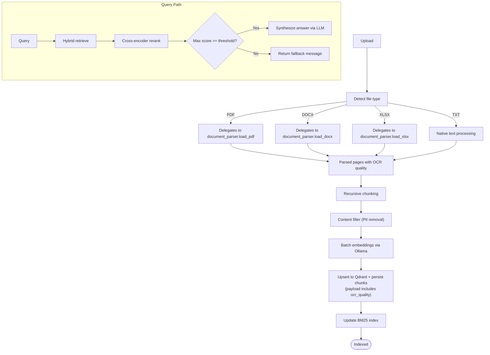

**Diagram sources**
- [rag_pipeline.py:77-100](file://safe4ai-pilot/app/services/rag_pipeline.py#L77-L100)
- [rag_pipeline.py:323-340](file://safe4ai-pilot/app/services/rag_pipeline.py#L323-L340)
- [hybrid_retriever.py:56-142](file://safe4ai-pilot/app/components/hybrid_retriever.py#L56-L142)
- [reranker.py:15-35](file://safe4ai-pilot/app/components/reranker.py#L15-L35)

**Section sources**
- [rag_pipeline.py:34-345](file://safe4ai-pilot/app/services/rag_pipeline.py#L34-L345)

### Enhanced OCR Quality Detection
The system now implements sophisticated OCR quality assessment:
- Confidence scoring: high, medium, or low confidence levels based on AI evaluation
- Quality prompts: separate prompts for text extraction and confidence assessment
- JSON-based confidence evaluation: structured confidence scoring with reasoning
- Low-confidence tracking: counts and tracks pages with low OCR confidence
- Payload preservation: ocr_quality field stored in Qdrant for later analysis
- Graceful degradation: continues processing even with low-confidence OCR results

Quality assessment logic:
- Extract text using vision model with structured prompt
- Evaluate confidence separately with quality prompt
- Handle JSON parsing errors gracefully with default "low" confidence
- Track low-confidence pages for monitoring and analysis

**Section sources**
- [rag_pipeline.py:270-330](file://safe4ai-pilot/app/services/rag_pipeline.py#L270-L330)
- [rag_pipeline.py:351-393](file://safe4ai-pilot/app/services/rag_pipeline.py#L351-L393)

### Job Recovery Mechanism
Enhanced job recovery system:
- Stuck job detection: Jobs remaining in embedding state beyond 10-minute threshold
- Pending job timeout: Jobs stuck in pending state beyond threshold moved to failed
- Automatic recovery: Reset stuck embedding jobs back to queued state
- Timeout error handling: Clear error messages for pending job timeouts
- Transaction safety: Proper commit/rollback handling during recovery

Recovery thresholds:
- STUCK_THRESHOLD_MINUTES: 10-minute cutoff for job recovery
- PENDING_JOB_TIMEOUT_ERROR: Standardized error message for timed-out pending jobs

**Section sources**
- [ingestion_service.py:118-167](file://safe4ai-pilot/app/services/ingestion_service.py#L118-L167)

### Hybrid Retriever
Capabilities:
- Dense retrieval: queries Qdrant with vector similarity.
- Sparse retrieval: BM25 over chunk contents; supports filtering by document IDs.
- Fusion: reciprocal rank fusion (RRF) to combine dense and sparse ranks.
- Payload propagation: carries document metadata alongside results.

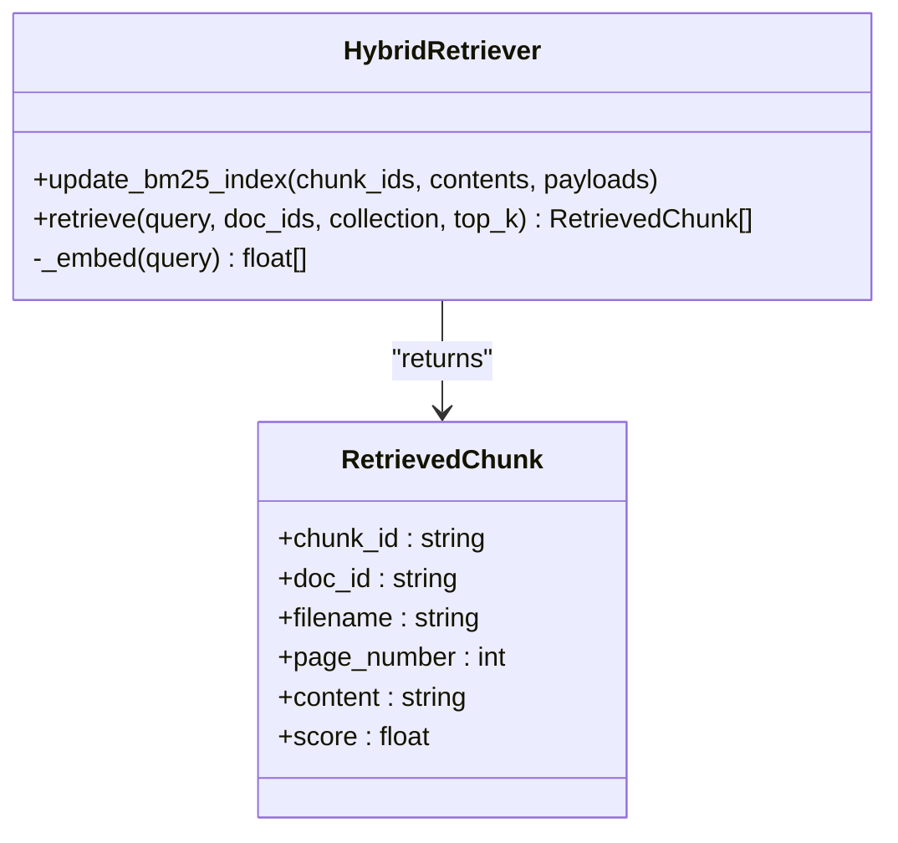

**Diagram sources**
- [hybrid_retriever.py:13-143](file://safe4ai-pilot/app/components/hybrid_retriever.py#L13-L143)
- [models.py:13-20](file://safe4ai-pilot/app/models.py#L13-L20)

**Section sources**
- [hybrid_retriever.py:13-143](file://safe4ai-pilot/app/components/hybrid_retriever.py#L13-L143)

### Reranker
Capabilities:
- Cross-encoder model to produce contextual relevance scores.
- Returns top-N ranked chunks with rerank scores.

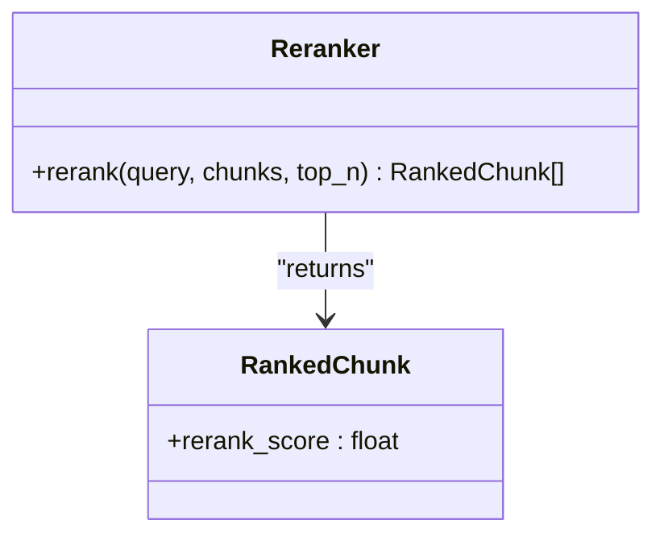

**Diagram sources**
- [reranker.py:11-36](file://safe4ai-pilot/app/components/reranker.py#L11-L36)
- [models.py:22-28](file://safe4ai-pilot/app/models.py#L22-L28)

**Section sources**
- [reranker.py:11-36](file://safe4ai-pilot/app/components/reranker.py#L11-L36)

### Semantic Cache
Capabilities:
- Embeds incoming queries and compares to stored embeddings using pgvector's `<=>` operator.
- Stores responses, citations, and source document/chunk IDs.
- Invalidates cache entries by document ID.

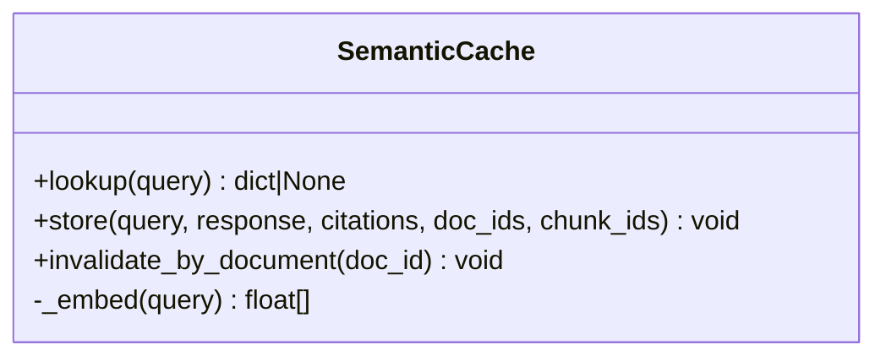

**Diagram sources**
- [semantic_cache.py:14-104](file://safe4ai-pilot/app/services/semantic_cache.py#L14-L104)

**Section sources**
- [semantic_cache.py:14-104](file://safe4ai-pilot/app/services/semantic_cache.py#L14-L104)

### Upload Validation
Capabilities:
- Validates file extension, declared Content-Type, magic bytes, and size.
- Generates a safe storage filename.

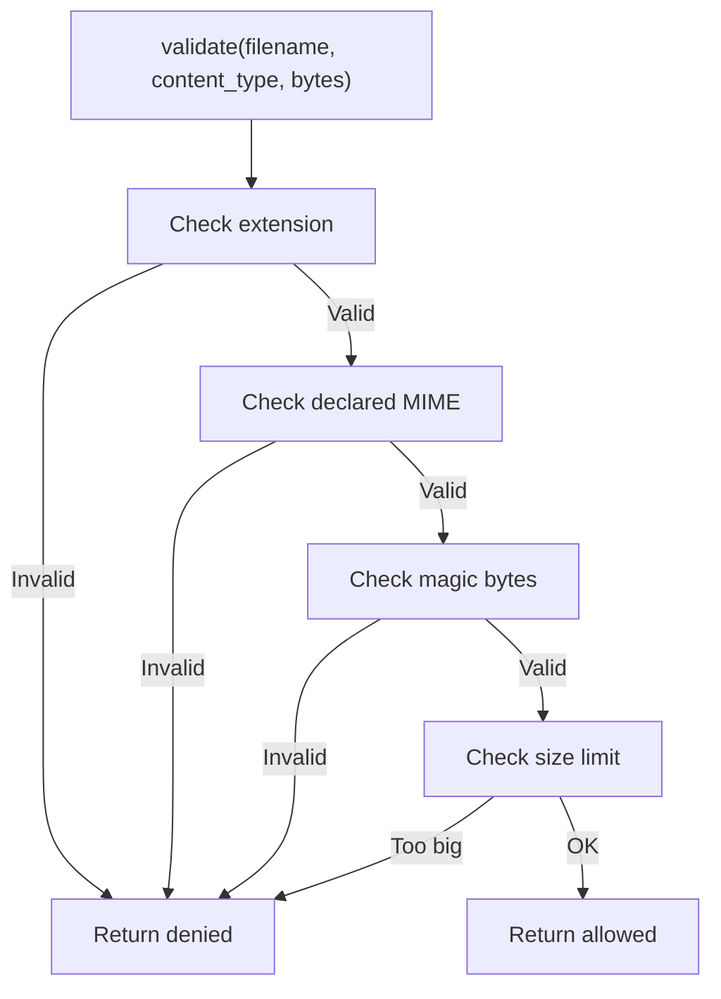

**Diagram sources**
- [upload_validator.py:24-73](file://safe4ai-pilot/app/security/upload_validator.py#L24-L73)

**Section sources**
- [upload_validator.py:24-73](file://safe4ai-pilot/app/security/upload_validator.py#L24-L73)

### API: Upload and Status
**Updated** Enhanced with version management capabilities.

Endpoints:
- Upload document with validation and background ingestion scheduling with proper status initialization.
- List documents and poll ingestion status with enhanced state information.
- **New**: Upload new version of existing document with atomic replacement semantics.
- **New**: Verify document deletion with comprehensive cleanup verification.
- Re-index existing documents with proper state management.
- Delete documents (filesystem, Qdrant, DB, and semantic cache cleanup) with active job prevention.

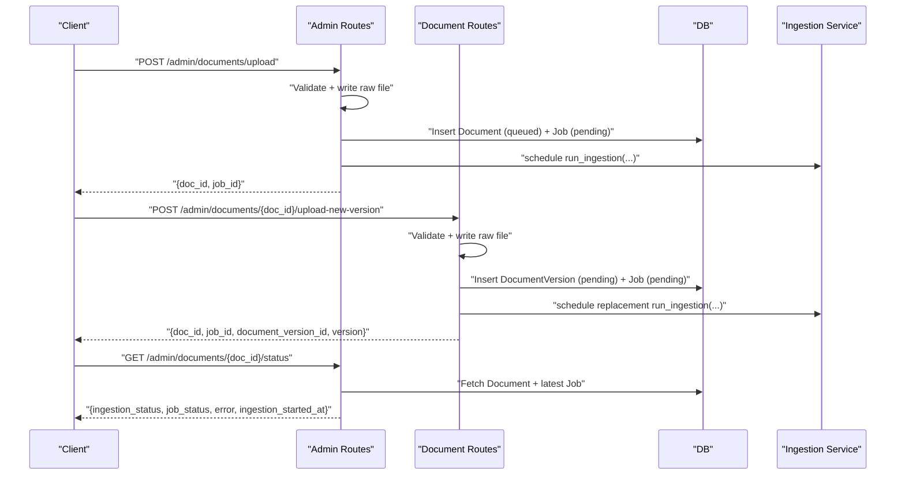

**Diagram sources**
- [admin_routes.py:63-175](file://safe4ai-pilot/app/api/admin_routes.py#L63-L175)
- [document_routes.py:640-774](file://safe4ai-pilot/app/api/document_routes.py#L640-L774)

**Section sources**
- [admin_routes.py:63-243](file://safe4ai-pilot/app/api/admin_routes.py#L63-L243)
- [document_routes.py:640-774](file://safe4ai-pilot/app/api/document_routes.py#L640-L774)

### LangGraph Pipeline (Agent Orchestrator)
The agent orchestrates retrieval, grading, decomposition, generation, and quality gating with safety checks and self-correction loops.

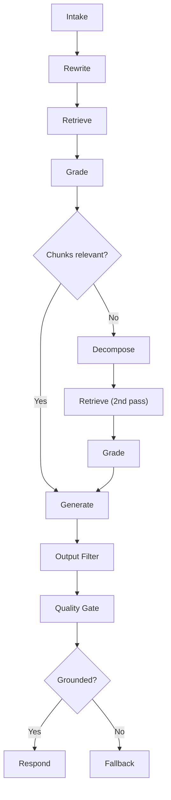

**Diagram sources**
- [graph.py:39-342](file://safe4ai-pilot/app/agents/graph.py#L39-L342)

**Section sources**
- [graph.py:39-342](file://safe4ai-pilot/app/agents/graph.py#L39-L342)

## Version Management System
**New Section** Comprehensive version management system for atomic document replacement.

### DocumentVersion Lifecycle
The system implements a complete DocumentVersion lifecycle with atomic switching semantics:
- **Creation**: New versions created as DocumentVersion objects with pending status
- **Processing**: Staged ingestion with document_version_id targeting specific version
- **Activation**: Atomic switch from old to new version with Qdrant payload updates
- **Supersession**: Previous version marked as superseded with rollback window
- **Cleanup**: Old raw files and superseded content removed after successful activation

### Atomic Switching Semantics
The activation process ensures no retrieval gaps:
1. Set new version status to activating
2. Update Qdrant payload to mark new version as active
3. Update old version status to superseded
4. Commit database changes
5. Update document metadata to point to new active version

### Rollback Window
Superseded versions remain accessible for configurable period:
- Qdrant points tagged with is_active=False and superseded_at timestamp
- Database chunk rows cleaned up after rollback window expires
- Cleanup job removes superseded content older than configured threshold

### Version Activation Retry Logic
Enhanced error handling for activation failures:
- Commit failures retried once with idempotent activation
- Automatic rollback to previous version if activation fails
- Detailed error tracking for failed version attempts

**Section sources**
- [document_service.py:85-240](file://safe4ai-pilot/app/services/document_service.py#L85-L240)
- [test_document_versioning.py:76-274](file://safe4ai-pilot/tests/test_document_versioning.py#L76-L274)

## Dependency Analysis
- Configuration-driven components: all major services depend on settings for model names, endpoints, and thresholds.
- Qdrant and Ollama are external dependencies for vector storage and embeddings/LLM.
- DB models define document lifecycle and chunk metadata used across ingestion and retrieval.
- Upload validator ensures only allowed files enter the pipeline.
- Document Parser service provides centralized parsing functionality for all document types.
- **New**: DocumentService manages DocumentVersion lifecycle and atomic switching.
- **New**: Startup migrations handle DocumentVersion table creation and schema evolution.

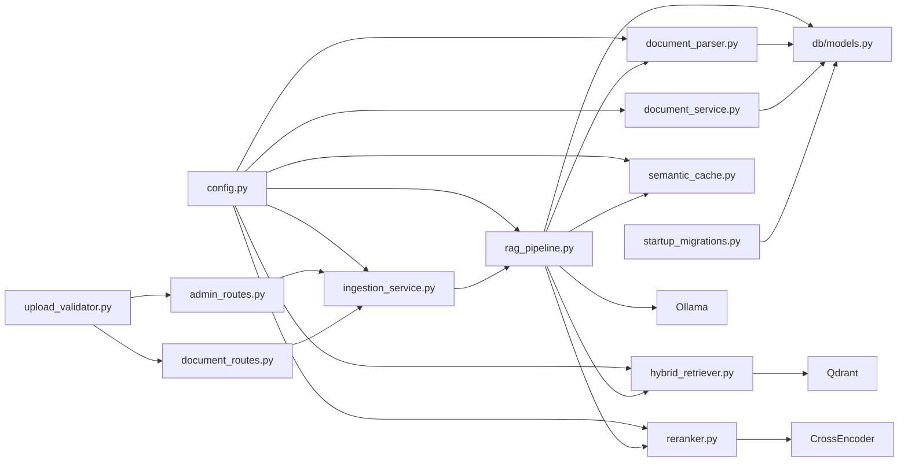

**Diagram sources**
- [config.py:5-28](file://safe4ai-pilot/app/config.py#L5-L28)
- [ingestion_service.py:46-62](file://safe4ai-pilot/app/services/ingestion_service.py#L46-L62)
- [rag_pipeline.py:35-56](file://safe4ai-pilot/app/services/rag_pipeline.py#L35-L56)
- [document_parser.py:1-20](file://safe4ai-pilot/app/services/document_parser.py#L1-L20)
- [hybrid_retriever.py:14-24](file://safe4ai-pilot/app/components/hybrid_retriever.py#L14-L24)
- [reranker.py:12-13](file://safe4ai-pilot/app/components/reranker.py#L12-L13)
- [semantic_cache.py:15-25](file://safe4ai-pilot/app/services/semantic_cache.py#L15-L25)
- [upload_validator.py:24-73](file://safe4ai-pilot/app/security/upload_validator.py#L24-L73)
- [admin_routes.py:63-114](file://safe4ai-pilot/app/api/admin_routes.py#L63-L114)
- [document_routes.py:640-774](file://safe4ai-pilot/app/api/document_routes.py#L640-L774)
- [document_service.py:85-131](file://safe4ai-pilot/app/services/document_service.py#L85-L131)
- [models.py (DB):68-175](file://safe4ai-pilot/app/db/models.py#L68-L175)
- [startup_migrations.py:64-95](file://safe4ai-pilot/app/startup_migrations.py#L64-L95)

**Section sources**
- [config.py:5-28](file://safe4ai-pilot/app/config.py#L5-L28)
- [models.py (DB):68-175](file://safe4ai-pilot/app/db/models.py#L68-L175)

## Performance Considerations
- Embedding batching: the pipeline batches embedding requests to reduce overhead.
- Chunk sizing and overlap: tuned to balance recall and context coherence.
- Enhanced OCR quality gating: reduces downstream noise by delegating parsing to dedicated service and tracking quality metrics.
- Hybrid retrieval with RRF: balances lexical matching and semantic similarity.
- Semantic cache: leverages pgvector for efficient nearest-neighbor lookup on repeated queries.
- Concurrency: background ingestion tasks prevent blocking the API.
- Transaction isolation: independent database sessions prevent request conflicts.
- Modular design: dedicated parsing service improves testability and allows for independent optimization.
- **New**: Version activation batching: multiple versions can be processed concurrently with proper locking.
- **New**: Atomic switching minimizes downtime during document replacement.
- **New**: Rollback window optimization: configurable cleanup intervals balance storage vs. rollback requirements.

## Troubleshooting Guide
Common issues and remedies:
- Ingestion stuck: the service recovers jobs older than 10 minutes and resets them to queued or failed states with proper error messages.
- OCR failures: PDF pages without sufficient text fall back to OCR with confidence scoring; failures are handled gracefully and low-confidence pages are tracked for monitoring.
- Embedding errors: exceptions during embedding or reranking lead to job failure with error details persisted and proper rollback handling.
- Qdrant deletion failures: deletion attempts log warnings and continue to avoid blocking.
- Upload validation failures: ensure file extension, MIME type, and size meet allowed criteria.
- Status tracking issues: monitor queued → embedding → indexed state transitions for proper processing flow.
- Parsing service issues: dedicated document parser service can be tested independently for parsing failures.
- **New**: Version activation failures: retry logic handles transient commit failures during atomic switching.
- **New**: Superseded version cleanup: verify cleanup jobs running and rollback window configured appropriately.
- **New**: Document replacement conflicts: ensure no concurrent ingestion jobs during replacement process.

Operational checks:
- Poll ingestion status via the status endpoint to monitor state transitions.
- Inspect audit logs for latency and model usage.
- Monitor semantic cache hit rate and total hits.
- Track OCR quality metrics and low-confidence page counts.
- Monitor job recovery statistics for system health.
- Test document parser service independently for parsing functionality.
- **New**: Verify DocumentVersion status transitions during replacement.
- **New**: Monitor rollback window for superseded content cleanup.
- **New**: Test atomic switching behavior with version activation retries.

**Section sources**
- [ingestion_service.py:90-113](file://safe4ai-pilot/app/services/ingestion_service.py#L90-L113)
- [rag_pipeline.py:291-294](file://safe4ai-pilot/app/services/rag_pipeline.py#L291-L294)
- [admin_routes.py:261-277](file://safe4ai-pilot/app/api/admin_routes.py#L261-L277)
- [document_service.py:54-131](file://safe4ai-pilot/app/services/document_service.py#L54-L131)

## Conclusion
The system integrates robust ingestion, hybrid retrieval, and reranking to deliver accurate, contextual answers from uploaded documents with comprehensive version management capabilities. Enhanced error handling, transaction management, and status tracking provide reliable operation with clear visibility into document processing states. The extraction of parsing logic into a dedicated Document Parser service significantly improves modularity, testability, and maintainability. The addition of OCR quality detection improves processing reliability by identifying and tracking low-quality OCR results. The new DocumentVersion integration enables atomic document replacement without retrieval gaps, providing seamless updates and comprehensive rollback capabilities. With semantic caching, careful error handling, comprehensive monitoring, and modular design, it provides reliable performance and observability for production deployments with advanced version management features.

## Appendices

### Configuration Reference
- Postgres URL, Qdrant URL, Ollama URL/model, embedding model, allowed origins, retention policies, cache threshold, and upload size limits are centralized in settings.

**Section sources**
- [config.py:5-28](file://safe4ai-pilot/app/config.py#L5-L28)

### Indexing and Batch Strategy
- Chunking: configurable size and overlap for balanced recall and context.
- Embedding: batched requests to Ollama to optimize throughput.
- Upsert: Qdrant upsert with payload metadata including OCR quality indicators for retrieval and citations.
- BM25: rebuilt from chunk IDs and payloads for sparse retrieval.
- OCR quality tracking: low-confidence pages are monitored and can be identified via ocr_quality payload field.
- **New**: Version-aware upsert: DocumentVersion metadata included in Qdrant payloads for version tracking.

**Section sources**
- [rag_pipeline.py:25-27](file://safe4ai-pilot/app/services/rag_pipeline.py#L25-L27)
- [rag_pipeline.py:109-125](file://safe4ai-pilot/app/services/rag_pipeline.py#L109-L125)
- [rag_pipeline.py:146-149](file://safe4ai-pilot/app/services/rag_pipeline.py#L146-L149)
- [hybrid_retriever.py:29-41](file://safe4ai-pilot/app/components/hybrid_retriever.py#L29-L41)

### Practical Examples
- Configure document processing workflows:
  - Adjust chunk size and overlap in the pipeline constants.
  - Tune OCR threshold and confidence ratio for scanned documents.
  - Test document parser service independently for parsing functionality.
- Customize OCR settings:
  - Modify OCR threshold and quality gate logic in the pipeline.
  - Monitor OCR quality metrics and adjust confidence thresholds.
  - Ensure Ollama vision model availability and timeouts are appropriate.
- Optimize retrieval performance:
  - Increase top_k for hybrid retrieval to capture more candidates.
  - Adjust reranker top_n and minimum rerank score threshold.
  - Use semantic cache threshold to balance freshness and reuse.
- Monitor system health:
  - Track job recovery statistics for stuck job detection.
  - Monitor OCR quality distribution and low-confidence page rates.
  - Observe status transition patterns for processing reliability.
  - Test parsing service independently for performance optimization.
- **New**: Configure version management:
  - Set rollback window for superseded content cleanup.
  - Monitor DocumentVersion status transitions during replacement.
  - Test atomic switching behavior under various failure scenarios.
  - Verify cleanup procedures for old raw files and superseded content.

**Section sources**
- [rag_pipeline.py:25-31](file://safe4ai-pilot/app/services/rag_pipeline.py#L25-L31)
- [rag_pipeline.py:151-181](file://safe4ai-pilot/app/services/rag_pipeline.py#L151-L181)
- [semantic_cache.py:20-25](file://safe4ai-pilot/app/services/semantic_cache.py#L20-L25)
- [document_service.py:133-176](file://safe4ai-pilot/app/services/document_service.py#L133-L176)

### Monitoring and Observability
- Track ingestion job status and errors with enhanced state tracking.
- Export audit logs and analyze latency and model usage.
- Monitor semantic cache hit rate and total hits.
- Track OCR quality metrics and low-confidence page distributions.
- Monitor job recovery statistics and system health indicators.
- Monitor document parser service performance and error rates.
- **New**: Track DocumentVersion lifecycle events and activation success rates.
- **New**: Monitor rollback window effectiveness and cleanup job performance.
- **New**: Verify atomic switching behavior and error recovery mechanisms.

**Section sources**
- [admin_routes.py:151-175](file://safe4ai-pilot/app/api/admin_routes.py#L151-L175)
- [admin_routes.py:382-418](file://safe4ai-pilot/app/api/admin_routes.py#L382-L418)
- [models.py (DB):111-124](file://safe4ai-pilot/app/db/models.py#L111-L124)
- [document_service.py:178-240](file://safe4ai-pilot/app/services/document_service.py#L178-L240)

### Database Schema Evolution
**New Section** DocumentVersion table schema and migration support.

The system includes comprehensive database schema support for version management:
- DocumentVersion table with unique constraints on (document_id, version_number)
- Foreign key relationships linking versions to documents and ingestion jobs
- Timestamp fields for tracking version lifecycle events
- Status tracking with comprehensive state enumeration
- Migration support for backward compatibility

**Section sources**
- [models.py (DB):132-167](file://safe4ai-pilot/app/db/models.py#L132-L167)
- [startup_migrations.py:64-95](file://safe4ai-pilot/app/startup_migrations.py#L64-L95)