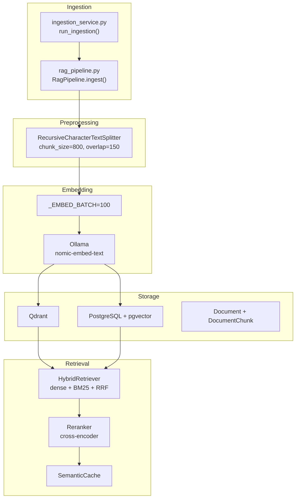
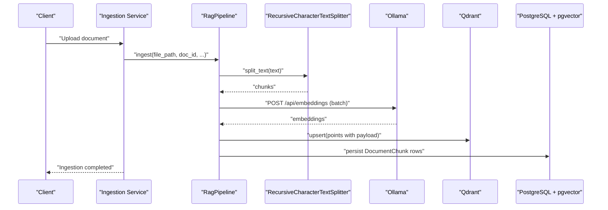
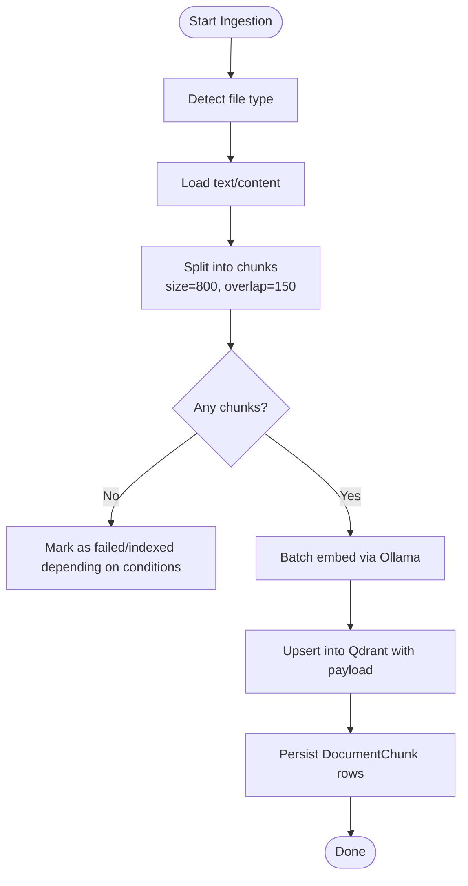
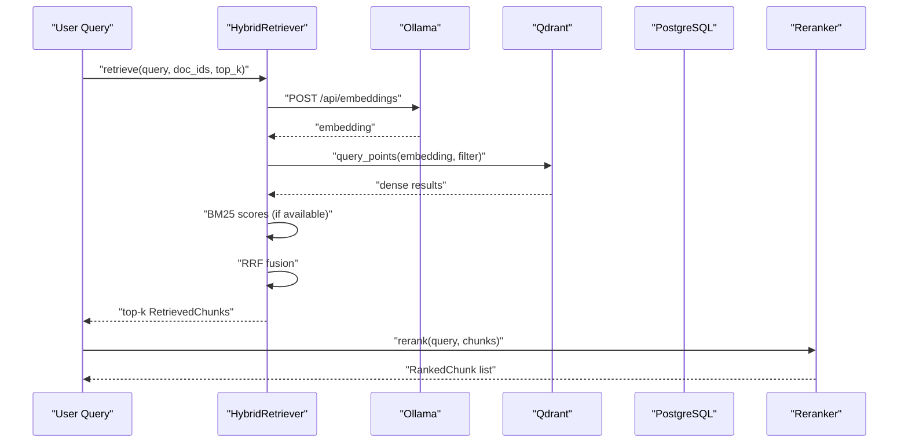
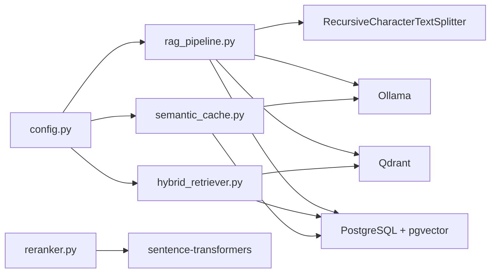

# Embedding Generation

<cite>
**Referenced Files in This Document**
- [ingestion_service.py](file://safe4ai-pilot/app/services/ingestion_service.py)
- [rag_pipeline.py](file://safe4ai-pilot/app/services/rag_pipeline.py)
- [hybrid_retriever.py](file://safe4ai-pilot/app/components/hybrid_retriever.py)
- [reranker.py](file://safe4ai-pilot/app/components/reranker.py)
- [semantic_cache.py](file://safe4ai-pilot/app/services/semantic_cache.py)
- [models.py](file://safe4ai-pilot/app/models.py)
- [config.py](file://safe4ai-pilot/app/config.py)
- [db/models.py](file://safe4ai-pilot/app/db/models.py)
- [pyproject.toml](file://safe4ai-pilot/pyproject.toml)
- [docker-compose.yml](file://safe4ai-pilot/docker-compose.yml)
- [docs/architecture.md](file://safe4ai-pilot/docs/architecture.md)
- [docs/deployment.md](file://safe4ai-pilot/docs/deployment.md)
- [tests/test_rag_pipeline.py](file://safe4ai-pilot/tests/test_rag_pipeline.py)
- [tests/test_hybrid_retriever.py](file://safe4ai-pilot/tests/test_hybrid_retriever.py)
- [tests/test_semantic_cache.py](file://safe4ai-pilot/tests/test_semantic_cache.py)
</cite>

## Table of Contents
1. [Introduction](#introduction)
2. [Project Structure](#project-structure)
3. [Core Components](#core-components)
4. [Architecture Overview](#architecture-overview)
5. [Detailed Component Analysis](#detailed-component-analysis)
6. [Dependency Analysis](#dependency-analysis)
7. [Performance Considerations](#performance-considerations)
8. [Troubleshooting Guide](#troubleshooting-guide)
9. [Conclusion](#conclusion)
10. [Appendices](#appendices)

## Introduction
This document explains the embedding generation system that converts document text into vector representations for retrieval-augmented generation (RAG). It covers the Nomic Embed Text model integration via Ollama, embedding dimension configuration, chunking and overlap strategies, batch processing, storage and retrieval mechanisms, and practical customization tips for large documents and performance optimization. It also documents semantic caching, memory management, and model selection criteria.

## Project Structure
The embedding pipeline spans ingestion orchestration, text preprocessing and chunking, local embedding generation via Ollama, and vector storage/retrieval with Qdrant and PostgreSQL/pgvector. Supporting components include a hybrid retriever combining dense vectors and sparse BM25, a cross-encoder reranker, and a semantic cache for query reuse.

**Diagram sources**
- [ingestion_service.py:21-88](file://safe4ai-pilot/app/services/ingestion_service.py#L21-L88)
- [rag_pipeline.py:62-150](file://safe4ai-pilot/app/services/rag_pipeline.py#L62-L150)
- [hybrid_retriever.py:14-145](file://safe4ai-pilot/app/components/hybrid_retriever.py#L14-L145)
- [reranker.py:11-36](file://safe4ai-pilot/app/components/reranker.py#L11-L36)
- [semantic_cache.py:14-104](file://safe4ai-pilot/app/services/semantic_cache.py#L14-L104)
- [db/models.py:75-102](file://safe4ai-pilot/app/db/models.py#L75-L102)

**Section sources**
- [ingestion_service.py:21-88](file://safe4ai-pilot/app/services/ingestion_service.py#L21-L88)
- [rag_pipeline.py:25-31](file://safe4ai-pilot/app/services/rag_pipeline.py#L25-L31)
- [config.py:12](file://safe4ai-pilot/app/config.py#L12)

## Core Components
- Embedding model and runtime: Nomic Embed Text served locally via Ollama, configured in settings and used by both the ingestion pipeline and hybrid retriever.
- Chunking and overlap: Recursive character splitting with fixed chunk size and overlap for balanced recall and context continuity.
- Batch processing: Embeddings are generated in batches to reduce overhead and improve throughput.
- Storage: Vectors stored in Qdrant; document chunk metadata persisted in PostgreSQL with pgvector for semantic cache.
- Retrieval: Hybrid dense vectors and sparse BM25 scoring fused via Reciprocal Rank Fusion (RRF); cross-encoder reranking improves relevance.
- Caching: Semantic cache stores query embeddings and responses to avoid recomputation for similar queries.

**Section sources**
- [config.py:12](file://safe4ai-pilot/app/config.py#L12)
- [rag_pipeline.py:25-31](file://safe4ai-pilot/app/services/rag_pipeline.py#L25-L31)
- [rag_pipeline.py:187-201](file://safe4ai-pilot/app/services/rag_pipeline.py#L187-L201)
- [db/models.py:104-116](file://safe4ai-pilot/app/db/models.py#L104-L116)
- [hybrid_retriever.py:43-55](file://safe4ai-pilot/app/components/hybrid_retriever.py#L43-L55)
- [reranker.py:8](file://safe4ai-pilot/app/components/reranker.py#L8)

## Architecture Overview
The embedding generation system integrates Ollama for local inference, Qdrant for dense vector storage, and PostgreSQL/pgvector for structured metadata and semantic cache. The ingestion pipeline orchestrates document loading, chunking, embedding, and upsert into Qdrant and DB. Retrieval combines dense and sparse signals with reranking and optional semantic cache hits.

**Diagram sources**
- [ingestion_service.py:46-64](file://safe4ai-pilot/app/services/ingestion_service.py#L46-L64)
- [rag_pipeline.py:62-150](file://safe4ai-pilot/app/services/rag_pipeline.py#L62-L150)
- [rag_pipeline.py:187-201](file://safe4ai-pilot/app/services/rag_pipeline.py#L187-L201)

## Detailed Component Analysis

### Embedding Model Integration (Nomic Embed Text via Ollama)
- Model selection: The embedding model is configured centrally and passed to both the ingestion pipeline and hybrid retriever.
- Local inference: Embeddings are requested via Ollama’s embeddings endpoint; the system validates the response shape and converts to float arrays.
- Dimensionality: The semantic cache table defines a vector column with a fixed dimension, indicating the embedding dimension used in production.

Key configuration and usage:
- Model name and URL are provided by settings.
- Embedding requests specify the model and prompt text.
- Responses are validated to ensure a numeric list is returned.

**Section sources**
- [config.py:12](file://safe4ai-pilot/app/config.py#L12)
- [hybrid_retriever.py:43-55](file://safe4ai-pilot/app/components/hybrid_retriever.py#L43-L55)
- [rag_pipeline.py:187-201](file://safe4ai-pilot/app/services/rag_pipeline.py#L187-L201)
- [semantic_cache.py:27-39](file://safe4ai-pilot/app/services/semantic_cache.py#L27-L39)
- [db/models.py:108](file://safe4ai-pilot/app/db/models.py#L108)

### Embedding Dimension Configuration
- The semantic cache table uses a Vector type with a fixed dimension, confirming the embedding dimension used in the system.
- This dimension is compatible with the selected embedding model and must align with downstream similarity computations.

Practical implication:
- Changing the embedding model requires updating the Vector dimension in the database schema and ensuring all downstream components expect the new dimension.

**Section sources**
- [db/models.py:108](file://safe4ai-pilot/app/db/models.py#L108)

### Batch Processing Capabilities
- Batch size: The ingestion pipeline embeds texts in batches of a fixed size.
- Asynchronous client: Uses an async HTTP client to send batch requests to Ollama, improving throughput.
- Timeout handling: Requests include timeouts to prevent stalls during embedding generation.

Optimization opportunities:
- Tune batch size based on GPU/VRAM availability and latency targets.
- Add retries with exponential backoff for transient failures.

**Section sources**
- [rag_pipeline.py:27](file://safe4ai-pilot/app/services/rag_pipeline.py#L27)
- [rag_pipeline.py:187-201](file://safe4ai-pilot/app/services/rag_pipeline.py#L187-L201)

### Text Preprocessing Pipeline: Chunking, Overlap, and Metadata Preservation
- Chunking strategy: Recursive character splitting with configurable size and overlap to balance context and manageability.
- Metadata preservation: Each chunk payload includes document ID, filename, page number, chunk index, content preview, and OCR quality indicator.
- OCR fallback: For low-text PDF pages, the system performs vision OCR via a local model and records confidence.

**Diagram sources**
- [rag_pipeline.py:62-150](file://safe4ai-pilot/app/services/rag_pipeline.py#L62-L150)
- [rag_pipeline.py:25-31](file://safe4ai-pilot/app/services/rag_pipeline.py#L25-L31)

**Section sources**
- [rag_pipeline.py:85-125](file://safe4ai-pilot/app/services/rag_pipeline.py#L85-L125)
- [rag_pipeline.py:265-295](file://safe4ai-pilot/app/services/rag_pipeline.py#L265-L295)

### Embedding Storage and Retrieval Mechanisms
- Vector storage: Qdrant receives PointStruct entries with vector and payload; retrieval uses vector similarity with optional filters.
- Metadata retrieval: Payload fields are used to reconstruct chunk metadata for citations and provenance.
- Hybrid retrieval: Dense vectors are combined with sparse BM25 scores using RRF to improve robustness.
- Reranking: Cross-encoder reranks top candidates to refine relevance.

**Diagram sources**
- [hybrid_retriever.py:57-144](file://safe4ai-pilot/app/components/hybrid_retriever.py#L57-L144)
- [reranker.py:15-35](file://safe4ai-pilot/app/components/reranker.py#L15-L35)

**Section sources**
- [hybrid_retriever.py:30-42](file://safe4ai-pilot/app/components/hybrid_retriever.py#L30-L42)
- [hybrid_retriever.py:78-95](file://safe4ai-pilot/app/components/hybrid_retriever.py#L78-L95)
- [reranker.py:15-35](file://safe4ai-pilot/app/components/reranker.py#L15-L35)

### Similarity Calculation and Normalization
- Vector similarity: Qdrant uses inner product or cosine similarity depending on indexing configuration; the semantic cache leverages PostgreSQL’s vector distance operator for nearest-neighbor search.
- Normalization: The system does not explicitly normalize vectors before storage; downstream similarity depends on Qdrant’s configured metric and pgvector’s distance semantics.

Recommendations:
- Normalize vectors at embedding time if using cosine similarity to ensure consistent magnitude effects.
- Align similarity thresholds with the chosen metric and dimension.

**Section sources**
- [semantic_cache.py:45-69](file://safe4ai-pilot/app/services/semantic_cache.py#L45-L69)
- [db/models.py:108](file://safe4ai-pilot/app/db/models.py#L108)

### Practical Examples and Customization

- Customizing embedding parameters:
  - Adjust chunk size and overlap to balance recall and memory usage.
  - Modify batch size to fit GPU/VRAM constraints.
  - Change embedding model by updating the model name in settings and ensuring the model is pulled in the runtime environment.

- Handling large documents:
  - Increase chunk size moderately while keeping overlap sufficient for context continuity.
  - Use OCR fallback for scanned pages to capture text reliably.

- Optimizing embedding performance:
  - Tune batch size and parallelism based on Ollama resource limits.
  - Monitor embedding latency and adjust timeouts accordingly.

- Integration with Ollama:
  - Ensure the embedding model is pulled and available at the configured Ollama URL.
  - Validate that the model responds with a numeric embedding list.

- Embedding caching strategies:
  - Use the semantic cache to store frequent queries and reuse results when similarity exceeds a threshold.
  - Invalidate cache entries when source documents change.

- Memory management for large-scale deployments:
  - Limit batch sizes and top_k to control memory footprint.
  - Use streaming or pagination for very large queries.
  - Scale Qdrant and PostgreSQL independently based on workload.

**Section sources**
- [rag_pipeline.py:25-31](file://safe4ai-pilot/app/services/rag_pipeline.py#L25-L31)
- [rag_pipeline.py:187-201](file://safe4ai-pilot/app/services/rag_pipeline.py#L187-L201)
- [config.py:10-12](file://safe4ai-pilot/app/config.py#L10-L12)
- [semantic_cache.py:41-70](file://safe4ai-pilot/app/services/semantic_cache.py#L41-L70)

### Model Selection Criteria and Quality Assessment
- Model selection: Choose an embedding model aligned with domain and language characteristics; the system defaults to a general-purpose model suitable for many tasks.
- Dimensionality: Ensure the Vector dimension matches the embedding model’s output dimension.
- Quality assessment:
  - Evaluate retrieval effectiveness using held-out benchmarks.
  - Monitor OCR quality for scanned documents and adjust thresholds accordingly.
  - Use reranking to improve precision when baseline recall is adequate.

**Section sources**
- [config.py:12](file://safe4ai-pilot/app/config.py#L12)
- [db/models.py:108](file://safe4ai-pilot/app/db/models.py#L108)
- [rag_pipeline.py:28-31](file://safe4ai-pilot/app/services/rag_pipeline.py#L28-L31)

## Dependency Analysis
The embedding system relies on several libraries and services:
- Ollama for local embedding inference.
- Qdrant for dense vector storage and retrieval.
- PostgreSQL with pgvector for structured metadata and semantic cache.
- Sentence-transformers for reranking.
- LangChain text splitters for chunking.

**Diagram sources**
- [config.py:12](file://safe4ai-pilot/app/config.py#L12)
- [rag_pipeline.py:13](file://safe4ai-pilot/app/services/rag_pipeline.py#L13)
- [pyproject.toml:26-44](file://safe4ai-pilot/pyproject.toml#L26-L44)

**Section sources**
- [pyproject.toml:26-44](file://safe4ai-pilot/pyproject.toml#L26-L44)
- [config.py:12](file://safe4ai-pilot/app/config.py#L12)

## Performance Considerations
- Batch sizing: Larger batches increase throughput but risk memory pressure; tune based on hardware.
- Parallelism: Use asynchronous clients and concurrent workers judiciously.
- Indexing: Configure Qdrant metrics and optimize filters to reduce retrieval latency.
- Caching: Enable semantic cache for repeated queries to reduce embedding and reranking costs.
- Model resources: Ensure sufficient VRAM/RAM for the embedding model; monitor Ollama resource usage.

[No sources needed since this section provides general guidance]

## Troubleshooting Guide
Common issues and remedies:
- Embedding response validation failures: Ensure the Ollama model returns a numeric embedding list; handle malformed responses gracefully.
- Low OCR confidence: Increase OCR threshold or reprocess scanned pages with higher DPI.
- Retrieval performance: Reduce top_k or apply document filters to narrow search space.
- Semantic cache misses: Lower the similarity threshold or expand the cache population window.

**Section sources**
- [hybrid_retriever.py:53-55](file://safe4ai-pilot/app/components/hybrid_retriever.py#L53-L55)
- [semantic_cache.py:37-39](file://safe4ai-pilot/app/services/semantic_cache.py#L37-L39)
- [rag_pipeline.py:28-31](file://safe4ai-pilot/app/services/rag_pipeline.py#L28-L31)

## Conclusion
The embedding generation system integrates local Ollama inference, robust chunking, efficient batching, and hybrid retrieval with reranking. By tuning chunking parameters, batch sizes, and leveraging semantic caching, the system achieves scalable and high-quality retrieval for diverse document types.

[No sources needed since this section summarizes without analyzing specific files]

## Appendices

### Appendix A: Configuration Reference
- Embedding model: Configured in settings and used across ingestion and retrieval.
- Ollama URL and model: Used for embeddings and generation endpoints.
- Semantic cache threshold: Controls reuse of cached responses.

**Section sources**
- [config.py:10-12](file://safe4ai-pilot/app/config.py#L10-L12)
- [config.py:18](file://safe4ai-pilot/app/config.py#L18)

### Appendix B: Runtime Environment Notes
- The system expects the embedding model to be available in the runtime environment.
- Deployment documentation outlines model pulls and resource requirements.

**Section sources**
- [docker-compose.yml](file://safe4ai-pilot/docker-compose.yml#L53)
- [docs/deployment.md:12](file://safe4ai-pilot/docs/deployment.md#L12)
- [docs/architecture.md:41](file://safe4ai-pilot/docs/architecture.md#L41)

### Appendix C: Tests and Validation
- Unit tests validate embedding model usage and batch behavior.
- Test fixtures confirm model availability and expected signatures.

**Section sources**
- [tests/test_rag_pipeline.py:39](file://safe4ai-pilot/tests/test_rag_pipeline.py#L39)
- [tests/test_hybrid_retriever.py:14](file://safe4ai-pilot/tests/test_hybrid_retriever.py#L14)
- [tests/test_semantic_cache.py:15](file://safe4ai-pilot/tests/test_semantic_cache.py#L15)