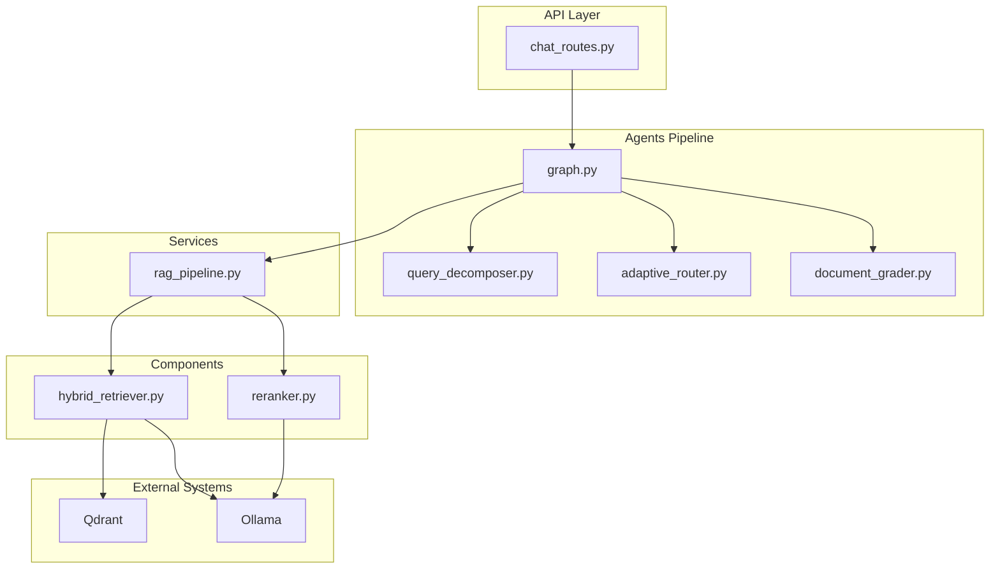
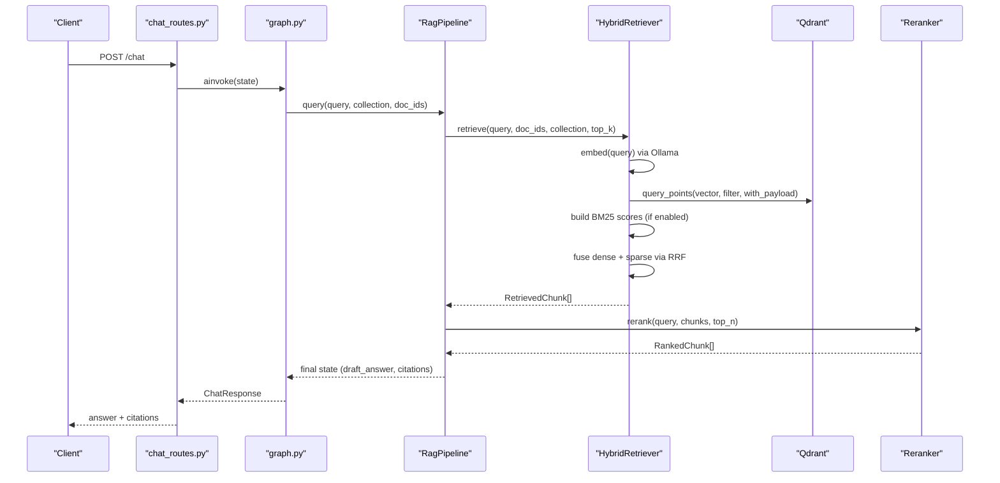
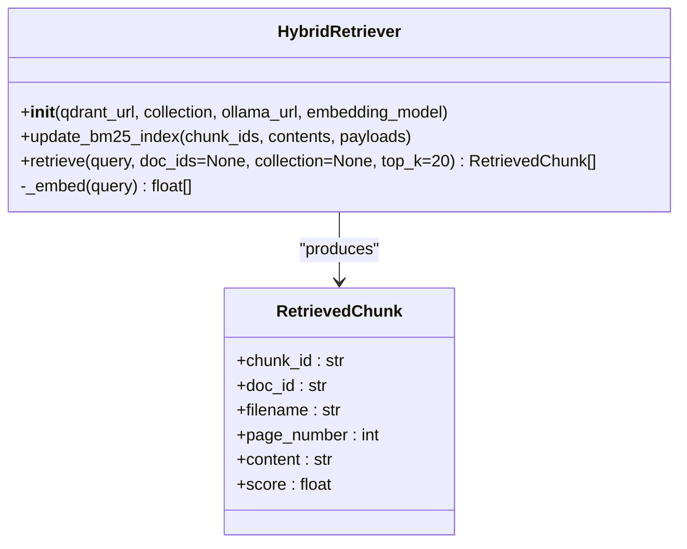
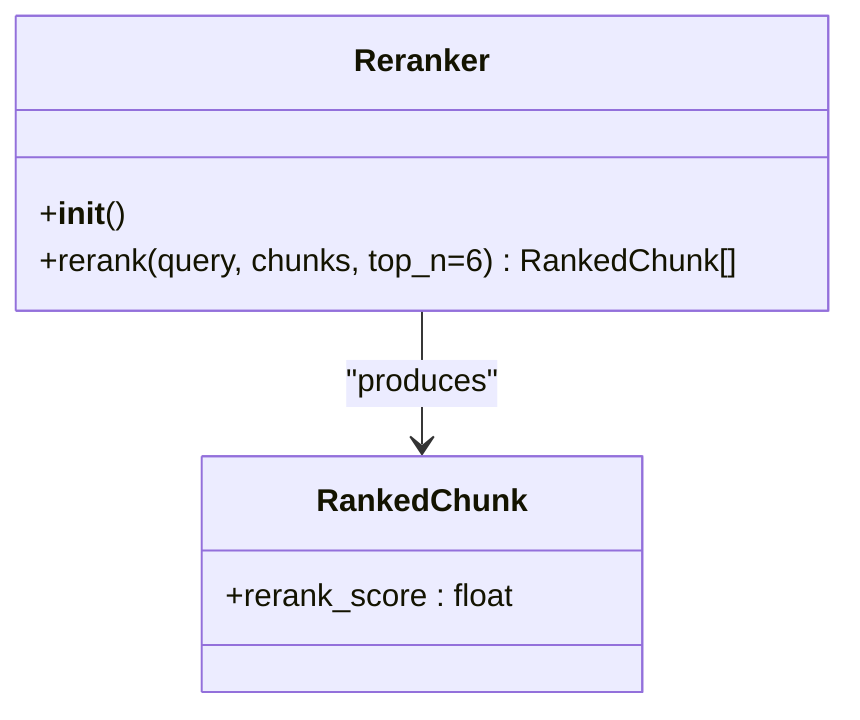
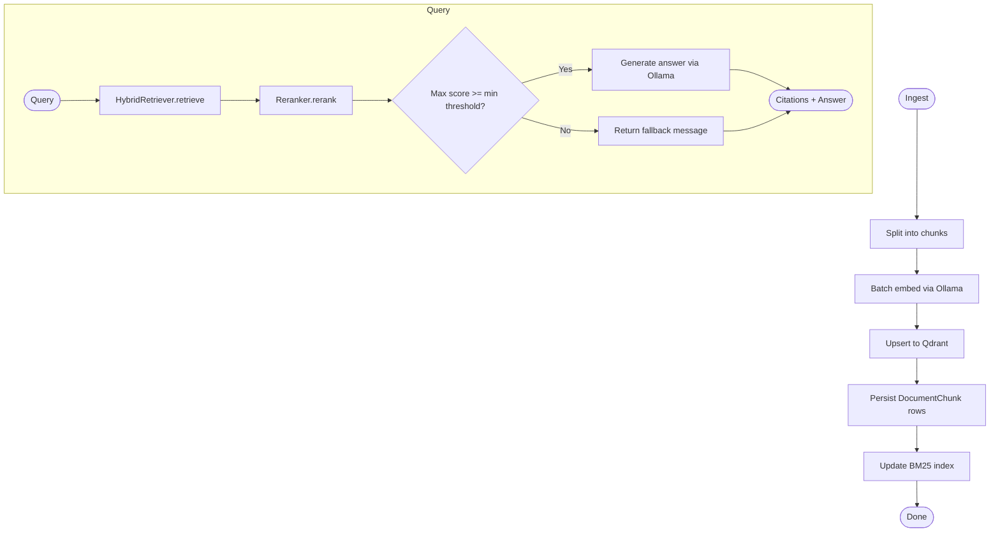
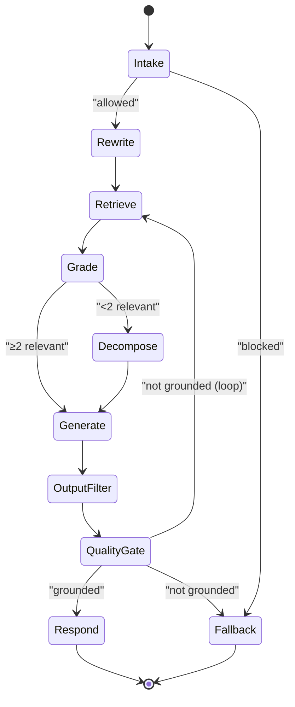
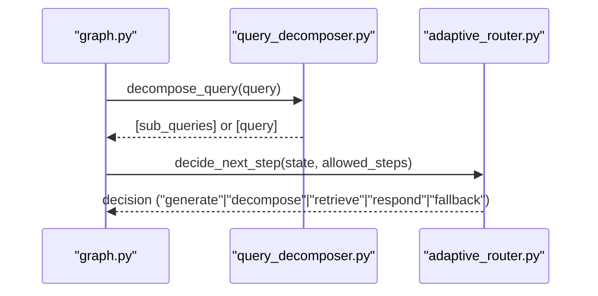
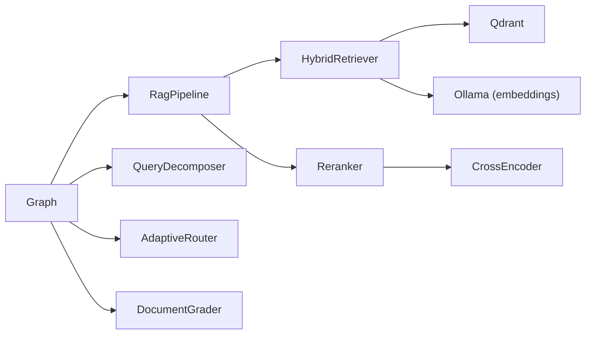

# Hybrid Retrieval System

<cite>
**Referenced Files in This Document**
- [hybrid_retriever.py](file://safe4ai-pilot/app/components/hybrid_retriever.py)
- [reranker.py](file://safe4ai-pilot/app/components/reranker.py)
- [rag_pipeline.py](file://safe4ai-pilot/app/services/rag_pipeline.py)
- [config.py](file://safe4ai-pilot/app/config.py)
- [models.py](file://safe4ai-pilot/app/models.py)
- [graph.py](file://safe4ai-pilot/app/agents/graph.py)
- [query_decomposer.py](file://safe4ai-pilot/app/agents/query_decomposer.py)
- [adaptive_router.py](file://safe4ai-pilot/app/agents/adaptive_router.py)
- [document_grader.py](file://safe4ai-pilot/app/agents/document_grader.py)
- [chat_routes.py](file://safe4ai-pilot/app/api/chat_routes.py)
- [main.py](file://safe4ai-pilot/app/main.py)
- [test_hybrid_retriever.py](file://safe4ai-pilot/tests/test_hybrid_retriever.py)
- [test_reranker.py](file://safe4ai-pilot/tests/test_reranker.py)
</cite>

## Table of Contents
1. [Introduction](#introduction)
2. [Project Structure](#project-structure)
3. [Core Components](#core-components)
4. [Architecture Overview](#architecture-overview)
5. [Detailed Component Analysis](#detailed-component-analysis)
6. [Dependency Analysis](#dependency-analysis)
7. [Performance Considerations](#performance-considerations)
8. [Troubleshooting Guide](#troubleshooting-guide)
9. [Conclusion](#conclusion)
10. [Appendices](#appendices)

## Introduction
This document explains the hybrid retrieval system that combines dense vector embeddings with sparse keyword matching to improve search accuracy. The system:
- Uses dense semantic vectors stored in Qdrant for recall and relevance.
- Augments with sparse BM25 lexical matching for precise phrase coverage.
- Fuses results using Reciprocal Rank Fusion (RRF) to balance both modalities.
- Applies a cross-encoder reranker to refine relevance with contextual scoring.
- Integrates with Ollama for embeddings and generative tasks.
- Supports query rewriting, decomposition, and adaptive routing for robust QA.

## Project Structure
The hybrid retrieval system spans components under the safe4ai-pilot application:
- Components: HybridRetriever (dense + sparse fusion), Reranker (cross-encoder).
- Services: RagPipeline orchestrating ingestion and query flows.
- Agents: Graph-based pipeline with query rewriting, grading, decomposition, generation, and quality gating.
- API: Chat endpoints exposing synchronous and streaming chat experiences.
- Config: Environment-driven settings for services and models.
- Tests: Unit tests validating HybridRetriever and Reranker behavior.

**Diagram sources**
- [chat_routes.py:109-142](file://safe4ai-pilot/app/api/chat_routes.py#L109-L142)
- [graph.py:39-342](file://safe4ai-pilot/app/agents/graph.py#L39-L342)
- [rag_pipeline.py:151-181](file://safe4ai-pilot/app/services/rag_pipeline.py#L151-L181)
- [hybrid_retriever.py:56-142](file://safe4ai-pilot/app/components/hybrid_retriever.py#L56-L142)
- [reranker.py:15-35](file://safe4ai-pilot/app/components/reranker.py#L15-L35)

**Section sources**
- [main.py:43-56](file://safe4ai-pilot/app/main.py#L43-L56)
- [config.py:5-28](file://safe4ai-pilot/app/config.py#L5-L28)

## Core Components
- HybridRetriever: Builds and maintains a sparse BM25 index, embeds queries via Ollama, performs dense vector search in Qdrant, and merges results with RRF.
- Reranker: Uses a cross-encoder to compute contextual relevance scores and returns top-ranked chunks.
- RagPipeline: Coordinates ingestion (chunking, embedding, upsert to Qdrant, BM25 index update) and query processing (retrieve, rerank, answer generation).
- Graph-based pipeline: Orchestrates query rewriting, retrieval, grading, decomposition, generation, and quality gating with adaptive routing.

**Section sources**
- [hybrid_retriever.py:13-142](file://safe4ai-pilot/app/components/hybrid_retriever.py#L13-L142)
- [reranker.py:11-35](file://safe4ai-pilot/app/components/reranker.py#L11-L35)
- [rag_pipeline.py:34-181](file://safe4ai-pilot/app/services/rag_pipeline.py#L34-L181)
- [graph.py:39-342](file://safe4ai-pilot/app/agents/graph.py#L39-L342)

## Architecture Overview
The system integrates three retrieval modalities:
- Dense vectors: Qdrant vector search with optional doc_id filtering.
- Sparse keywords: BM25Okapi index built from chunk contents and payloads.
- Fusion: RRF combining reciprocal ranks from both modalities.
- Re-ranking: Cross-encoder contextual scoring to refine top-k results.

**Diagram sources**
- [chat_routes.py:109-142](file://safe4ai-pilot/app/api/chat_routes.py#L109-L142)
- [graph.py:87-107](file://safe4ai-pilot/app/agents/graph.py#L87-L107)
- [rag_pipeline.py:151-181](file://safe4ai-pilot/app/services/rag_pipeline.py#L151-L181)
- [hybrid_retriever.py:56-142](file://safe4ai-pilot/app/components/hybrid_retriever.py#L56-L142)
- [reranker.py:15-35](file://safe4ai-pilot/app/components/reranker.py#L15-L35)

## Detailed Component Analysis

### HybridRetriever
Implements dual-representation retrieval:
- Dense vector search: Queries Qdrant with an embedding produced by Ollama.
- Sparse BM25: Maintains a tokenized index keyed by chunk IDs; supports doc_id filtering and payload merging.
- Fusion: RRF with a fixed constant k=60 to combine reciprocal ranks from both modalities.
- Payload handling: Merges Qdrant payloads with BM25 payloads when available.

Key behaviors:
- Embedding endpoint: Calls Ollama embeddings API with configured model and query prompt.
- Optional doc_id filter: Restricts Qdrant search to specific documents.
- BM25 rebuild: Accepts chunk IDs, contents, and optional payloads to reconstruct the index.
- Result construction: Produces RetrievedChunk objects enriched with metadata.

**Diagram sources**
- [hybrid_retriever.py:13-142](file://safe4ai-pilot/app/components/hybrid_retriever.py#L13-L142)
- [models.py:13-19](file://safe4ai-pilot/app/models.py#L13-L19)

**Section sources**
- [hybrid_retriever.py:13-142](file://safe4ai-pilot/app/components/hybrid_retriever.py#L13-L142)
- [test_hybrid_retriever.py:56-169](file://safe4ai-pilot/tests/test_hybrid_retriever.py#L56-L169)

### Reranker
Cross-encoder reranking:
- Loads a pre-trained cross-encoder model.
- Generates (query, chunk.content) pairs and predicts relevance scores.
- Returns top-n RankedChunk entries ordered by rerank_score.

**Diagram sources**
- [reranker.py:11-35](file://safe4ai-pilot/app/components/reranker.py#L11-L35)
- [models.py:22-23](file://safe4ai-pilot/app/models.py#L22-L23)

**Section sources**
- [reranker.py:11-35](file://safe4ai-pilot/app/components/reranker.py#L11-L35)
- [test_reranker.py:27-57](file://safe4ai-pilot/tests/test_reranker.py#L27-L57)

### RagPipeline
End-to-end ingestion and query orchestration:
- Ingestion: Chunks text, embeds in batches via Ollama, upserts to Qdrant, persists chunk metadata, updates BM25 index.
- Query: Retrieves with HybridRetriever, reranks with Reranker, applies minimum rerank threshold, builds context, generates answer via Ollama.

**Diagram sources**
- [rag_pipeline.py:62-150](file://safe4ai-pilot/app/services/rag_pipeline.py#L62-L150)
- [rag_pipeline.py:151-181](file://safe4ai-pilot/app/services/rag_pipeline.py#L151-L181)

**Section sources**
- [rag_pipeline.py:34-313](file://safe4ai-pilot/app/services/rag_pipeline.py#L34-L313)

### Graph-based Pipeline
The LangGraph pipeline coordinates:
- Intake → Rewrite → Retrieve → Grade → Decompose or Generate → Output Filter → Quality Gate → Respond/Fallback.
- Adaptive routing: LLM-based decisions with fallback rules; self-correction loop guard prevents infinite retrieval attempts.

**Diagram sources**
- [graph.py:39-342](file://safe4ai-pilot/app/agents/graph.py#L39-L342)

**Section sources**
- [graph.py:39-342](file://safe4ai-pilot/app/agents/graph.py#L39-L342)

### Query Decomposition and Adaptive Routing
- Query decomposition: Splits a query into sub-queries using a prompt and model; falls back to original query on failure.
- Adaptive routing: LLM chooses next step among allowed steps; fallback rules ensure safety and consistency.

**Diagram sources**
- [query_decomposer.py:10-40](file://safe4ai-pilot/app/agents/query_decomposer.py#L10-L40)
- [adaptive_router.py:25-64](file://safe4ai-pilot/app/agents/adaptive_router.py#L25-L64)

**Section sources**
- [query_decomposer.py:10-40](file://safe4ai-pilot/app/agents/query_decomposer.py#L10-L40)
- [adaptive_router.py:11-64](file://safe4ai-pilot/app/agents/adaptive_router.py#L11-L64)

## Dependency Analysis
- HybridRetriever depends on QdrantClient for vector search and rank_bm25 for sparse indexing.
- Reranker depends on a cross-encoder model for contextual scoring.
- RagPipeline composes HybridRetriever and Reranker and interacts with Qdrant and Ollama.
- Graph pipeline orchestrates agents and uses the shared components.

**Diagram sources**
- [hybrid_retriever.py:6-8](file://safe4ai-pilot/app/components/hybrid_retriever.py#L6-L8)
- [reranker.py:4](file://safe4ai-pilot/app/components/reranker.py#L4)
- [rag_pipeline.py:20-21](file://safe4ai-pilot/app/services/rag_pipeline.py#L20-L21)
- [graph.py:11-15](file://safe4ai-pilot/app/agents/graph.py#L11-L15)

**Section sources**
- [hybrid_retriever.py:6-8](file://safe4ai-pilot/app/components/hybrid_retriever.py#L6-L8)
- [reranker.py:4](file://safe4ai-pilot/app/components/reranker.py#L4)
- [rag_pipeline.py:20-21](file://safe4ai-pilot/app/services/rag_pipeline.py#L20-L21)
- [graph.py:11-15](file://safe4ai-pilot/app/agents/graph.py#L11-L15)

## Performance Considerations
- Dense search
  - Use doc_id filters to constrain Qdrant search space.
  - Tune top_k for HybridRetriever to balance recall and latency.
- BM25 indexing
  - Rebuild BM25 index after ingestion to reflect latest chunks and payloads.
  - Ensure chunk contents are tokenized consistently (lowercased and split).
- Fusion
  - RRF constant k defaults to 60; adjust to emphasize one modality over the other if needed.
- Re-ranking
  - Control top_n to reduce downstream generation cost.
  - Minimum rerank threshold guards against low-quality answers.
- Batch embedding
  - RagPipeline batches embeddings to reduce overhead; tune batch size for throughput vs. memory.
- Model warm-up
  - Pre-warm Ollama to avoid cold-start latency during first queries.

[No sources needed since this section provides general guidance]

## Troubleshooting Guide
Common issues and diagnostics:
- Empty results
  - Verify Qdrant collection exists and contains points.
  - Confirm HybridRetriever.retrieve returns results; check doc_id filters and BM25 availability.
- Low rerank scores
  - Increase top_n or adjust rerank threshold.
  - Inspect BM25 payloads and chunk contents for lexical relevance.
- Ollama failures
  - Ensure Ollama is reachable and models are pulled.
  - Check timeouts and embedding model compatibility.
- Streaming and API errors
  - Validate chat routes and session persistence.
  - Inspect graph invocation and error propagation.

**Section sources**
- [test_hybrid_retriever.py:157-169](file://safe4ai-pilot/tests/test_hybrid_retriever.py#L157-L169)
- [rag_pipeline.py:151-181](file://safe4ai-pilot/app/services/rag_pipeline.py#L151-L181)
- [main.py:118-147](file://safe4ai-pilot/app/main.py#L118-L147)

## Conclusion
The hybrid retrieval system leverages dense and sparse modalities to achieve robust, accurate search. Dense vectors provide semantic recall, while BM25 ensures lexical precision. Fusion via RRF balances both signals, and cross-encoder reranking refines relevance with contextual scoring. The LangGraph pipeline coordinates query rewriting, decomposition, grading, generation, and quality gating, enabling adaptive, self-correcting behavior.

[No sources needed since this section summarizes without analyzing specific files]

## Appendices

### Configuration and Environment
- Settings define service endpoints, models, and thresholds.
- Adjust embedding_model, ollama_model, qdrant_url, and thresholds to fit deployment constraints.

**Section sources**
- [config.py:5-28](file://safe4ai-pilot/app/config.py#L5-L28)

### Practical Examples

- Query processing flow
  - Use chat_routes to submit questions; the graph invokes the pipeline and streams intermediate steps.
  - The pipeline retrieves, reranks, grades, and generates an answer with citations.

- Result ranking
  - HybridRetriever produces RetrievedChunk with fused scores; Reranker yields RankedChunk with rerank_score.

- Customizing retrieval weights
  - Modify RRF k constant in HybridRetriever to emphasize dense or sparse results.
  - Adjust rerank top_n and minimum rerank threshold in RagPipeline.

- Integration notes
  - Qdrant vector store: Ensure collection exists and payloads include doc_id, filename, page_number, content.
  - Embedding model selection: Choose a model compatible with Ollama and appropriate for your domain.
  - Query decomposition: Use query_decomposer to split complex queries into focused sub-queries.

**Section sources**
- [chat_routes.py:109-142](file://safe4ai-pilot/app/api/chat_routes.py#L109-L142)
- [graph.py:87-107](file://safe4ai-pilot/app/agents/graph.py#L87-L107)
- [rag_pipeline.py:151-181](file://safe4ai-pilot/app/services/rag_pipeline.py#L151-L181)
- [hybrid_retriever.py:114-126](file://safe4ai-pilot/app/components/hybrid_retriever.py#L114-L126)
- [reranker.py:15-35](file://safe4ai-pilot/app/components/reranker.py#L15-L35)