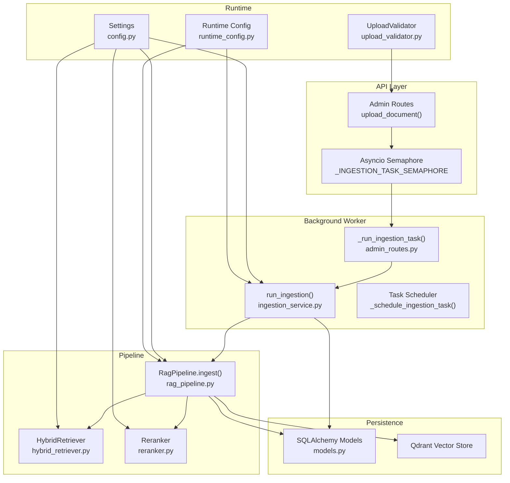
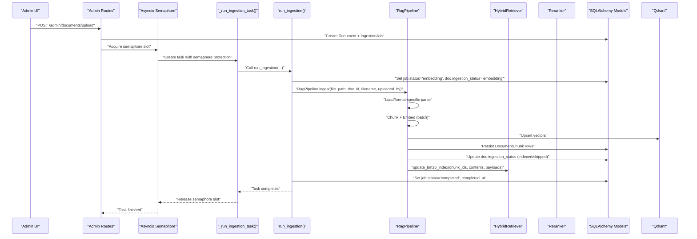
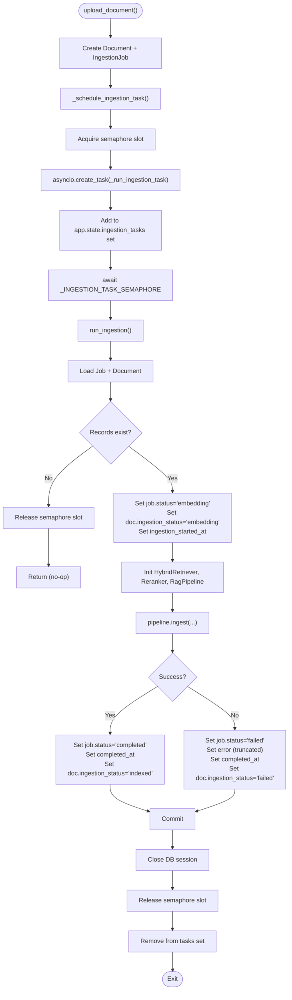
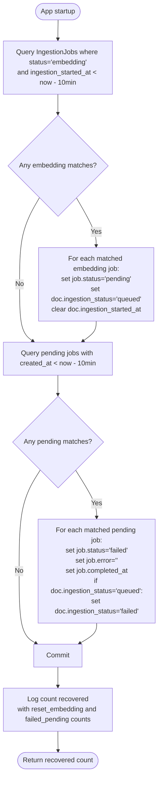
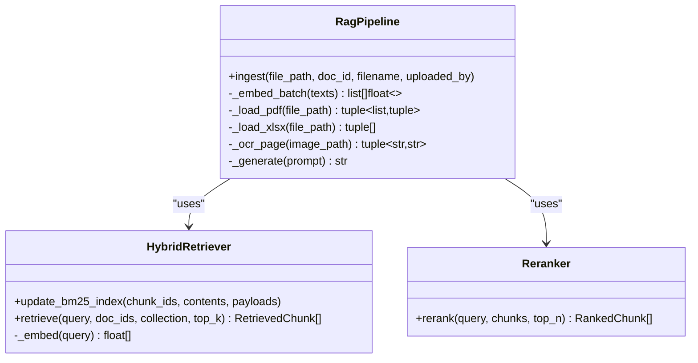
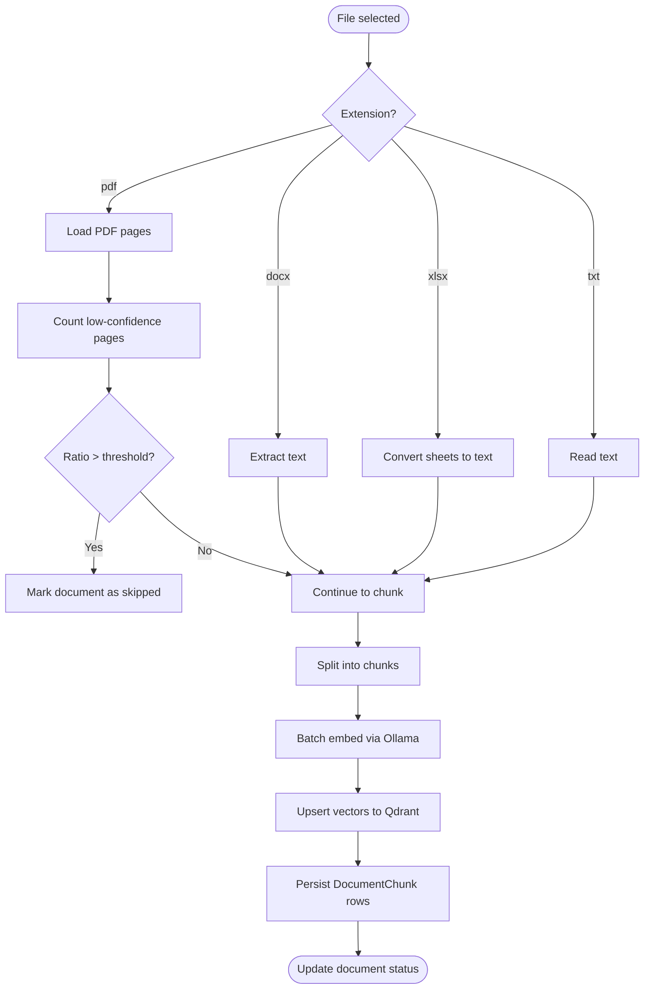
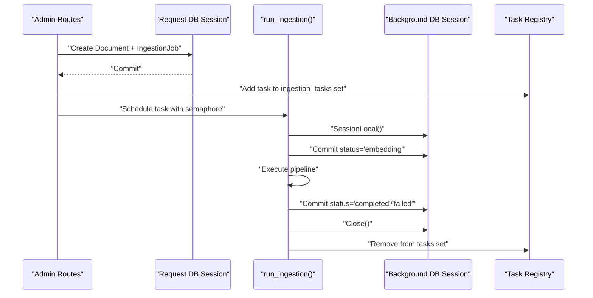
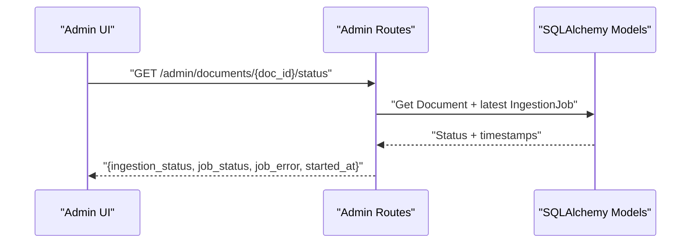
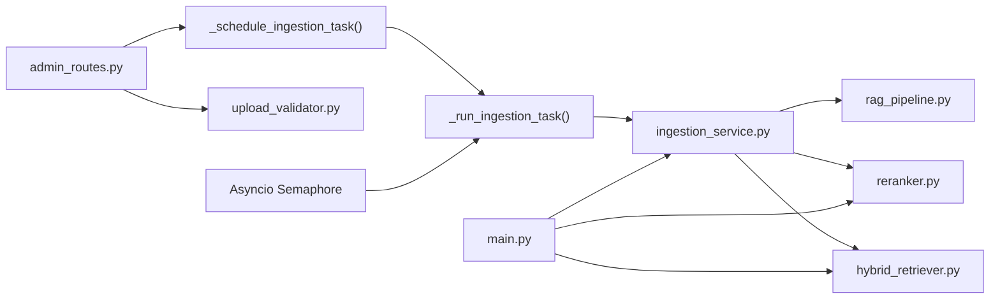
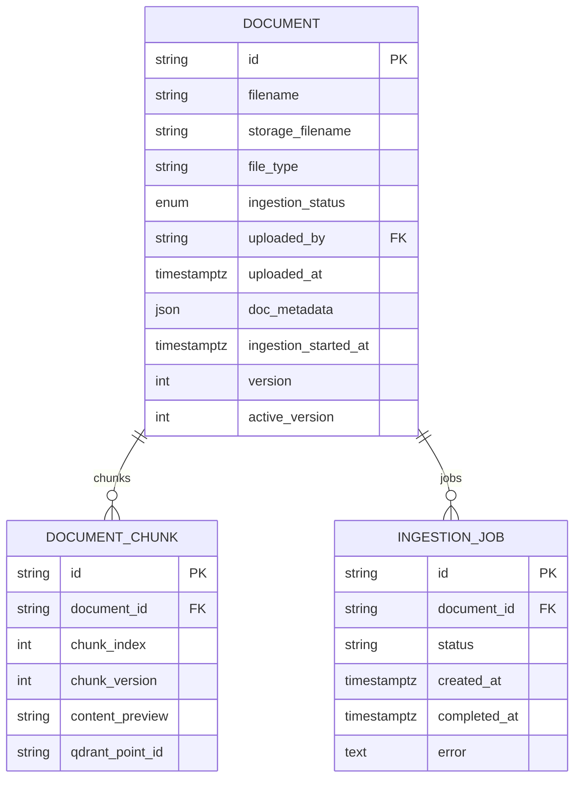

# Ingestion Service

<cite>
**Referenced Files in This Document**
- [ingestion_service.py](file://safe4ai-pilot/app/services/ingestion_service.py)
- [rag_pipeline.py](file://safe4ai-pilot/app/services/rag_pipeline.py)
- [hybrid_retriever.py](file://safe4ai-pilot/app/components/hybrid_retriever.py)
- [reranker.py](file://safe4ai-pilot/app/components/reranker.py)
- [admin_routes.py](file://safe4ai-pilot/app/api/admin_routes.py)
- [main.py](file://safe4ai-pilot/app/main.py)
- [models.py](file://safe4ai-pilot/app/db/models.py)
- [config.py](file://safe4ai-pilot/app/config.py)
- [upload_validator.py](file://safe4ai-pilot/app/security/upload_validator.py)
- [architecture.md](file://safe4ai-pilot/docs/architecture.md)
- [test_admin.py](file://safe4ai-pilot/tests/test_admin.py)
- [runtime_config.py](file://safe4ai-pilot/app/services/runtime_config.py)
</cite>

## Update Summary
**Changes Made**
- Enhanced background task execution model with asyncio.Semaphore for concurrency control
- Added configurable maximum background ingestion tasks (currently set to 4)
- Improved resource management during bulk operations
- Updated task scheduling and cleanup mechanisms
- Enhanced stuck job recovery with additional pending job timeout handling

## Table of Contents
1. [Introduction](#introduction)
2. [Project Structure](#project-structure)
3. [Core Components](#core-components)
4. [Architecture Overview](#architecture-overview)
5. [Detailed Component Analysis](#detailed-component-analysis)
6. [Dependency Analysis](#dependency-analysis)
7. [Performance Considerations](#performance-considerations)
8. [Troubleshooting Guide](#troubleshooting-guide)
9. [Conclusion](#conclusion)
10. [Appendices](#appendices)

## Introduction
This document explains the ingestion service that transforms uploaded files into searchable vectors. It covers the end-to-end workflow from file upload to vector embedding creation, the enhanced background task execution model with concurrency control, job status management, error handling, integration with HybridRetriever and Reranker, stuck job recovery, database session management, and operational best practices.

## Project Structure
The ingestion service spans several modules:
- API layer: uploads a file, validates it, persists metadata, and enqueues a background ingestion job with semaphore-controlled concurrency.
- Background worker: runs the ingestion pipeline with its own database session and semaphore protection.
- Pipeline: loads and normalizes content, chunks text, embeds in batches, writes to Qdrant, persists chunk records, updates document status, and refreshes the BM25 index.
- Retrieval components: HybridRetriever performs hybrid dense-sparse retrieval; Reranker reorders results.
- Persistence: SQLAlchemy ORM models track documents, ingestion jobs, and chunks.
- Configuration and validation: settings and upload guard define runtime behavior and safety.

**Diagram sources**
- [admin_routes.py:62-63](file://safe4ai-pilot/app/api/admin_routes.py#L62-L63)
- [admin_routes.py:168-185](file://safe4ai-pilot/app/api/admin_routes.py#L168-L185)
- [admin_routes.py:188-224](file://safe4ai-pilot/app/api/admin_routes.py#L188-L224)
- [ingestion_service.py:23-30](file://safe4ai-pilot/app/services/ingestion_service.py#L23-L30)
- [rag_pipeline.py:78-86](file://safe4ai-pilot/app/services/rag_pipeline.py#L78-L86)
- [hybrid_retriever.py:13-143](file://safe4ai-pilot/app/components/hybrid_retriever.py#L13-L143)
- [reranker.py:11-36](file://safe4ai-pilot/app/components/reranker.py#L11-L36)
- [models.py:68-160](file://safe4ai-pilot/app/db/models.py#L68-L160)
- [config.py:5-28](file://safe4ai-pilot/app/config.py#L5-L28)
- [upload_validator.py:24-73](file://safe4ai-pilot/app/security/upload_validator.py#L24-L73)
- [runtime_config.py:64-81](file://safe4ai-pilot/app/services/runtime_config.py#L64-L81)

**Section sources**
- [admin_routes.py:62-63](file://safe4ai-pilot/app/api/admin_routes.py#L62-L63)
- [admin_routes.py:168-185](file://safe4ai-pilot/app/api/admin_routes.py#L168-L185)
- [admin_routes.py:188-224](file://safe4ai-pilot/app/api/admin_routes.py#L188-L224)
- [ingestion_service.py:23-30](file://safe4ai-pilot/app/services/ingestion_service.py#L23-L30)
- [rag_pipeline.py:78-86](file://safe4ai-pilot/app/services/rag_pipeline.py#L78-L86)
- [hybrid_retriever.py:13-143](file://safe4ai-pilot/app/components/hybrid_retriever.py#L13-L143)
- [reranker.py:11-36](file://safe4ai-pilot/app/components/reranker.py#L11-L36)
- [models.py:68-160](file://safe4ai-pilot/app/db/models.py#L68-L160)
- [config.py:5-28](file://safe4ai-pilot/app/config.py#L5-L28)
- [upload_validator.py:24-73](file://safe4ai-pilot/app/security/upload_validator.py#L24-L73)
- [runtime_config.py:64-81](file://safe4ai-pilot/app/services/runtime_config.py#L64-L81)

## Core Components
- run_ingestion: Background task that advances job/document statuses, orchestrates the pipeline, and handles exceptions with semaphore protection.
- _run_ingestion_task: Semaphore-protected wrapper that controls concurrency for background ingestion tasks.
- _schedule_ingestion_task: Manages task lifecycle, cleanup, and error handling for scheduled ingestion jobs.
- RagPipeline.ingest: Loads files, chunks content, embeds in batches, upserts vectors, persists chunks, updates document status, and refreshes BM25 index.
- HybridRetriever: Embeds queries and retrieves dense vectors from Qdrant; optionally augments with BM25 sparse ranking; merges via Reciprocal Rank Fusion.
- Reranker: Re-ranks initial retrieval results using cross-encoder scoring.
- Admin Routes: Upload endpoint validates, stores, creates Document and IngestionJob records, and schedules run_ingestion with semaphore control.
- Startup Recovery: recover_stuck_jobs resets long-running jobs back to queued and handles pending job timeouts.

**Section sources**
- [ingestion_service.py:23-30](file://safe4ai-pilot/app/services/ingestion_service.py#L23-L30)
- [admin_routes.py:168-185](file://safe4ai-pilot/app/api/admin_routes.py#L168-L185)
- [admin_routes.py:188-224](file://safe4ai-pilot/app/api/admin_routes.py#L188-L224)
- [rag_pipeline.py:78-86](file://safe4ai-pilot/app/services/rag_pipeline.py#L78-L86)
- [hybrid_retriever.py:13-143](file://safe4ai-pilot/app/components/hybrid_retriever.py#L13-L143)
- [reranker.py:11-36](file://safe4ai-pilot/app/components/reranker.py#L11-L36)
- [admin_routes.py:240-300](file://safe4ai-pilot/app/api/admin_routes.py#L240-300)
- [ingestion_service.py:112-160](file://safe4ai-pilot/app/services/ingestion_service.py#L112-L160)

## Architecture Overview
The ingestion workflow is event-driven with enhanced concurrency control:
- An admin triggers upload_document, which validates, stores the file, and creates Document and IngestionJob records.
- The API schedules _run_ingestion_task as a background task protected by asyncio.Semaphore.
- _run_ingestion_task uses the semaphore to limit concurrent background ingestion tasks to MAX_BACKGROUND_INGESTION_TASKS (currently 4).
- run_ingestion opens its own database session, sets status to embedding, constructs HybridRetriever, Reranker, and RagPipeline, and executes ingest.
- RagPipeline loads/format-specific parsing, chunks, embeds, upserts vectors, persists chunks, updates document status, and refreshes BM25.
- On completion, run_ingestion marks job as completed and document as indexed; on failure, it marks job as failed and document as failed.
- Task scheduler manages lifecycle, cleanup, and error logging for all background ingestion tasks.

**Diagram sources**
- [admin_routes.py:240-300](file://safe4ai-pilot/app/api/admin_routes.py#L240-300)
- [admin_routes.py:168-185](file://safe4ai-pilot/app/api/admin_routes.py#L168-L185)
- [admin_routes.py:188-224](file://safe4ai-pilot/app/api/admin_routes.py#L188-L224)
- [ingestion_service.py:23-30](file://safe4ai-pilot/app/services/ingestion_service.py#L23-L30)
- [rag_pipeline.py:78-86](file://safe4ai-pilot/app/services/rag_pipeline.py#L78-L86)
- [hybrid_retriever.py:29-41](file://safe4ai-pilot/app/components/hybrid_retriever.py#L29-L41)

**Section sources**
- [admin_routes.py:240-300](file://safe4ai-pilot/app/api/admin_routes.py#L240-300)
- [admin_routes.py:168-185](file://safe4ai-pilot/app/api/admin_routes.py#L168-L185)
- [admin_routes.py:188-224](file://safe4ai-pilot/app/api/admin_routes.py#L188-L224)
- [ingestion_service.py:23-30](file://safe4ai-pilot/app/services/ingestion_service.py#L23-L30)
- [rag_pipeline.py:78-86](file://safe4ai-pilot/app/services/rag_pipeline.py#L78-L86)

## Detailed Component Analysis

### Enhanced Background Task Execution Model with Concurrency Control
**Updated** The background task execution model now includes asyncio.Semaphore for controlled concurrency:

- Purpose: Run ingestion as a background task with its own database session and semaphore protection to prevent resource exhaustion during bulk operations.
- Semaphore Configuration: _MAX_BACKGROUND_INGESTION_TASKS = 4 controls maximum concurrent background ingestion tasks.
- Status transitions:
  - Sets job.status to embedding and document.ingestion_status to embedding.
  - On success: sets job.status to completed and document.ingestion_status to indexed.
  - On failure: sets job.status to failed, captures error, and sets document.ingestion_status to failed.
- Error handling: Catches exceptions, updates job and document, and ensures the session is closed.
- Task Lifecycle: _schedule_ingestion_task manages task creation, cleanup, and error logging.

**Diagram sources**
- [admin_routes.py:240-300](file://safe4ai-pilot/app/api/admin_routes.py#L240-300)
- [admin_routes.py:168-185](file://safe4ai-pilot/app/api/admin_routes.py#L168-L185)
- [admin_routes.py:188-224](file://safe4ai-pilot/app/api/admin_routes.py#L188-L224)
- [ingestion_service.py:23-30](file://safe4ai-pilot/app/services/ingestion_service.py#L23-L30)

**Section sources**
- [admin_routes.py:62-63](file://safe4ai-pilot/app/api/admin_routes.py#L62-L63)
- [admin_routes.py:168-185](file://safe4ai-pilot/app/api/admin_routes.py#L168-L185)
- [admin_routes.py:188-224](file://safe4ai-pilot/app/api/admin_routes.py#L188-L224)
- [ingestion_service.py:23-30](file://safe4ai-pilot/app/services/ingestion_service.py#L23-L30)

### Stuck Job Recovery Mechanism
**Updated** The stuck job recovery mechanism now handles both embedding and pending job timeouts:

- Purpose: Reset jobs stuck in embedding beyond a threshold back to queued to allow retry, and mark pending jobs that exceed timeout as failed.
- Threshold: 10 minutes for embedding jobs, immediate timeout for pending jobs.
- Enhanced Behavior: 
  - Resets embedding jobs older than threshold back to queued
  - Marks pending jobs older than threshold as failed with specific timeout error message
  - Updates associated document statuses accordingly
  - Commits changes and logs recovery statistics

**Diagram sources**
- [ingestion_service.py:112-160](file://safe4ai-pilot/app/services/ingestion_service.py#L112-L160)

**Section sources**
- [ingestion_service.py:112-160](file://safe4ai-pilot/app/services/ingestion_service.py#L112-L160)
- [main.py:38-61](file://safe4ai-pilot/app/main.py#L38-L61)

### Integration with HybridRetriever and Reranker
- HybridRetriever:
  - Embeds queries via Ollama embeddings endpoint.
  - Retrieves dense vectors from Qdrant and optionally enriches with BM25 sparse scores.
  - Merges rankings via Reciprocal Rank Fusion (RRF).
- Reranker:
  - Uses a cross-encoder to re-rank initial retrieval results.
  - Returns top-N RankedChunk entries with rerank scores.

**Diagram sources**
- [hybrid_retriever.py:13-143](file://safe4ai-pilot/app/components/hybrid_retriever.py#L13-L143)
- [reranker.py:11-36](file://safe4ai-pilot/app/components/reranker.py#L11-L36)
- [rag_pipeline.py:40-73](file://safe4ai-pilot/app/services/rag_pipeline.py#L40-L73)

**Section sources**
- [hybrid_retriever.py:13-143](file://safe4ai-pilot/app/components/hybrid_retriever.py#L13-L143)
- [reranker.py:11-36](file://safe4ai-pilot/app/components/reranker.py#L11-L36)
- [rag_pipeline.py:40-73](file://safe4ai-pilot/app/services/rag_pipeline.py#L40-L73)

### File Formats and Parsing
- Supported formats: PDF, DOCX, XLSX, TXT.
- PDF:
  - Extracts text per page.
  - If text length below threshold, attempts OCR via Vision model and quality gating.
  - Tracks low-confidence pages to decide whether to skip indexing.
- DOCX/XLSX:
  - Extracts text natively; XLSX converts sheets to tabular text.
- TXT:
  - Reads as plain text.
- Chunking:
  - Uses RecursiveCharacterTextSplitter with configured chunk size and overlap.
- Embedding:
  - Batches embeddings via Ollama embeddings endpoint.

**Diagram sources**
- [rag_pipeline.py:78-178](file://safe4ai-pilot/app/services/rag_pipeline.py#L78-L178)
- [rag_pipeline.py:265-295](file://safe4ai-pilot/app/services/rag_pipeline.py#L265-L295)
- [rag_pipeline.py:297-307](file://safe4ai-pilot/app/services/rag_pipeline.py#L297-L307)
- [rag_pipeline.py:187-201](file://safe4ai-pilot/app/services/rag_pipeline.py#L187-L201)

**Section sources**
- [rag_pipeline.py:78-178](file://safe4ai-pilot/app/services/rag_pipeline.py#L78-L178)
- [rag_pipeline.py:265-295](file://safe4ai-pilot/app/services/rag_pipeline.py#L265-L295)
- [rag_pipeline.py:297-307](file://safe4ai-pilot/app/services/rag_pipeline.py#L297-L307)
- [rag_pipeline.py:187-201](file://safe4ai-pilot/app/services/rag_pipeline.py#L187-L201)

### Database Session Management and Transactions
- run_ingestion:
  - Creates its own Session via SessionLocal().
  - Commits status updates before and after pipeline execution.
  - Ensures session close in finally block.
- Admin Routes:
  - Uses dependency get_db for request-scoped sessions.
  - Commits Document and IngestionJob creation upon upload.
- Recover Stuck Jobs:
  - Runs recover_stuck_jobs(db) on startup with a dedicated session.
- Task Management:
  - _schedule_ingestion_task maintains app.state.ingestion_tasks set for tracking active tasks.
  - Automatic cleanup removes completed/cancelled tasks from the set.

**Diagram sources**
- [admin_routes.py:240-300](file://safe4ai-pilot/app/api/admin_routes.py#L240-300)
- [admin_routes.py:188-224](file://safe4ai-pilot/app/api/admin_routes.py#L188-L224)
- [ingestion_service.py:23-30](file://safe4ai-pilot/app/services/ingestion_service.py#L23-L30)

**Section sources**
- [admin_routes.py:240-300](file://safe4ai-pilot/app/api/admin_routes.py#L240-300)
- [admin_routes.py:188-224](file://safe4ai-pilot/app/api/admin_routes.py#L188-L224)
- [ingestion_service.py:23-30](file://safe4ai-pilot/app/services/ingestion_service.py#L23-L30)

### Monitoring and Progress Polling
- Admin Routes exposes a status endpoint to poll ingestion progress for a document.
- Frontend types map ingestion_status to UI states.
- Task registry tracks active ingestion tasks for monitoring purposes.

**Diagram sources**
- [admin_routes.py:338-362](file://safe4ai-pilot/app/api/admin_routes.py#L338-L362)

**Section sources**
- [admin_routes.py:338-362](file://safe4ai-pilot/app/api/admin_routes.py#L338-L362)

### Practical Examples
- Configure ingestion workflow:
  - Set service settings (Qdrant URL, Ollama URL/model, embedding model).
  - Configure _MAX_BACKGROUND_INGESTION_TASKS (currently 4) based on system resources.
  - Ensure vector extension is enabled in PostgreSQL and tables are created on startup.
- Handle different file formats:
  - PDF: relies on text extraction; if insufficient text, OCR is attempted with quality gating.
  - DOCX/XLSX: native extraction; XLSX rows converted to text.
  - TXT: straightforward text load.
- Monitor progress:
  - Poll the status endpoint to observe transitions from queued to embedding to completed/failed.
- Manage concurrency:
  - Adjust _MAX_BACKGROUND_INGESTION_TASKS setting to control maximum concurrent ingestion tasks.
  - Monitor app.state.ingestion_tasks for active task count during bulk operations.

**Section sources**
- [config.py:5-28](file://safe4ai-pilot/app/config.py#L5-L28)
- [main.py:38-61](file://safe4ai-pilot/app/main.py#L38-L61)
- [admin_routes.py:338-362](file://safe4ai-pilot/app/api/admin_routes.py#L338-L362)
- [architecture.md:36-44](file://safe4ai-pilot/docs/architecture.md#L36-L44)
- [admin_routes.py:62-63](file://safe4ai-pilot/app/api/admin_routes.py#L62-L63)

## Dependency Analysis
- run_ingestion depends on:
  - HybridRetriever, Reranker, RagPipeline, settings, and SQLAlchemy models.
- _run_ingestion_task depends on:
  - asyncio.Semaphore for concurrency control.
- _schedule_ingestion_task depends on:
  - Task lifecycle management and error handling.
- RagPipeline depends on:
  - HybridRetriever, Reranker, Qdrant client, chunking utilities, and Ollama endpoints.
- Admin Routes depends on:
  - UploadValidator, settings, asyncio.Semaphore, and schedules run_ingestion.
- Startup depends on:
  - recover_stuck_jobs and builds shared retriever/reranker instances.

**Diagram sources**
- [ingestion_service.py:8-13](file://safe4ai-pilot/app/services/ingestion_service.py#L8-L13)
- [admin_routes.py:168-185](file://safe4ai-pilot/app/api/admin_routes.py#L168-L185)
- [admin_routes.py:188-224](file://safe4ai-pilot/app/api/admin_routes.py#L188-L224)
- [admin_routes.py:62-63](file://safe4ai-pilot/app/api/admin_routes.py#L62-L63)
- [main.py:38-61](file://safe4ai-pilot/app/main.py#L38-L61)

**Section sources**
- [ingestion_service.py:8-13](file://safe4ai-pilot/app/services/ingestion_service.py#L8-L13)
- [admin_routes.py:168-185](file://safe4ai-pilot/app/api/admin_routes.py#L168-L185)
- [admin_routes.py:188-224](file://safe4ai-pilot/app/api/admin_routes.py#L188-L224)
- [admin_routes.py:62-63](file://safe4ai-pilot/app/api/admin_routes.py#L62-L63)
- [main.py:38-61](file://safe4ai-pilot/app/main.py#L38-L61)

## Performance Considerations
- **Enhanced Concurrency Control**: asyncio.Semaphore limits maximum concurrent background ingestion tasks to prevent resource exhaustion during bulk operations.
- **Configurable Limits**: _MAX_BACKGROUND_INGESTION_TASKS (currently 4) can be adjusted based on system resources and workload patterns.
- **Resource Management**: Semaphore ensures fair distribution of computational resources across ingestion tasks.
- Embedding batching: RagPipeline embeds in batches to reduce overhead.
- Chunk sizing: Tuning chunk size and overlap balances recall and performance.
- OCR gating: Low-confidence OCR pages are counted to decide skipping; adjust thresholds to balance completeness vs. quality.
- Asynchronous I/O: Embeddings and OCR use async HTTP clients to avoid blocking.
- Qdrant upsert: Batch upsert minimizes network round-trips.
- Startup pre-warming: Prewarms Ollama to avoid cold-start latency.

## Troubleshooting Guide
- **Concurrency Issues**:
  - If background tasks are not starting, check semaphore capacity (_MAX_BACKGROUND_INGESTION_TASKS).
  - Monitor app.state.ingestion_tasks for active task count during bulk operations.
  - Excessive queueing indicates semaphore limit reached or system resource constraints.
- Common ingestion issues:
  - Validation failures: UploadValidator rejects unsupported extensions/MIME types or oversized files.
  - Missing ingestion records: run_ingestion logs a warning and exits early if job/doc not found.
  - Long-running tasks: Use recover_stuck_jobs to reset jobs stuck in embedding beyond threshold.
  - Pending job timeouts: Pending jobs exceeding 10-minute threshold are automatically marked failed.
  - Deletion races: Deleting a document concurrently with background ingestion can lead to inconsistent state; ensure no concurrent ingestion or coordinate deletion with job lifecycle.
- Timeout handling:
  - Embedding and OCR endpoints use explicit timeouts; adjust if needed in pipeline.
  - Upload size enforcement prevents overly large bodies.
  - Semaphore acquisition waits for available slots; configure appropriately for workload.
- Error propagation:
  - run_ingestion captures exceptions, truncates error messages, and marks job/document as failed.
  - Task scheduler logs unhandled errors and cancellation events.

**Section sources**
- [upload_validator.py:24-73](file://safe4ai-pilot/app/security/upload_validator.py#L24-L73)
- [ingestion_service.py:88-109](file://safe4ai-pilot/app/services/ingestion_service.py#L88-L109)
- [rag_pipeline.py:187-201](file://safe4ai-pilot/app/services/rag_pipeline.py#L187-L201)
- [admin_routes.py:240-300](file://safe4ai-pilot/app/api/admin_routes.py#L240-300)
- [admin_routes.py:188-224](file://safe4ai-pilot/app/api/admin_routes.py#L188-L224)
- [bug-report.md:25-38](file://safe4ai-pilot/bug-report.md#L25-L38)

## Conclusion
The ingestion service provides a robust, asynchronous pipeline from upload to indexed vectors with enhanced concurrency control. The addition of asyncio.Semaphore prevents resource exhaustion during bulk operations while maintaining reliable task execution. It integrates cleanly with HybridRetriever and Reranker, manages database sessions carefully, and includes comprehensive mechanisms to handle failures, recover stuck jobs, and monitor task lifecycle. Following the operational guidance and best practices outlined here will help maintain reliability and performance at scale.

## Appendices

### Data Model Overview

**Diagram sources**
- [models.py:68-160](file://safe4ai-pilot/app/db/models.py#L68-L160)

**Section sources**
- [models.py:68-160](file://safe4ai-pilot/app/db/models.py#L68-L160)

### Example: Re-indexing a Document
- Endpoint: POST /admin/documents/{doc_id}/reindex
- Behavior: Recreates a new IngestionJob, resets document status to queued, and schedules run_ingestion with semaphore protection.

**Section sources**
- [admin_routes.py:211-243](file://safe4ai-pilot/app/api/admin_routes.py#L211-L243)

### Example: Deleting a Document
- Endpoint: DELETE /admin/documents/{doc_id}
- Behavior: Removes raw file, Qdrant points, DB chunks/jobs, and document record; consider risks around concurrent ingestion.

**Section sources**
- [admin_routes.py:178-208](file://safe4ai-pilot/app/api/admin_routes.py#L178-L208)
- [bug-report.md:33-38](file://safe4ai-pilot/bug-report.md#L33-L38)

### Concurrency Configuration
- **_MAX_BACKGROUND_INGESTION_TASKS**: Controls maximum concurrent background ingestion tasks (default: 4).
- **Semaphore Usage**: _INGESTION_TASK_SEMAPHORE protects _run_ingestion_task execution.
- **Task Registry**: app.state.ingestion_tasks tracks active ingestion tasks for monitoring.
- **Resource Protection**: Semaphore prevents resource exhaustion during bulk operations.

**Section sources**
- [admin_routes.py:62-63](file://safe4ai-pilot/app/api/admin_routes.py#L62-L63)
- [admin_routes.py:168-185](file://safe4ai-pilot/app/api/admin_routes.py#L168-L185)
- [admin_routes.py:188-224](file://safe4ai-pilot/app/api/admin_routes.py#L188-L224)
- [main.py:57](file://safe4ai-pilot/app/main.py#L57)