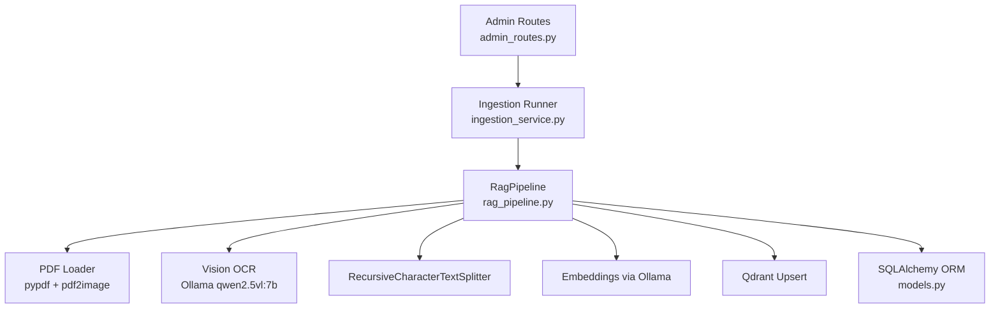
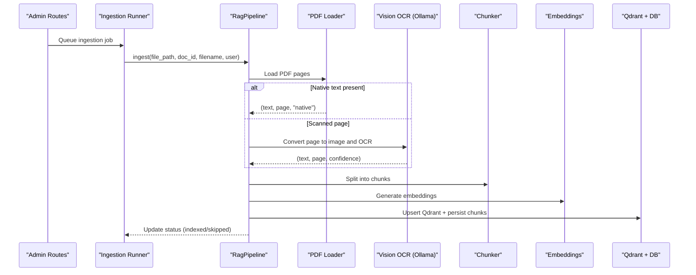
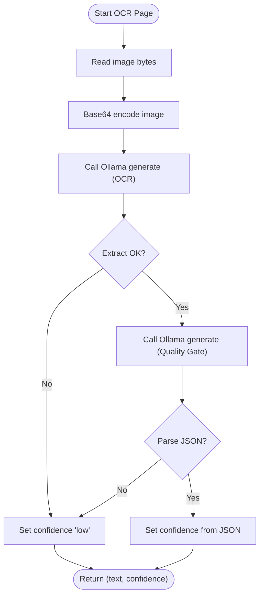
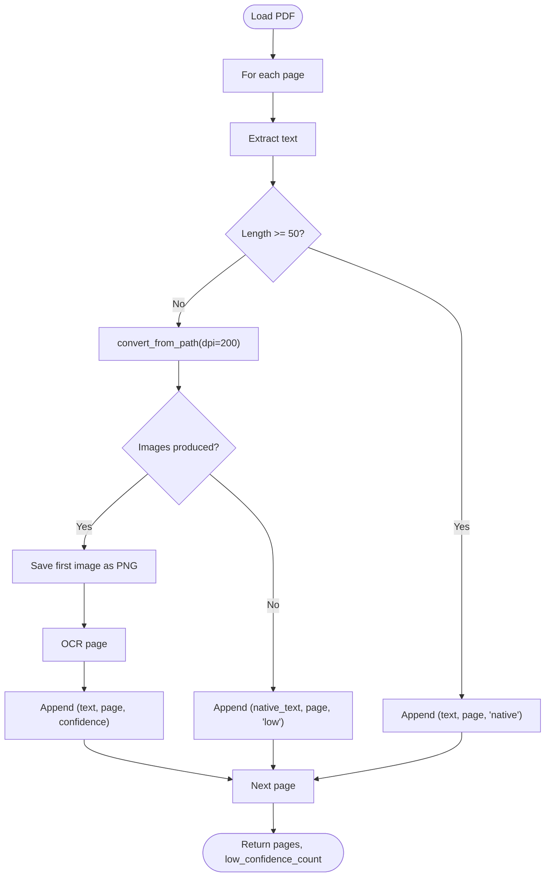
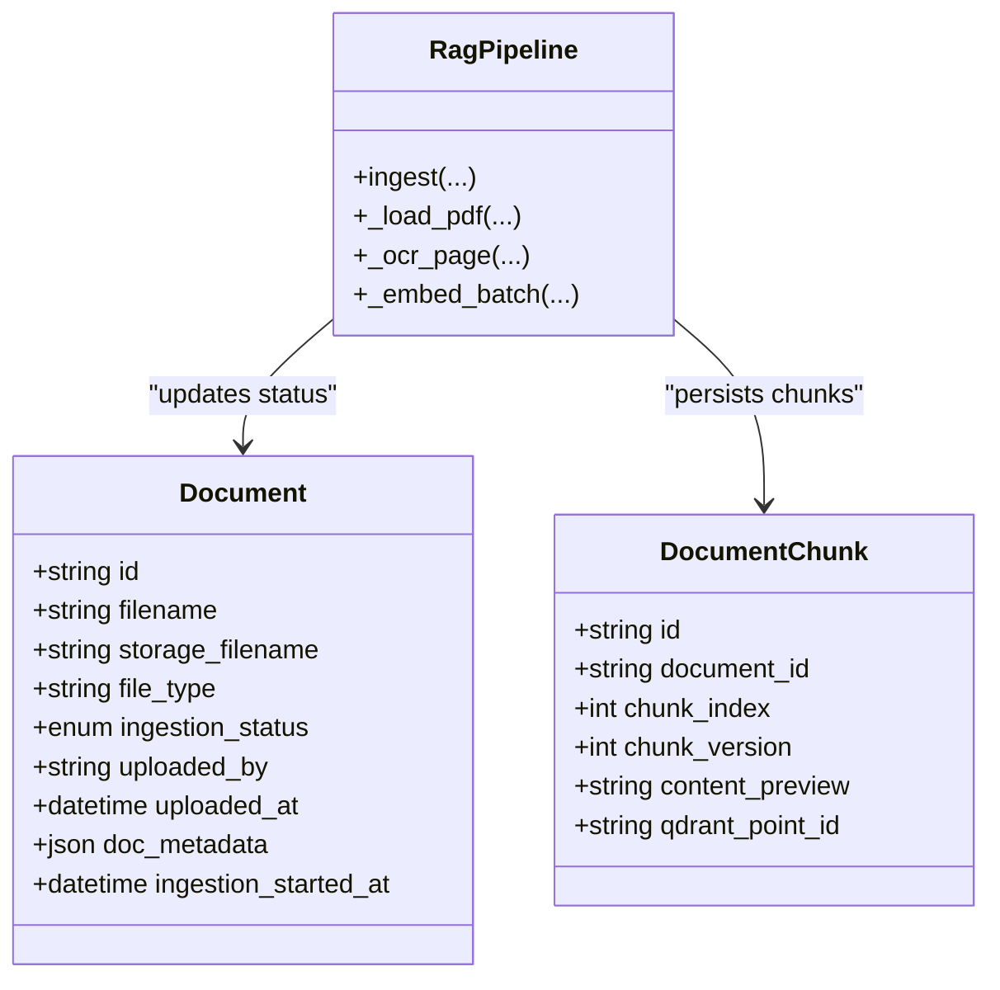
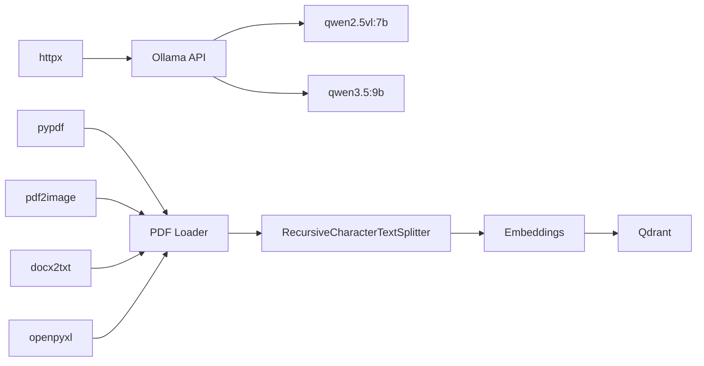
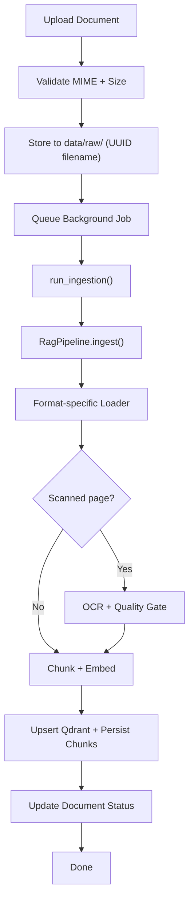

# OCR Processing

<cite>
**Referenced Files in This Document**
- [rag_pipeline.py](file://safe4ai-pilot/app/services/rag_pipeline.py)
- [ingestion_service.py](file://safe4ai-pilot/app/services/ingestion_service.py)
- [config.py](file://safe4ai-pilot/app/config.py)
- [architecture.md](file://safe4ai-pilot/docs/architecture.md)
- [models.py](file://safe4ai-pilot/app/db/models.py)
- [admin_routes.py](file://safe4ai-pilot/app/api/admin_routes.py)
- [pyproject.toml](file://safe4ai-pilot/pyproject.toml)
- [test_rag_pipeline.py](file://safe4ai-pilot/tests/test_rag_pipeline.py)
</cite>

## Table of Contents
1. [Introduction](#introduction)
2. [Project Structure](#project-structure)
3. [Core Components](#core-components)
4. [Architecture Overview](#architecture-overview)
5. [Detailed Component Analysis](#detailed-component-analysis)
6. [Dependency Analysis](#dependency-analysis)
7. [Performance Considerations](#performance-considerations)
8. [Troubleshooting Guide](#troubleshooting-guide)
9. [Conclusion](#conclusion)
10. [Appendices](#appendices)

## Introduction
This document explains the OCR processing system used to extract text from images and scanned documents within the document ingestion workflow. It covers how the system integrates with the broader ingestion pipeline, including image preprocessing, text extraction via a vision-capable LLM, and metadata preservation. It also documents supported formats, OCR engine configuration, quality optimization, handling of different document types (PDFs, scanned images, mixed-content), practical configuration examples, multilingual considerations, error handling, performance characteristics, and memory optimization strategies.

## Project Structure
The OCR pipeline is implemented in the ingestion service and orchestrated by the background ingestion job. The key modules involved are:
- OCR and ingestion orchestration: [RagPipeline](file://safe4ai-pilot/app/services/rag_pipeline.py)
- Background ingestion runner: [run_ingestion](file://safe4ai-pilot/app/services/ingestion_service.py)
- Application configuration: [Settings](file://safe4ai-pilot/app/config.py)
- Ingestion data flow documentation: [architecture.md](file://safe4ai-pilot/docs/architecture.md)
- Persistence models: [models.py](file://safe4ai-pilot/app/db/models.py)
- Upload and job queue entry point: [admin_routes.py](file://safe4ai-pilot/app/api/admin_routes.py)
- Dependencies and optional extras: [pyproject.toml](file://safe4ai-pilot/pyproject.toml)
- Tests validating OCR behavior: [test_rag_pipeline.py](file://safe4ai-pilot/tests/test_rag_pipeline.py)

**Diagram sources**
- [admin_routes.py:92-119](file://safe4ai-pilot/app/api/admin_routes.py#L92-L119)
- [ingestion_service.py:21-88](file://safe4ai-pilot/app/services/ingestion_service.py#L21-L88)
- [rag_pipeline.py:62-150](file://safe4ai-pilot/app/services/rag_pipeline.py#L62-L150)
- [models.py:75-102](file://safe4ai-pilot/app/db/models.py#L75-L102)

**Section sources**
- [architecture.md:36-44](file://safe4ai-pilot/docs/architecture.md#L36-L44)
- [admin_routes.py:92-119](file://safe4ai-pilot/app/api/admin_routes.py#L92-L119)
- [ingestion_service.py:21-88](file://safe4ai-pilot/app/services/ingestion_service.py#L21-L88)
- [rag_pipeline.py:62-150](file://safe4ai-pilot/app/services/rag_pipeline.py#L62-L150)
- [models.py:75-102](file://safe4ai-pilot/app/db/models.py#L75-L102)

## Core Components
- RagPipeline orchestrates ingestion, including format-specific loaders, OCR for scanned content, chunking, embedding, and persistence.
- IngestionRunner executes the pipeline asynchronously and updates job/document statuses.
- Settings define runtime configuration for OCR and embedding models, timeouts, and limits.
- Qdrant and SQLAlchemy persist chunks and document metadata, including OCR quality flags.

Key OCR-related constants and thresholds:
- OCR threshold: pages with fewer than 50 characters trigger OCR.
- Low-confidence ratio: if more than 50% of pages are low confidence, the document is marked for review.
- Embedding batch size: batches of 100 texts per request to Ollama embeddings endpoint.

**Section sources**
- [rag_pipeline.py:25-31](file://safe4ai-pilot/app/services/rag_pipeline.py#L25-L31)
- [rag_pipeline.py:62-150](file://safe4ai-pilot/app/services/rag_pipeline.py#L62-L150)
- [ingestion_service.py:21-88](file://safe4ai-pilot/app/services/ingestion_service.py#L21-L88)
- [config.py:7-21](file://safe4ai-pilot/app/config.py#L7-L21)

## Architecture Overview
The OCR-enabled ingestion pipeline follows this flow:
- Upload → validate MIME + size → store to data/raw/ (UUID filename)
- Background job → format-specific loader (PDF/DOCX/XLSX) → chunk (800 tokens, 150 overlap)
- If scanned: pdf2image → qwen2.5vl OCR → quality gate
- Embeddings → store in Qdrant + document_chunks table
- Status: indexed (or skipped if OCR quality low)

**Diagram sources**
- [architecture.md:36-44](file://safe4ai-pilot/docs/architecture.md#L36-L44)
- [admin_routes.py:92-119](file://safe4ai-pilot/app/api/admin_routes.py#L92-L119)
- [ingestion_service.py:21-88](file://safe4ai-pilot/app/services/ingestion_service.py#L21-L88)
- [rag_pipeline.py:62-150](file://safe4ai-pilot/app/services/rag_pipeline.py#L62-L150)

## Detailed Component Analysis

### OCR Engine and Quality Gate
The system uses a vision-capable LLM to extract text and assess confidence:
- Extraction prompt: requests exact reproduction of visible text, preserving structure.
- Quality prompt: asks the model to rate confidence and return structured JSON.
- Confidence outcomes: high, medium, low; defaults to low on parsing errors.

**Diagram sources**
- [rag_pipeline.py:203-249](file://safe4ai-pilot/app/services/rag_pipeline.py#L203-L249)

**Section sources**
- [rag_pipeline.py:203-249](file://safe4ai-pilot/app/services/rag_pipeline.py#L203-L249)

### PDF Handling and Mixed Content
- Native text extraction is attempted first; pages with less than 50 characters are treated as scanned.
- Scanned pages are converted to images at 200 DPI and saved temporarily as PNG.
- OCR is invoked per page; quality gate determines whether to mark as low confidence.
- If conversion fails or produces no images, the page falls back to native text with low confidence.

**Diagram sources**
- [rag_pipeline.py:265-295](file://safe4ai-pilot/app/services/rag_pipeline.py#L265-L295)

**Section sources**
- [rag_pipeline.py:265-295](file://safe4ai-pilot/app/services/rag_pipeline.py#L265-L295)

### Supported Formats and Preprocessing
- PDF: Native text extraction; scanned pages are converted to images and OCR’ed.
- DOCX: Full-text extraction via docx2txt.
- XLSX: Sheet-by-sheet text extraction with tab-separated rows.
- Other text-based formats: UTF-8 read with error replacement.

Preprocessing specifics:
- PDF scanning detection threshold: 50 characters.
- OCR image resolution: 200 DPI, PNG output.
- Chunking: recursive character splitting with 800 size and 150 overlap.

**Section sources**
- [rag_pipeline.py:71-83](file://safe4ai-pilot/app/services/rag_pipeline.py#L71-L83)
- [rag_pipeline.py:265-295](file://safe4ai-pilot/app/services/rag_pipeline.py#L265-L295)
- [rag_pipeline.py:25-26](file://safe4ai-pilot/app/services/rag_pipeline.py#L25-L26)

### Metadata Preservation and Status Management
- OCR quality is preserved in chunk payloads and document-level status.
- Document status transitions:
  - queued → embedding → indexed (or skipped if low-confidence ratio exceeds 50%).
- Qdrant payloads include doc_id, filename, page_number, chunk_index, content preview, and ocr_quality.

**Diagram sources**
- [models.py:75-102](file://safe4ai-pilot/app/db/models.py#L75-L102)
- [rag_pipeline.py:62-150](file://safe4ai-pilot/app/services/rag_pipeline.py#L62-L150)

**Section sources**
- [models.py:75-102](file://safe4ai-pilot/app/db/models.py#L75-L102)
- [rag_pipeline.py:109-149](file://safe4ai-pilot/app/services/rag_pipeline.py#L109-L149)

### Configuration and Environment
- OCR model: qwen2.5vl:7b for both extraction and quality assessment.
- Generation model: configurable via settings (default qwen3.5:9b).
- Embedding model: configurable via settings (default nomic-embed-text).
- Ollama and Qdrant URLs are configurable.
- Upload size limit is enforced via settings.

Practical configuration examples:
- Change OCR model: adjust the model name used in OCR calls.
- Tune OCR sensitivity: adjust the 50-character threshold to trigger OCR.
- Adjust chunk size/overlap: modify chunk size and overlap constants.
- Control low-confidence ratio: adjust the 0.5 ratio threshold for marking documents as skipped.

**Section sources**
- [config.py:7-21](file://safe4ai-pilot/app/config.py#L7-L21)
- [rag_pipeline.py:25-31](file://safe4ai-pilot/app/services/rag_pipeline.py#L25-L31)
- [pyproject.toml:9-46](file://safe4ai-pilot/pyproject.toml#L9-L46)

### Multilingual and Mixed Content Handling
- The vision model is used for all scanned pages regardless of language/script.
- The quality gate returns a confidence label; mixed content (tables, lists, headers) is preserved by the extraction prompt.
- No explicit language switching is configured in the code; language support depends on the OCR model’s training.

**Section sources**
- [rag_pipeline.py:203-249](file://safe4ai-pilot/app/services/rag_pipeline.py#L203-L249)

### Practical Examples
- Configure OCR parameters:
  - Threshold: adjust the 50-character OCR trigger to be stricter or more permissive.
  - Chunk size/overlap: tune for document density and retrieval needs.
  - Low-confidence ratio: adjust the 0.5 threshold to require higher-quality OCR before indexing.
- Handling multilingual content:
  - Ensure the OCR model supports target languages; no explicit language selection is implemented in code.
- Optimizing OCR accuracy:
  - Increase OCR DPI (currently 200) for higher-resolution scans.
  - Prefer clean, high-contrast scans; ensure proper lighting and alignment.

**Section sources**
- [rag_pipeline.py:25-31](file://safe4ai-pilot/app/services/rag_pipeline.py#L25-L31)
- [rag_pipeline.py:278-284](file://safe4ai-pilot/app/services/rag_pipeline.py#L278-L284)

## Dependency Analysis
External libraries and services used by the OCR pipeline:
- PDF processing: pypdf, pdf2image
- Office formats: docx2txt, openpyxl
- Embeddings: httpx to Ollama embeddings endpoint
- Retrieval: Qdrant client
- Text splitting: langchain RecursiveCharacterTextSplitter

**Diagram sources**
- [pyproject.toml:9-46](file://safe4ai-pilot/pyproject.toml#L9-L46)
- [rag_pipeline.py:10-23](file://safe4ai-pilot/app/services/rag_pipeline.py#L10-L23)

**Section sources**
- [pyproject.toml:9-46](file://safe4ai-pilot/pyproject.toml#L9-L46)
- [rag_pipeline.py:10-23](file://safe4ai-pilot/app/services/rag_pipeline.py#L10-L23)

## Performance Considerations
- Batched embeddings: requests are sent in batches of 100 texts to reduce overhead.
- Asynchronous I/O: httpx is used for concurrent OCR and embedding calls.
- Memory optimization:
  - Temporary PNG files are created per scanned page; ensure cleanup after use.
  - Chunk size and overlap are tuned to balance recall and memory footprint.
- Throughput:
  - OCR and embedding calls are rate-limited by external services; consider connection pooling and timeouts.
  - For large document volumes, process documents in parallel via background jobs.

[No sources needed since this section provides general guidance]

## Troubleshooting Guide
Common issues and mitigations:
- Corrupted images or unsupported formats:
  - The OCR path handles exceptions during conversion and marks pages with low confidence.
  - Verify poppler-utils installation for pdf2image if PDF conversion fails.
- OCR processing failures:
  - On JSON parse errors from the quality gate, confidence defaults to low.
  - Ensure Ollama is reachable and the model is pulled.
- Document marked as skipped:
  - If more than 50% of pages are low confidence, the document is marked for review.
  - Lower the OCR threshold or improve scan quality to increase confidence.

Validation references:
- Tests confirm that low-confidence pages cause the document to be marked as skipped when the ratio exceeds 0.5.
- Tests confirm that native PDF pages receive “native” quality and OCR-quality is persisted in Qdrant payloads.

**Section sources**
- [rag_pipeline.py:291-293](file://safe4ai-pilot/app/services/rag_pipeline.py#L291-L293)
- [test_rag_pipeline.py:170-196](file://safe4ai-pilot/tests/test_rag_pipeline.py#L170-L196)
- [test_rag_pipeline.py:200-232](file://safe4ai-pilot/tests/test_rag_pipeline.py#L200-L232)

## Conclusion
The OCR processing system leverages a vision-capable LLM to extract text from scanned PDFs and other formats, with a robust quality gate and metadata preservation. It integrates tightly with the ingestion pipeline, enabling mixed-content documents to be handled consistently. Configuration is primarily done via constants and settings, allowing tuning for accuracy and performance. Error handling ensures resilient operation under various failure modes, and tests validate key behaviors such as quality labeling and status transitions.

[No sources needed since this section summarizes without analyzing specific files]

## Appendices

### Appendix A: End-to-End Ingestion Flow

**Diagram sources**
- [architecture.md:36-44](file://safe4ai-pilot/docs/architecture.md#L36-L44)
- [admin_routes.py:92-119](file://safe4ai-pilot/app/api/admin_routes.py#L92-L119)
- [ingestion_service.py:21-88](file://safe4ai-pilot/app/services/ingestion_service.py#L21-L88)
- [rag_pipeline.py:62-150](file://safe4ai-pilot/app/services/rag_pipeline.py#L62-L150)