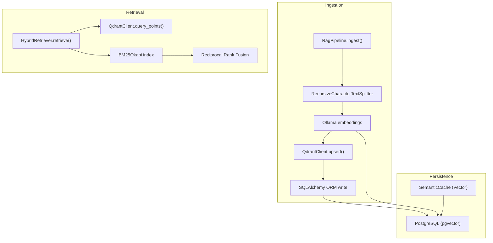
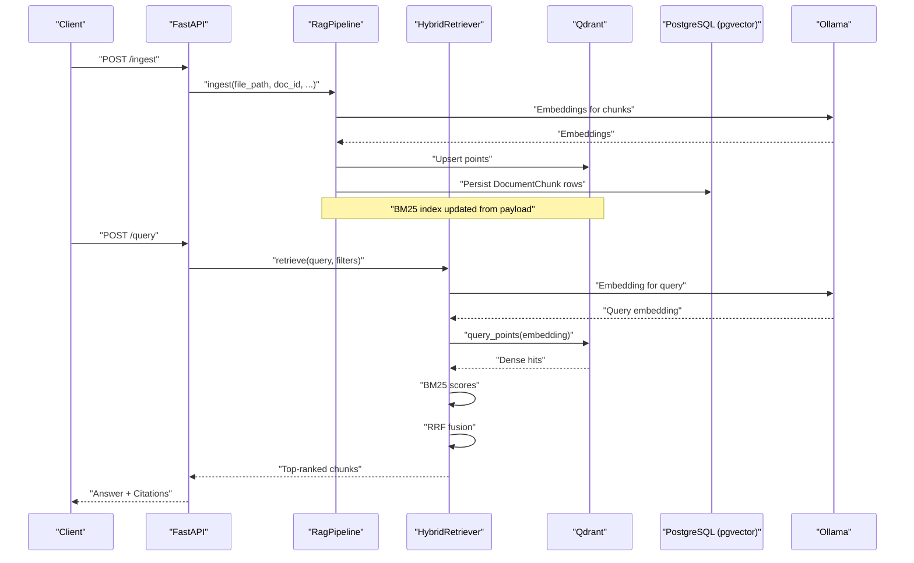
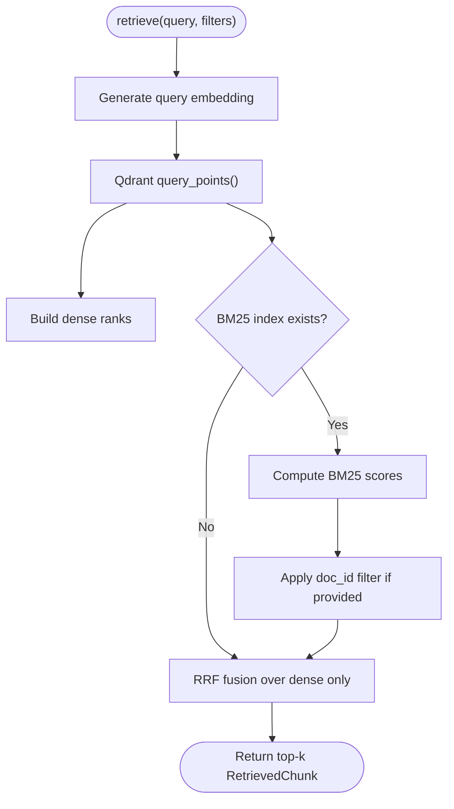
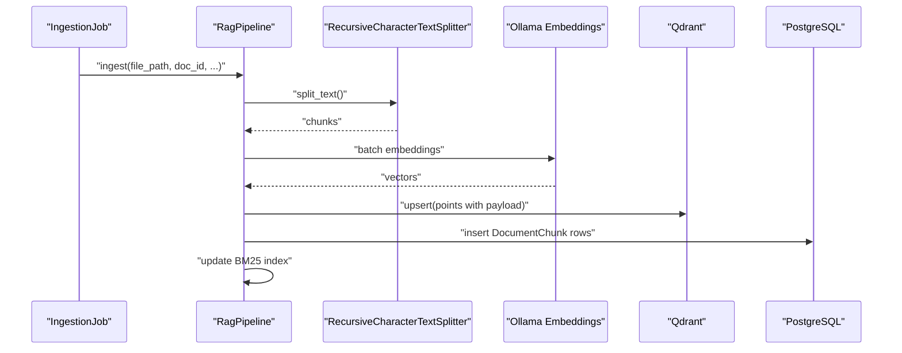
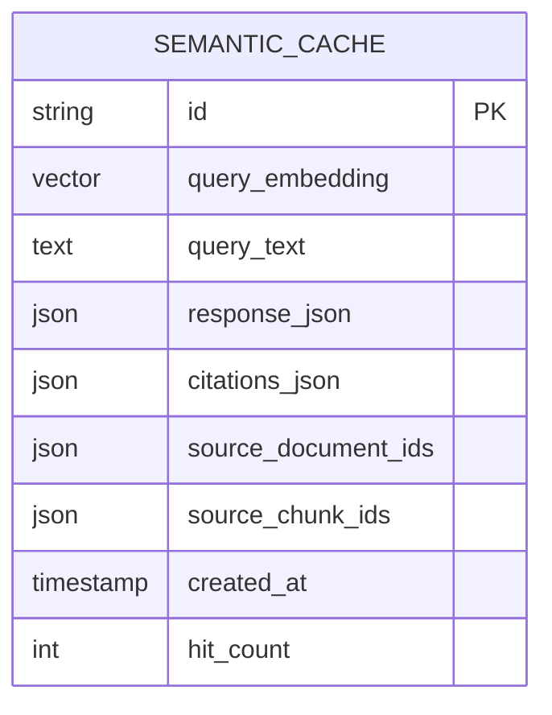
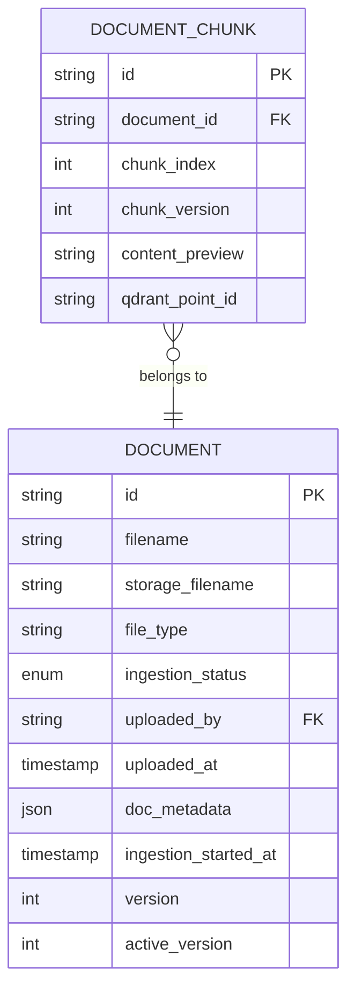
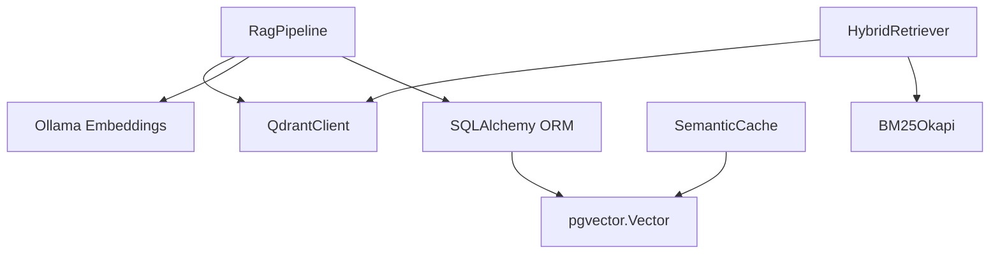

# Vector Storage and Indexing

<cite>
**Referenced Files in This Document**
- [hybrid_retriever.py](file://safe4ai-pilot/app/components/hybrid_retriever.py)
- [rag_pipeline.py](file://safe4ai-pilot/app/services/rag_pipeline.py)
- [ingestion_service.py](file://safe4ai-pilot/app/services/ingestion_service.py)
- [models.py](file://safe4ai-pilot/app/db/models.py)
- [config.py](file://safe4ai-pilot/app/config.py)
- [backup.py](file://safe4ai-pilot/scripts/backup.py)
- [verify_deletion.py](file://safe4ai-pilot/scripts/verify_deletion.py)
- [test_hybrid_retriever.py](file://safe4ai-pilot/tests/test_hybrid_retriever.py)
- [test_integration_containers.py](file://safe4ai-pilot/tests/test_integration_containers.py)
- [pyproject.toml](file://safe4ai-pilot/pyproject.toml)
- [db-layer.md](file://safe4ai-pilot/docs/db-layer.md)
</cite>

## Table of Contents
1. [Introduction](#introduction)
2. [Project Structure](#project-structure)
3. [Core Components](#core-components)
4. [Architecture Overview](#architecture-overview)
5. [Detailed Component Analysis](#detailed-component-analysis)
6. [Dependency Analysis](#dependency-analysis)
7. [Performance Considerations](#performance-considerations)
8. [Troubleshooting Guide](#troubleshooting-guide)
9. [Conclusion](#conclusion)
10. [Appendices](#appendices)

## Introduction
This document explains the vector storage and indexing system built around Qdrant as the primary vector database, integrated with pgvector for hybrid dense/sparse retrieval. It covers collection management, index configuration, vector storage optimization, hybrid retrieval strategies, query optimization, performance tuning, backup and recovery, monitoring, and operational guidance for scaling and capacity planning.

## Project Structure
The vector system spans ingestion, retrieval, and persistence layers:
- Ingestion pipeline extracts, chunks, embeds, and upserts vectors into Qdrant while persisting chunk metadata in PostgreSQL.
- Hybrid retrieval combines dense vector similarity with sparse BM25 ranking and Reciprocal Rank Fusion (RRF).
- pgvector is used for semantic caching of query embeddings to accelerate reuse of prior answers.
- Operational scripts support backup, recovery, and verification of deletions.

**Diagram sources**
- [rag_pipeline.py:62-150](file://safe4ai-pilot/app/services/rag_pipeline.py#L62-L150)
- [hybrid_retriever.py:57-144](file://safe4ai-pilot/app/components/hybrid_retriever.py#L57-L144)
- [models.py:104-116](file://safe4ai-pilot/app/db/models.py#L104-L116)

**Section sources**
- [rag_pipeline.py:34-182](file://safe4ai-pilot/app/services/rag_pipeline.py#L34-L182)
- [hybrid_retriever.py:14-144](file://safe4ai-pilot/app/components/hybrid_retriever.py#L14-L144)
- [models.py:75-116](file://safe4ai-pilot/app/db/models.py#L75-L116)

## Core Components
- HybridRetriever: Performs dense vector search against Qdrant and sparse BM25 ranking, then fuses results via RRF.
- RagPipeline: Orchestrates ingestion, embedding, upsert, chunk persistence, and updates the BM25 index.
- IngestionService: Manages ingestion jobs, status transitions, and recovery of stuck jobs.
- pgvector-backed SemanticCache: Stores query embeddings to enable fast semantic reuse.
- Backup and verification scripts: Provide backup, restore, and deletion verification workflows.

**Section sources**
- [hybrid_retriever.py:14-144](file://safe4ai-pilot/app/components/hybrid_retriever.py#L14-L144)
- [rag_pipeline.py:34-182](file://safe4ai-pilot/app/services/rag_pipeline.py#L34-L182)
- [ingestion_service.py:21-113](file://safe4ai-pilot/app/services/ingestion_service.py#L21-L113)
- [models.py:104-116](file://safe4ai-pilot/app/db/models.py#L104-L116)
- [backup.py:29-87](file://safe4ai-pilot/scripts/backup.py#L29-L87)

## Architecture Overview
The system integrates three pillars:
- Dense vectors in Qdrant for similarity search.
- Sparse BM25 index for lexical matching.
- pgvector for semantic caching of query embeddings.

**Diagram sources**
- [rag_pipeline.py:62-182](file://safe4ai-pilot/app/services/rag_pipeline.py#L62-L182)
- [hybrid_retriever.py:57-144](file://safe4ai-pilot/app/components/hybrid_retriever.py#L57-L144)
- [config.py:7-48](file://safe4ai-pilot/app/config.py#L7-L48)

## Detailed Component Analysis

### Hybrid Retrieval Engine
The HybridRetriever performs:
- Dense retrieval via QdrantClient.query_points with optional doc_id filtering.
- Sparse retrieval via BM25Okapi scoring over indexed chunk contents.
- RRF fusion to combine both signals into a unified ranking.

**Diagram sources**
- [hybrid_retriever.py:57-144](file://safe4ai-pilot/app/components/hybrid_retriever.py#L57-L144)

**Section sources**
- [hybrid_retriever.py:14-144](file://safe4ai-pilot/app/components/hybrid_retriever.py#L14-L144)
- [test_hybrid_retriever.py:56-168](file://safe4ai-pilot/tests/test_hybrid_retriever.py#L56-L168)

### Ingestion Pipeline
The RagPipeline coordinates:
- File parsing and chunking with configurable chunk size and overlap.
- Batched embedding generation via Ollama.
- Qdrant upsert with payload fields for provenance and pagination.
- Persistence of DocumentChunk rows linking to Qdrant point IDs.
- Updating the BM25 index from ingested payloads.

**Diagram sources**
- [rag_pipeline.py:62-150](file://safe4ai-pilot/app/services/rag_pipeline.py#L62-L150)

**Section sources**
- [rag_pipeline.py:34-182](file://safe4ai-pilot/app/services/rag_pipeline.py#L34-L182)
- [ingestion_service.py:21-88](file://safe4ai-pilot/app/services/ingestion_service.py#L21-L88)

### pgvector Integration for Semantic Cache
The SemanticCache table stores query embeddings (Vector type) enabling semantic similarity queries for cached answers. This reduces repeated compute for similar queries.

**Diagram sources**
- [models.py:104-116](file://safe4ai-pilot/app/db/models.py#L104-L116)

**Section sources**
- [models.py:104-116](file://safe4ai-pilot/app/db/models.py#L104-L116)

### Collection Management and Schema Design
- Qdrant collection: "documents" is used for document chunks.
- Payload fields stored per point include doc_id, filename, page_number, chunk_index, content, and OCR quality.
- PostgreSQL schema includes Document, DocumentChunk, and SemanticCache tables with appropriate indices.

**Diagram sources**
- [models.py:75-102](file://safe4ai-pilot/app/db/models.py#L75-L102)
- [db-layer.md:45-70](file://safe4ai-pilot/docs/db-layer.md#L45-L70)

**Section sources**
- [models.py:75-102](file://safe4ai-pilot/app/db/models.py#L75-L102)
- [db-layer.md:45-70](file://safe4ai-pilot/docs/db-layer.md#L45-L70)

## Dependency Analysis
External libraries and integrations:
- Qdrant client for vector operations.
- pgvector for vector column types and similarity search.
- Ollama for embeddings and generation.
- rank-bm25 for sparse BM25 scoring.
- SQLAlchemy for ORM and pgvector integration.

**Diagram sources**
- [pyproject.toml:19-29](file://safe4ai-pilot/pyproject.toml#L19-L29)
- [models.py:3](file://safe4ai-pilot/app/db/models.py#L3)

**Section sources**
- [pyproject.toml:19-29](file://safe4ai-pilot/pyproject.toml#L19-L29)
- [models.py:3](file://safe4ai-pilot/app/db/models.py#L3)

## Performance Considerations
- Chunking strategy: Adjust chunk size and overlap to balance recall and latency. The pipeline uses a fixed chunk size and overlap for all formats.
- Embedding batching: The pipeline batches embeddings to reduce overhead; tune batch size for throughput vs. memory trade-offs.
- Qdrant query limits: Control top_k to bound result sets and reduce downstream processing.
- BM25 index size: Keep BM25 index aligned with the subset of chunks used for retrieval to minimize scoring overhead.
- pgvector similarity thresholds: Configure semantic cache reuse thresholds to balance freshness and performance.
- Concurrency: Asynchronous embedding and retrieval calls improve throughput under load.

[No sources needed since this section provides general guidance]

## Troubleshooting Guide
Common issues and remedies:
- Empty or missing results:
  - Verify Qdrant collection existence and point count.
  - Confirm BM25 index is updated after ingestion.
  - Check doc_id filters applied during retrieval.
- Deletion verification:
  - Use the deletion verification script to confirm removal from both PostgreSQL and Qdrant.
- Container readiness:
  - Ensure pgvector extension is enabled and Qdrant is reachable before starting services.
- Stuck ingestion jobs:
  - Recover stuck jobs by resetting statuses after a threshold.

**Section sources**
- [verify_deletion.py:45-79](file://safe4ai-pilot/scripts/verify_deletion.py#L45-L79)
- [test_integration_containers.py:9-27](file://safe4ai-pilot/tests/test_integration_containers.py#L9-L27)
- [ingestion_service.py:90-113](file://safe4ai-pilot/app/services/ingestion_service.py#L90-L113)

## Conclusion
The system combines Qdrant’s dense vector search with pgvector-backed semantic caching and sparse BM25 ranking to deliver robust hybrid retrieval. Proper collection management, payload design, and operational scripts ensure reliability, scalability, and maintainability for large document collections.

[No sources needed since this section summarizes without analyzing specific files]

## Appendices

### Practical Examples

- Collection configuration
  - Collection name: "documents"
  - Payload fields: doc_id, filename, page_number, chunk_index, content, ocr_quality
  - Reference: [rag_pipeline.py:109-125](file://safe4ai-pilot/app/services/rag_pipeline.py#L109-L125)

- Index maintenance
  - Update BM25 index after ingestion: [rag_pipeline.py:146-149](file://safe4ai-pilot/app/services/rag_pipeline.py#L146-L149)
  - Retrieve with filters: [hybrid_retriever.py:66-85](file://safe4ai-pilot/app/components/hybrid_retriever.py#L66-L85)

- Scaling vector storage
  - Tune chunk size and overlap: [rag_pipeline.py:25-28](file://safe4ai-pilot/app/services/rag_pipeline.py#L25-L28)
  - Control top_k for retrieval: [hybrid_retriever.py:62](file://safe4ai-pilot/app/components/hybrid_retriever.py#L62)

- Backup and recovery
  - Full backup routine: [backup.py:29-87](file://safe4ai-pilot/scripts/backup.py#L29-L87)
  - Delete verification: [verify_deletion.py:45-79](file://safe4ai-pilot/scripts/verify_deletion.py#L45-L79)

- Monitoring vector database health
  - Qdrant readiness check: [test_integration_containers.py:21-27](file://safe4ai-pilot/tests/test_integration_containers.py#L21-L27)
  - pgvector extension presence: [test_integration_containers.py:9-18](file://safe4ai-pilot/tests/test_integration_containers.py#L9-L18)