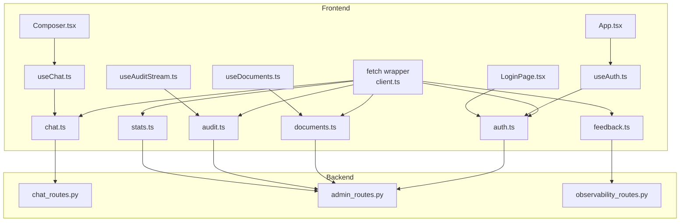
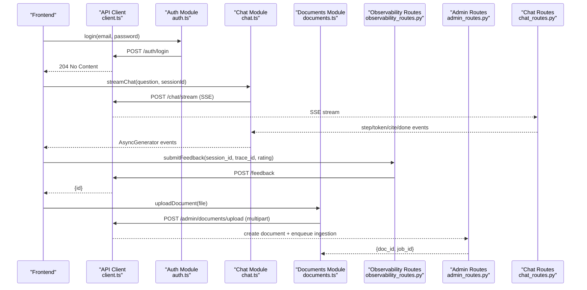
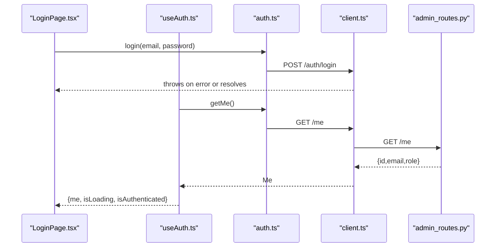
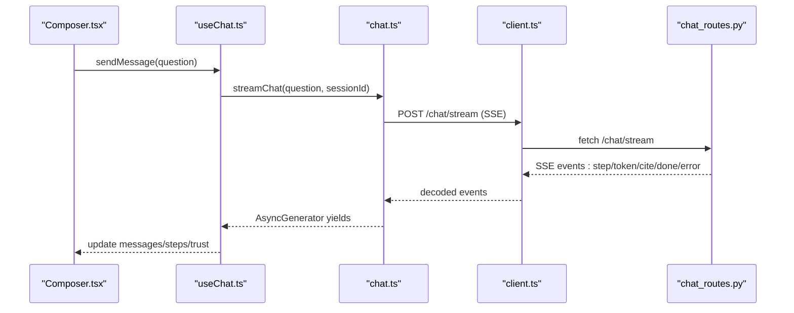
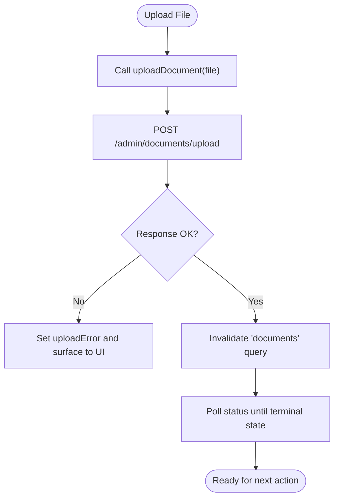
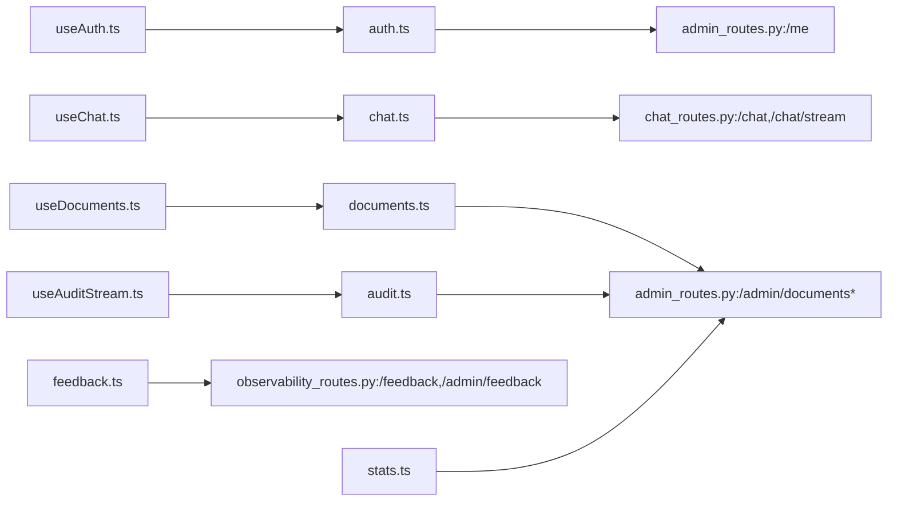

# API Integration

<cite>
**Referenced Files in This Document**
- [client.ts](file://safe4ai-pilot/frontend/src/api/client.ts)
- [auth.ts](file://safe4ai-pilot/frontend/src/api/auth.ts)
- [chat.ts](file://safe4ai-pilot/frontend/src/api/chat.ts)
- [documents.ts](file://safe4ai-pilot/frontend/src/api/documents.ts)
- [feedback.ts](file://safe4ai-pilot/frontend/src/api/feedback.ts)
- [audit.ts](file://safe4ai-pilot/frontend/src/api/audit.ts)
- [stats.ts](file://safe4ai-pilot/frontend/src/api/stats.ts)
- [useAuth.ts](file://safe4ai-pilot/frontend/src/hooks/useAuth.ts)
- [useChat.ts](file://safe4ai-pilot/frontend/src/hooks/useChat.ts)
- [useDocuments.ts](file://safe4ai-pilot/frontend/src/hooks/useDocuments.ts)
- [useAuditStream.ts](file://safe4ai-pilot/frontend/src/hooks/useAuditStream.ts)
- [App.tsx](file://safe4ai-pilot/frontend/src/App.tsx)
- [LoginPage.tsx](file://safe4ai-pilot/frontend/src/pages/LoginPage.tsx)
- [Composer.tsx](file://safe4ai-pilot/frontend/src/components/chat/Composer.tsx)
- [chat_routes.py](file://safe4ai-pilot/app/api/chat_routes.py)
- [admin_routes.py](file://safe4ai-pilot/app/api/admin_routes.py)
- [observability_routes.py](file://safe4ai-pilot/app/api/observability_routes.py)
</cite>

## Table of Contents
1. [Introduction](#introduction)
2. [Project Structure](#project-structure)
3. [Core Components](#core-components)
4. [Architecture Overview](#architecture-overview)
5. [Detailed Component Analysis](#detailed-component-analysis)
6. [Dependency Analysis](#dependency-analysis)
7. [Performance Considerations](#performance-considerations)
8. [Troubleshooting Guide](#troubleshooting-guide)
9. [Conclusion](#conclusion)
10. [Appendices](#appendices)

## Introduction
This document explains the frontend-backend API integration for the Private AI web application. It covers the API client architecture, authentication token handling, request/response patterns, and module-specific integrations for authentication, chat, documents, feedback, audit, and statistics. It also details error handling, loading states, retry mechanisms, backend endpoint mapping, data transformation, caching strategies, and security considerations such as token refresh and CORS handling.

## Project Structure
The frontend API layer is organized under a dedicated folder with one module per domain area. Each module exposes typed functions for requests and transforms backend payloads into frontend-friendly shapes. Hooks integrate with React Query to manage server state, loading, and caching. The backend exposes FastAPI routes grouped by functional domains.

**Diagram sources**
- [client.ts:1-20](file://safe4ai-pilot/frontend/src/api/client.ts#L1-L20)
- [auth.ts:1-17](file://safe4ai-pilot/frontend/src/api/auth.ts#L1-L17)
- [chat.ts:1-76](file://safe4ai-pilot/frontend/src/api/chat.ts#L1-L76)
- [documents.ts:1-68](file://safe4ai-pilot/frontend/src/api/documents.ts#L1-L68)
- [feedback.ts:1-44](file://safe4ai-pilot/frontend/src/api/feedback.ts#L1-L44)
- [audit.ts:1-54](file://safe4ai-pilot/frontend/src/api/audit.ts#L1-L54)
- [stats.ts:1-31](file://safe4ai-pilot/frontend/src/api/stats.ts#L1-L31)
- [useAuth.ts:1-28](file://safe4ai-pilot/frontend/src/hooks/useAuth.ts#L1-L28)
- [useChat.ts:1-106](file://safe4ai-pilot/frontend/src/hooks/useChat.ts#L1-L106)
- [useDocuments.ts:1-61](file://safe4ai-pilot/frontend/src/hooks/useDocuments.ts#L1-L61)
- [useAuditStream.ts:1-17](file://safe4ai-pilot/frontend/src/hooks/useAuditStream.ts#L1-L17)
- [App.tsx:1-100](file://safe4ai-pilot/frontend/src/App.tsx#L1-L100)
- [LoginPage.tsx:1-165](file://safe4ai-pilot/frontend/src/pages/LoginPage.tsx#L1-L165)
- [Composer.tsx:1-69](file://safe4ai-pilot/frontend/src/components/chat/Composer.tsx#L1-L69)
- [chat_routes.py:1-251](file://safe4ai-pilot/app/api/chat_routes.py#L1-L251)
- [admin_routes.py:1-549](file://safe4ai-pilot/app/api/admin_routes.py#L1-L549)
- [observability_routes.py:1-57](file://safe4ai-pilot/app/api/observability_routes.py#L1-L57)

**Section sources**
- [client.ts:1-20](file://safe4ai-pilot/frontend/src/api/client.ts#L1-L20)
- [App.tsx:1-100](file://safe4ai-pilot/frontend/src/App.tsx#L1-L100)

## Core Components
- API client base
  - Centralized fetch wrapper with credentials inclusion and JSON handling.
  - Utility to build absolute URLs from a base environment variable.
  - Automatic error throwing for non-OK responses and special handling for 204 No Content.
- Authentication module
  - Typed user profile shape and endpoints for login, logout, and self-profile retrieval.
- Chat module
  - SSE streaming generator for real-time chat events: step transitions, token deltas, citations, and completion metadata.
- Documents module
  - CRUD-like operations for admin-managed documents with upload via multipart/form-data and status polling.
- Feedback module
  - Submit feedback and list admin-visible feedback items with payload normalization.
- Audit module
  - List audit events with pagination and CSV export endpoint.
- Statistics module
  - Aggregate stats for admin dashboards with data shaping.

**Section sources**
- [client.ts:1-20](file://safe4ai-pilot/frontend/src/api/client.ts#L1-L20)
- [auth.ts:1-17](file://safe4ai-pilot/frontend/src/api/auth.ts#L1-L17)
- [chat.ts:1-76](file://safe4ai-pilot/frontend/src/api/chat.ts#L1-L76)
- [documents.ts:1-68](file://safe4ai-pilot/frontend/src/api/documents.ts#L1-L68)
- [feedback.ts:1-44](file://safe4ai-pilot/frontend/src/api/feedback.ts#L1-L44)
- [audit.ts:1-54](file://safe4ai-pilot/frontend/src/api/audit.ts#L1-L54)
- [stats.ts:1-31](file://safe4ai-pilot/frontend/src/api/stats.ts#L1-L31)

## Architecture Overview
The frontend uses a thin typed API layer built on top of fetch. Hooks integrate with React Query to manage caching, invalidation, and background refetching. The backend exposes REST endpoints grouped by domain, with SSE for streaming chat and CSV export for audit logs.

**Diagram sources**
- [client.ts:1-20](file://safe4ai-pilot/frontend/src/api/client.ts#L1-L20)
- [auth.ts:1-17](file://safe4ai-pilot/frontend/src/api/auth.ts#L1-L17)
- [chat.ts:1-76](file://safe4ai-pilot/frontend/src/api/chat.ts#L1-L76)
- [documents.ts:1-68](file://safe4ai-pilot/frontend/src/api/documents.ts#L1-L68)
- [observability_routes.py:1-57](file://safe4ai-pilot/app/api/observability_routes.py#L1-L57)
- [admin_routes.py:1-549](file://safe4ai-pilot/app/api/admin_routes.py#L1-L549)
- [chat_routes.py:1-251](file://safe4ai-pilot/app/api/chat_routes.py#L1-L251)

## Detailed Component Analysis

### API Client Base
- Purpose: Provide a uniform fetch wrapper with consistent headers, credentials, and error handling.
- Key behaviors:
  - Uses credentials: include to support cookie-based sessions.
  - Throws on non-OK responses with textual error bodies.
  - Treats 204 as undefined return type.
  - Exposes apiUrl helper for constructing absolute URLs from a Vite environment variable.

**Section sources**
- [client.ts:1-20](file://safe4ai-pilot/frontend/src/api/client.ts#L1-L20)

### Authentication Module
- Endpoints:
  - POST /auth/login
  - POST /auth/logout
  - GET /me
- Data model:
  - Me: user identity with role and activity flag.
- Integration:
  - useAuth hook fetches /me with React Query, caches the result, and exposes authentication state and sign-out.

**Diagram sources**
- [LoginPage.tsx:1-165](file://safe4ai-pilot/frontend/src/pages/LoginPage.tsx#L1-L165)
- [useAuth.ts:1-28](file://safe4ai-pilot/frontend/src/hooks/useAuth.ts#L1-L28)
- [auth.ts:1-17](file://safe4ai-pilot/frontend/src/api/auth.ts#L1-L17)
- [client.ts:1-20](file://safe4ai-pilot/frontend/src/api/client.ts#L1-L20)
- [admin_routes.py:546-549](file://safe4ai-pilot/app/api/admin_routes.py#L546-L549)

**Section sources**
- [auth.ts:1-17](file://safe4ai-pilot/frontend/src/api/auth.ts#L1-L17)
- [useAuth.ts:1-28](file://safe4ai-pilot/frontend/src/hooks/useAuth.ts#L1-L28)
- [admin_routes.py:546-549](file://safe4ai-pilot/app/api/admin_routes.py#L546-L549)

### Chat Module
- Streaming events:
  - step: step name/state transitions.
  - token: incremental answer token deltas.
  - cite: citation metadata emitted after tokens.
  - done: completion metadata including traceId, latency, cache flag, model, kRetrieved, and sessionId.
  - error: emitted when the backend fails to stream.
- Frontend consumption:
  - useChat orchestrates optimistic UI updates, tracks streaming state, manages session ids, and attaches trust metrics upon completion.
  - Supports cancellation via AbortController.

**Diagram sources**
- [Composer.tsx:1-69](file://safe4ai-pilot/frontend/src/components/chat/Composer.tsx#L1-L69)
- [useChat.ts:1-106](file://safe4ai-pilot/frontend/src/hooks/useChat.ts#L1-L106)
- [chat.ts:1-76](file://safe4ai-pilot/frontend/src/api/chat.ts#L1-L76)
- [client.ts:1-20](file://safe4ai-pilot/frontend/src/api/client.ts#L1-L20)
- [chat_routes.py:156-251](file://safe4ai-pilot/app/api/chat_routes.py#L156-L251)

**Section sources**
- [chat.ts:1-76](file://safe4ai-pilot/frontend/src/api/chat.ts#L1-L76)
- [useChat.ts:1-106](file://safe4ai-pilot/frontend/src/hooks/useChat.ts#L1-L106)
- [chat_routes.py:156-251](file://safe4ai-pilot/app/api/chat_routes.py#L156-L251)

### Documents Module
- Operations:
  - GET /admin/documents: list documents with ingestion metadata.
  - GET /admin/documents/:id/status: poll ingestion status.
  - POST /admin/documents/upload: upload file (multipart/form-data).
  - DELETE /admin/documents/:id: delete document.
  - POST /admin/documents/:id/reindex: re-ingest.
- Frontend behavior:
  - useDocuments integrates with React Query to refetch periodically and poll statuses until terminal states.
  - Provides optimistic UI during uploads and reindexes.

**Diagram sources**
- [documents.ts:1-68](file://safe4ai-pilot/frontend/src/api/documents.ts#L1-L68)
- [useDocuments.ts:1-61](file://safe4ai-pilot/frontend/src/hooks/useDocuments.ts#L1-L61)
- [admin_routes.py:67-121](file://safe4ai-pilot/app/api/admin_routes.py#L67-L121)

**Section sources**
- [documents.ts:1-68](file://safe4ai-pilot/frontend/src/api/documents.ts#L1-L68)
- [useDocuments.ts:1-61](file://safe4ai-pilot/frontend/src/hooks/useDocuments.ts#L1-L61)
- [admin_routes.py:67-121](file://safe4ai-pilot/app/api/admin_routes.py#L67-L121)

### Feedback Module
- Endpoints:
  - POST /feedback: submit feedback with session_id, trace_id, rating, optional comment.
  - GET /admin/feedback: list feedback for admin.
- Frontend:
  - useChat triggers feedback submission after a message is rated.
  - useAuditStream lists audit logs for admin dashboards.

**Section sources**
- [feedback.ts:1-44](file://safe4ai-pilot/frontend/src/api/feedback.ts#L1-L44)
- [useChat.ts:95-102](file://safe4ai-pilot/frontend/src/hooks/useChat.ts#L95-L102)
- [useAuditStream.ts:1-17](file://safe4ai-pilot/frontend/src/hooks/useAuditStream.ts#L1-L17)
- [observability_routes.py:26-46](file://safe4ai-pilot/app/api/observability_routes.py#L26-L46)

### Audit Module
- Endpoints:
  - GET /admin/audit-logs: paginated audit log listing.
  - GET /admin/audit-logs/export.csv: CSV export.
- Frontend:
  - useAuditStream fetches pages with a fixed limit and refetch interval.

**Section sources**
- [audit.ts:1-54](file://safe4ai-pilot/frontend/src/api/audit.ts#L1-L54)
- [useAuditStream.ts:1-17](file://safe4ai-pilot/frontend/src/hooks/useAuditStream.ts#L1-L17)
- [admin_routes.py:359-432](file://safe4ai-pilot/app/api/admin_routes.py#L359-L432)

### Statistics Module
- Endpoint:
  - GET /admin/stats: aggregate stats for admin dashboard.
- Frontend:
  - Normalizes backend fields into a typed StatsToday shape.

**Section sources**
- [stats.ts:1-31](file://safe4ai-pilot/frontend/src/api/stats.ts#L1-L31)
- [admin_routes.py:439-467](file://safe4ai-pilot/app/api/admin_routes.py#L439-L467)

## Dependency Analysis
- Frontend-to-Backend mapping
  - Auth: /auth/login, /auth/logout, /me
  - Chat: /chat (blocking), /chat/stream (SSE)
  - Documents: /admin/documents/* endpoints
  - Feedback: /feedback, /admin/feedback
  - Audit: /admin/audit-logs, /admin/audit-logs/export.csv
  - Stats: /admin/stats
- Coupling and cohesion
  - Modules are cohesive around domain areas and loosely coupled via HTTP endpoints.
  - Hooks centralize caching and refetching policies, reducing duplication across components.

**Diagram sources**
- [useAuth.ts:1-28](file://safe4ai-pilot/frontend/src/hooks/useAuth.ts#L1-L28)
- [useChat.ts:1-106](file://safe4ai-pilot/frontend/src/hooks/useChat.ts#L1-L106)
- [useDocuments.ts:1-61](file://safe4ai-pilot/frontend/src/hooks/useDocuments.ts#L1-L61)
- [useAuditStream.ts:1-17](file://safe4ai-pilot/frontend/src/hooks/useAuditStream.ts#L1-L17)
- [auth.ts:1-17](file://safe4ai-pilot/frontend/src/api/auth.ts#L1-L17)
- [chat.ts:1-76](file://safe4ai-pilot/frontend/src/api/chat.ts#L1-L76)
- [documents.ts:1-68](file://safe4ai-pilot/frontend/src/api/documents.ts#L1-L68)
- [feedback.ts:1-44](file://safe4ai-pilot/frontend/src/api/feedback.ts#L1-L44)
- [audit.ts:1-54](file://safe4ai-pilot/frontend/src/api/audit.ts#L1-L54)
- [stats.ts:1-31](file://safe4ai-pilot/frontend/src/api/stats.ts#L1-L31)
- [admin_routes.py:1-549](file://safe4ai-pilot/app/api/admin_routes.py#L1-L549)
- [chat_routes.py:1-251](file://safe4ai-pilot/app/api/chat_routes.py#L1-L251)
- [observability_routes.py:1-57](file://safe4ai-pilot/app/api/observability_routes.py#L1-L57)

**Section sources**
- [admin_routes.py:1-549](file://safe4ai-pilot/app/api/admin_routes.py#L1-L549)
- [chat_routes.py:1-251](file://safe4ai-pilot/app/api/chat_routes.py#L1-L251)
- [observability_routes.py:1-57](file://safe4ai-pilot/app/api/observability_routes.py#L1-L57)

## Performance Considerations
- Caching and refetching
  - useAuth: single query with retry disabled to avoid repeated login attempts.
  - useDocuments: periodic refetch and targeted polling for long-running ingestion jobs.
  - useAuditStream: fixed refetch interval for near-real-time audit feed.
- Streaming
  - Chat SSE minimizes UI thrash by batching token deltas and emitting structured events.
- Backend limits
  - Rate limiting applied on several endpoints to prevent abuse.

**Section sources**
- [useAuth.ts:8-12](file://safe4ai-pilot/frontend/src/hooks/useAuth.ts#L8-L12)
- [useDocuments.ts:10-15](file://safe4ai-pilot/frontend/src/hooks/useDocuments.ts#L10-L15)
- [useAuditStream.ts:9-13](file://safe4ai-pilot/frontend/src/hooks/useAuditStream.ts#L9-L13)
- [admin_routes.py:67-121](file://safe4ai-pilot/app/api/admin_routes.py#L67-L121)
- [chat_routes.py:156-251](file://safe4ai-pilot/app/api/chat_routes.py#L156-L251)

## Troubleshooting Guide
- Authentication failures
  - LoginPage surfaces server-side validation errors after login attempts.
  - useAuth clears the cache and navigates to login on sign out.
- Chat streaming errors
  - The SSE parser warns on malformed event data and yields an error event to the consumer.
  - useChat displays error messages in the assistant message and stops streaming.
- Document upload errors
  - useDocuments sets a user-facing error message when upload fails and retries are not attempted automatically.
- Audit and stats
  - useAuditStream paginates with a fixed limit and refetch interval; adjust page and start parameters as needed.

**Section sources**
- [LoginPage.tsx:26-35](file://safe4ai-pilot/frontend/src/pages/LoginPage.tsx#L26-L35)
- [useAuth.ts:14-18](file://safe4ai-pilot/frontend/src/hooks/useAuth.ts#L14-L18)
- [chat.ts:64-71](file://safe4ai-pilot/frontend/src/api/chat.ts#L64-L71)
- [useChat.ts:83-87](file://safe4ai-pilot/frontend/src/hooks/useChat.ts#L83-L87)
- [useDocuments.ts:28-37](file://safe4ai-pilot/frontend/src/hooks/useDocuments.ts#L28-L37)
- [useAuditStream.ts:9-13](file://safe4ai-pilot/frontend/src/hooks/useAuditStream.ts#L9-L13)

## Conclusion
The frontend API layer provides a clean, typed interface over REST and SSE, integrated with React Query for robust caching and refetching. The backend routes are organized by domain and include streaming and export capabilities. Together, they enable secure, responsive interactions with strong separation of concerns.

## Appendices

### Request/Response Patterns and Data Transformation
- Base fetch wrapper
  - Ensures credentials and JSON headers, throws on non-OK responses, and handles 204.
- Data shaping
  - Documents: raw fields mapped to normalized DocumentRecord.
  - Feedback: raw fields mapped to normalized FeedbackItem.
  - Audit: raw fields mapped to normalized AuditEvent.
  - Stats: raw fields mapped to normalized StatsToday.

**Section sources**
- [client.ts:3-15](file://safe4ai-pilot/frontend/src/api/client.ts#L3-L15)
- [documents.ts:29-41](file://safe4ai-pilot/frontend/src/api/documents.ts#L29-L41)
- [feedback.ts:20-43](file://safe4ai-pilot/frontend/src/api/feedback.ts#L20-L43)
- [audit.ts:34-50](file://safe4ai-pilot/frontend/src/api/audit.ts#L34-L50)
- [stats.ts:20-30](file://safe4ai-pilot/frontend/src/api/stats.ts#L20-L30)

### Security Considerations
- Token handling
  - Credentials include enables cookie-based session persistence across subdomains.
- CORS
  - Not explicitly configured in the frontend; relies on backend serving from the same origin or appropriate CORS headers.
- Rate limiting
  - Several endpoints apply rate limits to protect resources.

**Section sources**
- [client.ts:4-8](file://safe4ai-pilot/frontend/src/api/client.ts#L4-L8)
- [admin_routes.py:67-121](file://safe4ai-pilot/app/api/admin_routes.py#L67-L121)
- [chat_routes.py:156-251](file://safe4ai-pilot/app/api/chat_routes.py#L156-L251)

### Practical Examples

- Making an authenticated request
  - Use the auth module’s login function; on success, invalidate the “me” query to refresh user state.
  - Reference: [LoginPage.tsx:26-35](file://safe4ai-pilot/frontend/src/pages/LoginPage.tsx#L26-L35), [useAuth.ts:8-12](file://safe4ai-pilot/frontend/src/hooks/useAuth.ts#L8-L12)

- Handling API errors
  - Wrap login in try/catch to capture server-side validation errors.
  - Reference: [LoginPage.tsx:26-35](file://safe4ai-pilot/frontend/src/pages/LoginPage.tsx#L26-L35)

- Implementing optimistic updates
  - useChat optimistically appends user and assistant messages and updates content incrementally as tokens arrive.
  - useDocuments optimistically marks a document as “embedding” during polling.
  - References: [useChat.ts:30-93](file://safe4ai-pilot/frontend/src/hooks/useChat.ts#L30-L93), [useDocuments.ts:49-53](file://safe4ai-pilot/frontend/src/hooks/useDocuments.ts#L49-L53)

- Streaming chat events
  - Iterate over streamChat to react to step, token, cite, done, and error events.
  - Reference: [chat.ts:21-76](file://safe4ai-pilot/frontend/src/api/chat.ts#L21-L76)

- Uploading a document
  - Call uploadDocument with a File; invalidate the documents query and poll status until terminal state.
  - Reference: [documents.ts:49-61](file://safe4ai-pilot/frontend/src/api/documents.ts#L49-L61), [useDocuments.ts:28-37](file://safe4ai-pilot/frontend/src/hooks/useDocuments.ts#L28-L37)