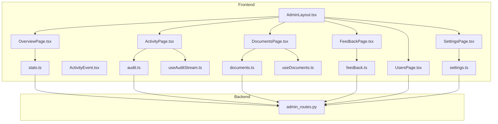
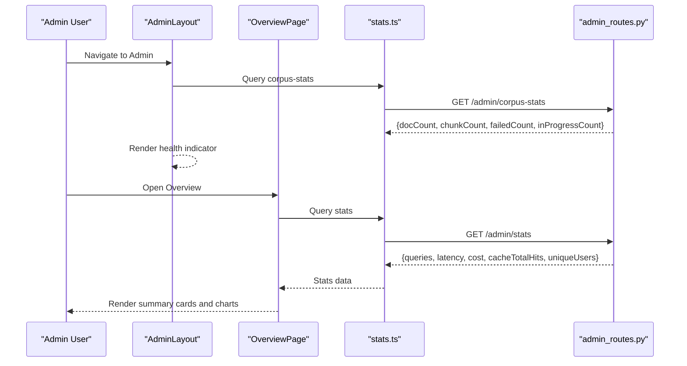
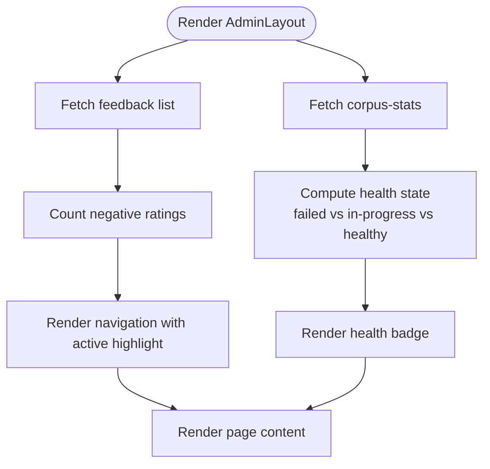
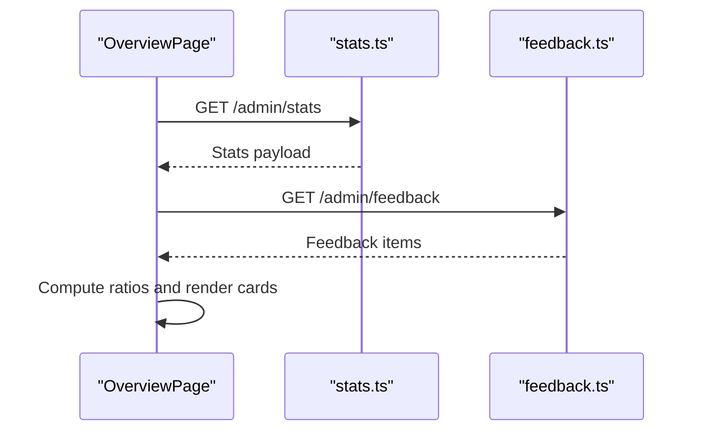
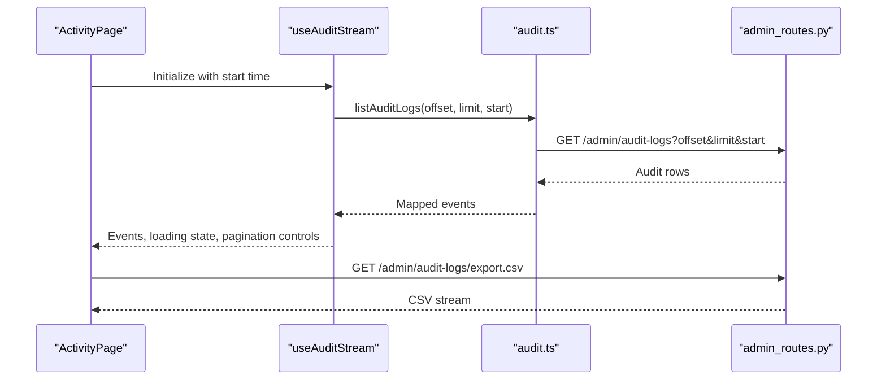
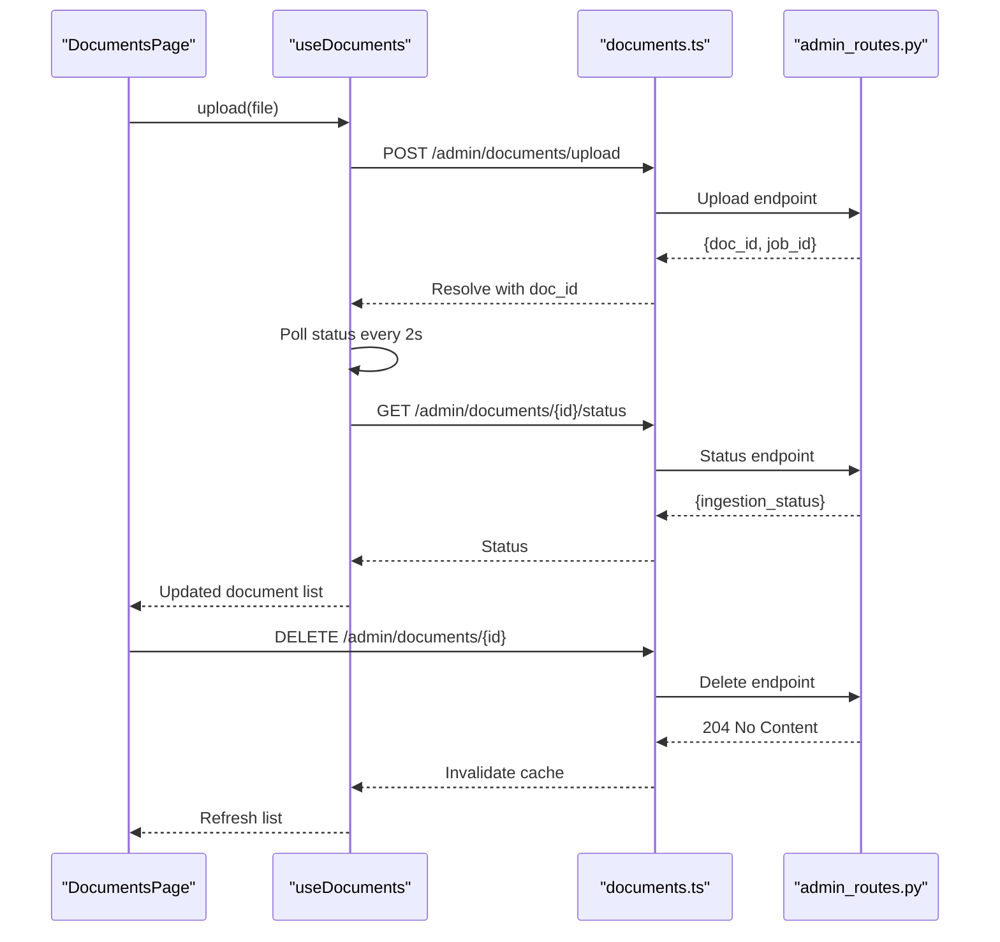
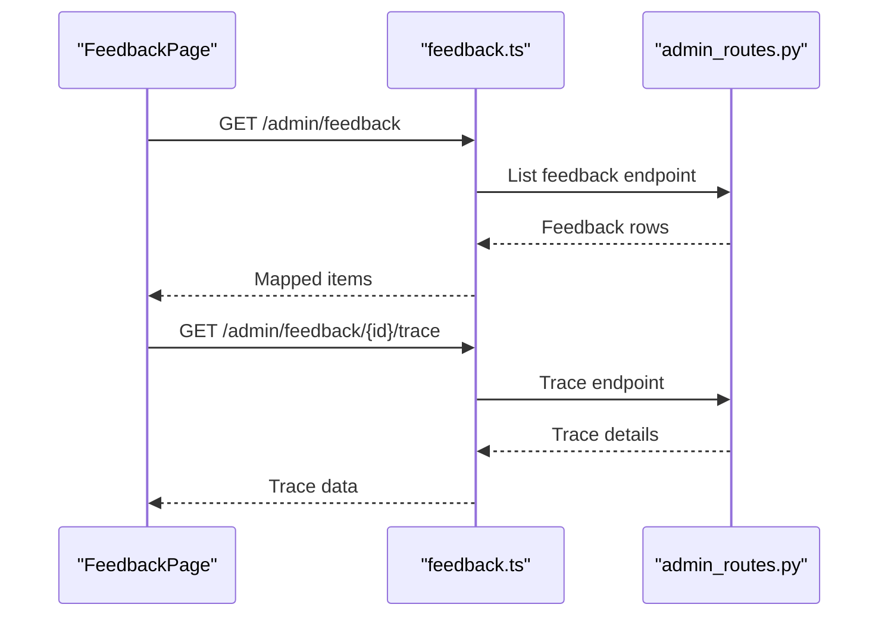
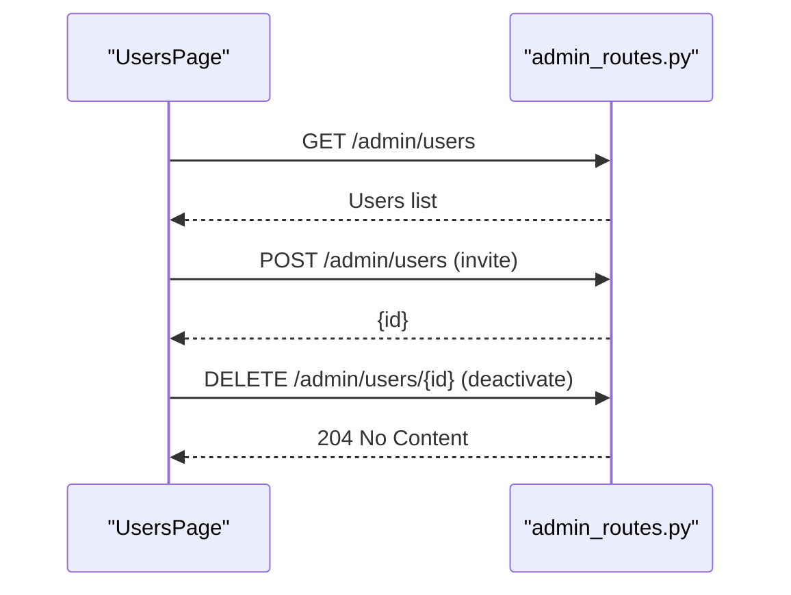
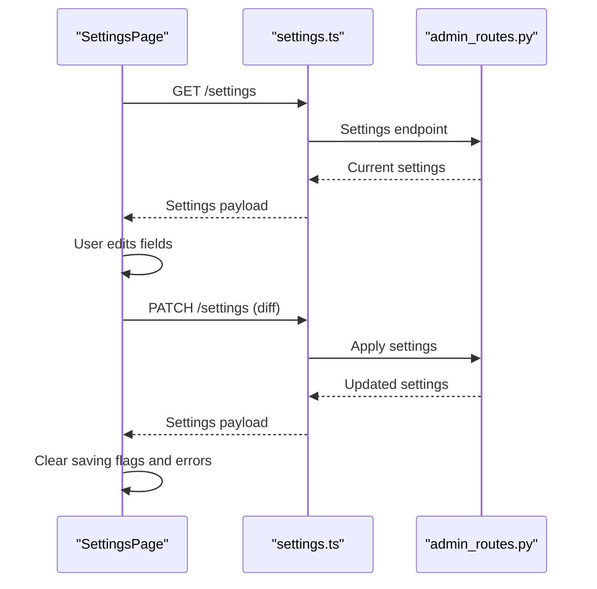
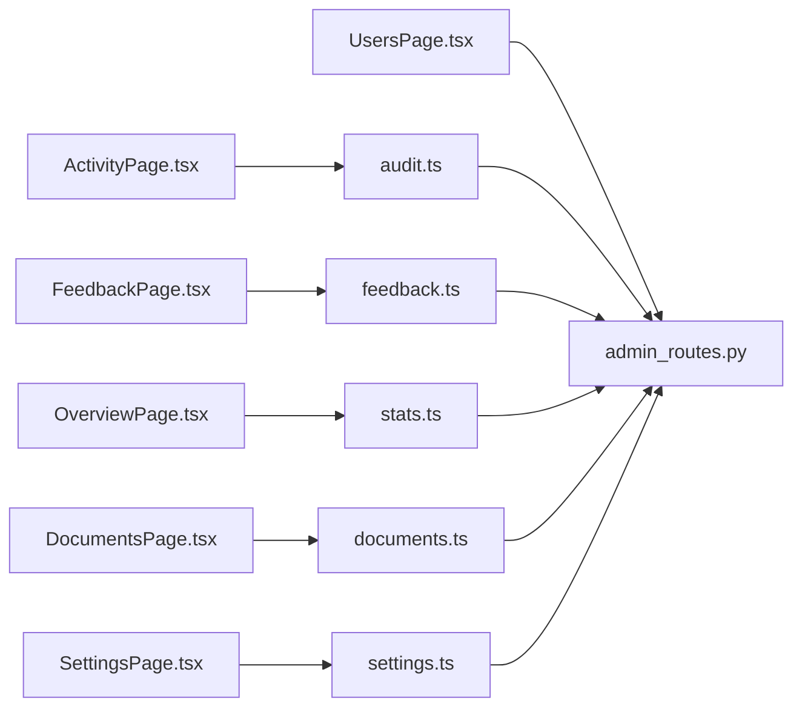

# Admin Dashboard

<cite>
**Referenced Files in This Document**
- [AdminLayout.tsx](file://safe4ai-pilot/frontend/src/pages/admin/AdminLayout.tsx)
- [OverviewPage.tsx](file://safe4ai-pilot/frontend/src/pages/admin/OverviewPage.tsx)
- [ActivityPage.tsx](file://safe4ai-pilot/frontend/src/pages/admin/ActivityPage.tsx)
- [DocumentsPage.tsx](file://safe4ai-pilot/frontend/src/pages/admin/DocumentsPage.tsx)
- [FeedbackPage.tsx](file://safe4ai-pilot/frontend/src/pages/admin/FeedbackPage.tsx)
- [UsersPage.tsx](file://safe4ai-pilot/frontend/src/pages/admin/UsersPage.tsx)
- [SettingsPage.tsx](file://safe4ai-pilot/frontend/src/pages/admin/SettingsPage.tsx)
- [ActivityEvent.tsx](file://safe4ai-pilot/frontend/src/components/admin/ActivityEvent.tsx)
- [useAuditStream.ts](file://safe4ai-pilot/frontend/src/hooks/useAuditStream.ts)
- [useDocuments.ts](file://safe4ai-pilot/frontend/src/hooks/useDocuments.ts)
- [audit.ts](file://safe4ai-pilot/frontend/src/api/audit.ts)
- [feedback.ts](file://safe4ai-pilot/frontend/src/api/feedback.ts)
- [stats.ts](file://safe4ai-pilot/frontend/src/api/stats.ts)
- [settings.ts](file://safe4ai-pilot/frontend/src/api/settings.ts)
- [documents.ts](file://safe4ai-pilot/frontend/src/api/documents.ts)
- [admin_routes.py](file://safe4ai-pilot/app/api/admin_routes.py)
</cite>

## Table of Contents
1. [Introduction](#introduction)
2. [Project Structure](#project-structure)
3. [Core Components](#core-components)
4. [Architecture Overview](#architecture-overview)
5. [Detailed Component Analysis](#detailed-component-analysis)
6. [Dependency Analysis](#dependency-analysis)
7. [Performance Considerations](#performance-considerations)
8. [Troubleshooting Guide](#troubleshooting-guide)
9. [Conclusion](#conclusion)

## Introduction
The Admin Dashboard provides a centralized interface for administrators to monitor system health, manage content, oversee user activity, moderate feedback, manage team members, and configure system-wide settings. Built with React and TypeScript on the frontend and FastAPI on the backend, it offers real-time insights, robust filtering, and streamlined administrative workflows.

## Project Structure
The admin dashboard spans three primary areas:
- Frontend pages under `/frontend/src/pages/admin/` implementing dedicated views for overview, activity, documents, feedback, users, and settings.
- Shared components under `/frontend/src/components/admin/` for reusable UI elements like activity timelines and settings sections.
- Hooks and APIs under `/frontend/src/hooks/` and `/frontend/src/api/` managing data fetching, caching, and mutations.
- Backend routes under `/app/api/admin_routes.py` exposing admin endpoints for stats, audit logs, documents, users, and settings.

**Diagram sources**
- [AdminLayout.tsx:26-134](file://safe4ai-pilot/frontend/src/pages/admin/AdminLayout.tsx#L26-L134)
- [OverviewPage.tsx:19-178](file://safe4ai-pilot/frontend/src/pages/admin/OverviewPage.tsx#L19-L178)
- [ActivityPage.tsx:38-182](file://safe4ai-pilot/frontend/src/pages/admin/ActivityPage.tsx#L38-L182)
- [DocumentsPage.tsx:17-255](file://safe4ai-pilot/frontend/src/pages/admin/DocumentsPage.tsx#L17-L255)
- [FeedbackPage.tsx:20-206](file://safe4ai-pilot/frontend/src/pages/admin/FeedbackPage.tsx#L20-L206)
- [UsersPage.tsx:307-494](file://safe4ai-pilot/frontend/src/pages/admin/UsersPage.tsx#L307-L494)
- [SettingsPage.tsx:92-546](file://safe4ai-pilot/frontend/src/pages/admin/SettingsPage.tsx#L92-L546)
- [ActivityEvent.tsx:21-82](file://safe4ai-pilot/frontend/src/components/admin/ActivityEvent.tsx#L21-L82)
- [useAuditStream.ts:5-16](file://safe4ai-pilot/frontend/src/hooks/useAuditStream.ts#L5-L16)
- [useDocuments.ts:5-108](file://safe4ai-pilot/frontend/src/hooks/useDocuments.ts#L5-L108)
- [audit.ts:34-53](file://safe4ai-pilot/frontend/src/api/audit.ts#L34-L53)
- [feedback.ts:32-59](file://safe4ai-pilot/frontend/src/api/feedback.ts#L32-L59)
- [stats.ts:23-34](file://safe4ai-pilot/frontend/src/api/stats.ts#L23-L34)
- [settings.ts:90-102](file://safe4ai-pilot/frontend/src/api/settings.ts#L90-L102)
- [documents.ts:58-88](file://safe4ai-pilot/frontend/src/api/documents.ts#L58-L88)
- [admin_routes.py:237-780](file://safe4ai-pilot/app/api/admin_routes.py#L237-L780)

**Section sources**
- [AdminLayout.tsx:1-135](file://safe4ai-pilot/frontend/src/pages/admin/AdminLayout.tsx#L1-L135)
- [admin_routes.py:52-866](file://safe4ai-pilot/app/api/admin_routes.py#L52-L866)

## Core Components
- AdminLayout: Provides the sidebar navigation, active route highlighting, negative feedback badge, corpus health indicator, and user profile/sign-out controls. It wraps all admin pages and manages shared state like feedback counts and corpus statistics.
- OverviewPage: Displays system summaries including traffic metrics, quality indicators, recent negative feedback, and cost breakdowns, powered by stats and feedback APIs.
- ActivityPage: Streams audit events with filtering by kind and time range, pagination, and CSV export capabilities.
- DocumentsPage: Manages document uploads, drag-and-drop support, status monitoring, reindexing, deletion, and inspector panel for selected documents.
- FeedbackPage: Lists user feedback with filtering, selection, and trace lookup to correlate feedback with audit events.
- UsersPage: Lists users, filters by status, invites new users with secure password generation, and deactivates existing users with confirmation modals.
- SettingsPage: Centralized configuration UI for providers, models, retrieval parameters, document sources, security, and cost controls with optimistic updates and batched saves.

**Section sources**
- [AdminLayout.tsx:26-134](file://safe4ai-pilot/frontend/src/pages/admin/AdminLayout.tsx#L26-L134)
- [OverviewPage.tsx:19-178](file://safe4ai-pilot/frontend/src/pages/admin/OverviewPage.tsx#L19-L178)
- [ActivityPage.tsx:38-182](file://safe4ai-pilot/frontend/src/pages/admin/ActivityPage.tsx#L38-L182)
- [DocumentsPage.tsx:17-255](file://safe4ai-pilot/frontend/src/pages/admin/DocumentsPage.tsx#L17-L255)
- [FeedbackPage.tsx:20-206](file://safe4ai-pilot/frontend/src/pages/admin/FeedbackPage.tsx#L20-L206)
- [UsersPage.tsx:307-494](file://safe4ai-pilot/frontend/src/pages/admin/UsersPage.tsx#L307-L494)
- [SettingsPage.tsx:92-546](file://safe4ai-pilot/frontend/src/pages/admin/SettingsPage.tsx#L92-L546)

## Architecture Overview
The admin dashboard follows a layered architecture:
- Presentation Layer: React pages and components render UI and orchestrate user interactions.
- Data Layer: React Query manages caching, background refetching, and optimistic updates for admin data.
- API Layer: Frontend API modules encapsulate HTTP requests to backend endpoints.
- Business Logic Layer: Backend FastAPI routes implement admin-specific operations with database and external service integrations.

**Diagram sources**
- [AdminLayout.tsx:29-42](file://safe4ai-pilot/frontend/src/pages/admin/AdminLayout.tsx#L29-L42)
- [OverviewPage.tsx:20-54](file://safe4ai-pilot/frontend/src/pages/admin/OverviewPage.tsx#L20-L54)
- [stats.ts:23-34](file://safe4ai-pilot/frontend/src/api/stats.ts#L23-L34)
- [admin_routes.py:736-779](file://safe4ai-pilot/app/api/admin_routes.py#L736-L779)

## Detailed Component Analysis

### AdminLayout
- Responsibilities:
  - Renders sidebar navigation with icons and labels.
  - Highlights the active route based on current location.
  - Fetches and displays negative feedback count badge.
  - Shows corpus health status with color-coded indicators and tooltips.
  - Integrates user avatar and logout functionality.
- Data flows:
  - Uses React Router for navigation.
  - Uses TanStack Query for background polling of feedback and corpus stats.
  - Passes children to render page content.

**Diagram sources**
- [AdminLayout.tsx:26-134](file://safe4ai-pilot/frontend/src/pages/admin/AdminLayout.tsx#L26-L134)

**Section sources**
- [AdminLayout.tsx:26-134](file://safe4ai-pilot/frontend/src/pages/admin/AdminLayout.tsx#L26-L134)

### OverviewPage
- Responsibilities:
  - Displays system summary cards for queries, unique users, and cost metrics.
  - Shows average latency and cache absorption statistics.
  - Presents quality metrics including helpfulness ratio and distribution chart.
  - Lists recent negative feedback items with trace correlation.
- Data sources:
  - Stats API for traffic, latency, cache hits, and costs.
  - Feedback API for rating distribution and recent items.

**Diagram sources**
- [OverviewPage.tsx:19-178](file://safe4ai-pilot/frontend/src/pages/admin/OverviewPage.tsx#L19-L178)
- [stats.ts:23-34](file://safe4ai-pilot/frontend/src/api/stats.ts#L23-L34)
- [feedback.ts:32-46](file://safe4ai-pilot/frontend/src/api/feedback.ts#L32-L46)

**Section sources**
- [OverviewPage.tsx:19-178](file://safe4ai-pilot/frontend/src/pages/admin/OverviewPage.tsx#L19-L178)

### ActivityPage
- Responsibilities:
  - Streams audit events with pagination and live polling.
  - Filters by event kind (query, upload, feedback, auth, fallback).
  - Filters by time range (last hour, today, last 7 days, last 30 days).
  - Exports audit logs to CSV.
- Data flow:
  - Uses a custom hook to manage page state and query parameters.
  - Maps backend audit records to frontend event model.

**Diagram sources**
- [ActivityPage.tsx:38-182](file://safe4ai-pilot/frontend/src/pages/admin/ActivityPage.tsx#L38-L182)
- [useAuditStream.ts:5-16](file://safe4ai-pilot/frontend/src/hooks/useAuditStream.ts#L5-L16)
- [audit.ts:34-53](file://safe4ai-pilot/frontend/src/api/audit.ts#L34-L53)
- [admin_routes.py:630-728](file://safe4ai-pilot/app/api/admin_routes.py#L630-L728)

**Section sources**
- [ActivityPage.tsx:38-182](file://safe4ai-pilot/frontend/src/pages/admin/ActivityPage.tsx#L38-L182)
- [ActivityEvent.tsx:21-82](file://safe4ai-pilot/frontend/src/components/admin/ActivityEvent.tsx#L21-L82)
- [useAuditStream.ts:5-16](file://safe4ai-pilot/frontend/src/hooks/useAuditStream.ts#L5-L16)
- [audit.ts:34-53](file://safe4ai-pilot/frontend/src/api/audit.ts#L34-L53)
- [admin_routes.py:630-728](file://safe4ai-pilot/app/api/admin_routes.py#L630-L728)

### DocumentsPage
- Responsibilities:
  - Uploads documents via drag-and-drop or file picker.
  - Monitors ingestion progress with polling and status updates.
  - Allows reindexing and deletion with confirmation modals.
  - Displays document list with metadata and status chips.
- Data flow:
  - Uses a custom hook to coordinate uploads, polling, and mutations.
  - Maps backend document records to frontend model.

**Diagram sources**
- [DocumentsPage.tsx:17-255](file://safe4ai-pilot/frontend/src/pages/admin/DocumentsPage.tsx#L17-L255)
- [useDocuments.ts:5-108](file://safe4ai-pilot/frontend/src/hooks/useDocuments.ts#L5-L108)
- [documents.ts:64-88](file://safe4ai-pilot/frontend/src/api/documents.ts#L64-L88)
- [admin_routes.py:172-466](file://safe4ai-pilot/app/api/admin_routes.py#L172-L466)

**Section sources**
- [DocumentsPage.tsx:17-255](file://safe4ai-pilot/frontend/src/pages/admin/DocumentsPage.tsx#L17-L255)
- [useDocuments.ts:5-108](file://safe4ai-pilot/frontend/src/hooks/useDocuments.ts#L5-L108)
- [documents.ts:58-88](file://safe4ai-pilot/frontend/src/api/documents.ts#L58-L88)
- [admin_routes.py:172-466](file://safe4ai-pilot/app/api/admin_routes.py#L172-L466)

### FeedbackPage
- Responsibilities:
  - Lists feedback items with filtering by rating.
  - Shows user details and trace correlation.
  - Navigates between feedback items and closes detail view.
- Data flow:
  - Fetches feedback list and selected trace via API.

**Diagram sources**
- [FeedbackPage.tsx:20-206](file://safe4ai-pilot/frontend/src/pages/admin/FeedbackPage.tsx#L20-L206)
- [feedback.ts:32-59](file://safe4ai-pilot/frontend/src/api/feedback.ts#L32-L59)
- [admin_routes.py:800-866](file://safe4ai-pilot/app/api/admin_routes.py#L800-L866)

**Section sources**
- [FeedbackPage.tsx:20-206](file://safe4ai-pilot/frontend/src/pages/admin/FeedbackPage.tsx#L20-L206)
- [feedback.ts:32-59](file://safe4ai-pilot/frontend/src/api/feedback.ts#L32-L59)

### UsersPage
- Responsibilities:
  - Lists users with role and status badges.
  - Filters by active/inactive/all.
  - Searches by name or email.
  - Invites new users with auto-generated secure passwords.
  - Deactivates users with confirmation modal.
- Data flow:
  - Uses React Query for listing and mutations.
  - Generates temporary passwords client-side for secure sharing.

**Diagram sources**
- [UsersPage.tsx:307-494](file://safe4ai-pilot/frontend/src/pages/admin/UsersPage.tsx#L307-L494)
- [admin_routes.py:508-596](file://safe4ai-pilot/app/api/admin_routes.py#L508-L596)

**Section sources**
- [UsersPage.tsx:307-494](file://safe4ai-pilot/frontend/src/pages/admin/UsersPage.tsx#L307-L494)
- [admin_routes.py:508-596](file://safe4ai-pilot/app/api/admin_routes.py#L508-L596)

### SettingsPage
- Responsibilities:
  - Centralized configuration UI for providers, models, retrieval, sources, security, and cost controls.
  - Optimistic updates with queued saves and batched application.
  - Warns when reindexing is required after embedding changes.
- Data flow:
  - Fetches settings and available models.
  - Applies diffs optimistically and persists via PATCH.

**Diagram sources**
- [SettingsPage.tsx:92-546](file://safe4ai-pilot/frontend/src/pages/admin/SettingsPage.tsx#L92-L546)
- [settings.ts:90-102](file://safe4ai-pilot/frontend/src/api/settings.ts#L90-L102)
- [admin_routes.py:736-779](file://safe4ai-pilot/app/api/admin_routes.py#L736-L779)

**Section sources**
- [SettingsPage.tsx:92-546](file://safe4ai-pilot/frontend/src/pages/admin/SettingsPage.tsx#L92-L546)
- [settings.ts:90-102](file://safe4ai-pilot/frontend/src/api/settings.ts#L90-L102)

## Dependency Analysis
- Frontend-to-Backend:
  - Overview and feedback depend on stats and feedback endpoints.
  - Activity depends on audit logs and CSV export endpoints.
  - Documents depend on upload, status, reindex, and delete endpoints.
  - Users depend on list, create, and delete endpoints.
  - Settings depend on get and patch endpoints.
- Internal dependencies:
  - ActivityPage uses useAuditStream hook for pagination and polling.
  - DocumentsPage uses useDocuments hook for uploads, polling, and mutations.
  - AdminLayout aggregates feedback and corpus stats for UI.

**Diagram sources**
- [OverviewPage.tsx:19-178](file://safe4ai-pilot/frontend/src/pages/admin/OverviewPage.tsx#L19-L178)
- [ActivityPage.tsx:38-182](file://safe4ai-pilot/frontend/src/pages/admin/ActivityPage.tsx#L38-L182)
- [DocumentsPage.tsx:17-255](file://safe4ai-pilot/frontend/src/pages/admin/DocumentsPage.tsx#L17-L255)
- [FeedbackPage.tsx:20-206](file://safe4ai-pilot/frontend/src/pages/admin/FeedbackPage.tsx#L20-L206)
- [UsersPage.tsx:307-494](file://safe4ai-pilot/frontend/src/pages/admin/UsersPage.tsx#L307-L494)
- [SettingsPage.tsx:92-546](file://safe4ai-pilot/frontend/src/pages/admin/SettingsPage.tsx#L92-L546)
- [audit.ts:34-53](file://safe4ai-pilot/frontend/src/api/audit.ts#L34-L53)
- [feedback.ts:32-59](file://safe4ai-pilot/frontend/src/api/feedback.ts#L32-L59)
- [stats.ts:23-34](file://safe4ai-pilot/frontend/src/api/stats.ts#L23-L34)
- [documents.ts:58-88](file://safe4ai-pilot/frontend/src/api/documents.ts#L58-L88)
- [settings.ts:90-102](file://safe4ai-pilot/frontend/src/api/settings.ts#L90-L102)
- [admin_routes.py:237-780](file://safe4ai-pilot/app/api/admin_routes.py#L237-L780)

**Section sources**
- [audit.ts:34-53](file://safe4ai-pilot/frontend/src/api/audit.ts#L34-L53)
- [feedback.ts:32-59](file://safe4ai-pilot/frontend/src/api/feedback.ts#L32-L59)
- [stats.ts:23-34](file://safe4ai-pilot/frontend/src/api/stats.ts#L23-L34)
- [documents.ts:58-88](file://safe4ai-pilot/frontend/src/api/documents.ts#L58-L88)
- [settings.ts:90-102](file://safe4ai-pilot/frontend/src/api/settings.ts#L90-L102)
- [admin_routes.py:237-780](file://safe4ai-pilot/app/api/admin_routes.py#L237-L780)

## Performance Considerations
- Caching and Refetching:
  - Overview and feedback pages use background refetching to keep data fresh without manual refresh.
  - Documents list and stats use short stale times to balance freshness and performance.
- Polling Strategies:
  - Documents polling runs at fixed intervals with cancellation on unmount to prevent memory leaks.
  - Audit stream uses periodic refetching with controlled page sizes to avoid large payloads.
- Network Efficiency:
  - CSV export streams data server-side to reduce client memory usage.
  - Settings apply diffs optimistically to minimize round trips and provide immediate feedback.

[No sources needed since this section provides general guidance]

## Troubleshooting Guide
- Document Upload Failures:
  - Verify file type and size constraints; check upload error messages and retry.
  - Confirm ingestion status via status endpoint and reindex if needed.
- Audit Export Issues:
  - Ensure sufficient permissions and network connectivity; download exported CSV and verify content.
- Settings Save Errors:
  - Review error messages and retry; the UI supports re-applying unsaved diffs.
- User Management:
  - Confirm roles and active status; use deactivation carefully to avoid locking yourself out.

**Section sources**
- [documents.ts:64-88](file://safe4ai-pilot/frontend/src/api/documents.ts#L64-L88)
- [audit.ts:52-53](file://safe4ai-pilot/frontend/src/api/audit.ts#L52-L53)
- [settings.ts:90-102](file://safe4ai-pilot/frontend/src/api/settings.ts#L90-L102)
- [admin_routes.py:172-466](file://safe4ai-pilot/app/api/admin_routes.py#L172-L466)

## Conclusion
The Admin Dashboard delivers a comprehensive, real-time administrative experience with intuitive navigation, robust data visualization, and efficient workflows for content, users, and system configuration. Its modular frontend components, strong backend routing, and thoughtful data management ensure maintainability and scalability for ongoing operations.