# Admin Dashboard

<cite>
**Referenced Files in This Document**
- [AdminLayout.tsx](file://safe4ai-pilot/frontend/src/pages/admin/AdminLayout.tsx)
- [OverviewPage.tsx](file://safe4ai-pilot/frontend/src/pages/admin/OverviewPage.tsx)
- [DocumentsPage.tsx](file://safe4ai-pilot/frontend/src/pages/admin/DocumentsPage.tsx)
- [ActivityPage.tsx](file://safe4ai-pilot/frontend/src/pages/admin/ActivityPage.tsx)
- [FeedbackPage.tsx](file://safe4ai-pilot/frontend/src/pages/admin/FeedbackPage.tsx)
- [UsersPage.tsx](file://safe4ai-pilot/frontend/src/pages/admin/UsersPage.tsx)
- [SettingsPage.tsx](file://safe4ai-pilot/frontend/src/pages/admin/SettingsPage.tsx)
- [App.tsx](file://safe4ai-pilot/frontend/src/App.tsx)
- [AdminAudit.tsx](file://design/components/AdminAudit.tsx)
- [AdminDocs.tsx](file://design/components/AdminDocs.tsx)
- [AdminFeedback.tsx](file://design/components/AdminFeedback.tsx)
- [AdminStats.tsx](file://design/components/AdminStats.tsx)
- [AdminShell.tsx](file://design/components/AdminShell.tsx)
- [Sparkline.tsx](file://safe4ai-pilot/frontend/src/components/admin/Sparkline.tsx)
- [DocumentRow.tsx](file://safe4ai-pilot/frontend/src/components/admin/DocumentRow.tsx)
- [FeedbackListItem.tsx](file://safe4ai-pilot/frontend/src/components/admin/FeedbackListItem.tsx)
- [ActivityEvent.tsx](file://safe4ai-pilot/frontend/src/components/admin/ActivityEvent.tsx)
- [useDocuments.ts](file://safe4ai-pilot/frontend/src/hooks/useDocuments.ts)
- [useAuditStream.ts](file://safe4ai-pilot/frontend/src/hooks/useAuditStream.ts)
- [useAuth.ts](file://safe4ai-pilot/frontend/src/hooks/useAuth.ts)
- [stats.ts](file://safe4ai-pilot/frontend/src/api/stats.ts)
- [documents.ts](file://safe4ai-pilot/frontend/src/api/documents.ts)
- [feedback.ts](file://safe4ai-pilot/frontend/src/api/feedback.ts)
- [audit.ts](file://safe4ai-pilot/frontend/src/api/audit.ts)
- [settings.ts](file://safe4ai-pilot/frontend/src/api/settings.ts)
- [client.ts](file://safe4ai-pilot/frontend/src/api/client.ts)
- [admin_routes.py](file://safe4ai-pilot/app/api/admin_routes.py)
- [test_admin.py](file://safe4ai-pilot/tests/test_admin.py)
- [test_runtime_config.py](file://safe4ai-pilot/tests/test_runtime_config.py)
</cite>

## Update Summary
**Changes Made**
- Added documentation for the new 'Back to chat' navigation option in the admin sidebar
- Enhanced AdminLayout documentation to include seamless navigation between admin and chat interfaces
- Updated navigation patterns to reflect the new back-to-chat functionality
- Maintained existing admin functionality while documenting the improved user experience

## Table of Contents
1. [Introduction](#introduction)
2. [Project Structure](#project-structure)
3. [Core Components](#core-components)
4. [Architecture Overview](#architecture-overview)
5. [Detailed Component Analysis](#detailed-component-analysis)
6. [Dependency Analysis](#dependency-analysis)
7. [Performance Considerations](#performance-considerations)
8. [Troubleshooting Guide](#troubleshooting-guide)
9. [Security Considerations](#security-considerations)
10. [Practical Extensions](#practical-extensions)
11. [Conclusion](#conclusion)

## Introduction
This document describes the enhanced admin dashboard system for the private·ai platform. The system now includes comprehensive administrative interfaces covering monitoring, document management, activity auditing, feedback administration, user management, and system configuration. The dashboard features six core pages: OverviewPage for system monitoring, DocumentsPage for document management, ActivityPage for audit trails, FeedbackPage for user feedback analysis, UsersPage for team administration, and SettingsPage for system configuration. The system leverages a consistent admin layout with navigation patterns, real-time data visualization through Sparkline charts, and robust API integration for all administrative functions.

**Updated** Added the new 'Back to chat' navigation option that creates seamless navigation between the admin interface and the main chat interface, improving user workflow efficiency and reducing context switching overhead.

## Project Structure
The admin dashboard has been significantly enhanced with new components and pages. The system now includes both frontend-based admin pages and design system components that provide comprehensive administrative capabilities.

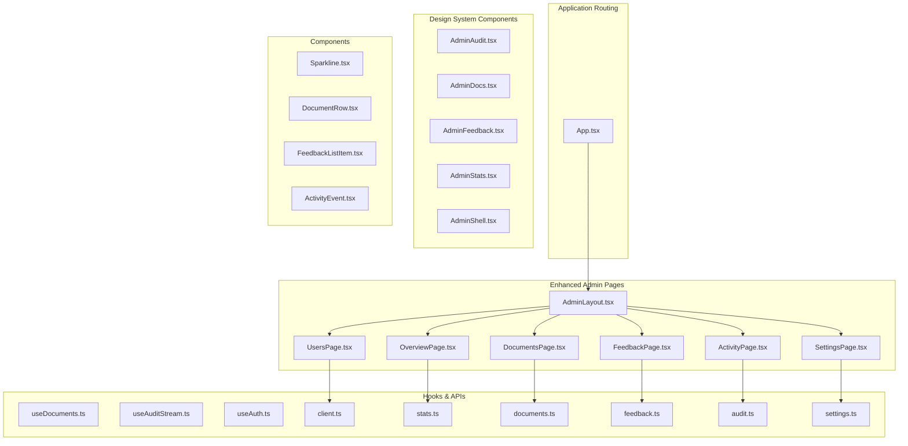

**Diagram sources**
- [AdminLayout.tsx:12-19](file://safe4ai-pilot/frontend/src/pages/admin/AdminLayout.tsx#L12-L19)
- [SettingsPage.tsx:186-184](file://safe4ai-pilot/frontend/src/pages/admin/SettingsPage.tsx#L186-L184)
- [App.tsx:50-57](file://safe4ai-pilot/frontend/src/App.tsx#L50-L57)
- [AdminAudit.tsx:5-278](file://design/components/AdminAudit.tsx#L5-L278)
- [AdminDocs.tsx:5-238](file://design/components/AdminDocs.tsx#L5-L238)
- [AdminFeedback.tsx:5-215](file://design/components/AdminFeedback.tsx#L5-L215)
- [AdminStats.tsx:5-258](file://design/components/AdminStats.tsx#L5-L258)
- [AdminShell.tsx:12-20](file://design/components/AdminShell.tsx#L12-L20)

**Section sources**
- [AdminLayout.tsx:10-19](file://safe4ai-pilot/frontend/src/pages/admin/AdminLayout.tsx#L10-L19)
- [SettingsPage.tsx:176-184](file://safe4ai-pilot/frontend/src/pages/admin/SettingsPage.tsx#L176-L184)
- [App.tsx:50-57](file://safe4ai-pilot/frontend/src/App.tsx#L50-L57)

## Core Components
The admin dashboard now encompasses six comprehensive pages with distinct responsibilities, enhanced by seamless navigation between admin and chat interfaces:

**AdminLayout**: Enhanced with Settings navigation, improved feedback badge display, and the new 'Back to chat' navigation option
**OverviewPage**: System monitoring and analytics with real-time metrics
**DocumentsPage**: Document lifecycle management with upload, indexing, and inspection
**ActivityPage**: Comprehensive audit trail with filtering and export capabilities
**FeedbackPage**: User feedback analysis with rating categorization and trace details
**UsersPage**: Team management with invitation, status control, and role assignment
**SettingsPage**: Complete system configuration with redesigned mode selector cards and context-specific model management

**Enhanced SettingsPage Features**:
- **Mode Selector Cards**: Visual cards for Local, Hybrid, and Cloud provider modes
- **Context-Specific Model Dropdowns**: Intelligent model selection based on provider type
- **Custom Model Management**: Support for external provider model names
- **Real-time Provider Validation**: Connectivity testing with immediate feedback
- **Intelligent Model Options**: Dynamic model lists based on current configuration

**Enhanced Components**:
- Sparkline: Lightweight trend visualization
- DocumentRow: Document status and action management
- FeedbackListItem: Feedback item presentation
- ActivityEvent: Audit event display

**Enhanced Navigation Features**:
- **Back to chat**: Dedicated navigation option in admin sidebar for seamless interface switching
- **Improved feedback integration**: Dynamic negative feedback badge display
- **Active route highlighting**: Visual indicators for current navigation state
- **Enhanced user session management**: Integrated logout functionality

**Section sources**
- [AdminLayout.tsx:12-19](file://safe4ai-pilot/frontend/src/pages/admin/AdminLayout.tsx#L12-L19)
- [SettingsPage.tsx:176-378](file://safe4ai-pilot/frontend/src/pages/admin/SettingsPage.tsx#L176-L378)
- [AdminAudit.tsx:52-278](file://design/components/AdminAudit.tsx#L52-L278)
- [AdminDocs.tsx:27-238](file://design/components/AdminDocs.tsx#L27-238)
- [AdminFeedback.tsx:29-215](file://design/components/AdminFeedback.tsx#L29-215)
- [AdminStats.tsx:44-258](file://design/components/AdminStats.tsx#L44-L258)

## Architecture Overview
The enhanced admin architecture follows a modular pattern with clear separation of concerns across six specialized pages, each leveraging shared components and APIs. The new 'Back to chat' navigation creates seamless integration between admin and chat interfaces.

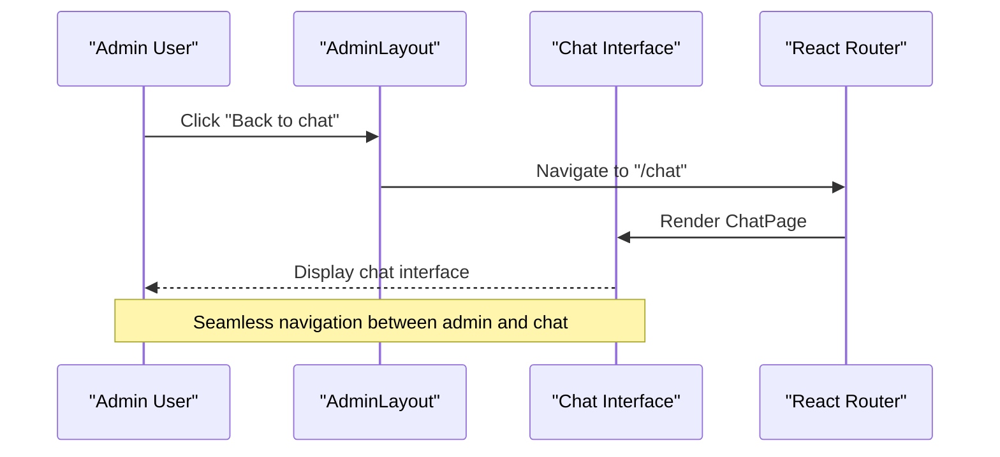

**Diagram sources**
- [AdminLayout.tsx:81-89](file://safe4ai-pilot/frontend/src/pages/admin/AdminLayout.tsx#L81-L89)
- [App.tsx:41-48](file://safe4ai-pilot/frontend/src/App.tsx#L41-L48)

## Detailed Component Analysis

### Enhanced AdminLayout with Back-to-Chat Navigation
The AdminLayout now includes comprehensive navigation for all six admin pages with improved feedback integration, active route detection, and the new 'Back to chat' navigation option.

**Navigation Structure**:
- Overview: System monitoring and analytics
- Documents: Document management and indexing
- Activity: Audit trail and monitoring
- Feedback: User feedback analysis
- Users: Team management and administration
- Settings: System configuration and controls
- **Back to chat**: Seamless navigation back to main chat interface

**Enhanced Features**:
- Dynamic feedback badge display showing negative feedback count
- Active route highlighting with visual indicators
- Improved index health monitoring
- Enhanced user session management
- **New**: Dedicated 'Back to chat' navigation option with arrow icon
- **New**: Consistent navigation pattern across admin and chat interfaces

**Diagram sources**
- [AdminLayout.tsx:36-72](file://safe4ai-pilot/frontend/src/pages/admin/AdminLayout.tsx#L36-L72)
- [AdminLayout.tsx:81-89](file://safe4ai-pilot/frontend/src/pages/admin/AdminLayout.tsx#L81-L89)

**Section sources**
- [AdminLayout.tsx:12-19](file://safe4ai-pilot/frontend/src/pages/admin/AdminLayout.tsx#L12-L19)
- [AdminLayout.tsx:25-36](file://safe4ai-pilot/frontend/src/pages/admin/AdminLayout.tsx#L25-L36)

### Application Routing Integration
The application routing system provides seamless navigation between admin and chat interfaces through the RequireAdmin wrapper and dedicated routes.

**Routing Structure**:
- `/chat`: Main chat interface accessible to authenticated users
- `/admin`: Admin interface restricted to admin users
- `/admin/*`: All admin sub-pages with automatic redirection to overview

**Enhanced Features**:
- **RequireAdmin wrapper**: Redirects non-admin users to chat interface
- **Automatic admin redirection**: Redirects admin users to `/admin/overview`
- **Consistent navigation patterns**: Both admin and chat interfaces use similar navigation approaches

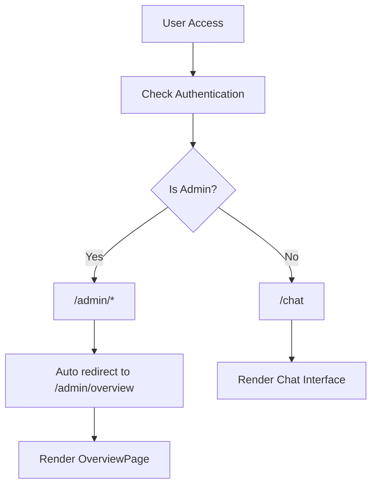

**Diagram sources**
- [App.tsx:29-34](file://safe4ai-pilot/frontend/src/App.tsx#L29-L34)
- [App.tsx:50-57](file://safe4ai-pilot/frontend/src/App.tsx#L50-L57)

**Section sources**
- [App.tsx:29-34](file://safe4ai-pilot/frontend/src/App.tsx#L29-L34)
- [App.tsx:50-57](file://safe4ai-pilot/frontend/src/App.tsx#L50-L57)

### SettingsPage - Redesigned Configuration Management
The SettingsPage provides complete system configuration with redesigned mode selector cards and context-specific model management.

**Redesigned Mode Selector System**:
- **Visual Mode Cards**: Three distinct provider mode cards with icons and badges
- **Intelligent Context Switching**: Automatic model dropdown population based on mode
- **Context-Specific Guidance**: Mode-appropriate hints and warnings
- **Real-time Validation**: Immediate feedback during configuration changes

**Configuration Sections**:
- **Models**: Generation, fallback, and embedding model selection with version control
- **Retrieval**: Chunk management, scoring thresholds, and processing parameters
- **Sources**: Document source connections (S3, Google Drive, watch folders)
- **Security**: Authentication, session management, and audit retention
- **Cost**: Spend monitoring, daily/monthly ceilings, and budget controls
- **Provider**: Enhanced provider configuration with mode selector cards

**Enhanced Features**:
- **Mode Selector Cards**: Local, Hybrid, and Cloud provider modes with visual indicators
- **Context-Specific Model Dropdowns**: Intelligent model selection based on provider type
- **Custom Model Management**: Support for external provider model names
- **Real-time Configuration Validation**: Immediate feedback on configuration changes
- **Scroll-snap Layout**: Left-rail navigation with section-based scrolling
- **Automatic Change Propagation**: Configuration changes applied to all users within 30 seconds
- **Comprehensive Audit Logging**: All configuration changes tracked and logged

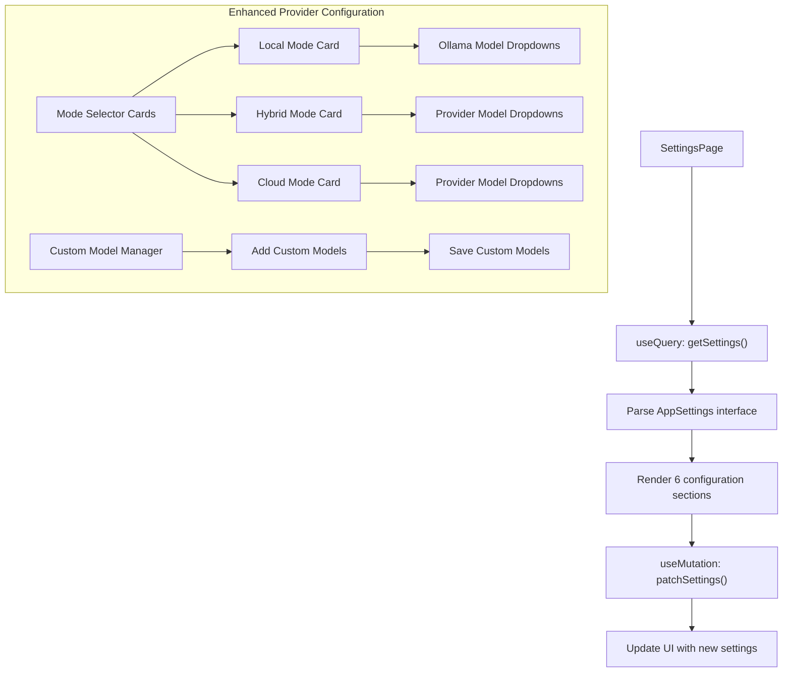

**Diagram sources**
- [SettingsPage.tsx:189-193](file://safe4ai-pilot/frontend/src/pages/admin/SettingsPage.tsx#L189-L193)
- [settings.ts:56-62](file://safe4ai-pilot/frontend/src/api/settings.ts#L56-L62)

**Section sources**
- [SettingsPage.tsx:176-378](file://safe4ai-pilot/frontend/src/pages/admin/SettingsPage.tsx#L176-L378)
- [settings.ts:3-54](file://safe4ai-pilot/frontend/src/api/settings.ts#L3-L54)

### Enhanced UsersPage - Advanced Team Management
The UsersPage provides comprehensive team management with invitation workflows, status control, and role assignment.

**User Management Features**:
- User invitation with automatic password generation
- Role-based access control (admin, pilot_user)
- User status management (active, inactive)
- Document scope assignment per user
- Audit trail integration for all user changes

**Advanced Functionality**:
- Real-time user filtering and search
- Bulk status updates with confirmation dialogs
- Invitation modal with domain validation
- Audit footer showing retention policies
- Responsive design with hover states

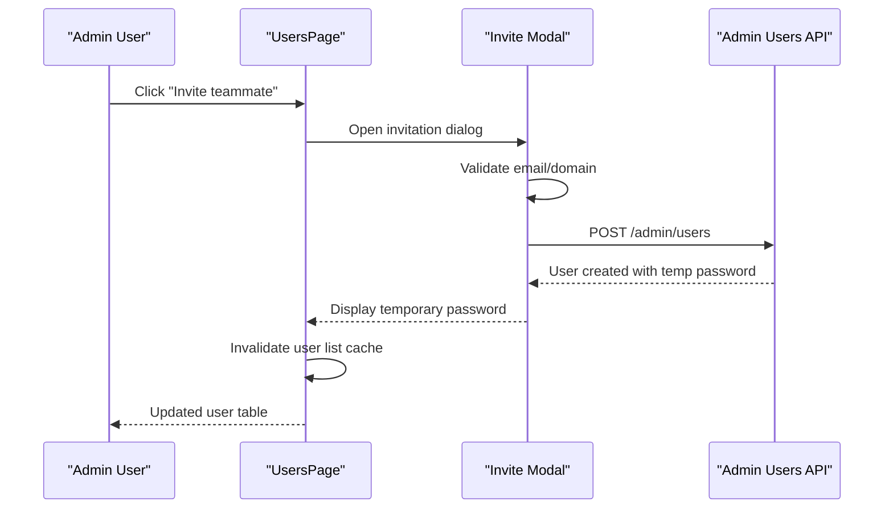

**Diagram sources**
- [UsersPage.tsx:277-299](file://safe4ai-pilot/frontend/src/pages/admin/UsersPage.tsx#L277-L299)
- [UsersPage.tsx:439-443](file://safe4ai-pilot/frontend/src/pages/admin/UsersPage.tsx#L439-L443)

**Section sources**
- [UsersPage.tsx:271-459](file://safe4ai-pilot/frontend/src/pages/admin/UsersPage.tsx#L271-L459)

### Redesigned Provider Configuration System

#### Mode Selector Cards Implementation
The SettingsPage now features redesigned mode selector cards that provide intuitive visual selection for provider modes.

**Mode Cards Configuration**:
- **Local Mode**: Server icon, "Local only" description, no API key requirement
- **Hybrid Mode**: Lightning bolt icon, "Hybrid" description with "Recommended" badge, cloud chat + local embeddings
- **Cloud Mode**: Cloud icon, "Fully cloud" description, requires external API access

**Card Interaction Logic**:
- Visual selection with border highlighting and background color change
- Badge display for recommended mode
- Immediate provider mode change without form submission
- Contextual model dropdown population based on selected mode

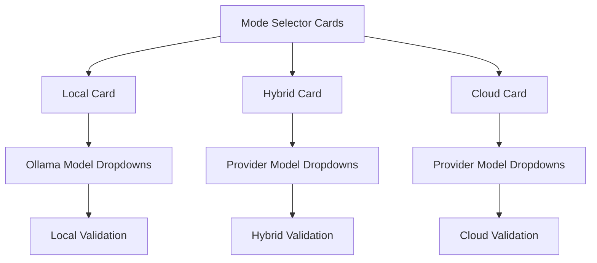

**Diagram sources**
- [SettingsPage.tsx:627-664](file://safe4ai-pilot/frontend/src/pages/admin/SettingsPage.tsx#L627-L664)
- [SettingsPage.tsx:667-739](file://safe4ai-pilot/frontend/src/pages/admin/SettingsPage.tsx#L667-L739)

#### Context-Specific Model Dropdowns
The system now implements intelligent model dropdowns that adapt based on the selected provider mode.

**Model Selection Logic**:
- **Local Mode**: Uses Ollama model list exclusively
- **Hybrid Mode**: Uses provider models for chat, Ollama for embeddings
- **Cloud Mode**: Uses provider models for all components
- **Dynamic Options**: Combines available models with current selections

**Model Dropdown Features**:
- Intelligent model option merging with current selections
- Placeholder text indicating model availability
- Automatic fallback to compatible models
- Support for custom model names in provider modes

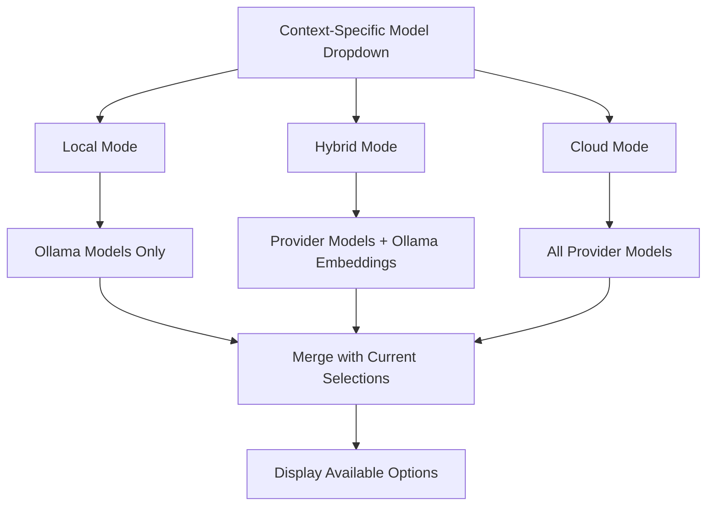

**Diagram sources**
- [SettingsPage.tsx:498-505](file://safe4ai-pilot/frontend/src/pages/admin/SettingsPage.tsx#L498-L505)
- [SettingsPage.tsx:236-252](file://safe4ai-pilot/frontend/src/pages/admin/SettingsPage.tsx#L236-L252)

#### Custom Model Management
The enhanced SettingsPage includes comprehensive custom model management for external providers.

**Custom Model Features**:
- **Model Name Input**: Text field for adding custom model identifiers
- **Model List Display**: Visual chips for managing custom models
- **Dynamic Validation**: Model identifier validation and deduplication
- **Persistence**: Automatic saving of custom models to configuration

**Custom Model Workflow**:
- Input validation for model identifier format
- duplicate prevention in model list
- Individual model removal with confirmation
- Batch persistence to server configuration

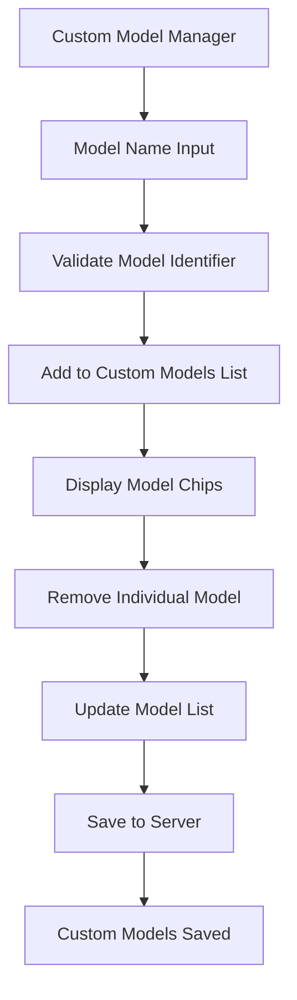

**Diagram sources**
- [SettingsPage.tsx:574-625](file://safe4ai-pilot/frontend/src/pages/admin/SettingsPage.tsx#L574-L625)
- [settings.ts:98-103](file://safe4ai-pilot/frontend/src/api/settings.ts#L98-L103)

#### Real-time Provider Validation and Connectivity Testing
The system now provides comprehensive real-time validation for provider configurations with immediate feedback.

**Validation Features**:
- **Provider Type Validation**: Ensures valid provider selection
- **API Key Requirements**: Enforces API key presence for external providers
- **Connectivity Testing**: Validates provider accessibility
- **Model Compatibility**: Checks model availability and compatibility

**Testing Mechanisms**:
- **Ollama Testing**: Validates local service accessibility
- **API Testing**: Tests external provider connectivity
- **Model Availability**: Verifies model existence and accessibility

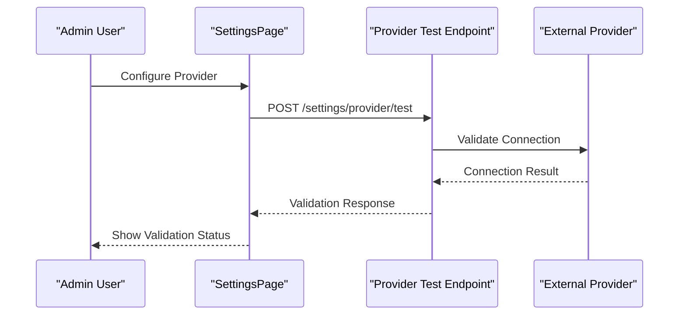

**Diagram sources**
- [admin_routes.py:1330-1380](file://safe4ai-pilot/app/api/admin_routes.py#L1330-L1380)
- [test_admin.py:902-951](file://safe4ai-pilot/tests/test_admin.py#L902-L951)

**Section sources**
- [SettingsPage.tsx:517-559](file://safe4ai-pilot/frontend/src/pages/admin/SettingsPage.tsx#L517-L559)
- [admin_routes.py:1095-1137](file://safe4ai-pilot/app/api/admin_routes.py#L1095-L1137)
- [test_admin.py:902-951](file://safe4ai-pilot/tests/test_admin.py#L902-L951)

### New Design Components

#### AdminAudit - Detailed Activity Monitoring
The AdminAudit component provides comprehensive activity monitoring with timeline visualization and filtering capabilities.

**Key Features**:
- Timeline-based activity stream with visual indicators
- Multi-level filtering (kind, user, date range)
- Live activity monitoring with status indicators
- Comprehensive event categorization (queries, uploads, feedback, auth)
- Export functionality for audit compliance

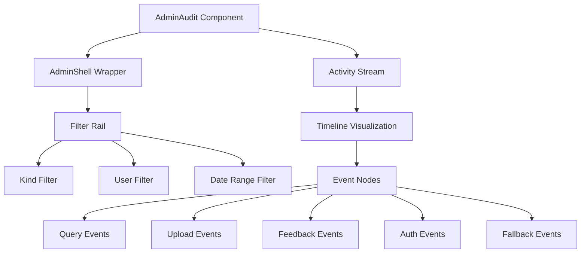

**Diagram sources**
- [AdminAudit.tsx:68-278](file://design/components/AdminAudit.tsx#L68-L278)

**Section sources**
- [AdminAudit.tsx:5-278](file://design/components/AdminAudit.tsx#L5-L278)

#### AdminDocs - Document Inventory Management
The AdminDocs component offers comprehensive document inventory management with status tracking and inspection capabilities.

**Document Management Features**:
- Document listing with status indicators (indexed, embedding, failed, skipped)
- Drag-and-drop upload interface
- Batch operations (reindex, delete)
- Detailed document inspection with indexing statistics
- Retrieval analytics and usage tracking

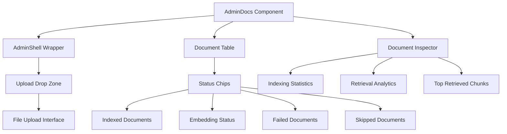

**Diagram sources**
- [AdminDocs.tsx:41-238](file://design/components/AdminDocs.tsx#L41-L238)

**Section sources**
- [AdminDocs.tsx:5-238](file://design/components/AdminDocs.tsx#L5-L238)

#### AdminFeedback - Feedback Analysis
The AdminFeedback component provides detailed feedback analysis with trace information and resolution workflows.

**Feedback Analysis Features**:
- List-detail interface for feedback items
- Rating categorization (thumbs up/down)
- User and role identification
- Trace information with latency and model details
- Resolution suggestions and reindex recommendations

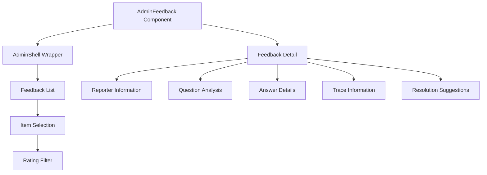

**Diagram sources**
- [AdminFeedback.tsx:39-215](file://design/components/AdminFeedback.tsx#L39-L215)

**Section sources**
- [AdminFeedback.tsx:5-215](file://design/components/AdminFeedback.tsx#L5-L215)

#### AdminStats - System Statistics and Reporting
The AdminStats component delivers comprehensive system statistics with interactive visualizations and trend analysis.

**Statistics Features**:
- Interactive sparkline charts for trend visualization
- Latency analysis with p50/p95 metrics
- Traffic volume and user engagement metrics
- Quality assessment with helpfulness ratios
- Cost analysis and spending trends
- Notable events and actionable insights

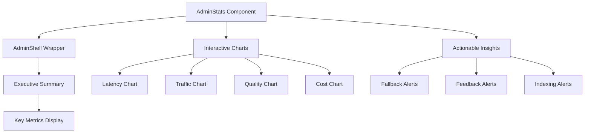

**Diagram sources**
- [AdminStats.tsx:53-258](file://design/components/AdminStats.tsx#L53-L258)

**Section sources**
- [AdminStats.tsx:5-258](file://design/components/AdminStats.tsx#L5-L258)

#### AdminShell - Legacy Design Component
The AdminShell component serves as a legacy design component that provides a comprehensive admin shell structure with navigation and content areas.

**Key Features**:
- Fixed 212px wide navigation rail
- Six main navigation items (Overview, Documents, Activity, Feedback, Users, Settings)
- Static index health indicator with "Indexing healthy" status
- User profile section with avatar and logout functionality
- Responsive grid layout with sidebar and main content areas

**Note**: This component appears to be part of the design system and may be superseded by the modern AdminLayout implementation.

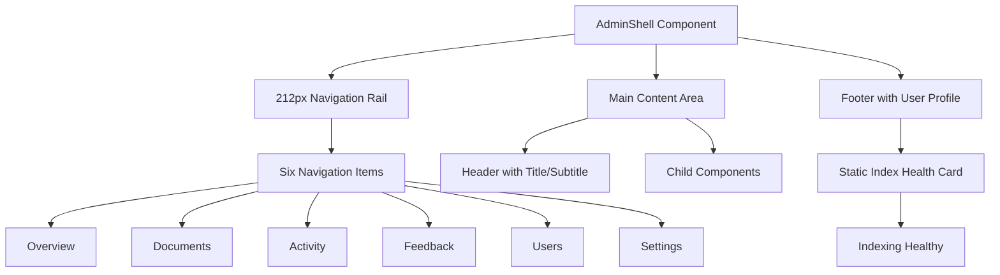

**Diagram sources**
- [AdminShell.tsx:12-20](file://design/components/AdminShell.tsx#L12-L20)
- [AdminShell.tsx:66-78](file://design/components/AdminShell.tsx#L66-L78)

**Section sources**
- [AdminShell.tsx:1-119](file://design/components/AdminShell.tsx#L1-L119)

## Dependency Analysis
The enhanced admin system maintains clean dependency relationships with additional components and APIs supporting the expanded functionality, including the new navigation integration.

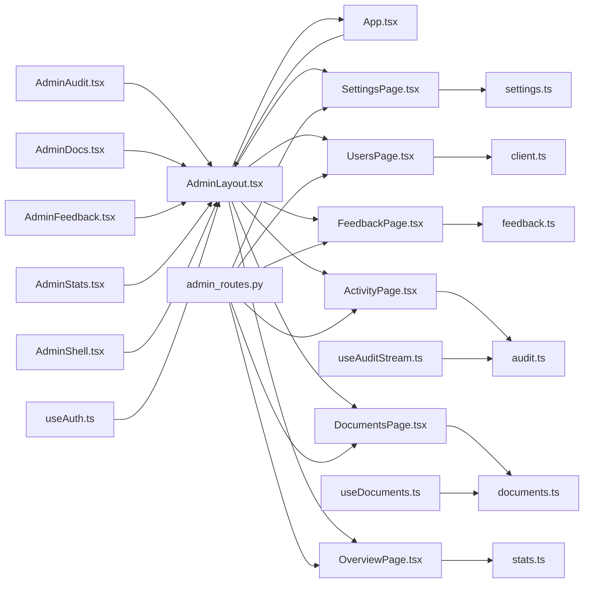

**Diagram sources**
- [AdminLayout.tsx:12-19](file://safe4ai-pilot/frontend/src/pages/admin/AdminLayout.tsx#L12-L19)
- [SettingsPage.tsx:16-17](file://safe4ai-pilot/frontend/src/pages/admin/SettingsPage.tsx#L16-L17)
- [UsersPage.tsx:14-17](file://safe4ai-pilot/frontend/src/pages/admin/UsersPage.tsx#L14-L17)
- [App.tsx:50-57](file://safe4ai-pilot/frontend/src/App.tsx#L50-L57)
- [admin_routes.py:56-56](file://safe4ai-pilot/app/api/admin_routes.py#L56-L56)

**Section sources**
- [AdminLayout.tsx:12-19](file://safe4ai-pilot/frontend/src/pages/admin/AdminLayout.tsx#L12-L19)
- [SettingsPage.tsx:16-17](file://safe4ai-pilot/frontend/src/pages/admin/SettingsPage.tsx#L16-L17)
- [UsersPage.tsx:14-17](file://safe4ai-pilot/frontend/src/pages/admin/UsersPage.tsx#L14-L17)
- [App.tsx:50-57](file://safe4ai-pilot/frontend/src/App.tsx#L50-L57)
- [admin_routes.py:56-56](file://safe4ai-pilot/app/api/admin_routes.py#L56-L56)

## Performance Considerations
The enhanced admin system implements optimized data fetching strategies and efficient rendering patterns, including the new navigation features.

**Optimized Refresh Patterns**:
- SettingsPage: Configuration changes propagate within 30 seconds
- UsersPage: User list refresh every 60 seconds with caching
- FeedbackPage: Negative feedback count updates every 60 seconds
- ActivityPage: Audit logs refresh every 30 seconds
- DocumentsPage: Document status polling every 10 seconds
- OverviewPage: System metrics refresh every 60 seconds
- **New**: Mode selector cards with instant visual feedback
- **New**: Context-specific model dropdowns with cached model lists
- **New**: Back-to-chat navigation with instant routing

**Efficient Rendering**:
- Virtualized scrolling for large datasets
- Lazy loading for detailed views
- Optimized SVG rendering for charts
- Debounced search and filtering
- Efficient state management with React Query
- **New**: Instant mode card selection without form submission
- **New**: Context-aware model dropdown rendering
- **New**: Seamless navigation without page reloads

**Network Optimization**:
- Shared API client with authentication
- Request deduplication
- Efficient pagination for audit logs
- Conditional revalidation based on user actions
- **New**: Provider connectivity testing with timeout handling
- **New**: Custom model validation with debounce
- **New**: Client-side navigation optimization

## Troubleshooting Guide
Enhanced troubleshooting procedures for the expanded admin functionality, including navigation-related issues.

**Settings Management Issues**:
- Configuration changes not applying: Verify settings API connectivity and authentication
- Model switching failures: Check embedding model availability and reindex requirements
- Source connection issues: Validate S3/GDrive credentials and permissions
- **New**: Mode selector card interaction failures: Check browser compatibility and JavaScript
- **New**: Context-specific model dropdown issues: Verify provider connectivity and model availability

**Navigation Issues**:
- **Back to chat not working**: Verify React Router configuration and navigation links
- **Admin navigation failures**: Check RequireAdmin wrapper and authentication state
- **Route redirection problems**: Validate App.tsx routing configuration
- **Navigation state issues**: Ensure proper useLocation hook usage

**Provider Configuration Problems**:
- **API Key Validation Errors**: Verify API key format and provider type compatibility
- **Connectivity Failures**: Check network connectivity and base URL configuration
- **Model Availability Issues**: Ensure selected models are available in the provider
- **Provider Type Mismatch**: Validate provider type selection and configuration
- **Mode Card Selection Issues**: Check for JavaScript errors in console

**User Management Problems**:
- Invitation failures: Verify email domain restrictions and SMTP configuration
- Status update errors: Check user role permissions and audit trail requirements
- Scope assignment issues: Validate document access permissions

**Audit and Monitoring Issues**:
- Missing audit events: Verify audit retention settings and storage configuration
- Performance degradation: Check database indexes and query optimization
- Export failures: Validate file system permissions and storage quotas

**Document Management Issues**:
- Upload failures: Check file size limits and supported formats
- Indexing errors: Verify document preprocessing and embedding model availability
- Search performance: Monitor Elasticsearch indices and query optimization

**Section sources**
- [SettingsPage.tsx:360-366](file://safe4ai-pilot/frontend/src/pages/admin/SettingsPage.tsx#L360-L366)
- [UsersPage.tsx:430-436](file://safe4ai-pilot/frontend/src/pages/admin/UsersPage.tsx#L430-L436)
- [AdminLayout.tsx:81-89](file://safe4ai-pilot/frontend/src/pages/admin/AdminLayout.tsx#L81-L89)
- [App.tsx:29-34](file://safe4ai-pilot/frontend/src/App.tsx#L29-L34)
- [admin_routes.py:1074-1080](file://safe4ai-pilot/app/api/admin_routes.py#L1074-L1080)

## Security Considerations
The enhanced admin system implements comprehensive security measures across all administrative functions, including navigation security.

**Access Control**:
- Role-based permissions (admin, pilot_user)
- Session management with configurable expiration
- Two-factor authentication support
- IP whitelisting and device trust
- **New**: Navigation security with RequireAdmin wrapper preventing unauthorized access

**Data Protection**:
- Audit logging for all administrative actions
- Encrypted storage for sensitive configuration data
- PII redaction in audit trails
- Secure password generation and transmission
- **New**: API key masking and secure handling in UI
- **New**: Provider configuration validation without exposing secrets
- **New**: Secure navigation between admin and chat interfaces

**API Security**:
- JWT token authentication with refresh cycles
- CORS configuration for admin domain
- Rate limiting for administrative endpoints
- Input validation and sanitization
- **New**: Provider API key validation and secure transmission
- **New**: Custom model validation and sanitization
- **New**: Navigation endpoint security validation

**Compliance**:
- Audit retention policies (30-365 days configurable)
- Data residency and export capabilities
- Security incident response procedures
- Regular security assessments and penetration testing

**Provider Security**:
- **New**: Secure API key handling with masking
- **New**: Real-time validation without exposing secrets
- **New**: Provider connectivity testing with controlled requests
- **New**: Configuration change audit logging
- **New**: Custom model identifier validation
- **New**: Navigation security enforcement

## Practical Extensions
The enhanced admin system provides numerous opportunities for customization and extension, including navigation enhancements.

**Adding New Administrative Pages**:
- Create new page component following AdminLayout pattern
- Implement dedicated API endpoints for data management
- Add navigation items to AdminLayout NAV array
- Integrate with existing authentication and authorization

**Enhancing Navigation Features**:
- **New**: Add additional navigation shortcuts between admin and chat
- **New**: Implement breadcrumb navigation for complex admin workflows
- **New**: Add keyboard shortcuts for quick navigation
- **New**: Create navigation history and favorites functionality

**Enhancing Configuration Management**:
- Add new configuration categories to SettingsPage
- Implement configuration validation and rollback
- Add import/export functionality for settings
- Create configuration templates and presets
- **New**: Extend mode selector cards with additional provider types
- **New**: Implement advanced model validation and compatibility checking

**Extending Monitoring Capabilities**:
- Add custom metrics and KPIs to OverviewPage
- Implement real-time alerting and notifications
- Create custom dashboard widgets with Sparkline integration
- Add historical trend analysis and forecasting

**Improving User Experience**:
- Implement user preference management
- Add bulk operations for user management
- Create user onboarding workflows
- Add team collaboration features
- **New**: Enhance navigation UX with progress indicators and tooltips

**Enhancing Provider Management**:
- **New**: Add support for additional provider types (Azure, Anthropic, etc.)
- **New**: Implement provider health monitoring and status indicators
- **New**: Add provider-specific configuration templates
- **New**: Implement provider failover and redundancy mechanisms
- **New**: Extend custom model management with validation rules

## Conclusion
The enhanced admin dashboard provides comprehensive administrative capabilities through six specialized pages, each designed for specific management tasks. The system combines modern React patterns with robust backend integration, offering real-time monitoring, detailed analytics, and complete configuration management. With enhanced security measures, efficient data management, and extensible architecture, the admin system supports both current operational needs and future growth requirements. The modular design ensures maintainability while the comprehensive feature set addresses all aspects of system administration and monitoring.

**Updated** The addition of the 'Back to chat' navigation option creates seamless navigation between the admin interface and the main chat interface, improving user workflow efficiency and reducing context switching overhead. This enhancement maintains the accuracy of system monitoring while providing administrators with convenient access to both administrative and chat functionalities. The enhanced admin layout with improved navigation patterns and real-time data visualization provides administrators with reliable and actionable insights into system performance and document indexing status.