# Custom Provider Models Management

<cite>
**Referenced Files in This Document**
- [provider_clients.py](file://safe4ai-pilot/app/services/provider_clients.py)
- [runtime_config.py](file://safe4ai-pilot/app/services/runtime_config.py)
- [admin_routes.py](file://safe4ai-pilot/app/api/admin_routes.py)
- [app_config_store.py](file://safe4ai-pilot/app/services/app_config_store.py)
- [models.py](file://safe4ai-pilot/app/models.py)
- [test_provider_clients.py](file://safe4ai-pilot/tests/test_provider_clients.py)
- [test_admin.py](file://safe4ai-pilot/tests/test_admin.py)
- [2026-05-15-provider-runtime-hardening.md](file://safe4ai-pilot/docs/superpowers/plans/2026-05-15-provider-runtime-hardening.md)
- [SettingsPage.tsx](file://safe4ai-pilot/frontend/src/pages/admin/SettingsPage.tsx)
</cite>

## Update Summary
**Changes Made**
- Added comprehensive three-mode provider system documentation
- Enhanced settings interface with provider_mode and embedding_source fields
- Updated validation logic for three-mode provider system
- Added provider_mode computation and embedding_source control
- Updated frontend integration with three-mode provider system

## Table of Contents
1. [Introduction](#introduction)
2. [System Architecture](#system-architecture)
3. [Core Components](#core-components)
4. [Three-Mode Provider System](#three-mode-provider-system)
5. [Provider Management System](#provider-management-system)
6. [Custom Model Configuration](#custom-model-configuration)
7. [Runtime Configuration](#runtime-configuration)
8. [Admin Interface](#admin-interface)
9. [Security and Validation](#security-and-validation)
10. [Testing Strategy](#testing-strategy)
11. [Troubleshooting Guide](#troubleshooting-guide)
12. [Conclusion](#conclusion)

## Introduction

The Custom Provider Models Management system is a comprehensive framework designed to handle multiple AI provider integrations within the Private AI platform. This system enables dynamic switching between different AI providers (Ollama and OpenAI-compatible APIs) while maintaining flexibility for custom model configurations. The architecture supports both local inference through Ollama and cloud-based APIs through OpenAI-compatible endpoints, with robust configuration management and security controls.

The system is built around a three-mode provider architecture: Local (Ollama-only), Hybrid (cloud chat with local embeddings), and Cloud (full cloud provider). This design ensures scalability, maintainability, and ease of integration with various AI services while providing consistent interfaces for chat, embedding, and vision capabilities.

## System Architecture

The Custom Provider Models Management system follows a layered architecture with clear separation of concerns:

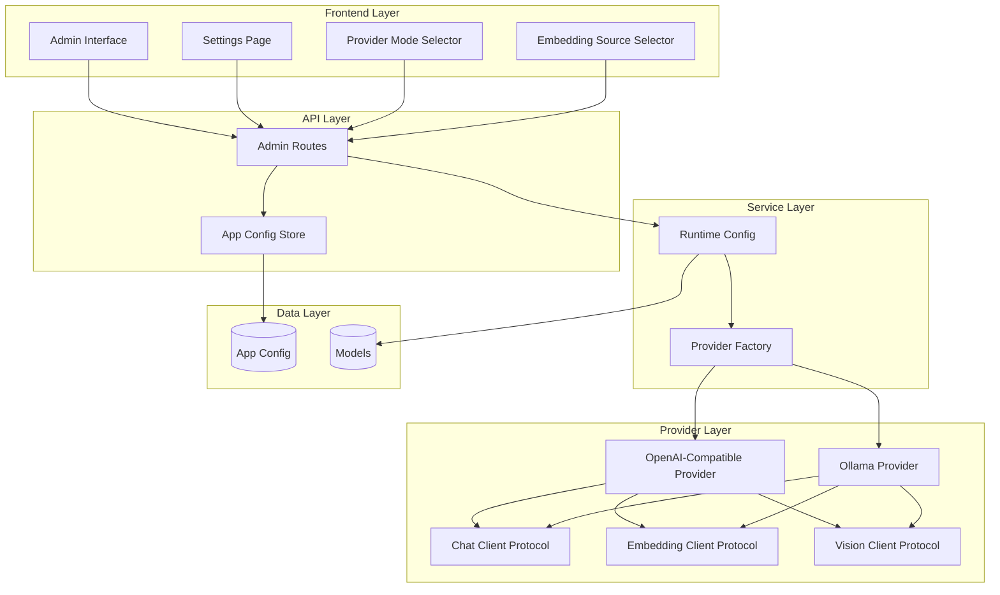

**Diagram sources**
- [admin_routes.py:179-231](file://safe4ai-pilot/app/api/admin_routes.py#L179-L231)
- [runtime_config.py:57-62](file://safe4ai-pilot/app/services/runtime_config.py#L57-L62)
- [provider_clients.py:24-35](file://safe4ai-pilot/app/services/provider_clients.py#L24-L35)

The architecture consists of four main layers:

1. **Frontend Layer**: Admin interface, settings management, and three-mode provider selectors
2. **API Layer**: Route handlers and configuration management with validation logic
3. **Service Layer**: Runtime configuration and provider factory with three-mode logic
4. **Provider Layer**: Concrete provider implementations with separate embedding and vision capabilities

## Core Components

### Provider Protocol Definitions

The system defines clear protocols for different provider capabilities:

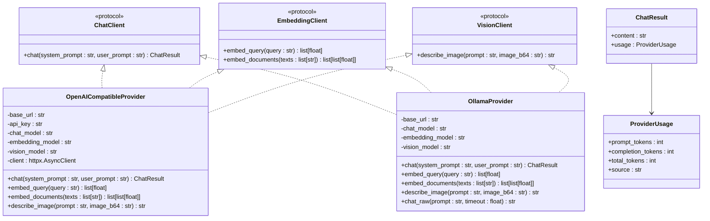

**Diagram sources**
- [provider_clients.py:24-144](file://safe4ai-pilot/app/services/provider_clients.py#L24-L144)
- [provider_clients.py:52-240](file://safe4ai-pilot/app/services/provider_clients.py#L52-L240)

**Section sources**
- [provider_clients.py:10-144](file://safe4ai-pilot/app/services/provider_clients.py#L10-L144)

### Data Models and Configuration

The system uses Pydantic models for type safety and structured data handling:

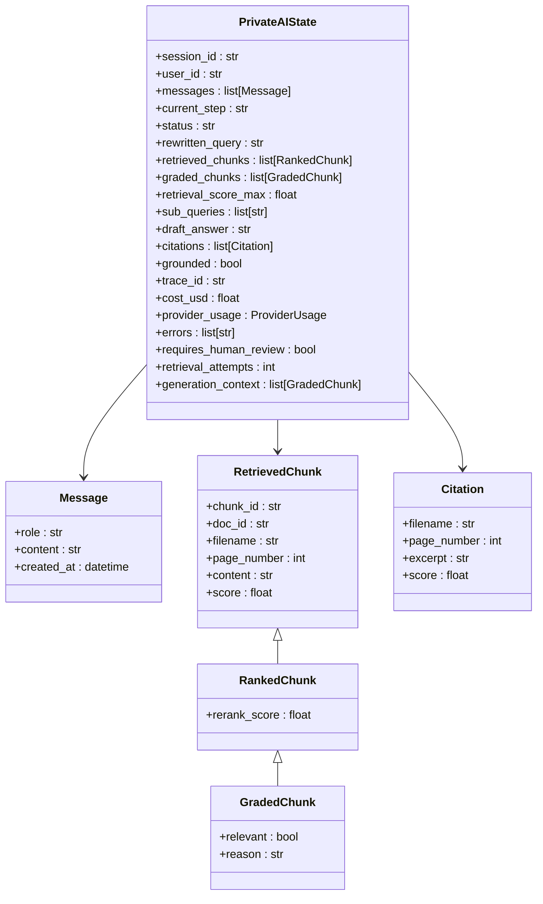

**Diagram sources**
- [models.py:53-102](file://safe4ai-pilot/app/models.py#L53-L102)

**Section sources**
- [models.py:11-102](file://safe4ai-pilot/app/models.py#L11-L102)

## Three-Mode Provider System

### Provider Mode Computation

The system implements a sophisticated three-mode provider system with automatic mode determination:

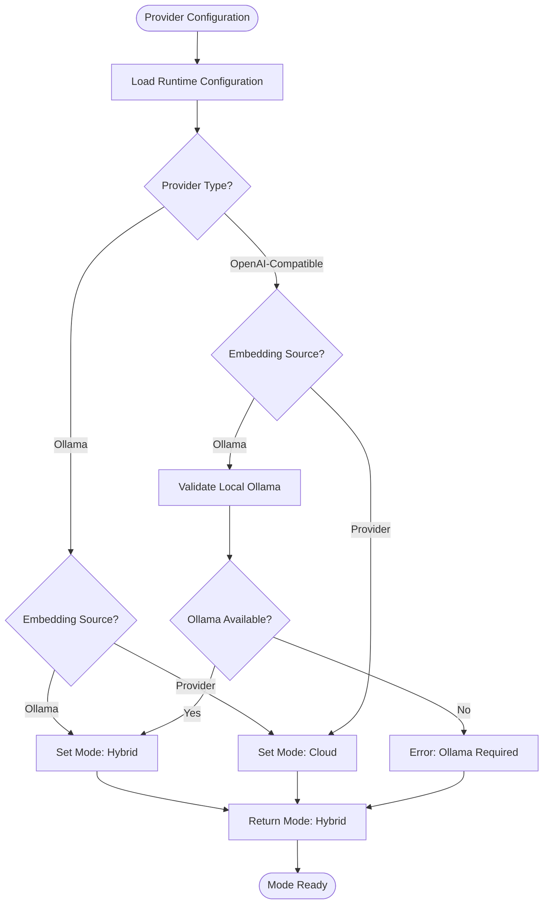

**Diagram sources**
- [runtime_config.py:57-62](file://safe4ai-pilot/app/services/runtime_config.py#L57-L62)
- [admin_routes.py:179-182](file://safe4ai-pilot/app/api/admin_routes.py#L179-L182)

### Provider Mode Matrix

| Mode | Provider Type | Embedding Source | Usage Pattern | Security Model |
|------|---------------|------------------|---------------|----------------|
| Local | Ollama | Ollama | All operations local | Maximum privacy |
| Hybrid | OpenAI-Compatible | Ollama | Cloud chat + Local embeddings | Balanced security |
| Cloud | OpenAI-Compatible | Provider | All operations cloud | Provider-controlled |

### Embedding Source Control

The system provides granular control over embedding generation sources:

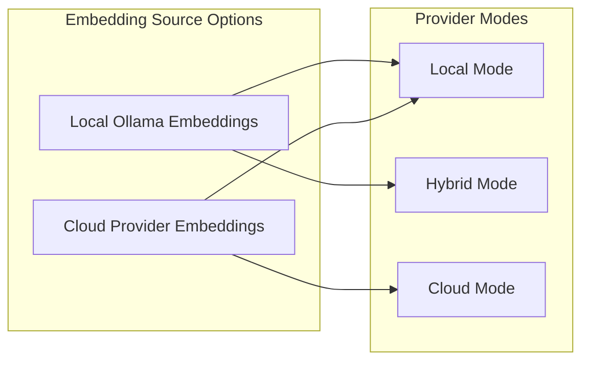

**Diagram sources**
- [runtime_config.py:167-196](file://safe4ai-pilot/app/services/runtime_config.py#L167-L196)
- [admin_routes.py:1086-1144](file://safe4ai-pilot/app/api/admin_routes.py#L1086-L1144)

**Section sources**
- [runtime_config.py:57-62](file://safe4ai-pilot/app/services/runtime_config.py#L57-L62)
- [runtime_config.py:167-196](file://safe4ai-pilot/app/services/runtime_config.py#L167-L196)
- [admin_routes.py:179-182](file://safe4ai-pilot/app/api/admin_routes.py#L179-L182)

## Provider Management System

### Provider Selection Logic

The system implements intelligent provider selection based on configuration and availability:

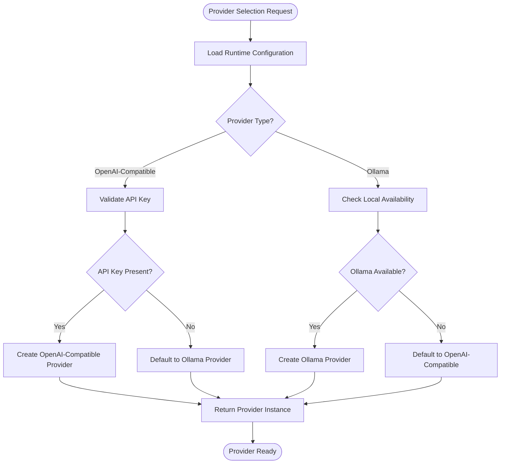

**Diagram sources**
- [runtime_config.py:147-164](file://safe4ai-pilot/app/services/runtime_config.py#L147-L164)

### Provider Capability Matrix

| Feature | Local Mode | Hybrid Mode | Cloud Mode |
|---------|------------|-------------|------------|
| Chat Completions | ✅ Full Support | ✅ Cloud Support | ✅ Full Support |
| Embeddings | ✅ Local Only | ✅ Local Only | ✅ Cloud Support |
| Vision Capabilities | ✅ Full Support | ✅ Full Support | ✅ Cloud Support |
| Streaming | ✅ SSE Support | ❌ No Streaming | ❌ No Streaming |
| Authentication | ❌ No Auth | ✅ API Keys | ✅ API Keys |
| Local Deployment | ✅ Local Only | ✅ Local Only | ❌ Cloud Only |
| Privacy Level | 🔒 Maximum | 🔐 Balanced | 🌐 Provider-Controlled |

**Section sources**
- [runtime_config.py:147-164](file://safe4ai-pilot/app/services/runtime_config.py#L147-L164)

## Custom Model Configuration

### Configuration Storage and Encryption

The system provides secure configuration management with automatic encryption for sensitive data:

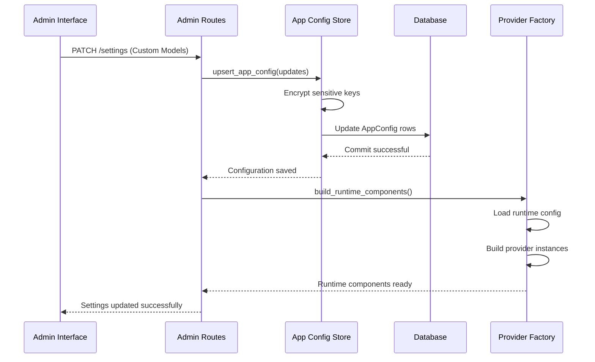

**Diagram sources**
- [admin_routes.py:1176-1176](file://safe4ai-pilot/app/api/admin_routes.py#L1176)
- [app_config_store.py:100-119](file://safe4ai-pilot/app/services/app_config_store.py#L100-L119)

### Custom Provider Models Implementation

The system supports custom provider models through a dedicated configuration key:

**Configuration Schema:**
- Key: `custom_provider_models`
- Type: JSON array of strings
- Format: `["model-name:version", "another-model:latest"]`
- Validation: String array with length limits

**Model Discovery Process:**
1. Fetch available models from configured provider
2. Merge with custom provider models
3. Deduplicate and sort results
4. Provide to frontend for selection

**Section sources**
- [admin_routes.py:192-199](file://safe4ai-pilot/app/api/admin_routes.py#L192-L199)
- [admin_routes.py:219-227](file://safe4ai-pilot/app/api/admin_routes.py#L219-L227)
- [test_admin.py:550-577](file://safe4ai-pilot/tests/test_admin.py#L550-L577)

## Runtime Configuration

### Configuration Loading and Validation

The runtime configuration system provides comprehensive validation and fallback mechanisms:

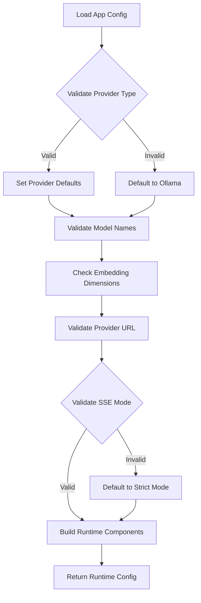

**Diagram sources**
- [runtime_config.py:89-129](file://safe4ai-pilot/app/services/runtime_config.py#L89-L129)

### Configuration Parameters

| Parameter | Purpose | Default Value | Validation |
|-----------|---------|---------------|------------|
| `provider_type` | Provider selection | `ollama` | `ollama` or `openai_compatible` |
| `provider_base_url` | API endpoint | `http://localhost:11434` | URL validation |
| `provider_api_key` | Authentication | `None` | Required for OpenAI-compatible |
| `embedding_source` | Embedding generation | `ollama` | `ollama` or `provider` |
| `chat_model` | Generation model | `ollama_model` | Model existence check |
| `embedding_model` | Vector model | `embedding_model` | Dimension compatibility |
| `vision_model` | Image processing | `qwen2.5vl:7b` | Model availability |
| `sse_done_mode` | Streaming mode | `strict` | `strict` or `async` |
| `usage_source` | Token counting | `estimated` | Provider-dependent |

**Section sources**
- [runtime_config.py:37-55](file://safe4ai-pilot/app/services/runtime_config.py#L37-L55)
- [runtime_config.py:89-129](file://safe4ai-pilot/app/services/runtime_config.py#L89-L129)

## Admin Interface

### Settings Management

The admin interface provides comprehensive controls for provider configuration:

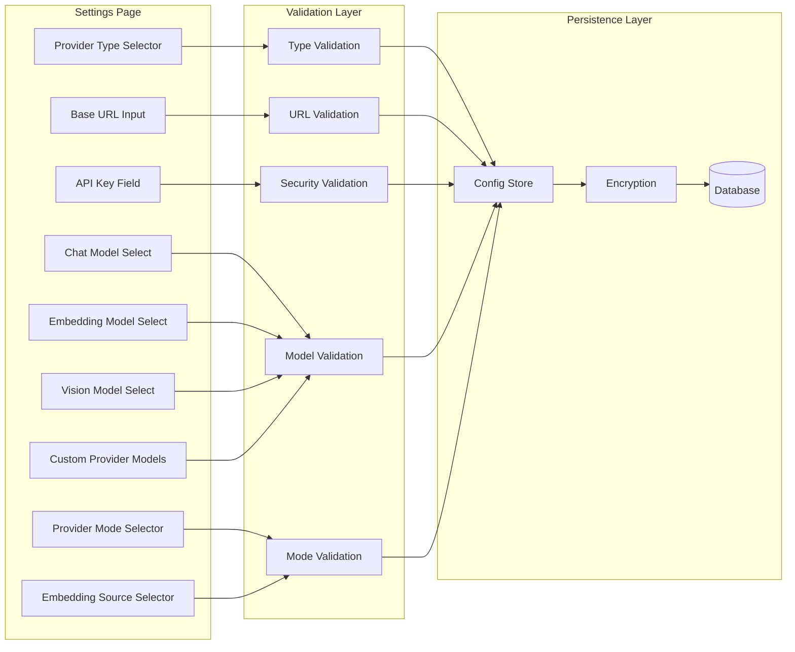

**Diagram sources**
- [admin_routes.py:179-231](file://safe4ai-pilot/app/api/admin_routes.py#L179-L231)

### Three-Mode Provider Interface

The enhanced settings interface provides intuitive controls for the three-mode provider system:

**Provider Mode Selection:**
- **Local**: All operations run on local Ollama instance
- **Hybrid**: Cloud chat completions with local embeddings
- **Cloud**: All operations run on cloud provider

**Embedding Source Control:**
- **Local Ollama**: Embeddings generated by local Ollama models
- **Cloud Provider**: Embeddings generated by cloud provider API

**Section sources**
- [admin_routes.py:179-231](file://safe4ai-pilot/app/api/admin_routes.py#L179-L231)
- [SettingsPage.tsx:650-743](file://safe4ai-pilot/frontend/src/pages/admin/SettingsPage.tsx#L650-L743)

### Live Model Discovery

The system implements real-time model discovery with caching:

**Model Discovery Features:**
- Automatic detection of available models
- Caching with TTL (15 seconds)
- Graceful fallback on failures
- Combined model lists (available + custom)

**Discovery Process:**
1. Check cache expiration
2. Fetch from provider API
3. Merge with custom models
4. Update cache
5. Return combined list

**Section sources**
- [admin_routes.py:139-177](file://safe4ai-pilot/app/api/admin_routes.py#L139-L177)
- [admin_routes.py:263-279](file://safe4ai-pilot/app/api/admin_routes.py#L263-L279)

## Security and Validation

### Data Protection

The system implements comprehensive security measures:

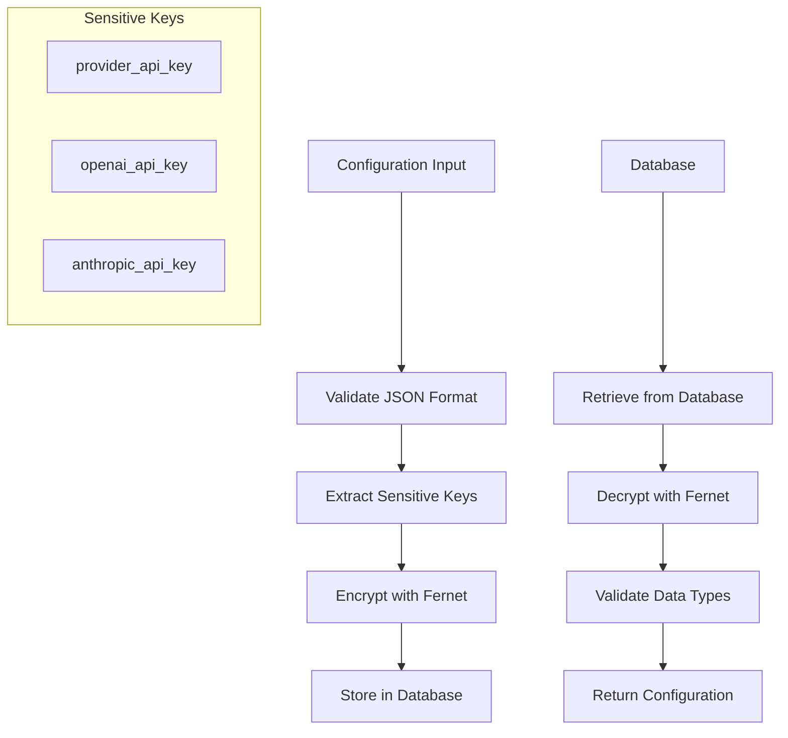

**Diagram sources**
- [app_config_store.py:42-58](file://safe4ai-pilot/app/services/app_config_store.py#L42-L58)
- [app_config_store.py:100-119](file://safe4ai-pilot/app/services/app_config_store.py#L100-L119)

### Input Validation

The system enforces strict validation rules:

**Validation Rules:**
- Model identifiers: 1-200 characters, alphanumeric + hyphens
- URLs: Proper format validation
- API keys: Required for OpenAI-compatible providers
- Boolean values: Case-insensitive string conversion
- Numeric values: Range and type validation
- **New**: Provider modes: `local`, `hybrid`, or `cloud`
- **New**: Embedding sources: `ollama` or `provider`

**Error Handling:**
- HTTP 422 for validation errors
- HTTP 409 for conflicting configurations
- Graceful degradation for unavailable providers

**Section sources**
- [admin_routes.py:100-107](file://safe4ai-pilot/app/api/admin_routes.py#L100-L107)
- [app_config_store.py:15-35](file://safe4ai-pilot/app/services/app_config_store.py#L15-L35)

## Testing Strategy

### Unit Testing Approach

The system employs comprehensive testing strategies:

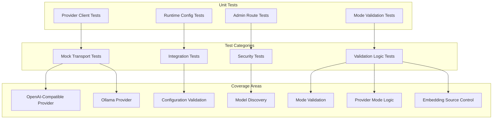

**Diagram sources**
- [test_provider_clients.py:1-80](file://safe4ai-pilot/tests/test_provider_clients.py#L1-L80)
- [test_admin.py:549-739](file://safe4ai-pilot/tests/test_admin.py#L549-L739)

### Test Coverage Areas

**Provider Client Testing:**
- Multimodal payload construction
- Error handling scenarios
- Response parsing and coercion
- Fallback mechanism testing

**Runtime Configuration Testing:**
- Default value resolution
- Provider type validation
- Model dimension checking
- SSE mode validation
- **New**: Provider mode computation
- **New**: Embedding source validation

**Admin Interface Testing:**
- Custom provider model integration
- Configuration persistence
- Security validation
- Error response handling
- **New**: Provider mode switching
- **New**: Embedding source validation

**Mode Validation Testing:**
- **New**: Local mode validation
- **New**: Hybrid mode validation with Ollama connectivity
- **New**: Cloud mode validation with provider API
- **New**: Auto-reset of embedding models during mode switches

**Section sources**
- [test_provider_clients.py:10-80](file://safe4ai-pilot/tests/test_provider_clients.py#L10-L80)
- [test_admin.py:549-739](file://safe4ai-pilot/tests/test_admin.py#L549-L739)

## Troubleshooting Guide

### Common Issues and Solutions

**Provider Connection Problems:**
- Verify base URL accessibility
- Check API key configuration for OpenAI-compatible providers
- Ensure model names match provider specifications
- Confirm network connectivity and firewall settings

**Configuration Validation Errors:**
- Review model identifier format restrictions
- Validate JSON array format for custom provider models
- Check URL format and accessibility
- Verify boolean and numeric value formats
- **New**: Validate provider mode values (`local`, `hybrid`, `cloud`)
- **New**: Validate embedding source values (`ollama`, `provider`)

**Performance Issues:**
- Monitor token usage and costs
- Adjust retrieval parameters (k, score_floor)
- Optimize chunk size and overlap settings
- Consider provider-specific tuning parameters

**Security Concerns:**
- Verify encryption of sensitive configurations
- Check proper handling of API keys
- Review access control and authentication
- Monitor audit logs for suspicious activities

**Mode Switching Issues:**
- **New**: Hybrid mode requires local Ollama availability
- **New**: Cloud mode requires valid provider API credentials
- **New**: Embedding model compatibility across modes
- **New**: Auto-reset of embedding models during mode transitions

### Debugging Tools

**Diagnostic Commands:**
- Model availability verification
- Provider endpoint testing
- Configuration validation checks
- Performance monitoring metrics
- **New**: Mode validation diagnostics
- **New**: Embedding source compatibility checks

**Monitoring Indicators:**
- Response time measurements
- Error rate tracking
- Resource utilization monitoring
- Cost tracking and budget alerts
- **New**: Mode switching success rates
- **New**: Embedding source performance metrics

## Conclusion

The Custom Provider Models Management system provides a robust, secure, and flexible framework for managing AI provider integrations. Its architecture supports multiple provider types while maintaining consistency and reliability. The system's emphasis on security, validation, and comprehensive testing ensures dependable operation in production environments.

**Key Enhancements:**
- **Three-Mode Provider System**: Local, Hybrid, and Cloud modes with automatic validation
- **Granular Embedding Control**: Separate control over embedding generation sources
- **Enhanced Security**: Provider mode validation prevents misconfiguration
- **Improved User Experience**: Intuitive settings interface with real-time validation
- **Backward Compatibility**: Seamless migration from single-mode configurations

**System Strengths:**
- **Flexibility**: Support for multiple provider types with easy switching
- **Security**: Encrypted storage of sensitive configuration data
- **Validation**: Comprehensive input validation and error handling
- **Extensibility**: Protocol-based architecture allowing future provider additions
- **User Experience**: Intuitive admin interface with real-time model discovery
- **Privacy Control**: Configurable privacy levels across different deployment modes

The system successfully balances functionality with security, providing administrators with powerful tools to manage AI provider configurations while maintaining operational safety and compliance standards. The three-mode provider system offers unprecedented flexibility in deployment strategies while maintaining consistent performance and security guarantees.