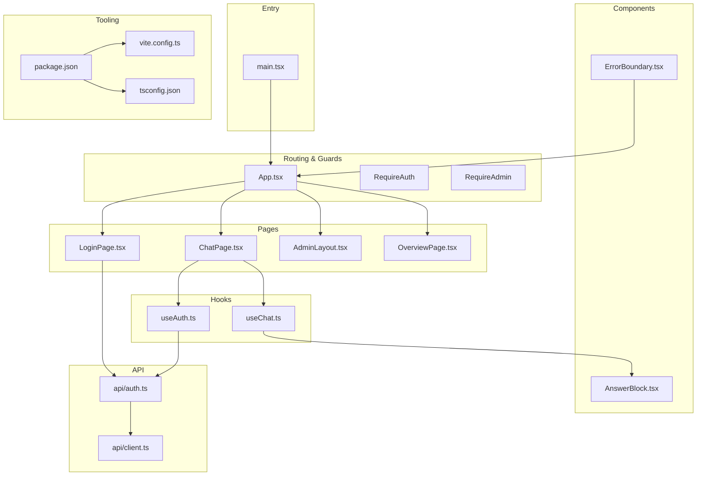
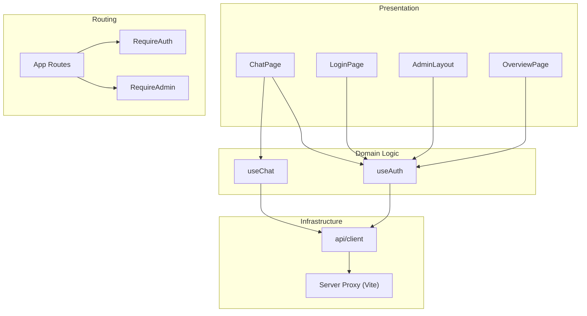
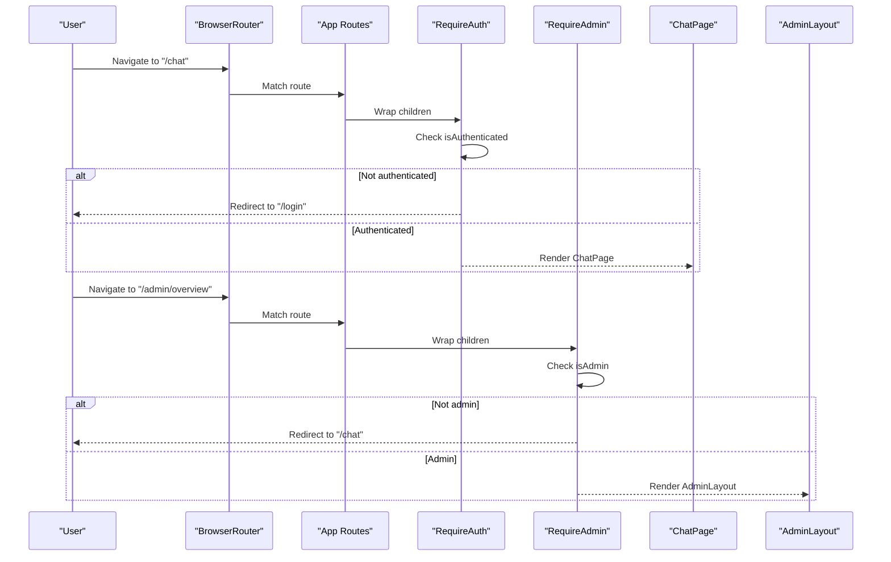
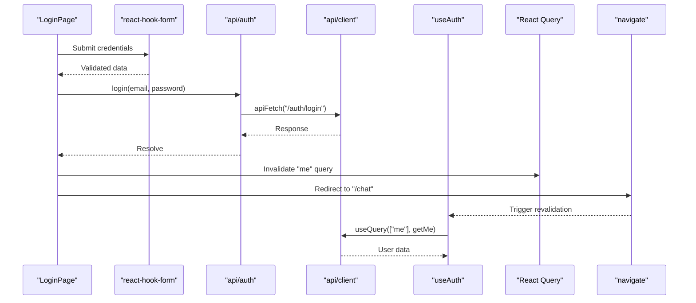
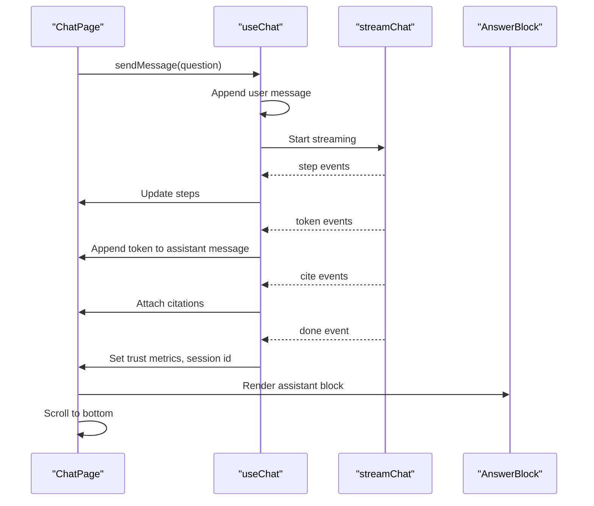
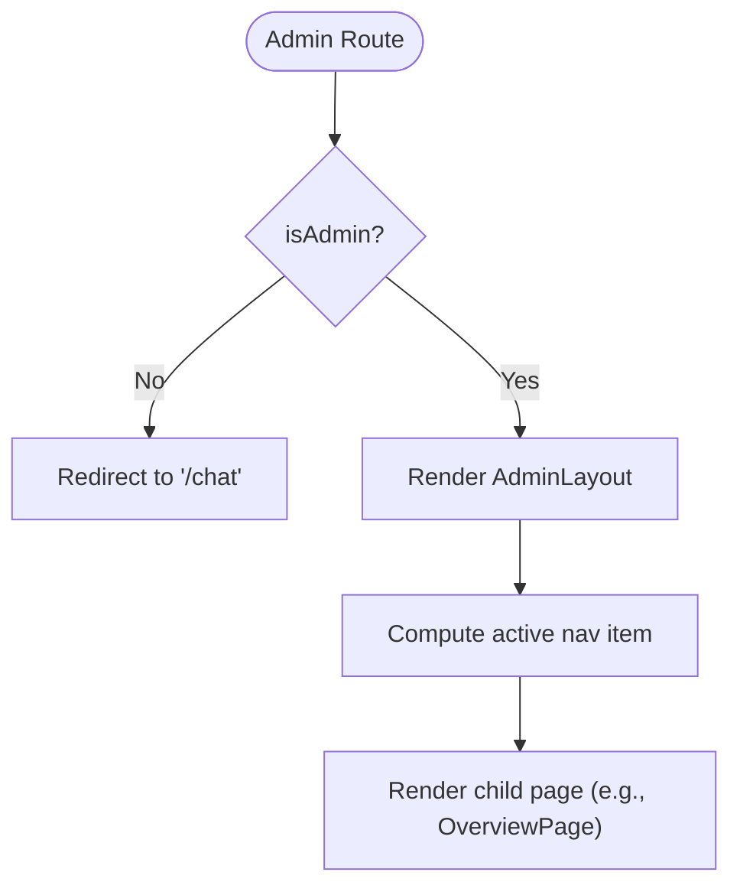
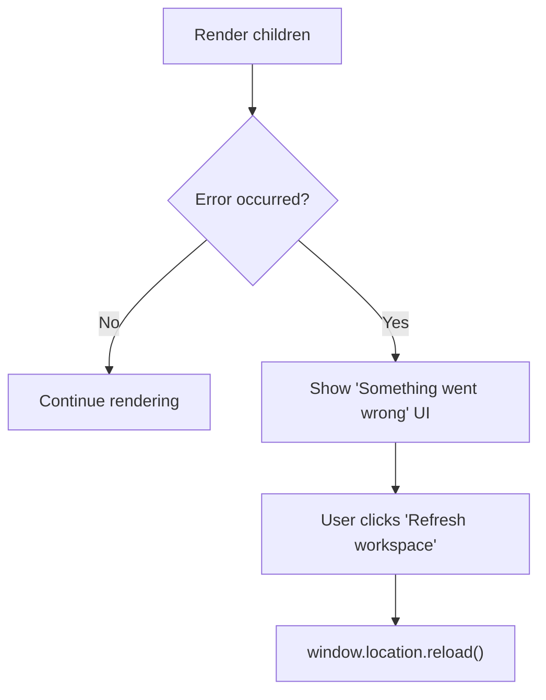
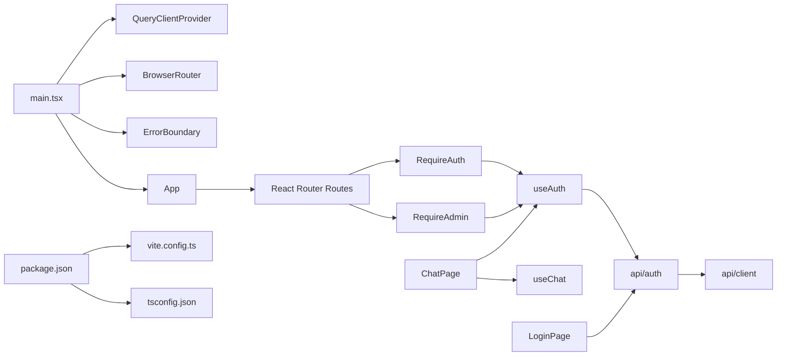

# Application Architecture

<cite>
**Referenced Files in This Document**
- [main.tsx](file://safe4ai-pilot/frontend/src/main.tsx)
- [App.tsx](file://safe4ai-pilot/frontend/src/App.tsx)
- [ErrorBoundary.tsx](file://safe4ai-pilot/frontend/src/components/ErrorBoundary.tsx)
- [useAuth.ts](file://safe4ai-pilot/frontend/src/hooks/useAuth.ts)
- [auth.ts](file://safe4ai-pilot/frontend/src/api/auth.ts)
- [client.ts](file://safe4ai-pilot/frontend/src/api/client.ts)
- [useChat.ts](file://safe4ai-pilot/frontend/src/hooks/useChat.ts)
- [AnswerBlock.tsx](file://safe4ai-pilot/frontend/src/components/chat/AnswerBlock.tsx)
- [ChatPage.tsx](file://safe4ai-pilot/frontend/src/pages/ChatPage.tsx)
- [LoginPage.tsx](file://safe4ai-pilot/frontend/src/pages/LoginPage.tsx)
- [AdminLayout.tsx](file://safe4ai-pilot/frontend/src/pages/admin/AdminLayout.tsx)
- [OverviewPage.tsx](file://safe4ai-pilot/frontend/src/pages/admin/OverviewPage.tsx)
- [package.json](file://safe4ai-pilot/frontend/package.json)
- [vite.config.ts](file://safe4ai-pilot/frontend/vite.config.ts)
- [tsconfig.json](file://safe4ai-pilot/frontend/tsconfig.json)
</cite>

## Table of Contents
1. [Introduction](#introduction)
2. [Project Structure](#project-structure)
3. [Core Components](#core-components)
4. [Architecture Overview](#architecture-overview)
5. [Detailed Component Analysis](#detailed-component-analysis)
6. [Dependency Analysis](#dependency-analysis)
7. [Performance Considerations](#performance-considerations)
8. [Troubleshooting Guide](#troubleshooting-guide)
9. [Conclusion](#conclusion)
10. [Appendices](#appendices)

## Introduction
This document describes the React TypeScript frontend architecture for the Private AI web application. It explains the application initialization, routing with React Router, authentication guards, component hierarchy, page organization, navigation patterns, TypeScript configuration, Vite build setup, and development workflow. It also covers the authentication system, error boundaries, and global state management via React Query, and provides practical examples for extending the application.

## Project Structure
The frontend is organized by feature and domain:
- Entry point initializes providers and routing.
- Pages represent top-level views (chat, login, admin).
- Hooks encapsulate reusable logic (authentication, chat).
- Components are grouped by domain (chat, admin).
- API modules abstract server communication.
- Build and tooling are configured via Vite and TypeScript.

**Diagram sources**
- [main.tsx:1-24](file://safe4ai-pilot/frontend/src/main.tsx#L1-L24)
- [App.tsx:1-92](file://safe4ai-pilot/frontend/src/App.tsx#L1-L92)
- [LoginPage.tsx:1-163](file://safe4ai-pilot/frontend/src/pages/LoginPage.tsx#L1-L163)
- [ChatPage.tsx:1-191](file://safe4ai-pilot/frontend/src/pages/ChatPage.tsx#L1-L191)
- [AdminLayout.tsx:1-97](file://safe4ai-pilot/frontend/src/pages/admin/AdminLayout.tsx#L1-L97)
- [OverviewPage.tsx:1-213](file://safe4ai-pilot/frontend/src/pages/admin/OverviewPage.tsx#L1-L213)
- [useAuth.ts:1-28](file://safe4ai-pilot/frontend/src/hooks/useAuth.ts#L1-L28)
- [useChat.ts:1-104](file://safe4ai-pilot/frontend/src/hooks/useChat.ts#L1-L104)
- [ErrorBoundary.tsx:1-43](file://safe4ai-pilot/frontend/src/components/ErrorBoundary.tsx#L1-L43)
- [AnswerBlock.tsx:1-114](file://safe4ai-pilot/frontend/src/components/chat/AnswerBlock.tsx#L1-L114)
- [auth.ts:1-17](file://safe4ai-pilot/frontend/src/api/auth.ts#L1-L17)
- [client.ts:1-20](file://safe4ai-pilot/frontend/src/api/client.ts#L1-L20)
- [package.json:1-32](file://safe4ai-pilot/frontend/package.json#L1-L32)
- [vite.config.ts:1-17](file://safe4ai-pilot/frontend/vite.config.ts#L1-L17)
- [tsconfig.json:1-22](file://safe4ai-pilot/frontend/tsconfig.json#L1-L22)

**Section sources**
- [main.tsx:1-24](file://safe4ai-pilot/frontend/src/main.tsx#L1-L24)
- [App.tsx:1-92](file://safe4ai-pilot/frontend/src/App.tsx#L1-L92)
- [package.json:1-32](file://safe4ai-pilot/frontend/package.json#L1-L32)
- [vite.config.ts:1-17](file://safe4ai-pilot/frontend/vite.config.ts#L1-L17)
- [tsconfig.json:1-22](file://safe4ai-pilot/frontend/tsconfig.json#L1-L22)

## Core Components
- Application bootstrap sets up React Query, routing, and error boundary at the root.
- Routing defines public and protected routes with guard components.
- Authentication hook centralizes user state, role checks, and sign-out.
- Chat hook manages streaming conversation lifecycle and feedback submission.
- API client abstracts server requests and error handling.
- Pages implement domain-specific UI and integrate hooks and components.

**Section sources**
- [main.tsx:1-24](file://safe4ai-pilot/frontend/src/main.tsx#L1-L24)
- [App.tsx:11-23](file://safe4ai-pilot/frontend/src/App.tsx#L11-L23)
- [useAuth.ts:5-27](file://safe4ai-pilot/frontend/src/hooks/useAuth.ts#L5-L27)
- [useChat.ts:17-103](file://safe4ai-pilot/frontend/src/hooks/useChat.ts#L17-L103)
- [auth.ts:10-17](file://safe4ai-pilot/frontend/src/api/auth.ts#L10-L17)
- [client.ts:3-15](file://safe4ai-pilot/frontend/src/api/client.ts#L3-L15)

## Architecture Overview
The application follows a layered architecture:
- Presentation layer: Pages and components.
- Domain logic: Hooks for authentication and chat.
- Infrastructure: API client and server proxy configuration.
- Routing and guards: RequireAuth and RequireAdmin wrap protected routes.

**Diagram sources**
- [App.tsx:25-91](file://safe4ai-pilot/frontend/src/App.tsx#L25-L91)
- [useAuth.ts:8-12](file://safe4ai-pilot/frontend/src/hooks/useAuth.ts#L8-L12)
- [useChat.ts:28-91](file://safe4ai-pilot/frontend/src/hooks/useChat.ts#L28-L91)
- [client.ts:3-15](file://safe4ai-pilot/frontend/src/api/client.ts#L3-L15)
- [vite.config.ts:6-15](file://safe4ai-pilot/frontend/vite.config.ts#L6-L15)

## Detailed Component Analysis

### Routing and Authentication Guards
- RequireAuth blocks unauthenticated users and redirects to login.
- RequireAdmin enforces admin role and redirects otherwise.
- Root routes define public login, protected chat, and admin sections.

**Diagram sources**
- [App.tsx:11-23](file://safe4ai-pilot/frontend/src/App.tsx#L11-L23)
- [App.tsx:25-91](file://safe4ai-pilot/frontend/src/App.tsx#L25-L91)

**Section sources**
- [App.tsx:11-23](file://safe4ai-pilot/frontend/src/App.tsx#L11-L23)
- [App.tsx:25-91](file://safe4ai-pilot/frontend/src/App.tsx#L25-L91)

### Authentication Hook and API Layer
- useAuth fetches current user, exposes role checks, and handles sign-out.
- API client centralizes request configuration and error handling.
- Login page validates input and triggers authentication.

**Diagram sources**
- [LoginPage.tsx:22-35](file://safe4ai-pilot/frontend/src/pages/LoginPage.tsx#L22-L35)
- [auth.ts:10-11](file://safe4ai-pilot/frontend/src/api/auth.ts#L10-L11)
- [client.ts:3-15](file://safe4ai-pilot/frontend/src/api/client.ts#L3-L15)
- [useAuth.ts:8-12](file://safe4ai-pilot/frontend/src/hooks/useAuth.ts#L8-L12)

**Section sources**
- [useAuth.ts:5-27](file://safe4ai-pilot/frontend/src/hooks/useAuth.ts#L5-L27)
- [auth.ts:10-17](file://safe4ai-pilot/frontend/src/api/auth.ts#L10-L17)
- [client.ts:3-15](file://safe4ai-pilot/frontend/src/api/client.ts#L3-L15)
- [LoginPage.tsx:17-35](file://safe4ai-pilot/frontend/src/pages/LoginPage.tsx#L17-L35)

### Chat Experience and Streaming Pipeline
- ChatPage orchestrates messages, streaming steps, and citations.
- useChat manages lifecycle: send message, stream tokens, collect citations, finalize trust metrics.
- AnswerBlock renders streamed content, citations, and feedback controls.

**Diagram sources**
- [ChatPage.tsx:29-46](file://safe4ai-pilot/frontend/src/pages/ChatPage.tsx#L29-L46)
- [useChat.ts:28-91](file://safe4ai-pilot/frontend/src/hooks/useChat.ts#L28-L91)
- [AnswerBlock.tsx:36-113](file://safe4ai-pilot/frontend/src/components/chat/AnswerBlock.tsx#L36-L113)

**Section sources**
- [ChatPage.tsx:29-191](file://safe4ai-pilot/frontend/src/pages/ChatPage.tsx#L29-L191)
- [useChat.ts:17-103](file://safe4ai-pilot/frontend/src/hooks/useChat.ts#L17-L103)
- [AnswerBlock.tsx:10-19](file://safe4ai-pilot/frontend/src/components/chat/AnswerBlock.tsx#L10-L19)

### Admin Navigation and Layout
- AdminLayout provides sidebar navigation and user actions.
- OverviewPage demonstrates dashboard rendering with statistics and charts.

**Diagram sources**
- [AdminLayout.tsx:23-96](file://safe4ai-pilot/frontend/src/pages/admin/AdminLayout.tsx#L23-L96)
- [OverviewPage.tsx:43-60](file://safe4ai-pilot/frontend/src/pages/admin/OverviewPage.tsx#L43-L60)

**Section sources**
- [AdminLayout.tsx:10-17](file://safe4ai-pilot/frontend/src/pages/admin/AdminLayout.tsx#L10-L17)
- [AdminLayout.tsx:23-96](file://safe4ai-pilot/frontend/src/pages/admin/AdminLayout.tsx#L23-L96)
- [OverviewPage.tsx:43-213](file://safe4ai-pilot/frontend/src/pages/admin/OverviewPage.tsx#L43-L213)

### Error Boundaries
- ErrorBoundary catches rendering errors and offers a recovery action.

**Diagram sources**
- [ErrorBoundary.tsx:13-42](file://safe4ai-pilot/frontend/src/components/ErrorBoundary.tsx#L13-L42)

**Section sources**
- [ErrorBoundary.tsx:13-42](file://safe4ai-pilot/frontend/src/components/ErrorBoundary.tsx#L13-L42)

## Dependency Analysis
- Providers and initialization order: QueryClientProvider -> BrowserRouter -> ErrorBoundary -> App.
- Routing depends on React Router and guards depend on useAuth.
- Pages depend on hooks and components; hooks depend on API client.
- Tooling dependencies: Vite for dev/build, TypeScript for type checking, Tailwind via PostCSS.

**Diagram sources**
- [main.tsx:13-23](file://safe4ai-pilot/frontend/src/main.tsx#L13-L23)
- [App.tsx:25-91](file://safe4ai-pilot/frontend/src/App.tsx#L25-L91)
- [useAuth.ts:8-12](file://safe4ai-pilot/frontend/src/hooks/useAuth.ts#L8-L12)
- [auth.ts:10-17](file://safe4ai-pilot/frontend/src/api/auth.ts#L10-L17)
- [client.ts:3-15](file://safe4ai-pilot/frontend/src/api/client.ts#L3-L15)
- [package.json:6-10](file://safe4ai-pilot/frontend/package.json#L6-L10)
- [vite.config.ts:4-16](file://safe4ai-pilot/frontend/vite.config.ts#L4-L16)
- [tsconfig.json:2-18](file://safe4ai-pilot/frontend/tsconfig.json#L2-L18)

**Section sources**
- [main.tsx:1-24](file://safe4ai-pilot/frontend/src/main.tsx#L1-L24)
- [App.tsx:1-92](file://safe4ai-pilot/frontend/src/App.tsx#L1-L92)
- [package.json:1-32](file://safe4ai-pilot/frontend/package.json#L1-L32)

## Performance Considerations
- React Query caching: staleTime reduces redundant network calls for chat and admin data.
- Streaming pipeline: incremental updates minimize re-renders during long-running operations.
- Lazy loading: consider code-splitting routes for admin pages to reduce initial bundle size.
- Network reliability: API client centralizes error handling; consider retry/backoff for transient failures.
- Rendering: avoid unnecessary deep re-renders by memoizing derived data and callbacks.

[No sources needed since this section provides general guidance]

## Troubleshooting Guide
Common issues and resolutions:
- Authentication loops after login: ensure the "me" query is invalidated and navigation occurs after successful login.
- Protected route bypass: verify RequireAuth/RequireAdmin guards are wrapping routes and that useAuth resolves isAuthenticated and isAdmin correctly.
- API errors: check Vite proxy configuration and base URL; confirm credentials include and response parsing.
- UI crashes: rely on ErrorBoundary to recover; inspect console logs captured by the boundary.

**Section sources**
- [LoginPage.tsx:26-35](file://safe4ai-pilot/frontend/src/pages/LoginPage.tsx#L26-L35)
- [useAuth.ts:14-18](file://safe4ai-pilot/frontend/src/hooks/useAuth.ts#L14-L18)
- [client.ts:3-15](file://safe4ai-pilot/frontend/src/api/client.ts#L3-L15)
- [ErrorBoundary.tsx:20-22](file://safe4ai-pilot/frontend/src/components/ErrorBoundary.tsx#L20-L22)

## Conclusion
The frontend employs a clean separation of concerns: routing with guards, centralized authentication and chat logic via hooks, a robust API client, and a resilient error boundary. The Vite and TypeScript configuration supports a modern, type-safe development workflow. Extending the application involves adding guarded routes, integrating new pages, and leveraging existing hooks and API modules.

[No sources needed since this section summarizes without analyzing specific files]

## Appendices

### TypeScript Configuration
- Target and module resolution optimized for bundler environments.
- Strict mode enabled with unused locals/parameters and fallthrough checks.
- JSX configured for React and TSX emission disabled in favor of Vite/TypeScript integration.

**Section sources**
- [tsconfig.json:2-18](file://safe4ai-pilot/frontend/tsconfig.json#L2-L18)

### Build and Development Workflow
- Dev server runs on port 3000 with API proxy mapping multiple paths to backend host.
- Build script compiles TypeScript then bundles with Vite.
- Preview serves built assets locally.

**Section sources**
- [vite.config.ts:6-15](file://safe4ai-pilot/frontend/vite.config.ts#L6-L15)
- [package.json:6-10](file://safe4ai-pilot/frontend/package.json#L6-L10)

### Practical Examples

- Add a new protected route:
  - Define a page component.
  - Wrap it with RequireAuth or RequireAdmin in App routes.
  - Example reference: [App.tsx:30-37](file://safe4ai-pilot/frontend/src/App.tsx#L30-L37), [App.tsx:47-54](file://safe4ai-pilot/frontend/src/App.tsx#L47-L54)

- Implement RequireAdmin for a new admin page:
  - Create page component and layout if needed.
  - Wrap with RequireAdmin and redirect to a default admin path.
  - Example reference: [App.tsx:47-54](file://safe4ai-pilot/frontend/src/App.tsx#L47-L54), [AdminLayout.tsx:23-96](file://safe4ai-pilot/frontend/src/pages/admin/AdminLayout.tsx#L23-L96)

- Extend authentication state:
  - Add fields to the Me interface and update getMe accordingly.
  - Example reference: [auth.ts:3-8](file://safe4ai-pilot/frontend/src/api/auth.ts#L3-L8), [useAuth.ts:8-12](file://safe4ai-pilot/frontend/src/hooks/useAuth.ts#L8-L12)

- Integrate a new API endpoint:
  - Add typed function in api module and reuse apiFetch.
  - Example reference: [auth.ts:10-17](file://safe4ai-pilot/frontend/src/api/auth.ts#L10-L17), [client.ts:3-15](file://safe4ai-pilot/frontend/src/api/client.ts#L3-L15)

- Initialize a new chat feature:
  - Use useChat to manage messages and streaming.
  - Example reference: [useChat.ts:17-103](file://safe4ai-pilot/frontend/src/hooks/useChat.ts#L17-L103), [ChatPage.tsx:29-46](file://safe4ai-pilot/frontend/src/pages/ChatPage.tsx#L29-L46)