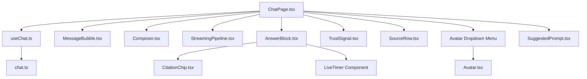
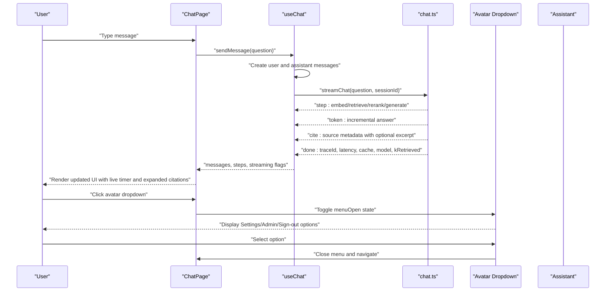
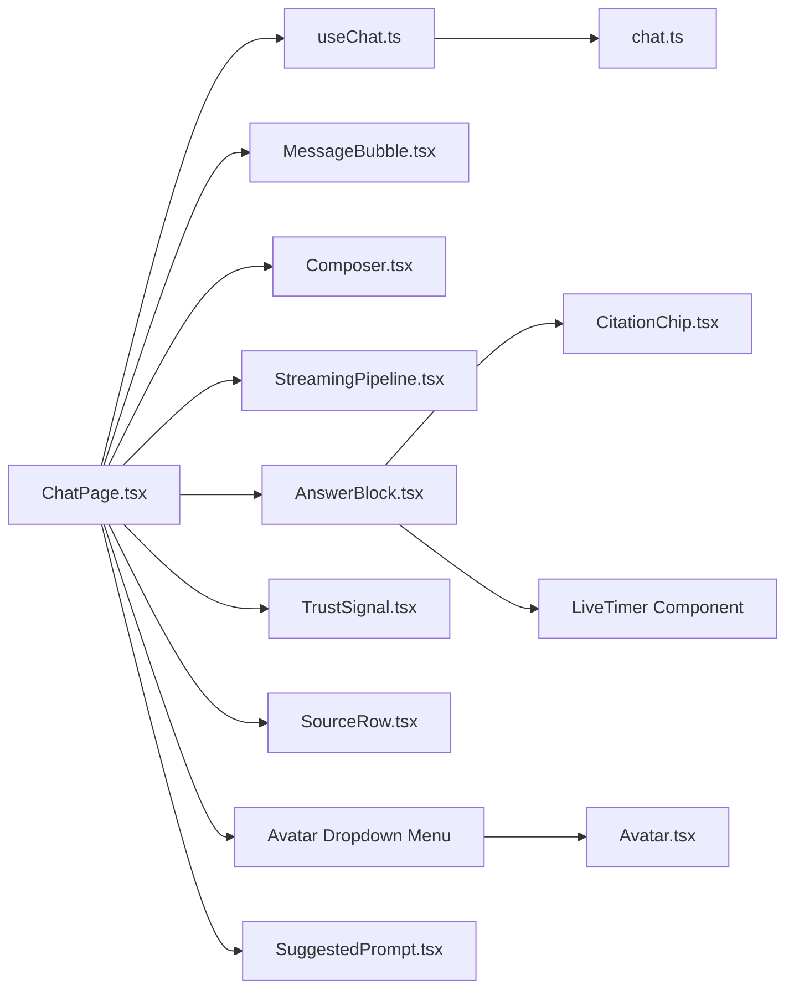

# Chat Interface

<cite>
**Referenced Files in This Document**
- [ChatPage.tsx](file://safe4ai-pilot/frontend/src/pages/ChatPage.tsx)
- [useChat.ts](file://safe4ai-pilot/frontend/src/hooks/useChat.ts)
- [chat.ts](file://safe4ai-pilot/frontend/src/api/chat.ts)
- [MessageBubble.tsx](file://safe4ai-pilot/frontend/src/components/chat/MessageBubble.tsx)
- [Composer.tsx](file://safe4ai-pilot/frontend/src/components/chat/Composer.tsx)
- [StreamingPipeline.tsx](file://safe4ai-pilot/frontend/src/components/chat/StreamingPipeline.tsx)
- [AnswerBlock.tsx](file://safe4ai-pilot/frontend/src/components/chat/AnswerBlock.tsx)
- [CitationChip.tsx](file://safe4ai-pilot/frontend/src/components/chat/CitationChip.tsx)
- [SuggestedPrompt.tsx](file://safe4ai-pilot/frontend/src/components/chat/SuggestedPrompt.tsx)
- [TrustSignal.tsx](file://safe4ai-pilot/frontend/src/components/chat/TrustSignal.tsx)
- [SourceRow.tsx](file://safe4ai-pilot/frontend/src/components/chat/SourceRow.tsx)
- [Avatar.tsx](file://safe4ai-pilot/frontend/src/components/Avatar.tsx)
- [ChatA.tsx](file://design/components/ChatA.tsx)
- [ChatB.tsx](file://design/components/ChatB.tsx)
- [ChatShared.tsx](file://design/components/ChatShared.tsx)
</cite>

## Update Summary
**Changes Made**
- Added sophisticated avatar dropdown menu system replacing previous flat button layout for Settings, Admin panel, and Sign-out functionality
- Implemented advanced state management with outside click detection and smooth animations
- Enhanced header component with dropdown menu integration and improved user experience
- Updated mobile-first design considerations for avatar menu accessibility

## Table of Contents
1. [Introduction](#introduction)
2. [Project Structure](#project-structure)
3. [Core Components](#core-components)
4. [Architecture Overview](#architecture-overview)
5. [Detailed Component Analysis](#detailed-component-analysis)
6. [Enhanced Streaming Experience](#enhanced-streaming-experience)
7. [Avatar Dropdown Menu System](#avatar-dropdown-menu-system)
8. [Mobile-First Design Implementation](#mobile-first-design-implementation)
9. [Dependency Analysis](#dependency-analysis)
10. [Performance Considerations](#performance-considerations)
11. [Troubleshooting Guide](#troubleshooting-guide)
12. [Conclusion](#conclusion)
13. [Appendices](#appendices)

## Introduction
This document explains the chat interface system responsible for AI conversation handling and user interaction. It covers the ChatPage component architecture, message rendering, real-time streaming responses, and supporting UI components such as MessageBubble, Composer, StreamingPipeline, and citation management. The system now features enhanced streaming feedback with live elapsed timers, improved citation transparency through expandable excerpts, and a sophisticated avatar dropdown menu system that replaces the previous flat button layout for Settings, Admin panel, and Sign-out functionality. The new implementation includes state management, outside click detection, and smooth animations. The system documents state management for conversations, loading states, and error handling during AI interactions, along with suggested prompts, trust signals, and response formatting. Practical examples show how to extend chat functionality, implement custom message types, and handle different AI response formats. Finally, it addresses performance optimization for large conversations and real-time communication patterns.

## Project Structure
The chat system spans a small set of UI components and a single hook orchestrating state and streaming. The main page renders messages, a composer, optional suggested prompts, and a citation drawer. The useChat hook manages conversation lifecycle, streaming updates, and feedback submission. The API module encapsulates server-sent events for streaming with enhanced citation metadata including optional excerpts. The avatar dropdown menu system provides a sophisticated replacement for the previous flat button layout with improved accessibility and user experience.

**Diagram sources**
- [ChatPage.tsx](file://safe4ai-pilot/frontend/src/pages/ChatPage.tsx)
- [useChat.ts](file://safe4ai-pilot/frontend/src/hooks/useChat.ts)
- [chat.ts](file://safe4ai-pilot/frontend/src/api/chat.ts)
- [MessageBubble.tsx](file://safe4ai-pilot/frontend/src/components/chat/MessageBubble.tsx)
- [Composer.tsx](file://safe4ai-pilot/frontend/src/components/chat/Composer.tsx)
- [StreamingPipeline.tsx](file://safe4ai-pilot/frontend/src/components/chat/StreamingPipeline.tsx)
- [AnswerBlock.tsx](file://safe4ai-pilot/frontend/src/components/chat/AnswerBlock.tsx)
- [CitationChip.tsx](file://safe4ai-pilot/frontend/src/components/chat/CitationChip.tsx)
- [SuggestedPrompt.tsx](file://safe4ai-pilot/frontend/src/components/chat/SuggestedPrompt.tsx)
- [TrustSignal.tsx](file://safe4ai-pilot/frontend/src/components/chat/TrustSignal.tsx)
- [SourceRow.tsx](file://safe4ai-pilot/frontend/src/components/chat/SourceRow.tsx)
- [Avatar.tsx](file://safe4ai-pilot/frontend/src/components/Avatar.tsx)

**Section sources**
- [ChatPage.tsx](file://safe4ai-pilot/frontend/src/pages/ChatPage.tsx)
- [useChat.ts](file://safe4ai-pilot/frontend/src/hooks/useChat.ts)
- [chat.ts](file://safe4ai-pilot/frontend/src/api/chat.ts)

## Core Components
- ChatPage: Renders header with branding, avatar dropdown menu, and sign-out functionality. Shows welcome screen with suggested prompts when no messages exist. Iterates messages and renders MessageBubble per role. Displays AnswerBlock for assistant messages with body, sources, trust, and streaming indicator. Shows a streaming pipeline panel when steps exist and streaming is active. Controls Composer input, submit, and stop-generating action. Renders a citation drawer from the last assistant message's sources. **Enhanced**: Now includes sophisticated avatar dropdown menu system with state management and outside click detection.
- useChat: Manages messages, streaming steps, and loading state. Provides sendMessage, stop, and rate handlers. Streams SSE events and updates state accordingly.
- API (chat.ts): Implements a streaming generator over server-sent events for steps, tokens, citations, completion metadata, and errors. Enhanced with optional excerpt field in citation metadata.
- MessageBubble: Wraps user or assistant content with appropriate alignment and styling.
- Composer: Multi-line input with auto-grow, keyboard shortcuts, and send button. Features improved mobile UX with instant scrolling to composer.
- StreamingPipeline: Visualizes retrieval and generation pipeline stages with step icons and labels.
- AnswerBlock: Renders assistant answer body with citation chips, trust signals, copy and rating actions, and optional streaming indicator. Now includes live elapsed timer during streaming.
- LiveTimer: Real-time elapsed timer component showing streaming duration with "thinking..." indicator.
- CitationChip: Inline citation anchor with active highlighting.
- SuggestedPrompt: Prompt cards with helpful hints below source suggestions, featuring improved selection UX.
- TrustSignal: Non-interactive badge showing latency, cache hit, retrievals, and model.
- SourceRow: Displays a single source with file, page, and score. Enhanced with expandable excerpt functionality for better citation transparency.
- Avatar: Displays user initials in a circular avatar container with customizable size and color.
- **New**: Avatar Dropdown Menu: Sophisticated dropdown menu replacing flat button layout for Settings, Admin panel, and Sign-out functionality with state management and smooth animations.

**Section sources**
- [ChatPage.tsx](file://safe4ai-pilot/frontend/src/pages/ChatPage.tsx)
- [useChat.ts](file://safe4ai-pilot/frontend/src/hooks/useChat.ts)
- [chat.ts](file://safe4ai-pilot/frontend/src/api/chat.ts)
- [MessageBubble.tsx](file://safe4ai-pilot/frontend/src/components/chat/MessageBubble.tsx)
- [Composer.tsx](file://safe4ai-pilot/frontend/src/components/chat/Composer.tsx)
- [StreamingPipeline.tsx](file://safe4ai-pilot/frontend/src/components/chat/StreamingPipeline.tsx)
- [AnswerBlock.tsx](file://safe4ai-pilot/frontend/src/components/chat/AnswerBlock.tsx)
- [CitationChip.tsx](file://safe4ai-pilot/frontend/src/components/chat/CitationChip.tsx)
- [SuggestedPrompt.tsx](file://safe4ai-pilot/frontend/src/components/chat/SuggestedPrompt.tsx)
- [TrustSignal.tsx](file://safe4ai-pilot/frontend/src/components/chat/TrustSignal.tsx)
- [SourceRow.tsx](file://safe4ai-pilot/frontend/src/components/chat/SourceRow.tsx)
- [Avatar.tsx](file://safe4ai-pilot/frontend/src/components/Avatar.tsx)

## Architecture Overview
The chat architecture follows a unidirectional data flow with enhanced mobile responsiveness, improved streaming feedback, and sophisticated avatar dropdown menu system:
- User interacts via Composer in ChatPage.
- useChat creates user and assistant messages, starts streaming, and updates state.
- The API streams structured events: step progress, incremental tokens, citations with optional excerpts, and completion metadata.
- ChatPage renders messages, streaming pipeline, and citation drawer with mobile-specific controls; AnswerBlock handles citations, trust signals, and live elapsed timer.
- SourceRow provides enhanced citation transparency with expandable excerpts.
- **New**: Avatar dropdown menu provides centralized access to Settings, Admin panel, and Sign-out functionality with state management and outside click detection.

**Diagram sources**
- [ChatPage.tsx](file://safe4ai-pilot/frontend/src/pages/ChatPage.tsx)
- [useChat.ts](file://safe4ai-pilot/frontend/src/hooks/useChat.ts)
- [chat.ts](file://safe4ai-pilot/frontend/src/api/chat.ts)

## Detailed Component Analysis

### ChatPage
Responsibilities:
- Renders header with branding, avatar dropdown menu, and sign-out functionality.
- Shows welcome screen with suggested prompts when no messages exist.
- Iterates messages and renders MessageBubble per role.
- Displays AnswerBlock for assistant messages with body, sources, trust, and streaming indicator.
- Shows a streaming pipeline panel when steps exist and streaming is active.
- Controls Composer input, submit, and stop-generating action.
- Renders a citation drawer from the last assistant message's sources.
- **Enhanced**: Implements sophisticated avatar dropdown menu system with state management and outside click detection.

Key behaviors:
- Maintains a scroll target to keep the latest content in view after sending.
- Uses a derived drawerSources list from the most recent assistant message.
- Integrates stop() from useChat to abort the ongoing stream.
- **New**: Manages menuOpen state for avatar dropdown menu with controlled visibility.
- **New**: Implements outside click detection using menuRef to automatically close dropdown when clicking outside.
- **New**: Provides smooth animations with CSS classes for dropdown appearance.
- **New**: Integrates ARIA attributes for accessibility support.

**Section sources**
- [ChatPage.tsx](file://safe4ai-pilot/frontend/src/pages/ChatPage.tsx)

### useChat Hook
Responsibilities:
- Manages messages array, streaming steps, and global streaming flag.
- Provides sendMessage, stop, and rate functions.
- Initializes a new assistant message with empty content and streams updates.
- Tracks session ID and trace ID across the stream lifecycle.
- Updates trust metrics upon completion.

State and refs:
- messages: array of ChatMessage with id, role, content, sources, trust, traceId, and optional rating.
- steps: array of Step with name and state.
- streaming: boolean indicating active stream.
- sessionRef: persists session ID across messages.
- abortRef: holds AbortController to cancel the stream.

Processing logic:
- sendMessage:
  - Creates user message.
  - Initializes pending steps for embed, retrieve, rerank, generate.
  - Creates assistant message with empty content.
  - Starts streamChat and updates state for each event type.
  - On done, sets traceId, session ID, and trust metrics.
  - On error, appends an error message to the assistant content.
- stop: cancels the current stream.
- rate: marks a message as rated and submits feedback.

**Section sources**
- [useChat.ts](file://safe4ai-pilot/frontend/src/hooks/useChat.ts)

### API: streamChat (SSE)
Responsibilities:
- Performs a POST to the streaming chat endpoint with question, optional session_id, and collection.
- Parses server-sent events line-by-line, dispatching events of types: step, token, cite, done, error.
- Yields structured events to the caller.

Event types:
- step: progress update for a pipeline stage.
- token: incremental text delta appended to the assistant message.
- cite: source metadata appended to the assistant message. **Enhanced**: Now includes optional excerpt field for better citation transparency.
- done: completion metadata including traceId, latencyMs, cache, model, kRetrieved, sessionId.
- error: error message propagated to the UI.

**Section sources**
- [chat.ts](file://safe4ai-pilot/frontend/src/api/chat.ts)

### MessageBubble
Responsibilities:
- Applies distinct styling for user and assistant roles.
- Ensures proper alignment and rounded corners for message containers.

**Section sources**
- [MessageBubble.tsx](file://safe4ai-pilot/frontend/src/components/chat/MessageBubble.tsx)

### Composer
Responsibilities:
- Multi-line text area with auto-grow behavior.
- Keyboard shortcut handling (Enter to submit, Shift+Enter for newline).
- Optional scope label showing name and chunk count.
- Send button triggers submission when input is non-empty.
- **Enhanced**: Improved mobile UX with instant scrolling to composer after prompt selection.

**Section sources**
- [Composer.tsx](file://safe4ai-pilot/frontend/src/components/chat/Composer.tsx)

### StreamingPipeline
Responsibilities:
- Visualizes pipeline stages with icons and labels.
- Shows step state as pending, active, or done.
- Optionally displays detail text for a step.

**Section sources**
- [StreamingPipeline.tsx](file://safe4ai-pilot/frontend/src/components/chat/StreamingPipeline.tsx)

### AnswerBlock
Responsibilities:
- Renders assistant answer body with citation chips embedded inline.
- Displays trust signals and action buttons (copy, helpful/not helpful).
- Supports streaming indicator and citation selection.
- Manages active citation highlight and invokes onCitationOpen callback.
- **Enhanced**: Now displays live elapsed timer during streaming instead of trust signal.

Live Timer Component:
- **New**: LiveTimer component provides real-time streaming feedback with 250ms update interval.
- Shows elapsed seconds with "thinking..." indicator during streaming.
- Replaces trust signal display when isStreaming flag is true.
- Uses monospace font for consistent timing display.

Citation rendering:
- Splits the body text by citation markers and replaces bracketed indices with CitationChip components.

**Section sources**
- [AnswerBlock.tsx](file://safe4ai-pilot/frontend/src/components/chat/AnswerBlock.tsx)
- [CitationChip.tsx](file://safe4ai-pilot/frontend/src/components/chat/CitationChip.tsx)

### LiveTimer Component
Responsibilities:
- **New**: Real-time elapsed timer showing streaming duration in seconds.
- Updates every 250ms using interval timer.
- Displays "thinking..." indicator to communicate active processing.
- Uses monospace font for precise timing display.
- Automatically cleans up interval on component unmount.

Implementation Details:
- Maintains start timestamp reference using useRef.
- Updates state with Math.floor((Date.now() - startRef.current) / 1000) for whole seconds.
- Provides consistent 11px text size with muted styling for non-intrusive display.

**Section sources**
- [AnswerBlock.tsx:21-39](file://safe4ai-pilot/frontend/src/components/chat/AnswerBlock.tsx#L21-L39)

### CitationChip
Responsibilities:
- Inline clickable chip representing a citation index.
- Active state highlights differently for focus.

**Section sources**
- [CitationChip.tsx](file://safe4ai-pilot/frontend/src/components/chat/CitationChip.tsx)

### SuggestedPrompt
Responsibilities:
- Presents prompt cards with tag, icon, question, and source hint.
- Invokes onSelect to populate the composer with the selected prompt.
- **Enhanced**: Includes helpful hint text below source suggestions for better user guidance.

**Section sources**
- [SuggestedPrompt.tsx](file://safe4ai-pilot/frontend/src/components/chat/SuggestedPrompt.tsx)

### TrustSignal
Responsibilities:
- Displays latency, cache hit/fresh, number of retrievals, and model.
- **New**: Used as fallback display when not streaming (isStreaming = false).
- Optional click handler to open trace details.

**Section sources**
- [TrustSignal.tsx](file://safe4ai-pilot/frontend/src/components/chat/TrustSignal.tsx)

### SourceRow
Responsibilities:
- Displays a single source with file name, page number, and score percentage.
- Supports compact mode and optional onOpen callback.
- **Enhanced**: Now includes expandable excerpt functionality for better citation transparency.
- **Enhanced**: Mobile-specific toggle controls with independent drawer management.

Expandable Excerpt Feature:
- **New**: Clicking source row toggles excerpt expansion when excerpt data is available.
- Shows italicized quoted excerpt in expanded state.
- Uses subtle border-top separation for visual distinction.
- Maintains original file and page information in collapsed state.
- Responsive design adapts to compact mode for space-constrained layouts.

**Section sources**
- [SourceRow.tsx](file://safe4ai-pilot/frontend/src/components/chat/SourceRow.tsx)

### Avatar Component
Responsibilities:
- Displays user initials in a circular avatar container.
- Supports customizable size and color.
- Generates initials from user email address.
- Provides consistent visual identity across the application.

Implementation Details:
- Extracts first two letters from user name and converts to uppercase.
- Uses default dark gray background color (#0b0d10) when none specified.
- Calculates font size based on avatar diameter for proportional scaling.
- Provides centered alignment for initials within the circular container.

**Section sources**
- [Avatar.tsx](file://safe4ai-pilot/frontend/src/components/Avatar.tsx)

### Design References
The design system provides visual patterns for chat layouts, trust signals, and source listings. These inform the implementation of the runtime components, including mobile-first responsive design patterns and enhanced citation transparency.

- ChatA: Full-width layout with main column and citation drawer, trust signal, and action row.
- ChatB: Three-column layout with sessions sidebar, main chat, and focused source preview.
- ChatShared: Sample sources, answer body, question, trust signal, and user bubble helpers.

**Section sources**
- [ChatA.tsx](file://design/components/ChatA.tsx)
- [ChatB.tsx](file://design/components/ChatB.tsx)
- [ChatShared.tsx](file://design/components/ChatShared.tsx)

## Enhanced Streaming Experience

### Live Elapsed Timer Component
The AnswerBlock now features a sophisticated live elapsed timer that provides real-time feedback during streaming responses:

**Timer Functionality**:
- **Real-time Updates**: Updates every 250ms to provide smooth elapsed time display
- **Consistent Formatting**: Uses monospace font for precise timing and maintains consistent width
- **Thinking Indicator**: Displays "thinking..." text to communicate active processing state
- **Automatic Cleanup**: Clears interval timer on component unmount to prevent memory leaks

**Integration Logic**:
- Replaces TrustSignal display when isStreaming flag is true
- Uses AnswerBlock's streaming state to determine display mode
- Provides immediate feedback during the typically 1-3 second streaming period
- Maintains visual consistency with existing trust signal styling

**User Experience Benefits**:
- Reduces uncertainty about response status during streaming
- Provides clear indication of processing duration
- Communicates that the system is actively working on the response
- Maintains non-intrusive design with subtle styling

**Section sources**
- [AnswerBlock.tsx:21-39](file://safe4ai-pilot/frontend/src/components/chat/AnswerBlock.tsx#L21-L39)
- [AnswerBlock.tsx:70-73](file://safe4ai-pilot/frontend/src/components/chat/AnswerBlock.tsx#L70-L73)

### Enhanced Source Transparency
The SourceRow component now provides significantly improved citation transparency through expandable excerpts:

**Excerpt Expansion**:
- **Click-to-Expand**: Users can click source rows to reveal contextual excerpts
- **Conditional Display**: Only shows excerpts when available from backend citations
- **Visual Separation**: Uses subtle border-top to distinguish expanded content
- **Responsive Design**: Adapts to compact mode for mobile and space-constrained layouts

**Enhanced Information Display**:
- **Contextual Snippets**: Shows relevant text from the source document
- **Proper Attribution**: Maintains file name, page number, and confidence score
- **Italicized Formatting**: Uses italic text to distinguish excerpts from metadata
- **Quote Formatting**: Wraps excerpts in quotation marks for clarity

**User Interaction Improvements**:
- **Non-destructive**: Expanding doesn't hide source information
- **Quick Access**: Allows users to verify source relevance before opening documents
- **Reduced Cognitive Load**: Provides immediate context without leaving the chat interface
- **Mobile-Friendly**: Touch-friendly expand/collapse mechanism

**Section sources**
- [SourceRow.tsx:38-44](file://safe4ai-pilot/frontend/src/components/chat/SourceRow.tsx#L38-L44)
- [chat.ts:9](file://safe4ai-pilot/frontend/src/api/chat.ts#L9)

## Avatar Dropdown Menu System

### Sophisticated State Management
The avatar dropdown menu system represents a significant enhancement to the user interface, replacing the previous flat button layout with a more sophisticated and accessible solution:

**State Management**:
- **menuOpen State**: Central state variable controlling dropdown visibility with boolean values
- **menuRef Reference**: DOM reference for detecting outside clicks and managing dropdown positioning
- **Automatic Cleanup**: Proper event listener cleanup using useEffect return function to prevent memory leaks

**Outside Click Detection**:
- **Event Listener**: Adds mousedown event listener to document when menu is open
- **DOM Containment Check**: Uses `!menuRef.current.contains(e.target as Node)` to detect clicks outside the dropdown
- **Automatic Closure**: Closes menu when user clicks anywhere outside the dropdown menu area
- **Memory Safety**: Removes event listeners on component unmount to prevent memory leaks

**Accessibility Features**:
- **ARIA Attributes**: Implements `aria-haspopup="true"` and `aria-expanded={menuOpen}` for screen reader support
- **Keyboard Navigation**: Dropdown opens on click and can be closed by clicking outside or selecting an option
- **Focus Management**: Dropdown appears above other content with z-index of 50 for proper layering

**Visual Design**:
- **Smooth Animations**: CSS classes `animate-in fade-in slide-in-from-top-1 duration-100` provide elegant entrance effects
- **Rotating Chevron**: Down arrow icon rotates 180 degrees when menu is open for visual feedback
- **Consistent Styling**: Matches existing design language with border, shadow, and background styling
- **Responsive Positioning**: Positioned absolutely relative to avatar container for proper alignment

### Enhanced User Experience
The avatar dropdown menu provides several improvements over the previous flat button layout:

**Centralized Access**:
- **Single Entry Point**: Users can access all account-related functions from one location
- **Logical Grouping**: Settings, Admin panel, and Sign-out are grouped together for intuitive navigation
- **Reduced Clutter**: Eliminates multiple individual buttons in the header area

**Professional Appearance**:
- **Modern Design**: Dropdown menu follows contemporary UI patterns for user account management
- **Consistent Branding**: Maintains design consistency with the rest of the application
- **Visual Hierarchy**: Clear separation between different functional groups within the dropdown

**Functional Benefits**:
- **Scalability**: Easy to add new menu items without cluttering the header
- **Maintainability**: Single implementation handles all account-related navigation
- **Performance**: Efficient state management with minimal re-rendering

**Section sources**
- [ChatPage.tsx:46-55](file://safe4ai-pilot/frontend/src/pages/ChatPage.tsx#L46-L55)
- [ChatPage.tsx:105-160](file://safe4ai-pilot/frontend/src/pages/ChatPage.tsx#L105-L160)

## Mobile-First Design Implementation

### Independent Mobile Sources Drawer Toggle
The chat interface now implements a mobile-first design with independent control over the sources drawer specifically for mobile devices:

- **Mobile Drawer State Management**: The `mobileSourcesOpen` state variable controls the visibility of the sources drawer on screens smaller than `md` breakpoint.
- **Independent Control**: Unlike the desktop drawer which uses `drawerMessageId`, the mobile drawer operates independently with its own toggle state.
- **Responsive Visibility**: The mobile drawer is hidden on medium screens and above (`md:hidden`), while the desktop drawer uses `hidden md:flex` for responsive behavior.
- **Toggle Button**: A dedicated button allows users to show/hide the mobile sources drawer with dynamic count display.

### Automatic Scrolling to Composer
Enhanced user experience through automatic scrolling to the composer when suggested prompts are selected:

- **Immediate Feedback**: When a user selects a suggested prompt, the composer automatically scrolls into view with smooth animation.
- **Timing Control**: A 50ms delay ensures the UI updates before scrolling to provide immediate visual feedback.
- **Consistent Behavior**: Both manual composer input and prompt selection trigger the same scrolling behavior.

### Enhanced Prompt Selection UX
Improved interaction patterns for suggested prompts with helpful hint text:

- **Source Hints**: Each suggested prompt displays a helpful hint below the source information, guiding users on how to use the prompt effectively.
- **Visual Hierarchy**: Clear typography hierarchy distinguishes between prompt text, source information, and helpful hints.
- **Accessibility**: Proper contrast ratios and readable font sizes ensure accessibility across devices.

### Responsive Layout Patterns
The mobile-first approach implements several responsive design patterns:

- **Stacked Layout**: On mobile devices, the interface stacks elements vertically for optimal touch interaction.
- **Conditional Rendering**: Desktop-only features (like the right-side citation drawer) are conditionally rendered based on screen size.
- **Touch-Friendly Controls**: Interactive elements are sized appropriately for touch interaction on mobile devices.

### Avatar Menu Responsiveness
The avatar dropdown menu adapts seamlessly to different screen sizes:

- **Consistent Behavior**: Dropdown menu works consistently across all device sizes
- **Touch Optimization**: Menu is easily accessible on mobile devices with appropriate sizing
- **Performance Considerations**: State management is optimized for mobile performance

**Section sources**
- [ChatPage.tsx](file://safe4ai-pilot/frontend/src/pages/ChatPage.tsx)
- [SuggestedPrompt.tsx](file://safe4ai-pilot/frontend/src/components/chat/SuggestedPrompt.tsx)

## Dependency Analysis
The runtime depends on a small set of cohesive modules. The page depends on the hook and several presentational components. The hook depends on the API module for streaming. The API depends on the backend streaming endpoint. The mobile-first design adds minimal overhead through conditional rendering and state management. The enhanced streaming experience adds lightweight timer component with efficient interval management. The avatar dropdown menu system adds sophisticated state management with outside click detection and smooth animations.

**Diagram sources**
- [ChatPage.tsx](file://safe4ai-pilot/frontend/src/pages/ChatPage.tsx)
- [useChat.ts](file://safe4ai-pilot/frontend/src/hooks/useChat.ts)
- [chat.ts](file://safe4ai-pilot/frontend/src/api/chat.ts)
- [MessageBubble.tsx](file://safe4ai-pilot/frontend/src/components/chat/MessageBubble.tsx)
- [Composer.tsx](file://safe4ai-pilot/frontend/src/components/chat/Composer.tsx)
- [StreamingPipeline.tsx](file://safe4ai-pilot/frontend/src/components/chat/StreamingPipeline.tsx)
- [AnswerBlock.tsx](file://safe4ai-pilot/frontend/src/components/chat/AnswerBlock.tsx)
- [CitationChip.tsx](file://safe4ai-pilot/frontend/src/components/chat/CitationChip.tsx)
- [SuggestedPrompt.tsx](file://safe4ai-pilot/frontend/src/components/chat/SuggestedPrompt.tsx)
- [TrustSignal.tsx](file://safe4ai-pilot/frontend/src/components/chat/TrustSignal.tsx)
- [SourceRow.tsx](file://safe4ai-pilot/frontend/src/components/chat/SourceRow.tsx)
- [Avatar.tsx](file://safe4ai-pilot/frontend/src/components/Avatar.tsx)

**Section sources**
- [ChatPage.tsx](file://safe4ai-pilot/frontend/src/pages/ChatPage.tsx)
- [useChat.ts](file://safe4ai-pilot/frontend/src/hooks/useChat.ts)
- [chat.ts](file://safe4ai-pilot/frontend/src/api/chat.ts)

## Performance Considerations
- Minimize re-renders:
  - Keep message arrays immutable and rely on stable keys to avoid unnecessary DOM churn.
  - Memoize derived values like drawerSources to prevent recomputation on every render.
  - **Enhanced**: Use conditional rendering for mobile-specific components to reduce DOM overhead on larger screens.
  - **New**: LiveTimer component uses efficient interval cleanup to prevent memory leaks.
  - **New**: Avatar dropdown menu implements efficient state management with proper cleanup.
- Efficient streaming updates:
  - Append deltas to assistant content incrementally; avoid full re-composition of long texts.
  - Debounce or batch UI updates when receiving bursts of tokens.
  - **New**: LiveTimer updates every 250ms which balances responsiveness with performance.
- Virtualization:
  - For very long conversations, consider virtualizing the message list to limit DOM nodes.
- Avoid blocking UI:
  - Keep heavy computations off the main thread; defer non-critical work until after streaming completes.
  - **Enhanced**: Mobile scrolling operations use smooth animation with minimal performance impact.
  - **New**: SourceRow excerpt expansion uses simple state toggling with minimal DOM manipulation.
  - **New**: Avatar dropdown menu uses CSS animations for smooth transitions without JavaScript overhead.
- Network efficiency:
  - Use AbortController to cancel stale requests promptly.
  - Reuse session IDs to leverage backend caching where applicable.
  - **New**: Optional excerpt field reduces need for additional API calls to fetch source details.
- Rendering optimizations:
  - Use shallow comparisons for props in child components.
  - Avoid deep cloning of messages; spread only necessary fields when updating.
  - **Enhanced**: Conditional rendering reduces component tree complexity on mobile devices.
  - **New**: LiveTimer uses simple interval-based updates rather than complex state machines.
  - **New**: Avatar dropdown menu uses efficient DOM containment checks for outside click detection.

## Troubleshooting Guide
Common issues and resolutions:
- Stream does not stop:
  - Ensure stop() is bound to a button and that the AbortController is created fresh per request.
- Messages not appearing:
  - Verify that the assistant message is inserted before streaming begins and that events are dispatched to the correct message id.
- Citations missing:
  - Confirm that cite events are emitted and appended to the assistant message's sources array.
  - **New**: Check that backend includes excerpt field in citation metadata when available.
- Error handling:
  - When the server responds with an error, the API yields an error event; ensure the UI displays a user-friendly message and resets streaming state.
- Rating not recorded:
  - Ensure the message has a traceId and session ID before submitting feedback.
- **New**: Live timer not updating:
  - Verify LiveTimer component is mounted during streaming and that interval cleanup occurs on unmount.
  - Check that isStreaming flag is properly passed to AnswerBlock.
- **New**: Excerpt not showing:
  - Ensure backend citation events include excerpt field.
  - Verify SourceRow component receives source.excerpt prop.
  - Check that click handler properly toggles expanded state.
- **New**: Mobile drawer not responding:
  - Verify that `mobileSourcesOpen` state is properly managed and that the toggle button has correct event handlers.
- **New**: Composer not scrolling on prompt selection:
  - Check that the `bottomRef` is properly initialized and that the scrollIntoView operation has sufficient timeout.
- **New**: Suggested prompts not displaying hints:
  - Ensure the SuggestedPrompt component receives the correct `source` prop and that the hint text is properly rendered.
- **New**: Avatar dropdown menu not closing:
  - Verify that outside click detection is working by checking menuRef DOM reference.
  - Ensure event listeners are properly cleaned up on component unmount.
  - Check that menuOpen state is properly toggled when clicking menu items.
- **New**: Dropdown menu not accessible:
  - Verify ARIA attributes are properly set: `aria-haspopup="true"` and `aria-expanded={menuOpen}`.
  - Ensure keyboard navigation works for screen readers.
- **New**: Animation performance issues:
  - Check that CSS animation classes are not conflicting with other styles.
  - Verify that dropdown menu is not causing layout thrashing on mobile devices.

**Section sources**
- [useChat.ts](file://safe4ai-pilot/frontend/src/hooks/useChat.ts)
- [chat.ts](file://safe4ai-pilot/frontend/src/api/chat.ts)
- [ChatPage.tsx](file://safe4ai-pilot/frontend/src/pages/ChatPage.tsx)
- [SuggestedPrompt.tsx](file://safe4ai-pilot/frontend/src/components/chat/SuggestedPrompt.tsx)
- [AnswerBlock.tsx](file://safe4ai-pilot/frontend/src/components/chat/AnswerBlock.tsx)
- [SourceRow.tsx](file://safe4ai-pilot/frontend/src/components/chat/SourceRow.tsx)

## Conclusion
The chat interface system is a focused, reactive pipeline that integrates user input, real-time streaming, and contextual presentation with enhanced mobile-first design and improved streaming feedback. The recent updates introduce sophisticated avatar dropdown menu system that replaces the previous flat button layout for Settings, Admin panel, and Sign-out functionality, featuring advanced state management, outside click detection, and smooth animations. The system now includes independent mobile sources drawer controls, automatic scrolling to composer for improved UX, helpful prompt hints, a live elapsed timer for real-time streaming feedback, and enhanced SourceRow component with expandable excerpt functionality for better citation transparency. The avatar dropdown menu provides centralized access to account functions with proper accessibility support and smooth user experience. These enhancements maintain the system's modular design and reactive architecture while significantly improving user experience, accessibility, and professional appearance. The mobile-first approach ensures optimal performance and usability across all device sizes while maintaining the system's maintainable patterns.

## Appendices

### Extending Chat Functionality
- Add a new message type:
  - Define a new role and renderer in MessageBubble or introduce a dedicated component.
  - Extend the API event types if the backend emits new event kinds.
- Implement custom streaming steps:
  - Add new step names to the step list and update the StreamingPipeline labels and states.
- Handle different AI response formats:
  - Modify AnswerBlock to detect and render structured content (e.g., tables, lists) alongside citations.
  - **New**: Consider adding optional excerpt field to new response formats.
- Integrate feedback:
  - Use the existing rate function pattern to submit additional metadata with feedback.
- **Enhanced**: Mobile customization:
  - Leverage the responsive design patterns to create mobile-specific variations of components.
  - Use conditional rendering to optimize performance on different screen sizes.
  - **New**: Consider implementing similar avatar dropdown menu functionality for other components.
  - **New**: Implement sophisticated state management patterns for dropdown menus and modal dialogs.

### Practical Examples
- Implementing a "thinking" step:
  - Emit a new step event from the backend and render it in StreamingPipeline with a pending state until completion.
- Adding a "thinking aloud" assistant message:
  - Emit intermediate thought tokens as separate events and render them in a distinct block above the final answer.
- Custom citation drawer:
  - Enhance SourceRow to open a modal or external viewer and pass navigation callbacks to AnswerBlock.
  - **New**: Implement excerpt-based source preview with expandable functionality.
- **New**: Live timer integration:
  - Use LiveTimer component pattern for other long-running operations.
  - Implement similar interval-based updates for other streaming scenarios.
- **New**: Mobile drawer enhancement:
  - Extend the mobile sources drawer with additional filtering options or search capabilities.
  - Implement swipe gestures for better mobile interaction patterns.
- **New**: Avatar dropdown menu extension:
  - Add new menu items following the existing pattern with proper state management.
  - Implement keyboard navigation support for accessibility.
  - Add submenu functionality for complex navigation hierarchies.
- **New**: Outside click detection pattern:
  - Implement similar patterns for other dropdown menus and modal dialogs.
  - Use proper cleanup patterns to prevent memory leaks.

### Real-Time Communication Patterns
- Use AbortController to cancel stale requests when a new query is sent.
- Maintain a session ID to group related messages and enable caching.
- Render streaming tokens immediately to provide perceived responsiveness; debounce UI updates if needed.
- **Enhanced**: Mobile optimization:
  - Implement throttled scrolling operations for better mobile performance.
  - Use CSS transforms instead of layout-triggering properties for smoother animations.
  - Leverage hardware acceleration for mobile-specific UI transitions.
  - **New**: Optimize live timer updates for battery efficiency on mobile devices.
  - **New**: Implement efficient state management for dropdown menus on mobile devices.
- **New**: Dropdown menu optimization:
  - Use CSS animations instead of JavaScript for smoother transitions.
  - Implement proper event delegation to minimize event listener overhead.
  - Use requestAnimationFrame for smooth UI updates.

### Mobile-First Design Patterns
- **Independent Component States**: Manage separate state variables for mobile and desktop components to avoid conflicts.
- **Conditional Rendering**: Use responsive breakpoints to conditionally render components based on screen size.
- **Touch Optimization**: Ensure interactive elements are sized appropriately for touch interaction and provide visual feedback.
- **Performance Budgeting**: Monitor memory usage and rendering performance across different device capabilities.
- **Accessibility**: Implement proper ARIA attributes and keyboard navigation for mobile devices.
- **Battery Efficiency**: Consider power consumption when implementing frequent updates like live timers.
- **Network Optimization**: Minimize network requests for mobile users with data constraints.
- **Dropdown Menu Patterns**: Implement efficient state management and outside click detection for mobile devices.

### Enhanced Streaming Features
- **Live Elapsed Timer**: Provides real-time feedback during streaming responses with 250ms update interval.
- **Expandable Excerpts**: Allows users to verify source relevance before opening documents.
- **Conditional Display**: Timer replaces trust signal during streaming for better user experience.
- **Memory Management**: Timer automatically cleans up intervals to prevent memory leaks.
- **Backward Compatibility**: Excerpt field is optional to maintain compatibility with existing citation data.
- **Avatar Dropdown Menu**: Sophisticated replacement for flat button layout with state management and smooth animations.
- **Outside Click Detection**: Efficient implementation prevents memory leaks and provides clean user experience.
- **Accessibility Support**: Proper ARIA attributes and keyboard navigation support for screen readers.
- **Performance Optimization**: CSS animations and efficient state management for smooth mobile performance.