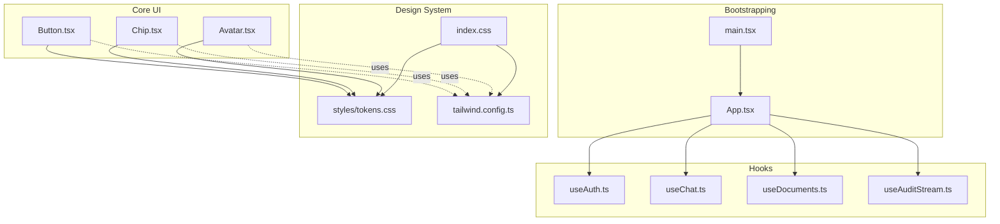
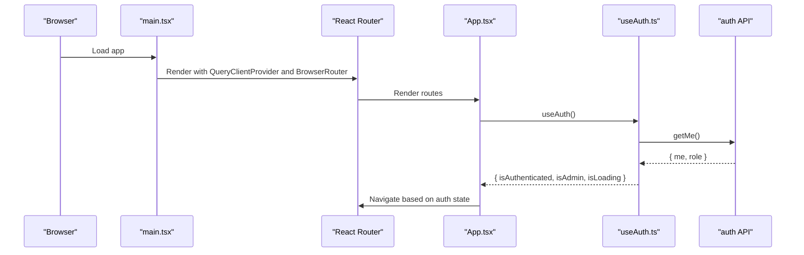
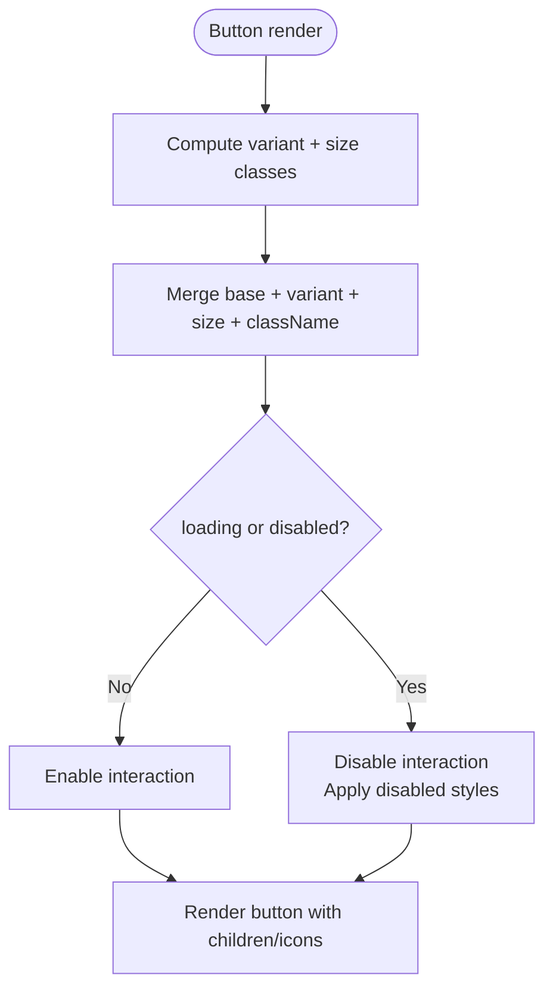
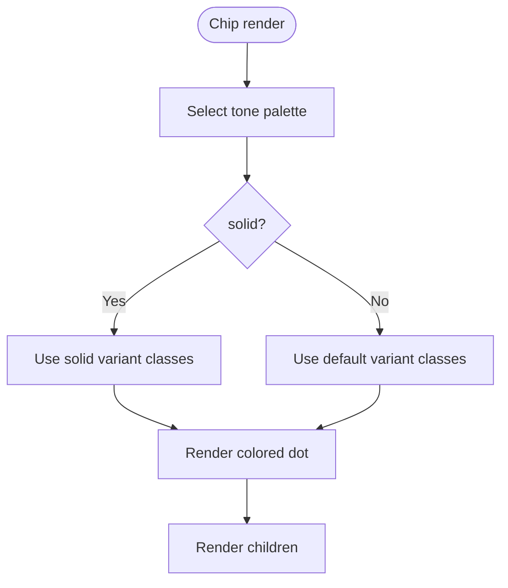
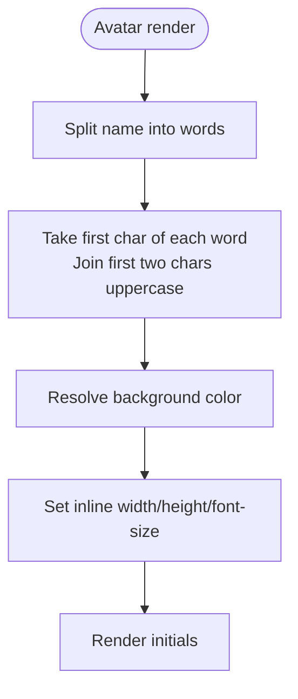
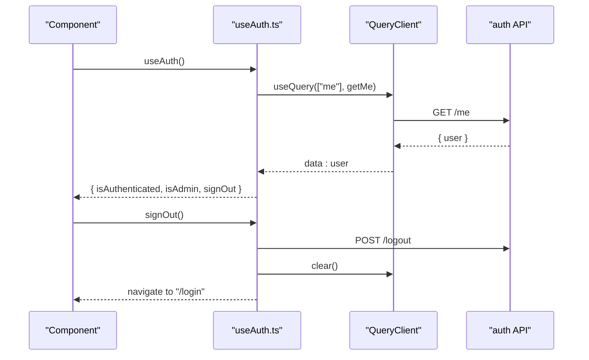
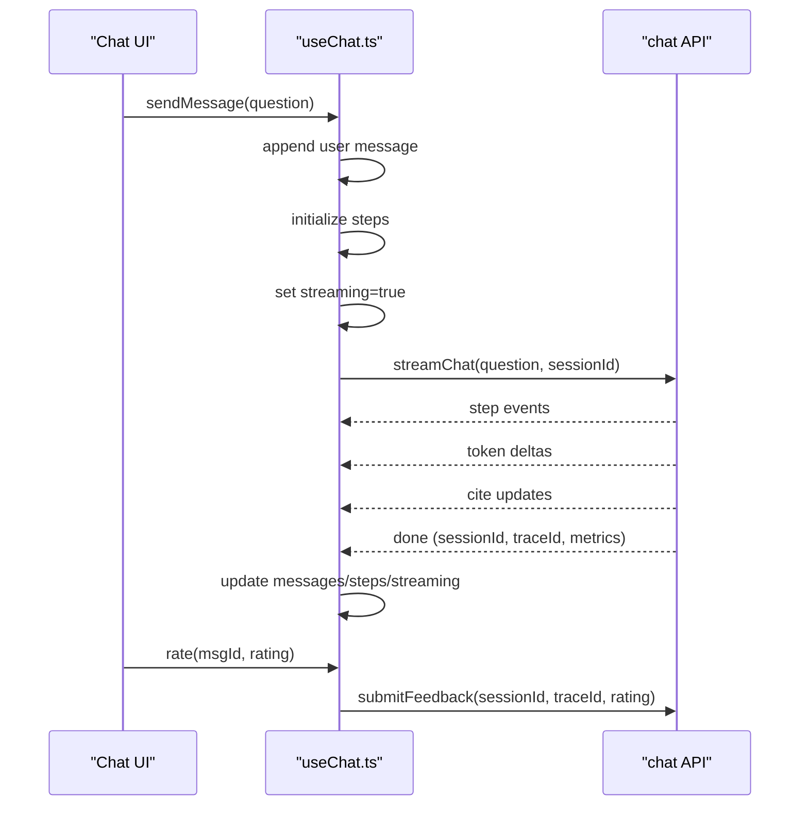
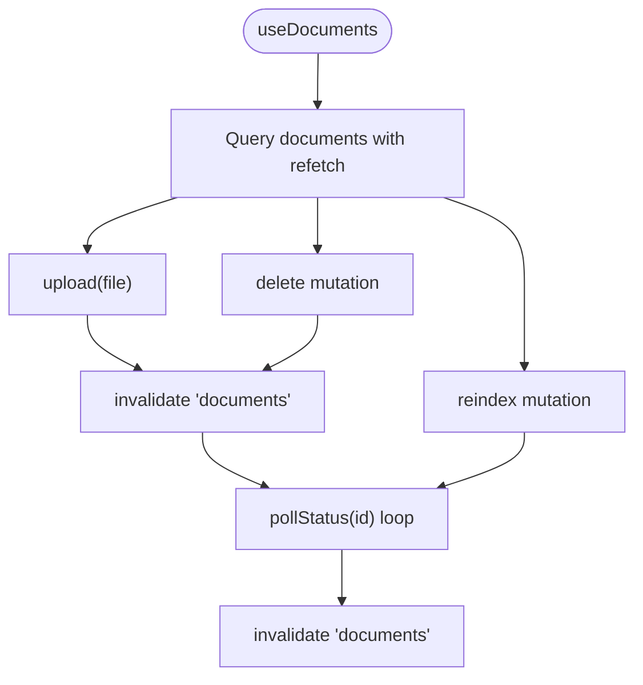
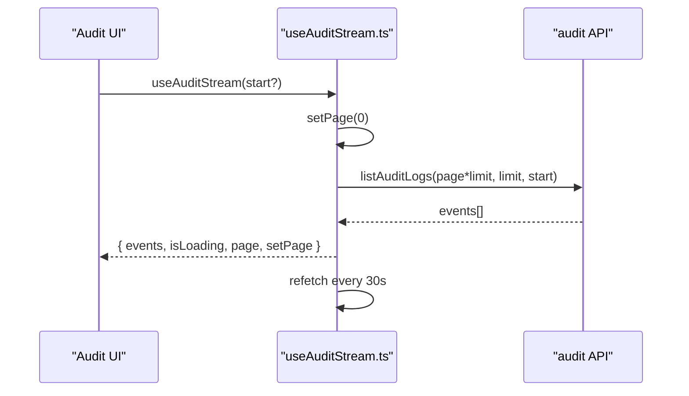
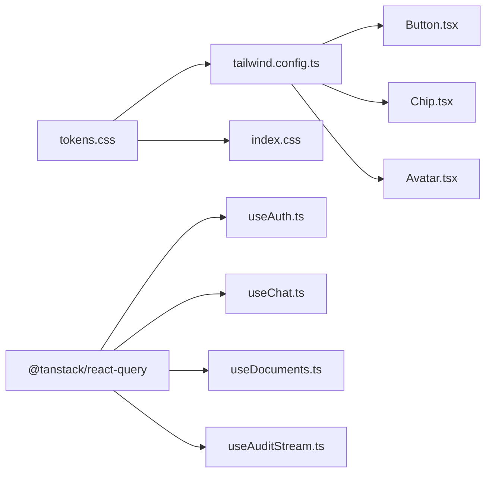

# Components Library

<cite>
**Referenced Files in This Document**
- [Button.tsx](file://safe4ai-pilot/frontend/src/components/Button.tsx)
- [Chip.tsx](file://safe4ai-pilot/frontend/src/components/Chip.tsx)
- [Avatar.tsx](file://safe4ai-pilot/frontend/src/components/Avatar.tsx)
- [useAuth.ts](file://safe4ai-pilot/frontend/src/hooks/useAuth.ts)
- [useChat.ts](file://safe4ai-pilot/frontend/src/hooks/useChat.ts)
- [useDocuments.ts](file://safe4ai-pilot/frontend/src/hooks/useDocuments.ts)
- [useAuditStream.ts](file://safe4ai-pilot/frontend/src/hooks/useAuditStream.ts)
- [App.tsx](file://safe4ai-pilot/frontend/src/App.tsx)
- [main.tsx](file://safe4ai-pilot/frontend/src/main.tsx)
- [tokens.css](file://safe4ai-pilot/frontend/src/styles/tokens.css)
- [tailwind.config.ts](file://safe4ai-pilot/frontend/tailwind.config.ts)
- [index.css](file://safe4ai-pilot/frontend/src/index.css)
- [package.json](file://safe4ai-pilot/frontend/package.json)
</cite>

## Table of Contents
1. [Introduction](#introduction)
2. [Project Structure](#project-structure)
3. [Core Components](#core-components)
4. [Architecture Overview](#architecture-overview)
5. [Detailed Component Analysis](#detailed-component-analysis)
6. [Dependency Analysis](#dependency-analysis)
7. [Performance Considerations](#performance-considerations)
8. [Troubleshooting Guide](#troubleshooting-guide)
9. [Conclusion](#conclusion)
10. [Appendices](#appendices)

## Introduction
This document describes the React component library and utility hooks that power the Private AI web frontend. It focuses on reusable UI components (Button, Chip, Avatar) and shared hooks (useAuth, useChat, useDocuments, useAuditStream). It explains component organization, props, styling via design tokens and Tailwind, integration patterns, and TypeScript usage. Practical guidance is included for creating new components, extending existing ones, and building custom hooks aligned with the design system.

## Project Structure
The frontend is organized around a small set of core UI components and hooks, with a cohesive design system built on CSS custom properties and Tailwind configuration. The application bootstraps a React Query provider, routes protected pages, and applies global styles.

**Diagram sources**
- [main.tsx:1-24](file://safe4ai-pilot/frontend/src/main.tsx#L1-L24)
- [App.tsx:1-100](file://safe4ai-pilot/frontend/src/App.tsx#L1-L100)
- [Button.tsx:1-56](file://safe4ai-pilot/frontend/src/components/Button.tsx#L1-L56)
- [Chip.tsx:1-32](file://safe4ai-pilot/frontend/src/components/Chip.tsx#L1-L32)
- [Avatar.tsx:1-15](file://safe4ai-pilot/frontend/src/components/Avatar.tsx#L1-L15)
- [useAuth.ts:1-28](file://safe4ai-pilot/frontend/src/hooks/useAuth.ts#L1-L28)
- [useChat.ts:1-106](file://safe4ai-pilot/frontend/src/hooks/useChat.ts#L1-L106)
- [useDocuments.ts:1-61](file://safe4ai-pilot/frontend/src/hooks/useDocuments.ts#L1-L61)
- [useAuditStream.ts:1-17](file://safe4ai-pilot/frontend/src/hooks/useAuditStream.ts#L1-L17)
- [tokens.css:1-69](file://safe4ai-pilot/frontend/src/styles/tokens.css#L1-L69)
- [tailwind.config.ts:1-44](file://safe4ai-pilot/frontend/tailwind.config.ts#L1-L44)
- [index.css:1-16](file://safe4ai-pilot/frontend/src/index.css#L1-L16)

**Section sources**
- [main.tsx:1-24](file://safe4ai-pilot/frontend/src/main.tsx#L1-L24)
- [App.tsx:1-100](file://safe4ai-pilot/frontend/src/App.tsx#L1-L100)
- [tokens.css:1-69](file://safe4ai-pilot/frontend/src/styles/tokens.css#L1-L69)
- [tailwind.config.ts:1-44](file://safe4ai-pilot/frontend/tailwind.config.ts#L1-L44)
- [index.css:1-16](file://safe4ai-pilot/frontend/src/index.css#L1-L16)

## Core Components
This section documents the three primary UI primitives and their props, variants, and styling approach.

- Button
  - Purpose: Standard interactive control with multiple variants and sizes, optional icons, and loading/disabled states.
  - Key props: variant, size, iconLeft, iconRight, loading, disabled, children, onClick, type, className.
  - Variants: default, primary, accent, ghost, danger.
  - Sizes: sm, md, lg.
  - Styling: Uses CSS custom properties from tokens and Tailwind utility classes for layout and transitions.

- Chip
  - Purpose: Lightweight status or tag indicator with tone and variant options.
  - Key props: variant, tone, children.
  - Tones: neutral, success, warn, danger, accent.
  - Variants: default, solid.
  - Styling: Uses CSS custom properties and inline dot styling mapped per tone.

- Avatar
  - Purpose: Initials-based user or entity avatar with configurable size and color.
  - Key props: name, size, color.
  - Styling: Computes initials, sets background and font size based on props.

**Section sources**
- [Button.tsx:1-56](file://safe4ai-pilot/frontend/src/components/Button.tsx#L1-L56)
- [Chip.tsx:1-32](file://safe4ai-pilot/frontend/src/components/Chip.tsx#L1-L32)
- [Avatar.tsx:1-15](file://safe4ai-pilot/frontend/src/components/Avatar.tsx#L1-L15)

## Architecture Overview
The application initializes React Query and wraps the routing tree with providers. Protected routes enforce authentication and admin roles using the useAuth hook. Components consume design tokens and Tailwind utilities for consistent styling.

**Diagram sources**
- [main.tsx:1-24](file://safe4ai-pilot/frontend/src/main.tsx#L1-L24)
- [App.tsx:19-31](file://safe4ai-pilot/frontend/src/App.tsx#L19-L31)
- [useAuth.ts:5-27](file://safe4ai-pilot/frontend/src/hooks/useAuth.ts#L5-L27)

## Detailed Component Analysis

### Button Component
- Props and behavior
  - variant controls background, text, and border styles.
  - size controls height, padding, text size, and spacing.
  - loading toggles a spinner and disables interaction.
  - disabled prevents interaction and reduces opacity.
  - type aligns with HTML button semantics.
  - className allows additive customization.
- Styling approach
  - Base layout and focus ring classes are combined with variant and size maps.
  - CSS custom properties define semantic color tokens.
- Composition patterns
  - Combine iconLeft/iconRight with children to express actions succinctly.
  - Use variant primary for main actions, danger for destructive actions, ghost for secondary actions.

**Diagram sources**
- [Button.tsx:34-55](file://safe4ai-pilot/frontend/src/components/Button.tsx#L34-L55)

**Section sources**
- [Button.tsx:1-56](file://safe4ai-pilot/frontend/src/components/Button.tsx#L1-L56)
- [tokens.css:1-69](file://safe4ai-pilot/frontend/src/styles/tokens.css#L1-L69)
- [tailwind.config.ts:3-38](file://safe4ai-pilot/frontend/tailwind.config.ts#L3-L38)

### Chip Component
- Props and behavior
  - tone selects semantic color mapping (default vs solid).
  - variant switches between light/default and solid palettes.
  - children holds the label text.
- Styling approach
  - Uses tone-specific background/text/border combinations.
  - Inline dot color is derived from a tone-to-color map for visual accent.
- Composition patterns
  - Use neutral for informational tags, success/warn/danger for status, accent for highlights.

**Diagram sources**
- [Chip.tsx:24-31](file://safe4ai-pilot/frontend/src/components/Chip.tsx#L24-L31)

**Section sources**
- [Chip.tsx:1-32](file://safe4ai-pilot/frontend/src/components/Chip.tsx#L1-L32)
- [tokens.css:1-69](file://safe4ai-pilot/frontend/src/styles/tokens.css#L1-L69)
- [tailwind.config.ts:3-38](file://safe4ai-pilot/frontend/tailwind.config.ts#L3-L38)

### Avatar Component
- Props and behavior
  - name generates two-letter initials.
  - size controls width/height and font size.
  - color optionally overrides the default background.
- Styling approach
  - Computes initials and sets inline styles for size and background.
  - Uses a consistent rounded-circle presentation.
- Composition patterns
  - Pair with labels or in lists to represent users or entities.

**Diagram sources**
- [Avatar.tsx:3-14](file://safe4ai-pilot/frontend/src/components/Avatar.tsx#L3-L14)

**Section sources**
- [Avatar.tsx:1-15](file://safe4ai-pilot/frontend/src/components/Avatar.tsx#L1-L15)
- [tokens.css:1-69](file://safe4ai-pilot/frontend/src/styles/tokens.css#L1-L69)

### Utility Hooks

#### useAuth
- Responsibilities
  - Fetches current user profile via React Query.
  - Provides authentication and admin checks.
  - Handles sign-out by clearing cache and navigating to login.
- Returns
  - me, isLoading, isAuthenticated, isAdmin, signOut.
- Integration
  - Consumed by route guards in App.tsx to protect routes.

**Diagram sources**
- [useAuth.ts:5-27](file://safe4ai-pilot/frontend/src/hooks/useAuth.ts#L5-L27)
- [App.tsx:19-31](file://safe4ai-pilot/frontend/src/App.tsx#L19-L31)

**Section sources**
- [useAuth.ts:1-28](file://safe4ai-pilot/frontend/src/hooks/useAuth.ts#L1-L28)
- [App.tsx:1-100](file://safe4ai-pilot/frontend/src/App.tsx#L1-L100)

#### useChat
- Responsibilities
  - Manages chat message history, streaming steps, and streaming state.
  - Streams assistant responses, citations, and completion metadata.
  - Supports stopping the stream and rating messages.
- Returns
  - messages, steps, streaming, sendMessage, rate, stop.
- Integration
  - Used by chat UI components to orchestrate the conversation lifecycle.

**Diagram sources**
- [useChat.ts:17-105](file://safe4ai-pilot/frontend/src/hooks/useChat.ts#L17-L105)

**Section sources**
- [useChat.ts:1-106](file://safe4ai-pilot/frontend/src/hooks/useChat.ts#L1-L106)

#### useDocuments
- Responsibilities
  - Lists documents with periodic refetch.
  - Uploads new documents and polls ingestion status.
  - Deletes and reindexes documents.
- Returns
  - docs (with polling-aware status), isLoading, upload, uploadError, remove, reindex.

**Diagram sources**
- [useDocuments.ts:5-60](file://safe4ai-pilot/frontend/src/hooks/useDocuments.ts#L5-L60)

**Section sources**
- [useDocuments.ts:1-61](file://safe4ai-pilot/frontend/src/hooks/useDocuments.ts#L1-L61)

#### useAuditStream
- Responsibilities
  - Paginates audit log events with a fixed page size.
  - Auto-refreshes periodically.
- Returns
  - events, isLoading, page, setPage, limit.

**Diagram sources**
- [useAuditStream.ts:5-16](file://safe4ai-pilot/frontend/src/hooks/useAuditStream.ts#L5-L16)

**Section sources**
- [useAuditStream.ts:1-17](file://safe4ai-pilot/frontend/src/hooks/useAuditStream.ts#L1-L17)

## Dependency Analysis
The design system is centralized in CSS custom properties and extended into Tailwind. Components rely on these tokens for consistent colors, typography, and spacing. The hooks depend on React Query for caching and server synchronization.

**Diagram sources**
- [tokens.css:1-69](file://safe4ai-pilot/frontend/src/styles/tokens.css#L1-L69)
- [tailwind.config.ts:1-44](file://safe4ai-pilot/frontend/tailwind.config.ts#L1-L44)
- [index.css:1-16](file://safe4ai-pilot/frontend/src/index.css#L1-L16)
- [Button.tsx:1-56](file://safe4ai-pilot/frontend/src/components/Button.tsx#L1-L56)
- [Chip.tsx:1-32](file://safe4ai-pilot/frontend/src/components/Chip.tsx#L1-L32)
- [Avatar.tsx:1-15](file://safe4ai-pilot/frontend/src/components/Avatar.tsx#L1-L15)
- [useAuth.ts:1-28](file://safe4ai-pilot/frontend/src/hooks/useAuth.ts#L1-L28)
- [useChat.ts:1-106](file://safe4ai-pilot/frontend/src/hooks/useChat.ts#L1-L106)
- [useDocuments.ts:1-61](file://safe4ai-pilot/frontend/src/hooks/useDocuments.ts#L1-L61)
- [useAuditStream.ts:1-17](file://safe4ai-pilot/frontend/src/hooks/useAuditStream.ts#L1-L17)

**Section sources**
- [package.json:11-30](file://safe4ai-pilot/frontend/package.json#L11-L30)
- [tokens.css:1-69](file://safe4ai-pilot/frontend/src/styles/tokens.css#L1-L69)
- [tailwind.config.ts:1-44](file://safe4ai-pilot/frontend/tailwind.config.ts#L1-L44)

## Performance Considerations
- React Query defaults
  - Stale time and refetch intervals are configured to balance freshness and network load.
- Streaming
  - useChat streams incremental updates; avoid unnecessary re-renders by updating only affected parts of state.
- Polling
  - useDocuments polls ingestion status with bounded retries; keep polling duration reasonable to prevent excessive requests.
- CSS custom properties
  - Using tokens ensures efficient style updates and avoids duplication across components.

[No sources needed since this section provides general guidance]

## Troubleshooting Guide
- Authentication redirects
  - If navigation to protected routes fails, verify useAuth returns a valid user and that App route guards are applied.
- Chat streaming errors
  - On stream error events, messages are updated with an error message; ensure UI surfaces this state to users.
- Document uploads
  - Upload failures surface an error message; confirm file type and size constraints and retry.
- Audit pagination
  - If events do not refresh, check the refetch interval and page boundaries.

**Section sources**
- [App.tsx:19-31](file://safe4ai-pilot/frontend/src/App.tsx#L19-L31)
- [useChat.ts:83-87](file://safe4ai-pilot/frontend/src/hooks/useChat.ts#L83-L87)
- [useDocuments.ts:34-36](file://safe4ai-pilot/frontend/src/hooks/useDocuments.ts#L34-L36)
- [useAuditStream.ts:9-13](file://safe4ai-pilot/frontend/src/hooks/useAuditStream.ts#L9-L13)

## Conclusion
The component library centers on three lightweight, theme-driven primitives—Button, Chip, and Avatar—combined with four focused hooks for auth, chat, documents, and audit. The design system is defined via CSS custom properties and Tailwind, ensuring consistent visuals and scalable maintenance. The hooks integrate with React Query to manage server state and caching, enabling robust UI flows with minimal boilerplate.

[No sources needed since this section summarizes without analyzing specific files]

## Appendices

### Design System and Theme Support
- Tokens
  - Semantic colors (ink, paper, surface, line, text), status colors (success, warn, danger), and accents.
  - Typography scales and spacing scales.
- Tailwind extension
  - Colors, fonts, border radii, shadows, and letter spacing are exposed as Tailwind theme keys.
- Global styles
  - index.css imports tokens and enables Tailwind layers, setting base font family and body styles.

**Section sources**
- [tokens.css:1-69](file://safe4ai-pilot/frontend/src/styles/tokens.css#L1-L69)
- [tailwind.config.ts:3-38](file://safe4ai-pilot/frontend/tailwind.config.ts#L3-L38)
- [index.css:1-16](file://safe4ai-pilot/frontend/src/index.css#L1-L16)

### Responsive Design Principles
- Typography and spacing scales are defined in tokens to maintain readability across breakpoints.
- Components use relative sizing and padding to adapt to container widths.
- Tailwind utilities enable responsive variants where needed.

**Section sources**
- [tokens.css:53-68](file://safe4ai-pilot/frontend/src/styles/tokens.css#L53-L68)
- [index.css:7-15](file://safe4ai-pilot/frontend/src/index.css#L7-L15)

### Creating New Components
- Follow the existing pattern:
  - Define a functional component with a clear prop interface.
  - Use tokens and Tailwind utilities for styling.
  - Keep variants and sizes explicit and documented.
  - Export a default component and reuse design tokens.

**Section sources**
- [Button.tsx:21-32](file://safe4ai-pilot/frontend/src/components/Button.tsx#L21-L32)
- [Chip.tsx:22](file://safe4ai-pilot/frontend/src/components/Chip.tsx#L22)
- [Avatar.tsx:1](file://safe4ai-pilot/frontend/src/components/Avatar.tsx#L1)

### Extending Existing Components
- Add new variants or sizes by expanding the variant/scale maps and adding corresponding Tailwind classes.
- Introduce new props with sensible defaults and derive styles from tokens.
- Maintain backward compatibility by keeping default props unchanged.

**Section sources**
- [Button.tsx:7-19](file://safe4ai-pilot/frontend/src/components/Button.tsx#L7-L19)
- [Chip.tsx:6-12](file://safe4ai-pilot/frontend/src/components/Chip.tsx#L6-L12)

### Implementing Custom Hooks
- Use React Query for data fetching and caching.
- Encapsulate state updates and side effects in callbacks returned by the hook.
- Expose a minimal, predictable interface and handle loading/error states gracefully.
- Invalidate queries appropriately after mutations.

**Section sources**
- [useAuth.ts:8-18](file://safe4ai-pilot/frontend/src/hooks/useAuth.ts#L8-L18)
- [useDocuments.ts:10-26](file://safe4ai-pilot/frontend/src/hooks/useDocuments.ts#L10-L26)
- [useAuditStream.ts:9-13](file://safe4ai-pilot/frontend/src/hooks/useAuditStream.ts#L9-L13)