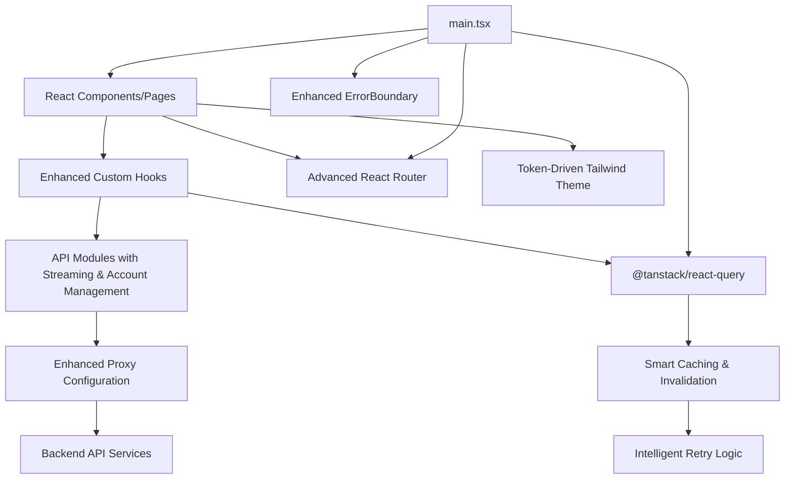
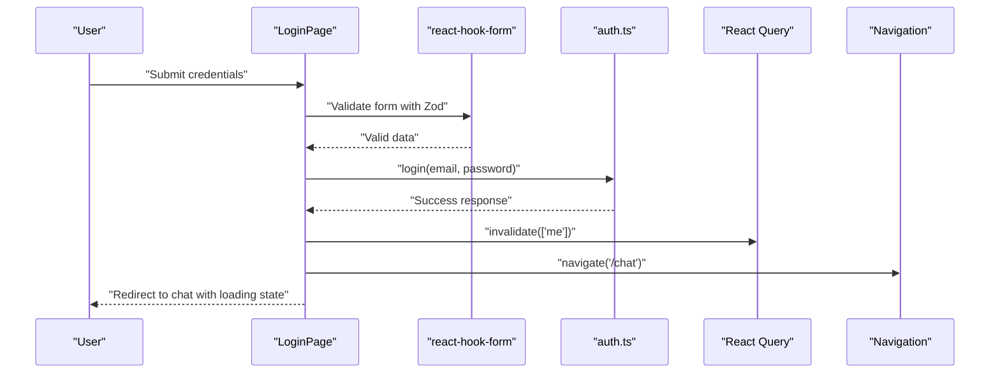
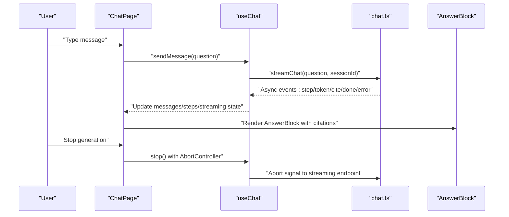
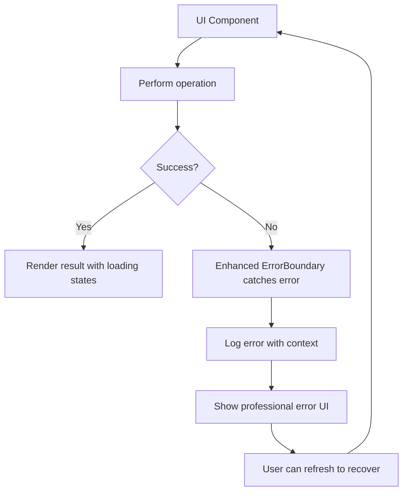
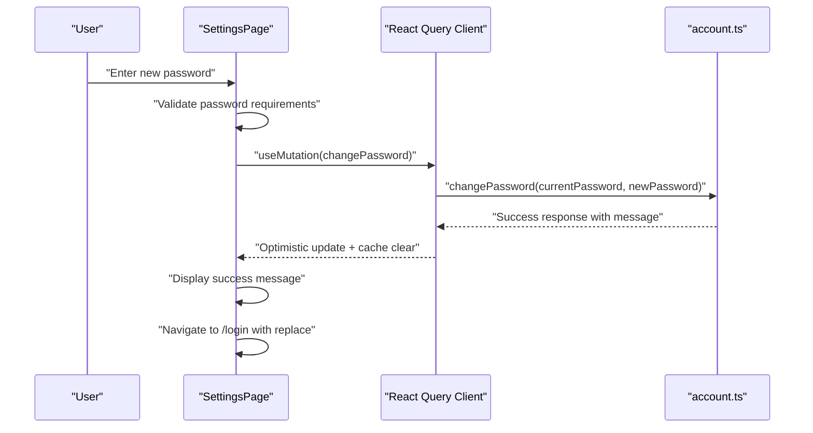
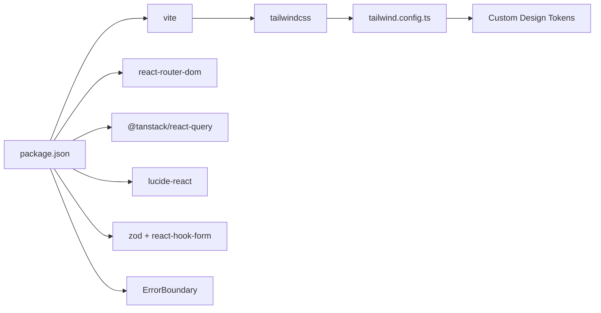

# Frontend Application

<cite>
**Referenced Files in This Document**
- [App.tsx](file://safe4ai-pilot/frontend/src/App.tsx)
- [main.tsx](file://safe4ai-pilot/frontend/src/main.tsx)
- [package.json](file://safe4ai-pilot/frontend/package.json)
- [vite.config.ts](file://safe4ai-pilot/frontend/vite.config.ts)
- [nginx.conf](file://safe4ai-pilot/frontend/nginx.conf)
- [tailwind.config.ts](file://safe4ai-pilot/frontend/tailwind.config.ts)
- [ChatPage.tsx](file://safe4ai-pilot/frontend/src/pages/ChatPage.tsx)
- [LoginPage.tsx](file://safe4ai-pilot/frontend/src/pages/LoginPage.tsx)
- [ErrorBoundary.tsx](file://safe4ai-pilot/frontend/src/components/ErrorBoundary.tsx)
- [useAuth.ts](file://safe4ai-pilot/frontend/src/hooks/useAuth.ts)
- [useChat.ts](file://safe4ai-pilot/frontend/src/hooks/useChat.ts)
- [useSettings.ts](file://safe4ai-pilot/frontend/src/hooks/useSettings.ts)
- [ActivityPage.tsx](file://safe4ai-pilot/frontend/src/pages/admin/ActivityPage.tsx)
- [DocumentsPage.tsx](file://safe4ai-pilot/frontend/src/pages/admin/DocumentsPage.tsx)
- [FeedbackPage.tsx](file://safe4ai-pilot/frontend/src/pages/admin/FeedbackPage.tsx)
- [OverviewPage.tsx](file://safe4ai-pilot/frontend/src/pages/admin/OverviewPage.tsx)
- [UsersPage.tsx](file://safe4ai-pilot/frontend/src/pages/admin/UsersPage.tsx)
- [AdminLayout.tsx](file://safe4ai-pilot/frontend/src/pages/admin/AdminLayout.tsx)
- [SettingsPage.tsx](file://safe4ai-pilot/frontend/src/pages/SettingsPage.tsx)
- [SettingsPage.tsx](file://safe4ai-pilot/frontend/src/pages/admin/SettingsPage.tsx)
- [auth.ts](file://safe4ai-pilot/frontend/src/api/auth.ts)
- [chat.ts](file://safe4ai-pilot/frontend/src/api/chat.ts)
- [account.ts](file://safe4ai-pilot/frontend/src/api/account.ts)
- [settings.ts](file://safe4ai-pilot/frontend/src/api/settings.ts)
- [client.ts](file://safe4ai-pilot/frontend/src/api/client.ts)
- [AnswerBlock.tsx](file://safe4ai-pilot/frontend/src/components/chat/AnswerBlock.tsx)
</cite>

## Update Summary
**Changes Made**
- Updated proxy configuration documentation to reflect the addition of `/settings` endpoint routing
- Enhanced API client documentation to explain proper API communication patterns
- Added comprehensive explanation of SPA bypass mechanism for proper routing
- Updated troubleshooting guide to address proxy configuration issues
- Enhanced development workflow documentation with proxy configuration details

## Table of Contents
1. [Introduction](#introduction)
2. [Project Structure](#project-structure)
3. [Core Components](#core-components)
4. [Architecture Overview](#architecture-overview)
5. [Detailed Component Analysis](#detailed-component-analysis)
6. [Design System Implementation](#design-system-implementation)
7. [Admin Dashboard Features](#admin-dashboard-features)
8. [Enhanced Chat Interface](#enhanced-chat-interface)
9. [User Settings Implementation](#user-settings-implementation)
10. [Proxy Configuration and API Communication](#proxy-configuration-and-api-communication)
11. [Dependency Analysis](#dependency-analysis)
12. [Performance Considerations](#performance-considerations)
13. [Troubleshooting Guide](#troubleshooting-guide)
14. [Conclusion](#conclusion)
15. [Appendices](#appendices)

## Introduction
This document describes the frontend application for a React TypeScript single-page application built with modern web tooling. The application features a complete frontend overhaul with a new design system integration, comprehensive admin dashboard implementation, enhanced chat interface with streaming capabilities, and improved component architecture following React Query patterns. It focuses on component architecture, routing, state management, design system via Tailwind CSS, API integration patterns, error handling, and loading states. The application includes system monitoring and user management capabilities, along with an advanced AI chat interface featuring real-time streaming and citation management, plus comprehensive user settings management.

**Updated** Enhanced with improved proxy configuration for proper API communication routing and SPA fallback handling.

## Project Structure
The frontend is organized around a clear separation of concerns with enhanced admin capabilities and user settings:
- Pages: top-level routes and page containers including comprehensive admin sections and user settings
- Components: reusable UI primitives and composite widgets with enhanced chat and admin components
- Hooks: domain-specific state/logic extracted from components using React Query patterns
- API: typed client functions for backend integration including account and settings management
- Styles: Tailwind CSS configuration with custom design tokens

```mermaid
graph TB
subgraph "Entry Point"
M["main.tsx"]
A["App.tsx"]
end
subgraph "Routing & Guards"
R1["/login"]
R2["/chat"]
R3["/admin/*"]
R4["/settings"]
RA["RequireAuth"]
RD["RequireAdmin"]
end
subgraph "Admin Pages"
AP["AdminLayout.tsx"]
OP["OverviewPage.tsx"]
DP["DocumentsPage.tsx"]
FP["FeedbackPage.tsx"]
UP["UsersPage.tsx"]
ACT["ActivityPage.tsx"]
ASP["Admin SettingsPage.tsx"]
end
subgraph "User Settings"
USP["User SettingsPage.tsx"]
ACCT["Account API Client"]
end
subgraph "Chat Interface"
CP["ChatPage.tsx"]
HC["useChat.ts"]
AB["AnswerBlock.tsx"]
COMP["Composer.tsx"]
MB["MessageBubble.tsx"]
SP["StreamingPipeline.tsx"]
end
subgraph "Hooks & API"
HA["useAuth.ts"]
CHAT["chat.ts"]
AUTH["auth.ts"]
ACC["account.ts"]
SET["settings.ts"]
CLIENT["api/client.ts"]
end
subgraph "Proxy Configuration"
PROXY["Vite Proxy Config"]
NGINX["Nginx Config"]
SPA["SPA Bypass Mechanism"]
end
subgraph "Design System"
TW["tailwind.config.ts"]
TOKENS["Custom Design Tokens"]
END
M --> A
A --> RA
A --> RD
RA --> R1
RA --> R2
RA --> R4
RD --> R3
R3 --> AP
AP --> OP
AP --> DP
AP --> FP
AP --> UP
AP --> ACT
AP --> ASP
R2 --> CP
CP --> HC
CP --> AB
CP --> COMP
CP --> MB
CP --> SP
CP --> HC
R4 --> USP
USP --> ACCT
M --> TW
TW --> TOKENS
PROXY --> CLIENT
NGINX --> PROXY
SPA --> PROXY
```

**Diagram sources**
- [main.tsx:1-33](file://safe4ai-pilot/frontend/src/main.tsx#L1-L33)
- [App.tsx:1-123](file://safe4ai-pilot/frontend/src/App.tsx#L1-L123)
- [AdminLayout.tsx:1-200](file://safe4ai-pilot/frontend/src/pages/admin/AdminLayout.tsx#L1-L200)
- [ChatPage.tsx:1-217](file://safe4ai-pilot/frontend/src/pages/ChatPage.tsx#L1-L217)
- [SettingsPage.tsx:1-279](file://safe4ai-pilot/frontend/src/pages/SettingsPage.tsx#L1-L279)
- [useAuth.ts:1-36](file://safe4ai-pilot/frontend/src/hooks/useAuth.ts#L1-L36)
- [useChat.ts:1-114](file://safe4ai-pilot/frontend/src/hooks/useChat.ts#L1-L114)
- [useSettings.ts:1-359](file://safe4ai-pilot/frontend/src/hooks/useSettings.ts#L1-L359)
- [vite.config.ts:15-35](file://safe4ai-pilot/frontend/vite.config.ts#L15-L35)
- [nginx.conf:16-31](file://safe4ai-pilot/frontend/nginx.conf#L16-L31)
- [spaBypass:9-13](file://safe4ai-pilot/frontend/vite.config.ts#L9-L13)

**Section sources**
- [main.tsx:1-33](file://safe4ai-pilot/frontend/src/main.tsx#L1-L33)
- [App.tsx:1-123](file://safe4ai-pilot/frontend/src/App.tsx#L1-L123)

## Core Components
- Advanced routing and guards:
  - Public route for login and protected routes for chat, admin, and user settings with role-based access control
  - Authentication guard blocks unauthenticated users from chat and settings
  - Admin guard blocks non-admin users from admin routes
  - Loading states during authentication transitions
- Global providers with enhanced error handling:
  - React Query client configured with sophisticated retry logic and error handling
  - Comprehensive error boundary wrapping the entire application
  - Browser router enabling SPA navigation with proper guards
- Design system with custom tokens:
  - Tailwind CSS configured with comprehensive design token set (colors, fonts, radii, shadows, letter-spacing)
  - Custom color palette with ink, paper, surface, line, and accent colors
  - Typography system with Geist and Instrument Serif fonts
  - Shadow system with subtle and prominent elevation effects

Practical examples:
- Extend the design system by adding new tokens to the Tailwind theme configuration and using them in components
- Add new admin pages by creating files under pages/admin, importing them in App routing, and protecting with RequireAdmin
- Implement new chat features by extending the useChat hook with additional streaming capabilities
- Add new user settings by extending the SettingsPage component and account API client

**Section sources**
- [App.tsx:22-34](file://safe4ai-pilot/frontend/src/App.tsx#L22-L34)
- [main.tsx:10-20](file://safe4ai-pilot/frontend/src/main.tsx#L10-L20)
- [tailwind.config.ts:3-43](file://safe4ai-pilot/frontend/tailwind.config.ts#L3-L43)

## Architecture Overview
The application follows a sophisticated layered architecture with enhanced state management:
- Presentation layer: React components and pages with comprehensive admin and chat interfaces, plus user settings management
- Domain logic: hooks encapsulating stateful logic for auth, chat, admin operations, and account management using React Query
- Data access: API modules with proper error handling, streaming support, and comprehensive account settings
- State management: React Query for caching, invalidation, background updates, and optimistic UI
- Routing: React Router with advanced route-level guards and loading states
- Design system: Token-driven theming with consistent visual language across all components



**Diagram sources**
- [main.tsx:1-33](file://safe4ai-pilot/frontend/src/main.tsx#L1-L33)
- [useAuth.ts:1-36](file://safe4ai-pilot/frontend/src/hooks/useAuth.ts#L1-L36)
- [useChat.ts:1-114](file://safe4ai-pilot/frontend/src/hooks/useChat.ts#L1-L114)
- [account.ts:1-44](file://safe4ai-pilot/frontend/src/api/account.ts#L1-L44)
- [settings.ts:1-135](file://safe4ai-pilot/frontend/src/api/settings.ts#L1-L135)
- [client.ts:1-60](file://safe4ai-pilot/frontend/src/api/client.ts#L1-L60)
- [vite.config.ts:15-35](file://safe4ai-pilot/frontend/vite.config.ts#L15-L35)

## Detailed Component Analysis

### Authentication and Authorization
- Enhanced useAuth hook:
  - Fetches current user profile via React Query with proper error handling
  - Provides comprehensive authentication and admin flags with loading states
  - Handles sign-out with cache clearing and automatic redirection
  - Implements unauthorized event handling for automatic session cleanup
- Advanced LoginPage:
  - Sophisticated form validation with Zod and react-hook-form
  - Dual-panel design with dark branding and light form panel
  - Server-side error handling with user-friendly messaging
  - Loading states during authentication processes



**Diagram sources**
- [LoginPage.tsx:17-36](file://safe4ai-pilot/frontend/src/pages/LoginPage.tsx#L17-L36)
- [auth.ts:10-11](file://safe4ai-pilot/frontend/src/api/auth.ts#L10-L11)
- [useAuth.ts:8-12](file://safe4ai-pilot/frontend/src/hooks/useAuth.ts#L8-L12)

**Section sources**
- [useAuth.ts:1-36](file://safe4ai-pilot/frontend/src/hooks/useAuth.ts#L1-L36)
- [LoginPage.tsx:1-147](file://safe4ai-pilot/frontend/src/pages/LoginPage.tsx#L1-L147)
- [auth.ts:10-16](file://safe4ai-pilot/frontend/src/api/auth.ts#L10-L16)

### Enhanced Chat Interface and Streaming
- Comprehensive ChatPage orchestration:
  - Advanced header with branding, admin link (for admins), avatar, and sign-out
  - Sophisticated message rendering with AnswerBlock for assistant responses
  - Enhanced suggested prompts with policy-based recommendations
  - Advanced Composer with stop generation controls and streaming indicators
  - Real-time citation drawer with source management
- Advanced useChat hook:
  - Complex message lifecycle management with streaming updates
  - Multi-step processing pipeline (embed, retrieve, rerank, generate)
  - Comprehensive rating submission with feedback integration
  - Advanced AbortController implementation for cancellation
  - Trust metrics and performance tracking
- Enhanced AnswerBlock component:
  - Assistant response rendering with citations and trust signals
  - Copy functionality with clipboard API integration
  - Rating system with optimistic UI updates
  - Citation management with drawer integration



**Diagram sources**
- [ChatPage.tsx:30-191](file://safe4ai-pilot/frontend/src/pages/ChatPage.tsx#L30-L191)
- [useChat.ts:17-103](file://safe4ai-pilot/frontend/src/hooks/useChat.ts#L17-L103)
- [chat.ts:21-76](file://safe4ai-pilot/frontend/src/api/chat.ts#L21-L76)
- [AnswerBlock.tsx:36-114](file://safe4ai-pilot/frontend/src/components/chat/AnswerBlock.tsx#L36-L114)

**Section sources**
- [ChatPage.tsx:1-217](file://safe4ai-pilot/frontend/src/pages/ChatPage.tsx#L1-L217)
- [useChat.ts:1-114](file://safe4ai-pilot/frontend/src/hooks/useChat.ts#L1-L114)
- [AnswerBlock.tsx:1-114](file://safe4ai-pilot/frontend/src/components/chat/AnswerBlock.tsx#L1-L114)
- [chat.ts:21-76](file://safe4ai-pilot/frontend/src/api/chat.ts#L21-L76)

### Error Handling and Loading States
- Enhanced ErrorBoundary:
  - Comprehensive error catching with detailed error logging
  - User-friendly recovery interface with refresh option
  - Professional error presentation with actionable feedback
- Advanced loading states:
  - Authentication loading with spinner and neutral messaging
  - Chat streaming indicators with pulse animation
  - Admin page loading states with skeleton screens
  - Form submission states with loading indicators
  - User settings loading states with detailed error handling
- Comprehensive error management:
  - API error handling with proper error boundaries
  - Form validation errors with visual feedback
  - Network error handling with retry mechanisms



**Diagram sources**
- [ErrorBoundary.tsx:13-42](file://safe4ai-pilot/frontend/src/components/ErrorBoundary.tsx#L13-L42)
- [LoginPage.tsx:26-35](file://safe4ai-pilot/frontend/src/pages/LoginPage.tsx#L26-L35)
- [ChatPage.tsx:85-114](file://safe4ai-pilot/frontend/src/pages/ChatPage.tsx#L85-L114)
- [SettingsPage.tsx:145-153](file://safe4ai-pilot/frontend/src/pages/SettingsPage.tsx#L145-L153)

**Section sources**
- [ErrorBoundary.tsx:1-43](file://safe4ai-pilot/frontend/src/components/ErrorBoundary.tsx#L1-L43)
- [LoginPage.tsx:1-147](file://safe4ai-pilot/frontend/src/pages/LoginPage.tsx#L1-L147)
- [ChatPage.tsx:1-217](file://safe4ai-pilot/frontend/src/pages/ChatPage.tsx#L1-L217)
- [SettingsPage.tsx:1-279](file://safe4ai-pilot/frontend/src/pages/SettingsPage.tsx#L1-L279)

## Design System Implementation
The application features a comprehensive design system with custom token-driven theming:

### Color Palette
- **Ink**: Primary text and content (#0b0d10, #16191e, #232730, #353a44)
- **Paper**: Background and surface colors (#fafaf7, #f4f1ea, #ebe7dd)
- **Surface**: Card and container backgrounds (#ffffff, #f7f5f0)
- **Line**: Border and divider colors (#e7e3d8, #d6dde6, #c2c8d2)
- **Accent**: Brand and interactive colors (#3b6cf2, #2a55d4, #eaf0ff, #f4f7ff)
- **Status**: Semantic colors (success: #2f8f5e, warn: #b87a1a, danger: #c0392b)

### Typography System
- **Sans**: Geist font family for body text
- **Mono**: Geist Mono for code and technical content
- **Serif**: Instrument Serif for headings and emphasis
- - **Letter Spacing**: Tight, snug, body, and kicker variations

### Component Design Principles
- **Consistent Spacing**: Grid-based layout system with 4px baseline
- **Elevation**: Subtle shadows for depth (sm, DEFAULT, pop variations)
- **Rounded Corners**: Multiple radius values (sm: 4px, DEFAULT: 6px, lg: 10px, xl: 14px)
- **Transitions**: Smooth 150ms transitions for interactive states

**Section sources**
- [tailwind.config.ts:1-44](file://safe4ai-pilot/frontend/tailwind.config.ts#L1-L44)

## Admin Dashboard Features
The comprehensive admin dashboard provides enterprise-grade monitoring and management capabilities:

### AdminLayout Framework
- **Navigation System**: Sidebar with active state highlighting and badge indicators
- **Health Monitoring**: Real-time system status indicators
- **User Management**: Admin-only access with proper role-based routing
- **Responsive Design**: Mobile-friendly navigation with collapsible sidebar

### Overview Dashboard
- **Real-time Metrics**: Live traffic, quality, and cost analytics
- **Performance Tracking**: Latency, cache efficiency, and cost per query metrics
- **Quality Indicators**: Positive/negative feedback ratios with visual progress bars
- **Notable Items**: Automated alerts for negative feedback and system issues

### Document Management
- **Upload System**: Drag-and-drop file uploads with progress indication
- **Indexing Pipeline**: Real-time status tracking (queued, embedding, indexed, failed)
- **Document Inspector**: Detailed metadata and indexing information
- **Bulk Operations**: Batch reindexing and deletion capabilities

### Activity Monitoring
- **Live Audit Stream**: Continuous feed of system events with timestamp sorting
- **Filtering System**: Kind-based filtering (query, index, feedback, auth, fallback)
- **Export Capabilities**: CSV export functionality for audit trails
- **Pagination**: Efficient loading of historical events

### User Administration
- **Team Management**: Invite new users with role assignment
- **Status Control**: Activate/deactivate user accounts
- **Role Management**: Admin and pilot_user role differentiation
- **Audit Trail**: Complete user management audit logging

### Feedback Review
- **Rating System**: Visual thumbs-up/thumbs-down indicators
- **Comment Analysis**: Text-based feedback with sentiment analysis
- **Trace Integration**: Connection to underlying system traces
- **Bulk Operations**: Efficient filtering and navigation through feedback items

**Section sources**
- [AdminLayout.tsx:1-200](file://safe4ai-pilot/frontend/src/pages/admin/AdminLayout.tsx#L1-L200)
- [OverviewPage.tsx:1-179](file://safe4ai-pilot/frontend/src/pages/admin/OverviewPage.tsx#L1-L179)
- [DocumentsPage.tsx:1-242](file://safe4ai-pilot/frontend/src/pages/admin/DocumentsPage.tsx#L1-L242)
- [ActivityPage.tsx:1-179](file://safe4ai-pilot/frontend/src/pages/admin/ActivityPage.tsx#L1-L179)
- [UsersPage.tsx:1-459](file://safe4ai-pilot/frontend/src/pages/admin/UsersPage.tsx#L1-L459)
- [FeedbackPage.tsx:1-207](file://safe4ai-pilot/frontend/src/pages/admin/FeedbackPage.tsx#L1-L207)

## Enhanced Chat Interface
The chat interface features advanced streaming capabilities and comprehensive citation management:

### Streaming Architecture
- **Multi-stage Processing**: Embedding, retrieval, reranking, and generation phases
- **Real-time Updates**: Progressive token streaming with delta updates
- **Step Progression**: Visual indicators for each processing stage
- **Abort Control**: Graceful cancellation of ongoing streams

### Citation Management
- **Source Tracking**: Automatic citation extraction and management
- **Drawer Interface**: Collapsible citation panel with active highlighting
- **Source Details**: Chunk-level information with relevance scoring
- **Integration**: Seamless connection between chat messages and sources

### User Experience Enhancements
- **Suggested Prompts**: Context-aware recommendations based on document types
- **Trust Signals**: Performance metrics and caching information
- **Rating System**: One-click feedback with trace association
- **Copy Functionality**: Clipboard integration for easy content sharing

### Technical Implementation
- **Event Stream Processing**: Proper handling of SSE-like streaming protocols
- **State Management**: Complex message state with streaming deltas
- **Performance Optimization**: Efficient rendering of large conversation histories
- **Error Recovery**: Graceful handling of streaming interruptions

**Section sources**
- [ChatPage.tsx:1-217](file://safe4ai-pilot/frontend/src/pages/ChatPage.tsx#L1-L217)
- [useChat.ts:1-114](file://safe4ai-pilot/frontend/src/hooks/useChat.ts#L1-L114)
- [AnswerBlock.tsx:1-114](file://safe4ai-pilot/frontend/src/components/chat/AnswerBlock.tsx#L1-L114)

## User Settings Implementation

### Authenticated Settings Route
The application now includes a dedicated user settings route at `/settings` with comprehensive account management capabilities:
- **Protected Route**: Requires authentication via RequireAuth guard
- **Comprehensive Account Information**: Displays user profile, security settings, usage statistics, and knowledge base status
- **Password Change Management**: Secure password modification with validation and error handling
- **Usage Analytics**: Real-time metrics for questions, feedback, and last activity
- **Knowledge Base Monitoring**: Status tracking for document indexing and chunk management

### SettingsPage Component Architecture
The SettingsPage component implements a sophisticated user settings interface with:
- **Header Navigation**: Logo, back-to-chat navigation, and user avatar with sign-out
- **Account Information Section**: Displays email, role, status, and creation date
- **Security Management**: Session lifetime, password login status, and password change permissions
- **Password Change Form**: Comprehensive validation with security requirements
- **Usage Statistics**: 7-day and 30-day question counts, feedback metrics, and last activity
- **Knowledge Base Status**: Document counts, chunk counts, failed indexing, and in-progress status

### Password Change Validation
The password change form implements strict validation requirements:
- **Length Requirements**: Minimum 12 characters
- **Character Complexity**: Must include uppercase, lowercase, digits, and special characters
- **Password Matching**: New password and confirmation must match
- **Real-time Validation**: Immediate feedback on validation errors
- **Security Permissions**: Password changes are disabled when SSO-only mode is enabled

### TanStack Query Integration
The settings implementation leverages TanStack Query for robust state management:
- **Account Settings Query**: Fetches and caches account information with 30-second stale time
- **Password Mutation**: Handles password change requests with optimistic updates
- **Error Handling**: Comprehensive error management with user-friendly messaging
- **Loading States**: Proper loading indicators during data fetching and mutations
- **Cache Invalidation**: Automatic cache clearing after successful password changes



**Diagram sources**
- [SettingsPage.tsx:79-97](file://safe4ai-pilot/frontend/src/pages/SettingsPage.tsx#L79-L97)
- [account.ts:39-44](file://safe4ai-pilot/frontend/src/api/account.ts#L39-L44)
- [useAuth.ts:16-20](file://safe4ai-pilot/frontend/src/hooks/useAuth.ts#L16-L20)

**Section sources**
- [SettingsPage.tsx:1-279](file://safe4ai-pilot/frontend/src/pages/SettingsPage.tsx#L1-L279)
- [account.ts:1-44](file://safe4ai-pilot/frontend/src/api/account.ts#L1-L44)
- [App.tsx:109-116](file://safe4ai-pilot/frontend/src/App.tsx#L109-L116)

## Proxy Configuration and API Communication

### Enhanced Proxy Configuration
The frontend now features a comprehensive proxy configuration that ensures proper routing of API requests and prevents JavaScript errors when accessing settings endpoints:

#### Vite Development Proxy
The Vite development server includes sophisticated proxy configuration that routes different API endpoints to the backend:
- **Authentication Endpoints**: `/auth`, `/me` - Direct routing for login and user profile
- **Account Management**: `/account` - Dedicated routing for user account operations
- **Feedback System**: `/feedback` - Separate routing for feedback submissions
- **Chat Streaming**: `/chat/stream` - Special handling for streaming chat responses
- **Admin Routes**: `/admin/*` - Protected admin endpoints with SPA bypass
- **Settings Endpoint**: `/settings` - Critical endpoint routing with SPA bypass

#### SPA Bypass Mechanism
The proxy configuration includes a sophisticated `spaBypass` function that intelligently routes requests:
- **Browser Navigation Detection**: Checks `Accept` header for `text/html` to serve SPA
- **API Request Detection**: Allows non-HTML requests to reach backend API
- **Prevents JavaScript Errors**: Ensures settings endpoints don't trigger SPA fallback

#### Nginx Production Configuration
The production nginx configuration complements the Vite proxy with:
- **Static Asset Serving**: Proper SPA fallback with `try_files $uri $uri/ /index.html`
- **API Proxying**: Routes `/auth`, `/chat`, `/me`, `/account`, `/admin`, `/feedback`, `/settings`, `/health` to backend
- **Streaming Support**: Enables SSE with `proxy_buffering off` and appropriate timeouts
- **Security Headers**: Removes hop-by-hop headers to prevent desync issues

### API Client Integration
The API client (`client.ts`) works seamlessly with the proxy configuration:
- **Base URL Resolution**: Uses `import.meta.env.VITE_API_URL` for dynamic backend configuration
- **CSRF Protection**: Automatically includes CSRF tokens for non-GET requests
- **Error Handling**: Comprehensive error handling with unauthorized event emission
- **Credential Management**: Maintains session cookies across requests

### Development Workflow
The proxy configuration enables smooth development workflow:
- **Local Development**: Vite proxy routes to local backend API
- **Environment Flexibility**: Configurable API URL through environment variables
- **Hot Reload**: Proper API routing maintains development experience
- **Testing**: Consistent API behavior across development and production

**Updated** Enhanced proxy configuration ensures proper routing of user account API requests, preventing JavaScript errors when accessing settings endpoints and ensuring reliable API communication.

**Section sources**
- [vite.config.ts:15-35](file://safe4ai-pilot/frontend/vite.config.ts#L15-L35)
- [nginx.conf:16-31](file://safe4ai-pilot/frontend/nginx.conf#L16-L31)
- [client.ts:1-60](file://safe4ai-pilot/frontend/src/api/client.ts#L1-L60)
- [spaBypass:9-13](file://safe4ai-pilot/frontend/vite.config.ts#L9-L13)

## Dependency Analysis
- **Build and Toolchain**: Enhanced with comprehensive development workflow
  - Vite for dev server and production bundling with API proxy configuration
  - React plugin for JSX transformations with modern React features
  - TypeScript for enhanced type safety and developer experience
- **Runtime Libraries**: Advanced ecosystem with specialized packages
  - React Router for declarative routing with advanced guards
  - React Query for sophisticated caching, background updates, and optimistic UI
  - Lucide icons for consistent iconography across all components
  - Zod and react-hook-form for comprehensive form validation
  - Enhanced error boundary for robust error handling
- **Styling**: Comprehensive design system with custom theming
  - Tailwind CSS with custom token-driven theme configuration
  - PostCSS for advanced CSS processing
  - Autoprefixer for cross-browser compatibility



**Diagram sources**
- [package.json:6-31](file://safe4ai-pilot/frontend/package.json#L6-L31)
- [tailwind.config.ts:40-43](file://safe4ai-pilot/frontend/tailwind.config.ts#L40-L43)

**Section sources**
- [package.json:1-32](file://safe4ai-pilot/frontend/package.json#L1-L32)
- [vite.config.ts:1-35](file://safe4ai-pilot/frontend/vite.config.ts#L1-L35)
- [tailwind.config.ts:1-44](file://safe4ai-pilot/frontend/tailwind.config.ts#L1-L44)

## Performance Considerations
- **React Query Optimization**: Smart caching with 30-second stale time for frequently accessed data
- **Advanced Streaming**: Efficient delta-based updates avoiding re-render thrash
- **Component Optimization**: Memoized components and callback optimization
- **Lazy Loading**: Conditional rendering of optional UI elements
- **Memory Management**: Proper cleanup of AbortControllers and event listeners
- **Network Efficiency**: Intelligent retry logic with exponential backoff
- **Rendering Performance**: Virtualized lists for large datasets in admin pages
- **Settings Performance**: Optimized query caching for account settings and usage statistics
- **Proxy Efficiency**: Optimized request routing reducing unnecessary API calls

## Troubleshooting Guide
Common issues and resolutions:
- **Login failures**: Verify backend endpoint availability, check server errors, ensure React Query cache invalidation
- **Chat streaming issues**: Confirm SSE endpoint reachability, validate CORS configuration, ensure AbortController usage
- **Admin page access**: Verify user role is admin, check RequireAdmin guard implementation
- **User settings access**: Verify authentication status, check RequireAuth guard for /settings route
- **Password change failures**: Validate password complexity requirements, check security permissions, ensure network connectivity
- **JavaScript errors on settings**: Verify proxy configuration includes `/settings` with proper bypass, check SPA bypass function
- **API routing issues**: Confirm Vite proxy targets correct backend URL, verify nginx configuration for production
- **UI crashes**: Enhanced ErrorBoundary will present recovery interface with refresh option
- **Performance issues**: Monitor React Query cache effectiveness, check for memory leaks in streaming components
- **Development proxy errors**: Verify VITE_API_URL environment variable, check spaBypass function logic

**Updated** Added troubleshooting guidance for proxy configuration issues and settings endpoint routing problems.

**Section sources**
- [LoginPage.tsx:26-35](file://safe4ai-pilot/frontend/src/pages/LoginPage.tsx#L26-L35)
- [useChat.ts:24-26](file://safe4ai-pilot/frontend/src/hooks/useChat.ts#L24-L26)
- [chat.ts:27-39](file://safe4ai-pilot/frontend/src/api/chat.ts#L27-L39)
- [App.tsx:18-23](file://safe4ai-pilot/frontend/src/App.tsx#L18-L23)
- [ErrorBoundary.tsx:20-22](file://safe4ai-pilot/frontend/src/components/ErrorBoundary.tsx#L20-L22)
- [SettingsPage.tsx:25-33](file://safe4ai-pilot/frontend/src/pages/SettingsPage.tsx#L25-L33)
- [vite.config.ts:19-31](file://safe4ai-pilot/frontend/vite.config.ts#L19-L31)

## Conclusion
The frontend application demonstrates a sophisticated, enterprise-grade implementation with comprehensive design system integration, advanced admin dashboard capabilities, enhanced chat interface with streaming technologies, and comprehensive user settings management. The application leverages modern React patterns with React Query for robust state management, implements a custom token-driven design system, provides extensive monitoring and management features, and includes secure user account management with comprehensive password validation. The modular architecture supports easy extension and maintenance while delivering exceptional user experience across all interaction scenarios.

**Updated** Enhanced with improved proxy configuration ensuring proper API communication routing and preventing JavaScript errors when accessing settings endpoints.

## Appendices

### API Integration Patterns
- **Centralized Client**: Shared fetch wrapper with comprehensive error handling and retry logic
- **Streaming Support**: Advanced SSE-like streaming with proper event parsing and state management
- **Admin APIs**: Comprehensive CRUD operations with proper authorization and audit logging
- **Account Management**: User-specific account settings, password changes, and usage statistics
- **Feedback Integration**: Real-time feedback submission with optimistic UI updates
- **Settings Management**: Comprehensive application configuration with optimistic updates
- **Proxy Integration**: Seamless API routing through Vite proxy and nginx configuration

**Section sources**
- [chat.ts:21-76](file://safe4ai-pilot/frontend/src/api/chat.ts#L21-L76)
- [useChat.ts:93-100](file://safe4ai-pilot/frontend/src/hooks/useChat.ts#L93-L100)
- [account.ts:36-44](file://safe4ai-pilot/frontend/src/api/account.ts#L36-L44)
- [settings.ts:122-135](file://safe4ai-pilot/frontend/src/api/settings.ts#L122-L135)
- [client.ts:31-59](file://safe4ai-pilot/frontend/src/api/client.ts#L31-59)

### Extending Components and Adding Pages
- **Admin Page Addition**: Create new admin page under pages/admin, import in App routing, protect with RequireAdmin
- **Chat Feature Enhancement**: Extend useChat hook with additional streaming capabilities and state management
- **Component Extension**: Add new components to components/chat or components/admin with proper TypeScript interfaces
- **API Integration**: Define API functions in src/api with proper error handling and integrate via hooks
- **User Settings Enhancement**: Extend SettingsPage component with additional account management features
- **Route Addition**: Add new protected routes with appropriate guards in App.tsx routing configuration
- **Proxy Configuration**: Add new API endpoints to Vite proxy configuration with proper bypass logic

**Section sources**
- [App.tsx:25-123](file://safe4ai-pilot/frontend/src/App.tsx#L25-L123)
- [useAuth.ts:8-12](file://safe4ai-pilot/frontend/src/hooks/useAuth.ts#L8-L12)
- [useChat.ts:17-103](file://safe4ai-pilot/frontend/src/hooks/useChat.ts#L17-L103)
- [SettingsPage.tsx:53-279](file://safe4ai-pilot/frontend/src/pages/SettingsPage.tsx#L53-L279)
- [vite.config.ts:19-31](file://safe4ai-pilot/frontend/vite.config.ts#L19-L31)

### Build Process, Development Workflow, and Deployment
- **Development Environment**: Vite dev server with API proxy configuration for seamless backend integration
- **Production Build**: TypeScript transpilation followed by optimized Vite build with asset optimization
- **Preview Mode**: Local serving of production builds for quality assurance
- **Environment Configuration**: API URL configuration through environment variables
- **Deployment**: Nginx configuration with proper SPA fallback and API proxying
- **Proxy Configuration**: Development and production proxy settings for optimal API routing

**Section sources**
- [package.json:6-10](file://safe4ai-pilot/frontend/package.json#L6-L10)
- [vite.config.ts:6-16](file://safe4ai-pilot/frontend/vite.config.ts#L6-L16)
- [nginx.conf:16-31](file://safe4ai-pilot/frontend/nginx.conf#L16-L31)

### Responsive Design, Accessibility, and Cross-Browser Compatibility
- **Responsive Architecture**: Mobile-first design with progressive enhancement for larger screens
- **Accessibility Compliance**: Proper ARIA attributes, keyboard navigation, and screen reader support
- **Cross-Browser Testing**: Modern browser support with graceful degradation for older browsers
- **Performance Optimization**: Optimized loading strategies and efficient resource utilization
- **Form Accessibility**: Comprehensive form validation with accessible error messaging
- **Navigation Accessibility**: Clear focus states and keyboard navigation for all interactive elements
- **Proxy Compatibility**: Cross-platform proxy configuration for consistent development experience

**Section sources**
- [vite.config.ts:19-31](file://safe4ai-pilot/frontend/vite.config.ts#L19-L31)
- [nginx.conf:16-31](file://safe4ai-pilot/frontend/nginx.conf#L16-L31)