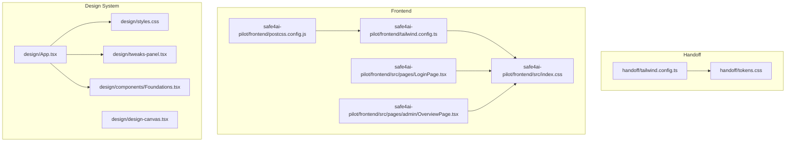
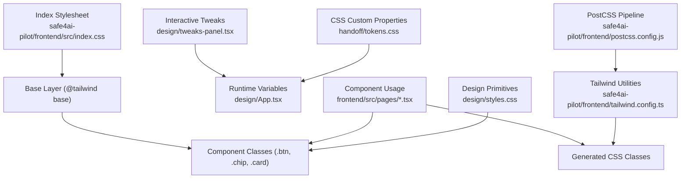
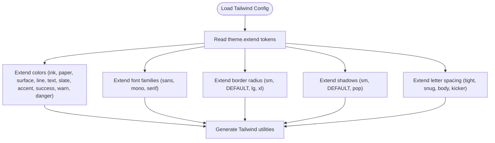
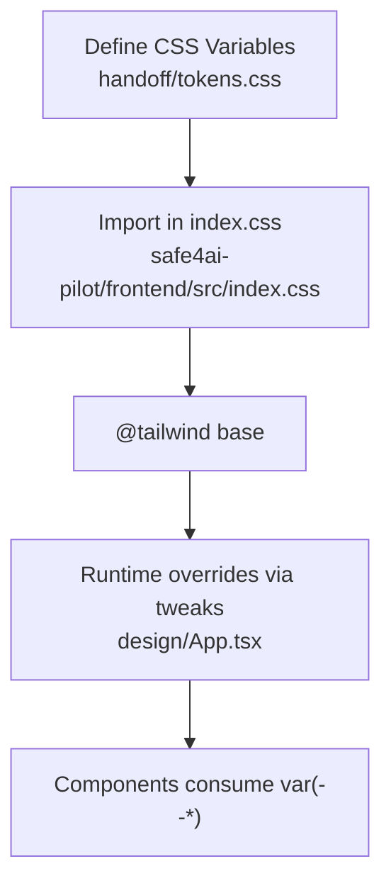
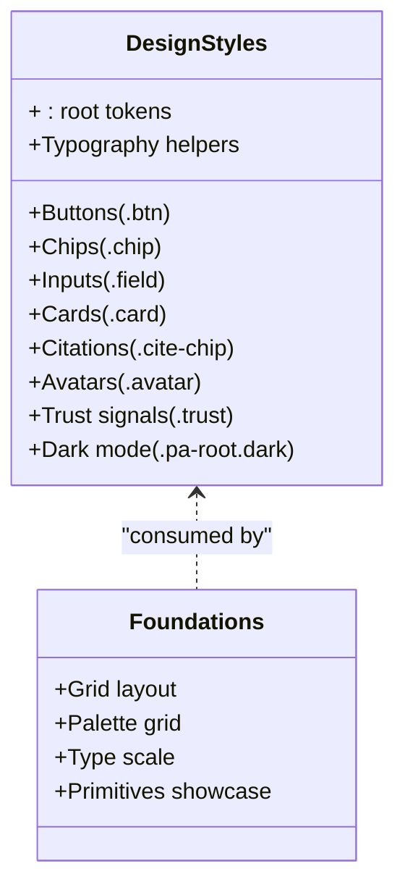
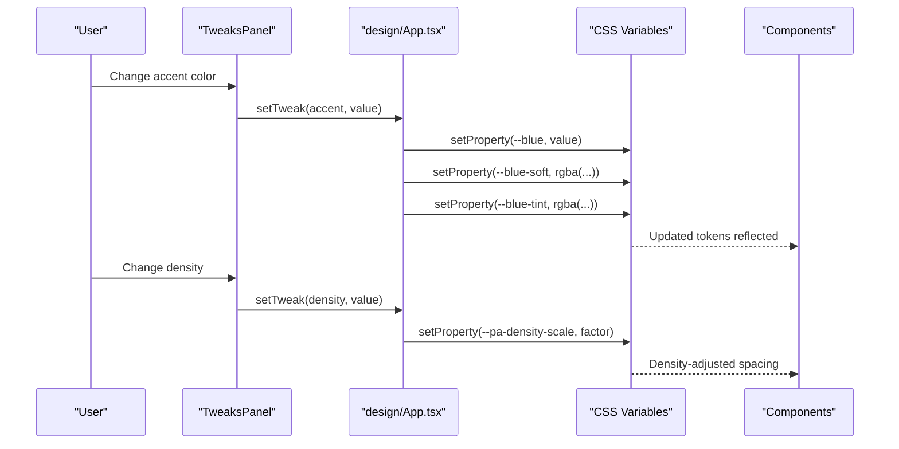
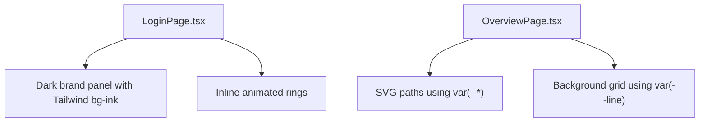
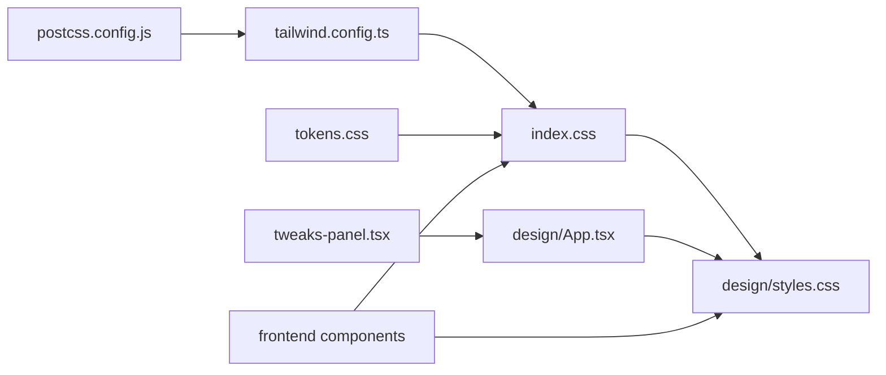

# Styling and Theming

<cite>
**Referenced Files in This Document**
- [tailwind.config.ts](file://handoff/tailwind.config.ts)
- [tokens.css](file://handoff/tokens.css)
- [tailwind.config.ts](file://safe4ai-pilot/frontend/tailwind.config.ts)
- [index.css](file://safe4ai-pilot/frontend/src/index.css)
- [postcss.config.js](file://safe4ai-pilot/frontend/postcss.config.js)
- [styles.css](file://design/styles.css)
- [App.tsx](file://design/App.tsx)
- [Foundations.tsx](file://design/components/Foundations.tsx)
- [design-canvas.tsx](file://design/design-canvas.tsx)
- [tweaks-panel.tsx](file://design/tweaks-panel.tsx)
- [LoginPage.tsx](file://safe4ai-pilot/frontend/src/pages/LoginPage.tsx)
- [OverviewPage.tsx](file://safe4ai-pilot/frontend/src/pages/admin/OverviewPage.tsx)
</cite>

## Table of Contents
1. [Introduction](#introduction)
2. [Project Structure](#project-structure)
3. [Core Components](#core-components)
4. [Architecture Overview](#architecture-overview)
5. [Detailed Component Analysis](#detailed-component-analysis)
6. [Dependency Analysis](#dependency-analysis)
7. [Performance Considerations](#performance-considerations)
8. [Troubleshooting Guide](#troubleshooting-guide)
9. [Conclusion](#conclusion)
10. [Appendices](#appendices)

## Introduction
This document explains the styling and theming system for the project, focusing on the Tailwind CSS implementation and custom styling patterns. It covers Tailwind configuration, design tokens, color schemes, CSS architecture, component-specific styling, responsive design patterns, dark mode support, and accessibility considerations. It also details how Tailwind utilities integrate with custom CSS classes, and provides practical guidance for creating new styles, implementing design tokens, and extending the styling system. Finally, it addresses browser compatibility, performance optimization, and maintenance strategies for the design system.

## Project Structure
The styling system spans three main areas:
- Handoff tokens and Tailwind configuration for design handoffs
- Frontend Tailwind setup and index CSS for the production UI
- Design system assets and interactive tweaks used for prototyping and brand foundations

**Diagram sources**
- [tailwind.config.ts:1-50](file://handoff/tailwind.config.ts#L1-L50)
- [tokens.css:1-90](file://handoff/tokens.css#L1-L90)
- [tailwind.config.ts:1-44](file://safe4ai-pilot/frontend/tailwind.config.ts#L1-L44)
- [index.css:1-16](file://safe4ai-pilot/frontend/src/index.css#L1-L16)
- [postcss.config.js:1-2](file://safe4ai-pilot/frontend/postcss.config.js#L1-L2)
- [styles.css:1-320](file://design/styles.css#L1-L320)
- [App.tsx:1-107](file://design/App.tsx#L1-L107)
- [Foundations.tsx:1-136](file://design/components/Foundations.tsx#L1-L136)
- [design-canvas.tsx:1-1015](file://design/design-canvas.tsx#L1-L1015)
- [tweaks-panel.tsx:1-619](file://design/tweaks-panel.tsx#L1-L619)
- [LoginPage.tsx:37-58](file://safe4ai-pilot/frontend/src/pages/LoginPage.tsx#L37-L58)
- [OverviewPage.tsx:124-148](file://safe4ai-pilot/frontend/src/pages/admin/OverviewPage.tsx#L124-L148)

**Section sources**
- [tailwind.config.ts:1-50](file://handoff/tailwind.config.ts#L1-L50)
- [tailwind.config.ts:1-44](file://safe4ai-pilot/frontend/tailwind.config.ts#L1-L44)
- [index.css:1-16](file://safe4ai-pilot/frontend/src/index.css#L1-L16)
- [postcss.config.js:1-2](file://safe4ai-pilot/frontend/postcss.config.js#L1-L2)
- [styles.css:1-320](file://design/styles.css#L1-L320)
- [App.tsx:1-107](file://design/App.tsx#L1-L107)
- [Foundations.tsx:1-136](file://design/components/Foundations.tsx#L1-L136)
- [design-canvas.tsx:1-1015](file://design/design-canvas.tsx#L1-L1015)
- [tweaks-panel.tsx:1-619](file://design/tweaks-panel.tsx#L1-L619)
- [LoginPage.tsx:37-58](file://safe4ai-pilot/frontend/src/pages/LoginPage.tsx#L37-L58)
- [OverviewPage.tsx:124-148](file://safe4ai-pilot/frontend/src/pages/admin/OverviewPage.tsx#L124-L148)

## Core Components
- Tailwind configuration extends design tokens for colors, typography, spacing, border radius, and shadows. These are defined consistently in both the handoff and frontend configurations.
- Design tokens are defined as CSS custom properties and are imported into the frontend build pipeline.
- The design system includes a dedicated stylesheet with foundational styles, typography helpers, and reusable component primitives.
- The design app integrates a tweaks panel to dynamically adjust accent color and density, updating CSS variables at runtime.

Key implementation highlights:
- Tokens are centralized in CSS custom properties and duplicated into Tailwind’s theme.extend for utility parity.
- The design system’s base styles define a dark mode variant and typography helpers.
- The tweaks panel updates CSS variables for accent color and density, enabling dynamic theming.

**Section sources**
- [tailwind.config.ts:7-42](file://handoff/tailwind.config.ts#L7-L42)
- [tailwind.config.ts:3-38](file://safe4ai-pilot/frontend/tailwind.config.ts#L3-L38)
- [tokens.css:7-89](file://handoff/tokens.css#L7-L89)
- [styles.css:5-65](file://design/styles.css#L5-L65)
- [styles.css:83-86](file://design/styles.css#L83-L86)
- [App.tsx:24-37](file://design/App.tsx#L24-L37)
- [tweaks-panel.tsx:160-178](file://design/tweaks-panel.tsx#L160-L178)

## Architecture Overview
The styling architecture combines:
- Tailwind CSS for utility-first styling and responsive design
- CSS custom properties for design tokens and runtime theming
- A design system stylesheet for foundational primitives and typography
- A tweaks panel for interactive theme adjustments

**Diagram sources**
- [tailwind.config.ts:1-44](file://safe4ai-pilot/frontend/tailwind.config.ts#L1-L44)
- [tokens.css:1-90](file://handoff/tokens.css#L1-L90)
- [styles.css:1-320](file://design/styles.css#L1-L320)
- [index.css:1-16](file://safe4ai-pilot/frontend/src/index.css#L1-L16)
- [postcss.config.js:1-2](file://safe4ai-pilot/frontend/postcss.config.js#L1-L2)
- [tweaks-panel.tsx:1-619](file://design/tweaks-panel.tsx#L1-L619)
- [LoginPage.tsx:37-58](file://safe4ai-pilot/frontend/src/pages/LoginPage.tsx#L37-L58)

## Detailed Component Analysis

### Tailwind Configuration and Token Extension
Tailwind configuration extends theme with colors, fonts, border radius, shadows, and letter spacing. These tokens mirror the CSS custom properties used across the design system.

**Diagram sources**
- [tailwind.config.ts:7-42](file://handoff/tailwind.config.ts#L7-L42)
- [tailwind.config.ts:3-38](file://safe4ai-pilot/frontend/tailwind.config.ts#L3-L38)

**Section sources**
- [tailwind.config.ts:1-50](file://handoff/tailwind.config.ts#L1-L50)
- [tailwind.config.ts:1-44](file://safe4ai-pilot/frontend/tailwind.config.ts#L1-L44)

### Design Tokens and CSS Custom Properties
Design tokens are defined as CSS custom properties and grouped by category (colors, typography, spacing, radii, shadows). They are consumed by both the design system stylesheet and the frontend index CSS.

**Diagram sources**
- [tokens.css:7-89](file://handoff/tokens.css#L7-L89)
- [index.css:1-16](file://safe4ai-pilot/frontend/src/index.css#L1-L16)
- [App.tsx:24-37](file://design/App.tsx#L24-L37)

**Section sources**
- [tokens.css:1-90](file://handoff/tokens.css#L1-L90)
- [index.css:1-16](file://safe4ai-pilot/frontend/src/index.css#L1-L16)
- [App.tsx:24-37](file://design/App.tsx#L24-L37)

### Design System Styles and Primitives
The design system stylesheet defines foundational styles, typography helpers, and reusable primitives such as buttons, chips, inputs, cards, citations, avatars, and trust signals. It also includes a dark mode variant and scrollbar styling.

**Diagram sources**
- [styles.css:5-320](file://design/styles.css#L5-L320)
- [Foundations.tsx:1-136](file://design/components/Foundations.tsx#L1-L136)

**Section sources**
- [styles.css:1-320](file://design/styles.css#L1-L320)
- [Foundations.tsx:1-136](file://design/components/Foundations.tsx#L1-L136)

### Interactive Theming with Tweaks Panel
The tweaks panel allows dynamic adjustment of accent color and density. It updates CSS variables at runtime, which cascade through the design system and Tailwind utilities.

**Diagram sources**
- [tweaks-panel.tsx:160-178](file://design/tweaks-panel.tsx#L160-L178)
- [App.tsx:24-37](file://design/App.tsx#L24-L37)
- [tokens.css:7-89](file://handoff/tokens.css#L7-L89)

**Section sources**
- [tweaks-panel.tsx:160-178](file://design/tweaks-panel.tsx#L160-L178)
- [App.tsx:24-37](file://design/App.tsx#L24-L37)

### Component-Specific Styling Patterns
- LoginPage demonstrates dark brand panel usage with Tailwind classes and inline styles for decorative elements.
- OverviewPage uses CSS variables for chart overlays and subtle strokes.

**Diagram sources**
- [LoginPage.tsx:37-58](file://safe4ai-pilot/frontend/src/pages/LoginPage.tsx#L37-L58)
- [OverviewPage.tsx:124-148](file://safe4ai-pilot/frontend/src/pages/admin/OverviewPage.tsx#L124-L148)

**Section sources**
- [LoginPage.tsx:37-58](file://safe4ai-pilot/frontend/src/pages/LoginPage.tsx#L37-L58)
- [OverviewPage.tsx:124-148](file://safe4ai-pilot/frontend/src/pages/admin/OverviewPage.tsx#L124-L148)

### Responsive Design Patterns
- The design system leverages Tailwind utilities for responsive breakpoints and spacing.
- The design canvas injects container queries and responsive behavior for artboard headers and labels.

**Section sources**
- [design-canvas.tsx:133-142](file://design/design-canvas.tsx#L133-L142)
- [design-canvas.tsx:176-178](file://design/design-canvas.tsx#L176-L178)

### Dark Mode Support
- The design system stylesheet defines a dark mode variant class that switches background and text colors.
- The tweaks panel does not expose a dark mode toggle in the provided snippet; however, the underlying CSS supports dark mode via class application.

**Section sources**
- [styles.css:83-86](file://design/styles.css#L83-L86)

### Accessibility Considerations
- Typography helpers and tokens emphasize readable type scales and appropriate letter spacing.
- Focus states and contrast are maintained through tokens and utilities.

**Section sources**
- [tokens.css:56-66](file://handoff/tokens.css#L56-L66)
- [styles.css:214-214](file://design/styles.css#L214-L214)

## Dependency Analysis
The styling system depends on:
- Tailwind configuration for utility generation
- PostCSS pipeline for processing Tailwind and autoprefixing
- Index CSS for base layer and importing tokens
- Design system stylesheet for primitives and dark mode
- Runtime tweaks for dynamic variable updates

**Diagram sources**
- [postcss.config.js:1-2](file://safe4ai-pilot/frontend/postcss.config.js#L1-L2)
- [tailwind.config.ts:1-44](file://safe4ai-pilot/frontend/tailwind.config.ts#L1-L44)
- [index.css:1-16](file://safe4ai-pilot/frontend/src/index.css#L1-L16)
- [tokens.css:1-90](file://handoff/tokens.css#L1-L90)
- [styles.css:1-320](file://design/styles.css#L1-L320)
- [tweaks-panel.tsx:1-619](file://design/tweaks-panel.tsx#L1-L619)
- [App.tsx:1-107](file://design/App.tsx#L1-L107)

**Section sources**
- [postcss.config.js:1-2](file://safe4ai-pilot/frontend/postcss.config.js#L1-L2)
- [tailwind.config.ts:1-44](file://safe4ai-pilot/frontend/tailwind.config.ts#L1-L44)
- [index.css:1-16](file://safe4ai-pilot/frontend/src/index.css#L1-L16)
- [tokens.css:1-90](file://handoff/tokens.css#L1-L90)
- [styles.css:1-320](file://design/styles.css#L1-L320)
- [tweaks-panel.tsx:1-619](file://design/tweaks-panel.tsx#L1-L619)
- [App.tsx:1-107](file://design/App.tsx#L1-L107)

## Performance Considerations
- Prefer Tailwind utilities over ad-hoc custom CSS to leverage purging and minimize bundle size.
- Centralize design tokens in CSS variables to reduce duplication and enable efficient runtime updates.
- Use container queries and transform-based animations to avoid layout thrashing.
- Keep the design canvas lightweight by avoiding heavy DOM manipulation and using transform for pan/zoom.

## Troubleshooting Guide
- If utilities do not reflect token changes, verify Tailwind configuration extends the correct token categories and that the build pipeline runs Tailwind.
- If CSS variables are not updating, ensure the tweaks panel is active and that the effects are applied to the document element.
- If dark mode visuals are incorrect, confirm the dark mode class is applied and that the design system stylesheet targets the correct selector.

**Section sources**
- [tailwind.config.ts:40-43](file://safe4ai-pilot/frontend/tailwind.config.ts#L40-L43)
- [App.tsx:24-37](file://design/App.tsx#L24-L37)
- [styles.css:83-86](file://design/styles.css#L83-L86)

## Conclusion
The styling and theming system combines Tailwind utilities with CSS custom properties and a design system stylesheet to deliver a cohesive, maintainable, and interactive UI. By centralizing design tokens, leveraging runtime tweaks, and using responsive patterns, the system supports rapid iteration and consistent design across components.

## Appendices

### Practical Examples

- Creating new styles with Tailwind utilities
  - Use the Tailwind configuration’s extended tokens to compose layouts and components.
  - Reference the Tailwind configuration for available colors, fonts, spacing, and shadows.

  **Section sources**
  - [tailwind.config.ts:3-38](file://safe4ai-pilot/frontend/tailwind.config.ts#L3-L38)

- Implementing design tokens
  - Define tokens in CSS custom properties and import them into the index stylesheet.
  - Consume tokens via var(--token-name) in components and primitives.

  **Section sources**
  - [tokens.css:7-89](file://handoff/tokens.css#L7-L89)
  - [index.css:1-16](file://safe4ai-pilot/frontend/src/index.css#L1-L16)

- Extending the styling system
  - Add new tokens to both Tailwind configuration and CSS variables.
  - Update the design system stylesheet with new primitives or variants.
  - Integrate runtime adjustments via the tweaks panel if applicable.

  **Section sources**
  - [tailwind.config.ts:7-42](file://handoff/tailwind.config.ts#L7-L42)
  - [styles.css:1-320](file://design/styles.css#L1-L320)
  - [tweaks-panel.tsx:160-178](file://design/tweaks-panel.tsx#L160-L178)

### Browser Compatibility
- Tailwind utilities and CSS variables are widely supported in modern browsers.
- Container queries and transform-based animations are used in the design canvas; verify target browser support if legacy environments are required.

**Section sources**
- [design-canvas.tsx:133-142](file://design/design-canvas.tsx#L133-L142)
- [design-canvas.tsx:176-178](file://design/design-canvas.tsx#L176-L178)