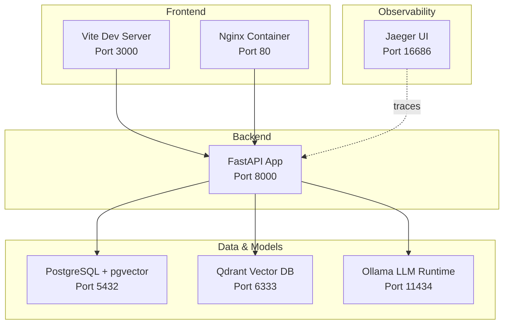

# Getting Started

<cite>
**Referenced Files in This Document**
- [README.md](file://safe4ai-pilot/README.md)
- [docker-compose.yml](file://safe4ai-pilot/docker-compose.yml)
- [docker-compose.override.yml](file://safe4ai-pilot/docker-compose.override.yml)
- [deployment.md](file://safe4ai-pilot/docs/deployment.md)
- [pyproject.toml](file://safe4ai-pilot/pyproject.toml)
- [package.json](file://safe4ai-pilot/frontend/package.json)
- [vite.config.ts](file://safe4ai-pilot/frontend/vite.config.ts)
- [nginx.conf](file://safe4ai-pilot/frontend/nginx.conf)
- [config.py](file://safe4ai-pilot/app/config.py)
- [main.py](file://safe4ai-pilot/app/main.py)
- [seed.py](file://safe4ai-pilot/scripts/seed.py)
- [App.tsx](file://safe4ai-pilot/frontend/src/App.tsx)
</cite>

## Table of Contents
1. [Introduction](#introduction)
2. [Prerequisites](#prerequisites)
3. [Quick Setup Approaches](#quick-setup-approaches)
4. [Step-by-Step Installation](#step-by-step-installation)
5. [Essential Configuration](#essential-configuration)
6. [Access the Admin Dashboard](#access-the-admin-dashboard)
7. [Upload Test Documents](#upload-test-documents)
8. [Test the AI Assistant](#test-the-ai-assistant)
9. [Docker Commands for Development](#docker-commands-for-development)
10. [Architecture Overview](#architecture-overview)
11. [Troubleshooting Guide](#troubleshooting-guide)
12. [Conclusion](#conclusion)

## Introduction
This guide helps you quickly set up and run the Private AI system locally. It covers two primary approaches:
- Docker Compose for a complete local deployment with all dependencies
- Local development mode for hot-reload capabilities on backend and/or frontend while keeping dependencies in Docker

You will prepare the environment, start the services, verify health, seed an admin user, and explore the admin dashboard and AI assistant.

## Prerequisites
- Docker Engine and Docker Compose installed and running
- Python 3.11–3.14 for local development tasks and scripts
- Node.js 20.x and npm for building and running the frontend locally
- At least 12 GB VRAM if using GPU for Ollama models; otherwise 28 GB+ RAM for CPU-only path
- Disk space for local model downloads (~10–16 GB depending on selected models)

**Section sources**
- [deployment.md:17-27](file://safe4ai-pilot/docs/deployment.md#L17-L27)
- [pyproject.toml:8](file://safe4ai-pilot/pyproject.toml#L8)
- [package.json:1-32](file://safe4ai-pilot/frontend/package.json#L1-L32)

## Quick Setup Approaches
There are two recommended ways to run the system locally:

- Complete local deployment with Docker Compose
  - Starts PostgreSQL, Qdrant, Ollama, Jaeger, the FastAPI backend, and the Nginx-based frontend
  - Ideal for a full-stack local environment

- Local development mode
  - Start dependencies in Docker (PostgreSQL, Qdrant, Ollama, Jaeger)
  - Run backend and/or frontend locally with hot reload
  - Enables rapid iteration during development

**Section sources**
- [README.md:5-133](file://safe4ai-pilot/README.md#L5-L133)
- [docker-compose.yml:1-119](file://safe4ai-pilot/docker-compose.yml#L1-L119)
- [docker-compose.override.yml:1-11](file://safe4ai-pilot/docker-compose.override.yml#L1-L11)

## Step-by-Step Installation
Follow these steps to get the system running:

1) Prepare environment
- Change to the pilot directory and copy the example environment file to `.env`
- The defaults are configured for local Docker development

2) Start everything with Docker Compose
- Build and start all services
- The first run pulls Ollama models; expect several minutes for completion

3) Verify core services
- Health checks for backend, Qdrant, and Ollama
- Optional: run the healthcheck script from the repository

4) Seed an admin user (optional)
- Install backend dev dependencies locally
- Run the seed script to create an admin user and three test documents

5) Access the application
- Frontend: http://localhost:3000
- Backend health: http://localhost:8000/health
- Qdrant: http://localhost:6333
- Ollama: http://localhost:11434
- Jaeger UI: http://localhost:16686

**Section sources**
- [README.md:9-54](file://safe4ai-pilot/README.md#L9-L54)
- [README.md:104-128](file://safe4ai-pilot/README.md#L104-L128)
- [deployment.md:31-66](file://safe4ai-pilot/docs/deployment.md#L31-L66)

## Essential Configuration
Key configuration options and defaults:

- Backend settings
  - Database connection URL, Qdrant URL, Ollama URL, and model names
  - CORS allowed origins, HTTPS enforcement flag
  - Audit log retention, cache retention, semantic cache threshold
  - Maximum upload size

- Environment variables
  - Loaded from `.env` via Pydantic settings
  - Override defaults by editing `.env`

- Frontend proxy and API base
  - Vite proxy forwards API routes to backend
  - Nginx in the frontend container proxies API calls to the backend service

- Local development overrides
  - Compose override mounts source directories for hot reload on backend

**Section sources**
- [config.py:5-28](file://safe4ai-pilot/app/config.py#L5-L28)
- [vite.config.ts:4-17](file://safe4ai-pilot/frontend/vite.config.ts#L4-L17)
- [nginx.conf:13-24](file://safe4ai-pilot/frontend/nginx.conf#L13-L24)
- [docker-compose.override.yml:2-11](file://safe4ai-pilot/docker-compose.override.yml#L2-L11)

## Access the Admin Dashboard
- After seeding, log in with the default admin credentials
- Navigate to the admin overview page to review system metrics and manage content

- Default admin credentials
  - Email: admin@safe4ai.local
  - Password: ChangeMe!2024Pilot

- Frontend routing
  - Admin routes are protected and only accessible to administrators

**Section sources**
- [README.md:50-54](file://safe4ai-pilot/README.md#L50-L54)
- [seed.py:18-23](file://safe4ai-pilot/scripts/seed.py#L18-L23)
- [App.tsx:40-86](file://safe4ai-pilot/frontend/src/App.tsx#L40-L86)

## Upload Test Documents
- After logging in, go to the admin “Documents” page
- Upload PDFs or other supported formats
- The seed script creates three test documents under the admin user’s uploads

- Backend upload size limit
  - Configurable via settings; enforced by middleware

**Section sources**
- [seed.py:27-38](file://safe4ai-pilot/scripts/seed.py#L27-L38)
- [config.py:18](file://safe4ai-pilot/app/config.py#L18)
- [main.py:87-96](file://safe4ai-pilot/app/main.py#L87-L96)

## Test the AI Assistant
- Open the chat interface and ask questions about the uploaded documents
- The system uses Ollama models and Qdrant for retrieval augmented generation (RAG)
- The backend pre-warms Ollama on startup to reduce first-query latency

- Health verification
  - Confirm backend, Qdrant, and Ollama are healthy before testing

**Section sources**
- [README.md:30-37](file://safe4ai-pilot/README.md#L30-L37)
- [main.py:104-116](file://safe4ai-pilot/app/main.py#L104-L116)
- [deployment.md:55-75](file://safe4ai-pilot/docs/deployment.md#L55-L75)

## Docker Commands for Development
Common Docker commands for managing the development environment:

- Start services in foreground
- Start services in detached mode
- View logs for backend and frontend
- Stop services
- Stop and remove named volumes (PostgreSQL, Qdrant, Ollama data)

- Local development mode
  - Start dependencies in Docker
  - Run backend locally with hot reload
  - Run frontend locally with Vite

**Section sources**
- [README.md:55-103](file://safe4ai-pilot/README.md#L55-L103)
- [docker-compose.yml:1-119](file://safe4ai-pilot/docker-compose.yml#L1-L119)

## Architecture Overview
The system consists of:
- Backend: FastAPI application with routers for authentication, chat, observability, and admin
- Frontend: React SPA served via Nginx in Docker; proxied by Vite during local development
- Data stores: PostgreSQL with pgvector extension and Qdrant vector database
- LLM runtime: Ollama for local model inference
- Observability: Jaeger for tracing

**Diagram sources**
- [docker-compose.yml:1-119](file://safe4ai-pilot/docker-compose.yml#L1-L119)
- [vite.config.ts:6-16](file://safe4ai-pilot/frontend/vite.config.ts#L6-L16)
- [nginx.conf:13-24](file://safe4ai-pilot/frontend/nginx.conf#L13-L24)

## Troubleshooting Guide
Common setup issues and resolutions:

- Services not reachable
  - Verify ports are free and containers are healthy
  - Use health checks for backend, Qdrant, and Ollama

- Ollama model pull failures
  - Ensure network connectivity and disk space
  - Re-run the initialization job after Ollama becomes healthy

- Frontend cannot connect to backend
  - Confirm Vite proxy target matches backend port
  - Ensure the frontend container proxies API routes to the backend service

- Admin login fails
  - Confirm the admin user was seeded
  - Check default credentials and environment configuration

- Large uploads rejected
  - Adjust the maximum upload size in settings if needed

- GPU/CPU resource constraints
  - GPU path requires sufficient VRAM; CPU-only path needs substantial RAM
  - Expect slower performance on CPU

**Section sources**
- [README.md:104-128](file://safe4ai-pilot/README.md#L104-L128)
- [deployment.md:55-75](file://safe4ai-pilot/docs/deployment.md#L55-L75)
- [vite.config.ts:8-14](file://safe4ai-pilot/frontend/vite.config.ts#L8-L14)
- [nginx.conf:14-24](file://safe4ai-pilot/frontend/nginx.conf#L14-L24)
- [config.py:18](file://safe4ai-pilot/app/config.py#L18)
- [deployment.md:17-27](file://safe4ai-pilot/docs/deployment.md#L17-L27)

## Conclusion
You now have the Private AI system running locally using Docker Compose or local development mode. Seed an admin user, upload test documents, and test the AI assistant. Use the provided Docker commands and health checks to manage and troubleshoot the environment. For deeper operational topics, refer to the deployment guide.