# Cost Tracking and Usage Analytics

<cite>
**Referenced Files in This Document**
- [cost_tracker.py](file://safe4ai-pilot/observability/cost_tracker.py)
- [test_cost_tracker.py](file://safe4ai-pilot/tests/test_cost_tracker.py)
- [chat_routes.py](file://safe4ai-pilot/app/api/chat_routes.py)
- [observability_routes.py](file://safe4ai-pilot/app/api/observability_routes.py)
- [admin_routes.py](file://safe4ai-pilot/app/api/admin_routes.py)
- [models.py](file://safe4ai-pilot/app/db/models.py)
- [config.py](file://safe4ai-pilot/app/config.py)
- [tracer.py](file://safe4ai-pilot/observability/tracer.py)
- [graph.py](file://safe4ai-pilot/app/agents/graph.py)
- [app_config_store.py](file://safe4ai-pilot/app/services/app_config_store.py)
- [provider_clients.py](file://safe4ai-pilot/app/services/provider_clients.py)
- [chat_finalizer.py](file://safe4ai-pilot/app/services/chat_finalizer.py)
- [runtime_config.py](file://safe4ai-pilot/app/services/runtime_config.py)
</cite>

## Update Summary
**Changes Made**
- Enhanced provider usage tracking implementation across chat pipeline with actual token metrics
- Added comprehensive provider_usage field to PrivateAIState model with prompt_tokens, completion_tokens, and total_tokens
- Updated cost calculation logic to utilize actual provider usage data when available
- Integrated ProviderUsage dataclass for standardized token tracking across providers
- Enhanced chat_finalizer to use actual usage for cost calculation
- Improved cost accuracy through provider-native token counting
- **New**: Implemented runtime configuration loading for model name tracking during chat operations
- **New**: Added correct model name tracking in audit logs and cost records

## Table of Contents
1. [Introduction](#introduction)
2. [Project Structure](#project-structure)
3. [Core Components](#core-components)
4. [Architecture Overview](#architecture-overview)
5. [Detailed Component Analysis](#detailed-component-analysis)
6. [Dependency Analysis](#dependency-analysis)
7. [Performance Considerations](#performance-considerations)
8. [Troubleshooting Guide](#troubleshooting-guide)
9. [Conclusion](#conclusion)
10. [Appendices](#appendices)

## Introduction
This document explains the enhanced cost tracking and usage analytics capabilities of the Private AI system. The system now features intelligent token estimation using a chars-per-token heuristic, cost projection before request processing, and configurable daily and monthly cost ceilings with automatic HTTP 429 error handling. The latest enhancement introduces comprehensive provider usage tracking that captures actual token metrics from AI providers, providing more accurate cost calculations and detailed usage analytics. It focuses on how token usage and compute costs are monitored across pipeline stages, how cost statistics are aggregated and exposed, and how administrators can configure cost limits, set budget alerts, and track usage trends over time. It also provides practical guidance for cost optimization, identifying expensive operations, implementing cost-aware routing, allocating costs across users and departments, performing historical cost analysis, and planning capacity based on usage patterns. Finally, it outlines integration points with billing systems and cost reporting dashboards.

## Project Structure
The enhanced cost tracking implementation spans several modules with new provider usage tracking capabilities:
- Observability: cost tracking logic, OpenTelemetry tracing utilities, and intelligent token estimation
- API: endpoints for chat processing with cost ceiling checks, feedback, and cost statistics
- Database: schema for agent runs, application configuration, and related entities
- Configuration: global settings including cost per 1K tokens and cost ceiling configurations
- Pipeline: LangGraph nodes that drive the RAG workflow and expose spans for tracing
- Provider Clients: standardized token usage tracking across different AI providers
- Runtime Configuration: dynamic model configuration loading for accurate model tracking

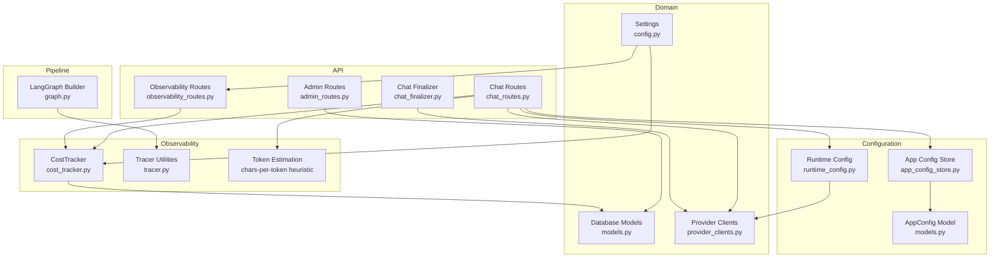

**Diagram sources**
- [cost_tracker.py:16-115](file://safe4ai-pilot/observability/cost_tracker.py#L16-L115)
- [chat_routes.py:31-139](file://safe4ai-pilot/app/api/chat_routes.py#L31-L139)
- [observability_routes.py:48-56](file://safe4ai-pilot/app/api/observability_routes.py#L48-L56)
- [admin_routes.py:426-458](file://safe4ai-pilot/app/api/admin_routes.py#L426-L458)
- [models.py:126-137](file://safe4ai-pilot/app/db/models.py#L126-L137)
- [config.py:5-28](file://safe4ai-pilot/app/config.py#L5-L28)
- [tracer.py:34-75](file://safe4ai-pilot/observability/tracer.py#L34-L75)
- [graph.py:39-342](file://safe4ai-pilot/app/agents/graph.py#L39-L342)
- [app_config_store.py:10-26](file://safe4ai-pilot/app/services/app_config_store.py#L10-L26)
- [provider_clients.py:10-239](file://safe4ai-pilot/app/services/provider_clients.py#L10-L239)
- [chat_finalizer.py:14-71](file://safe4ai-pilot/app/services/chat_finalizer.py#L14-L71)
- [runtime_config.py:89-129](file://safe4ai-pilot/app/services/runtime_config.py#L89-L129)

**Section sources**
- [cost_tracker.py:16-115](file://safe4ai-pilot/observability/cost_tracker.py#L16-L115)
- [chat_routes.py:31-139](file://safe4ai-pilot/app/api/chat_routes.py#L31-L139)
- [observability_routes.py:48-56](file://safe4ai-pilot/app/api/observability_routes.py#L48-L56)
- [admin_routes.py:426-458](file://safe4ai-pilot/app/api/admin_routes.py#L426-L458)
- [models.py:126-137](file://safe4ai-pilot/app/db/models.py#L126-L137)
- [config.py:5-28](file://safe4ai-pilot/app/config.py#L5-L28)
- [tracer.py:34-75](file://safe4ai-pilot/observability/tracer.py#L34-L75)
- [graph.py:39-342](file://safe4ai-pilot/app/agents/graph.py#L39-L342)
- [app_config_store.py:10-26](file://safe4ai-pilot/app/services/app_config_store.py#L10-L26)
- [provider_clients.py:10-239](file://safe4ai-pilot/app/services/provider_clients.py#L10-L239)
- [chat_finalizer.py:14-71](file://safe4ai-pilot/app/services/chat_finalizer.py#L14-L71)
- [runtime_config.py:89-129](file://safe4ai-pilot/app/services/runtime_config.py#L89-L129)

## Core Components
- **CostTracker**: Computes and records USD costs based on prompt and completion token counts, persists agent run metadata, and aggregates daily cost statistics.
- **ProviderUsage Dataclass**: Standardized token tracking structure with prompt_tokens, completion_tokens, total_tokens, and source identification for accurate cost calculations.
- **Intelligent Token Estimation**: Uses a chars-per-token heuristic (`len(text) / 4`) to estimate token counts for cost projection and billing accuracy.
- **Cost Ceiling Management**: Implements daily ($50) and monthly ($500) cost ceilings with automatic HTTP 429 error handling and cost projection before request processing.
- **Chat Routes**: Orchestrates the pipeline with cost ceiling checks, token estimation, and cost recording.
- **Observability Routes**: Exposes admin-only cost statistics endpoint backed by CostTracker.
- **Admin Routes**: Provides aggregate stats including total cost over a window.
- **Chat Finalizer**: Persists assistant replies, audit logs, and cost records using actual provider usage data.
- **Database Models**: Defines AgentRun, AppConfig, and related entities used to persist run metadata, cost configurations, and cost.
- **Configuration**: Holds cost_per_1k_tokens setting and cost ceiling configurations used to compute costs and enforce spending limits.
- **Tracing**: Provides structured spans for pipeline stages to support operational insights and cost attribution.
- **Runtime Configuration**: Dynamically loads provider settings including model names for accurate cost tracking.

Key responsibilities:
- **Token cost calculation**: Sum of prompt and completion tokens divided by 1000 and multiplied by configured cost per 1K tokens.
- **Provider usage tracking**: Captures actual token metrics from AI providers for precise cost calculations.
- **Intelligent token estimation**: Uses chars-per-token heuristic for more accurate cost projections.
- **Cost projection**: Estimates costs before processing requests to prevent exceeding daily/monthly limits.
- **Run persistence**: Creates AgentRun entries with timestamps, status, and computed cost.
- **Cost ceiling enforcement**: Monitors daily and monthly spending against configured limits.
- **Aggregation**: Groups runs by calendar day, computes totals and counts, supports optional user filtering.
- **Model name tracking**: Correctly tracks the actual model used in chat operations for accurate cost attribution.

**Section sources**
- [cost_tracker.py:16-115](file://safe4ai-pilot/observability/cost_tracker.py#L16-L115)
- [chat_routes.py:31-139](file://safe4ai-pilot/app/api/chat_routes.py#L31-L139)
- [observability_routes.py:48-56](file://safe4ai-pilot/app/api/observability_routes.py#L48-L56)
- [admin_routes.py:426-458](file://safe4ai-pilot/app/api/admin_routes.py#L426-L458)
- [models.py:126-137](file://safe4ai-pilot/app/db/models.py#L126-L137)
- [config.py:17](file://safe4ai-pilot/app/config.py#L17)
- [provider_clients.py:10-239](file://safe4ai-pilot/app/services/provider_clients.py#L10-L239)
- [chat_finalizer.py:14-71](file://safe4ai-pilot/app/services/chat_finalizer.py#L14-L71)
- [runtime_config.py:89-129](file://safe4ai-pilot/app/services/runtime_config.py#L89-L129)

## Architecture Overview
The enhanced cost tracking architecture integrates with the RAG pipeline, includes intelligent token estimation, and enforces configurable cost ceilings with provider usage tracking.

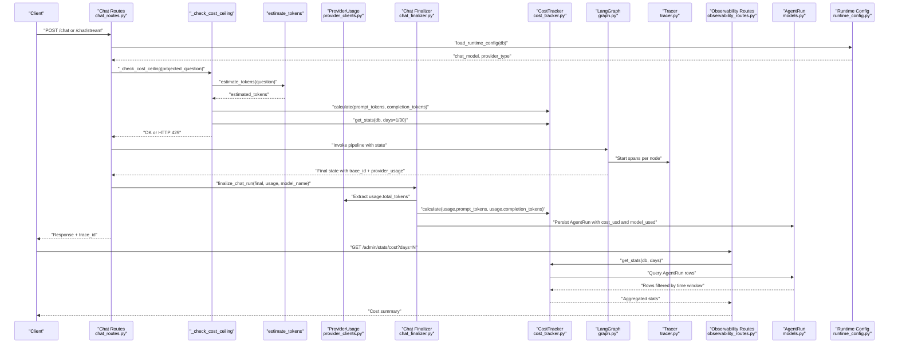

**Diagram sources**
- [chat_routes.py:233-289](file://safe4ai-pilot/app/api/chat_routes.py#L233-L289)
- [chat_routes.py:95-139](file://safe4ai-pilot/app/api/chat_routes.py#L95-L139)
- [chat_routes.py:31-37](file://safe4ai-pilot/app/api/chat_routes.py#L31-L37)
- [chat_routes.py:414-439](file://safe4ai-pilot/app/api/chat_routes.py#L414-L439)
- [graph.py:39-342](file://safe4ai-pilot/app/agents/graph.py#L39-L342)
- [tracer.py:34-75](file://safe4ai-pilot/observability/tracer.py#L34-L75)
- [observability_routes.py:48-56](file://safe4ai-pilot/app/api/observability_routes.py#L48-L56)
- [cost_tracker.py:62-115](file://safe4ai-pilot/observability/cost_tracker.py#L62-L115)
- [models.py:126-137](file://safe4ai-pilot/app/db/models.py#L126-L137)
- [provider_clients.py:10-239](file://safe4ai-pilot/app/services/provider_clients.py#L10-L239)
- [chat_finalizer.py:14-71](file://safe4ai-pilot/app/services/chat_finalizer.py#L14-L71)
- [runtime_config.py:89-129](file://safe4ai-pilot/app/services/runtime_config.py#L89-L129)

## Detailed Component Analysis

### Enhanced Provider Usage Tracking: Actual Token Metrics
The system now captures comprehensive provider usage metrics through the chat_client.chat() method, providing more accurate cost calculations than estimation alone.

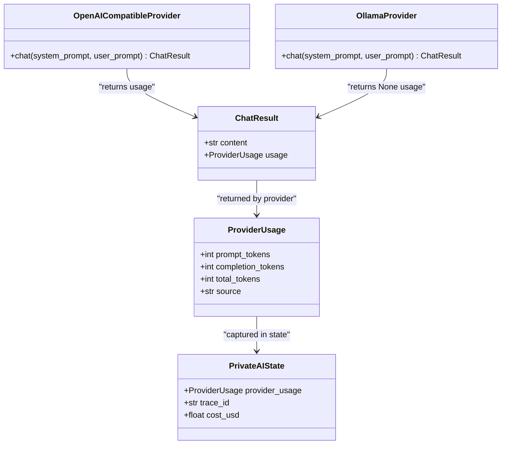

**Diagram sources**
- [provider_clients.py:10-239](file://safe4ai-pilot/app/services/provider_clients.py#L10-L239)
- [models.py:53-102](file://safe4ai-pilot/app/models.py#L53-L102)
- [chat_routes.py:43-53](file://safe4ai-pilot/app/api/chat_routes.py#L43-L53)

**Updated** Enhanced provider usage tracking implementation with standardized token metrics across all AI providers.

Operational notes:
- ProviderUsage dataclass captures actual token metrics from AI providers
- OpenAI-compatible providers return usage data through _usage_from_openai()
- Ollama providers return None for usage (fallback to estimation)
- PrivateAIState now includes provider_usage field for comprehensive tracking
- Chat finalizer uses actual usage for precise cost calculations
- Model name tracking is now correctly captured from runtime configuration

**Section sources**
- [provider_clients.py:10-239](file://safe4ai-pilot/app/services/provider_clients.py#L10-L239)
- [models.py:53-102](file://safe4ai-pilot/app/models.py#L53-L102)
- [chat_routes.py:43-53](file://safe4ai-pilot/app/api/chat_routes.py#L43-L53)
- [chat_finalizer.py:22-29](file://safe4ai-pilot/app/services/chat_finalizer.py#L22-L29)

### Enhanced CostTracker: Provider-Aware Cost Calculation
CostTracker now works seamlessly with provider usage data for more accurate cost computations:

- **Cost computation**: Uses actual provider usage when available, otherwise falls back to token estimation
- **Run recording**: Creates AgentRun with session_id, timestamps, status, and cost calculated from provider usage
- **Statistics aggregation**: Total cost, run count, and daily breakdown by UTC date; optionally filtered by user via session ownership
- **Integration with provider usage**: Utilizes ProviderUsage.total_tokens for precise cost calculations

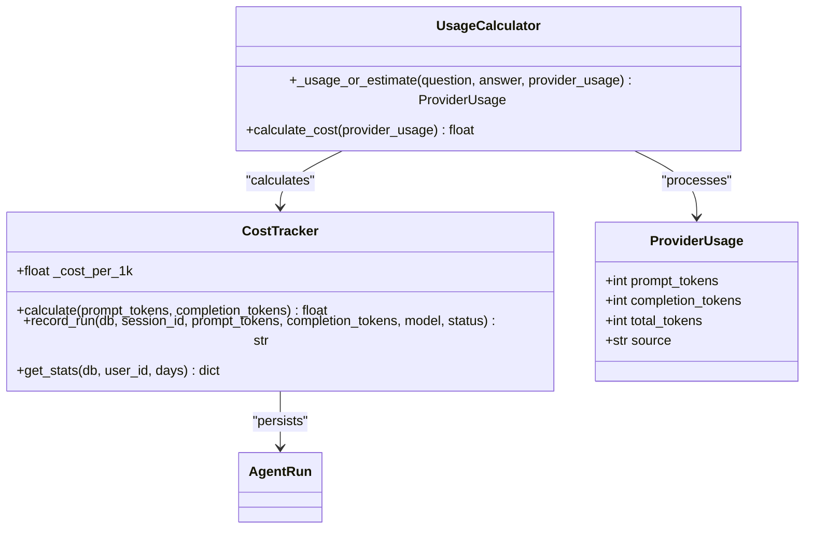

**Diagram sources**
- [cost_tracker.py:16-115](file://safe4ai-pilot/observability/cost_tracker.py#L16-L115)
- [chat_routes.py:43-53](file://safe4ai-pilot/app/api/chat_routes.py#L43-L53)
- [models.py:126-137](file://safe4ai-pilot/app/db/models.py#L126-L137)

**Updated** Enhanced cost calculation logic utilizing actual provider usage data when available.

Operational notes:
- Cost calculation uses ProviderUsage.total_tokens for precise USD calculations
- Falls back to token estimation when provider_usage is None
- Maintains backward compatibility with existing token estimation logic
- Provides source tracking (actual vs estimated) for audit purposes
- Model name is now correctly passed to CostTracker.record_run for accurate attribution

**Section sources**
- [cost_tracker.py:16-115](file://safe4ai-pilot/observability/cost_tracker.py#L16-L115)
- [chat_routes.py:43-53](file://safe4ai-pilot/app/api/chat_routes.py#L43-L53)
- [models.py:126-137](file://safe4ai-pilot/app/db/models.py#L126-L137)

### Intelligent Token Estimation: Chars-per-Token Heuristic
The system now uses a sophisticated token estimation approach with provider usage fallback:

- **Chars-per-token heuristic**: `len(text) / 4` provides more accurate token estimates than simple character counting
- **Minimum token guarantee**: Ensures at least 1 token for non-empty text
- **Completion token safety**: Uses max(estimated_tokens, 256) for completion tokens to account for generation overhead
- **Provider usage priority**: Uses actual provider metrics when available, otherwise applies estimation
- **Pre-processing cost checks**: Enables cost projection before request processing

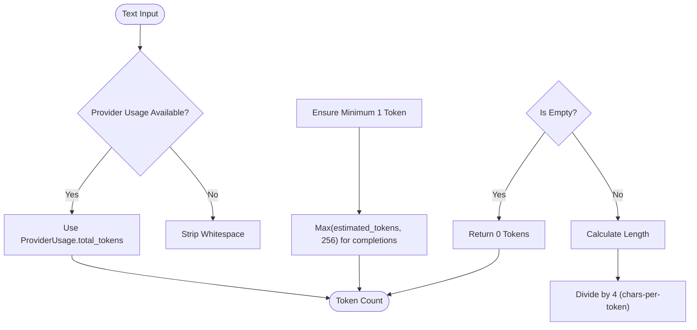

**Diagram sources**
- [chat_routes.py:31-37](file://safe4ai-pilot/app/api/chat_routes.py#L31-L37)
- [chat_routes.py:43-53](file://safe4ai-pilot/app/api/chat_routes.py#L43-L53)

**Updated** Enhanced token estimation with provider usage priority for more accurate cost projections.

**Section sources**
- [chat_routes.py:31-37](file://safe4ai-pilot/app/api/chat_routes.py#L31-L37)
- [chat_routes.py:43-53](file://safe4ai-pilot/app/api/chat_routes.py#L43-L53)

### Cost Ceiling Management: Daily and Monthly Spending Limits
The enhanced system implements comprehensive cost control with provider usage awareness:

- **Daily ceiling**: $50 default limit with graceful degradation
- **Monthly ceiling**: $500 default limit as secondary protection
- **Cost projection**: Estimates costs before processing using provider usage when available
- **HTTP 429 handling**: Automatic rate limiting with informative error messages
- **Configuration management**: Dynamic ceiling adjustment via app_config store

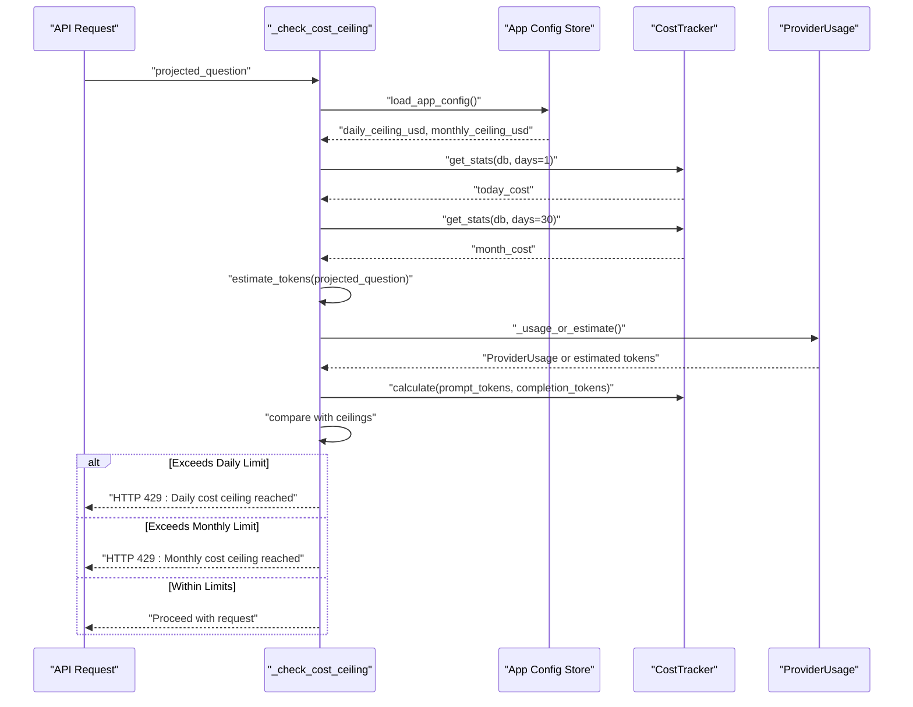

**Diagram sources**
- [chat_routes.py:95-139](file://safe4ai-pilot/app/api/chat_routes.py#L95-L139)
- [app_config_store.py:10-26](file://safe4ai-pilot/app/services/app_config_store.py#L10-L26)
- [chat_routes.py:43-53](file://safe4ai-pilot/app/api/chat_routes.py#L43-L53)

**Updated** Enhanced cost ceiling management with provider usage-aware cost projection.

**Section sources**
- [chat_routes.py:95-139](file://safe4ai-pilot/app/api/chat_routes.py#L95-L139)
- [app_config_store.py:10-26](file://safe4ai-pilot/app/services/app_config_store.py#L10-L26)
- [chat_routes.py:43-53](file://safe4ai-pilot/app/api/chat_routes.py#L43-L53)

### Observability Routes: Admin Cost Statistics Endpoint
The endpoint /admin/stats/cost returns aggregated cost statistics for N days using CostTracker with settings.cost_per_1k_tokens.

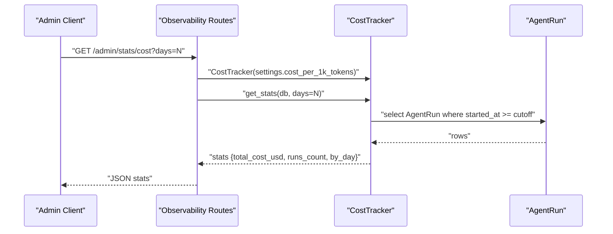

**Diagram sources**
- [observability_routes.py:48-56](file://safe4ai-pilot/app/api/observability_routes.py#L48-L56)
- [cost_tracker.py:62-115](file://safe4ai-pilot/observability/cost_tracker.py#L62-L115)
- [models.py:126-137](file://safe4ai-pilot/app/db/models.py#L126-L137)

**Section sources**
- [observability_routes.py:48-56](file://safe4ai-pilot/app/api/observability_routes.py#L48-L56)

### Admin Routes: Aggregate Stats Including Total Cost
Admin endpoint /admin/stats returns:
- total_queries
- avg_latency_ms
- total_cost_usd
- cache_total_hits
- cost ceiling configurations (daily and monthly)

Total cost is derived from AgentRun.cost_usd over the selected window.

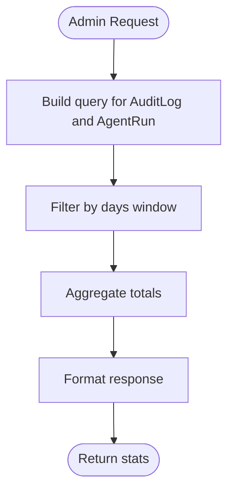

**Diagram sources**
- [admin_routes.py:426-458](file://safe4ai-pilot/app/api/admin_routes.py#L426-L458)
- [models.py:126-137](file://safe4ai-pilot/app/db/models.py#L126-L137)

**Section sources**
- [admin_routes.py:426-458](file://safe4ai-pilot/app/api/admin_routes.py#L426-L458)

### Tracing and Pipeline Spans
OpenTelemetry spans are created per pipeline stage to capture operational context. While spans themselves do not directly compute cost, they enable correlation of traces with run metadata and can be used to attribute latency and throughput to specific stages.

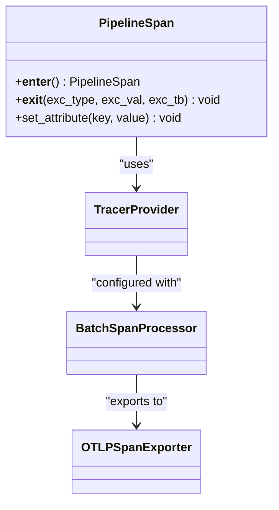

**Diagram sources**
- [tracer.py:34-75](file://safe4ai-pilot/observability/tracer.py#L34-L75)

**Section sources**
- [tracer.py:34-75](file://safe4ai-pilot/observability/tracer.py#L34-L75)

### Chat and Pipeline Integration
The chat endpoints orchestrate the pipeline with enhanced cost management and produce a trace_id associated with each run. The pipeline nodes emit spans that can be correlated with runs for operational insights.

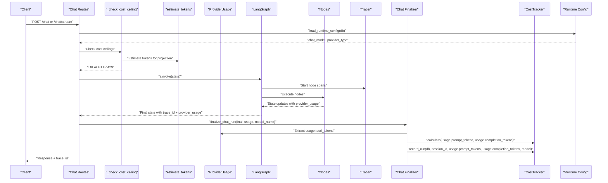

**Diagram sources**
- [chat_routes.py:233-289](file://safe4ai-pilot/app/api/chat_routes.py#L233-L289)
- [chat_routes.py:95-139](file://safe4ai-pilot/app/api/chat_routes.py#L95-L139)
- [chat_routes.py:31-37](file://safe4ai-pilot/app/api/chat_routes.py#L31-L37)
- [chat_routes.py:414-439](file://safe4ai-pilot/app/api/chat_routes.py#L414-L439)
- [graph.py:39-342](file://safe4ai-pilot/app/agents/graph.py#L39-L342)
- [tracer.py:34-75](file://safe4ai-pilot/observability/tracer.py#L34-L75)
- [chat_finalizer.py:14-71](file://safe4ai-pilot/app/services/chat_finalizer.py#L14-L71)
- [cost_tracker.py:62-115](file://safe4ai-pilot/observability/cost_tracker.py#L62-L115)
- [runtime_config.py:89-129](file://safe4ai-pilot/app/services/runtime_config.py#L89-L129)

**Updated** Enhanced chat pipeline integration with provider usage tracking throughout the entire workflow and runtime configuration loading.

**Section sources**
- [chat_routes.py:233-289](file://safe4ai-pilot/app/api/chat_routes.py#L233-L289)
- [chat_routes.py:95-139](file://safe4ai-pilot/app/api/chat_routes.py#L95-L139)
- [chat_routes.py:414-439](file://safe4ai-pilot/app/api/chat_routes.py#L414-L439)
- [graph.py:39-342](file://safe4ai-pilot/app/agents/graph.py#L39-L342)
- [runtime_config.py:89-129](file://safe4ai-pilot/app/services/runtime_config.py#L89-L129)

### Runtime Configuration Loading: Model Name Tracking
The system now implements dynamic runtime configuration loading to ensure accurate model name tracking during chat operations.

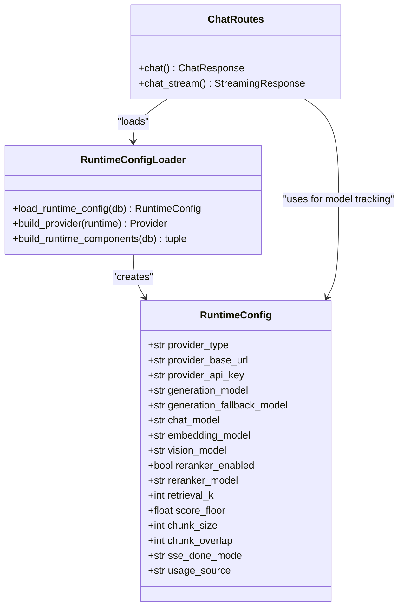

**Diagram sources**
- [runtime_config.py:89-129](file://safe4ai-pilot/app/services/runtime_config.py#L89-L129)
- [chat_routes.py:314-331](file://safe4ai-pilot/app/api/chat_routes.py#L314-L331)
- [chat_routes.py:444](file://safe4ai-pilot/app/api/chat_routes.py#L444)

**New** Runtime configuration loading implementation for accurate model name tracking.

Operational notes:
- RuntimeConfig loads provider settings from app_config_store with fallback to environment variables
- chat_model is extracted from runtime configuration for accurate model tracking
- usage_source is automatically set based on provider type (actual vs estimated)
- Model names are correctly propagated to audit logs and cost records
- Provides dynamic configuration for cost tracking accuracy

**Section sources**
- [runtime_config.py:89-129](file://safe4ai-pilot/app/services/runtime_config.py#L89-L129)
- [chat_routes.py:314-331](file://safe4ai-pilot/app/api/chat_routes.py#L314-L331)
- [chat_routes.py:444](file://safe4ai-pilot/app/api/chat_routes.py#L444)

### Chat Finalizer: Enhanced Persistence and Model Tracking
The chat finalizer now provides enhanced persistence with correct model name tracking and single-transaction operations.

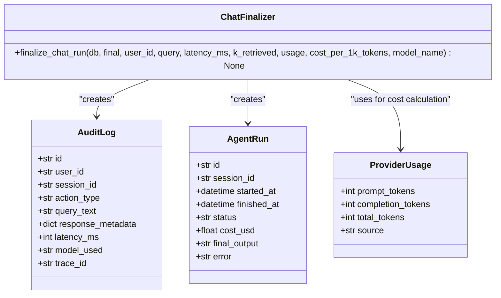

**Diagram sources**
- [chat_finalizer.py:14-71](file://safe4ai-pilot/app/services/chat_finalizer.py#L14-L71)
- [models.py:138-164](file://safe4ai-pilot/app/db/models.py#L138-L164)

**Updated** Enhanced chat finalizer with single-transaction persistence and correct model name tracking.

Operational notes:
- Single-transaction commit ensures atomicity for audit log and cost records
- model_used field in AuditLog captures the actual model name used
- cost calculation uses ProviderUsage.total_tokens for precise USD amounts
- response_metadata includes usage_source, prompt_tokens, completion_tokens, and total_tokens
- Maintains backward compatibility while adding enhanced tracking capabilities

**Section sources**
- [chat_finalizer.py:14-71](file://safe4ai-pilot/app/services/chat_finalizer.py#L14-L71)
- [models.py:138-164](file://safe4ai-pilot/app/db/models.py#L138-L164)

## Dependency Analysis
- **CostTracker** depends on:
  - SQLAlchemy ORM for querying AgentRun
  - Session for database operations
  - Settings for cost_per_1k_tokens
- **Chat Routes** depend on:
  - CostTracker for cost calculations
  - App Config Store for cost ceiling configurations
  - Token estimation functions for cost projection
  - ProviderUsage dataclass for actual token metrics
  - Settings for cost_per_1k_tokens
  - Runtime Config for model name tracking
- **Chat Finalizer** depends on:
  - ProviderUsage for precise cost calculations
  - CostTracker for run recording
  - Database models for persistence
  - Runtime Config for model name tracking
- **Observability Routes** depend on CostTracker and Settings
- **Admin Routes** depend on AgentRun for cost aggregation
- **Database Models** define AgentRun, AppConfig, and Session relationships used for user-based filtering and configuration storage
- **Provider Clients** provide standardized token usage tracking across different AI providers
- **Tracing utilities** integrate with OpenTelemetry providers and processors
- **Runtime Configuration** provides dynamic model configuration loading

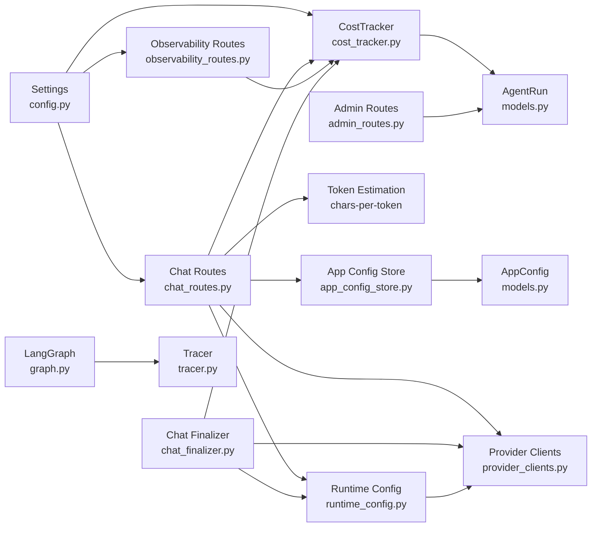

**Diagram sources**
- [config.py:5-28](file://safe4ai-pilot/app/config.py#L5-L28)
- [observability_routes.py:48-56](file://safe4ai-pilot/app/api/observability_routes.py#L48-L56)
- [cost_tracker.py:16-115](file://safe4ai-pilot/observability/cost_tracker.py#L16-L115)
- [chat_routes.py:31-139](file://safe4ai-pilot/app/api/chat_routes.py#L31-L139)
- [models.py:126-137](file://safe4ai-pilot/app/db/models.py#L126-L137)
- [admin_routes.py:426-458](file://safe4ai-pilot/app/api/admin_routes.py#L426-L458)
- [graph.py:39-342](file://safe4ai-pilot/app/agents/graph.py#L39-L342)
- [tracer.py:34-75](file://safe4ai-pilot/observability/tracer.py#L34-L75)
- [app_config_store.py:10-26](file://safe4ai-pilot/app/services/app_config_store.py#L10-L26)
- [provider_clients.py:10-239](file://safe4ai-pilot/app/services/provider_clients.py#L10-L239)
- [chat_finalizer.py:14-71](file://safe4ai-pilot/app/services/chat_finalizer.py#L14-L71)
- [runtime_config.py:89-129](file://safe4ai-pilot/app/services/runtime_config.py#L89-L129)

**Updated** Enhanced dependency analysis reflecting provider usage tracking integration and runtime configuration loading.

**Section sources**
- [config.py:5-28](file://safe4ai-pilot/app/config.py#L5-L28)
- [observability_routes.py:48-56](file://safe4ai-pilot/app/api/observability_routes.py#L48-L56)
- [cost_tracker.py:16-115](file://safe4ai-pilot/observability/cost_tracker.py#L16-L115)
- [chat_routes.py:31-139](file://safe4ai-pilot/app/api/chat_routes.py#L31-L139)
- [models.py:126-137](file://safe4ai-pilot/app/db/models.py#L126-L137)
- [admin_routes.py:426-458](file://safe4ai-pilot/app/api/admin_routes.py#L426-L458)
- [graph.py:39-342](file://safe4ai-pilot/app/agents/graph.py#L39-L342)
- [tracer.py:34-75](file://safe4ai-pilot/observability/tracer.py#L34-L75)
- [app_config_store.py:10-26](file://safe4ai-pilot/app/services/app_config_store.py#L10-L26)
- [provider_clients.py:10-239](file://safe4ai-pilot/app/services/provider_clients.py#L10-L239)
- [chat_finalizer.py:14-71](file://safe4ai-pilot/app/services/chat_finalizer.py#L14-L71)
- [runtime_config.py:89-129](file://safe4ai-pilot/app/services/runtime_config.py#L89-L129)

## Performance Considerations
- **Cost calculation** is O(1) per run; statistics aggregation is O(n) over runs in the window.
- **Provider usage extraction** adds minimal overhead for OpenAI-compatible providers.
- **Token estimation** is O(1) per text input using simple string operations.
- **Cost projection** adds minimal overhead by estimating tokens before processing.
- **Cost ceiling checks** involve two CostTracker.get_stats calls plus token estimation.
- **get_stats** groups by date and sums cost; ensure proper indexing on started_at and session_id for efficient filtering.
- **Admin stats endpoint** performs aggregations over AuditLog and AgentRun; consider adding indexes on timestamp and cost_usd for scalability.
- **Tracing overhead** is minimal; spans are exported asynchronously via BatchSpanProcessor.
- **Provider usage fallback** maintains performance while ensuring cost accuracy.
- **Runtime configuration loading** adds minimal overhead with caching of loaded configurations.
- **Single-transaction commits** in chat finalizer ensure data consistency with minimal performance impact.

**Updated** Enhanced performance considerations reflecting provider usage tracking improvements and runtime configuration loading.

## Troubleshooting Guide
Common issues and resolutions:
- **Zero-cost runs**: Verify cost_per_1k_tokens is configured; confirm prompt_tokens and completion_tokens are non-negative integers.
- **Provider usage missing**: Check if provider returns usage data; verify _usage_from_openai() function handles different provider formats.
- **Incorrect user filtering**: Ensure AgentRun.session_id links to Session.user_id; check join conditions in get_stats.
- **Empty or missing stats**: Confirm AgentRun rows exist within the requested days window; validate UTC timezone handling.
- **Admin stats returning None**: Check that AgentRun.cost_usd is populated; verify query filters and aggregation logic.
- **Cost ceiling exceeded**: Verify daily_ceiling_usd and monthly_ceiling_usd configurations in app_config; check _check_cost_ceiling logic.
- **Token estimation issues**: Ensure estimate_tokens handles edge cases (empty strings, whitespace-only text).
- **HTTP 429 errors**: Check cost projection calculations and ensure completion tokens use minimum 256 safety margin.
- **Provider usage source tracking**: Verify usage.source indicates "actual" vs "estimated" for audit purposes.
- **Model name tracking issues**: Verify runtime configuration loads correct chat_model; check _chat_model_name extraction in chat routes.
- **Audit log model_used field**: Ensure model_used is properly set in finalize_chat_run; verify database schema supports model_used column.
- **Single-transaction failures**: Check that finalize_chat_run executes within a single transaction; verify database connection handling.

**Updated** Enhanced troubleshooting guide covering provider usage tracking issues and runtime configuration problems.

**Section sources**
- [cost_tracker.py:62-115](file://safe4ai-pilot/observability/cost_tracker.py#L62-L115)
- [chat_routes.py:95-139](file://safe4ai-pilot/app/api/chat_routes.py#L95-L139)
- [admin_routes.py:426-458](file://safe4ai-pilot/app/api/admin_routes.py#L426-L458)
- [provider_clients.py:37-49](file://safe4ai-pilot/app/services/provider_clients.py#L37-L49)
- [chat_finalizer.py:14-71](file://safe4ai-pilot/app/services/chat_finalizer.py#L14-L71)
- [runtime_config.py:89-129](file://safe4ai-pilot/app/services/runtime_config.py#L89-L129)

## Conclusion
The Private AI system now provides a comprehensive cost tracking mechanism with intelligent features centered on token usage, run-level cost recording, and dynamic cost management. The enhanced system includes intelligent token estimation using a chars-per-token heuristic, cost projection before request processing, and configurable daily ($50) and monthly ($500) cost ceilings with automatic HTTP 429 error handling. The latest enhancement introduces comprehensive provider usage tracking that captures actual token metrics from AI providers, providing more accurate cost calculations and detailed usage analytics. The system now features runtime configuration loading that ensures correct model name tracking during chat operations, improving cost attribution accuracy. Administrators can monitor total costs, daily trends, and user-specific usage via dedicated endpoints, while the system prevents overspending through automated cost controls. Integrating tracing enables operational visibility across pipeline stages. With configuration-driven pricing, robust aggregation, and intelligent cost management, teams can implement budget controls, optimize expensive operations, allocate costs across users and departments, and plan capacity based on historical usage patterns.

**Updated** Enhanced conclusion reflecting provider usage tracking improvements, runtime configuration loading, and correct model name tracking.

## Appendices

### Enhanced Cost Calculation Methodology
- **Provider usage priority**: Uses actual provider usage when available, otherwise falls back to token estimation.
- **Prompt and completion token counts** are summed and scaled by cost_per_1k_tokens.
- **Intelligent token estimation** uses chars-per-token heuristic (`len(text) / 4`) for more accurate projections.
- **Cost projection** estimates costs before processing to prevent exceeding daily/monthly limits.
- **Completion token safety** ensures minimum 256 tokens for generation overhead.
- **Costs are recorded per AgentRun** and can be aggregated by day and optionally by user.
- **Source tracking** distinguishes between actual provider usage and estimated tokens.
- **Model name tracking** ensures accurate cost attribution to the specific model used.

**Updated** Enhanced cost calculation methodology with provider usage tracking integration and model name tracking.

**Section sources**
- [cost_tracker.py:22-25](file://safe4ai-pilot/observability/cost_tracker.py#L22-L25)
- [chat_routes.py:31-37](file://safe4ai-pilot/app/api/chat_routes.py#L31-L37)
- [chat_routes.py:104-107](file://safe4ai-pilot/app/api/chat_routes.py#L104-L107)
- [config.py:17](file://safe4ai-pilot/app/config.py#L17)
- [provider_clients.py:37-49](file://safe4ai-pilot/app/services/provider_clients.py#L37-L49)
- [runtime_config.py:89-129](file://safe4ai-pilot/app/services/runtime_config.py#L89-L129)

### Provider Usage Tracking Implementation
- **Standardized data structure**: ProviderUsage dataclass captures prompt_tokens, completion_tokens, total_tokens, and source.
- **Provider compatibility**: OpenAI-compatible providers return usage data; Ollama providers return None (fallback to estimation).
- **State integration**: PrivateAIState now includes provider_usage field for comprehensive tracking.
- **Finalization accuracy**: Chat finalizer uses actual provider usage for precise cost calculations.
- **Audit trail**: Usage source tracking enables distinction between actual and estimated metrics.
- **Model name propagation**: Runtime configuration ensures correct model names are tracked in audit logs.

**New Section** Provider usage tracking implementation details with runtime configuration integration.

**Section sources**
- [provider_clients.py:10-239](file://safe4ai-pilot/app/services/provider_clients.py#L10-L239)
- [models.py:53-102](file://safe4ai-pilot/app/models.py#L53-L102)
- [chat_finalizer.py:22-29](file://safe4ai-pilot/app/services/chat_finalizer.py#L22-L29)
- [runtime_config.py:89-129](file://safe4ai-pilot/app/services/runtime_config.py#L89-L129)

### Runtime Configuration Loading: Model Name Tracking
- **Dynamic configuration loading**: RuntimeConfig.load_runtime_config(db) loads provider settings from app_config_store.
- **Model name extraction**: chat_model is extracted from runtime configuration for accurate tracking.
- **Usage source determination**: usage_source is automatically set based on provider type (actual vs estimated).
- **Single-transaction persistence**: Chat finalizer ensures atomicity for audit log and cost records.
- **Model name propagation**: Model names are correctly tracked in both audit logs and cost records.

**New Section** Runtime configuration loading implementation for accurate model name tracking.

**Section sources**
- [runtime_config.py:89-129](file://safe4ai-pilot/app/services/runtime_config.py#L89-L129)
- [chat_routes.py:314-331](file://safe4ai-pilot/app/api/chat_routes.py#L314-L331)
- [chat_routes.py:444](file://safe4ai-pilot/app/api/chat_routes.py#L444)
- [chat_finalizer.py:14-71](file://safe4ai-pilot/app/services/chat_finalizer.py#L14-L71)

### Configuring Cost Limits and Budget Alerts
- **Set cost_per_1k_tokens** in settings to reflect your pricing model.
- **Configure cost ceilings** via app_config_store with daily_ceiling_usd (default $50) and monthly_ceiling_usd (default $500).
- **Use /admin/stats/cost and /admin/stats** to monitor daily and cumulative costs.
- **Implement external alerting** by polling these endpoints and comparing against thresholds.
- **Dynamic ceiling adjustment** allows real-time cost limit modifications.
- **Runtime configuration** enables dynamic model switching with accurate cost tracking.

**Section sources**
- [config.py:17](file://safe4ai-pilot/app/config.py#L17)
- [chat_routes.py:95-139](file://safe4ai-pilot/app/api/chat_routes.py#L95-L139)
- [app_config_store.py:10-26](file://safe4ai-pilot/app/services/app_config_store.py#L10-L26)
- [observability_routes.py:48-56](file://safe4ai-pilot/app/api/observability_routes.py#L48-L56)
- [admin_routes.py:426-458](file://safe4ai-pilot/app/api/admin_routes.py#L426-L458)
- [runtime_config.py:89-129](file://safe4ai-pilot/app/services/runtime_config.py#L89-L129)

### Tracking Usage Trends Over Time
- Use /admin/stats/cost with varying days parameters to observe trends.
- Export audit logs for deeper analysis of query patterns and latencies.
- Monitor cost ceiling utilization to identify spending patterns.
- Track token estimation accuracy over time for billing optimization.
- Analyze provider usage source distribution to understand cost calculation accuracy.
- Monitor model name distribution to identify cost drivers across different models.

**Updated** Enhanced tracking capabilities with provider usage insights and model name tracking.

**Section sources**
- [observability_routes.py:48-56](file://safe4ai-pilot/app/api/observability_routes.py#L48-L56)
- [admin_routes.py:346-418](file://safe4ai-pilot/app/api/admin_routes.py#L346-L418)

### Practical Cost Optimization Strategies
- **Pre-process queries** to minimize input tokens using the chars-per-token heuristic.
- **Enable caching and reuse** of embeddings and reranked results to reduce repeated compute.
- **Route low-confidence queries** to decomposition or fallback to avoid unnecessary generation steps.
- **Monitor cost projection** to identify expensive operations before they occur.
- **Adjust cost ceilings** dynamically based on usage patterns and business requirements.
- **Optimize token estimation** by refining prompts to maintain clarity while reducing token usage.
- **Leverage provider usage data** to identify cost drivers and optimize accordingly.
- **Monitor model performance** to identify cost-effective model choices.
- **Track usage source distribution** to optimize between actual and estimated usage scenarios.

**Updated** Enhanced cost optimization strategies incorporating provider usage insights and model name tracking.

### Identifying Expensive Operations
- **Correlate trace_id** from chat responses with pipeline spans to identify long-running nodes.
- **Monitor daily cost by stage** via tracing attributes and adjust thresholds accordingly.
- **Track cost projection accuracy** to identify operations that consistently exceed estimates.
- **Analyze completion token usage** to identify generation-heavy operations.
- **Examine provider usage patterns** to identify operations with unexpectedly high token consumption.
- **Monitor model-specific costs** to identify expensive model usage patterns.
- **Track usage source accuracy** to identify operations where estimation significantly differs from actual usage.

**Updated** Enhanced identification of expensive operations with provider usage analysis and model name tracking.

**Section sources**
- [chat_routes.py:225-233](file://safe4ai-pilot/app/api/chat_routes.py#L225-L233)
- [graph.py:24-32](file://safe4ai-pilot/app/agents/graph.py#L24-L32)

### Cost-Aware Routing
- **Use LangGraph's conditional edges** to route based on relevance and confidence thresholds, avoiding costly generation when context is insufficient.
- **Implement fallback paths** for low-grounded answers to prevent unnecessary compute.
- **Integrate cost projection** into routing decisions to prevent expensive operations.
- **Monitor cost ceiling utilization** to inform routing strategy adjustments.
- **Leverage provider usage insights** to optimize routing based on token efficiency.
- **Consider model selection** in routing decisions to balance cost and quality.
- **Track model-specific routing patterns** to optimize cost-effective model usage.

**Updated** Enhanced cost-aware routing with provider usage integration and model name tracking.

**Section sources**
- [graph.py:324-337](file://safe4ai-pilot/app/agents/graph.py#L324-L337)

### Cost Allocation Across Users and Departments
- **Filter cost statistics** by user_id using the session-to-user relationship.
- **Track departmental usage** by associating sessions with user roles or metadata.
- **Monitor individual user costs** through session-based filtering in CostTracker.get_stats.
- **Analyze cost distribution** across different user types and departments.
- **Track provider usage source** to understand cost calculation accuracy per user.
- **Monitor model usage patterns** by user to identify cost drivers across different user groups.
- **Track cost by model** to identify which models are most expensive for different user segments.

**Updated** Enhanced cost allocation with provider usage tracking and model name analysis.

**Section sources**
- [cost_tracker.py:78-84](file://safe4ai-pilot/observability/cost_tracker.py#L78-L84)
- [models.py:58-66](file://safe4ai-pilot/app/db/models.py#L58-L66)

### Historical Cost Analysis and Capacity Planning
- **Use daily cost series** to identify growth trends and seasonal patterns.
- **Plan capacity** by aligning compute resources with projected token volumes and model throughput.
- **Monitor cost ceiling effectiveness** to ensure adequate protection against overspending.
- **Analyze token estimation accuracy** to improve billing precision over time.
- **Track provider usage accuracy** to assess cost calculation reliability over time.
- **Monitor model performance trends** to plan for model upgrades or downgrades.
- **Track usage source accuracy** to optimize between actual and estimated usage scenarios.

**Updated** Enhanced historical analysis with provider usage insights and model name tracking.

**Section sources**
- [cost_tracker.py:91-103](file://safe4ai-pilot/observability/cost_tracker.py#L91-L103)

### Integration with Billing Systems and Dashboards
- **Expose /admin/stats/cost and /admin/stats** as data sources for dashboards.
- **Export audit logs** for downstream analytics and billing reconciliation.
- **Integrate cost ceiling data** into monitoring systems for proactive alerting.
- **Monitor cost projection accuracy** to improve billing system reliability.
- **Track provider usage source distribution** for billing transparency.
- **Include model name tracking** in billing reports for accurate cost attribution.
- **Monitor usage source accuracy** to ensure billing system reliability across different provider types.

**Updated** Enhanced integration capabilities with provider usage tracking and model name information.

**Section sources**
- [observability_routes.py:48-56](file://safe4ai-pilot/app/api/observability_routes.py#L48-L56)
- [admin_routes.py:346-418](file://safe4ai-pilot/app/api/admin_routes.py#L346-L418)

### Cost Ceiling Configuration Management
- **Dynamic configuration** via app_config_store with daily_ceiling_usd and monthly_ceiling_usd keys.
- **Validation ranges**: daily_ceiling_usd (1-10000), monthly_ceiling_usd (30-300000).
- **Graceful degradation** when daily ceiling is reached, with read-only mode until midnight UTC.
- **Automatic enforcement** through _check_cost_ceiling function in chat routes.
- **Runtime configuration integration** enables dynamic cost limit adjustments.

**Section sources**
- [chat_routes.py:95-139](file://safe4ai-pilot/app/api/chat_routes.py#L95-L139)
- [app_config_store.py:10-26](file://safe4ai-pilot/app/services/app_config_store.py#L10-L26)
- [admin_routes.py:981-988](file://safe4ai-pilot/app/api/admin_routes.py#L981-L988)